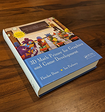

[Contents](./)

[Cartesian Coordinate Systems >>](cartesianspace.html)

Introduction 

First things first, but not necessarily in that order.

— Doctor Who from _Meglos_ (1980)

# About the Online Edition

What you are reading was originally a _book_. Nowadays, most learning about technical topics such as 3D math and video game programming is done online, so some readers may have a tough time visualizing what a technical book might have looked like. If this describes you, see [Figure 1](#book_anachronism).

Figure 1Physical media was once used to communicate technical knowledge

It contained such anachronistic features as an ISBN number, an index, a bibliography, numbered chapters, sections, and pages, and strings of prose not broken up into 280-character chunks, such as the run-on-sentence you are now reading. This physical manifestation of knowledge weighed over 4 lbs, giving it many advantages over online form factors. It could be used to prop open a door or support a monitor at a desired height. You could collect physical books and display them on a shelf as an expression of your identity—real or aspired—and this worked whether or not you had actually read them! But the greatest advantage of a physical book was that you could tell at a glance how long it was. You are reading an 850 page book.

Also, this book was published in 2011. In 2011, _League of Legends_ was two years old, _Skyrim_ had just been released, and the PS4 was still two years away. But we're proud to say that most of the material in this book, like Bilbo when he still had The Ring, hasn't aged a day. Vectors and matrices work the same way, F still equals ma , and people _still_ use Blinn-Phong.

However, some parts of the book are starting to showing their age a bit. The two least theoretical and most practical chapters (Chapters [10](graphics.html) and [12](dynamics.html)) in particular could benefit from an update and a shift of emphasis. We don't cite any publication or website younger than a decade. The jokes and cultural references—borderline to begin with—are now all dated. We'll be working on this; you can help by [providing feedback](#feedback).

# Who Should Read This Book

This book is about 3D math, the geometry and algebra of 3D space. It is designed to teach you how to describe objects and their positions, orientations, and trajectories in 3D using mathematics. This is not a book about computer graphics, simulation, or even computational geometry, although if you plan on studying those subjects, you will definitely need the information here.

This is not just a book for video game programmers. We do assume that a majority of our readers are learning for the purpose of programming video games, but we expect a wider audience and we have designed the book with a diverse audience in mind. If you're a programmer or interested in learning how to make video games, welcome aboard! If you meet neither of these criteria, there's still plenty for you here. We have made every effort to make the book useful to designers and technical artists. Although there are several code snippets in the book, they are (hopefully) easy to read even for nonprogrammers. Most important, even though it is always necessary to understand the surrounding concepts to make sense of the code, the reverse is never true. We use code samples to illustrate how ideas can be implemented on a computer, not to explain the ideas themselves.

The title of this book says it is for “game development,” but a great deal of the material that we cover is applicable outside of video games. Practically anyone who wants to simulate, render, or understand a three-dimensional world will find this book useful. While we do try to provide motivating examples from the world of video game development, since that is our area of expertise and also our primary target audience, you won't be left out if the last game you completed was _Space Quest_.[1](#footnote_1) If your interests lie in more “grown up” things than video games, rest assured that this book is _not_ filled with specific examples from video games about head-shots or severed limbs or how to get the blood spurt to look just right.

# Why You Should Read This Book

This book has many unique features, including its topic, approach, authors, and writing style.

Unique topic. This book fills a gap that has been left by other books on graphics, linear algebra, simulation, and programming. It's an introductory book, meaning we have focused our efforts on providing thorough coverage on fundamental 3D concepts—topics that are normally glossed over in a few quick pages or relegated to an appendix in other books (because, after all, you already know all this stuff). We have found that these very topics are often the sticking points for beginners! In a way, this book is the mirror image of gluing together books on graphics, physics, and curves. Whereas that mythical conglomeration would begin with a brief overview of the mathematical fundamentals, followed by in-depth coverage of the application area, we start with a thorough coverage of the math fundamentals, and then give compact, high-level overviews of the application areas.

This book does try to provide a graceful on-ramp for beginners, but that doesn't mean we'll be stuck in the slow lane forever. There is plenty of material here that is traditionally considered “advanced” and taught in upper-level or graduate classes. In reality, these topics are specialized more than they are difficult, and they have recently become important prerequisites that need to be taught earlier, which is part of what has driven the demand for a book like this.

Unique approach. All authors think that they strike the perfect balance between being pedantic and being chatty in order to best reach their audience, and we are no exception. We recognize, however, that the people who disagree with this glowing self-assessment will mostly find this book too informal (see the index entry for “stickler alert”). We have focused on perspicuous explanations and intuition, and sometimes we have done this at the expense of rigor. Our aim is to simplify, but not to oversimplify. We lead readers to the goal through a path that avoids the trolls and dragons, so why begin the journey by pointing them all out before we've even said what our destination is or why we're going there? However, since we know readers will be crossing the field on their own eventually, after we reach our goal we will turn around to point out where the dangers lie. But we may sometimes need to leave certain troll-slaying to another source, especially if we expect that your usual path won't take you near the danger. Those who intend to be on that land frequently should consult with a local for more intimate knowledge. This is not to say that we think rigor is unimportant; we just think it's easier to get rigor after intuition about the big picture has been established, rather than front-loading every discussion with definitions and axioms needed to handle the edge cases. Frankly, nowadays a reader can pursue concise and formal presentations _free_ on Wikipedia or [Wolfram MathWorld](https://mathworld.wolfram.com), so we don't think any book offers much worth paying for by dwelling excessively on definitions, axioms, proofs, and edge cases, especially for introductory material targeted primarily to engineers.

Unique authors. Our combined experience brings together academic authority with in-the-trenches practical advice. Fletcher Dunn has been making video games professionally since 1996. He worked at Terminal Reality in Dallas, where as principal programmer he was one of the architects of the Infernal engine and lead programmer on _BloodRayne_. He was a technical director for The Walt Disney Company at Wideload Games in Chicago and the lead programmer for _Disney Guilty Party_, IGN's E3 2010 Family Game of the Year. He now works for Valve Software in Bellevue, Washington and has contributed to Steam and all of Valve's recent games. He is the primary author of the [GameNetworkingSockets](https://github.com/ValveSoftware/GameNetworkingSockets) networking library and the [Steam Datagram Relay](https://partner.steamgames.com/doc/features/multiplayer/steamdatagramrelay) service. But his biggest claim to fame by far is as the namesake of Corporal Dunn from _Call of Duty: Modern Warfare 2_.

[Dr. Ian Parberry](http://ianparberry.com/) has more than 35 years of experience in research and teaching in academia. This is his sixth book, his third on game programming. He is currently a tenured full professor in the Department of Computer Science & Engineering at the University of North Texas. He is nationally known as one of the pioneers of game programming in higher education, and has been teaching game programming classes at the University of North Texas continuously since 1993.

Unique writing style. We hope you will enjoy reading this math book (say _what_?) for two reasons. Most important, we want you to _learn_ from this book, and learning something you are interested in is fun. Secondarily, we want you to enjoy _reading_ this book in the same way that you enjoy reading a work of literature. We have no delusions that we're in the same class as Mark Twain, or that this book is destined to become a classic like, say, _The Hitchhikers Guide to the Galaxy_. But one can always have aspirations. Honestly, we are just silly people. At the same time, no writing style should stand in the way of the first priority: clear communication of mathematical knowledge about video games.[2](#footnote_2)

# What You Should Know before Reading This Book

We have tried to make the book accessible to as wide an audience as possible; no book, however, can go back all the way to first principles. We expect from the reader the following basic mathematical skills:

*   Manipulating algebraic expressions, fractions, and basic algebraic laws such as the associative and distributive laws and the quadratic equation.
*   Understanding what variables are, what a function is, how to graph a function, and so on.
*   Some very basic 2D Euclidian geometry, such as what a point is, what a line is, what it means for lines to be parallel and perpendicular, and so forth. Some basic formulas for area and circumference are used in a few places. It's OK if you have temporarily forgotten those—you will hopefully recognize them when you see them.
*   Some prior exposure to trigonometry is best. We give a brief review of trigonometry in the front of this book, but it is not presented with the same level of paced explanation found most elsewhere in this book.
*   Readers with some prior exposure to calculus will have an advantage, but we have restricted our use of calculus in this book to very basic principles, which we will (attempt to) teach in [Chapter 11](kinematics_calculus.html) for those without this training. Only the most high-level concepts and fundamental laws are needed.

Some programming knowledge is helpful, but _not_ required. In several places, we give brief code snippets to show how the ideas being discussed get translated into code. (Also certain procedures are just easier to explain in code.) These snippets are extremely basic, well commented, and require only the most rudimentary understanding of C language syntax (which has been copied to several other languages). Most technical artists or level designers should be able to interpret these snippets with ease.

# Overview

*   [Chapter 1](cartesianspace.html) gets warmed up with some groundwork that it is needed in the rest of the book and which you probably already know. It reviews the Cartesian coordinate system in 2D and 3D and discusses how to use the Cartesian coordinate system to locate points in space. Also included is a very quick refresher on trigonometry and summation notation.
*   [Chapter 2](vectors.html) introduces vectors from a mathematical and geometric perspective and investigates the important relationship between points and vectors. It also discusses a number of vector operations, how to do them, what it means geometrically to do them, and situations for which you might find them useful.
*   [Chapter 3](multiplespaces.html) discusses examples of coordinate spaces and how they are nested in a hierarchy. It also introduces the central concepts of basis vectors and coordinate-space transformations.
*   [Chapter 4](matrixintro.html) introduces matrices from a mathematical and geometric perspective and shows how matrices are a compact notation for the math behind linear transformations.
*   [Chapter 5](matrixtransforms.html) surveys different types of linear transformations and their corresponding matrices in detail. It also discusses various ways to classify transformations.
*   [Chapter 6](matrixmore.html) covers a few more interesting and useful properties of matrices, such as affine transforms and perspective projection, and explains the purpose and workings of four-dimensional vectors and matrices within a three-dimensional world.
*   [Chapter 7](polarspace.html) discusses how to use polar coordinates in 2D and 3D, why it is useful to do so, and how to convert between polar and Cartesian representations.
*   [Chapter 8](orient.html) discusses different techniques for representing orientation and angular displacement in 3D: Euler angles, rotation matrices, exponential maps, and quaternions. For each method, it explains how the method works and presents the advantages and disadvantages of the method and when its use is recommended. It also shows how to convert between different representations.
*   [Chapter 9](geomprims.html) surveys a number of commonly used geometric primitives and discusses how to represent and manipulate them mathematically.
*   [Chapter 10](graphics.html) is a whirlwind lesson on graphics, touching on a few selected theoretical as well as modern practical issues. First, it presents a high-level overview of “how graphics works,” leading up to the rendering equation. The chapter then walks through a few theoretical topics of a mathematical nature. Next it discusses two contemporary topics that are often sources of mathematical difficulty and should be of particular interest to the reader: skeletal animation and bump mapping. Finally, the chapter presents an overview of the real-time graphics pipeline, demonstrating how the theories from the first half of the chapter are implemented in the context of current rendering hardware.
*   [Chapter 11](kinematics_calculus.html) crams two rather large topics into one chapter. It interleaves the highest-level topics from first-semester calculus with a discussion of rigid body kinematics—how to describe and analyze the motion of a rigid body without necessarily understanding its cause or being concerned with orientation or rotation.
*   [Chapter 12](dynamics.html) continues the discussion of rigid body mechanics. It starts with a condensed explanation of classical mechanics, including Newton's laws of motion and basic concepts such as inertia, mass, force, and momentum. It reviews a few basic force laws, such as gravity, springs, and friction. The chapter also considers the rotational analogs of all of the linear ideas discussed up to this point. Due attention is paid to the important topic of collisions. The chapter ends with a discussion of issues that arise when using a computer to simulate rigid bodies.
*   [Chapter 13](curves.html) explains parametric curves in 3D. The first half of the chapter explains how a relatively short curve is represented in some common, important forms: monomial, Bézier, and Hermite. The second half is concerned with fitting together these shorter pieces into a longer curve, called a _spline_. In understanding each system, the chapter considers what controls the system presents to a designer of curves, how to take a description of a curve made by a designer and recreate the curve, and how these controls can be used to construct a curve with specific properties.
*   [Chapter 14](afterword.html) inspires the reader to pursue greatness in video games.
*   Appendix A is an assortment of useful tests that can be performed on geometric primitives. We intend it to be a helpful reference, but it can also make for interesting browsing.
*   Appendix B has all the answers.[3](#footnote_3)

# How to Give Feedback

We calculated the odds that we could write an 800+ page math book free of mistakes. The result was a negative number, which we know can't be right, but is probably pretty close. If you find a bug in this book, or have feedback of any kind, send an email to feedback@gamemath.com or reach out to Fletcher on twitter ([@ZPostFacto](https://twitter.com/zpostfacto)).

Careful. We don't want to learn from this.

— Bill Watterson (1958–) from _Calvin and Hobbes_

1.  Well, you may be left out of a few jokes, like that one. Sorry.
2.  Which is why we've put most of the jokes and useless trivia in footnotes like this. Somehow, we felt like we could get away with more that way.
3.  To the exercises, that is.