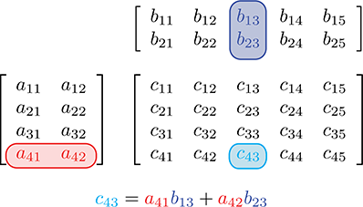
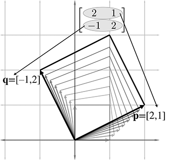
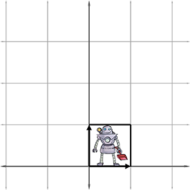
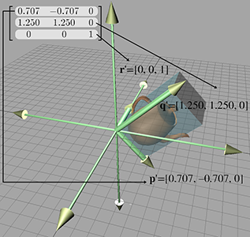

[<< Multiple Coordinate Spaces](multiplespaces.html)

[Contents](./)

[Matrices and Linear Transformations >>](matrixtransforms.html)

Chapter 4 

Introduction to Matrices

Unfortunately, no one can be told what the matrix is.  
You have to see it for yourself.

— Morpheus in _The Matrix_ (1999)

Matrices are of fundamental importance in 3D math, where they are primarily used to describe the relationship between two coordinate spaces. They do this by defining a computation to transform vectors from one coordinate space to another.

This chapter introduces the theory and application of matrices. Our discussion will follow the pattern set in [Chapter 2](vectors.html) when we introduced vectors: mathematical definitions followed by geometric interpretations.

*   [Section 4.1](#math_definition) discusses some of the basic properties and operations of matrices strictly from a mathematical perspective. (More matrix operations are discussed in [Chapter 6](matrixmore.html).)
*   [Section 4.2](#geometric_definition) explains how to interpret these properties and operations geometrically.
*   [Section 4.3](#bigger_picture) puts the use of matrices in this book in context within the larger field of linear algebra.

# 4.1Mathematical Definition of Matrix

In linear algebra, a matrix is a rectangular grid of numbers arranged into _rows_ and _columns_. Recalling our earlier definition of vector as a one-dimensional array of numbers, a matrix may likewise be defined as a _two-dimensional array_ of numbers. (The “two” in “two-dimensional array” comes from the fact that there are rows and columns, and should not be confused with 2D vectors or matrices.) So a vector is an array of scalars, and a matrix is an array of vectors.

This section presents matrices from a purely mathematical perspective. It is divided into eight subsections.

*   [Section 4.1.1](#notation) introduces the concept of matrix dimension and describes some matrix notation.
*   [Section 4.1.2](#square_matrices) describes square matrices.
*   [Section 4.1.3](#vectors_as_matrices) interprets vectors as matrices.
*   [Section 4.1.4](#matrix_transposition) describes matrix transposition.
*   [Section 4.1.5](#matrix_times_scalar) explains how to multiply a matrix by a scalar.
*   [Section 4.1.6](#matrix_times_matrix) explains how to multiply a matrix by another matrix.
*   [Section 4.1.7](#matrix_times_vector) explains how to multiply a vector by a matrix.
*   [Section 4.1.8](#row_vs_column_vectors) compares and contrasts matrices for row and column vectors.

## 4.1.1Matrix Dimensions and Notation

Just as we defined the dimension of a vector by counting how many numbers it contained, we will define the size of a matrix by counting how many rows and columns it contains. We say that a matrix with r rows and c columns is an r×c (read “ r by c ”) matrix. For example, a 4×3 matrix has 4 rows and 3 columns:

A 4×3 matrix

\[4012−54312−4 / 3−11 / 2180\] .

This 4×3 matrix illustrates the standard notation for writing matrices: the numbers are arranged in a grid enclosed by square brackets. Note that some authors may enclose the grid of numbers with parentheses rather than brackets, and other authors use straight vertical lines. We reserve this last notation for an entirely separate concept related to matrices, the _determinant_ of a matrix. (We discuss determinants in [Section 6.1](matrixmore.html#determinant).)

As we mentioned in [Section 2.1](vectors.html#math_definition), in this book we represent a matrix variable with uppercase letters in boldface, for example, M , A , R . When we wish to refer to the individual elements within a matrix, we use subscript notation, usually with the corresponding lowercase letter in italics. This is shown below for a 3×3 matrix:

Subscript notation for matrix elements

\[ m 11 m 12 m 13 m 21 m 22 m 23 m 31 m 32 m 33 \]

The notation m ij denotes the element in M at row i and column j . Matrices use 1-based indices, so the first row and column are numbered 1. For example, m 12 (read “ m one two,” not “ m twelve”) is the element in the first row, second column. Notice that this is different from programming languages such as C++ and Java, which use 0-based array indices. A matrix does not have a column 0 or row 0. This difference in indexing can cause some confusion if matrices are stored using an actual array data type. For this reason, it's common for classes that store small, fixed size matrices of the type used for geometric purposes to give each element its own named member variable, such as float m11, instead of using the language's native array support with something like float elem\[3\]\[3\].

## 4.1.2Square Matrices

Matrices with the same number of rows and columns are called _square_ matrices and are of particular importance. In this book, we are interested in 2×2 , 3×3 , and 4×4 matrices.

The _diagonal elements_ of a square matrix are those elements for which the row and column indices are the same. For example, the diagonal elements of the 3×3 matrix M are m 11 , m 22 , and m 33 . The other elements are _non-diagonal_ elements. The diagonal elements form the _diagonal_ of the matrix:

The diagonal of a 3×3 matrix

If all nondiagonal elements in a matrix are zero, then the matrix is a _diagonal matrix_. The following 4×4 matrix is diagonal:

A diagonal 4×4 matrix

\[3000010000−500002\] .

A special diagonal matrix is the _identity matrix_. The identity matrix of dimension n , denoted I n , is the n×n matrix with 1s on the diagonal and 0s elsewhere. For example, the 3×3 identity matrix is

The 3D identity matrix

I 3\= \[100010001\] .

Often, the context will make clear the dimension of the identity matrix used in a particular situation. In these cases we omit the subscript and refer to the identity matrix simply as I .

The identity matrix is special because it is the multiplicative identity element for matrices. (We discuss matrix multiplication in [Section 4.1.6](#matrix_times_matrix).) The basic idea is that if you multiply a matrix by the identity matrix, you get the original matrix. In this respect, the identity matrix is for matrices what the number 1 is for scalars.

## 4.1.3Vectors as Matrices

Matrices may have any positive number of rows and columns, including one. We have already encountered matrices with one row or one column: vectors! A vector of dimension n can be viewed either as a 1×n matrix, or as an n×1 matrix. A 1×n matrix is known as a _row vector_, and an n×1 matrix is known as a _column vector_. Row vectors are written horizontally, and column vectors are written vertically:

Row and column vectors

\[ 1 2 3 \] \[ 4 5 6 \]

Until now, we have used row and column notations interchangeably. Indeed, geometrically they are identical, and in many cases the distinction is not important. However, for reasons that will soon become apparent, when we use vectors with matrices, we must be very clear if our vector is a row or column vector.

## 4.1.4Matrix Transposition

Given an r×c matrix M , the _transpose_ of M , denoted M T , is the c×r matrix where the columns are formed from the rows of M . In other words, M T ij \= M ji . This “flips” the matrix diagonally. Equations [(4.1)](#matrix_transpose_examples_first) and [(4.2)](#matrix_transpose_examples_last) show two examples of transposing matrices:

(4.1) \[123456789101112\] T \= \[147102581136912\] ,(4.2) \[abcdefghi\] T \= \[adgbehcfi\] .

Transposing matrices

For vectors, transposition turns row vectors into column vectors and vice versa:

Transposing converts between row and column vectors

\[ x y z \] T \= \[ x y z \] \[ x y z \] T \= \[ x y z \]

Transposition notation is often used to write column vectors inline in a paragraph, such as \[1,2,3\] T .

Let's make two fairly obvious, but significant, observations regarding matrix transposition.

*   ( M T ) T \= M , for a matrix M of any dimension. In other words, if we transpose a matrix, and then transpose it again, we get the original matrix. This rule also applies to vectors.
*   Any diagonal matrix D is equal to its transpose: D T \= D . This includes the identity matrix I .

## 4.1.5Multiplying a Matrix with a Scalar

A matrix M may be multiplied with a scalar k , resulting in a matrix of the same dimension as M . We denote matrix multiplication with a scalar by placing the scalar and the matrix side-by-side, usually with the scalar on the left. No multiplication symbol is necessary. The multiplication takes place in a straightforward fashion: each element in the resulting matrix k M is the product of k and the corresponding element in M . For example,

Multiplying a 4×3 matrix by a scalar

k M \=k \[m 11 m 12 m 13 m 21 m 22 m 23 m 31 m 32 m 33 m 41 m 42 m 43 \] \= \[km 11 km 12 km 13 km 21 km 22 km 23 km 31 km 32 km 33 km 41 km 42 km 43 \] .

## 4.1.6Multiplying Two Matrices

In certain situations, we can take the product of two matrices. The rules that govern when matrix multiplication is allowed and how the result is computed may at first seem bizarre.

An r×n matrix A may be multiplied by an n×c matrix B . The result, denoted A B , is an r×c matrix. For example, assume that A is a 4×2 matrix, and B is a 2×5 matrix. Then A B is a 4×5 matrix:

If the number of columns in A does not match the number of rows in B , then the multiplication A B is not defined (although B A may be possible).

Matrix multiplication is computed as follows: let the matrix C be the r×c product A B of the r×n matrix A with the n×c matrix B . Then each element c ij is equal to the vector dot product of row i of A with column j of B :

c ij \=∑ k\=1 n a ik b kj .

This looks complicated, but there is a simple pattern. For each element c ij in the result, locate row i in A and column j in B . Multiply the corresponding elements of the row and column, and sum the products. c ij is equal to this sum, which is equivalent to the dot product of row i in A with column j in B .

Let's look at an example of how to compute c 24 . The element in row 2 and column 4 of C is equal to the dot product of row 2 of A with the column 4 of B :

Another way to help remember the pattern for matrix multiplication is to write B above C . This aligns the proper row from A with a column from B for each element in the result C :

For geometric applications, we are particularly interested in multiplying square matrices—the 2×2 and 3×3 cases being especially important. [Equation (4.3)](#2x2_matrix_multiplication) gives the complete equation for 2×2 matrix multiplication:

2×2 matrix multiplication

(4.3) A B \= \[a 11 a 12 a 21 a 22 \] \[b 11 b 12 b 21 b 22 \] \= \[a 11 b 11 +a 12 b 21 a 11 b 12 +a 12 b 22 a 21 b 11 +a 22 b 21 a 21 b 12 +a 22 b 22 \] .

Let's look at a 2×2 example with some real numbers:

A \= \[−3051 / 2\] , B \= \[−7246\] , A B \= \[−3051 / 2\] \[−7246\] \= \[(−3)(−7)+(0)(4)(−3)(2)+(0)(6)(5)(−7)+(1 / 2)(4)(5)(2)+(1 / 2)(6)\] \= \[21−6−3313\] .

Applying the general matrix multiplication formula to the 3×3 case produces

3×3 matrix multiplication

A B \= \[ a 11 a 12 a 13 a 21 a 22 a 23 a 31 a 32 a 33 \] \[ b 11 b 12 b 13 b 21 b 22 b 23 b 31 b 32 b 33 \] \= \[a 11 b 11 + a 12 b 21 + a 13 b 31 a 11 b 12 + a 12 b 22 + a 13 b 32 a 11 b 13 + a 12 b 23 + a 13 b 33 a 21 b 11 + a 22 b 21 + a 23 b 31 a 21 b 12 + a 22 b 22 + a 23 b 32 a 21 b 13 + a 22 b 23 + a 23 b 33 a 31 b 11 + a 32 b 21 + a 33 b 31 a 31 b 12 + a 32 b 22 + a 33 b 32 a 31 b 13 + a 32 b 23 + a 33 b 33 \] .

Here is a 3×3 example with some real numbers:

A \= \[1−530−2672−4\] , B \= \[−86170−3245\] ; A B \= \[1−530−2672−4\] \[−86170−3245\] \= \[1⋅(−8)+(−5)⋅7 + 3⋅21⋅6+(−5)⋅0 + 3⋅41⋅1 + (−5)⋅(−3) + 3⋅50⋅(−8)+(−2)⋅7 + 6⋅20⋅6+(−2)⋅0 + 6⋅40⋅1 + (−2)⋅(−3) + 6⋅57⋅(−8)+2⋅7 + (−4)⋅27⋅6+2⋅0 + (−4)⋅47⋅1 + 2⋅(−3) + (−4)⋅5\] \= \[−371831−22436−5026−19\] .

Beginning in [Section 6.4](matrixmore.html#homogeneous_matrices) we also use 4×4 matrices.

A few notes concerning matrix multiplication are of interest:

*   Multiplying any matrix M by a square matrix S on either side results in a matrix of the same size as M , provided that the sizes of the matrices are such that the multiplication is allowed. If S is the identity matrix I , then the result is the original matrix M :
    
    M I \= I M \= M .
    
    (That's the reason it's called the _identity_ matrix!)
*   Matrix multiplication is not commutative. In general,
    
    A B ≠ B A .
    
*   Matrix multiplication is associative:
    
    ( A B ) C \= A ( B C ).
    
    (Of course, this assumes that the sizes of A , B , and C are such that multiplication is allowed. Note that if ( A B ) C is defined, then A ( B C ) is always defined as well.) The associativity of matrix multiplication extends to multiple matrices. For example,
    
    A B C D E F \=(((( AB ) C ) D ) E ) F \= A (((( BC ) D ) E ) F )\=( AB )( CD )( EF ).
    
    It is interesting to note that although all parenthesizations compute the correct result, some groupings require fewer scalar multiplications than others.[1](#footnote_1)
*   Matrix multiplication also associates with multiplication by a scalar or a vector:
    
    (k A ) B \=k( A B )\= A (k B ),( v A ) B \= v ( A B ).
    
*   Transposing the product of two matrices is the same as taking the product of their transposes in reverse order:
    
    ( A B )T\= B T A T .
    
    This can be extended to more than two matrices:
    
    ( M 1 M 2⋯ M n−1 M n)T\= M n T M n−1 T ⋯ M 2 T M 1 T .
    

## 4.1.7Multiplying a Vector and a Matrix

Since a vector can be considered a matrix with one row or one column, we can multiply a vector and a matrix by applying the rules discussed in the previous section. Now it becomes very important whether we are using row or column vectors. Equations [(4.4)](#3d_row_vector_times_3x3_matrix)–[(4.7)](#3d_column_vector_times_3x3_matrix) show how 3D row and column vectors may be pre- or post-multiplied by a 3×3 matrix:

Multiplying 3D row and column vectors with a 3×3 matrix

(4.4) \[ x y z \] \[ m 11 m 12 m 13 m 21 m 22 m 23 m 31 m 32 m 33 \] \= \[ xm 11 + ym 21 + zm 31 xm 12 + ym 22 + zm 32 xm 13 + ym 23 + zm 33 \] ; (4.5) \[ m 11 m 12 m 13 m 21 m 22 m 23 m 31 m 32 m 33 \] \[ x y z \] \= \[ xm 11 +ym 12 +zm 13 xm 21 +ym 22 +zm 23 xm 31 +ym 32 +zm 33 \] ; \[ m 11 m 12 m 13 m 21 m 22 m 23 m 31 m 32 m 33 \] \[ x y z \] \=(undefined);(4.7) \[ x y z \] \[ m 11 m 12 m 13 m 21 m 22 m 23 m 31 m 32 m 33 \] \=(undefined).

As you can see, when we multiply a row vector on the left by a matrix on the right, as in [Equation (4.4)](#3d_row_vector_times_3x3_matrix), the result is a row vector. When we multiply a matrix on the left by a column vector on the right, as in [Equation (4.5)](#3x3_matrix_times_3d_column_vector), the result is a column vector. (Please observe that this result _is_ a column vector, even though it looks like a matrix.) The other two combinations are not allowed: you cannot multiply a matrix on the left by a row vector on the right, nor can you multiply a column vector on the left by a matrix on the right.

Let's make a few interesting observations regarding vector-times-matrix multiplication. First, each element in the resulting vector is the dot product of the original vector with a single row or column from the matrix.

Second, each element in the matrix determines how much “weight” a particular element in the input vector contributes to an element in the output vector. For example, in [Equation (4.4)](#3d_row_vector_times_3x3_matrix) when row vectors are used, m 12 controls how much of the input x value goes towards the output y value.

Third, vector-times-matrix multiplication distributes over vector addition, that is, for vectors v , w , and matrix M ,

( v + w ) M \= v M + w M .

Finally, and perhaps most important of all, the result of the multiplication is a linear combination of the rows or columns of the matrix. For example, in [Equation (4.5)](#3x3_matrix_times_3d_column_vector), when column vectors are used, the resulting column vector can be interpreted as a linear combination of the columns of the matrix, where the coefficients come from the vector operand. This is a key fact, not just for our purposes but also for linear algebra in general, so bear it in mind. We will return to it shortly.

## 4.1.8Row versus Column Vectors

This section explains why the distinction between row and column vectors is significant and gives our rationale for preferring row vectors. In [Equation (4.4)](#3d_row_vector_times_3x3_matrix), when we multiply a row vector on the left with matrix on the right, we get the row vector

\[ xm 11 +ym 21 +zm 31 xm 12 +ym 22 +zm 32 xm 13 +ym 23 +zm 33 \] .

Compare that with the result from [Equation (4.5)](#3x3_matrix_times_3d_column_vector), when a column vector on the right is multiplied by a matrix on the left:

\[ xm 11 +ym 12 +zm 13 xm 21 +ym 22 +zm 23 xm 31 +ym 32 +zm 33 \] .

Disregarding the fact that one is a row vector and the other is a column vector, the values for the components of the vector are _not_ the same! Thisis why the distinction between row and column vectors is soimportant.

Although some matrices in video game programming do represent arbitrary systems of equations, a much larger majority are transformation matrices of the type we have been describing, which express relationships between coordinate spaces. For this purpose, we find row vectors to be preferable for the “eminently sensible” reason [\[1\]](#reference_1) that the order of transformations reads like a sentence from left to right. This is especially important when more than one transformation takes place. For example, if we wish to transform a vector v by the matrices A , B , and C , in that order, we write v A B C , with the matrices listed in order of transformation from left to right. If column vectors are used, then the vector is on the right, and so the transformations will occur in order from right to left. In this case, we would write C B A v . We discuss concatenation of multiple transformation matrices in detail in [Section 5.6](matrixtransforms.html#combining_transformations).

Unfortunately, row vectors lead to very “wide” equations; using column vectors on the right certainly makes things look better, especially as the dimension increases. (Compare the ungainliness of [Equation (4.4)](#3d_row_vector_times_3x3_matrix) with the sleekness of [Equation (4.5)](#3x3_matrix_times_3d_column_vector).) Perhaps this is why column vectors are the near universal standard in practically every other discipline. For most video game programming, however, readable computer code is more important than readable equations. For this reason, in this book we use row vectors in almost all cases where the distinction is relevant. Our limited use of column vectors is for aesthetic purposes, when either there are no matrices involved or those matrices are not transformation matrices and the left-to-right reading order is not helpful.

As expected, different authors use different conventions. Many graphics books and application programming interfaces (APIs), such as DirectX, use row vectors. But other APIs, such as OpenGL and the customized ports of OpenGL onto various consoles, use column vectors. And, as we have said, nearly every other science that uses linear algebra prefers column vectors. So be very careful when using someone else's equation or source code that you know whether it assumes row or column vectors.

If a book uses column vectors, its equations for matrices will be transposed compared to the equations we present in this book. Also, when column vectors are used, vectors are pre-multiplied by a matrix, as opposed to the convention chosen in this book, to multiply row vectors by a matrix on the right. This causes the order of multiplication to be reversed between the two styles when multiple matrices and vectors are multiplied together. For example, the multiplication v A B C is valid only with row vectors. The corresponding multiplication would be written C B A v if column vectors were used. (Again, note that in this case A , B , and C would be transposed as compared to these matrices in the row vector case.)

Mistakes like this involving transposition can be a common source of frustration when programming 3D math. Luckily, with properly designed C++ classes, direct access to the individual matrix elements is seldom needed, and these types of errors can be minimized.

# 4.2Geometric Interpretation of Matrix

In general, a square matrix can describe any _linear transformation_. In [Section 5.7.1](matrixtransforms.html#linear_transformations), we provide a complete definition of linear transformation, but for now, it suffices to say that a linear transformation preserves straight and parallel lines, and that there is no translation—that is, the origin does not move. However, other properties of the geometry, however, such as lengths, angles, areas, and volumes, _are_ possibly altered by the transformation. In a nontechnical sense, a linear transformation may “stretch” the coordinate space, but it doesn't “curve” or “warp” it. This is a very useful set of transformations, including

*   rotation
*   scale
*   orthographic projection
*   reflection
*   shearing

[Chapter 5](matrixtransforms.html) derives matrices that perform all of these operations. For now, though, let's just attempt a general understanding of the relationship between a matrix and the transformation it represents.

The quotation at the beginning of this chapter is not only a line from a great movie, it's true for linear algebra matrices as well. Until you develop an ability to visualize a matrix, it will just be nine numbers in a box. We have stated that a matrix represents a coordinate space transformation. So when we visualize the matrix, we are visualizing the transformation, the new coordinate system. But what does this transformation look like? What is the relationship between a particular 3D transformation (i.e. rotation, shearing, etc.) and those nine numbers inside a 3×3 matrix? How can we construct a matrix to perform a given transform (other than just copying the equations blindly out of a book)?

To begin to answer this question, let's watch what happens when the standard basis vectors i \=\[1,0,0\] , j \=\[0,1,0\] , and k \=\[0,0,1\] are multiplied by an arbitrary matrix M :

i M \= \[ 1 0 0 \] \[ m 11 m 12 m 13 m 21 m 22 m 23 m 31 m 32 m 33 \] \= \[ m 11 m 12 m 13 \] ; j M \= \[ 0 1 0 \] \[ m 11 m 12 m 13 m 21 m 22 m 23 m 31 m 32 m 33 \] \= \[ m 21 m 22 m 23 \] ; k M \= \[ 0 0 1 \] \[ m 11 m 12 m 13 m 21 m 22 m 23 m 31 m 32 m 33 \] \= \[ m 31 m 32 m 33 \] .

In other words, the first row of M contains the result of performing the transformation on i , the second row is the result of transforming j , and the last row is the result of transforming k .

Once we know what happens to those basis vectors, we know everything about the transformation! This is because any vector can be written as a linear combination of the standard basis, as

v \= v x i + v y j + v z k .

Multiplying this expression by our matrix on the right, we have

v M \= ( v x i + v y j + v z k ) M (4.8)\=( v x i ) M +( v y j ) M +( v z k ) M \= v x ( i M )+ v y ( j M )+ v z ( k M )\= v x \[ m 11 m 12 m 13 \] + v y \[ m 21 m 22 m 23 \] + v z \[ m 31 m 32 m 33 \] .

Here we have confirmed an observation made in [Section 4.1.7](#matrix_times_vector): the result of a vector × matrix multiplication is a linear combination of the rows of the matrix. The key is to _interpret those row vectors as basis vectors_. In this interpretation, matrix multiplication is simply a compact way to encode the operations for coordinate space transformations developed in [Section 3.3.3](multiplespaces.html#basis_vectors). A small change of notation will make this connection more explicit. Remember that we introduced the convention to use the symbols p , q , and r to refer to a set of basis vectors. Putting these vectors as rows in our matrix M , we can rewrite the last line of [Equation (4.8)](#vector_expanded_times_matrix) as

v M \= \[ v x v y v z \] \[− p −− q −− r −\] \= v x p + v y q + v z r .

Let's summarize what we have said.

By understanding how the matrix transforms the standard basis vectors, we know everything there is to know about the transformation. Since the results of transforming the standard basis are simply the rows[1](#footnote_1) of the matrix, we interpret those rows as the basis vectors of a coordinate space.

We now have a simple way to take an arbitrary matrix and visualize what sort of transformation the matrix represents. Let's look at a couple of examples—first, a 2D example to get ourselves warmed up, and then a full-fledged 3D example. Examine the following 2×2 matrix:

M \= \[21−12\] .

What sort of transformation does this matrix represent? First, let's extract the basis vectors p and q from the rows of the matrix:

p \= \[ 2 1 \] ; q \= \[ −1 2 \] .

[Figure 4.1](#2d_matrix_l) shows these vectors in the Cartesian plane, along with the “original” basis vectors (the x \-axis and y \-axis), for reference.

Figure 4.1 Visualizing the row vectors of a 2D transform matrix

As [Figure 4.1](#2d_matrix_l) illustrates, the +x basis vector is transformed into the vector labeled p above, and the y basis vector is transformed into the vector labeled q . So one way to visualize a matrix in 2D is to visualize the L shape formed by the row vectors. In this example, we can easily see that part of the transformation represented by matrix M is a counterclockwise rotation of approximately 26.5 o .

Of course, _all_ vectors are affected by a linear transformation, not just the basis vectors. We can get a very good idea what this transformation looks like from the L, and we can gain further insight on the effect the transformation has on the rest of the vectors by completing the 2D parallelogram formed by the basis vectors, as shown in [Figure 4.2](#2d_matrix_box).

Figure 4.2 The 2D parallelogram formed by the rows of a matrix

This parallelogram is also known as a “skew box.” Drawing an object inside the box can also help, as illustrated in [Figure 4.3](#2d_matrix_object).

Figure 4.3Drawing an object inside the box helps visualize the transformation

Now it is clear that our example matrix M not only rotates the coordinate space, it also scales it.

We can extend the techniques we used to visualize 2D transformations into 3D. In 2D, we had two basis vectors that formed an L—in 3D, we have three basis vectors, and they form a “tripod.” First, let's show an object before transformation. [Figure 4.4](#3d_matrix_object_before) shows a teapot, a unit cube, and the basis vectors in the “identity” position.

Figure 4.4 Teapot, unit cube, and basis vectors before transformation

(To avoid cluttering up the diagram, we have not labeled the +z basis vector \[0,0,1\] , which is partially obscured by the teapot and cube.)

Now consider the 3D transformation matrix

\[0.707−0.70701.2501.2500001\] .

Extracting the basis vectors from the rows of the matrix, we can visualize the transformation represented by this matrix. The transformed basis vectors, cube, and teapot are shown in [Figure 4.5](#3d_matrix_object_after).

Figure 4.5 Teapot, unit cube, and basis vectors after transformation

As we can see, the transformation consists of a clockwise rotation of 45 o about the z \-axis as well as a nonuniform scale that makes the teapot “taller” than it was originally. Notice that the +z basis vector is unaltered by the transformation, because the third row of the matrix is \[0,0,1\] .

By interpreting the rows of a matrix as basis vectors, we have a tool for deconstructing a matrix. But we also have a tool for _constructing_ one! Given a desired transformation (i.e., rotation, scale, and so on), we can derive a matrix that represents that transformation. All we have to do is figure out what the transformation does to the basis vectors, and then place those transformed basis vectors into the rows of a matrix. We use this tool repeatedly in [Chapter 5](matrixtransforms.html) to derive the matrices to perform basic linear transformations such as rotation, scale, shear, and reflection.

The bottom line about transformation matrices is this: there's nothing especially magical about matrices. Once we understand that coordinates are best understood as coefficients in a linear combination of the basis vectors (see [Section 3.3.3](multiplespaces.html#basis_vectors)), we really know all the math we need to know to do transformations. So from one perspective, matrices are just a compact way to write things down. A slightly less obvious but much more compelling reason to cast transformations in matrix notation is to take advantage of the large general-purpose toolset from linear algebra. For example, we can take simple transformations and derive more complicated transformations through matrix concatenation; more on this in [Section 5.6](matrixtransforms.html#combining_transformations).

Before we move on, let's review the key concepts of [Section 4.2](#geometric_definition).

*   The rows of a square matrix can be interpreted as the basis vectors of a coordinate space.
*   To transform a vector from the original coordinate space to the new coordinate space, we multiply the vector by the matrix.
*   The transformation from the original coordinate space to the coordinate space defined by these basis vectors is a linear transformation. A linear transformation preserves straight lines, and parallel lines remain parallel. However, angles, lengths, areas, and volumes may be altered after transformation.
*   Multiplying the zero vector by any square matrix results in the zero vector. Therefore, the linear transformation represented by a square matrix has the same origin as the original coordinate space—the transformation does not contain translation.
*   We can visualize a matrix by visualizing the basis vectors of the coordinate space after transformation. These basis vectors form an \`L' in 2D, and a tripod in 3D. Using a box or auxiliary object also helps in visualization.

# 4.3The Bigger Picture of Linear Algebra

At the start of [Chapter 2](vectors.html), we warned you that in this book we are focusing on just one small corner of the field of linear algebra—the geometric applications of vectors and matrices. Now that we've introduced the nuts and bolts, we'd like to say something about the bigger picture and how our part relates to it.

Linear algebra was invented to manipulate and solve systems of linear equations. For example, a typical introductory problem in a traditional course on linear algebra is to solve a system of equations such as

−5x1+x2+x3\=−10,2x1+2x2+4x3\=12,x1−3x3\=9,

which has the solution

x1\=3,x2\=7,x3\=−2.

Matrix notation was invented to avoid the tedium involved in duplicating every x and \= . For example, the system above can be more quickly written as

\[−51122410−3\] \[ x1 x2 x3 \] \= \[ −10 12 9 \] .

Perhaps the most direct and obvious place in a video game where a large system of equations must be solved is in the physics engine. The constraints to enforce nonpenetration and satisfy user-requested joints become a system of equations relating the velocities of the dynamic bodies. This large system[3](#footnote_3) is then solved each and every simulation frame. Another common place for traditional linear algebra methods to appear is in least squares approximation and other data-fitting applications.

Systems of equations can appear where you don't expect them. Indeed, linear algebra has exploded in importance with the vast increase in computing power in the last half century because many difficult problems that were previously neither discrete nor linear are being approximated through methods that are both, such as the finite element method. The challenge begins with knowing how to transform the original problem into a matrix problem in the first place, but the resulting systems are often very large and can be difficult to solve quickly and accurately. Numeric stability becomes a factor in the choice of algorithms. The matrices that arise in practice are not boxes full of random numbers; rather, they express organized relationships and have a great deal of structure. Exploiting this structure artfully is the key to achieving speed and accuracy. The diversity of the types of structure that appear in applications explains why there is so very much to know about linear algebra, especially numerical linear algebra.

This book is intended to fill a gap by providing the geometric intuition that is the bread and butter of video game programming but is left out of most linear algebra textbooks. However, we certainly know there is a larger world out there for you. Although traditional linear algebra and systems of equations do not play a prominent role for basic video game programming, they are essential for many advanced areas. Consider some of the technologies that are generating buzz today: fluid, cloth, and hair simulations (and rendering); more robust procedural animation of characters; real-time global illumination; machine vision; gesture recognition; and many more. What these seemingly diverse technologies all have in common is that they involve difficult linear algebra problems.

One excellent resource for learning the bigger picture of linear algebra and scientific computing is Professor Gilbert Strang's series of lectures, which can be downloaded free from MIT OpenCourseWare at [ocw.mit.edu](https://ocw.mit.edu). He offers a basic undergraduate linear algebra course as well as graduate courses on computational science and engineering. The companion textbooks he writes for his classes [\[3\]](#reference_3)[\[2\]](#reference_2) are enjoyable books aimed at engineers (rather than math sticklers) and are recommended, but be warned that his writing style is a sort of shorthand that you might have trouble understanding without the lectures.

# Exercises

Use the following matrices for questions 1–3:  

A \= \[134−81206−3−1510−25\] B \= \[kx000ky000kz\] C \= \[158−73\] D \= \[agbhcidjfk\] E \= \[ 0 1 3 \] F \= \[ x y z w \] G \= \[ 10 20 30 1 \] H \= \[ α β γ \]

  

1.  For each matrix, give the dimensions of the matrix and identify whether it is square and/or diagonal.
2.  Transpose each matrix.
3.  Find all the possible pairs of matrices that can be legally multiplied, and give the dimensions of the resulting product. Include “pairs” in which a matrix is multiplied by itself. (Hint: there are 14 pairs.)
4.  Compute the following matrix products. If the product is not possible, just say so.
    *   (a) \[1−250\] \[−3741 / 3\]
    *   (b) \[6−7−45\] \[ 3 3 \]
    *   (c) \[ 3 −1 4 \] \[−20357−61−42\]
    *   (d) \[ x y z w \] \[1000010000100001\]
    *   (e) \[ 7 −2 7 3 \] \[ −5 1 \]
    *   (f) \[1001\] \[m 11 m 12 m 21 m 22 \]
    *   (g) \[ 3 3 \] \[6−7−45\]
    *   (h) \[a 11 a 12 a 13 a 21 a 22 a 23 a 31 a 32 a 33 \] \[b 11 b 12 b 13 b 21 b 22 b 23 \]
5.  For each of the following matrices, multiply on the left by the row vector \[5,−1,2\] . Then consider whether multiplication on the right by the column vector \[5,−1,2\] T will give the same or a different result. Finally, perform this multiplication to confirm or correct your expectation.
    1.  (a) \[100010001\]
    2.  (b) \[25−3171−2−14\]
    3.  (c) \[17270−32−3−1\]  
        This is an example of a _symmetric_ matrix. A square matrix is symmetric if A T \= A .
    4.  (d) \[0−4340−1−310\]  
        This is an example of a _skew symmetric_ or _antisymmetric_ matrix. A square matrix is skew symmetric if A T \=− A . This implies that the diagonal elements of a skew symmetric matrix must be 0.
6.  Manipulate the following matrix expressions to remove the parentheses.
    1.  (a) ( ( A T ) T ) T
    2.  (b) ( BA T ) T ( CD T )
    3.  (c) ( ( D T C T ) ( AB ) T ) T
    4.  (d) ( ( AB ) T ( CDE ) T ) T
7.  Describe the transformation a M \= b represented by each of the following matrices.
    1.  (a) M \= \[0−110\]
    2.  (b) M \= \[2222−2222\]
    3.  (c) M \= \[2002\]
    4.  (d) M \= \[4007\]
    5.  (e) M \= \[−1001\]
    6.  (f) M \= \[0−220\]
8.  For 3D row vectors a and b , construct a 3×3 matrix M such that a × b \= a M . That is, show that the cross product of a and b can be represented as the matrix product a M , for some matrix M . (Hint: the matrix will be skew-symmetric.)
9.  Match each of the following figures (1–4) with their corresponding transformations.
    
    1.  \[100−1\]
    2.  \[2.5002.5\]
    3.  \[−22−22−2222\]
    4.  \[1.5002.0\]
    
      
    
10.  Given the 10×1 column vector v , create a matrix M that, when multiplied by v , produces a 10×1 column vector w such that
    
    w i \= { v 1 if~i\=1, v i − v i−1 if~i\>1.
    
      
    Matrices of this form arise when some continuous function is discretized. Multiplication by this _first difference_ matrix is the discrete equivalent of continuous differentiation. (We'll learn about differentiation in [Chapter 11](kinematics_calculus.html) if you haven't already had calculus.)
11.  Given the 10×1 column vector v , create a matrix N that, when multiplied by v , produces a 10×1 column vector w such that
    
    w i \=∑ j\=1 i v j .
    
    In other words, each element becomes the sum of that element and all previous elements.  
    This matrix performs the discrete equivalent of _integration_, which as you might already know (but you certainly will know after reading [Chapter 11](kinematics_calculus.html)) is the inverse operation of differentiation.
12.  Consider M and N , the matrices from Exercises [10](#first_difference_matrix) and [11](#discrete_integration_matrix).
    1.  Discuss your expectations of the product M N .
    2.  Discuss your expectations of the product N M .
    3.  Calculate both M N and N M . Were your expectations correct?

To be civilized is to be potentially master of all possible ideas,  
and that means that one has got beyond being shocked,  
although one preserves one's own moral aesthetic preferences.

— Oliver Wendell Holmes (1809–1894)

References

\[1\] Tomas Akenine-Möller, Eric Haines, and Natty Hoffman.   _Real-Time Rendering_, Third edition.   Natick, MA: A K Peters, Ltd., 2008.   [http://www.realtimerendering.com/](http://www.realtimerendering.com/).

\[2\] Gilbert Strang.   _Computational Science and Engineering_.   Cambridge, UK: Wellesley-Cambridge, 2007.

\[3\] Gilbert Strang.   _Introduction to Linear Algebra_, Fourth edition.   Cambridge, UK: Wellesley-Cambridge, 2009.

1.  The problem of finding the parenthesization that minimizes the number of scalar multiplications is known as the _matrix chain_ problem.
2.  It's rows in this book. If you're using column vectors, it's the columns of the matrix.
3.  It's a system of _inequalities_, but similar principles apply.