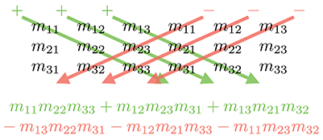
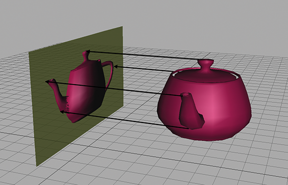
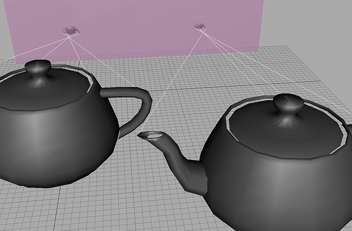
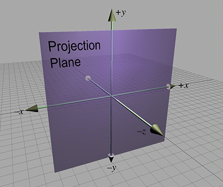

[<< Matrices and Linear Transformations](matrixtransforms.html)

[Contents](./)

[Polar Coordinate Systems >>](polarspace.html)

Chapter 6 

More on Matrices

Man's mind stretched to a new idea  
never goes back to its original dimensions.

— Oliver Wendell Holmes Jr. (1841–1935)

[Chapter 4](matrixintro.html) presented a few of the most of the important properties and operations of matrices and discussed how matrices can be used to express geometric transformations in general. [Chapter 5](matrixtransforms.html) considered matrices and geometric transforms in detail. This chapter completes our coverage of matrices by discussing a few more interesting and useful matrixoperations.

*   [Section 6.1](#determinant) covers the _determinant_ of a matrix.
*   [Section 6.2](#inverse) covers the _inverse_ of a matrix.
*   [Section 6.3](#orthogonal_matrices) discusses _orthogonal_ matrices.
*   [Section 6.4](#homogeneous_matrices) introduces _homogeneous_ vectors and 4×4 matrices, and shows how they can be used to perform affine transformations in3D.
*   [Section 6.5](#perspective_projection) discusses _perspective projection_ and shows how to do it with a 4×4 matrix.

# 6.1Determinant of a Matrix

For square matrices, there is a special scalar called the _determinant_ of the matrix. The determinant has many useful properties in linear algebra, and it also has interesting geometric interpretations.

As is our custom, we first discuss some math, and then make some geometric interpretations. [Section 6.1.1](#determinant_2x2_3x3) introduces the notation for determinants and gives the linear algebra rules for computing the determinant of a 2×2 or 3×3 matrix. [Section 6.1.2](#minors_cofactors) discusses _minors_ and _cofactors_. Then, [Section 6.1.3](#determinant_arbitrary_size) shows how to compute the determinant of an arbitrary n×n matrix, by using minors and cofactors. Finally, [Section 6.1.4](#determinant_geometry) interprets the determinant from a geometric perspective.

## 6.1.1 Determinants of 2×2 and 3×3 matrices

The determinant of a square matrix M is denoted | M | or, in some other books, as “ det  M .” The determinant of a nonsquare matrix is undefined. This section shows how to compute determinants of 2×2 and 3×3 matrices. The determinant of a general n×n matrix, which is fairly complicated, is discussed in [Section 6.1.3](#determinant_arbitrary_size)

The determinant of a 2×2 matrix is given by

Determinant of a 2×2 matrix

(6.1) | M | \= | m 11 m 12 m 21 m 22 | \=m 11 m 22 −m 12 m 21 .

Notice that when we write the determinant of a matrix, we replace the brackets with vertical lines.

[Equation (6.1)](#2x2_determinant) can be remembered easier with the following diagram. Simply multiply entries along the diagonal and back-diagonal, then subtract the back-diagonal term from the diagonal term.

Some examples help to clarify the simple calculation:

| 21−12 | \=(2)(2)−(1)(−1)\=4+1\=5; | −3425 | \=(−3)(5)−(4)(2)\=−15−8\=−23; | abcd | \=ad−bc.

The determinant of a 3×3 matrix is given by

Determinant of a 3×3 matrix

| m 11 m 12 m 13 m 21 m 22 m 23 m 31 m 32 m 33 | (6.2)\=m 11 m 22 m 33 +m 12 m 23 m 31 +m 13 m 21 m 32 −m 13 m 22 m 31 −m 12 m 21 m 33 −m 11 m 23 m 32 \=  m 11 (m 22 m 33 −m 23 m 32 )+m 12 (m 23 m 31 −m 21 m 33 )+m 13 (m 21 m 32 −m 22 m 31 ).

A similar diagram can be used to memorize [Equation (6.2)](#determinant_3x3_definition_unfactored). We write two copies of the matrix M side by side and multiply entries along the diagonals and back-diagonals, adding the diagonal terms and subtracting the back-diagonal terms.

For example,

| −4−3302−214−1 | \=−42−1−24+−3−210−1+30421\=−4−2−8+−3−20+302\=−46+−3−2+3−2\=−24+6+−6(6.3)\=−24.

If we interpret the rows of a 3×3 matrix as three vectors, then the determinant of the matrix is equivalent to the so-called “triple product” of the three vectors:

3×3 determinant vs. 3D vector triple product

| a x a y a z b x b y b z c x c y c z | \= ( a y b z − a z b y ) c x + ( a z b x − a x b z ) c y + ( a x b y − a y b x ) c z \= ( a × b ) ⋅ c .

## 6.1.2Minors and Cofactors

Before we can look at determinants in the general case, we need to introduce some other constructs: _minors_ and _cofactors_.

Assume M is a matrix with r rows and c columns. Consider the matrix obtained by deleting row i and column j from M . This matrix will obviously have r−1 rows and c−1 columns. The determinant of this submatrix, denoted M {ij} is known as a _minor_ of M . For example, the minor M {12} is the determinant of the 2×2 matrix that is the result of deleting row 1 and column 2 from the 3×3 matrix M :

A minor of a 3×3 matrix

M \= \[−4−3302−214−1\]     ⟹    M {12} \= | 0−21−1 | \=2.

The _cofactor_ of a square matrix M at a given row and column is the same as the corresponding minor, but with alternating minors negated:

Matrix cofactor

(6.4)C {ij} \=(−1) i+j M {ij} .

As shown in [Equation (6.4)](#cofactor_definition), we use the notation C {ij} to denote the cofactor of M in row i , column j . The (−1) (i+j) term has the effect of negating every other cofactor in a checkerboard pattern:

\[+−+−⋯−+−+⋯+−+−⋯−+−+⋯ ⋮ ⋮ ⋮ ⋮ ⋱\] .

In the next section, we use minors and cofactors to compute determinants of an arbitrary dimension n×n , and again in [Section 6.2](#inverse) to compute the inverse of a matrix.

## 6.1.3Determinants of Arbitrary n×n Matrices

Several equivalent definitions exist for the determinant of a matrix of arbitrary dimension n×n . The definition we consider here expresses a determinant in terms of its cofactors. This definition is recursive, since cofactors are themselves signed determinants. First, we arbitrarily select a row or column from the matrix. Now, for each element in the row or column, we multiply this element by the corresponding cofactor. Summing these products yields the determinant of the matrix. For example, arbitrarily selecting row i , the determinant can be computed by

(6.5) | M | \=∑ j\=1 n m ij C {ij} \=∑ j\=1 n m ij (−1) i+j M {ij} .

Computing an n×n determinant by using cofactors of row i

As it turns out, it doesn't matter which row or column we choose; they all will produce the same result.

Let's look at an example. We'll rewrite the equation for 3×3 determinant using [Equation (6.5)](#determinant_nxn):

Recursive definition of determinant applied to 3×3 case

| m 11 m 12 m 13 m 21 m 22 m 23 m 31 m 32 m 33 | \=m 11 | m 22 m 23 m 32 m 33 | −m 12 | m 21 m 23 m 31 m 33 | +m 13 | m 21 m 22 m 31 m 32 | .

Now, let's derive the 4×4 matrix determinant:

Recursive definition of determinant applied to 4×4 case

| m 11 m 12 m 13 m 14 m 21 m 22 m 23 m 24 m 31 m 32 m 33 m 34 m 41 m 42 m 43 m 44 | \=m 11 | m 22 m 23 m 24 m 32 m 33 m 34 m 42 m 43 m 44 | −m 12 | m 21 m 23 m 24 m 31 m 33 m 34 m 41 m 43 m 44 | +m 13 | m 21 m 22 m 24 m 31 m 32 m 34 m 41 m 42 m 44 | −m 14 | m 21 m 22 m 23 m 31 m 32 m 33 m 41 m 42 m 43 | .

Expanding the cofactors, we have

Determinant of a 4×4 matrix in expanded form

 m 11 \[ m 22 (m 33 m 44 − m 34 m 43 )+m 23 (m 34 m 42 − m 32 m 44 )+m 24 (m 32 m 43 − m 33 m 42 ) \] −m 12 \[ m 21 (m 33 m 44 − m 34 m 43 )+m 23 (m 34 m 41 − m 31 m 44 )+m 24 (m 31 m 43 − m 33 m 41 ) \] +m 13 \[ m 21 (m 32 m 44 − m 34 m 42 )+m 22 (m 34 m 41 − m 31 m 44 )+m 24 (m 31 m 42 − m 32 m 41 ) \] −m 14 \[ m 21 (m 32 m 43 − m 33 m 42 )+m 22 (m 33 m 41 − m 31 m 43 )+m 23 (m 31 m 42 − m 32 m 41 ) \] .

As you can imagine, the complexity of explicit formulas for determinants of higher degree grows rapidly. Luckily, we can perform an operation known as “pivoting,” which doesn't affect the value of the determinant, but causes a particular row or column to be filled with zeroes except for a single element (the “pivot” element). Then only one cofactor has to be evaluated. Since we won't need determinants of matrices higher than the 4×4 case, anyway, a complete discussion of pivoting is outside the scope of this book.

Let's briefly state some important characteristics concerning determinants.

*   The determinant of an identity matrix of any dimension is 1: Determinant of identity matrix
    
    | I | \=1.
    
*   The determinant of a matrix product is equal to the product of the determinants: Determinant of matrix product
    
    | A B | \= | A | | B | .
    
    This extends to more than two matrices:
    
    | M 1 M 2⋯ M n−1 M n | \= | M 1 | | M 2 | ⋯ | M n−1 | | M n | .
    
*   The determinant of the transpose of a matrix is equal to the original determinant: Determinant of matrix transpose
    
    | M T | \= | M | .
    
*   If any row or column in a matrix contains all 0s, then the determinant of that matrix is 0: Determinant of matrix with a row/column full of 0s
    
    | ??⋯???⋯? ⋮ ⋮ ⋮ 00⋯0 ⋮ ⋮ ⋮ ??⋯? | \= | ??⋯0⋯???⋯0⋯? ⋮ ⋮ ⋮ ⋮ ??⋯0⋯? | \=0.
    
*   Exchanging any pair of rows negates the determinant: Swapping rows negates the determinant
    
    | m 11 m 12 ⋯m 1n m 21 m 22 ⋯m 2n ⋮ ⋮ ⋮ m i1 m i2 ⋯m in ⋮ ⋮ ⋮ m j1 m j2 ⋯m jn ⋮ ⋮ ⋮ m n1 m n2 ⋯m nn | \=− | m 11 m 12 ⋯m 1n m 21 m 22 ⋯m 2n ⋮ ⋮ ⋮ m j1 m j2 ⋯m jn ⋮ ⋮ ⋮ m i1 m i2 ⋯m in ⋮ ⋮ ⋮ m n1 m n2 ⋯m nn | .
    
    This same rule applies for exchanging a pair of columns.
*   Adding any multiple of a row (column) to another row (column) _does not change_ the value of the determinant! Adding one row to  
    another doesn't  
    change the  
    determinant
    
    | m 11 m 12 ⋯m 1n m 21 m 22 ⋯m 2n ⋮ ⋮ ⋮ m i1 m i2 ⋯m in ⋮ ⋮ ⋮ m j1 m j2 ⋯m jn ⋮ ⋮ ⋮ m n1 m n2 ⋯m nn | \= | m 11 m 12 ⋯m 1n m 21 m 22 ⋯m 2n ⋮ ⋮ ⋮ m i1 + km j1 m i2 + km j2 ⋯m in + km jn ⋮ ⋮ ⋮ m j1 m j2 ⋯m jn ⋮ ⋮ ⋮ m n1 m n2 ⋯m nn |
    
      
    This explains why our shear matrices from [Section 5.5](matrixtransforms.html#shearing) have a determinant of 1.

Figure 6.1 The determinant in 2D is the signed area of the skew box formed by the transformed basis vectors.

## 6.1.4Geometric Interpretation of Determinant

The determinant of a matrix has an interesting geometric interpretation. In 2D, the determinant is equal to the signed area of the parallelogram or _skew box_ that has the basis vectors as two sides (see [Figure 6.1](#2d_skew_box)). (We discussed how we can use skew boxes to visualize coordinate space transformations in [Section 4.2](matrixintro.html#geometric_definition).) By _signed area_, we mean that the area is negative if the skew box is “flipped” relative to its original orientation.

In 3D, the determinant is the volume of the _parallelepiped_ that has the transformed basis vectors as three edges. It will be negative if the object is reflected (“turned inside out”) as a result of the transformation.

The determinant is related to the change in size that results from transforming by the matrix. The absolute value of the determinant is related to the change in area (in 2D) or volume (in 3D) that will occur as a result of transforming an object by the matrix, and the sign of the determinant indicates whether any reflection or projection is contained in the matrix.

The determinant of the matrix can also be used to help classify the type of transformation represented by a matrix. If the determinant of a matrix is zero, then the matrix contains a projection. If the determinant of a matrix is negative, then reflection is contained in the matrix. See [Section 5.7](matrixtransforms.html#classes_of_transformations) for more about different classes of transformations.

# 6.2Inverse of a Matrix

Another important operation that applies only to square matrices is the _inverse_ of a matrix. This section discusses the matrix inverse from a mathematical and geometric perspective.

The inverse of a square matrix M , denoted M −1 is the matrix such that when we multiply M by M −1 on either side, the result is the identity matrix. In other words,

Matrix inverse

M ( M −1 )\= M −1 M \= I .

Not all matrices have an inverse. An obvious example is a matrix with a row or column filled with 0s—no matter what you multiply this matrix by, the corresponding row or column in the result will also be full of 0s. If a matrix has an inverse, it is said to be _invertible_ or _nonsingular_. A matrix that does not have an inverse is said to be _noninvertible_ or _singular_. For any invertible matrix M , the vector equality v M \= 0 is true only when v \= 0 . Furthermore, the rows of an invertible matrix are linearly independent, as are the columns. The rows (and columns) of a singular matrix are linearly dependent.

The determinant of a singular matrix is zero and the determinant of a nonsingular matrix is nonzero. Checking the magnitude of the determinant is the most commonly used test for invertibility because it's the easiest and quickest. In ordinary circumstances, this is OK, but please note that the method can break down. An example is an extreme shear matrix with basis vectors that form a very long, thin parallelepiped with unit volume. This _ill conditioned_ matrix is nearly singular, even though its determinant is 1. The _condition number_ is the proper tool for detecting such cases, but this is an advanced topic slightly beyond the scope of this book.

There are several ways to compute the inverse of a matrix. The one we use is based on the _classical adjoint_, which is the subject of the next section.

## 6.2.1The Classical Adjoint

Our method for computing the inverse of a matrix is based on the _classical adjoint_. The classical adjoint of a matrix M , denoted “ adj  M ,” is defined as the transpose of the matrix of cofactors of M .

Let's look at an example. Take the 3×3 matrix M given earlier:

M \= \[−4−3302−214−1\] .

First, we compute the cofactors of M , as discussed in [Section 6.1.2](#minors_cofactors):

C {11} \=+ | 2 4 −2 −1 |  \=6,C {12} \=− | 0 1 −2 −1 |  \=−2,C {13} \=+ | 0 1 2 4 |  \=−2,C {21} \=− | −3 4 3 −1 |  \=9,C {22} \=+ | −4 1 3 −1 |  \=1,C {23} \=− | −4 1 −3 4 |  \=13,C {31} \=+ | −3 2 3 −2 |  \=0,C {32} \=− | −4 0 3 −2 |  \=−8,C {33} \=+ | −4 0 −3 2 |  \=−8.

The classical adjoint of M is the transpose of the matrix of cofactors:

The classical adjoint

(6.6) adj  M \= \[C {11} C {12} C {13} C {21} C {22} C {23} C {31} C {32} C {33} \] T \= \[6−2−291130−8−8\] T \= \[690−21−8−213−8\] .

## 6.2.2Matrix Inverse—Official Linear Algebra Rules

To compute the inverse of a matrix, we divide the classical adjoint by the determinant:

Computing matrix inverse from classical adjoint and determinant

(6.2.2) M −1 \= adj  M | M | .

If the determinant is zero, the division is undefined, which jives with our earlier statement that matrices with a zero determinant are noninvertible.

Let's look at an example. In the previous section we calculated the classical adjoint of a matrix M ; now let's calculate its inverse:

M \= \[−4−3302−214−1\] ; M −1 \= adj  M | M | \=1 −24 \[690−21−8−213−8\] \= \[−1 / 4−3 / 801 / 12−1 / 241 / 31 / 12−13 / 241 / 3\] .

Here the value of adj  M comes from [Equation (6.6)](#classical_adjoint_example), and | M | is from [Equation (6.3)](#determinant_3x3_example).

There are other techniques that can be used to compute the inverse of a matrix, such as Gaussian elimination. Many linear algebra textbooks assert that such techniques are better suited for implementation on a computer because they require fewer arithmetic operations, and this assertion is true for larger matrices and matrices with a structure that may be exploited. However, for arbitrary matrices of smaller order, such as the 2×2 , 3×3 , and 4×4 matrices encountered most often in geometric applications, the classical adjoint method is generally the method of choice. The reason is that the classical adjoint method provides for a branchless implementation, meaning there are no if statements, or loops that cannot be unrolled statically. On today's superscalar architectures and dedicated vector processors, this is a big win.

We close this section with a quick list of several important properties concerning matrix inverses.

*   The inverse of the inverse of a matrix is the original matrix:
    
    ( M −1 ) −1 \= M .
    
    (Of course, this assumes that M is nonsingular.)
*   The identity matrix is its own inverse:
    
    I −1 \= I .
    
    Note that there are other matrices that are their own inverse. For example, consider any reflection matrix, or a matrix that rotates 180 o about any axis.
*   The inverse of the transpose of a matrix is the transpose of the inverse of the matrix:
    
    ( M T ) −1 \=( M −1 ) T
    
*   The inverse of a matrix product is equal to the product of the inverses of the matrices, taken in _reverse order_:
    
    ( A B ) −1 \= B −1 A −1 .
    
    This extends to more than two matrices:
    
    ( M 1 M 2⋯ M n−1 M n) −1 \= M n −1 M n−1 −1 ⋯ M 2 −1 M 1 −1 .
    
*   The determinant of the inverse is the reciprocal of the determinant of the original matrix:
    
    | M −1 | \=1 / | M | .
    

## 6.2.3Matrix Inverse—Geometric Interpretation

The inverse of a matrix is useful geometrically because it allows us to compute the “reverse” or “opposite” of a transformation—a transformation that “undoes” another transformation if they are performed in sequence. So, if we take a vector, transform it by a matrix M , and then transform it by the inverse M −1 , then we will get the original vector back. We can easily verify this algebraically:

( v M ) M −1 \= v ( M M −1 )\= v I \= v .

# 6.3Orthogonal Matrices

Previously we made reference to a special class of square matrices known as _orthogonal matrices_. This section investigates orthogonal matrices a bit more closely. As usual, we first introduce some pure math ([Section 6.3.1](#orthogonal_matrices_math)), and then give some geometric interpretations ([Section 6.3.2](#orthogonal_matrices_geometry)). Finally, we discuss how to adjust an arbitrary matrix to make it orthogonal ([Section 6.3.3](#orthonogal_matrices_orthogonalizing)).

## 6.3.1Orthogonal Matrices—Official Linear Algebra Rules

A square matrix M is orthogonal if and only if[1](#footnote_1) the product of the matrix and its transpose is the identity matrix:

Definition of orthogonal matrix

(6.7) M  is orthogonal ⟺ M M T \= I .

Recall from [Section 6.2.2](#inverse_math) that, by definition, a matrix times its inverse is the identity matrix ( M M −1 \= I ). Thus, if a matrix is orthogonal, its transpose and inverse are equal:

Equivalent definition of orthogonal matrix

(6.3.1) M  is orthogonal ⟺ M T \= M −1 .

This is extremely powerful information, because the inverse of a matrix is often needed, and orthogonal matrices arise frequently in practice in 3D graphics. For example, as mentioned in [Section 5.7.5](matrixtransforms.html#orthogonal_transformations), rotation and reflection matrices are orthogonal. If we know that our matrix is orthogonal, we can essentially avoid computing the inverse, which is a relatively costly computation.

## 6.3.2Orthogonal Matrices—Geometric Interpretation

Orthogonal matrices are interesting to us primarily because their inverse is trivial to compute. But how do we know if a matrix is orthogonal in order to exploit its structure?

In many cases, we may have information about the way the matrix was constructed and therefore know _a priori_ that the matrix contains only rotation and/or reflection. This is a very common situation, and it's very important to take advantage of this when using matrices to describe rotation. We return to this topic in [Section 8.2.1](orient.html#matrix_form_which_matrix).

But what if we don't know anything in advance about the matrix? In other words, how can we tell if an arbitrary matrix M is orthogonal? Let's look at the 3×3 case, which is the most interesting one for our purposes. The conclusions we draw in this section can be extended to matrices of any dimension.

Let M be an orthogonal 3×3 matrix. Expanding the definition of orthogonality given by [Equation (6.7)](#orthogonal_matrix_definition), we have

M XXXXXXXXX M T XXXX \= I , xxxxxxxxxxxxxxxxxxxxx \[m 11 m 12 m 13 m 21 m 22 m 23 m 31 m 32 m 33 \] \[m 11 m 21 m 31 m 12 m 22 m 32 m 13 m 23 m 33 \] \= \[100010001\] .

This gives us nine equations, all of which must be true for M to be orthogonal:

Conditions satisfied by an orthogonal matrix

(6.8)m 11 m 11 +m 12 m 12 +m 13 m 13 \=1,m 11 m 21 +m 12 m 22 +m 13 m 23 \=0,m 11 m 31 +m 12 m 32 +m 13 m 33 \=0,m 21 m 11 +m 22 m 12 +m 23 m 13 \=0,(6.9)m 21 m 21 +m 22 m 22 +m 23 m 23 \=1,m 21 m 31 +m 22 m 32 +m 23 m 33 \=0,m 31 m 11 +m 32 m 12 +m 33 m 13 \=0,m 31 m 21 +m 32 m 22 +m 33 m 23 \=0,(6.10)m 31 m 31 +m 32 m 32 +m 33 m 33 \=1.

Let the vectors r 1 , r 2 , and r 3 stand for the rows of M :

r 1\= \[ m 11 m 12 m 13 \] , r 2\= \[ m 21 m 22 m 23 \] , r 3\= \[ m 31 m 32 m 33 \] , M \= \[ − r 1− − r 2− − r 3− \] .

Now we can rewrite the nine equations more compactly:

Conditions satisfied by an orthogonal matrix

r 1⋅ r 1\=1, r 1⋅ r 2\=0, r 1⋅ r 3\=0, r 2⋅ r 1\=0, r 2⋅ r 2\=1, r 2⋅ r 3\=0, r 3⋅ r 1\=0, r 3⋅ r 2\=0, r 3⋅ r 3\=1.

This notational changes makes it easier for us to make some interpretations.

*   First, the dot product of a vector with itself is 1 if and only if the vector is a unit vector. Therefore, the equations with a 1 on the right-hand side of the equals sign (Equations [(6.8)](#orthogonal_matrix_eqs_1_a), [(6.9)](#orthogonal_matrix_eqs_1_b), and [(6.10)](#orthogonal_matrix_eqs_1_c)) will be true only when r 1 , r 2 , and r 3 are unit vectors.
*   Second, recall from [Section 2.11.2](vectors.html#dot_product_geometry) that the dot product of two vectors is 0 if and only if they are perpendicular. Therefore, the other six equations (with 0 on the right-hand side of the equals sign) are true when r 1 , r 2 , and r 3 are mutually perpendicular.

So, for a matrix to be orthogonal, the following must be true:

*   Each row of the matrix must be a unit vector.
*   The rows of the matrix must be mutually perpendicular.

Similar statements can be made regarding the _columns_ of the matrix, since if M is orthogonal, then M T must be orthogonal as well.

Notice that these criteria are precisely those that we said in [Section 3.3.3](multiplespaces.html#basis_vectors) were satisfied by an orthonormal set of basis vectors. In that section, we also noted that an orthonormal basis was particularly useful because we could perform, by using the dot product, the “opposite” coordinate transform from the one that is always available. When we say that the transpose of an orthogonal matrix is equal to its inverse, we are just restating this fact in the formal language of linear algebra.

Also notice that three of the orthogonality equations are duplicates, because the dot product is commutative. Thus, these nine equations actually express only six constraints. In an arbitrary 3×3 matrix there are nine elements and thus nine degrees of freedom, but in an orthogonal matrix, six degrees of freedom are removed by the constraints, leaving three degrees of freedom. It is significant that three is also the number of degrees of freedom inherent in 3D rotation. (However, rotation matrices cannot contain a reflection, so there is “slightly more freedom” in the set of orthogonal matrices than in the set of orientations in 3D.)

When computing a matrix inverse, we will usually only take advantage of orthogonality if we know _a priori_ that a matrix is orthogonal. If we don't know in advance, it's probably a waste of time to check. In the best case, we check for orthogonality and find that the matrix is indeed orthogonal, and then we transpose the matrix. But this may take almost as much time as doing the inversion. In the worst case, the matrix is not orthogonal, and any time we spent checking was definitely wasted. Finally, even matrices that are orthogonal in the abstract may not be exactly orthogonal when represented in floating point, and so we must use tolerances, which have to be tuned.

One important note is needed here on terminology that can be slightly confusing. In linear algebra, we describe a set of basis vectors as _orthogonal_ if they are mutually perpendicular. It is not required that they have unit length. If they do have unit length, they are an _orthonormal basis_. Thus the rows and columns of an _orthogonal matrix_ are _orthonormal basis vectors_. However, constructing a matrix from a set of orthogonal basis vectors does not necessarily result in an orthogonal matrix (unless the basis vectors are also orthonormal).

## 6.3.3Orthogonalizing a Matrix

It is sometimes the case that we encounter a matrix that is slightly out of orthogonality. We may have acquired bad data from an external source, or we may have accumulated floating point error (which is called _matrix creep_). For basis vectors used for bump mapping (see [Section 10.9](graphics.html#bump_mapping)), we will often adjust the basis to be orthogonal, even if the texture mapping gradients aren't quite perpendicular. In these situations, we would like to _orthogonalize_ the matrix, resulting in a matrix that has mutually perpendicular unit vector axes and is (hopefully) as close to the original matrix as possible.

The standard algorithm for constructing a set of orthogonal basis vectors (which is what the rows of an orthogonal matrix are) is _Gram-Schmidt_ orthogonalization. The basic idea is to go through the basis vectors in order. For each basis vector, we subtract off the portion of that vector that is parallel to the proceeding basis vectors, which must result in a perpendicular vector.

Let's look at the 3×3 case as an example. As before, let r 1 , r 2 , and r 3 stand for the rows of a 3×3 matrix M . (Remember, you can also think of these as the x \-, y \-, and z \-axes of a coordinate space.) Then an orthogonal set of row vectors, r 1′ , r 2′ , and r 3′ , can be computed according to the following algorithm:

Gram-Schmidt orthogonalization of 3D basis vectors

r 1′⇐ r 1, r 2′⇐ r 2− r 2⋅ r 1′ r 1′⋅ r 1′ r 1′, r 3′⇐ r 3− r 3⋅ r 1′ r 1′⋅ r 1′ r 1′− r 3⋅ r 2′ r 2′⋅ r 2′ r 2′.

After applying these steps, the vectors r 1 , r 2 , and r 3 are guaranteed to be mutually perpendicular, and thus will form an orthogonal basis. However, they may not necessarily be unit vectors. We need an orthonormal basis to form an orthogonal matrix, and so we must normalize the vectors. (Again, the terminology can be confusing, see the note at the end of the previous section.) Notice that if we normalize the vectors as we go, rather than in a second pass, then we can avoid all of the divisions. Also, a trick that works in 3D (but not in higher dimensions) is to compute the third basis vector using the cross product:

r 3′⇐ r 1′× r 2′.

The Gram-Schmidt algorithm is biased, depending on the order in which the basis vectors are listed. For instance, r 1 never changes, and r 3 is likely to change the most. A variation on the algorithm that is not biased towards any particular axis is to abandon the attempt to completely orthogonalize the entire matrix in one pass. We select some fraction k , and instead of subtracting off all of the projection, we subtract off only k of it. We also subtract the projection onto the original axis, not the adjusted one. In this way, the order in which we perform the operations does not matter and we have no dimensional bias. This algorithm is summarized by

Nonbiased incremental orthogonalization algorithm

r 1′⇐ r 1−k r 1⋅ r 2 r 2⋅ r 2 r 2−k r 1⋅ r 3 r 3⋅ r 3 r 3, r 2′⇐ r 2−k r 2⋅ r 1 r 1⋅ r 1 r 1−k r 2⋅ r 3 r 3⋅ r 3 r 3, r 3′⇐ r 3−k r 3⋅ r 1 r 1⋅ r 1 r 1−k r 3⋅ r 2 r 2⋅ r 2 r 2.

One iteration of this algorithm results in a set of basis vectors that are slightly “more orthogonal” than the original vectors, but possibly not completely orthogonal. By repeating this procedure multiple times, we can eventually converge on an orthogonal basis. Selecting an appropriately small value for k (say, 1 / 4 ) and iterating a sufficient number of times (say, ten) gets us fairly close. Then, we can use the standard Gram-Schmidt algorithm to guarantee a perfectly orthogonal basis.

# 6.4 4×4 Homogeneous Matrices

Up until now, we have used only 2D and 3D vectors. In this section, we introduce 4D vectors and the so-called “homogeneous” coordinate. There is nothing magical about 4D vectors and matrices (and no, the fourth coordinate in this case isn't “time”). As we will see, 4D vectors and 4×4 matrices are nothing more than a notational convenience for what are simple 3D operations.

This section introduces 4D homogeneous space and 4×4 transformation matrices and their application to affine 3D geometry. [Section 6.4.1](#4d_homogeneous_space) discusses the nature of 4D homogeneous space and how it is related to physical 3D space. [Section 6.4.2](#4x4_translation_matrices) explains how 4×4 transformation matrices can be used to express translations. [Section 6.4.3](#general_affine_transformations) explains how 4×4 transformation matrices can be used to express affine transformations.

## 6.4.14D Homogeneous Space

As was mentioned in [Section 2.1](vectors.html#math_definition), 4D vectors have four components, with the first three components being the standard x , y , and z components. The fourth component in a 4D vector is w , sometimes referred to as the _homogeneous coordinate_.

To understand how the standard physical 3D space is extended into 4D, let's first examine homogeneous coordinates in 2D, which are of the form (x,y,w) . Imagine the standard 2D plane as existing in 3D at the plane w\=1 , such that physical 2D point (x,y) is represented in homogeneous space (x,y,1) . For all points that are not in the plane w\=1 , we can compute the corresponding 2D point by projecting the point onto the plane w\=1 , by dividing by w . So the homogeneous coordinate (x,y,w) is mapped to the physical 2D point (x / w,y / w) . This is shown in[Figure 6.2](#homegenous_2d_projection).

Figure 6.2 Projecting homogeneous coordinates onto the plane w\=1 in 2D

For any given physical 2D point (x,y) there are an infinite number of corresponding points in homogeneous space, all of the form (kx,ky,k) , provided that k≠0 . These points form a line through the (homogeneous) origin.

When w\=0 , the division is undefined and there is no corresponding physical point in 2D space. However, we can interpret a 2D homogeneous point of the form (x,y,0) as a “point at infinity,” which defines a _direction_ rather than a _location_. When we make the conceptual distinction between “points” and “vectors” (see [Section 2.4](vectors.html#vectors_vs_points)), then the “locations” where w≠0 are “points“ and the “directions” with w\=0 are are “vectors.” There is more on this in the next section.

The same basic idea applies when extending physical 3D space to 4D homogeneous space (although it's a lot harder to visualize). The physical 3D points can be thought of as living in the hyperplane in 4D at w\=1 . A 4D point is of the form (x,y,z,w) , and we project a 4D point onto this hyperplane to yield the corresponding physical 3D point (x / w,y / w,z / w) . When w\=0 , the 4D point represents a “point at infinity,” which defines a direction rather than a location.

Homogeneous coordinates and projection by division by w are interesting, but why on earth would we want to use 4D space? There are two primary reasons for using 4D vectors and 4×4 matrices. The first reason, which we discuss in the next section, is actually nothing more than a notational convenience. The second reason is that if we put the proper value into w , the homogenous division will result in a perspective projection, as we discuss in [Section 6.5](#perspective_projection).

## 6.4.2 4×4 Translation Matrices

Recall from [Section 4.2](matrixintro.html#geometric_definition) that a 3×3 transformation matrix represents a _linear transformation_, which does not contain translation. Due to the nature of matrix multiplication, the zero vector is always transformed into the zero vector, and therefore any transformation that can be represented by a matrix multiplication cannot contain translation. This is unfortunate, because matrix multiplication and inversion are very convenient tools for composing complicated transformations out of simple ones and manipulating nested coordinate space relationships. It would be nice if we could find a way to somehow extend the standard 3×3 transformation matrix to be able to handle transformations with translation; 4×4 matrices provide a mathematical “kludge” that allows us to do this.

Assume for the moment that w is always 1. Thus, the standard 3D vector \[x,y,z\] will always be represented in 4D as \[x,y,z,1\] . Any 3×3 transformation matrix can by represented in 4D by using the conversion

Extending a 3×3 transform matrix into 4D

\[ m 11 m 12 m 13 m 21 m 22 m 23 m 31 m 32 m 33 \] ⟹ \[m 11 m 12 m 13 0m 21 m 22 m 23 0m 31 m 32 m 33 00001\] .

When we multiply a 4D vector of the form \[x,y,z,1\] by a 4×4 matrix of this form, we get the same result as the standard 3×3 case, the only difference being the additional coordinate w\=1 :

\[ x y z \] \[ m 11 m 12 m 13 m 21 m 22 m 23 m 31 m 32 m 33 \] \= \[ xm 11 + ym 21 + zm 31 xm 12 + ym 22 + zm 32 xm 13 + ym 23 + zm 33 \] ; \[ x y z 1 \] \[m 11 m 12 m 13 0m 21 m 22 m 23 0m 31 m 32 m 33 00001\] \= \[ xm 11 + ym 21 + zm 31 xm 12 + ym 22 + zm 32 xm 13 + ym 23 + zm 33 1 \] .

Now for the interesting part. In 4D, we can also express translation as a matrix multiplication, something we were not able to do in 3D:

Using a 4×4 matrix to perform translation in 3D

(6.11) \[ x y z 1 \] \[100001000010ΔxΔyΔz1\] \= \[ x + Δx y + Δy z + Δz 1 \] .

It is important to understand that this matrix multiplication is still a _linear transformation_. Matrix multiplication cannot represent “translation” in 4D, and the 4D zero vector will always be transformed back into the 4D zero vector. The reason this trick works to transform points in 3D is that we are actually _shearing_ 4D space. (Compare [Equation (6.11)](#4x4_translation_matrix) with the shear matrices from [Section 5.5](matrixtransforms.html#shearing).) The 4D hyperplane that corresponds to physical 3D space does not pass through the origin in 4D. Thus, when we shear 4D space, we are able to translate in 3D.

Let's examine what happens when we perform a transformation without translation followed by a transformation with only translation. Let R be a rotation matrix. (In fact, R could possibly contain other 3D linear transformations, but for now, let's assume R only contains rotation.) Let T be a translation matrix of the form in [Equation (6.11)](#4x4_translation_matrix):

R \= \[r 11 r 12 r 13 0r 21 r 22 r 23 0r 31 r 32 r 33 00001\] , T \= \[100001000010ΔxΔyΔz1\] .

Then we could rotate and then translate a point v to compute a new point v ′ by

v ′\= v R T .

Remember that the order of transformations is important, and since we have chosen to use row vectors, the order of transformations coincides with the order that the matrices are multiplied, from left to right. We are rotating _first_ and then translating.

Just as with 3×3 matrices, we can concatenate the two matrices into a single transformation matrix, which we assign to the matrix M :

M \= R T , v ′\= v R T \= v ( R T )\= v M .

Let's now examine the contents of M :

M \= R T \= \[r 11 r 12 r 13 0r 21 r 22 r 23 0r 31 r 32 r 33 00001\] \[100001000010ΔxΔyΔz1\] \= \[r 11 r 12 r 13 0r 21 r 22 r 23 0r 31 r 32 r 33 0ΔxΔyΔz1\] .

Notice that the upper 3×3 portion of M contains the rotation portion, and the bottom row contains the translation portion. The rightmost column (for now) will be \[0,0,0,1\] T .

Applying this information in reverse, we can take any 4×4 matrix and separate it into a linear transformation portion, and a translation portion. We can express this succinctly with block matrix notation, by assigning the translation vector \[Δx,Δy,Δz\] to the vector t :

M \= \[ R 0 t 1\] .

For the moment, we are assuming that the rightmost column of a 4×4 transformation matrix is always \[0,0,0,1\] T . We will begin to encounter situations where this is not be the case in [Section 6.5](#perspective_projection).

Let's see what happens with the so-called “points at infinity” (those vectors with w\=0 ). Multiplying by a “standard” 3×3 linear transformation matrix extended into 4D (a transformation that does not contain translation), we get

Multiplying a “point at infinity” by a 4×4 matrix _without_ translation

\[ x y z 0 \] \[r 11 r 12 r 13 0r 21 r 22 r 23 0r 31 r 32 r 33 00001\] \= \[ xr 11 + yr 21 + zr 31 xr 12 + yr 22 + zr 32 xr 13 + yr 23 + zr 33 0 \] .

In other words, when we transform a point-at-infinity vector of the form \[x,y,z,0\] by a transformation matrix containing rotation, scale, etc., the expected transformation occurs, and the result is another point-at-infinity vector of the form \[x′,y′,z′,0\] .

When we transform a point-at-infinity vector by a transformation that _does_ contain translation, we get the following result:

Multiplying a “point at infinity” by a 4×4 matrix _with_ translation

\[ x y z 0 \] \[r 11 r 12 r 13 0r 21 r 22 r 23 0r 31 r 32 r 33 0ΔxΔyΔz1\] \= \[ xr 11 + yr 21 + zr 31 xr 12 + yr 22 + zr 32 xr 13 + yr 23 + zr 33 0 \] .

Notice that the result is the same—that is, no translation occurs.

In other words, the w component of a 4D vector can be used to selectively “switch off” the translation portion of a 4×4 matrix. This is useful because some vectors represent “locations” and should be translated, and other vectors represent “directions,” such as surface normals, and should not be translated. In a geometric sense, we can think of the first type of data, with w\=1 , as “points,” and the second type of data, the “points at infinity” with w\=0 , as “vectors.”

So, one reason why 4×4 matrices are useful is that a 4×4 transformation matrix can contain translation. When we use 4×4 matrices solely for this purpose, the right-most column of the matrix will always be \[0,0,0,1\] T . Since this is the case, why don't we just drop the column and use a 4×3 matrix? According to linear algebra rules, 4×3 matrices are undesirable for several reasons:

*   We cannot multiply a 4×3 matrix by another 4×3 matrix.
*   We cannot invert a 4×3 matrix, since the matrix is not square.
*   When we multiply a 4D vector by a 4×3 matrix, the result is a 3D vector.

Strict adherence to linear algebra rules forces us to add the fourth column. Of course, in our code, we are not bound by linear algebra rules. It is a common technique to write a 4×3 matrix class that is useful for representing transformations that contain translation. Basically, such a matrix is a 4×4 matrix, where the right-most column is assumed to be \[0,0,0,1\] T and therefore isn't explicitly stored.

## 6.4.3General Affine Transformations

[Chapter 5](matrixtransforms.html) presented 3×3 matrices for many primitive transformations. Because a 3×3 matrix can represent only _linear_ transformations in 3D, translation was not considered. Armed with 4×4 transform matrices, though, we can now create more general _affine_ transformations that contain translation, such as:

*   rotation about an axis that does not pass through the origin,
*   scale about a plane that does not pass through the origin,
*   reflection about a plane that does not pass through the origin, and
*   orthographic projection onto a plane that does not pass through the origin.

The basic idea is to translate the “center” of the transformation to the origin, perform the linear transformation by using the techniques developed in [Chapter 5](matrixtransforms.html), and then transform the center back to its original location. We start with a translation matrix T that translates the point p to the origin, and a linear transform matrix R from [Chapter 5](matrixtransforms.html) that performs the linear transformation. The final affine transformation matrix A will be equal to the matrix product T R ( T −1 ) , where T −1 is the translation matrix with the opposite translation amount as T .

It is interesting to observe the general form of such a matrix. Let's first write T , R , and T −1 in the partitioned form we used earlier:

T \= \[100001000010− p x − p y − p z 1\] \= \[ I 0 −p 1\] ; R 4×4 \= \[r 11 r 12 r 13 0r 21 r 22 r 23 0r 31 r 32 r 33 00001\] \= \[ R 3×3 0 0 1\] ; T −1 \= \[100001000010 p x p y p z 1\] \= \[ I 0 p 1\] .

Evaluating the matrix multiplication, we get

T R 4×4 T −1 \= \[ I 0 − p 1\] \[ R 3×3 0 0 1\] \[ I 0 p 1\] \= \[ R 3×3 0 − p ( R 3×3 ) + p 1\] .

Thus, the extra translation in an affine transformation changes only the last row of the 4×4 matrix. The upper 3×3 portion, which contains the linear transformation, is not affected.

Our use of “homogeneous” coordinates so far has really been nothing more than a mathematical kludge to allow us to include translation in our transformations. We use quotations around “homogeneous” because the w value was always 1 (or 0, in the case of points at infinity). In the next section, we will remove the quotations, and discuss meaningful ways to use 4D coordinates with other w values.

# 6.5 4×4 Matrices and Perspective Projection

[Section 6.4.1](#4d_homogeneous_space) showed that when we interpret a 4D homogeneous vector in 3D, we divide by w . This division is a mathematical tool that we did not really take advantage of in the previous section, since w was always 1 or 0. However, if we play our cards right, we can use the division by w to encapsulate very succinctly the important geometric operation of _perspective projection_.

Figure 6.3Orthographic projection uses parallel projectors.

We can learn a lot about perspective projection by comparing it to another type of projection we have already discussed, _orthographic projection_. [Section 5.3](matrixtransforms.html#orthographic_projection) showed how to project 3D space onto a 2D plane, known as the _projection plane_, by using orthographic projection. Orthographic projection is also known as _parallel projection_, because the projectors are parallel. (A _projector_ is a line from the original point to the resulting projected point on the plane). The parallel projectors used in orthographic projection are shown in [Figure 6.3](#ortho_project_teapot).

Perspective projection in 3D also projects onto a 2D plane. However, the projectors are not parallel. In fact, they intersect at a point, known as the _center of projection_. This is shown in [Figure 6.4](#perspective_project_teapot).

Figure 6.4 With perspective projection, the projectors intersect at the center of projection.

Because the center of projection is in front of the projection plane, the projectors cross before striking the plane, and thus the image is inverted. As we move an object farther away from the center of projection, its orthographic projection remains constant, but the perspective projection gets smaller, as illustrated in [Figure 6.5](#perspective_foreshortening). The teapot on the right is further from the projection plane, and the projection is (slightly) smaller than the closer teapot. This is a very important visual cue known as _perspective foreshortening_.

Figure 6.5 Due to perspective foreshortening, the projection of the teapot on the left is larger than the projection of the teapot on the right. The left-hand teapot is closer to the projection plane..

## 6.5.1A Pinhole Camera

Perspective projection is important in graphics because it models the way the human visual system works. Actually, the human visual system is more complicated because we have two eyes, and for each eye, the projection surface (our retina) is not flat; so let's look at the simpler example of a _pinhole camera_. A pinhole camera is a box with a tiny hole on one end. Rays of light enter the pinhole (thus converging at a point), and then strike the opposite end of the box, which is the projection plane. This is shown in [Figure 6.6](#pinhole_camera).

Figure 6.6A pinhole camera.

In this view, the left and back sides of the box have been removed so you can see the inside. Notice that the image projected onto the back of the box is inverted. This is because the rays of light (the projectors) cross as they meet at the pinhole (the center of projection).

Let's examine the geometry behind the perspective projection of a pinhole camera. Consider a 3D coordinate space with the origin at the pinhole, the z \-axis perpendicular to the projection plane, and the x \- and y \-axes parallel to the plane of projection, as shown in [Figure 6.7](#pinhole_camera_coordinate_system).

Figure 6.7 A projection plane parallel to the xy \-plane

Let's see if we can't compute, for an arbitrary point p , the 3D coordinates of p ′ , which is p projected through the pinhole onto the projection plane. First, we need to know the distance from the pinhole to the projection plane. We assign this distance to the variable d . Thus, the plane is defined by the equation z\=−d . Now let's view things from the side and solve for y (see [Figure 6.8](#pinhole_camera_side_view)).

Figure 6.8 Viewing the projection plane from the side

By similar triangles, we can see that

−py′ d \= pyz    ⟹    py′ \= −d p y z .

Notice that since a pinhole camera flips the image upside down, the signs of p y and py′ are opposite. The value of px′ is computed in a similar manner:

px′\= −d p x z .

The z values of all the projected points are the same: −d . Thus, the result of projecting a point p through the origin onto a plane at z\=−d is

Projecting onto the plane z\=−d

p \= \[ x y z \]    ⟹    p ′\= \[ x′ y′ z′ \] \= \[ −dx / z −dy / z −d \] .

In practice, the extra minus signs create unnecessary complexities, and so we move the plane of projection to z\=d , which is in _front_ of the center of projection, as shown in [Figure 6.9](#projection_plane_in_front_of_center_of_projection). Of course, this would never work for a real pinhole camera, since the purpose of the pinhole in the first place is to allow in only light that passes through a single point. However, in the mathematical universe inside a computer, it works just fine.

Figure 6.9 Projection plane in front of the center of projection

As expected, moving the plane of projection in front of the center of projection removes the annoying minus signs:

Projecting a point onto the plane z\=d

(6.12) p ′\= \[ x′ y′ z′ \] \= \[ dx / z dy / z d \] .

## 6.5.2Perspective Projection Matrices

Because the conversion from 4D to 3D space implies a division, we can encode a perspective projection in a 4×4 matrix. The basic idea is to come up with an equation for p ′ with a common denominator for x , y , and z , and then set up a 4×4 matrix that will set w equal to this denominator. We assume that the original points have w\=1 .

First, we manipulate [Equation (6.12)](#perspective_projection_onto_z_eq_d) to have a common denominator:

p ′\= \[ dx / z dy / z d \] \= \[ dx / z dy / z dz / z \] \= \[ x y z \] z / d .

To divide by this denominator, we put the denominator into w , so the 4D point will be of the form

\[ x y z z / d \] .

So we need a 4×4 matrix that multiplies a homogeneous vector \[x,y,z,1\] to produce \[x,y,z,z / d\] . The matrix that does this is

Projecting onto the plane z\=d using a 4×4 matrix

\[ x y z 1 \] \[100001000011 / d0000\] \= \[ x y z z / d \] .

Thus, we have derived a 4×4 projection matrix.

There are several important points to be made here:

*   Multiplication by this matrix doesn't _actually_ perform the perspective transform, it just computes the proper denominator into w . Remember that the perspective division actually occurs when we convert from 4D to 3D by dividing by w .
*   There are many variations. For example, we can place the plane of projection at z\=0 , and the center of projection at \[0,0,−d\] . This results in a slightly different equation.
*   This seems overly complicated. It seems like it would be simpler to just divide by z , rather than bothering with matrices. So why is homogeneous space interesting? First, 4×4 matrices provide a way to express projection as a transformation that can be concatenated with other transformations. Second, projection onto nonaxially aligned planes is possible. Basically, we don't _need_ homogeneous coordinates, but 4×4 matrices provide a compact way to represent and manipulate projection transformations.
*   The projection matrix in a real graphics geometry pipeline (perhaps more accurately known as the “clip matrix”) does more than just copy z into w . It differs from the one we derived in two important respects:
    
    *   Most graphics systems apply a normalizing scale factor such that w\=1 at the far clip plane. This ensures that the values used for depth buffering are distributed appropriately for the scene being rendered, to maximize precision of depth buffering.
    *   The projection matrix in most graphics systems also scales the x and y values according to the field of view of the camera.
    
    We'll get into these details in [Section 10.3.2](graphics.html#clip_space), when we show what a projection matrix looks like in practice, using both DirectX and OpenGL as examples.

# Exercises

1.  Compute the determinant of the following matrix:
    
    \[3−214\]
    
2.  Compute the determinant, adjoint, and inverse of the following matrix:
    
    \[3−20140002\]
    
3.  Is the following matrix orthogonal?
    
    \[−0.1495−0.1986−0.9685−0.82560.56400.0117−0.5439−0.80150.2484\]
    
4.  Invert the matrix from the previous exercise.
5.  Invert the 4×4 matrix
    
    \[−0.1495−0.1986−0.96850−0.82560.56400.01170−0.5439−0.80150.248401.7928−5.31168.01511\] .
    
6.  Construct a 4×4 matrix to translate by \[4,2,3\] .
7.  Construct a 4×4 matrix to rotate 20° about the x \-axis and then translate by \[4,2,3\] .
8.  Construct a 4×4 matrix to translate by \[4,2,3\] and then rotate 20° about the x \-axis.
9.  Construct a 4×4 matrix to perform a perspective projection onto the plane x\=5 . (Assume the origin is the center of projection.)
10.  Use the matrix from the previous exercise to compute the 3D coordinates of the projection of the point (105,−243,89) onto the plane x\=5 .

An attempt at visualizing the Fourth Dimension:  
Take a point, stretch it into a line, curl it into a circle,  
twist it into a sphere, and punch through the sphere.

— Albert Einstein (1879–1955)

1.  The notation “ P⇔Q ” should be read “ P if and only if Q ” and denotes that the statement P is true _if and only if_ Q is also true. “If and only if” is sort of like an equals sign for Boolean values. In other words, if either P or Q are true, then both must be true, and if either P or Q are false, then both must be false. The ⇔ notation is also like the standard “=” notation in that it is _reflexive_. This is a fancy way of saying that it doesn't matter which is on the left and which is on the right; P⇔Q implies Q⇔P .