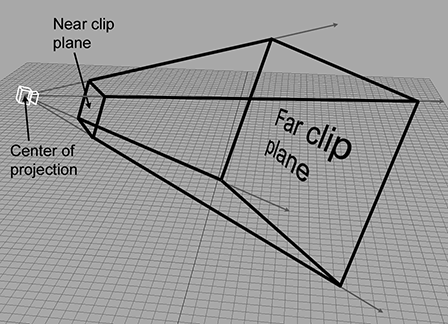
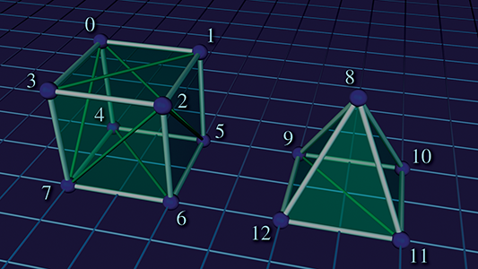
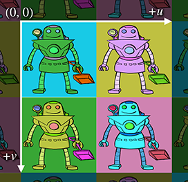
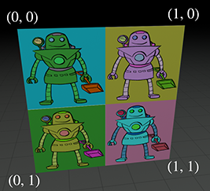
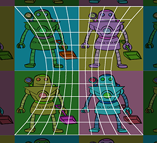
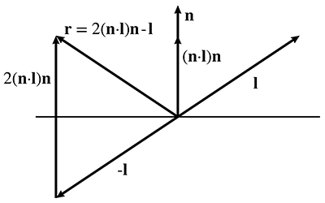
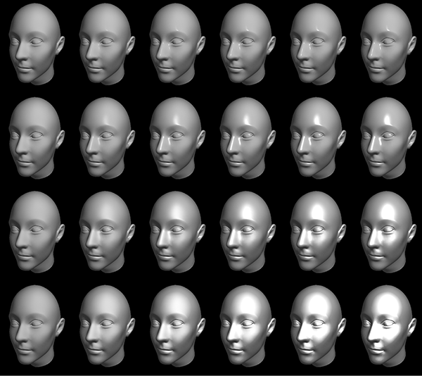
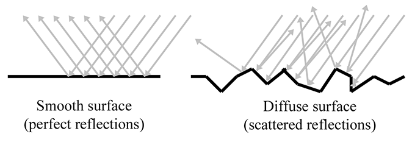
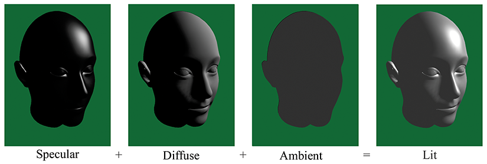

[<< Geometric Primitives](geomprims.html)

[Contents](./)

[Mechanics 1: Linear Kinematics and Calculus >>](kinematics_calculus.html)

Chapter 10 

Mathematical Topics  
from 3D Graphics

I don't think there's anything wrong with pretty graphics.

— Shigeru Miyamoto (1952–)

This chapter discusses a number of mathematical issues that arise when creating 3D graphics on a computer. Of course, we cannot hope to cover the vast subject of computer graphics in any amount of detail in a single chapter. Entire books are written that merely survey the topic. This chapter is to graphics what this entire book is to interactive 3D applications: it presents an extremely brief and high level overview of the subject matter, focusing on topics for which mathematics plays a critical role. Just like the rest of this book, we try to pay special attention to those topics that, from our experience, are glossed over in other sources or are a source of confusion in beginners.

To be a bit more direct: this chapter alone is not enough to teach you how to get some pretty pictures on the screen. However, it should be used parallel with (or preceding!) some other course, book, or self-study on graphics, and we hope that it will help you breeze past a few traditional sticky points. Although we present some example snippets in High Level Shading Language (HLSL) at the end of this chapter, you will not find much else to help you figure out which DirectX or OpenGL function calls to make to achieve some desired effect. These issues are certainly of supreme practical importance, but alas, they are also in the category of knowledge that Robert Maynard Hutchins dubbed “rapidly aging facts,” and we have tried to avoid writing a book that requires an update every other year when ATI releases a new card or Microsoft a new version of DirectX. Luckily, up-to-date API references and examples abound on the Internet, which is a much more appropriate place to get that sort of thing. (API stands for application programming interface. In this chapter, API will mean the software that we use to communicate with the rendering subsystem.)

One final caveat is that since this is a book on math for video games, we will have a real-time bias. This is not to say that the book cannot be used if you are interested in learning how to write a raytracer; only that our expertise and focus is in real-time graphics.

This chapter proceeds roughly in order from ivory tower theory to down-and-dirty code snippets.

*   [Section 10.1](#how_graphics_works) gives a very high-level (and high-brow) theoretical approach to graphics, culminating in the _rendering equation_.
*   We then lower our brows somewhat to focus attention on matters of more direct practical application, while still maintaining our platform independence and attempt to be relevant ten years from now.
    *   [Section 10.2](#viewing_in_3d) discusses some basic mathematics related to _viewing_ in 3D.
    *   [Section 10.3](#coordinate_spaces) introduces some important coordinate spaces and transformations.
    *   [Section 10.4](#polygon_meshes) looks at how to represent the surfaces of the geometry in our scene using a _polygon mesh_.
    *   [Section 10.5](#texture_mapping) shows how to control material properties (such as the “color” of the object) using _texture maps_.
*   The next sections are about lighting.
    *   [Section 10.6](#standard_local_lighting_model) defines the ubiquitous _Blinn-Phong lighting model_.
    *   [Section 10.7](#light_sources) discusses some common methods for representing light sources.
*   With a little nudge further away from timeless theory, the next sections discuss two issues of particular contemporary interest.
    *   [Section 10.8](#skeletal_animation) is about _skeletal animation_.
    *   [Section 10.9](#bump_mapping) tells how _bump mapping_ works.
*   The last third of this chapter is the most in danger of becoming irrelevant in coming years, because it is the most immediately practical.
    *   [Section 10.10](#realtime_graphics_pipeline) gives an overview of a simple real-time graphics pipeline, and then descends that pipeline and talks about some mathematical issues along the way.
    *   [Section 10.11](#hlsl_examples) concludes the chapter squarely in the “rapidly aging facts” territory with several HLSL examples demonstrating some of the techniques covered earlier.

# 10.1How Graphics Works

We begin our discussion of graphics by telling you how things _really_ work, or perhaps more accurately, how they really _should_ work, if we had enough knowledge and processing power to make things work the right way. The beginner student is to be warned that much introductory material (especially tutorials on the Internet) and API documentation suffers from a great lack of perspective. You might get the impression from reading these sources that diffuse maps, Blinn-Phong shading, and ambient occlusion are “The way images in the real world work,” when in fact you are probably reading a description of how one particular lighting model was implemented in one particular language on one particular piece of hardware through one particular API. Ultimately, any down-to-the-details tutorial must choose a lighting model, language, platform, color representation, performance goals, etc.—as we will have to do later in this chapter. (This lack of perspective is usually purposeful and warranted.) However, we think it's important to know which are the fundamental and timeless principles, and which are arbitrary choices based on approximations and trade-offs, guided by technological limitations that might by applicable only to real-time rendering, or are likely to change in the near future. So before we get too far into the details of the particular type of rendering most useful for introductory real-time graphics, we want to take our stab at describing how rendering _really_ works.

We also hasten to add that this discussion assumes that the goal is photorealism, simulating how things work in nature. In fact, this is often not the goal, and it certainly is never the only goal. Understanding how nature works is a very important starting place, but artistic and practical factors often dictate a different strategy than just simulating nature.

## 10.1.1The Two Major Approaches to Rendering

We begin with the end in mind. The end goal of rendering is a bitmap, or perhaps a sequence of bitmaps if we are producing an animation. You almost certainly already know that a bitmap is a rectangular array of colors, and each grid entry is known as _pixel_, which is short for “picture element.” At the time we are producing the image, this bitmap is also known as the _frame buffer_, and often there is additional post-processing or conversion that happens when we copy the frame buffer to the final bitmap output.

_How do we determine the color of each pixel?_ That is the fundamental question of rendering. Like so many challenges in computer science, a great place to start is by investigating how nature works.

We see light. The image that we perceive is the result of light that bounces around the environment and finally enters the eye. This process is complicated, to say the least. Not only is the physics[1](#footnote_1) of the light bouncing around very complicated, but so are the physiology of the sensing equipment in our eyes[2](#footnote_2) and the interpreting mechanisms in our minds. Thus, ignoring a great number of details and variations (as any introductory book must do), the basic question that any rendering system must answer for each pixel is “What color of light is approaching the camera from the direction corresponding to this pixel?”

There are basically two cases to consider. Either we are looking directly at a light source and light traveled directly from the light source to our eye, or (more commonly) light departed from a light source in some other direction, bounced one or more times, and then entered our eye. We can decompose the key question asked previously into two tasks. This book calls these two tasks _the rendering algorithm_, although these two highly abstracted procedures obviously conceal a great deal of complexity about the actual algorithms used in practice to implement it.

The rendering algorithm

*   Visible surface determination. Find the surface that is closest to the eye, in the direction corresponding to the current pixel.
*   Lighting. Determine what light is emitted and/or reflected off this surface in the direction of the eye.

At this point it appears that we have made some gross simplifications, and many of you no doubt are raising your metaphorical hands to ask “What about translucency?” “What about reflections?” “What about refraction?” “What about atmospheric effects?” Please hold all questions until the end of the presentation.

The first step in the rendering algorithm is known as _visible surface determination_. There are two common solutions to this problem. The first is known as _raytracing_. Rather than following light rays in the direction that they travel from the emissive surfaces, we trace the rays backward, so that we can deal only with the light rays that matter: the ones that enter our eye from the given direction. We send a ray out from the eye in the direction through the center of each pixel[3](#footnote_3) to see the first object in the scene this ray strikes. Then we compute the color that is being emitted or reflected from that surface back in the direction of the ray. A highly simplified summary of this algorithm is illustrated by [Listing 10.1](#raytracer_pseudocode).

for (each x,y screen pixel) {

    // Select a ray for this pixel
    Ray ray = getRayForPixel(x,y);

    // Intersect the ray against the geometry.  This will
    // not just return the point of intersection, but also
    // a surface normal and some other information needed
    // to shade the point, such as an object reference,
    // material information, local S,T coordinates, etc.
    // Don't take this pseudocode too literally.
    Vector3 pos, normal;
    Object \*obj; Material \*mtl;
    if (rayIntersectScene(ray, pos, normal, obj, mtl)) {

        // Shade the intersection point.  (What light is
        // emitted/reflected from this point towards the camera?)
        Color c = shadePoint(ray, pos, normal, obj, mtl);

        // Put it into the frame buffer
        writeFrameBuffer(x,y, c);

    } else {

        // Ray missed the entire scene.  Just use a generic
        // background color at this pixel
        writeFrameBuffer(x,y, backgroundColor);
    }
}

The other major strategy for visible surface determination, the one used for real-time rendering at the time of this writing, is known as _depth buffering_. The basic plan is that at each pixel we store not only a color value, but also a depth value. This depth buffer value records the distance from the eye to the surface that is reflecting or emitting the light used to determine the color for that pixel. As illustrated in [Listing 10.1](#raytracer_pseudocode), the “outer loop” of a raytracer is the screen-space pixels, but in real-time graphics, the “outer loop” is the geometric elements that make up the surface of the scene.

The different methods for describing surfaces are not important here. What _is_ important is that we can project the surface onto screen-space and map them to screen-space pixels through a process known as _rasterization_. For each pixel of the surface, known as the _source fragment_, we compute the depth of the surface at that pixel and compare it to the existing value in the depth buffer, sometimes known as the _destination fragment_. If the source fragment we are currently rendering is farther away from the camera than the existing value in the buffer, then whatever we rendered before this is obscuring the surface we are now rendering (at least at this one pixel), and we move on to the next pixel. However, if our depth value is closer than the existing value in the depth buffer, then we know this is the closest surface to the eye (at least of those rendered so far) and so we update the depth buffer with this new, closer depth value. At this point we might also proceed to step 2 of the rendering algorithm (at least for this pixel) and update the frame buffer with the color of the light being emitted or reflected from the surface that point. This is known as _forward rendering_, and the basic idea is illustrated by [Listing 10.2](#forward_renderer_pseudocode).

// Clear the frame and depth buffers
fillFrameBuffer(backgroundColor);
fillDepthBuffer(infinity);

// Outer loop iterates over all the primitives (usually triangles)
for (each geometric primitive) {

    // Rasterize the primitive
    for (each pixel x,y in the projection of the primitive) {

        // Test the depth buffer, to see if a closer pixel has
        // already been written.
        float primDepth = getDepthOfPrimitiveAtPixel(x,y);
        if (primDepth > readDepthBuffer(x,y)) {

            // Pixel of this primitive is obscured, discard it
            continue;
        }

        // Determine primitive color at this pixel.
        Color c = getColorOfPrimitiveAtPixel(x,y);

        // Update the color and depth buffers
        writeFrameBuffer(x,y, c);
        writeDepthBuffer(x,y, primDepth);
    }
}

Opposed to forward rendering is _deferred rendering_, an old technique that is becoming popular again due to the current location of bottlenecks in the types of images we are producing and the hardware we are using to produce them. A deferred renderer uses, in addition to the frame buffer and the depth buffer, additional buffers, collectively known as the _G-buffer_ (short for “geometry” buffer), which holds extra information about the surface closest to the eye at that location, such as the 3D location of the surface, the surface normal, and material properties needed for lighting calculations, such as the “color” of the object and how “shiny” it is at that particular location. (Later, we see how those intuitive terms in quotes are a bit too vague for rendering purposes.) Compared to a forward renderer, a deferred renderer follows our two-step rendering algorithm a bit more literally. First we “render” the scene into the G-buffer, essentially performing only visibility determination—fetching the material properties of the point that is “seen” by each pixel but not yet performing lighting calculations. The second pass actually performs the lighting calculations. [Listing 10.3](#deferred_renderer_pseudocode) explains deferred rendering in pseudocode.

// Clear the geometry and depth buffers
clearGeometryBuffer();
fillDepthBuffer(infinity);

// Rasterize all primitives into the G-buffer
for (each geometric primitive) {
    for (each pixel x,y in the projection of the primitive) {

        // Test the depth buffer, to see if a closer pixel has
        // already been written.
        float primDepth = getDepthOfPrimitiveAtPixel(x,y);
        if (primDepth > readDepthBuffer(x,y)) {

            // Pixel of this primitive is obscured, discard it
            continue;
        }

        // Fetch information needed for shading in the next pass.
        MaterialInfo mtlInfo;
        Vector3 pos, normal;
        getPrimitiveShadingInfo(mtlInfo, pos, normal);

        // Save it off into the G-buffer and depth buffer
        writeGeometryBuffer(x,y, mtlInfo, pos, normal);
        writeDepthBuffer(x,y, primDepth);
    }
}

// Now perform shading in a 2nd pass, in screen space
for (each x,y screen pixel) {
    if (readDepthBuffer(x,y) == infinity) {

        // No geometry here.  Just write a background color
        writeFrameBuffer(x,y, backgroundColor);

    } else {

        // Fetch shading info back from the geometry buffer
        MaterialInfo mtlInfo;
        Vector3 pos, normal;
        readGeometryBuffer(x,y, mtlInfo, pos, normal);

        // Shade the point
        Color c = shadePoint(pos, normal, mtlInfo);

        // Put it into the frame buffer
        writeFrameBuffer(x,y, c);
    }
}

Pseudocode for deferred rendering using the depth buffer

Before moving on, we must mention one important point about why deferred rendering is popular. When multiple light sources illuminate the same surface point, hardware limitations or performance factors may prevent us from computing the final color of a pixel in a single calculation, as was shown in the pseudocode listings for both forward and deferred rendering. Instead, we must using multiple passes, one pass for each light, and _accumulate_ the reflected light from each light source into the frame buffer. In forward rendering, these extra passes involve rerendering the primitives. Under deferred rendering, however, extra passes are in image space, and thus depend on the 2D size of the light in screen space, not on the complexity of the scene! It is in this situation that deferred rendering really begins to have large performance advantages over forward rendering.

## 10.1.2Describing Surface Properties: The BRDF

Now let's talk about the second step in the rendering algorithm: lighting. Once we have located the surface closest to the eye, we must determine the amount of light emitted directly from that surface, or emitted from some other source and reflected off the surface in the direction of the eye. The light directly transmitted from a surface to the eye—for example, when looking directly at a light bulb or the sun—is the simplest case. These _emissive_ surfaces are a small minority in most scenes; most surfaces do not emit their own light, but rather they only reflect light that was emitted from somewhere else. We will focus the bulk of our attention on the nonemissive surfaces.

Although we often speak informally about the “color” of an object, we know that the perceived color of an object is actually the light that is entering our eye, and thus can depend on many different factors. Important questions to ask are: What colors of light are incident on the surface, and from what directions? From which direction are we viewing the surface? How “shiny” is the object?[4](#footnote_4) So a description of a surface suitable for use in rendering doesn't answer the question “What color is this surface?” This question is sometimes meaningless—what color is a mirror, for example? Instead, the salient question is a bit more complicated, and it goes something like, “When light of a given color strikes the surface from a given incident direction, how much of that light is reflected in some other particular direction?” The answer to this question is given by the _bidirectional reflectance distribution function_, or BRDF for short. So rather than “What color is the object?” we ask, “What is the distribution of reflected light?”

Symbolically, we write the BRDF as the function f( x , ω ω ^ in , ω ω ^ out ,λ) .[5](#footnote_5) The value of this function is a scalar that describes the relatively likelihood that light incident at the point x from direction ω ω ^ in will be reflected in the outgoing direction ω ω ^ out rather than some other outgoing direction. As indicated by the boldface type and hat, ω ω ^ might be a unit vector, but more generally it can be any way of specifying a direction; polar angles are another obvious choice and are commonly used. Different colors of light are usually reflected differently; hence the dependence on λ , which is the color (actually, the wavelength) of the light.

Although we are particularly interested in the incident directions that come from emissive surfaces and the outgoing directions that point towards our eye, in general, the entire distribution is relevant. First of all, lights, eyes, and surfaces can move around, so in the context of creating a surface description (for example, “red leather”), we don't know which directions will be important. But even in a particular scene with all the surfaces, lights, and eyes fixed, light can bounce around multiple times, so we need to measure light reflections for arbitrary pairs of directions.

Before moving on, it's highly instructive to see how the two intuitive material properties that were earlier disparaged, color and shininess, can be expressed precisely in the framework of a BRDF. Consider a green ball. A green object is green and not blue because it reflects incident light that is green more strongly than incident light of any other color.[6](#footnote_6) For example, perhaps green light is almost all reflected, with only a small fraction absorbed, while 95%of the blue and red light is absorbed and only 5%of light at those wavelengths is reflected in various directions. White light actually consists of all the different colors of light, so a green object essentially filters out colors other than green. If a different object responded to green and red light in the same manner as our green ball, but absorbed 50%of the blue light and reflected the other 50%, we might perceive the object as teal. Or if most of the light at all wavelengths was absorbed, except for a small amount of green light, then we would perceive it as a dark shade of green. To summarize, a BRDF accounts for the difference in color between two objects through the dependence on λ : any given wavelength of light has its own reflectance distribution.

Next, consider the difference between shiny red plastic and diffuse red construction paper. A shiny surface reflects incident light much more strongly in one particular direction compared to others, whereas a diffuse surface scatters light more evenly across all outgoing directions. A perfect reflector, such as a mirror, would reflect all the light from one incoming direction in a single outgoing direction, whereas a perfectly diffuse surface would reflect light equally in all outgoing directions, regardless of the direction of incidence. In summary, a BRDF accounts for the difference in “shininess” of two objects through its dependence on ω ω ^ in and ω ω ^ out .

More complicated phenomena can be expressed by generalizing the BRDF. Translucence and light refraction can be easily incorporated by allowing the direction vectors to point back into the surface. We might call this mathematical generalization a _bidirectional surface scattering distribution function_ (BSSDF). Sometimes light strikes an object, bounces around inside of it, and then exits at a different point. This phenomenon is known as _subsurface scattering_ and is an important aspect of the appearances of many common substances, such as skin and milk. This requires splitting the single reflection point x into x in and x out , which is used by the _bidirectional surface scattering distribution function_ (BSSDF). Even volumetric effects, such as fog and subsurface scattering, can be expressed, by dropping the words “surface” and defining a _bidirectional scattering distribution function_ (BSDF) at any point in space, not just on the “surfaces.” Taken at face value, these might seem like impractical abstractions, but they can be useful in understanding how to design practical tools.

By the way, there are certain criteria that a BRDF must satisfy in order to be physically plausible. First, it doesn't make sense for a negative amount of light to be reflected in any direction. Second, it's not possible for the total reflected light to be more than the light that was incident, although the surface may absorb some energy so the reflected light can be less than the incident light. This rule is usually called the _normalization constraint_. A final, less obvious principle obeyed by physical surfaces is _Helmholtz reciprocity_: if we pick two arbitrary directions, the same fraction of light should be reflected, no matter which is the incident direction and which is the outgoing direction. In other words,

Helmholtz reciprocity

f( x , ω ω ^ 1, ω ω ^ 2,λ)\=f( x , ω ω ^ 2, ω ω ^ 1,λ).

Due to Helmholtz reciprocity, some authors don't label the two directions in the BRDF as “in” and “out” because to be physically plausible the computation must be symmetric.

The BRDF contains the complete description of an object's appearance at a given point, since it describes how the surface will reflect light at that point. Clearly, a great deal of thought must be put into the design of this function. Numerous lighting models have been proposed over the last several decades, and what is surprising is that one of the earliest models, Blinn-Phong, is still in widespread use in real-time graphics today. Although it is not physically accurate (nor plausible: it violates the normalization constraint), we study it because it is a good educational stepping stone and an important bit of graphics history. Actually, describing Blinn-Phong as “history” is wishful thinking—perhaps the most important reason to study this model is that it still is in such widespread use! In fact, it's the best example of the phenomena we mentioned at the start of this chapter: particular methods being presented as if they are “the way graphics work.”

Different lighting models have different goals. Some are better at simulating rough surfaces, others at surfaces with multiple strata. Some focus on providing intuitive “dials” for artists to control, without concern for whether those dials have any physical significance at all. Others are based on taking real-world surfaces and measuring them with special cameras called goniophotometers, essentially sampling the BRDF and then using interpolation to reconstruct the function from the tabulated data. The notable Blinn-Phong model discussed in [Section 10.6](#standard_local_lighting_model) is useful because it is simple, inexpensive, and well understood by artists. Consult the sources in the suggested reading for a survey of lighting models.

## 10.1.3A Very Brief Introduction to Colorimetry  
and Radiometry

Graphics is all about measuring light, and you should be aware of some important subtleties, even though we won't have time to go into complete detail here. The first is how to measure the color of light, and the second is how to measure its brightness.

In your middle school science classes you might have learned that every color of light is some mixture of red, green, and blue (RGB) light. This is the popular conception of light, but it's not quite correct. Light can take on any single frequency in the visible band, or it might be a combination of any number of frequencies. Color is a phenomena of _human perception_ and is not quite the same thing as frequency. Indeed different combinations of frequencies of light can be perceived as the same color—these are known as _metamers_. The infinite combinations of frequencies of light are sort of like all the different chords that can be played on a piano (and also tones between the keys). In this metaphor our color perception is unable to pick out all the different individual notes, but instead, any given chord sounds to us like some combination of middle C, F, and G. Three color channels is not a magic number as far as physics is concerned, it's peculiar to human vision. Most other mammals have only two different types of receptors (we would call them “color blind”), and fish, reptiles, and birds have _four_ types of color receptors (they would call _us_ color blind).

However, even very advanced rendering systems project the continuous spectrum of visible light onto some discrete basis, most commonly, the RGB basis. This is a ubiquitous simplification, but we still wanted to let you know that it is a simplification, as it doesn't account for certain phenomena. The RGB basis is not the only color space, nor is it necessarily the best one for many purposes, but it is a very convenient basis because it is the one used by most display devices. In turn, the reason that this basis is used by so many display devices is due to the similarity to our own visual system. Hall [\[11\]](#reference_11) does a good job of describing the shortcomings of the RGB system.

Since the visible portion of the electromagnetic spectrum is continuous, an expression such as f( x , ω ω ^ in , ω ω ^ out ,λ) is continuous in terms of λ . At least it should be in theory. In practice, because we are producing images for human consumption, we reduce the infinite number of different λ s down to three particular wavelengths. Usually, we choose the three wavelengths to be those perceived as the colors red, green, and blue. In practice, you can think of the presence of λ in an equation as an integer that selects which of the three discrete “color channels” is being operated on.

Key Points about Color

*   To describe the spectral distribution of light requires a continuous function, not just three numbers. However, to describe the human perception of that light, three numbers are essentially sufficient.
*   The RGB system is a convenient color space, but it's not the only one, and not even the best one for many practical purposes. In practice, we usually treat light as being a combination of red, green, and blue because we are making images for human consumption.

You should also be aware of the different ways that we can measure the intensity of light. If we take a viewpoint from physics, we consider light as energy in the form of electromagnetic radiation, and we use units of measurement from the field of _radiometry_. The most basic quantity is _radiant energy_, which in the SI system is measured in the standard unit of energy, the _joule_ (J). Just like any other type of energy, we are often interested in the rate of energy flow per unit time, which is known as _power_. In the SI system power is measured using the _watt_ (W), which is one joule per second (1 W = 1 J/s). Power in the form of electromagnetic radiation is called _radiant power_ or _radiant flux_. The term “flux,” which comes from the Latin _fluxus_ for “flow,” refers to some quantity flowing across some cross-sectional area. Thus, radiant flux measures the total amount of energy that is arriving, leaving, or flowing across some area per unit time.

Imagine that a certain amount of radiant flux is emitted from a 1  m 2 surface, while that same amount of power is emitted from a different surface that is 100  m 2 . Clearly, the smaller surface is “brighter” than the larger surface; more precisely, it has a greater flux per unit area, also known as _flux density_. The radiometric term for flux density, the radiant flux per unit area, is called _radiosity_, and in the SI system it is measured in watts per meter. The relationship between flux and radiosity is analogous to the relationship between force and pressure; confusing the two will lead to similar sorts of conceptual errors.

Several equivalent terms exist for radiosity. First, note that we can measure the flux density (or total flux, for that matter) across any cross-sectional area. We might be measuring the radiant power emitted from some surface with a finite area, or the surface through which the light flows might be an imaginary boundary that exists only mathematically (for example, the surface of some imaginary sphere that surrounds a light source). Although in all cases we are measuring flux density, and thus the term “radiosity” is perfectly valid, we might also use more specific terms, depending on whether the light being measured is coming or going. If the area is a surface and the light is arriving on the surface, then the term _irradiance_ is used. If light is being emitted from a surface, the term _radiant exitance_ or _radiant emittance_ is used. In digital image synthesis, the word “radiosity” is most often used to refer to light that is leaving a surface, having been either reflected or emitted.

When we are talking about the brightness at a particular point, we cannot use plain old radiant power because the area of that point is infinitesimal (essentially zero). We can speak of the flux _density_ at a single point, but to measure flux, we need a finite area over which to measure. For a surface of finite area, if we have a single number that characterizes the total for the entire surface area, it will be measured in flux, but to capture the fact that different locations within that area might be brighter than others, we use a function that varies over the surface that will measure the flux density.

Now we are ready to consider what is perhaps the most central quantity we need to measure in graphics: the intensity of a “ray” of light. We can see why the radiosity is not the unit for the job by an extension of the ideas from the previous paragraph. Imagine a surface point surrounded by an emissive dome and receiving a certain amount of irradiance coming from all directions in the hemisphere centered on the local surface normal. Now imagine a second surface point experiencing the same amount of irradiance, only all of the illumination is coming from a single direction, in a very thin beam. Intuitively, we can see that a ray along this beam is somehow “brighter” than any one ray that is illuminating the first surface point. The irradiance is somehow “denser.” It is denser _per unit solid area_.

The idea of a solid area is probably new to some readers, but we can easily understand the idea by comparing it to angles in the plane. A “regular” angle is measured (in radians) based on the length of its projection onto the unit circle. In the same way, a solid angle measures the _area_ as projected onto the unit sphere surrounding the point. The SI unit for solid angle is the _steradian_, abbreviated “sr.” The complete sphere has 4π  sr; a hemisphere encompasses 2π  sr.

Figure 10.1 The two surfaces are receiving identical bundles of light, but the surface on the bottom has a larger area, and thus has a lower irradiance.

By measuring the radiance per unit solid angle, we can express the intensity of light at a certain point as a function that varies based upon the direction of incidence. We are very close to having the unit of measurement that describes the intensity of a ray. There is just one slight catch, illustrated by [Figure 10.1](#radiance_projected_area), which is a close-up of a very thin pencil of light rays striking a surface. On the top, the rays strike the surface perpendicularly, and on the bottom, light rays of the same strength strike a different surface at an angle. The key point is that the area of the top surface is smaller than the area of the bottom surface; therefore, the irradiance on the top surface is larger than the irradiance on the bottom surface, despite the fact that the two surfaces are being illuminated by the “same number” of identical light rays. This basic phenomenon, that the angle of the surface causes incident light rays to be spread out and thus contribute less irradiance, is known as _Lambert's law_. We have more to say about Lambert's law in [Section 10.6.3](#diffuse_component), but for now, the key idea is that the contribution of a bundle of light to the irradiance at a surface depends on the angle of that surface.

Due to Lambert's law, the unit we use in graphics to measure the strength of a ray, _radiance_, is defined as the radiant flux per unit _projected area_, per unit solid angle. To measure a projected area, we take the actual surface area and project it onto the plane perpendicular to the ray. (In [Figure 10.1](#radiance_projected_area), imagine taking the bottom surface and projecting it upwards onto the top surface). Essentially this counteracts Lambert's law.

[Table 10.1](#radiometric_terms) summarizes the most important radiometric terms.

**Quantity**

**Units**

**SI unit**

**Rough translation**

Radiant energy

Energy

J

Total illumination duringan interval of time

Radiant flux

Power

W

Brightness of a finite areafrom all directions

Radiant flux density

Power per unit area

W / m 2

Brightness of a single pointfrom all directions

Irradiance

Power per unit area

W / m 2

Radiant flux density ofincident light

Radiant exitance

Power per unit area

W / m 2

Radiant flux density ofemitted light

Radiosity

Power per unit area

W / m 2

Radiant flux density ofemitted or reflected light

Radiance

Power per unit projected area, perunit solid angle

W / (m2⋅sr)

Brightness of a ray

Table 10.1Common radiometric terms

Whereas radiometry takes the perspective of physics by measuring the raw energy of the light, the field of _photometry_ weighs that same light using the human eye. For each of the corresponding radiometric terms, there is a similar term from photometry ([Table 10.2](#photometry_terms)). The only real difference is a nonlinear conversion from raw energy to perceived brightness.

**Radiometric term**

**Photometric term**

**SI Photometric unit**

Radiant energy

Luminous energy

talbot, or lumen second ( lm⋅s )

Radiant flux

Luminous flux, luminous power

lumen ( lm )

Irradiance

Illuminance

lux ( lx\=lm / m2 )

Radiant exitance

Luminous emittance

lux ( lx\=lm / m2 )

Radiance

Luminance

lm / (m2⋅sr)

Table 10.2Units of measurement from radiometry and photometry

Throughout the remainder of this chapter, we try to use the proper radiometric units when possible. However, the practical realities of graphics make using proper units confusing, for two particular reasons. It is common in graphics to need to take some integral over a “signal”—for example, the color of some surface. In practice we cannot do the integral analytically, and so we must integrate numerically, which boils down to taking a weighted average of many samples. Although mathematically we are taking a weighted average (which ordinarily would not cause the units to change), in fact what we are doing is _integrating_, and that means each sample is really being multiplied by some differential quantity, such as a differential area or differential solid angle, which causes the physical units to change. A second cause of confusion is that, although many signals have a finite nonzero domain in the real world, they are represented in a computer by signals that are nonzero at a single point. (Mathematically, we say that the signal is a multiple of a Direc delta; see [Section 12.4.3](dynamics.html#dirac_delta).) For example, a real-world light source has a finite area, and we would be interested in the radiance of the light at a given point on the emissive surface, in a given direction. In practice, we imagine shrinking the area of this light down to zero while holding the radiant flux constant. The flux density becomes infinite in theory. Thus, for a real area light we would need a signal to describe the flux density, whereas for a point light, the flux density becomes infinite and we instead describe the brightness of the light by its total flux. We'll repeat this information when we talk about point lights.

Key Points about Radiometry

*   Vague words such as “intensity” and “brightness” are best avoided when the more specific radiometric terms can be used. The scale of our numbers is not that important and we don't need to use real world SI units, but it is helpful to understand what the different radiometric quantities measure to avoid mixing quantities together inappropriately.
*   Use radiant flux to measure the total brightness of a finite area, in all directions.
*   Use radiant flux density to measure the brightness at a single point, in all directions. Irradiance and radiant exitance refer to radiant flux density of light that is incident and emitted, respectively. Radiosity is the radiant flux density of light that is leaving a surface, whether the light was reflected or emitted.
*   Due to Lambert's law, a given ray contributes more differential irradiance when it strikes a surface at a perpendicular angle compared to a glancing angle.
*   Use radiance to measure the brightness of a ray. More specifically, radiance is the flux per unit projected angle, per solid angle. We use projected area so that the value for a given ray is a property of a ray alone and does not depend on the orientation of the surface used to measure the flux density.
*   Practical realities thwart our best intentions of doing things “the right way” when it comes to using proper units. Numerical integration is a lot like taking a weighted average, which hides the change of units that really occurs. Point lights and other Dirac deltas add further confusion.

## 10.1.4The Rendering Equation

Now let's fit the BRDF into the rendering algorithm. In step 2 of our rendering algorithm ([Section 10.1](#how_graphics_works)), we're trying to determine the radiance leaving a particular surface in the direction of our eye. The only way this can happen is for light to arrive from some direction onto the surface and get reflected in our direction. With the BRDF, we now have a way to measure this. Consider all the potential directions that light might be incident upon the surface, which form a hemisphere centered on x , oriented according to the local surface normal n ^ . For each potential direction ω ω ^ in , we measure the color of light incident from that direction. The BRDF tells us how much of the radiance from ω ω ^ in is reflected in the direction ω ω ^ out towards our eye (as opposed to scattered in some other direction or absorbed). By summing up the radiance reflected towards ω ω ^ out over all possible incident directions, we obtain the total radiance reflected along ω ω ^ out into our eye. We add the reflected light to any light that is being _emitted_ from the surface in our direction (which is zero for most surfaces), and voila, we have the total radiance. Writing this in math notation, we have the _rendering equation_.

The Rendering Equation

L out ( x , ω ω ^ out ,λ)\=L emis ( x , ω ω ^ out ,λ)(10.1)+∫ Ω Ω L in ( x , ω ω ^ in ,λ)f( x , ω ω ^ in , ω ω ^ out ,λ)(− ω ω ^ in ⋅ n ^ )d ω ω ^ in .

As fundamental as [Equation (10.1)](#rendering_equation) may be, its development is relatively recent, having been published in SIGGRAPH in 1986 by Kajiya [\[13\]](#reference_13). Furthermore, it was the _result_ of, rather than the cause of, numerous strategies for producing realistic images. Graphics researchers pursued the creation of images through different techniques that seemed to make sense to them before having a framework to describe the problem they were trying to solve. And for many years after that, most of us in the video game industry were unaware that the problem we were trying to solve had finally been clearly defined. (Many still are.)

Now let's convert this equation into English and see what the heck it means. First of all, notice that x and λ appear in each function. The whole equation governs a balance of radiance at a single surface point x for a single wavelength (“color channel”) λ . So this balance equation applies to each color channel individually, at all surface points simultaneously.

The term L out ( x , ω ω ^ out ,λ) on the left side of the equals sign is simply “The radiance leaving the point in the direction ω ω ^ out .” Of course, if x is the visible surface at a given pixel, and ω ω ^ out is the direction from x to the eye, then this quantity is exactly what we need to determine the pixel color. But note that the equation is more general, allowing us to compute the outgoing radiance in any arbitrary direction ω ω ^ out and for any given point x , whether or not ω ω ^ out points towards our eye.

On the right-hand side, we have a sum. The first term in the sum L emis ( x , ω ω ^ out ,λ) , is “the radiance emitted from x in the direction ω ω ^ out ” and will be nonzero only for special emissive surfaces. The second term, the integral, is “the light reflected from x in the direction of ω ω ^ out .” Thus, from a high level the rendering equation would seem to state the rather obvious relation

(Total radiancetowards  ω ω ^ out ) \= (Radiance emittedtowards  ω ω ^ out ) + (Radiance reflectedtowards  ω ω ^ out ) .

Now let's dig into that intimidating integral. (By the way, if you haven't had calculus and haven't read [Chapter 11](kinematics_calculus.html) yet, just replace the word “integral” with “sum,” and you won't miss any of the main point of this section.) We've actually already discussed how it works when we talked about the BRDF, but let's repeat it with different words. We might rewrite the integral as

(Radiance reflectedtowards  ω ω ^ out ) \=∫ Ω Ω (Radiance incident from  ω ω ^ in and reflected towards  ω ω ^ out ) d ω ω ^ in .

Note that symbol Ω Ω (uppercase Greek omega) appears where we normally would write the limits of integration. This is intended to mean “sum over the hemisphere of possible incoming directions.” For each incoming direction ω ω ^ in , we determine how much radiance was incident in this incoming direction and got scattered in the outgoing direction ω ω ^ out . The sum of all these contributions from all the different incident directions gives the total radiance reflected in the direction ω ω ^ out . Of course, there are an infinite number of incident directions, which is why this is an integral. In practice, we cannot evaluate the integral analytically, and we must sample a discrete number of directions, turning the “ ∫ ” into a “ ∑ .”

Now all that is left is to dissect the integrand. It's a product of three factors:

(Radiance incident from  ω ω ^ in and reflected towards  ω ω ^ out ) \=L in ( x , ω ω ^ in ,λ)f( x , ω ω ^ in , ω ω ^ out ,λ)(− ω ω ^ in ⋅ n ^ ).

The first factor denotes the radiance incident from the direction of ω ω ^ in . The next factor is simply the BRDF, which tells us how much of the radiance incident from this particular direction will be reflected in the outgoing direction we care about. Finally, we have the _Lambert factor_. As discussed in [Section 10.1.2](#brdf), this accounts for the fact that more incident light is available to be reflected, per unit surface area, when ω ω ^ in is perpendicular to the surface than when at a glancing angle to the surface. The vector n ^ is the outward-facing surface normal; the dot product − ω ω ^ in ⋅ n ^ peaks at 1 in the perpendicular direction and trails off to zero as the angle of incidence becomes more glancing. We discuss the Lambert factor once more in [Section 10.6.3](#diffuse_component).

In purely mathematical terms, the rendering equation is an _integral equation_: it states a relationship between some unknown function L out ( x , ω ω ^ out ,λ) , the distribution of light on the surfaces in the scene, in terms of its own integral. It might not be apparent that the rendering equation is recursive, but L out actually appears on both sides of the equals sign. It appears in the evaluation of L in ( x , ω ω ^ in ,λ) , which is precisely the expression we set out to solve for each pixel: what is the radiance incident on a point from a given direction? Thus to find the radiance exiting a point x , we need to know all the radiance incident at x from all directions. But the radiance incident on x is the same as the radiance leaving from _all other surfaces visible to x_ , in the direction pointing from the other surface towards x .

To render a scene realistically, we must solve the rendering equation, which requires us to know (in theory) not only the radiance arriving at the camera, but also the entire distribution of radiance in the scene in every direction at every point. Clearly, this is too much to ask for a finite, digital computer, since both the set of surface locations and the set of potential incident/exiting directions are infinite. The real art in creating software for digital image synthesis is to allocate the limited processor time and memory most efficiently, to make the best possible approximation.

The simple rendering pipeline we present in [Section 10.10](#realtime_graphics_pipeline) accounts only for direct light. It doesn't account for indirect light that bounced off of one surface and arrived at another. In other words, it only does “one recursion level” in the rendering equation. A huge component of realistic images is accounting for the indirect light—solving the rendering equation more completely. The various methods for accomplishing this are known as _global illumination_ techniques.

This concludes our high-level presentation of how graphics works. Although we admit we have not yet presented a single practical idea, we believe it's very important to understand what you are trying to approximate before you start to approximate it. Even though the compromises we are forced to make for the sake of real-time are quite severe, the available computing power is growing. A video game programmer whose only exposure to graphics has been OpenGL tutorials or demos made by video card manufacturers or books that focused exclusively on real-time rendering will have a much more difficult time understanding even the global illumination techniques of today, much less those of tomorrow.

# 10.2Viewing in 3D

Before we render a scene, we must pick a camera and a window. That is, we must decide where to render it _from_ (the view position, orientation, and zoom) and where to render it _to_ (the rectangle on the screen). The output window is the simpler of the two, and so we will discuss it first.

[Section 10.2.1](#output_window) describes how to specify the output window. [Section 10.2.2](#pixel_aspect_ratio) discusses the pixel aspect ratio. [Section 10.2.3](#view_frustum) introduces the view frustum. [Section 10.2.4](#field_of_view) describes field of view angles and zoom.

Figure 10.2Specifying the output window

## 10.2.1Specifying the Output Window

We don't have to render our image to the entire screen. For example, in split-screen multiplayer games, each player is given a portion of the screen. The output window refers to the portion of the output device where our image will be rendered. This is shown in [Figure 10.2](#output_window).

The position of the window is specified by the coordinates of the upper left-hand pixel ( winPos x, winPos y) . The integers winRes x and winRes y are the dimensions of the window in pixels. Defining it this way, using the size of the window rather than the coordinates of the lower right-hand corner, avoids some sticky issues caused by integer pixel coordinates. We are also careful to distinguish between the size of the window in pixels, and the physical size of the window. This distinction will become important in [Section 10.2.2](#pixel_aspect_ratio).

With that said, it is important to realize that we do not necessarily have to be rendering to the screen at all. We could be rendering into a buffer to be saved into a .TGA file or as a frame in an .AVI, or we may be rendering into a texture as a subprocess of the “main” render, to produce a shadow map, or a reflection, or the image on a monitor in the virtual world. For these reasons, the term _render target_ is often used to refer to the current destination of rendering output.

## 10.2.2Pixel Aspect Ratio

Regardless of whether we are rendering to the screen or an off-screen buffer, we must know the aspect ratio of the pixels, which is the ratio of a pixel's height to its width. This ratio is often 1:1—that is, we have “square” pixels—but _this is not always the case!_ We give some examples below, but it is common for this assumption to go unquestioned and become the source of complicated kludges applied in the wrong place, to fix up stretched or squashed images.

The formula for computing the aspect ratio is

Computing the pixel aspect ratio

(10.2) pixPhys x pixPhys y\= devPhys x devPhys y⋅ devRes y devRes x.

The notation pixPhys refers to the physical size of a pixel, and devPhys is the physical height and width of the device on which the image is displayed. For both quantities, the individual measurements may be unknown, but that's OK because the ratio is all we need, and this usually is known. For example, standard desktop monitors come in all different sizes, but the viewable area on many older monitors has a ratio of 4:3, meaning it is 33%wider than it is tall. Another common ratio is 16:9 or wider[7](#footnote_7) on high-definition televisions. The integers devRes x and devRes y are the number of pixels in the x and y dimensions. For example, a resolution of 1280×720 means that devRes x\=1280 and devRes y\=720 .

But, as mentioned already, we often deal with square pixels with an aspect ratio of 1:1. For example, on a desktop monitor with a physical width:height ratio of 4:3, some common resolutions resulting in square pixel ratios are 640×480 , 800×600 , 1024×768 , and 1600×1200 . On 16:9 monitors, common resolutions are 1280×720 , 1600×900 , 1920×1080 . The aspect ratio 8:5 (more commonly known as 16:10) is also very common, for desktop monitor sizes and televisions. Some common display resolutions that are 16:10 are 1153×720 , 1280×800 , 1440×900 , 1680×1050 , and 1920×1200 . In fact, on the PC, it's common to just assume a 1:1 pixel ratio, since obtaining the dimensions of the display device might be impossible. Console games have it easier in this respect.

Notice that nowhere in these calculations is the size or location of the _window_ used; the location and size of the rendering window has no bearing on the physical proportions of a pixel. However, the size of the window will become important when we discuss field of view in [Section 10.2.4](#field_of_view), and the position is important when we map from camera space to screen space [Section 10.3.5](#screen_space).

At this point, some readers may be wondering how this discussion makes sense in the context of rendering to a bitmap, where the word “physical” implied by the variable names pixPhys and devPhys doesn't apply. In most of these situations, it's appropriate simply to act as if the pixel aspect ratio is 1:1. In some special circumstances, however, you may wish to render _anamorphically_, producing a squashed image in the bitmap that will later be stretched out when the bitmap is used.

## 10.2.3The View Frustum

The _view frustum_ is the volume of space that is potentially visible to the camera. It is shaped like a pyramid with the tip snipped off. An example of a view frustum is shown in [Figure 10.3](#view_frustum).

Figure 10.3The 3D view frustum

The view frustum is bounded by six planes, known as the _clip planes_. The first four of the planes form the sides of the pyramid and are called the top, left, bottom, and right planes, for obvious reasons. They correspond to the sides of the output window. The near and far clip planes, which correspond to certain camera-space values of z , require a bit more explanation.

The reason for the far clip plane is perhaps easier to understand. It prevents rendering of objects beyond a certain distance. There are two practical reasons why a far clip plane is needed. The first is relatively easy to understand: a far clip plane can limit the number of objects that need to be rendered in an outdoor environment. The second reason is slightly more complicated, but essentially it has to do with how the depth buffer values are assigned. As an example, if the depth buffer entries are 16-bit fixed point, then the largest depth value that can be stored is 65,535. The far clip establishes what (floating point) z value in camera space will correspond to the maximum value that can be stored in the depth buffer. The motivation for the near clip plane will have to wait until we discuss _clip space_ in [Section 10.3.2](#clip_space).

Notice that each of the clipping planes are _planes_, with emphasis on the fact that they extend infinitely. The view volume is the intersection of the six half-spaces defined by the clip planes.

## 10.2.4Field of View and Zoom

A camera has position and orientation, just like any other object in the world. However, it also has an additional property known as _field of view_. Another term you probably know is _zoom_. Intuitively, you already know what it means to “zoom in” and “zoom out.” When you zoom in, the object you are looking at appears bigger on screen, and when you zoom out, the apparent size of the object is smaller. Let's see if we can develop this intuition into a more precise definition.

The _field of view_ (FOV) is the angle that is intercepted by the view frustum. We actually need two angles: a horizontal field of view, and a vertical field of view. Let's drop back to 2D briefly and consider just one of these angles. [Figure 10.4](#field_of_view) shows the view frustum from above, illustrating precisely the angle that the horizontal field of view measures. The labeling of the axes is illustrative of camera space, which is discussed in [Section 10.3](#coordinate_spaces).

Figure 10.4Horizontal field of view

Figure 10.5Geometric interpretation of zoom

_Zoom_ measures the ratio of the apparent size of the object relative to a 90 o field of view. For example, a zoom of 2.0 means that object will appear twice as big on screen as it would if we were using a 90 o field of view. So larger zoom values cause the image on screen to become larger (“zoom in”), and smaller values for zoom cause the images on screen to become smaller (“zoom out”).

Zoom can be interpreted geometrically as shown in [Figure 10.5](#zoom). Using some basic trig, we can derive the conversion between zoom and field of view:

Converting between zoom and field of view

(10.3) zoom \=1 tan⁡ ( fov / 2) , fov \=2 arctan⁡ (1 / zoom ) .

Notice the inverse relationship between zoom and field of view. As zoom gets larger, the field of view gets smaller, causing the view frustum to narrow. It might not seem intuitive at first, but when the view frustum gets more narrow, the perceived size of visible objects increases.

Field of view is a convenient measurement for humans to use, but as we discover in [Section 10.3.4](#clip_space_scale), zoom is the measurement that we need to feed into the graphics pipeline.

We need _two_ different field of view angles (or zoom values), one horizontal and one vertical. We are certainly free to choose any two arbitrary values we fancy, but if we do not maintain a proper relationship between these values, then the rendered image will appear stretched. If you've ever watched a movie intended for the wide screen that was simply squashed anamorphically to fit on a regular TV, or watched content with a 4:3 aspect on a 16:9 TV in “full”[8](#footnote_8) mode, then you have seen this effect.

In order to maintain proper proportions, the zoom values must be inversely proportional to the physical dimensions of the output window:

The usual relationship between vertical and horizontal zoom

(10.4) zoom y zoom x\= winPhys x winPhys y\=window aspect ratio.

The variable winPhys refers to the physical size of the output window. As indicated in [Equation (10.4)](#zoom_aspect_ratio_relationship), even though we don't usually know the actual size of the render window, we can determine its aspect ratio. But how do we do this? Usually, all we know is the _resolution_ (number of pixels) of the output window. Here's where the pixel aspect ratio calculations from [Section 10.2.2](#pixel_aspect_ratio) come in:

(10.5) zoom y zoom x\= winPhys x winPhys y\= winRes x winRes y⋅ pixPhys x pixPhys y\= winRes x winRes y⋅ devPhys x devPhys y⋅ devRes y devRes x.

In this formula,

*   zoom refers to the camera's zoom values,
*   winPhys refers to the physical window size,
*   winRes refers to the resolution of the window, in pixels,
*   pixPhys refers to the physical dimensions of a pixel,
*   devPhys refers to the physical dimensions of the output device. Remember that we usually don't know the individual sizes, but we do know the ratio,
*   devRes refers to the resolution of the output device.

Many rendering packages allow you to specify only one field of view angle (or zoom value). When you do this, they automatically compute the other value for you, assuming you want uniform display proportions. For example, you may specify the horizontal field of view, and they compute the vertical field of view for you.

Now that we know how to describe zoom in a manner suitable for consumption by a computer, what do we do with these zoom values? They go into the _clip matrix_, which is described in [Section 10.3.4](#clip_space_scale).

## 10.2.5Orthographic Projection

The discussion so far has centered on perspective projection, which is the most commonly used type of projection, since that's how our eyes perceive the world. However, in many situations _orthographic projection_ is also useful. We introduced orthographic projection in [Section 5.3](matrixtransforms.html#orthographic_projection); to briefly review, in orthographic projection, the lines of projection (the lines that connect all the points in space that project onto the same screen coordinates) are parallel, rather than intersecting at a single point. There is no perspective foreshortening in orthographic projection; an object will appear the same size on the screen no matter how far away it is, and moving the camera forward or backward along the viewing direction has _no apparent effect_ so long as the objects remain in front of the near clip plane.

[Figure 10.6](#perspective_vs_ortho_projection) shows a scene rendered from the same position and orientation, comparing perspective and orthographic projection. On the left, notice that with perspective projection, parallel lines do not remain parallel, and the closer grid squares are larger than the ones in the distance. Under orthographic projection, the grid squares are all the same size and the grid lines remain parallel.

Perspective projection

Orthographic projection

Figure 10.6Perspective versus orthographic projection

Orthographic views are very useful for “schematic” views and other situations where distances and angles need to be measured precisely. Every modeling tool will support such a view. In a video game, you might use an orthographic view to render a map or some other HUD element.

For an orthographic projection, it makes no sense to speak of the “field of view” as an angle, since the view frustum is shaped like a box, not a pyramid. Rather than defining the x and y dimensions of the view frustum in terms of two angles, we give two sizes: the physical width and height of the box.

The zoom value has a different meaning in orthographic projection compared to perspective. It is related to the physical size of the frustum box:

Converting between zoom and frustum size in orthographic projection

zoom \=2 / size , size \=2 / zoom .

As with perspective projections, there are _two_ different zoom values, one for x and one for y , and their ratio must be coordinated with the aspect ratio of the rendering window in order to avoid producing a “squashed” image. We developed [Equation (10.5)](#zoom_and_aspect_relationship_expanded) with perspective projection in mind, but this formula also governs the proper relationship for orthographic projection.

# 10.3Coordinate Spaces

This section reviews several important coordinate spaces related to 3D viewing. Unfortunately, terminology is not consistent in the literature on the subject, even though the concepts are. Here, we discuss the coordinate spaces in the order they are encountered as geometry flows through the graphics pipeline.

## 10.3.1Model, World, and Camera Space

The geometry of an object is initially described in object space, which is a coordinate space local to the object being described (see [Section 3.2.2](multiplespaces.html#object_space)). The information described usually consists of vertex positions and surface normals. Object space is also known as _local space_ and, especially in the context of graphics, _model space_.

From model space, the vertices are transformed into world space (see [Section 3.2.1](multiplespaces.html#world_space)). The transformation from modeling space to world space is often called the _model transform_. Typically, lighting for the scene is specified in world space, although, as we see in [Section 10.11](#hlsl_examples), it doesn't really matter what coordinate space is used to perform the lighting calculations provided that the geometry and the lights can be expressed in the same space.

From world space, vertices are transformed by the _view transform_ into _camera space_ (see [Section 3.2.3](multiplespaces.html#camera)), also known as _eye space_ and _view space_ (not to be confused with canonical view volume space, discussed later). Camera space is a 3D coordinate space in which the origin is at the center of projection, one is axis parallel to the direction the camera is facing (perpendicular to the projection plane), one axis is the intersection of the top and bottom clip planes, and the other axis is the intersection of the left and right clip planes. If we assume the perspective of the camera, then one axis will be “horizontal” and one will be “vertical.”

In a left-handed world, the most common convention is to point +z in the direction that the camera is facing, with +x and +y pointing “right” and “up” (again, from the perspective from the camera). This is fairly intuitive, as shown in [Figure 10.7](#camera_space). The typical right-handed convention is to have −z point in the direction that the camera is facing. We assume the left-handed conventions for the remainder of this chapter

Figure 10.7Typical camera-space conventions for left-handed coordinate systems

## 10.3.2Clip Space and the Clip Matrix

From camera space, vertices are transformed once again into _clip space_, also known as the _canonical view volume space_. The matrix that transforms vertices from camera space into clip space is called the _clip matrix_, also known as the _projection matrix_.

Up until now, our vertex positions have been “pure” 3D vectors—that is, they only had three coordinates, or if they have a fourth coordinate, then w was always equal to 1 for position vectors and 0 for direction vectors such as surface normals. (In some special situations, we might use more exotic transforms, but most basic transforms are 3D affine transformations.) The clip matrix, however, puts meaningful information into w . The clip matrix serves two primary functions:

*   Prepare for projection. We put the proper value into w so that the homogeneous division produces the desired projection. For the typical perspective projection, this means we copy z into w . We talk about this in [Section 10.3.3](#clip_space_projection).
*   Apply zoom and prepare for clipping. We scale x , y , and z so that they can be compared against w for clipping. This scaling takes the camera's zoom values into consideration, since those zoom values affect the shape of the view frustum against which clipping occurs. This is discussed in [Section 10.3.4](#clip_space_scale).

## 10.3.3The Clip Matrix: Preparing for Projection

Recall from [Section 6.4.1](matrixmore.html#4d_homogeneous_space) that a 4D homogeneous vector is mapped to the corresponding physical 3D vector by dividing by w :

Converting 4D homogeneous coordinates to 3D

\[ x y z w \] ⟹ \[ x / w y / w z / w \] .

The first goal of the clip matrix is to get the correct value into w such that this division causes the desired projection (perspective or orthographic). That's the reason this matrix is sometimes called the projection matrix, although this term is a bit misleading—the projection doesn't take place during the multiplication by this matrix, it happens when we divide x , y , and z by w .

If this was the only purpose of the clip matrix, to place the correct value into w , the clip matrix for perspective projection would simply be

A trivial matrix for setting w\=z , for perspective projection

\[1000010000110000\] .

Multiplying a vector of the form \[x,y,z,1\] by this matrix, and then performing the homogeneous division by w , we get

\[ x y z 1 \] \[1000010000110000\] \= \[ x y z z \] ⟹ \[ x / z y / z 1 \] .

At this point, many readers might very reasonably ask two questions. The first question might be, “Why is this so complicated? This seems like a lot of work to accomplish what basically amounts to just dividing by z .” You're right. In many old school software rasterizers, where the projection math was hand-coded, w didn't appear anywhere, and there was just an explicit divide by z . So why do we tolerate all this complication? One reason for homogeneous coordinates is that they can represent a wider range of camera specifications naturally. At the end of this section we'll see how orthographic projections can be handled easily, without the “if statement” that was necessary in the old hand-coded systems. But there are other types of projections that are also useful and are handled naturally in this framework. For example, the frustum planes do not need to be symmetric about the viewing direction, which corresponds to the situation where your view direction does not look through the center of the window. This is useful, for example, when rendering a very high resolution image in smaller blocks, or for seamless dynamic splitting and merging of split screen views. Another advantage of using homogeneous coordinates is that they make z \-clipping (against the near and far clipping planes) identical to x \- and y \-clipping. This similarity makes things nice and tidy, but, more important, on some hardware the vector unit can be exploited to perform clipping comparison tests in parallel. In general, the use of homogeneous coordinates and 4×4 matrices makes things more compact and general purpose, and (in some peoples' minds) more elegant. But regardless of whether the use of 4×4 matrices improves the process, it's the way most APIs want things delivered, so that's the way it works, for better or worse.

The second question a reader might have is, “What happened to d ?” Remember that d is the _focal distance_, the distance from the projection plane to the center of projection (the “focal point”). Our discussion of perspective projection via homogeneous division in [Section 6.5](matrixmore.html#perspective_projection) described how to project onto a plane perpendicular to the z \-axis and d units away from the origin. (The plane is of the form z\=d .) But we didn't use d anywhere in the above discussion. As it turns out, the value we use for d isn't important, and so we choose the most convenient value possible for d , which is 1.

To understand why d doesn't matter, let's compare the projection that occurs in a computer to the projection that occurs in a physical camera. Inside a real camera, increasing this distance causes the camera to zoom in (objects appear bigger), and decreasing it zooms out (objects appear smaller). This is shown in [Figure 10.8](#perspective_projection_different_values_for_d).

Figure 10.8 In a physical camera, increasing the focal distance d while keeping the size of the “film” the same has the effect of zooming in.

The vertical line on the left side of each diagram represents the film (or, for modern cameras, the sensing element), which lies in the infinite plane of projection. Importantly, notice that the film is the same height in each diagram. As we increase d , the film moves further away from the focal plane, and the field of view angle intercepted by the view frustum decreases. As the view frustum gets smaller, an object inside this frustum takes a larger proportion of the visible volume, and thus appears larger in the projected image. The perceived result is that we are zooming in. The key point here is that changing the focal length causes an object to appear bigger because the projected image is larger _relative to the size of the_ _film_.

Now let's look at what happens inside a computer. The “film” inside a computer is the rectangular portion of the projection plane that intersects the view frustum.[9](#footnote_9) Notice that if we increase the focal distance, the size of the projected image increases, just like it did in a real camera. However, inside a computer, the film actually increases by this same proportion, rather than the view frustum changing in size. Because the projected image and the film increase by the same proportion, there is no change to the rendered image or the apparent size of objects within thisimage.

In summary, zoom is always accomplished by changing the shape of the view frustum, whether we're talking about a real camera or inside a computer. In a real camera, changing the focal length changes the shape of the view frustum because the film stays the same size. However, in a computer, adjusting the focal distance d does not affect the rendered image, since the “film” increases in size and the shape of the view frustum does not change.

Some software allow the user to specify the field of view by giving a focal length measured in millimeters. These numbers are in reference to some standard film size, almost always 35 mm film.

What about orthographic projection? In this case, we do _not_ want to divide by z , so our clip matrix will have a right-hand column of \[0,0,0,1\] T , the same as the identity matrix. When multiplied by a vector of the form \[x,y,z,1\] , this will result in a vector with w\=1 , rather than w\=z . The homogeneous division still occurs, but this time we are dividingby 1:

\[ x y z 1 \] \[1000010000100001\] \= \[ x y z 1 \] ⟹ \[ x y z \] .

The next section fills in the rest of the clip matrix. But for now, the key point is that a perspective projection matrix will always have a right-hand column of \[0,0,1,0\] , and a orthographic projection matrix will always have a right-hand column of \[0,0,0,1\] . Here, the word “always” means “we've never seen anything else.” You might come across some obscure case on some particular hardware for which other values are needed, and it is important to understand that 1 isn't a magic number here, it is just the simplest number. Since the homogeneous conversion is a division, what is important is the _ratio_ of the coordinates, not their magnitude.

Notice that multiplying the entire matrix by a constant factor doesn't have any effect on the projected values x / w , y / w , and z / w , but it will adjust the value of w , which is used for perspective correct rasterization. So a different value might be necessary for some reason. Then again, certain hardware (such as the Wii) assume that these are the only two cases, and no other right-hand column is allowed.

## 10.3.4The Clip Matrix: Applying Zoom and  
Preparing for Clipping

The second goal of the clip matrix is to scale the x , y , and z components such that the six clip planes have a trivial form. Points are outside the view frustum if they satisfy at least one of the inequalities:

The six planes of the view frustum in clip space

Bottom y<−w, Top y\>w, Left x<−w, Right x\>w, Near z<−w, Far z\>w.

So the points inside the view volume satisfy

−w≤x≤w,−w≤y≤w,−w≤z≤w.

Any geometry that does not satisfy these equalities must be _clipped_ to the view frustum. Clipping is discussed in [Section 10.10.4](#clipping).

To stretch things to put the top, left, right, and bottom clip planes in place, we scale the x and y values by the zoom values of the camera. We discussed how to compute these values in [Section 10.2.4](#field_of_view). For the near and far clip planes, the z \-coordinate is biased and scaled such that at the near clip plane, z / w\=−1 , and at the far clip plane, z / w\=1 .

Let zoom x and zoom y be the horizontal and vertical zoom values, and let n and f be the distances to the near and far clipping planes. Then the matrix that scales x , y , and z appropriately, while simultaneously outputting the z \-coordinate into w , is

Clip matrix for perspective projection with z\=−w at the near clip plane

(10.6) \[ zoom x0000 zoom y0000 f+n f−n 100 −2nf f−n 0\] .

This clip matrix assumes a coordinate system with z pointing into the screen (the usual left-handed convention), row vectors on the left, and z values in the range \[−w,w\] from the near to far clip plane. This last detail is yet another place where conventions can vary. Other APIs, (notably, DirectX) want the projection matrix such that z is in the range \[0,w\] . In other words, a point in clip space is outside the clip plane if

Near and far clip planes in DirectX-style clip space

near z<0, far z\>w.

Under these DirectX-style conventions, the points inside the view frustum satisfy the inequality 0≤z≤w . A slightly different clip matrix is used in this case:

Clip matrix for perspective projection with z\=0 at the near clip plane

(10.7) \[ zoom x0000 zoom y0000f f−n 100 −nf f−n 0\] .

We can easily tell that the two matrices in Equations [(10.6)](#clip_matrix_perspective_zneg1too1_row_vectors) and [(10.7)](#clip_matrix_perspective_directx_row_vectors) are _perspective_ projection matrices because the right-hand column is \[0,0,1,0\] T . (OK, the caption in the margin is a bit of a hint, too.)

What about orthographic projection? The first and second columns of the projection matrix don't change, and we know the fourth column will become \[0,0,0,1\] T . The third column, which controls the output z value, must change. We start by assuming the first set of conventions for z , that is the output z value will be scaled such that z / w takes on the values −1 and +1 at the near and far clip planes, respectively. The matrix that does this is

Clip matrix for orthographic projection with z\=−w at the near clip plane

\[ zoom x0000 zoom y00002 f−n 000− f+n f−n 1\] .

Alternatively, if we are using a DirectX-style range for the clip space z values, then the matrix we use is

Clip matrix for orthographic projection with z\=0 at the near clip plane

\[ zoom x0000 zoom y00001 f−n 000n n−f 1\] .

In this book, we prefer a left-handed convention and row vectors on the left, and all the projection matrices so far assume those conventions. However, both of these choices differ from the OpenGL convention, and we know that many readers may be working in environments that are similar to OpenGL. Since this can be very confusing, let's repeat these matrices, but with the right-handed, column-vector OpenGL conventions. We'll only discuss the \[−1,+1\] range for clip-space z values, because that's what OpenGL uses.

It's instructive to consider how to convert these matrices from one set of conventions to the other. Because OpenGL uses column vectors, the first thing we need to do is transpose our matrix. Second, the right-handed conventions have −z pointing into the screen in camera space (“eye space” in the OpenGL vocabulary), but the clip-space +z axis points into the screen just like the left-handed conventions assumed earlier. (In OpenGL, clip space is actually a left-handed coordinate space!) This means we need to negate our _incoming_ z values, or alternatively, negate the third column (after we've transposed the matrix), which is the column that is multiplied by z .

The above procedure results in the following perspective projection matrix

Clip matrix for perspective projection assuming OpenGL conventions

(10.3.4) \[ zoom x0000 zoom y0000− f+n f−n −2nf f−n 00−10\] ,

and the orthographic projection matrix is

Clip matrix for orthographic projection assuming OpenGL conventions

\[ zoom x0000 zoom y0000 −2 f−n − f+n f−n 0001\] .

So, for OpenGL conventions, you can tell whether a projection matrix is perspective or orthographic based on the bottom _row_. It will be \[0,0,−1,0\] for perspective, and \[0,0,0,1\] for orthographic.

Now that we know a bit about clip space, we can understand the need for the near clip plane. Obviously, there is a singularity precisely at the origin, where a perspective projection is not defined. (This corresponds to a perspective division by zero.) In practice, this singularity would be extremely rare, and however we wanted to handle it—say, by arbitrarily projecting the point to the center of the screen—would be OK, since putting the camera directly in a polygon isn't often needed in practice.

But projecting polygons onto pixels isn't the only issue. Allowing for arbitrarily small (but positive) values of z will result in arbitrarily large values for w . Depending on the hardware, this can cause problems with perspective-correct rasterization. Another potential problem area is depth buffering. Suffice it to say that for practical reasons it is often necessary to restrict the range of the z values so that there is a known minimum value, and we must accept the rather unpleasant necessity of a near clip plane. We say “unpleasant” because the near clip plane is an artifact of implementation, not an inherent part of a 3D world. (Raytracers don't necessarily have this issue.) It cuts off objects when you get too close to them, when in reality you should be able to get arbitrarily close. Many readers are probably familiar with the phenomena where a camera is placed in the middle of a very large ground polygon, just a small distance above it, and a gap opens up at the bottom of the screen, allowing the camera to see through the ground. A similar situation exists if you get very close to practically any object other than a wall. A hole will appear in the middle of the object, and this hole will expand as you move closer.

## 10.3.5Screen Space

Once we have clipped the geometry to the view frustum, it is projected into screen space, which corresponds to actual pixels in the frame buffer. Remember that we are rendering into an output window that does not necessarily occupy the entire display device. However, we usually want our screen-space coordinates to be specified using coordinates that are absolute to the rendering device ([Figure 10.9](#output_window2)).

Figure 10.9The output window in screen space

Screen space is a 2D space, of course. Thus, we must project the points from clip space to screen space to generate the correct 2D coordinates. The first thing that happens is the standard homogeneous division by w . (OpenGL calls the result of this division the _normalized device coordinates_.) Then, the x \- and y \-coordinates must be scaled to map into the output window. This is summarized by

Projecting and mapping to screen space

(10.8) screen x\= clip x⋅ winRes x 2⋅ clip w + winCenter x,(10.9) screen y\=− clip y⋅ winRes y 2⋅ clip w + winCenter y.

A quick comment is warranted about the negation of the y component in the math above. This reflects DirectX-style coordinate conventions where (0,0) is in the upper-left corner. Under these conventions, +y points up in clip space, but down in screen space. In fact, if we continue to think about +z pointing into the screen, then screen space actually becomes a right-handed coordinate space, even though it's left-handed everywhere else in DirectX. In OpenGL, the origin is in the _lower_ left corner, and the negation of the y \-coordinate does not occur. (As already discussed, in OpenGL, they choose a different place to introduce confusion, by flipping the z \-axis between eye space, where −z points into the screen, to clip space, where +z points into the screen.)

Speaking of z , what happens to clip z ? In general it's used in some way for depth buffering. A traditional method is to take the normalized depth value clip z / clip w and store this value in the depth buffer. The precise details depend on exactly what sort of clip values are used for clipping, and what sort of depth values go into the depth buffer. For example, in OpenGL, the conceptual convention is for the view frustum to contain −1≤ clip z / clip w≤+1 , but this might not be optimal for depth buffering. Driver vendors must convert from the API's conceptual conventions to whatever is optimal for the hardware.

An alternative strategy, known as _w \-buffering_, is to use clip w as the depth value. In most situations clip w is simply a scaled version of the camera-space z value; thus by using clip w in the depth buffer, each value has a linear relationship to the viewing depth of the corresponding pixel. This method can be attractive, especially if the depth buffer is fixed-point with limited precision, because it spreads out the available precision more evenly. The traditional method of storing clip z / clip w in the depth buffer results in greatly increased precision up close, but at the expense of (sometimes drastically) reduced precision near the far clip plane. If the depth buffer values are stored in floating-point, this issue is much less important. Also note that w \-buffering doesn't work for orthographic projection, since an orthographic projection matrix always outputs w\=1 .

The clip w value is also not discarded. As we've said, it serves the important purpose as the denominator in the homogeneous division to normalized device coordinates. But this value is also usually needed for proper perspective-correct interpolation of texture coordinates, colors, and other vertex-level values during rasterization.

On modern graphics APIs at the time of this writing, the conversion of vertex coordinates from clip space to screen space is done for you. Your vertex shader outputs coordinates in clip space. The API clips the triangles to the view frustum and then projects the coordinates to screen space. But that doesn't mean that you will never use the equations in this section in your code. Quite often, we need to perform these calculations in software for visibility testing, level-of-detail selection, and so forth.

## 10.3.6Summary of Coordinate Spaces

[Figure 10.10](#coordinate_spaces_summary) summarizes the coordinate spaces and matrices discussed in this section, showing the data flow from object space to screen space.

Figure 10.10Conversion of vertex coordinates through the graphics pipeline

The coordinate spaces we've mentioned are the most important and common ones, but other coordinate spaces are used in computer graphics. For example, a projected light might have its own space, which is essentially the same as camera space, only it is from the perspective that the light “looks” onto the scene. This space is important when the light projects an image (sometimes called a _gobo_) and also for shadow mapping to determine whether a light can “see” a given point.

Another space that has become very important is _tangent space_, which is a local space on the surface of an object. One basis vector is the surface normal and the other two basis vectors are locally tangent to the surface, essentially establishing a 2D coordinate space that is “flat” on the surface at that spot. There are many different ways we could determine these basis vectors, but by far the most common reason to establish such a coordinate space is for bump mapping and related techniques. A more complete discussion of tangent space will need to wait until after we discuss texture mapping in [Section 10.5](#texture_mapping), so we'll come back to this subject in [Section 10.9.1](#tangent_space). Tangent space is also sometimes called _surface-local_space.

# 10.4Polygon Meshes

To render a scene, we need a mathematical description of the geometry in that scene. Several different methods are available to us. This section focuses on the one most important for real-time rendering: the _triangle mesh_. But first, let's mention a few alternatives to get some context. _Constructive solid geometry_ (CSG) is a system for describing an object's shape using Boolean operators (union, intersection, subtraction) on primitives. Within video games, CSG can be especially useful for rapid prototyping tools, with the _Unreal_ engine being a notable example. Another technique that works by modeling volumes rather than their surfaces is _metaballs_, sometimes used to model organic shapes and fluids, as was discussed in [Section 9.1](geomprims.html#representation_techniques). CSG, metaballs, and other volumetric descriptions are very useful in particular realms, but for rendering (especially real-time rendering) we are interested in a description of the _surface_ of the object, and seldom need to determine whether a given point is inside or outside this surface. Indeed, the surface need not be closed or even define a coherent volume.

The most common surface description is the _polygon mesh_, of which you are probably already aware. In certain circumstances, it's useful to allow the polygons that form the surface of the object to have an arbitrary number of vertices; this is often the case in importing and editing tools. For real-time rendering, however, modern hardware is optimized for _triangle meshes_, which are polygon meshes in which every polygon is a triangle. Any given polygon mesh can be converted into an equivalent triangle mesh by decomposing each polygon into triangles individually, as was discussed briefly in [Section 9.7.3](geomprims.html#polygons_triangulation). Please note that many important concepts introduced in the context of a single triangle or polygon were covered in [Section 9.6](geomprims.html#triangles) and [Section 9.7](geomprims.html#polygons), respectively. Here, our focus is on how more than one triangle can be connected in a mesh.

One very straightforward way to store a triangle mesh would be to use an array of triangles, as shown in [Listing 10.4](#triangle_mesh_trivial_representation).

struct Triangle {
    Vector3 vertPos\[3\];   // vertex positions
};

struct TriangleMesh {
    int      triCount; // number of triangles
    Triangle \*triList; // array of triangles
};

For some applications this trivial representation might be adequate. However, the term “mesh” implies a degree of connectivity between adjacent triangles, and this connectivity is not expressed in our trivial representation. There are three basic types of information in a triangle mesh:

*   Vertices. Each triangle has exactly three vertices. Each vertex may be shared by multiple triangles. The _valence_ of a vertex refers to how many faces are connected to the vertex.
*   Edges. An edge connects two vertices. Each triangle has three edges. In many cases, each edge is shared by exactly two faces, but there are certainly exceptions. If the object is not closed, an _open edge_ with only one neighboring face can exist.
*   Faces. These are the surfaces of the triangles. We can store a face as either a list of three vertices, or a list of three edges.

A variety of methods exist to represent this information efficiently, depending on the operations to be performed most often on the mesh. Here we will focus on a standard storage format known as an _indexed triangle mesh_.

## 10.4.1Indexed Triangle Mesh

An indexed triangle mesh consists of two lists: a list of vertices, and a list of triangles.

*   Each vertex contains a position in 3D. We may also store other information at the vertex level, such as texture-mapping coordinates, surface normals, or lighting values.
*   A triangle is represented by three integers that index into the vertex list. Usually, the order in which these vertices are listed is significant, since we may consider faces to have “front” and “back” sides. We adopt the left-handed convention that the vertices are listed in clockwise order when viewed from the front side. Other information may also be stored at the triangle level, such as a precomputed normal of the plane containing the triangle, surface properties (such as a texture map), and so forth.

[Listing 10.5](#indexed_triangle_mesh) shows a highly simplified example of how an indexed triangle mesh might be stored in C.

// struct Vertex is the information we store at the vertex level
struct Vertex {

    // 3D position of the vertex
    Vector3 pos;

    // Other information could include
    // texture mapping coordinates, a
    // surface normal, lighting values, etc.
};

// struct Triangle is the information we store at the triangle level
struct Triangle {

    // Indices into the vertex list.  In practice, 16-bit indices are
    // almost always used rather than 32-bit, to save memory and bandwidth.
    int vertexIndex\[3\];

    // Other information could include
    // a normal, material information, etc
};

// struct TriangleMesh stores an indexed triangle mesh
struct TriangleMesh {

    // The vertices
    int    vertexCount;
    Vertex \*vertexList;

    // The triangles
    int      triangleCount;
    Triangle \*triangleList;
};

[Figure 10.11](#cube_and_pyramid_trimesh) shows how a cube and a pyramid might be represented as a polygon mesh or a triangle mesh. Note that both objects are part of a _single_ mesh with 13 vertices. The lighter, thicker wires show the outlines of polygons, and the thinner, dark green wires show one way to add edges to triangulate the polygon mesh.

Figure 10.11A simple mesh containing a cube and a pyramid

Assuming the origin is on the “ground” directly between the two objects, the vertex coordinates might be as shown in [Table 10.3](#cube_and_pyramid_vertex_positions).

0

(−3,2,1)

4

(−3,0,1)

8

(2,2,0)

   12

(1,0,−1)

1

(−1,2,1)

5

(−1,0,1)

9

(1,0,1)

2

(−1,2,−1)

6

(−1,0,−1)

10

(3,0,1)

3

(−3,2,−1)

   7

(−3,0,−1)

   11

(3,0,−1)

Table 10.3Vertex positions in our sample mesh

[Table 10.4](#cube_and_pyramid_face) shows the vertex indices that would form faces of this mesh, either as a polygon mesh or as a triangle mesh. Remember that the order of the vertices is significant; they are listed in clockwise order when viewed from the outside. You should study these figures until you are sure you understand them.

**Vertex indices**

**Vertex indices**

**Description**

**(Polygon mesh)**

**(Triangle mesh)**

Cube top

{0,1,2,3}

{1,2,3} , {1,3,0}

Cube front

{2,6,7,3}

{2,6,7} , {2,7,3}

Cube right

{2,1,5,6}

{2,1,5} , {2,5,6}

Cube left

{0,3,7,4}

{0,3,7} , {0,7,4}

Cube back

{0,4,5,1}

{0,4,5} , {0,5,1}

Cube bottom

{4,7,6,5}

{4,7,6} , {4,6,5}

Pyramid front

{12,8,11}

{12,8,11}

Pyramid left

{9,8,12}

{9,8,12}

Pyramid right

{8,10,11}

{8,10,11}

Pyramid back

{8,9,10}

{8,9,10}

Pyramid bottom

{9,12,11,10}

{9,12,11} , {9,11,10}

Table 10.4 The vertex indices that form the faces of our sample mesh, either as a polygon mesh or a triangle mesh

The vertices must be listed in clockwise order around a face, but it doesn't matter which one is considered the “first” vertex; they can be cycled without changing the logical structure of the mesh. For example, the quad forming the cube top could equivalently have been given as {1,2,3,0} , {2,3,0,1} , or {3,0,1,2} .

As indicated by the comments in [Listing 10.5](#indexed_triangle_mesh), additional data are almost always stored per vertex, such as texture coordinates, surface normals, basis vectors, colors, skinning data, and so on. Each of these is discussed in later sections in the context of the techniques that make use of the data. Additional data can also be stored at the triangle level, such as an index that tells which material to use for that face, or the plane equation (part of which is the surface normal—see [Section 9.5](geomprims.html#planes)) for the face. This is highly useful for editing purposes or in other tools that perform mesh manipulations in software. For real-time rendering, however, we seldom store data at the triangle level beyond the three vertex indices. In fact, the most common method is to not have a struct Triangle at all, and to represent the entire list of triangles simply as an array (e.g. unsigned short triList\[\] ), where the length of the array is the number of triangles times 3. Triangles with identical properties are grouped into batches so that an entire batch can be fed to the GPU in this optimal format. After we review many of the concepts that give rise to the need to store additional data per vertex, [Section 10.10.2](#geometry_delivery) looks at several more specific examples of how we might feed that data to the graphics API. By the way, as a general rule, things are a lot easier if you do not try to use the same mesh class for both rendering and editing. The requirements are very different, and a bulkier data structure with more flexibility is best for use in tools, importers, and the like.

Note that in an indexed triangle mesh, the edges are not stored explicitly, but rather the adjacency information contained in an indexed triangle list is stored implicitly: to locate shared edges between triangles, we must search the triangle list. Our original trivial “array of triangles” format in [Listing 10.4](#triangle_mesh_trivial_representation) did not have _any_ logical connectivity information (although we could have attempted to detect whether the vertices on an edge were identical by comparing the vertex positions or other properties). What's surprising is that the “extra” connectivity information contained in the indexed representation actually results in a reduction of memory usage in most cases, compared to the flat method. The reason for this is that the information stored at the vertex level, which is duplicated in the trivial flat format, is relatively large compared to a single integer index. (At a minimum, we must store a 3D vector position.) In meshes that arise in practice, a typical vertex has a valence of around 3–6, which means that the flat format duplicates quite a lot of data.

The simple indexed triangle mesh scheme is appropriate for many applications, including the very important one of rendering. However, some operations on triangle meshes require a more advanced data structure in order to be implemented more efficiently. The basic problem is that the adjacency between triangles is not expressed explicitly and must be extracted by searching the triangle list. Other representation techniques exist that make this information available in constant time. One idea is to maintain an edge list explicitly. Each edge is defined by listing the two vertices on the ends. We also maintain a list of triangles that share the edge. Then the triangles can be viewed as a list of three edges rather than a list of three vertices, so they are stored as three indices into the edge list rather than the vertex list. An extension of this idea is known as the _winged-edge_ model [\[7\]](#reference_7), which also stores, for each vertex, a reference to one edge that uses the vertex. The edges and triangles may be traversed intelligently to quickly locate all edges and triangles that use the vertex.

## 10.4.2Surface Normals

Surface normals are used for several different purposes in graphics; for example, to compute proper lighting ([Section 10.6](#standard_local_lighting_model)), and for backface culling ([Section 10.10.5](#backface_culling)). In general, a surface normal is a unit[10](#footnote_10) vector that is perpendicular to a surface. We might be interested in the normal of a given face, in which case the surface of interest is the plane that contains the face. The surface normals for polygons can be computed easily by using the techniques from [Section 9.5](geomprims.html#planes).

Vertex-level normals are a bit trickier. First, it should be noted that, strictly speaking, there is not a true surface normal at a vertex (or an edge for that matter), since these locations mark discontinuities in the surface of the polygon mesh. Rather, for rendering purposes, we typically interpret a polygon mesh as an approximation to some _smooth_ surface. So we don't want a normal to the piecewise linear surface defined by the polygon mesh; rather, we want (an approximation of) the surface normal of the smooth surface.

The primary purpose of vertex normals is lighting. Practically every lighting model takes a surface normal at the spot being lit as an input. Indeed, the surface normal is part of the rendering equation itself (in the Lambert factor), so it is always an input, even if the BRDF does not depend on it. We have normals available only at the vertices, but yet we need to compute lighting values over the entire surface. What to do? If hardware resources permit (as they usually do nowadays), then we can approximate the normal of the continuous surface corresponding to any point on a given face by interpolating vertex normals and renormalizing the result. This technique is illustrated in [Figure 10.12](#cylinder_hexagon_interpolated_normals), which shows a cross section of a cylinder (black circle) that is being approximated by a hexagonal prism (blue outline). Black normals at the vertices are the true surface normals, whereas the interior normals are being approximated through interpolation. (The actual normals used would be the result of stretching these out to unit length.)

Figure 10.12 A cylinder approximated with a hexagonal prism.

Once we have a normal at a given point, we can perform the full lighting equation per pixel. This is known as _per-pixel_ shading.[11](#footnote_11) An alternative strategy to per-pixel shading, known as _Gouraud_[12](#footnote_12) shading [\[9\]](#reference_9), is to perform lighting calculations only at the vertex level, and then interpolate the results themselves, rather than the normal, across the face. This requires less computation, and is still done on some systems, such as the Nintendo Wii.

Figure 10.13 Approximating cylinders with prisms of varying number of sides.

[Figure 10.13](#cylinder_different_number_of_sides) shows per-pixel lighting of cylinders with a different number of sides. Although the illusion breaks down on the ends of the cylinder, where the silhouette edge gives away the low-poly nature of the geometry, this method of approximating a smooth surface can indeed make even a very low-resolution mesh look “smooth.” Cover up the ends of the cylinder, and even the 5-sided cylinder is remarkably convincing.

Now that we understand how normals are interpolated in order to approximately reconstruct a curved surface, let's talk about how to obtain vertex normals. This information may not be readily available, depending on how the triangle mesh was generated. If the mesh is generated procedurally, for example, from a parametric curved surface, then the vertex normals can be supplied at that time. Or you may simply be handed the vertex normals from the modeling package as part of the mesh. However, sometimes the surface normals are not provided, and we must approximate them by interpreting the only information available to us: the vertex positions and the triangles. One trick that works is to average the normals of the adjacent triangles, and then renormalize the result. This classic technique is demonstrated in [Listing 10.6](#calculating_vertex_normals).

struct Vertex {
    Vector3 pos;
    Vector3 normal;
};
struct Triangle {
    int     vertexIndex\[3\];
    Vector3 normal;
};
struct TriangleMesh {
    int      vertexCount;
    Vertex   \*vertexList;
    int      triangleCount;
    Triangle \*triangleList;

    void computeVertexNormals() {

        // First clear out the vertex normals
        for (int i = 0 ; i < vertexCount ; ++i) {
            vertexList\[i\].normal.zero();
        }

        // Now add in the face normals into the
        // normals of the adjacent vertices
        for (int i = 0 ; i < triangleCount ; ++i) {

            // Get shortcut
            Triangle &tri = triangleList\[i\];

            // Compute triangle normal.
            Vector3 v0 = vertexList\[tri.vertexIndex\[0\]\].pos;
            Vector3 v1 = vertexList\[tri.vertexIndex\[1\]\].pos;
            Vector3 v2 = vertexList\[tri.vertexIndex\[2\]\].pos;
            tri.normal = cross(v1-v0, v2-v1);
            tri.normal.normalize();

            // Sum it into the adjacent vertices
            for (int j = 0 ; j < 3 ; ++j) {
                vertexList\[tri.vertexIndex\[j\]\].normal += tri.normal;
            }
        }

        // Finally, average and normalize the results.
        // Note that this can blow up if a vertex is isolated
        // (not used by any triangles), and in some other cases.
        for (int i = 0 ; i < vertexCount ; ++i) {
            vertexList\[i\].normal.normalize();
        }
    }
};

Averaging face normals to compute vertex normals is a tried-and-true technique that works well in most cases. However, there are a few things to watch out for. The first is that sometimes the mesh is _supposed_ to have a discontinuity, and if we're not careful, this discontinuity will get “smoothed out.” Take the very simple example of a box. There should be a sharp lighting discontinuity at its edges. However, if we use vertex normals computed from the average of the surface normals, then there is no lighting discontinuity, as shown in [Figure 10.14](#vertex_normal_too_smooth).

Figure 10.14 On the right, the box edges are not visible because there is only one normal at each corner

**Vertices**

**#**

**Position**

**Normal**

0

(−1,+1,+1)

\[−0.577,+0.577,+0.577\]

1

(+1,+1,+1)

\[+0.577,+0.577,+0.577\]

2

(+1,+1,−1)

\[+0.577,+0.577,−0.577\]

3

(−1,+1,−1)

\[−0.577,+0.577,−0.577\]

4

(−1,−1,+1)

\[−0.577,−0.577,+0.577\]

5

(+1,−1,+1)

\[+0.577,−0.577,+0.577\]

6

(+1,−1,−1)

\[+0.577,−0.577,−0.577\]

7

(−1,−1,−1)

\[−0.577,−0.577,−0.577\]

**Faces**

**Description**

**Indices**

Top

{0,1,2,3}

Front

{2,6,7,3}

Right

{2,1,5,6}

Left

{0,3,7,4}

Back

{0,4,5,1}

Bottom

{4,7,6,5}

Table 10.5Polygon mesh of a box with welded vertices and smoothed edges

The basic problem is that the surface discontinuity at the box edges cannot be properly represented because _there is only one normal stored per vertex_. The solution to this problem is to “detach” the faces; in other words, duplicate the vertices along the edge where there is a true geometric discontinuity, creating a topological discontinuity to prevent the vertex normals from being averaged. After doing so, the faces are no longer logically connected, but this seam in the topology of the mesh doesn't cause a problem for many important tasks, such as rendering and raytracing. [Table 10.5](#box_mesh_smoothed) shows a smoothed box mesh with eight vertices. Compare that mesh to the one in [Table 10.6](#box_mesh_detached), in which the faces have been detached, resulting in 24 vertices.

**Vertices**

**#**

**Position**

**Normal**

0

(−1,+1,+1)

\[0,+1,0\]

1

(+1,+1,+1)

\[0,+1,0\]

2

(+1,+1,−1)

\[0,+1,0\]

3

(−1,+1,−1)

\[0,+1,0\]

4

(−1,+1,−1)

\[0,0,−1\]

5

(+1,+1,−1)

\[0,0,−1\]

6

(+1,−1,−1)

\[0,0,−1\]

7

(−1,−1,−1)

\[0,0,−1\]

8

(+1,+1,−1)

\[+1,0,0\]

9

(+1,+1,+1)

\[+1,0,0\]

10

(+1,−1,+1)

\[+1,0,0\]

11

(+1,−1,−1)

\[+1,0,0\]

12

(−1,+1,+1)

\[−1,0,0\]

13

(−1,+1,−1)

\[−1,0,0\]

14

(−1,−1,−1)

\[−1,0,0\]

15

(−1,−1,+1)

\[−1,0,0\]

16

(+1,+1,+1)

\[0,0,+1\]

17

(−1,+1,+1)

\[0,0,+1\]

18

(−1,−1,+1)

\[0,0,+1\]

19

(+1,−1,+1)

\[0,0,+1\]

20

(+1,−1,−1)

\[0,−1,0\]

21

(−1,−1,−1)

\[0,−1,0\]

22

(−1,−1,+1)

\[0,−1,0\]

23

(+1,−1,+1)

\[0,−1,0\]

**Faces**

**Description**

**Indices**

Top

{0,1,2,3}

Front

{4,5,6,7}

Right

{8,9,10,11}

Left

{12,13,14,15}

Back

{16,17,18,19}

Bottom

{20,21,22,23}

Table 10.6Polygon mesh of a box with detached faces and lighting discontinuities at the edges

An extreme version of this situation occurs when two faces are placed back-to-back. Such infinitely thin double-sided geometry can arise with foliage, cloth, billboards, and the like. In this case, since the normals are exactly opposite, averaging them produces the zero vector, which cannot be normalized. The simplest solution is to detach the faces so that the vertex normals will not average together. Or if the front and back sides are mirror images, the two “single-sided” polygons can be replaced by one “double-sided” one. This requires special treatment during rendering to disable backface culling ([Section 10.10.5](#backface_culling)) and intelligently dealing with the normal in the lighting equation.

A more subtle problem is that the averaging is biased towards large numbers of triangles with the same normal. For example, consider the vertex at index 1 in [Figure 10.11](#cube_and_pyramid_trimesh). This vertex is adjacent to two triangles on the top of the cube, but only one triangle on the right side and one triangle on the back side. The vertex normal computed by averaging the triangle normals is biased because the top face normal essentially gets twice as many “votes” as each of the side face normals. But this topology is the result of an arbitrary decision as to where to draw the edges to triangulate the faces of the cube. For example, if we were to triangulate the top face by drawing an edge between vertices 0 and 2 (this is known as “turning” the edge), all of the normals on the top face wouldchange.

Techniques exist to deal with this problem, such as weighing the contribution from each adjacent face based on the interior angle adjacent to the vertex, but it's often ignored in practice. Most of the really terrible examples are contrived ones like this, where the faces should be detached anyway. Furthermore, the normals are an approximation to begin with, and having a slightly perturbed normal is often difficult to tell visually.

Although some modeling packages can deliver vertex normals for you, fewer provide the basis vectors needed for bump mapping. As we see in [Section 10.9](#bump_mapping), techniques used to synthesize vertex basis vectors are similar to those described here.

Before we go on, there is one very important fact about surface normals that we must mention. In certain circumstances, they cannot be transformed by the same matrix that is used to transform positions. (This is an entirely separate issue from the fact that normals should not be translated like positions.) The reason for this is that normals are _covariant_ vectors. “Regular” vectors, such as position and velocity, are said to be _contravariant_: if we scale the coordinate space used to describe the vector, the coordinates will respond in the _opposite_ direction. If we use a coordinate space with a larger scale (for example, using meters instead of feet) the coordinates of a contravariant vector respond to the contrary, by becoming smaller. Notice that this is all about scale; translation and rotation are not part of the discussion. Normals and other types of gradients, known as _dual_ vectors, do not behave like this.

Imagine that we stretch a 2D object, such as a circle, horizontally, as shown in [Figure 10.15](#normals_dual_vectors). Notice that the normals (shown in light blue in the right figure) begin to turn to point more _vertically_—the horizontal coordinates of the normals are decreasing in absolute value while the horizontal coordinates of the positions are increasing. A stretching of the object (object getting bigger while coordinate space stays the same) has the same effect as scaling down the coordinate space while holding the object at the same size. The coordinates of the normal change in the same direction as the scale of the coordinate space, which is why they are called covariant vectors.

Figure 10.15 Transforming normals with nonuniform scale. The light red vectors show the normals multiplied by the same transform matrix used to transform the object; the dark red vectors are their normalized versions. The light blue vectors show the correct normals.

To properly transform surface normals, we must use the _inverse transpose_ of the matrix used to transform positions; that is, the result of transposing and inverting the matrix. This is sometimes denoted M −T , since it doesn't matter if we transpose first, or invert first: ( M −1 ) T \=( M T ) −1 . If the transform matrix doesn't contain any scale (or skew), then the matrix is orthonormal, and thus the inverse transpose is simply the same as the original matrix, and we can safely transform normals with this transform. If the matrix contains uniform scale, then we can still ignore this, but we must renormalize the normals after transforming them. If the matrix contains nonuniform scale (or skew, which is indistinguishable from nonuniform scale combined with rotation), then to properly transform the normals, we must use the inverse transpose transform matrix, and then re-normalize the resulting transformed normals.

In general, normals must be transformed with the inverse transpose of the matrix used to transform positions. This can safely be ignored if the transform matrix is without scale. If the matrix contains uniform scale, then all that is required is to renormalize the normals after transformation. If the matrix contains nonuniform scale, then we must use the inverse transpose transform and renormalize after transforming.

# 10.5Texture Mapping

There is much more to the appearance of an object than its shape. Different objects are different colors and have different patterns on their surface. One simple yet powerful way to capture these qualities is through _texture mapping_. A texture map is a bitmap image that is “pasted” to the surface of an object. Rather than controlling the color of an object per triangle or per vertex, with texture mapping we can control the color at a much finer level—per _texel_. (A texel is a single pixel in a texture map. This is a handy word to know, since in graphics contexts, there are lots of different bitmaps being accessed, and it's nice to have a short way to differentiate between a pixel in the frame buffer and a pixel in a texture.)

So a texture map is just a regular bitmap that is applied onto the surface of a model. Exactly how does this work? Actually, there are many different ways to apply a texture map onto a mesh. _Planar mapping_ projects the texture orthographically onto the mesh. _Spherical_, _cylindrical_, and _cubic_ mapping are various methods of “wrapping” the texture around the object. The details of each of these techniques are not important to us at the moment, since modeling packages such as _3DS Max_ deal with these user interface issues. The key idea is that, at each point on the surface of the mesh, we can obtain _texture-mapping coordinates_, which define the 2D location in the texture map that corresponds to this 3D location. Traditionally, these coordinates are assigned the variables (u,v) , where u is the horizontal coordinate and v is the vertical coordinate; thus, texture-mapping coordinates are often called _UV coordinates_ or simply _UV_s.

Although bitmaps come in different sizes, UV coordinates are normalized such that the mapping space ranges from 0 to 1 over the entire width ( u ) or height ( v ) of the image, rather than depending on the image dimensions. The origin of this space is either in the upper left-hand corner of the image, which is the DirectX-style convention, or in the lower left-hand corner, the OpenGL conventions. We use the DirectX conventions in this book. [Figure 10.16](#texture_mapping_example_map) shows the texture map that we use in several examples and the DirectX-style coordinate conventions.

Figure 10.16 An example texture map, with labeled UV coordinates according to the DirectX convention, which places the origin in the upper-left corner.

In principle, it doesn't matter how we determine the UV coordinates for a given point on the surface. However, even when UV coordinates are calculated dynamically, rather than edited by an artist, we typically compute or assign UV coordinates only at the _vertex_ level, and the UV coordinates at an arbitrary interior position on a face are obtained through interpolation. If you imagine the texture map as a stretchy cloth, then when we assign texture-mapping coordinates to a vertex, it's like sticking a pin through the cloth at those UV coordinates, and then pinning the cloth onto the surface at that vertex. There is one pin per vertex, so the whole surface is covered.

Let's look at some examples. [Figure 10.17](#texture_map_example_basic_quad) shows a single texture-mapped quad, with different UV values assigned to the vertices. The bottom of each diagram shows the UV space of the texture. You should study these examples until you are sure you understand them.

Figure 10.17A texture-mapped quad, with different UV coordinates assigned to the vertices

UV coordinates outside of the range \[0,1\] are allowed, and in fact are quite useful. Such coordinates are interpreted in a variety of ways. The most common addressing modes are _repeat_ (also known as _tile_ or _wrap_) and _clamp_. When repeating is used, the integer portion is discarded and only the fractional portion is used, causing the texture to repeat, as shown in the left side of [Figure 10.18](#texture_map_clamp_vs_tile). Under clamping, when a coordinate outside the range \[0,1\] is used to access a bitmap, it is clamped in range. This has the effect of streaking the edge pixels of the bitmap outwards, as depicted on the right side of [Figure 10.18](#texture_map_clamp_vs_tile). The mesh in both cases is identical: a single polygon with four vertices. And the meshes have identical UV coordinates. The only difference is how coordinates outside the \[0,1\] range are interpreted.

**Repeat**

**Clamp**

Figure 10.18Comparing repeating and clamping texture addressing modes

There are other options supported on some hardware, such as mirror, which is similar to repeat except that every other tile is mirrored. (This can be beneficial because it guarantees that no “seam” will exist between adjacent tiles.) On most hardware, the addressing mode can be set for the u \- and v \-coordinates independently. It's important to understand that these rules are applied at the last moment, when the coordinates are used to index into the texture. The coordinates at the vertex are not limited or processed in any way; otherwise, they could not be interpolated properly across the face.

[Figure 10.19](#texture_map_examples_not_quad) shows one last instructive example: the same mesh is texture mapped two different ways.

Figure 10.19Texture mapping works on stuff that's not just a single quad

# 10.6The Standard Local Lighting Model

In the rendering equation, the BRDF describes the scattering distribution for light of a given frequency and direction of incidence. The differences in distributions between different surfaces is precisely what causes those surfaces (or even different surface points on the same object) to look different from one another. Most BRDFs are expressed in a computer by some sort of formula, where certain numbers in the formula are adjusted to match the desired material properties. The formula itself is often called a _lighting model_, and the particular values going into the formula come from the _material_ assigned to the surface. It is common for a game engine to use only a handful of lighting models, even though the materials in the scene may be quite diverse and there may be thousands of different BRDFs. Indeed, just a few years ago, almost all real-time rendering was done with a _single_ lighting model. In fact, the practice is not uncommon today.

This lighting model was so ubiquitous that it was hardwired into the very rendering APIs of OpenGL and DirectX. Although these older parts of the API have effectively become legacy features on hardware with programmable shaders, the standard model is still commonly used in the more general framework of shaders and generic constants and interpolants. The great diversity and flexibility available is usually used to determine the best way to feed the parameters into the model (for example, by doing multiple lights at once, or doing all the lighting at the end with deferred shading), rather than using different models. But even ignoring programmable shaders, at the time of this writing, the most popular video game console is the Nintendo Wii,[13](#footnote_13) which has hardwired support for this standard model.

The venerable standard lighting model is the subject of this section. Since its development precedes the framework of the BRDF and the rendering equation by at least a decade, we first present this model in the simplified context that surrounded its creation. This notation and perspective are still predominant in the literature today, which is why we think we should present the idea in its own terms. Along the way, we show how one component of the model (the diffuse component) is modeled as a BRDF. The standard model is important in the present, but you must understand the rendering equation if you want to be prepared for the future.

## 10.6.1The Standard Lighting Equation: Overview

Bui Tuong Phong [\[21\]](#reference_21) introduced the basic concepts behind the standard lighting model in 1975. Back then, the focus was on a fast way to model _direct_ reflection. While certainly researchers understood the importance of indirect light, it was a luxury that could not yet be afforded. Thus while the rendering equation (which, as we noted previously, came into focus a decade or so after the proposal of the standard model) is an equation for the radiance outgoing from a point in any particular direction, the only outgoing direction that mattered in those days were the directions that pointed to the eye. Similarly, while the rendering equation considers incident light from the entire hemisphere surrounding the surface normal, if we ignore indirect light, then we need not cast about in all incident directions. We need to consider only those directions that aim at a light source. We examine some different ways that light sources are modeled in real-time graphics in more detail in [Section 10.7](#light_sources), but for now an important point is that the light sources are not emissive _surfaces_ in the scene, as they are in the rendering equation and in the real world. Instead, lights are special entities without any corresponding geometry, and are simulated as if the light were emitting from a single point. Thus, rather than including a solid angle of directions corresponding to the projection of the emissive surface of each light source onto the hemisphere surrounding x , we only care about a _single_ incident direction for the light. To summarize, the original goal of the standard model was to determine the light reflected back in the direction of the camera, only considering direct reflections, incident from a finite number of directions, one direction for each light source.

Now for the model. The basic idea is to classify light coming into the eye into four distinct categories, each of which has a unique method for calculating its contribution. The four categories are

*   The emissive contribution, denoted c emis , is the same as the rendering equation. It tells the amount of radiance emitted directly from the surface in the given direction. Note that without global illumination techniques, these surfaces do not actually light up anything (except themselves).
*   The specular contribution, denoted c spec , accounts for light incident directly from a light source that is scattered preferentially in the direction of a perfect “mirror bounce.”
*   The diffuse contribution, denoted c diff , accounts for light incident directly from a light source that is scattered in every direction evenly.
*   The ambient contribution, denoted c amb , is a fudge factor to account for all indirect light.

The letter c is intended to be short for “contribution.” Note the bold typeface, indicating that these contributions are not scalar quantities representing the amount of light of a particular wavelength, but rather they are vectors representing _colors_ in some basis with a discrete number of components (“channels”). As stated before, due to the tri-stimulus human vision system, the number of channels is almost always chosen to be three. A less fundamental choice is which three basis functions to use, but in real-time graphics, by far the most common choice is to make one channel for red, one channel for blue, and one channel for green. These details are surprisingly irrelevant from a high-level discussion (they will not appear anywhere in the equations), but, of course, they are important practical considerations.

The emissive term is the same as in the rendering equation, so there's not much more detail to say about it. In practice, the emissive contribution is simply a constant color at any given surface point x . The specular, diffuse, and ambient terms are more involved, so we discuss each in more detail in the next three sections.

## 10.6.2The Specular Component

The _specular component_ of the standard lighting model accounts for the light that is reflected (mostly) in a “perfect mirror bounce” off the surface. The specular component is what gives surfaces a “shiny” appearance. Rougher surfaces tend to scatter the light in a much broader pattern of directions, which is modeled by the diffuse component described in [Section 10.6.3](#diffuse_component).

Now let's see how the standard model calculates the specular contribution. The important vectors are labeled in [Figure 10.20](#lighting_specular_phong).

*   n is a the local outward-pointing surface normal.
*   v points towards the viewer. (The symbol e , for “eye,” is also sometimes used to name this vector.)
*   l points towards the light source.
*   r is the _reflection_ vector, which is the direction of a “perfect mirror bounce.” It's the result of reflecting l about n .
*   θ is the angle between r and v .

Figure 10.20Phong model for specular reflection

For convenience, we assume that all of these vectors are unit vectors. Our convention in this book is to denote unit vectors with hats, but we'll drop the hats to avoid decorating the equations excessively. Many texts on the subject use these standard variable names and, especially in the video game community, they are effectively part of the vernacular. It is not uncommon for job interview questions to be posed in such a way that assumes the applicant is familiar with this framework.

One note about the l vector before we continue. Since lights are abstract entities, they need not necessarily have a “position.” Directional lights and _Doom_\-style volumetric lights (see [Section 10.7](#light_sources)) are examples for which the position of the light might not be obvious. The key point is that the _position_ of the light isn't important, but the abstraction being used for the light must facilitate the computation of a _direction of incidence_ at any given shading point. (It must also provide the color and intensity of incident light.)

Of the four vectors, the first three are inherent degrees of freedom of the problem, and the reflection vector r is a derived quantity and must be computed. The geometry is shown in [Figure 10.21](#lighting_specular_r).

Figure 10.21Constructing the reflection vector r

As you can see, the reflection vector can be computed by

Computing the reflection vector is a popular job interview question

(10.10) r \=2( n ⋅ l ) n − l .

There are many interviewers for whom this equation is a favorite topic, which is why we have displayed it on a line by itself, despite the fact that it would have fit perfectly fine inline in the paragraph. A reader seeking a job in the video game industry is advised to fully digest [Figure 10.21](#lighting_specular_r), to be able to produce [Equation (10.10)](#reflection_vector_formula) under pressure. Notice that if we assume n and l are unit vectors, then r will be as well.

Now that we know r , we can compute the specular contribution by using the _Phong model_ for specular reflection ([Equation (10.11)](#phong_specular_model)).

The Phong Model for Specular Reflection

(10.11) c spec \= ( s spec ⊗ m spec ) (cos⁡θ) m gls \= ( s spec ⊗ m spec ) ( v ⋅ r ) m gls .

In this formula and elsewhere in this book, the symbol ⊗ denotes componentwise multiplication of colors. Let's look at the inputs to this formula in more detail.

First, let's consider m gls , which is the _glossiness_ of the material, also known as the _Phong exponent_, _specular exponent_, or just as the material _shininess_. This controls how wide the “hotspot” is—a smaller m gls produces a larger, more gradual falloff from the hotspot, and a larger m gls produces a very tight hotspot with sharp falloff. (Here we are talking about the hotspot of a reflection, not to be confused with the hotspot of a spot light.) Perfectly reflective surfaces, such as chrome, would have an extremely high value for m gls . When rays of light strike the surface from the incident direction l , there is very little variation in the reflected directions. They are reflected in a very narrow solid angle (“cone”) surrounding the direction described by r , with very little scattering. Shiny surfaces that are not perfect reflectors—for example, the surface of an apple—have lower specular exponents, resulting in a larger hotspot. Lower specular exponents model a less perfect reflection of light rays. When rays of light strike the surface at the same incident direction given by l , there is more variation in the reflected directions. The distribution clusters about the bounce direction r , but the falloff in intensity as we move away from r is more gradual. We'll show this difference visually in just a moment.

Like all of the material properties that are input to the lighting equation, the value for m gls can vary over the surface, and the specific value for any given location on that surface may be determined in any way you wish, for example with a texture map (see [Section 10.5](#texture_mapping)). However, compared to the other material properties, this is relatively rare; in fact it is quite common in real-time graphics for the glossiness value to be a constant for an entire material and not vary over the surface.

Another value in [Equation (10.11)](#phong_specular_model) related to “shininess” is the material's _specular color_, denoted m spec . While m gls controls the size of the hotspot, m spec controls its intensity and color. Highly reflective surfaces will have a higher value for m spec , and more matte surfaces will have a lower value. If desired, a _specular map_[14](#footnote_14) may be used to control the color of the hotspot using a bitmap, much as a texture map controls the color of an object.

The _light specular color_, denoted s spec , is essentially the “color” of the light, which contains both its color and intensity. Although many lights will have a single constant color, the strength of this color will attenuate with distance ([Section 10.7.2](#light_attenuation)), and this attenuation is contained in s spec in our formulation. Furthermore, even ignoring attenuation, the same light source may shine light of different colors in different directions. For rectangular spot lights, we might determine the color from a _gobo_, which is a projected bitmap image. A colored gobo might be used to simulate a light shining through a stained glass window, or an animated gobo could be used to fake shadows of spinning ceiling fans or trees blowing in the wind. We use the letter s to stand for “source.” The subscript “ spec ” indicates that this color is used for specular calculations. A different light color can be used for diffuse calculations—this is a feature of the lighting model used to achieve special effects in certain circumstances, but it doesn't have any real-world meaning. In practice, s spec is almost always equal to the light color used for diffuse lighting, which, not surprisingly, is denoted in this book as s diff .

Figure 10.22 Different values for m gls and m spec

[Figure 10.22](#lighting_specular_heads) shows how different values of m gls and m spec affect the appearance of an object with specular reflection. The material specular color m spec goes from black on the leftmost column to white on the right-most column. The specular exponent m gls is large on the top row and decreases with each subsequent row. Notice that the heads in the left-most column all look the same; since the specular strength is zero, the specular exponent is irrelevant and there is no specular contribution in any case. (The lighting comes from the diffuse and ambient components, which are discussed in Sections [10.6.3](#diffuse_component) and [10.6.4](#ambient_and_emissive_components), respectively.)

Blinn [\[4\]](#reference_4) popularized a slight modification to the Phong model that produces very similar visual results, but at the time was a significant optimization. In many cases, it is still faster to compute today, but beware that vector operations (which are reduced with this model) are not always the performance bottleneck. The basic idea is this: if the distance to the viewer is large relative to the size of an object, then v may be computed once and then considered constant for an entire object. Likewise for a light source and the vector l . (In fact, for directional lights, l is always constant.) However, since the surface normal n is not constant, we must still compute the reflection vector r , a computation that we would like to avoid, if possible. The Blinn model introduces a new vector h , which stands for “halfway” vector and is the result of averaging v and l and then normalizing the result:

The halfway vector h , used in the Blinn specular model

h \= v + l ∥ v + l ∥ .

Then, rather than using the angle between v and r , as the Phong model does, the cosine of the angle between n and h is used. The situation is shown in [Figure 10.23](#lighting_specular_blinn).

Figure 10.23Blinn model for specular reflection

The formula for the Blinn model is quite similar to the original Phong model. Only the dot product portion is changed.

The Blinn Model for Specular Reflection

c spec \= ( s spec ⊗ m spec ) (cos⁡θ) m gls \= ( s spec ⊗ m spec ) ( n ⋅ h ) m gls .

The Blinn model can be faster to implement in hardware than the Phong model, if the viewer and light source are far enough away from the object to be considered a constant, since then h is a constant and only needs to be computed once. But when v or l may not be considered constant, the Phong calculation might be faster. As we've said, the two models produce similar, but not identical, results (see Fisher and Woo [\[6\]](#reference_6) for a comparison). Both are empirical models, and the Blinn model should not be considered an “approximation” to the “correct” Phong model. In fact, Ngan et al. [\[17\]](#reference_17) have demonstrated that the Blinn model has some objective advantages and more closely matches experimental data for certain surfaces.

One detail we have omitted is that in either model, cos⁡θ may be less than zero. In this case, we usually clamp the specular contribution to zero.

## 10.6.3The Diffuse Component

The next component in the standard lighting model is the _diffuse_ component. Like the specular component, the diffuse component also models light that traveled directly from the light source to the shading point. However, whereas specular light accounts for light that reflects preferentially in a particular direction, diffuse light models light that is reflected randomly in all directions due to the rough nature of the surface material. [Figure 10.24](#lighting_diffuse_reflection) compares how rays of light reflect on a perfectly reflective surface and on a rough surface.

Figure 10.24Diffuse lighting models scattered reflections

To compute specular lighting, we needed to know the location of the viewer, to see how close the eye is to the direction of the perfect mirror bounce. For diffuse lighting, in contrast, the location of the viewer is _not relevant_, since the reflections are scattered randomly, and no matter where we position the camera, it is equally likely that a ray will be sent our way. However, the direction if incidence l , which is dictated by the position of the light source relative to the surface, _is_ important. We've mentioned Lambert's law previously, but let's review it here, since the diffuse portion of Blinn-Phong is the most important place in real-time graphics that it comes into play. If we imagine counting the photons that hit the surface of the object and have a chance of reflecting into the eye, a surface that is perpendicular to the rays of light receives more photons per unit area than a surface oriented at a more glancing angle, as shown in [Figure 10.25](#lighting_lambert).

Figure 10.25 Surfaces more perpendicular to the light rays receive more light per unit area

Notice that, in both cases, the perpendicular distance between the rays is the same. (Due to an optical illusion in the diagram, the rays on the right may appear to be farther apart, but they are not.) So, the perpendicular distance between the rays is the same, but notice that on the right side of [Figure 10.25](#lighting_lambert), they strike the object at points that are farther apart. The surface on the left receives nine light rays, and the surface on the right receives only six, even though the “area” of both surfaces is the same. Thus the number of photons per unit area[15](#footnote_15) is higher on the left, and it will appear brighter, all other factors being equal. This same phenomenon is responsible for the fact that the climate near the equator is warmer than near the poles. Since Earth is round, the light from the sun strikes Earth at a more perpendicular angle near the equator.

Diffuse lighting obeys _Lambert's law_: the intensity of the reflected light is proportional to the cosine of the angle between the surface normal and the rays of light. We will compute this cosine with the dot product.

Calculating the Diffuse Component according to Lambert's Law

(10.12) c diff \= ( s diff ⊗ m diff ) ( n ⋅ l ).

As before, n is the surface normal and l is a unit vector that points towards the light source. The factor m diff is the material's diffuse color, which is the value that most people think of when they think of the “color” of an object. The diffuse material color often comes from a texture map. The diffuse color of the light source is s diff ; this is usually equal to the light's specular color, s spec .

Just as with specular lighting, we must prevent the dot product from going negative by clamping it to zero. This prevents objects from being lit from behind.

It's very instructive to see how diffuse surfaces are implemented in the framework of the rendering equation.

Diffuse reflection models light that is scattered completely randomly, and any given outgoing direction is equally likely, no matter what the incoming light direction. Thus, the BRDF for a perfectly diffuse surface is a constant.

Note the similarity of [Equation (10.12)](#diffuse_reflection_lambert_law) with the contents of the integral from the rendering equation,

L in ( x , ω ω ^ in ,λ)f( x , ω ω ^ in , ω ω ^ out ,λ)(− ω ω ^ in ⋅ n ^ ).

The first factor is the incident light color. The material color m diff is the constant value of the BRDF, which comes next. Finally, we have the Lambert factor.

## 10.6.4The Ambient and Emmissive Components

Specular and diffuse lighting both account for light rays that travel directly from the light source to the surface of the object, “bounce” one time, and then arrive in the eye. However, in the real world, light often bounces off one or more intermediate objects before hitting an object and reflecting to the eye. When you open the refrigerator door in the middle of the night, the entire kitchen will get just a bit brighter, even though the refrigerator door blocks most of the direct light.

To model light that is reflected more than one time before it enters the eye, we can use a very crude approximation known as “ambient light.” The ambient portion of the lighting equation depends only on the properties of the material and an ambient lighting value, which is often a global value used for the entire scene. None of the light sources are involved in the computation. (In fact, a light source is not even necessary.) [Equation (10.13)](#ambient_contribution) is used to compute the ambient component:

Ambient contribution to the lighting equation

(10.13) c amb \= g amb ⊗ m amb .

The factor m amb is the material's “ambient color.” This is almost always the same as the diffuse color (which is often defined using a texture map). The other factor, g amb , is the ambient light value. We use the notation g for “global,” because often one global ambient value is used for the entire scene. However, some techniques, such as lighting probes, attempt to provide more localized and direction-dependent indirect lighting.

Sometimes a ray of light travels directly from the light source to the eye, without striking any surface in between. The standard lighting equation accounts for such rays by assigning a material an _emissive_ color. For example, when we render the surface of a light bulb, this surface will probably appear very bright, even if there are no other light sources in the scene, because the light bulb is emitting light.

In many situations, the emissive contribution doesn't depend on environmental factors; it is simply the emissive color of the material:

The emissive contribution depends only on the material

c emis \= m emis .

Most surfaces don't emit light, so their emissive component is 0 . Surfaces that have a nonzero emissive component are called “self-illuminated.”

It's important to understand that in real-time graphics, a self-illuminated surface does _not_ light the other surfaces—you need a light source for that. In other words, we don't actually render light sources, we only render the effects that those light sources have on the surfaces in the scene. We _do_ render self-illuminated surfaces, but those surfaces don't interact with the other surfaces in the scene. When using the rendering equation properly, however, emissive surfaces do light up their surroundings.

We may choose to attenuate the emissive contribution due to atmospheric conditions, such as fog, and of course there may be performance reasons to have objects fade out and disappear in the distance. However, as explained in [Section 10.7.2](#light_attenuation), in general the emissive contribution should _not_ be attenuated due to distance in the same way that light sources are.

## 10.6.5The Lighting Equation: Putting It All Together

We have discussed the individual components of the lighting equation in detail. Now it's time to give the complete equation for the standard lighting model.

The standard lighting equation for one light source

c lit \= c spec + c diff + c amb + c emis \= ( s spec ⊗ m spec ) max ( n ⋅ h , 0 ) m gls + ( s diff ⊗ m diff ) max ( n ⋅ l , 0 ) + g amb ⊗ m amb + m emis

Figure \\caption@xref {fig:graphics\_lighting\_equation\_head}{ on input line 3591} The visual contribution of each of the components of the lighting equation

[Figure \\caption@xref fig:graphics\_lighting\_equation\_head on input line 3591](#lighting_equation_head) shows what the ambient, diffuse, and specular lighting components actually look like in isolation from the others. (We are ignoring the emissive component, assuming that this particular floating head doesn't emit light.) There are several interesting points to be noted:

*   The ear is lit just as bright as the nose, even though it is actually in the shadow of the head. For shadows, we must determine whether the light can actually “see” the point being shaded, using techniques such as shadow mapping.
*   In the first two images, without ambient light, the side of the head that is facing away from the light is completely black. In order to light the “back side” of objects, you must use ambient light. Placing enough lights in your scene so that every surface is lit directly is the best situation, but it's not always possible. One common hack, which Mitchell et al. [\[16\]](#reference_16) dubbed “Half Lambert” lighting, is to bias the Lambert term, allowing diffuse lighting to “wrap around” to the back side of the model to prevent it from ever being flattened out and lit only by ambient light. This can easily be done by replacing the standard n ⋅ l term with α+(1−α)( n ⋅ l ) , where α is a tunable parameter that specifies the extra wraparound effect. (Mitchell et al. suggest using α\=1 / 2 , and they also square the result.) Although this adjustment has little physical basis, it has a very high perceptual benefit, especially considering the small computational cost.
*   With only ambient lighting, just the silhouette is visible. Lighting is an extremely powerful visual cue that makes the object appear “3D.” The solution to this “cartoon” effect is to place a sufficient number of lights in the scene so that every surface is lit directly.

Speaking of multiple lights, how do multiple light sources work with the lighting equation? We must sum up the lighting values for all the lights. To simplify the notation, we'll go ahead and make the almost universal assumption that s spec \= s diff . Then we can let s j denote the color of the j th light source, including the attenuation factor. The index j goes from 1 to n , where n is the number of lights. Now the lighting equation becomes

The standard lighting equation for multiple lights

c lit \=∑ j\=1 n \[ ( s j⊗ m spec ) max ( n ⋅ h j , 0 ) m gls + ( s j⊗ m diff ) max ( n ⋅ l j , 0 ) \] (10.14)+ g amb ⊗ m amb + m emis .

Since there is only one ambient light value and one emissive component for any given surface, these components are not summed per light source.

## 10.6.6Limitations of the Standard Model

Nowadays we have the freedom of programmable shaders and can choose any lighting model we wish. Since the standard model has some fairly serious shortcomings, you might very well ask, “Why learn about this ancient history?” First, it isn't exactly ancient history; it is alive and well. The reasons that made it a good compromise between realism, usability, and speed of calculation still apply. Yes, we have more processing power; but we also want to render more pixels and more lights, and it currently is very common for the standard lighting model to be the winner when programmers are deciding whether to spend the cycles on more pixels (higher resolution) or more accurate pixels (a more accurate lighting model). Second, the current local lighting model is one that content creators can understand and use. This advantage is not to be taken lightly. Artists have _decades_ of experience with diffuse and specular maps. Switching to a lighting model that replaces those familiar inputs with different ones such as “metalness” (from Strauss's model [\[26\]](#reference_26)) for which artists do not have an intuitive grasp is a big price to pay. A final reason to learn the standard lighting model is because many newer models bear similarities to the standard model, and you cannot know when to use more advanced lighting models without understanding the old standard.

If you have read the OpenGL or DirectX documentation for setting material parameters, you are forgiven for thinking that ambient, diffuse, and specular are “how light works” (remember our warning at the beginning of this chapter) as opposed being arbitrary practical constructs peculiar to a particular lighting model. The dichotomy between diffuse and specular is _not_ an inherent physical reality; rather, it arose (and continues to be used) due to practical considerations. These are descriptive terms for two extreme scattering patterns, and by taking arbitrary combinations of these two patterns, many phenomena are able to be approximated to a decent degree.

Because of the near unanimous adoption of this model, it is often used without giving it a name, and in fact there is still some confusion as to exactly what to call it. You might call it the _Phong_ lighting model, because Phong introduced the basic idea of modeling reflection as the sum of diffuse and specular contributions, and also provided a useful empirically based calculation for specular reflection. (The Lambert model for diffuse reflection was already known.) We saw that Blinn's computation for specular reflection is similar but sometimes faster. Because this is the specific calculation most often used, perhaps we should call it the Blinn model? But Blinn's name is also attached to a different microfacet model in which diffuse and specular are at different ends of a continuous spectrum, rather than independent “orthogonal” components being mixed together. Since most implementations use Blinn's optimization for Phong's basic idea, the name _Blinn-Phong_ is the one most often used for this model, and that's the name we use.

A huge part of realistic lighting is, of course, realistic shadows. Although the techniques for producing shadows are interesting and important, alas we will not have time to discuss them here. In the theory of the rendering equation, shadows are accounted for when we determine the radiance incident in a given direction. If a light (more accurately, an emissive surface) exists in a particular direction, and the point can “see” that surface, then its light will be incident upon the point. If, however, there is some other surface that obscures the light source when looking in that direction, then the point is in shadow with respect to that light source. More generally, shadows can be cast not just due to the light from emissive surfaces; the light bouncing off reflective surfaces can cause shadows. In all cases, shadows are an issue of light visibility, not reflectance model.

Finally, we would like to mention several important physical phenomena not properly captured by the Blinn-Phong model. The first is _Fresnel_[16](#footnote_16) _reflectance_, which predicts that the reflectance of nonmetals is strongest when the light is incident at a glancing angle, and least when incident from the normal angle. Some surfaces, such as velvet, exhibit _retroreflection_; you might guess this means that the surface looks like Madonna's earrings, but it actually means that the primary direction of reflection is not the “mirror bounce” as predicted by Blinn-Phong, but rather back towards the light source. Finally, Blinn-Phong is _isotropic_, which means that if we rotate the surface while keeping the viewer and light source stationary, the reflectance will not change. Some surfaces have _anisotropic_ reflection, due to grooves or other patterns in the surface. This means that the strength of the reflection varies, based on the direction of incidence relative to the direction of the grooves, which is sometimes called the _scratch direction_. Classic examples of anisotropic materials are brushed metal, hair, and those little Christmas ornaments made of shiny fibers.

## 10.6.7Flat and Gouraud Shading

On modern shader-based hardware, lighting calculations are usually done on a per-pixel basis. By this we mean that for each pixel, we determine a surface normal (whether by interpolating the vertex normal across the face or by fetching it from a bump map), and then we perform the full lighting equation using this surface normal. This is _per-pixel_ lighting, and the technique of interpolating vertex normals across the face is sometimes called _Phong shading_, not to be confused with the Phong calculation for specular reflection. The alternative to Phong shading is to perform the lighting equation less frequently (per face, or per vertex). These two techniques are known as _flat shading_ and _Gouraud shading_, respectively. Flat shading is almost never used in practice except in software rendering. This is because most modern methods of sending geometry efficiently to the hardware do not provide any face-level data whatsoever. Gouraud shading, in contrast, still has some limited use on some platforms. Some important general principles can be gleaned from studying these methods, so let's examine their results.

Figure 10.27A flat shaded teapot

When using flat shading, we compute a single lighting value for the entire triangle. Usually the “position” used in lighting computations is the centroid of the triangle, and the surface normal is the normal of the triangle. As you can see in [Figure 10.27](#shading_teapot_flat), when an object is lit using flat shading, the faceted nature of the object becomes painfully apparent, and any illusion of smoothness is lost.

Gouraud shading, also known as _vertex shading_, _vertex lighting_, or _interpolated shading_, is a trick whereby values for lighting, fog, and so forth are computed at the vertex level. These values are then linearly interpolated across the face of the polygon. [Figure 10.28](#shading_teapot_gouraud) shows the same teapot rendered with Gouraud shading.

Figure 10.28A Gouraud shaded teapot

As you can see, Gouraud shading does a relatively good job at restoring the smooth nature of the object. When the values being approximated are basically linear across the triangle, then, of course, the linear interpolation used by Gouraud shading works well. Gouraud shading breaks down when the values are not linear, as in the case of specular highlights.

Figure 10.29A Phong shaded teapot

Compare the specular highlights in the Gouraud shaded teapot with the highlights in a Phong (per-pixel) shaded teapot, shown in [Figure 10.29](#shading_teapot_phong). Notice how much smoother the highlights are. Except for the silhouette and areas of extreme geometric discontinuities, such as the handle and spout, the illusion of smoothness is very convincing. With Gouraud shading, the individual facets are detectable due to the specular highlights.

The basic problem with interpolated shading is that no value in the middle of the triangle can be larger than the largest value at a vertex; highlights can occur only at a vertex. Sufficient tessellation can overcome this problem. Despite its limitations, Gouraud shading is still in use on some limited hardware, such as hand-held platforms and the Nintendo Wii.

One question that you should be asking is how the lighting can be computed at the vertex level if any maps are used to control inputs to the lighting equation. We can't use the lighting equation as given in [Equation (10.14)](#standard_lighting_model_multiple_lights) directly. Most notably, the diffuse color m diff is not usually a vertex-level material property; this value is typically defined by a texture map. In order to make [Equation (10.14)](#standard_lighting_model_multiple_lights) more suitable for use in an interpolated lighting scheme, it must be manipulated to isolate m diff . We first split the sum and move the constant material colors outside:

c lit \=∑ j\=1 n \[ ( s j⊗ m spec ) max ( n ⋅ h j , 0 ) m gls + ( s j⊗ m diff ) max ( n ⋅ l j , 0 ) \] + g amb ⊗ m amb + m emis \=∑ j\=1 n ( s j⊗ m spec ) max ( n ⋅ h j , 0 ) m gls +∑ j\=1 n ( s j⊗ m diff ) max ( n ⋅ l j , 0 ) + g amb ⊗ m amb + m emis

\= \[∑ j\=1 n s j max ( n ⋅ h j , 0 ) m gls \] ⊗ m spec + \[∑ j\=1 n s j max ( n ⋅ l j , 0 ) \] ⊗ m diff + g amb ⊗ m amb + m emis .

Finally, we make the very reasonable assumption that m amb \= m diff :

A version of the standard lighting equation more suitable for vertex-level lighting computations

(10.15) c lit \= \[∑ j\=1 n s j max ( n ⋅ h j , 0 ) m gls \] ⊗ m spec + \[ g amb +∑ j\=1 n s j max ( n ⋅ l j , 0 ) \] ⊗ m diff + m emis .

With the lighting equation in the format of [Equation (10.15)](#standard_lighting_model_gouraud_suitable), we can see how to use interpolated lighting values computed at the vertex level. At each vertex, we will compute two values: v spec contains the specular portion of [Equation (10.15)](#standard_lighting_model_gouraud_suitable) and v diff contains the ambient and diffuse terms:

Vertex-level diffuse and specular lighting values

v spec \=∑ j\=1 n s j max ( n ⋅ h j , 0 ) m gls v diff \= g amb +∑ j\=1 n s j max ( n ⋅ l j , 0 ) .

Each of these values is computed per vertex and interpolated across the face of the triangle. Then, per pixel, the light contributions are multiplied by the corresponding material colors and summed:

Shading pixels using interpolated lighting values

c lit \= v spec ⊗ m spec + v diff ⊗ m diff + m emis .

As mentioned earlier, m spec is sometimes a constant color, in which case we could move this multiplication into the vertex shader. But it also can come from a specular map.

What coordinate space should be used for lighting computations? We could perform the lighting computations in world space. Vertex positions and normals would be transformed into world space, lighting would be performed, and then the vertex positions would be transformed into clip space. Or we may transform the lights into modeling space, and perform lighting computations in modeling space. Since there are usually fewer lights than there are vertices, this results in fewer overall vector-matrix multiplications. A third possibility is to perform the lighting computations in camera space.

# 10.7Light Sources

In the rendering equation, light sources produce their effect when we factor in the emissive component of a surface. As mentioned earlier, in real-time graphics, doing this “properly” with emissive surfaces is usually a luxury we cannot afford. Even in offline situations where it can be afforded, we might have reasons to just emit light out of nowhere, to make it easier to get control of the look of the scene for dramatic lighting, or to simulate the light that would be reflecting from a surface for which we're not wasting time to model geometry since it's off camera. Thus we usually have light sources that are abstract entities within the rendering framework with no surface geometry to call their own. This section discusses some of the most common types of light sources.

[Section 10.7.1](#standard_abstract_lights) covers the classic point, directional, and spot lights. [Section 10.7.2](#light_attenuation) considers how light attenuates in the real world and how deviations from this reality are common for practical reasons. The next two sections move away from the theoretically pure territory and into the messy domain of ad-hoc lighting techniques in use in real-time graphics today. [Section 10.7.3](#volumetric_lights) presents the subject of _Doom_\-style volumetric lights. Finally, [Section 10.7.4](#precomputed_light) discusses how lighting calculations can be done offline and then used at runtime, especially for the purpose of incorporating indirect lighting effects.

## 10.7.1Standard Abstract Light Types

This section lists some of the most basic light types that are supported by most rendering systems, even older or limited platforms, such as the OpenGL and DirectX fixed-function lighting pipelines or the Nintendo Wii. Of course, systems with programmable shaders often use these light types, too. Even when completely different methods, such as spherical harmonics, are used at runtime, standard light types are usually used as an offline editing interface.

A _point light_ source represents light that emanates from a single point outward in all directions. Point lights are also called _omni_ lights(short for “omnidirectional”) or _spherical_ lights. A point light has aposition and color, which controls not only the hue of the light, but also itsintensity. [Figure 10.30](#point_light) shows how _3DS Max_ represents point lightsvisually.

Figure 10.30A point light

As [Figure 10.30](#point_light) illustrates, a point light may have a _falloff radius_, which controls the size of the sphere that is illuminated by the light. The intensity of the light usually decreases the farther away we are from the center of the light. Although not realistic, it is desirable for many reasons that the intensity drop to zero at the falloff distance, so that the volume of the effect of the light can be bounded. [Section 10.7.2](#light_attenuation) compares real-world attenuation with the simplified models commonly used. Point lights can be used to represent many common light sources, such as light bulbs, lamps, fires, and so forth.

A _spot light_ is used to represent light from a specific location in a specific direction. These are used for lights such as flashlights, headlights, and of course, spot lights! A spot light has a position and an orientation, and optionally a falloff distance. The shape of the lit area is either a cone or a pyramid.

A _conical spot_ light has a circular “bottom.” The width of the cone is defined by a _falloff angle_ (not to be confused with the falloff distance). Also, there is an inner angle that measures the size of the hotspot. A conical spot light is shown in [Figure 10.31](#spot_light_conical).

Figure 10.31A conical spot light

A _rectangular spot light_ forms a pyramid rather than a cone. Rectangular spot lights are especially interesting because they are used to project an image. For example, imagine walking in front of a movie screen while a movie is being shown. This projected image goes by many names, including _projected light map_, _gobo_, and even _cookie_.[17](#footnote_17) The term _gobo_ originated from the world of theater, where it refers to a mask or filter placed over a spot light used to create a colored light or special effect, and it's the term we use in this book. Gobos are very useful for faking shadows and other lighting effects. If conical spot lights are not directly supported, they can be implemented with an appropriately designed circular gobo.

A _directional light_ represents light emanating from a point in space sufficiently far away that all the rays of light involved in lighting the scene (or at least the object we are currently considering) can be considered as parallel. The sun and moon are the most obvious examples of directional lights, and certainly we wouldn't try to specify the actual position of the sun in world space in order to properly light the scene. Thus directional lights usually do not have a position, at least as far as lighting calculations are concerned, and they usually do not attenuate. For editing purposes, however, it's often useful to create a “box” of directional light that can be moved around and placed strategically, and we might include additional attenuation factors to cause the light to drop off at the edge of the box. Directional lights are sometimes called _parallel_ lights. We might also use a gobo on a directional light, in which case the projection of the image is orthographic rather than perspective, as it is with rectangular spot lights.

As we've said, in the rendering equation and in the real world, lights are emissive surfaces with finite surface areas. Abstract light types do not have any surface area, and thus require special handling during integration. Typically in a Monte Carlo integrator, a sample is specifically chosen to be in the direction of the light source, and the multiplication by d ω ω ^ in is ignored. Imagine if, rather than the light coming from a single point, it comes instead from a disk of some nonzero surface area that is facing the point being illuminated. Now imagine that we shrink the area of the disk down to zero, all the while increasing the radiosity (energy flow per unit area) from the disk such that radiant flux (total energy flow) remains constant. An abstract light can be considered the result of this limiting process in a manner very similar to a Dirac delta (see [Section 12.4.3](dynamics.html#dirac_delta)). The radiosity is infinite, but the flux is finite.

While the light types discussed so far are the classic ones supported by fixed-function real-time pipelines, we certainly are free to define light volumes in any way we find useful. The volumetric lights discussed in [Section 10.7.3](#volumetric_lights) are an alternative system that is flexible and also amenable to real-time rendering. Warn [\[27\]](#reference_27) and Barzel [\[3\]](#reference_3) discuss more flexible systems for shaping lights in greater detail.

## 10.7.2Light Attenuation

Light _attenuates_ with distance. That is, objects receive less illumination from a light as the distance between the light and the object increases. In the real world, the intensity of a light is inversely proportional to the square of the distance between the light and the object, as

Real-world light attenuation

(10.16)i1i2\= (d2d1) 2,

where i is the radiant flux (the radiant power per unit area) and d is the distance. To understand the squaring in real-world attenuation, consider the sphere formed by all the photons emitted from a point light at the same instant. As these photons move outward, a larger and larger sphere is formed by the same number of photons. The density of this photon flow per unit area (the radiant flux) is inversely proportional to the surface area of the sphere, which is proportional to the square of the radius (see [Section 9.3](geomprims.html#spheres_and_circles)).

Let's pause here to discuss a finer point: the perceived brightness of an object (or light source) _does not_ decrease with increased distance from the viewer, ignoring atmospheric effects. As a light or object recedes from the viewer, the irradiance on our eye decreases for the reasons just described. However, perceived brightness is related to _radiance_, not irradiance. Remember that radiance measures power per unit projected area _per unit solid angle_, and as the object recedes from view, the decrease in irradiance is compensated for by the decrease in solid angle subtended by the object. It's particularly educational to understand how the rendering equation naturally accounts for light attenuation. Inside the integral, for each direction on the hemisphere surrounding the shading point x , we measure the incident radiance from an emissive surface in that direction. We've just said that this radiance does not attenuate with distance. However, as the light source moves away from x , it occupies a smaller solid angle on this hemisphere. Thus, attenuation happens automatically in the rendering equation if our light sources have finite area. However, for abstract light sources emanating from a single point (Dirac delta), attenuation must be manually factored in. Because this is a bit confusing, let's summarize the general rule for real-time rendering. Emissive surfaces, which are rendered and have finite area, typically are _not_ attenuated due to distance—but they might be affected by atmospheric effects such as fog. For purposes of calculating the effective light color when shading a particular spot, the standard abstract light types _are_ attenuated.

In practice, [Equation (10.16)](#light_attenuation_inverse_squared) can be unwieldy for two reasons. First, the light intensity theoretically increases to infinity at d\=0 . (This is a result of the light being a Dirac delta, as mentioned previously.) Barzel [\[3\]](#reference_3) describes a simple adjustment to smoothly transition from the inverse square curve near the light origin, to limit the maximum intensity near the center. Second, the light intensity never falls off completely to zero.

Instead of the real-world model, a simpler model based on _falloff distance_ is often used. [Section 10.7](#light_sources) mentioned that the falloff distance controls the distance beyond which the light has no effect. It's common to use a simple linear interpolation formula such that the light gradually fades with the distance d :

Typical linear attenuation model

(10.17)i(d)\= {1if d≤d min , d max −d d max −d min if d min <d<d max ,0if d≥d max .

As [Equation (10.17)](#linear_light_attenuation) shows, there are actually two distances used to control the attenuation. Within d min , the light is at full intensity (100%). As the distance goes from d min to d max , the intensity varies linearly from 100%down to 0%. At d max and beyond, the light intensity is 0%. So basically, d min controls the distance at which the light begins to fall off; it is frequently zero, which means that the light begins falling off immediately. The quantity d max is the actual falloff distance—the distance where the light has fallen off completely and no longer has any effect. [Figure 10.32](#light_attenuation_curves) compares real-world light attenuation to the simple linear attenuation model.

Figure 10.32Real-world light attenuation vs. simple linear attenuation

Distance attenuation can be applied to point and spot lights; directional lights are usually not attenuated. An additional attenuation factor is used for spot lights. _Hotspot falloff_ attenuates light as we move closer to the edge of the cone.

## 10.7.3_Doom_\-style Volumetric Lights

In the theoretical framework of the rendering equation as well as HLSL shaders doing lighting equations using the standard Blinn-Phong model, all that is required of a light source for it to be used in shading calculations at a particular point x is a light color (intensity) and direction of incidence. This section discusses a type of volumetric light, popularized by the _Doom 3_ engine (also known as _id Tech 4_) around 2003, which specifies these values in a novel way. Not only are these types of lights interesting to understand from a practical standpoint (they are still useful today), they are interesting from a theoretical perspective because they illustrate an elegant, fast approximation. Such approximations are the essence of the art of real-time rendering.

The most creative aspect of _Doom_\-style volumetric lights is how they determine the intensity at a given point. It is controlled through two texture maps. One map is essentially a gobo, which can be projected by either orthographic or perspective projection, similar to a spot or directional light. The other map is a _one-dimensional_ map, known as the _falloff map_, which controls the falloff. The procedure for determining the light intensity at point x is as follows: x is multiplied by a 4×4 matrix, and the resulting coordinates are used to index into the two maps. The 2D gobo is indexed using (x / w,y / w) , and the 1D falloff map is indexed with z . The product of these two texels defines the light intensity at x .

**Omni**

**Spot**

**Fake spot**

Example

\[-12pt\]

Gobo

\[-12pt\] Falloff

Projection

Orthographic

Perspective

Orthographic

Bounding box

\[-12pt\]

Figure 10.33Examples of _Doom_\-style volumetric lights

The examples in [Figure 10.33](#doom_lights_example) will make this clear. Let's look at each of the examples in more detail. The omni light projects the circular gobo orthographically across the box, and places the “position” of the light (which is used to compute the l vector) in the center of the box. The 4×4 matrix used to generate the texture coordinates in this case is

\[1 / sx0000−1 / sy00001 / sz01 / 21 / 21 / 21\] ,

Texture coordinate generation matrix for a _Doom_\-style omni light

where sx , sy , and sz are the dimensions of the box on each axis. This matrix operates on points in the object space of the light, where the position of the light is in the center of the box, so for the matrix that operates on world-space coordinates, we would need to multiply this matrix by a 4×4 world-to-object matrix on the left. Note the right-most column is \[0,0,0,1\] T , since we use an orthographic projection onto the gobo. The translation of 1/2 is to adjust the coordinates from the \[−1 / 2,+1 / 2\] range into the \[0,1\] range of the texture. Also, note the flipping of the y \-axis, since +y points up in our 3D conventions, but +v points down in the texture.

Next, let's look at the spot light. It uses a perspective projection, where the center of projection is at one end of the box. The position of the light used for calculating the l vector is at this same location, but that isn't always the case! Note that the same circular gobo is used as for the omni, but due to the perspective projection, it forms a cone shape. The falloff map is brightest at the end of the box nearest the center of projection and falls off linearly along the +z axis, which is the direction of projection of the gobo in all cases. Notice that the very first pixel of the spot light falloff map is black, to prevent objects “behind” the light from getting lit; in fact, all of the gobos and falloff maps have black pixels at their edges, since these pixels will be used for any geometry outside the box. (The addressing mode must be set to clamp to avoid the gobo and falloff map tiling across 3D space.) The texture generation matrix for perspective spots is

Texture coordinate generation matrix for a _Doom_\-style spot light

\[sz / sx0000−sz / sy001 / 21 / 21 / sz10000\] .

The “fake spot” on the right is perhaps the most interesting. Here, projection is orthographic, and it is _sideways_. The conical nature of the light as well as its falloff (what we ordinarily think of as the falloff, that is) are both encoded in the gobo. The falloff map used for this light is the same as for the omni light: it is brightest in the center of the box, and causes the light to fade out as we approach the −z and +z faces of the box. The texture coordinate matrix in this case is actually the same as that for the omni. The entire change comes from using a different gobo, and orienting the light properly!

You should study these examples until you are sure you know how they work.

_Doom_\-style volumetric lights can be attractive for real-time graphics for several reasons:

*   They are simple and efficient, requiring only the basic functionality of texture coordinate generation, and two texture lookups. These are flexible operations that are easily hardwired into fixed-function hardware such as the Nintendo Wii.
*   Many different light types and effects can be represented in the same framework. This can be helpful to limit the number of different shaders that are needed. Lighting models, light types, material properties, and lighting passes can all be dimensions in the matrix of shaders, and the size of this matrix can grow quite quickly. It can also be useful to reduce the amount of switching of render states.
*   Arbitrary falloff curves can be encoded in the gobo and falloff maps. We are not restricted to linear or real-world inverse squared attenuation.
*   Due to the ability to control the falloff, the bounding box that contains the lighting volume can usually be relatively tight compared to traditional spot and omni lights. In other words, a large percentage of the volume within the box is receiving significant lighting, and the light falls off more rapidly than for traditional models, so the volume is as small and as tight as possible. Looking at the bottom row of [Figure 10.33](#doom_lights_example), compare the size of the box needed to contain the true spot light, versus the fake spot light.  
    This is perhaps the most important feature behind the introduction of these sorts of lights in _Doom 3_, which used an accumulated rendering technique with no lightmaps or precomputed lighting; every object was fully lit in real time. Each light was _added_ into the scene by rerendering the geometry within the volume of the light and adding the light's contribution into the frame buffer. Limiting the amount of geometry that had to be redrawn (as well as the geometry that had to be processed for purposes of the stencil shadows that were used) was a huge performance win.

## 10.7.4Precalculated Lighting

One of the greatest sources of error in the images produced in real time (those positive thinkers among you might say the greatest opportunity for improvement) is indirect lighting: light that has “bounced” at least one time before illuminating the pixel being rendered. This is an extremely difficult problem. A first important step to making it tractable is to break up the surfaces in the scene into discrete patches or sample points. But even with a relatively modest number of patches, we still have to determine which patches can “see” each other and have a conduit of radiance, and which cannot see each other and do not exchange radiance. Then we must solve for the balance of light in the rendering equation. Furthermore, when any object moves, it can potentially alter which patches can see which. In other words, practically _any_ change will alter the distribution of light in the _entire scene_.

However, it is usually the case that certain lights and geometry in the scene are _not_ moving. In this case, we can perform more detailed lighting calculations (solve the rendering equation more fully), and then use those results, ignoring any error that results due to the difference in the current lighting configuration and the one that was used during the offline calculations. Let's consider several examples of this basic principle.

One technique is _lightmapping_. In this case, an extra UV channel is used to arrange the polygons of the scene into a special texture map that contains precalculated lighting information. This process of finding a good way to arrange the polygons within the texture map is often called _atlasing_. In this case, the discrete “patches” that we mentioned earlier are the lightmap texels. Lightmapping works well on large flat surfaces, such as floors and ceilings, which are relatively easy to arrange within the lightmap effectively. But more dense meshes, such as staircases, statues, machinery, and trees, which have much more complicated topology, are not so easily atlased. Luckily, we can just as easily store precomputed lighting values in the vertices, which often works better for relatively dense meshes.

What exactly is the precomputed information that is stored in lightmaps (or vertices)? Essentially, we store incident illumination, but there are many options. One option is the number of samples per patch. If we have only a single lightmap or vertex color, then we cannot account for the directional distribution of this incident illumination and must simply use the sum over the entire hemisphere. (As we have shown in [Section 10.1.3](#color_and_radiometry), this “directionless” quantity, the incident radiant power per unit area, is properly known as _radiosity_, and for historical reasons algorithms for calculating lightmaps are sometimes confusingly known as radiosity techniques, even if the lightmaps include a directional component.) If we can afford more than one lightmap or vertex color, then we can more accurately capture the distribution. This directional information is then projected onto a particular basis. We might have each basis correspond to a single direction. A technique known as _spherical harmonics_ [\[24\]](#reference_24)[\[15\]](#reference_15) uses sinusoidal basis functions similar to 2D Fourier techniques. The point in any case is that the directional distribution of incident light does matter, but when saving precomputed incident light information, we are usually forced to discard or compress this information.

Another option is whether the precalculated illumination includes direct lighting, indirect light, or both. This decision can often be made on a per-light basis. The earliest examples of lightmapping simply calculated the direct light from each light in the scene for each patch. The primary advantage of this was that it allowed for shadows, which at the time were prohibitively expensive to produce in real time. (The same basic idea is still useful today, only now the goal is usually to reduce the total number of real-time shadows that must be generated.) Then the view could be moved around in real time, but obviously, any lights that were burned into the lightmaps could not move, and if any geometry moved, the shadows would be “stuck” to them and the illusion would break down. An identical runtime system can be used to render lightmaps that also include indirect lighting, although the offline calculations require much more finesse. It is possible for certain lights to have both their direct and indirect lighting baked into the lightmaps, while other lights have just the indirect portion included in the precalculated lighting and direct lighting done at runtime. This might offer advantages, such as shadows with higher precision than the lightmap texel density, improved specular highlights due to the correct modeling of the direction of incidence (which is lost when the light is burned into the lightmaps), or some limited ability to dynamically adjust the intensity of the light or turn it off or change its position. Of course, the presence of precalculated lighting for some lights doesn't preclude the use of completely dynamic techniques for other lights.

The lightmapping techniques just discussed work fine for static geometry, but what about dynamic objects such as characters, vehicles, platforms, and items? These must be lit dynamically, which makes the inclusion of indirect lighting challenging. One technique, popularized by Valve's _Half Life 2_ [\[10\]](#reference_10)[\[16\]](#reference_16), is to strategically place _light probes_ at various locations in the scene. At each probe, we render a cubic environment map offline. When rendering a dynamic object, we locate the closest nearby probe and use this probe to get localized indirect lighting. There are many variations on this technique—for example, we might use one environment map for diffuse reflection of indirect light, where each sample is prefiltered to contain the entire cosine-weighted hemisphere surrounding this direction, and a different cubic map for specular reflection of indirect light, which does not have this filtering.

# 10.8Skeletal Animation

The animation of human creatures is certainly of great importance in video games and in computer graphics in general. One of the most important techniques for animating characters is _skeletal animation_, although it is certainly not limited to this purpose. The easiest way to appreciate skeletal animation is to compare it to other alternatives, so let's review those first.

Let's say we have created a model of a humanoid creature such as a robot. How do we animate it? Certainly, we could treat it like a chess piece and move it around just like a box of microwavable herring sandwiches or any other solid object—this is obviously not very convincing. Creatures are _articulated_, meaning they are composed of connected, movable parts. The simplest method of animating an articulated creature is to break the model up into a hierarchy of connected parts—left forearm, left upper arm, left thigh, left shin, left foot, torso, head, and so on—and animate this hierarchy. An early example of this was Dire Straits' _Money for Nothing_ music video. Newer examples include practically every PlayStation 2 game, such as the first _Tomb Raider_. The common feature here is that each part is still rigid; it does not bend or flex. Hence, no matter how skillfully the character is animated, it still looks like a robot.

The idea behind skeletal animation is to replace the hierarchy of parts with an imaginary hierarchy of _bones_. Then each vertex of the model is associated with one or more bones, each of which exert influence over the vertex but do not totally determine its position. If a vertex is associated with a single bone, then it will maintain a fixed offset relative to this bone. Such a vertex is known as a _rigid_ vertex, and that vertex behaves exactly like any vertex from the first Laura Croft model. However, more generally, a vertex will receive influence from more than one bone. An artist needs to specify which bones influence which vertices. This process is known as _skinning_,[18](#footnote_18) and a model thus annotated is known as a _skinned_ model. When more than one bone influences a vertex, the animator can distribute, per vertex, differing amounts of influence to each bone. As you can imagine, this can be very labor intensive. Automated tools exist that can provide a quick first pass at the skin weights, but a well-skinned character requires expertise and time.

To determine the animated position of a vertex, we iterate over all the bones that exert some influence over the vertex, and compute the position that the vertex would have if it were rigid relative to that bone. The final vertex position is then taken as the weighted average of those positions.

Let's look at an example. [Figure 10.34](#skinned_robot_bend_elbow) shows two example skinned vertices near the elbow of a robot. The blue and green dots show what a vertex would look like if it were rigid to the corresponding bone, and the cyan dot is the skinned vertex; notice that it stays attached to the surface of the mesh.

Figure 10.34Two skinned vertices

The vertex on the right, closer to the shoulder, is influenced approximately 60%by the upper arm bone and 40%by the forearm bone. You can see that as the arm bends, this vertex stays closer to the blue rigid vertex. In contrast, the vertex closer to the hand appears to be influenced approximately 80%by the forearm bone and only 20%by the upper arm bone, and thus it stays closer to its green rigid vertex.

So a simple strategy for implementing skeletal animation might be as follows. For each vertex, we keep a list of bones that influence the vertex. Typically we set a limit on the number of bones that may influence any one vertex (four is a common number). For each bone, we know the position of the vertex relative to the bone's local axes, and we have a weight for that bone. To compute the skinned vertex positions for a model in an arbitrary pose, we need a transform matrix for each bone that tells how to convert from bone coordinate space into modeling coordinate space. Varying these transform matrices over time is what makes the character appear to animate.

[Listing 10.7](#skeletal_modeling_naive) illustrates this basic technique. Note that we are also planning ahead by including vertex normals. These are handled in the same way as vertex positions, only we discard the translation portion of the matrix. In theory, the same matrix should not be used to transform positions and normals. Remember that if nonuniform scale or skew is included in the matrix, we really should use the inverse transpose matrix, as was discussed in [Section 10.4.2](#surface_normals). In practice, however, computing and sending two sets of matrices to the GPU is too expensive, so for the sake of efficiency this error is ignored, or nonuniform scale is simply avoided. (Uniform scale is typically OK because the normals have to be renormalized anyway.) Basis vectors for bump mapping are also commonly part of the process, but they are handled in a manner very similar to normals, so we will leave those out for now.

// Set a limit on the max number of bones that can influence one vertex
const int kMaxBonesPerVertex = 4;

// Describes a vertex in a skeletal model
struct SkinnedVertex {

    // Number of bones that influence this vertex
    int boneCount;

    // Which bones influence the vertex?  These are indices
    // into a list of bones.
    int boneIndex\[kMaxBonesPerVertex\];

    // Bone weights.  These must sum to 1
    float boneWeight\[kMaxBonesPerVertex\];

    // Vertex position and normal, in bone space
    Vector3 posInBoneSpace\[kMaxBonesPerVertex\];
    Vector3 normalInBoneSpace\[kMaxBonesPerVertex\];
};

// Describes a vertex as we will use it for rendering
struct Vertex {
    Vector3 pos;
    Vector3 normal;
};

// Compute skinned vertex positions and normals.
void computeSkinnedVertices(
    int vertexCount,                     // number of verts to skin
    const SkinnedVertex \*inSkinVertList, // input vert list
    const Matrix4x3 \*boneToModelList,    // Pos/orient of each bone
    Vertex \*outVertList                  // output goes here
) {

    // Iterate over all the vertices
    for (int i = 0 ; i < vertexCount ; ++i) {
        const SkinnedVertex &s = inSkinVertList\[i\];
        Vertex &d = outVertList\[i\];

        // Loop over all bones that influence this vertex, and
        // compute weighted average
        d.pos.zero();
        d.normal.zero();
        for (int j = 0 ; j < s.boneCount ; ++j) {

            // Locate the transform matrix
            const Matrix4x3 &boneToModel
                = boneToModelList\[s.boneIndex\[j\]\];

            // Transform from bone to model space (using
            // overloaded vector \* matrix operator which does
            // matrix multiplication), and sum in this bone's
            // contribution
            d.pos += s.posInBoneSpace\[j\] \* boneToModel
                \* s.boneWeight\[j\];

            // \*Rotate\* the vertex into body space, ignoring the
            // translation portion of the affine transform.  The
            // normal is a "vector" and not a "point", so it is not
            // translated.
            d.normal += boneToModel.rotate(s.normalInBoneSpace\[j\])
                \* s.boneWeight\[j\];
        }

        // Make sure the normal is normalized
        d.normal.normalize();
    }
}

Like all of the code snippets in this book, the purpose of this code is to explain principles, not to show how things are optimized in practice. In reality, the skinning computations shown here are usually done in hardware in a vertex shader; we'll show how this is done in [Section 10.11.5](#hlsl_skinned mesh). But there's plenty more theory to talk about, so let's stay at a high level. As it turns out, the technique just presented is easy to understand, but there's an important high-level optimization. In practice, a slightly different technique is used.

We'll get to the optimization in just a moment, but for now, let's back up and ask ourselves where the bone space coordinates (the member variables named posInBoneSpace and normalInBoneSpace in [Listing 10.7](#skeletal_modeling_naive)) came from in the first place. “That's easy,” you might say, “we just export them directly from Maya!” But how did Maya determine them? The answer is they come from the _binding pose_. The binding pose (sometimes called the _home pose_) describes an orientation of the bones in some default position. When an artist creates a character mesh, he starts by building a mesh without any bones or skinning data, just like any other model. During this process, he builds the character posed in the binding pose. [Figure 10.35](#robot_model_binding_pose) shows our skinned model in her binding pose, along with the skeleton that is used to animate her. Remember that bones are really just coordinate spaces and don't have any actual geometry. The geometry you see exists only as an aid to visualization

  

Figure 10.35The robot model in the binding pose (left), and the bones used to animate the model (right)

When the mesh is done,[19](#footnote_19) it is _rigged_, which means a hierarchy of bones (a skeleton) is created and the skinning data is edited to associate vertices with the appropriate bones. During this process, the rigger will bend bones to various extreme angles to preview how well the model reacts to these contortions. Is the weighting done properly so that joints don't collapse? This is where the skill and experience of both the character modeler and the rigger come into play. The point for us is that although Maya is constantly calculating new vertex positions in response to the manipulation of the bones, it has saved the original modeling space coordinates of each vertex at the location it had in the binding pose, before it got attached to a skeleton. Everything starts with that original vertex position.

So, to compute the bone-space coordinates of a vertex, we start with the modeling-space coordinates of that vertex in the binding pose. We also know the position and orientation of each bone in the binding pose. We simply transform the vertex positions from modeling space into bone space based on those positions and orientations.

That's the big picture of mesh skinning, in principle. Now let's get to the optimization. The basic idea is to store the position of each vertex only in the binding pose, rather than storing it relative to each bone that exerts influence. Then, when rendering a mesh, rather than having a bone-to-model transform for each bone, we have a matrix that transforms coordinates from the original binding space to modeling space in the current pose. In other words, this matrix describes the difference between the bone's orientation in the binding pose and the bone's current orientation in the current pose. This is shown in [Listing 10.8](#skeletal_modeling_optimized).

// Set a limit on the max number of bones that can influence one vertex
const int kMaxBonesPerVertex = 4;

// Describes a vertex in a skeletal model
struct SkinnedVertex {

    // Number of bones that influence this vertex
    int boneCount;

    // Which bones influence the vertex?  These are indices
    // into a list of bones.
    int boneIndex\[kMaxBonesPerVertex\];
    // Bone weights.  These must sun to 1
    float boneWeight\[kMaxBonesPerVertex\];

    // Vertex position and normal in the binding pose,
    // in model space
    Vector3 pos;
    Vector3 normal;
};

// Describes a vertex as we will use it for rendering
struct Vertex {
    Vector3 pos;
    Vector3 normal;
};

// Compute skinned vertex positions and normals.
void computeSkinnedVertices(
    int vertexCount,                     // number of verts to skin
    const SkinnedVertex \*inSkinVertList, // input vert list
    const Matrix4x3 \*boneTransformList,  // From binding to current pose
    Vertex \*outVertList                  // output goes here
) {

    // Iterate over all the vertices
    for (int i = 0 ; i < vertexCount ; ++i) {
        const SkinnedVertex &s = inSkinVertList\[i\];
        Vertex &d = outVertList\[i\];

        // Loop over all bones that influence this vertex, and compute
        // a blended \*matrix\* for this vertex
        Matrix4x3 blendedMat;
        blendedMat.zero();
        for (int j = 0 ; j < s.boneCount ; ++j) {
            blendedMat += boneTransformList\[s.boneIndex\[j\]\]
                \* s.boneWeight\[j\];
        }

        // Transform position and normal using blended matrix
        d.pos = s.pos \* blendedMat;
        d.normal = blendedMat.rotate(s.normal);
        // Make sure the normal is normalized
        d.normal.normalize();
    }
}

This produces a significant reduction in bandwidth to the GPU (due to the decrease in sizeof(SkinnedVertex)), as well as a reduction in per-vertex computation, especially when basis vectors are present. It just requires a bit more manipulation of the matrices before handing them to the GPU.

We have presented the basic idea behind simple skinning. Certainly, in situations where computing resources (and human resources!) are available and worth expending to produce the highest fidelity characters possible, such as in fighting games or sports games, more advanced techniques can be employed. For example, we might want to make the bicep bulge as the arm bends up, or squish out the flesh of a dinosaur foot as weight is transferred and the foot is pressed harder into the ground.

# 10.9Bump Mapping

The first use of texture mapping in computer graphics was to define the _color_ of an object. But texture mapping can be used when we want to specify _any_ surface property with more granularity than at the vertex level. The particular surface property that perhaps is closest to controlling its “texture,” in the sense most laypersons would understand it, is actually the surface normal.

_Bump mapping_ is a general term that can refer to at least two different methods of controlling the surface normal per texel. A _height map_ is a grayscale map, in which the intensity indicates the local “elevation” of the surface. Lighter colors indicate portions of the surface that are “bumped out,” and darker colors are areas where the surface is “bumped in.” Height maps are attractive because they are very easy to author, but they are not ideal for real-time purposes because the normal is not directly available; instead, it must be calculated from the intensity gradient. We focus here on the technique of _normal mapping_, which is very common nowadays and what most people usually mean when they say “bump map.”

In a normal map, the coordinates of the surface normal are directly encoded in the map. The most basic way is to encode x , y , and z in the red, green, and blue channels, respectively, although certain hardware supports more optimized formats. The values are usually scaled, biased, and quantized such that a coordinate value of −1 is encoded as a 0, and +1 is encoded using the maximum color value (usually 255). Now, in principle, using a normal map is simple. In our lighting calculation, rather than using the result of interpolating the vertex normals, we fetch a normal out of the normal map and use it instead. Voila! Ah, if only it were that easy…

Complications arise for two primary reasons. First, normal maps are not intuitive to edit. While a height map (or true displacement map) can be easily painted in _Photoshop_, normal maps are not so easily visualized and edited. Cut-and-paste operations on normal maps are usually safe, but for the normal map to be valid, each pixel should encode a vector that is normalized. The usual technique for making a normal map is for an artist to actually model a low- and high-res version of the mesh. The low-res mesh is the one actually used at runtime, and the high-res mesh is solely to create the bump map,[20](#footnote_20) using an automated tool that raytraces against the higher resolution mesh to determine the surface normal for every texel in the normal map.

The trickier issue is that texture memory is a precious resource.[21](#footnote_21) In some simple cases, every texel in the normal map is used at most once on the surface of the mesh. In this case, we could simply encode the normal in object space, and our earlier description would work just fine. But real-world objects exhibit a great deal of symmetry and self-similarity, and patterns are often repeated. For example, a box often has similar bumps and notches on more than one side. Because of this, it is currently a more efficient use of the same amount of memory (and artist time) to increase the resolution of the map and reuse the same normal map (or perhaps just portions of it) on multiple models (or perhaps just on multiple places in the same model). Of course, the same principle applies to any sort of texture map, not just normal maps. But normal maps are different in that they cannot be arbitrarily rotated or mirrored because they encode a vector. Imagine using the same normal map on all six sides of a cube. While shading a point on the surface of the cube, we will fetch a texel from the map and decode it into a 3D vector. A particular normal map texel on the top will produce a surface normal that points in the same direction as that same texel on the bottom of the cube, when they should be opposites! We need some other kind of information to tell us how to interpret the normal we get from the texture, and this extra bit of information is stored in the _basis vectors_.

## 10.9.1Tangent Space

The most common technique these days is for the normal encoded in the map to use coordinates in _tangent space_. In tangent space, +z points out from the surface; the +z basis vector is actually just the surface normal n ^ . The x basis vector is known as the _tangent_ vector, which we'll denote u ^ , and it points in the direction of increasing u in texture space. In other words, when we move in the direction of the tangent vector in 3D, this corresponds to moving to the right in 2D in the normal map. (Often, the bump map shares the same UV coordinates as other maps, but if they differ, it's the coordinates used for bump mapping that count.) Similarly, the y basis vector, known as the _binormal_[22](#footnote_22) and denoted here as v ^ , corresponds to the direction of increasing v , although whether this motion is “up” or “down” in the texture space depends on the conventions for the origin in (u,v) space, which can differ, as we discussed earlier. Of course, the coordinates for the tangent and binormal are given in model space, just like the surface normal. As implied by the hats over the variables, basis vectors are usually stored as unit vectors.

For example, assume that a certain texel in a normal map has the RGB triple \[37,128,218\] , which is decoded to the unit vector \[−0.707,0,0.707\] . We interpret this to mean that the local surface normal is pointing at about a 45 o angle from a “flat” surface normal defined by the interpolated vertex normal. It points “to the left,” where “left” is meaningful in the image space of the normal map and really means “in the direction of decreasing u .”

In summary, the tangent, binormal, and normal are the axes of a coordinate space known as tangent space, and the coordinates of the per-texel normal are interpreted by using this coordinate space. To obtain the model-space normal from a tangent-space normal, we first decode the normal from the map and then transform it into model space just like any other vector. Let s t\=\[sxt,syt,szt\] denote the tangent-space surface normal and s m\=\[sxm,sym,szm\] denote the model-space surface normal. We can determine s m simply by taking the linear combination of the basis vectors

s m\=sxt u ^ +syt v ^ +szt n ^ .

By now, we know that this is the same thing as multiplying s t by a matrix whose rows are the basis vectors:

(10.18) s m\= s t \[− u ^ −− v ^ −− n ^ −\] .

Remember that the polygon mesh is just an approximation for a potentially curved surface, so the surface normal we use for lighting varies continuously over each face in order to approximate the true surface normal. In the same way, the tangent and binormal basis vectors also vary continuously over the mesh, since they should be perpendicular to the surface normal and tangent to the surface being approximated. But even on a flat surface, the basis vectors can change over the surface if a texture is squeezed, squashed, or twisted. Two instructive examples can be found in [Figure 10.19](#texture_map_examples_not_quad). The left side shows an example of “squishing.” In this case, the tangent vector u ^ would be pointing to the right, parallel to the horizontal polygon edges, while the binormal v ^ would be locally parallel to the vertical (curving) polygon edges at each vertex. To determine the basis vectors at any given point in the interior of the face, we interpolate the basis vectors from the vertices, just like we do with the surface normal. Compare this with the texture mapping on the right side, where the texture mapping is planar. In this example, the binormal at every vertex (and every interior point) points directly down.

Notice that in the texture mapping used in the left side of the figure, the tangent and binormal vectors are not perpendicular. Despite this possibility, it's common to assume the basis vectors form an orthonormal basis (or to adjust them so that they do), even if the texture is being manhandled. We make this assumption in order to facilitate two optimizations. The first optimization is that we can perform our lighting calculations in tangent space rather than in model space. If we do the lighting in model space, we must interpolate the three basis vectors across the face, and then in the pixel shader we must transform our tangent-space normal into model space. When we do the lighting in tangent space, however, we can instead transform the vectors needed for lighting ( l and h ) into tangent space once in the vertex shader, and then during rasterization the interpolation is done in tangent space. In many circumstances, this is faster. If we have an orthonormal basis, then the inverse of the transform matrix is simply its transpose, and we can transform from model space to tangent space just by using the dot product. (If this isn't making sense, see [Section 3.3.3](multiplespaces.html#basis_vectors) and [Section 6.3](matrixmore.html#orthogonal_matrices).) Of course, we are free to rotate vectors into tangent space by using the dot product even if our basis isn't orthonormal; in fact, after interpolating basis vectors and renormalizing them, it's likely that it will be slightly out of orthogonality. In this case, our transform is not completely correct, but usually this doesn't cause any problems. It's important to remember that the whole idea of interpolating surface normals and basis vectors is an approximation to begin with.

The second optimization we can make by assuming perpendicular basis vectors is to completely avoid storing one of the two basis vectors (usually we drop the binormal) and compute it on the fly. This can be faster when the performance bottleneck is the shuffling around of memory rather than per-vertex calculations. There's just one complication: mirrored bump maps. It is very common on symmetrical objects for texture maps, including the bump map, to be used twice; on one side the “regular” way, and mirrored on the other side. Essentially, we need to know whether the texture is applied in its regular orientation or mirrored. This is done by storing a flag that indicates whether the texture is mirrored. A value of +1 indicates the usual orientation, and −1 indicates the mirrored state. It's common to conveniently tuck away this flag in the w component of the one basis vector we are keeping. Now when we need to compute the dropped basis vector, we take the appropriate cross product (for example v ^ \= n ^ × u ^ ), and then multiply by our flag to flip the basis vector if necessary. This flag is calculated by the triple product n ^ × u ^ ⋅ v ^ , which is the same thing as the determinant of the transform matrix in [Equation (10.18)](#tangent_space_transform_matrix).

## 10.9.2Calculating Tangent Space Basis Vectors

Finally, let's talk about how to compute basis vectors. Our development follows Lengyel [\[14\]](#reference_14). We are given a triangle with vertex positions p 0\=(x0,y0,z0) , p 1\=(x1,y1,z1) , and p 2\=(x2,y2,z2) , and at those vertices we have the UV coordinates (u0,v0) , (u1,v1) , and (u2,v2) . Under these circumstances, it is always possible to find a planar mapping, meaning the mapping gradient is constant over the entire triangle.

Looking ahead, the math will be simplified if we shift the origin to p 0 by introducing

q 1\= p 1− p 0,s1\=u1−u0,t1\=v1−v0, q 2\= p 2− p 0,s2\=u2−u0,t2\=v2−v0.

We seek basis vectors that lie in the plane of the triangle, and thus we can express the triangle edge vectors q 1 and q 2 as a linear combination of the basis vectors, where the known u and v displacements on those edges are the coordinates:

u s1+ v t1\= q 1 u s2+ v t2\= q 2.

Normalizing u and v produces the unit vectors we seek. We can write these equations more compactly in matrix notation as

\[s1t1s2t2\] \[− u −− v −\] \= \[− q 1−− q 2−\] ,

whence an elegant solution presents itself. By multiplying both sides by the inverse of the s,t matrix on the left, we have

\[− u −− v −\] \= \[s1t1s2t2\] −1 \[− q 1−− q 2−\] \= 1 s1t2−s2t1 \[t2−t1−s2s1\] \[− q 1−− q 2−\] .

Since we are planning on normalizing our basis vectors, we can drop the leading constant fraction, and we are left with

u \=t2 q 1−t1 q 2, v \=−s2 q 1+s1 q 2.

This gives us basis vectors for each triangle. They are not guaranteed to be perpendicular, but they are usable for our main purpose: determining basis vectors at the vertex level. These can be calculated by using a trick similar to computing vertex normals: for each vertex we take the average of the basis vectors of the adjacent triangles. We also usually enforce an orthonormal basis. This is done most simply via Gram-Schmidt orthogonalization ([Section 6.3.3](matrixmore.html#orthonogal_matrices_orthogonalizing)). Also, if we are dropping one of the basis vectors, then this is where we need to save the determinant of the basis. [Listing 10.9](#calculating_basis_vectors) shows how we might compute vertex basis vectors.

struct Vertex {
    Vector3 pos;
    float   u,v;
    Vector3 normal;
    Vector3 tangent;
    float   det;     // determinant of tangent transform.  (-1 if mirrored)
};
struct Triangle {
    int vertexIndex\[3\];
};
struct TriangleMesh {
    int      vertexCount;
    Vertex   \*vertexList;
    int      triangleCount;
    Triangle \*triangleList;

    void computeBasisVectors() {

        // Note: we assume vertex normals are valid
        Vector3 \*tempTangent = new Vector3\[vertexCount\];
        Vector3 \*tempBinormal = new Vector3\[vertexCount\];

        // First clear out the accumulators
        for (int i = 0 ; i < vertexCount ; ++i) {
            tempTangent\[i\].zero();
            tempBinormal\[i\].zero();
        }

        // Average in the basis vectors for each face
        // into its neighboring vertices
        for (int i = 0 ; i < triangleCount ; ++i) {

            // Get shortcuts
            const Triangle &tri = triangleList\[i\];
            const Vertex &v0 = vertexList\[tri.vertexIndex\[0\]\];
            const Vertex &v1 = vertexList\[tri.vertexIndex\[1\]\];
            const Vertex &v2 = vertexList\[tri.vertexIndex\[2\]\];

            // Compute intermediate values
            Vector3 q1 = v1.pos - v0.pos;
            Vector3 q2 = v2.pos - v0.pos;
            float s1 = v1.u - v0.u;
            float s2 = v2.u - v0.u;
            float t1 = v1.v - v0.v;
            float t2 = v2.v - v0.v;

            // Compute basis vectors for this triangle
            Vector3 tangent = t2\*q1 - t1\*q2; tangent.normalize();
            Vector3 binormal = -s2\*q1 + s1\*q2; binormal.normalize();

            // Add them into the running totals for neighboring verts
            for (int j = 0 ; j < 3 ; ++j) {
                tempTangent\[tri.vertexIndex\[j\]\] += tangent;
                tempBinormal\[tri.vertexIndex\[j\]\] += binormal;
            }
        }

        // Now fill in the values into the vertices
        for (int i = 0 ; i < vertexCount ; ++i) {
            Vertex &v = vertexList\[i\];
            Vector3 t = tempTangent\[i\];

            // Ensure tangent is perpendicular to the normal.
            // (Gram-Schmit), then keep normalized version
            t -= v.normal \* dot(t, v.normal);
            t.normalize();
            v.tangent = t;

            // Figure out if we're mirrored
            if (dot(cross(v.normal, t), tempBinormal\[i\]) < 0.0f) {
                v.det = -1.0f; // we're mirrored
            } else {
                v.det = +1.0f; // not mirrored
            }
        }

        // Clean up
        delete\[\] tempTangent;
        delete\[\] tempBinormal;
    }
};

One irritating complication that [Listing 10.9](#calculating_basis_vectors) doesn't address is that there may be a discontinuity in the mapping, where the basis vectors _should not_ be averaged together, and the basis vectors must be different across a shared edge. Most of the time, the faces will have already be detached from each other (the vertices will be duplicated) along such an edge, since the UV coordinates or normals will not match. Unfortunately, there is one particularly common case where this is not true: mirrored textures on symmetric objects. For example, it is common for character models and other symmetric meshes to have a line down their center, across which the texture has been mirrored. The vertices along this seam very often require identical UVs but an opposite u ^ or v ^ . These vertices must be detached in order to avoid producing invalid basis vectors along this seam.

[Section 10.11.4](#hlsl_bump_mapping) shows some sample shader code that actually uses the basis vectors to perform bump mapping. The runtime code is surprisingly simple, once all the data has been munged into the right format. This illustrates a common theme of contemporary real-time graphics: at least 75%of the code is in the _tools_ that manipulate the data—optimizing, packing, and otherwise manipulating it into just the right format—so that the runtime code (the other 25%) can run as fast as possible.

# 10.10The Real-Time Graphics Pipeline

The rendering equation is the correct way to produce images, assuming you have an infinite amount of computing power. But if you want to produce images in the real world on a real computer, you need to understand the contemporary trade-offs that are being made. The remainder of this chapter is more focused on those techniques, by attempting to describe a typical simple real-time graphics pipeline, circa 2010. After giving an overview of the graphics pipeline, we then descend that pipeline and discuss each section in more detail, stopping along the way to focus on some key mathematical ideas. The reader of this section should be aware of several serious flaws in this discussion:

*   There is no such thing as the “typical” modern graphics pipeline. The number of different rendering strategies is equal to the number of graphics programmers. Everyone has his or her own preferences, tricks, and optimizations. Graphics hardware continues to evolve _rapidly_. As evidence, the use of shader programs is now in widespread use in consumer hardware such as gaming consoles, and this technology was in its infancy at the time of the writing of the first edition of this book. Still, although there is great variance in graphics systems and graphics programmers, most systems do have a great deal in common.[23](#footnote_23) We'd like to reiterate that our goal in this chapter (indeed, this entire book!) is to give you a solid overview, especially where the mathematics is involved, from which you can expand your knowledge. This is not a survey of the latest cutting-edge techniques. (_Real-Time Rendering_ [\[1\]](#reference_1) is the best such survey at the time of this writing.)
*   We attempt to describe the basic procedure for generating a single rendered image with very basic lighting. We do not consider animation, and we only briefly mention techniques for global illumination in passing.
*   Our description is of the _conceptual_ flow of data through the graphics pipeline. In practice, tasks are often performed in parallel or out of sequence for performance reasons.
*   We are interested in real-time rendering systems which, at the time of this writing, are primarily geared for rendering triangle meshes. Other means of producing an image, such as raytracing, have a very different high-level structure than that discussed here. A reader is warned that in the future, techniques for real-time and offline rendering could converge if parallel raytracing becomes a more economical way to keep up with the march of Moore's law.

With the above simplifications in mind, the following is a rough outline of the flow of data through the graphics pipeline.

*   Setting up the scene. Before we can begin rendering, we must set several options that apply to the entire scene. For example, we need to set up the camera, or more specifically, pick a point of view in the scene from which to render it, and choose where on the screen to render it. We discussed the math involved in this process in [Section 10.2](#viewing_in_3d). We also need to select lighting and fog options, and prepare the depth buffer.
*   Visibility determination. Once we have a camera in place, we must then decide which objects in the scene are visible. This is extremely important for real-time rendering, since we don't want to waste time rendering anything that isn't actually visible. This high-level culling is very important for real games, but is usually ignored for simple applications when you're getting started, and is not covered here.
*   Setting object-level rendering states. Once we know that an object is potentially visible, it's time to actually draw the object. Each object may have its own rendering options. We must install these options into the rendering context before rendering any primitives associated with the object. Perhaps the most basic property associated with an object is a _material_ that describes the surface properties of the object. One of the most common material properties is the diffuse color of the object, which is usually controlled by using a _texture map_, as we discussed in [Section 10.5](#texture_mapping).
*   Geometry generation/delivery. Next, the geometry is actually submitted to the rendering API. Typically, the data is delivered in the form of triangles; either as individual triangles, or an indexed triangle mesh, triangle strip, or some other form. At this stage, we may also perform level of detail (LOD) selection or generate geometry procedurally. We discuss a number of issues related to delivering geometry to the rendering API in [Section 10.10.2](#geometry_delivery).
*   Vertex-level operations. Once the rendering API has the geometry in some triangulated format, a number of various operations are performed at the vertex level. Perhaps the most important such operation is the transformation of vertex positions from modeling space into camera space. Other vertex level operations might include skinning for animation of skeletal models, vertex lighting, and texture coordinate generation. In consumer graphics systems at the time of this writing, these operations are performed by a user-supplied microprogram called a _vertex shader_. We give several examples of vertex and pixel shaders at the end of this chapter, in [Section 10.11](#hlsl_examples).
*   Culling, clipping, and projection. Next, we must perform three operations to get triangles in 3D onto the screen in 2D. The exact order in which these steps are taken can vary. First, any portion of a triangle outside the view frustum is removed, by a process known as _clipping_, which is discussed in [Section 10.10.4](#clipping). Once we have a clipped polygon in 3D clip space, we then project the vertices of that polygon, mapping them to the 2D screen-space coordinates of the output window, as was explained in [Section 10.3.5](#screen_space). Finally, individual triangles that face away from the camera are removed (“culled”), based on the clockwise or counterclockwise ordering of their vertices, as we discuss in [Section 10.10.5](#backface_culling).
*   Rasterization. Once we have a clipped polygon in screen space, it is rasterized. Rasterization refers to the process of selecting which pixels on the screen should be drawn for a particular triangle; interpolating texture coordinates, colors, and lighting values that were computed at the vertex level across the face for each pixel; and passing these down to the next stage for pixel shading. Since this operation is usually performed at the hardware level, we will only briefly mention rasterization in [Section 10.10.6](#rasterization_shading_and_output).
*   Pixel shading. Next we compute a color for the pixel, a process known as _shading_. Of course, the innocuous phrase “compute a color” is the heart of computer graphics! Once we have picked a color, we then write that color to the frame buffer, possibly subject to alpha blending and z \-buffering. We discuss this process in [Section 10.10.6](#rasterization_shading_and_output). In today's consumer hardware, pixel shading is done by a _pixel shader_, which is a small piece of code you can write that takes the values from the vertex shader (which are interpolated across the face and supplied per-pixel), and then outputs the color value to the final step: blending.
*   Blending and output. Finally, at the very bottom of the render pipeline, we have produced a color, opacity, and depth value. The depth value is tested against the depth buffer for per-pixel visibility determination to ensure that an object farther away from the camera doesn't obscure one closer to the camera. Pixels with an opacity that is too low are rejected, and the output color is then combined with the previous color in the frame buffer in a process known as _alpha blending_.

The pseudocode in [Listing 10.10](#pipeline_pseudocode) summarizes the simplified rendering pipeline outlined above.

// First, figure how to view the scene
setupTheCamera();

// Clear the zbuffer
clearZBuffer();

// Setup environmental lighting and fog
setGlobalLightingAndFog();

// get a list of objects that are potentially visible
potentiallyVisibleObjectList = highLevelVisibilityDetermination(scene);

// Render everything we found to be potentially visible
for (all objects in potentiallyVisibleObjectList) {

    // Perform lower-level VSD using bounding volume test
    if (!object.isBoundingVolumeVisible()) continue;

    // Fetch or procedurally generate the geometry
    triMesh = object.getGeometry()

    // Clip and render the faces
    for (each triangle in the geometry) {

        // Transform the vertices to clip space, and perform
        // vertex-level calculations (run the vertex shader)
        clipSpaceTriangle = transformAndLighting(triangle);

        // Clip the triangle to the view volume
        clippedTriangle = clipToViewVolume(clipSpaceTriangle);
        if (clippedTriangle.isEmpty()) continue;

        // Project the triangle onto screen space
        screenSpaceTriangle = clippedTriangle.projectToScreenSpace();

        // Is the triangle backfacing?
        if (screenSpaceTriangle.isBackFacing()) continue;

        // Rasterize the triangle
        for (each pixel in the triangle) {

            // Scissor the pixel here (if triangle was
            // not completely clipped to the frustum)
            if (pixel is off-screen) continue;

            // Interpolate color, zbuffer value,
            // and texture mapping coords

            // The pixel shader takes interpolated values
            // and computes a color and alpha value
            color = shadePixel();

            // Perform zbuffering
            if (!zbufferTest()) continue;

            // Alpha test to ignore pixels that are "too
            // transparent"
            if (!alphaTest()) continue;

            // Write to the frame buffer and zbuffer
            writePixel(color, interpolatedZ);

            // Move on to the next pixel in this triangle
        }

        // Move on to the next triangle in this object
    }

    // Move on to the next potentially visible object
}

It wasn't too long ago that a graphics programmer would be responsible for writing code to do all of the steps shown [Listing 10.10](#pipeline_pseudocode) in software. Nowadays, we delegate many tasks to a graphics API such as DirectX or OpenGL. The API may perform some of these tasks in software on the main CPU, and other tasks (ideally, as many as possible) are dispatched to specialized graphics hardware. Modern graphics hardware allows the graphics programmer (that's us) very low level control through _vertex shaders_ and _pixel shaders_, which are basically microprograms we write that are executed on the hardware for each vertex and pixel that is processed. While performance concerns in the old single processor software rendering days were addressed with hand-tuned assembly, nowadays the concerns are more about using the GPU as efficiently as possible, and ensuring that it is never idle, waiting on the CPU to do anything. Of course, both now and then the simplest way to speed up rendering something is to simply avoid rendering it at all (if it isn't visible) or to render a cheaper approximation of it (if it's not large on the screen).

In summary, a modern graphics pipeline involves close cooperation of our code and the rendering API. When we say “rendering API,” we mean the API software _and_ the graphics hardware. On PC platforms the API software layer is necessarily very “thick,” due to the wide variety of underlying hardware that must be supported. On console platforms where the hardware is standardized, the layer can be significantly leaner. A notable example of this was the PlayStation 2, which allowed programmers direct access to hardware registers and very low level control over direct memory access (DMA). [Figure 10.36](#graphics_pipeline_division_of_labor) illustrates the division of labor involved in this cooperation.

Figure 10.36 Division of labor between our code and the graphics API

A slightly different summary of the real-time graphics pipeline is illustrated in [Figure 10.37](#graphics_pipeline_data_flow), this time focusing more on the lower end of the pipeline and the conceptual flow of data. The blue boxes represent data that we provide, and blue ovals are our shaders that we write. The yellow ovals are operations that are performed by the API.

Figure 10.37Data flow through the graphics pipeline.

The remainder of this chapter discusses a number of various topics in computer graphics. We proceed roughly in the order that these topics are encountered in the graphics pipeline.

## 10.10.1Buffers

Rendering involves many buffers. In this context, a buffer is simply a rectangular region of memory that stores some sort of data per pixel. The most important buffers are the _frame buffer_ and the _depth buffer_.

The frame buffer stores one color per pixel—it holds the rendered image. The color for a single pixel may be stored in a variety of formats; the variations are not significant for the current discussion. If we're rendering a single image, the frame buffer may be in regular RAM, to be saved to disk.

A more interesting situation arises in real-time animation. In this case, the frame buffer is normally located in video RAM. The video card is constantly reading this area of video RAM, converting the binary data into the appropriate signal to be sent to the display device. But how can the monitor read this memory while we're trying to render to it? A technique known as _double buffering_ is used to prevent an image from being displayed before it is completely rendered. Under double buffering, there are actually two frame buffers. One frame buffer, the _front buffer_, holds the image currently displayed on the monitor. The _back buffer_ is the off-screen buffer, which holds the image currently being rendered.

When we have finished rendering an image and are ready for it to be displayed, we “flip” the buffers. We can do this in one of two ways. If we use page flipping, then we instruct the video hardware to begin reading from the buffer that was the off-screen buffer. We then swap the roles of the two buffers; the buffer that was being displayed now becomes the off-screen buffer. Or we may blit (copy) the off-screen buffer over the display buffer. Double buffering is shown in [Figure 10.38](#double_buffering).

Figure 10.38Double buffering

The more modern terminology for making visible the image that was rendered into the back buffer is _presenting_ the image.

The second important buffer used for rendering is the _depth buffer_, also known as the _z \-buffer_. Rather than storing a color at each pixel, the depth buffer stores a depth value per pixel. There are many variations in the specifics of exactly what value goes into the depth buffer, but the basic idea is that it is related to the distance from the camera. Often the clip-space z \-coordinate is used as a depth value, which is why the depth buffer is also known as the z \-buffer.

The depth buffer is used to determine which objects occlude which objects, as follows. As we are rasterizing a triangle, we compute an interpolated depth value per pixel. Before rendering a pixel, we compare this depth value with the value already in the depth buffer for this pixel. If the new depth is farther from the camera than the value currently in the depth buffer, then the pixel is discarded. Otherwise, the pixel color is written to the frame buffer, and the depth buffer is updated with the new, closer depth value.

Before we can begin rendering an image, we must clear the depth buffer to a value that means “very far from the camera.” (In clip space, this value is 1.0). Then, the first pixels to be rendered are guaranteed to pass the depth buffer test. There's normally no need to double buffer the depth buffer like we do the frame buffer.

## 10.10.2Delivering the Geometry

After deciding which objects to render, we need to actually render them. This is actually a two-step process. First, we must set up the _render context_. This involves telling the renderer what vertex and pixel shaders to use, what textures to use, and setting any other constants needed by the shaders, such as the transform matrices, lighting positions, colors, fog settings, and so forth. The details of this process depend greatly on your high-level rendering strategy and target platform, so there isn't much more specific we can say here, although we give several examples in [Section 10.11](#hlsl_examples). Instead, we would like to focus on the second step, which is essentially the top box in [Figure 10.37](#graphics_pipeline_data_flow), where vertex data is delivered to the API for rendering. Nowadays a programmer has quite a bit of flexibility in what data to send, how to pack and format each data element, and how to arrange the bits in memory for maximum efficiency.

What values might we need to supply per vertex? Basically, the answer is, “whatever properties you want to use to render the triangles.” Ultimately, there are only two required outputs of the vertex and pixel shader. First, the vertex shader must output a position for each vertex so that the hardware can perform rasterization. This position is typically specified in clip space, which means the hardware will do the perspective divide and conversion to screen space coordinates (see [Section 10.3.5](#screen_space)) for you. The pixel shader really has only one required output: a color value (which typically includes an alpha channel). Those two outputs are the only things that are _required_. Of course, to properly determine the proper clip-space coordinates, we probably need the matrix that transforms from model space to clip space. We can pass parameters like this that apply to all the vertices or pixels in a given batch of triangles by setting _shader constants_. This is conceptually just a large table of vector values that is part of the render context and for us to use as needed. (Actually, there is usually one set of registers assigned for use in the vertex shader and a different set of registers that can be accessed in the pixel shader.)

Some typical pieces of information that are stored at the vertex level include

*   Position. This describes the location of the vertex. This can be a 3D vector or a 2D screen-space position, or it could be a position already transformed into clip space that is simply passed directly through the vertex shader. If a 3D vector is used, the position must be transformed into clip space by the current model, view, and projection transforms. If 2D window coordinates (ranging according to the resolution of the screen, not normalized) are used, then they must be converted back into clip space in the vertex shader. (Some hardware allows your shader to output coordinates that are already projected to screen space.)  
    If the model is a skinned model (see [Section 10.8](#skeletal_animation)), then the positional data must also include the indices and weights of the bones that influence the vertex. The animated matrices can be delivered in a variety of ways. A standard technique is to pass them as vertex shader constants. A newer technique that works on some hardware is to deliver them in a separate vertex stream, which must be accessed through special instructions since the access pattern is random rather than streaming.
*   Texture-mapping coordinates. If we are using texture-mapped triangles, then each vertex must be assigned a set of mapping coordinates. In this simplest case, this is a 2D location into the texture map. We usually denote the coordinates (u,v) . If we are using multitexturing, then we might need one set of mapping coordinates per texture map. Optionally, we can generate one or more sets of texture-mapping coordinates procedurally (for example, if we are projecting a gobo onto a surface).
*   Surface normal. Most lighting calculations need the surface normal. Even though these lighting equations are often done per-pixel, with the surface normal being determined from a normal map, we still often store a normal at the vertex level, in order to establish the basis for tangent space.
*   Color. Sometimes it's useful to assign a color input to each vertex. For example, if we are rendering particles, the color of the particle may change over time. Or we may use one channel (such as alpha) to control the blending between two texture layers. An artist can edit the vertex alpha to control this blending. We might also have per-vertex lighting calculations that were done offline.
*   Basis vectors. As discussed in [Section 10.9](#bump_mapping), for tangent-space normal maps (and a few other similar techniques) we need basis vectors in order to define the local tangent space. The basis vectors and surface normal establish this coordinate space at each vertex. These vectors are then interpolated across the triangle during rasterization, to provide an approximate tangent space per pixel.

With all that in mind, let's give a few examples of C structs that could be used to deliver vertex data in some situations that might arise in practice.

One of the most basic vertex formats contains a 3D position, surface normal, and mapping coordinates. A basic triangle mesh with a simple diffuse map is stored using this vertex type. We can't use tangent space normal maps with this vertex format, since there are no basis vectors:

// Untransformed, unlit vertex
struct RenderVertex {
    Vector3 p;   // position
    float   u,v; // texture mapping coordinates
    Vector3 n;   // normal
};

If we want to use a tangent-space normal map, we'll need to include basis vectors:

// Untransformed, unlit vertex with basis vectors
struct RenderVertexBasis {
    Vector3 p;        // position
    Vector3 n;        // normal
    Vector3 tangent;  // 1st basis vector
    float   det;      // Determinant of tangent space
                      // transform (mirror flag)
    float   u,v;      // texture mapping coordinates
};

Another common format, used for heads-up displays, text rendering, and other 2D items, is a vertex with screen space coordinates and pre-lit vertices (no normal needs to be supplied since no lighting calculations will take place):

// 2D screen-space pre-lit.
struct RenderVertex2D {
    float    x,y;  // 2D screen-space position
    unsigned argb; // prelit color (0xAARRGGBB)
    float    u,v;  // texture mapping coordinates
};

The following vertex is expressed in 3D, but does not need to be lit by the graphics API's lighting engine. This format is often useful for particle effects, such as explosions, flames, and self-illuminated objects, and for rendering debugging objects such as bounding boxes, waypoints, markers, and the like:

// Untransformed, lit vertex
struct RenderVertexL {
    Vector3  p;    // 3D position
    unsigned argb; // prelit color (0xAARRGGBB)
    float    u,v;  // texture mapping coordinates
};

The next example is a vertex used for lightmapped, bump-mapped geometry. It has basis vectors for lightmapping, and two sets of UVs, one for the regular diffuse texture, and another for the lightmap, which stores baked-in lighting that was calculated offline:

// Lightmapped, bump mapped vertex
struct RenderVertexLtMapBump {
    Vector3 p;         // position
    Vector3 n;         // normal
    Vector3 tangent;   // 1st basis vector
    float   det;       // Determinant of tangent space
                       // transform (mirror flag)
    float   u,v;       // regular coordinates for diffuse and bump map
    float   lmu,lmv;   // texture coords into lightmap
};

Finally, here's a vertex that might be used for skeletal rendering. The indices are stored in four 8-bit values, and the weights are stored as four floats:

// Lightmapped, bump mapped vertex
struct RenderVertexSkinned {
    Vector3 p;            // position
    Vector3 n;            // normal
    Vector3 tangent;      // 1st basis vector
    float   det;          // Determinant of tangent space
                          // transform (mirror flag)
    float   u,v;          // regular coordinates for diffuse and bump map
    unsigned boneIndices; // bone indices for up to 4 bones
                          // (8-bit values)
    Vector4  boneWeights; // weights for up to 4 bones
};

The preceding examples were all declared as structs. As you can see, the combinations can grow quite quickly. Dealing with this simply but efficiently is a challenge. One idea is to allocate the fields as a structure of arrays (SOA) rather than array of structures (AOS):

struct VertexListSOA {
    Vector3  \*p;           // positions
    Vector3  \*n;           // normals
    Vector4  \*tangentDet;  // xyz tangent + det in w
    Vector2  \*uv0;         // first channel mapping coords
    Vector2  \*uv1;         // second channel mapping
    Vector2  \*ltMap;       // lightmap coords
    unsigned \*boneIndices; // bone indices for up to 4 bones
                           // (8-bit values)
    Vector4  \*boneWeights; // weights for up to 4 bones
    unsigned \*argb;        // vertex color
};

In this case, if a value was not present, the array pointer would simply be NULL.

Another idea is to use a raw block of memory, but declare a vertex format class with accessor functions that do the address arithmetic to locate a vertex by index, based on the variable stride, and access a member based on its variable offset within the structure.

## 10.10.3Vertex-Level Operations

After mesh data has been submitted to the API, a wide range of vertex-level computations are performed. In a shader-based renderer (as opposed to a fixed-function pipeline), this happens in our vertex shader. The input to a vertex shader is essentially one of the structs that we described in the previous section. As discussed earlier, a vertex shader can produce many different types of output, but there are two basic responsibilities it _must_ fulfill. The first is that it must output, at the very minimum, a clip-space (or in some circumstances screen-space) position. The second responsibility is to provide to the pixel shader any inputs that are needed for the pixel shader to perform the shading calculations. In many cases, we can simply pass through vertex values received from the input streams, but other times, we must perform calculations, such as transforming raw vertex values from modeling space to some other coordinate space in which we are performing lighting or generating texture coordinates.

Some of the most common operations that are done in a vertex shader are

*   Transforming model-space vertex positions into clip space.
*   Performing skinning for skeletal models.
*   Transforming normals and basis vectors into the appropriate space for lighting.
*   Calculating vectors needed for lighting ( l and h ) and transforming them into the appropriate coordinate space.
*   Computing fog density values from the vertex position.
*   Generating texture mapping coordinates procedurally. Examples include projected spot lights, _Doom_\-style volumetric light, reflecting a view vector about the normal for environment mapping, various fake reflection techniques, scrolling or otherwise animated textures, and so on.
*   Passing through raw vertex inputs without modification, if they are already in the correct format and coordinate space.

If we are using Gouraud shading, we might actually perform the lighting calculations here, and interpolate the lighting results. We'll show some examples of this later in the chapter.

The transformation from modeling to clip space is the most common operation, so let's review the process. We do it with matrix multiplication. Conceptually, the vertices undergo a sequence of transformations as follows:

*   The model transform transforms from modeling space to world space.
*   The view transform transforms from world space to camera space.
*   The clip matrix is used to transform from camera space to clip space.

Conceptually, the matrix math is

v clip \=( v model )( M model→world )( M world→camera )( M camera→clip ).

In practice, we don't actually perform three separate matrix multiplications. We have one matrix that transforms from object space to clip space, and inside the vertex shader we perform one matrix multiplication using this matrix.

## 10.10.4Clipping

After vertices have been transformed into clip space, two important tests are performed on the triangle: clipping and culling. Both operations are usually performed by the rendering API, so although you won't usually have to perform these operations yourself, it's important to know how they work. The order in which we discuss these tests is not necessarily the order in which they will occur on a particular piece of hardware. Most hardware culls in screen space, whereas older software renderers did it earlier, in 3D, in order to reduce the number of triangles that had to be clipped.

Before we can project the vertices onto screen space, we must ensure that they are completely inside the view frustum. This process is known as _clipping_. Since clipping is normally performed by the hardware, we will describe the process with only cursory detail.

The standard algorithm for clipping polygons is the _Sutherland-Hodgman_ algorithm. This algorithm tackles the difficult problem of polygon clipping by breaking it down into a sequence of easy problems. The input polygon is clipped against one plane at a time.

To clip a polygon against one plane, we iterate around the polygon, clipping each edge against the plane in sequence. Each of the two vertices of the edge may be inside or outside the plane; thus, there are four cases. Each case may generate zero, one, or two output vertices, as shown in [Figure 10.39](#clip_rules).

Figure 10.39Clipping a single edge—the four cases

[Figure 10.40](#clip_example) shows an example of how we can apply these rules to clip a polygon against the right clip plane. Remember that the clipper outputs vertices, not edges. In [Figure 10.40](#clip_example), the edges are drawn only for illustration. In particular, the final clip step appears to output two edges when actually only one vertex was output—the last edge is implicit to complete the polygon.

Figure 10.40 Clipping a polygon against the right clip plane

At the end of each stage, if there are fewer than three vertices remaining, then the polygon is rejected as being invisible. (Notice that it is impossible to output only one or two vertices. The number of vertices output by any one pass will either be zero, or at least three.)

Some graphics hardware does not clip polygons to all six planes in 3D (or 4D). Instead, only the near clip is performed, and then _scissoring_ is done in 2D to clip to the window. This can be a performance win because clipping is slow on certain hardware. A variation on this technique is to employ a _guard band_. Polygons completely outside the screen are rejected, polygons completely inside the guard band are scissored rather than clipped in 3D, and polygons that are partially on screen but outside of the guard band are clipped in 3D.

## 10.10.5Backface Culling

The second test used to reject hidden surfaces is known as _backface culling_, and the purpose of this test is to reject triangles that don't face the camera. In standard closed meshes, we should never see the back side of a triangle unless we are allowed to go inside the mesh. Removal of the backfacing triangles is not strictly necessary in an opaque mesh—we could draw them and still generate a correct image, since they will be covered up by a closer, front-facing triangle. However, we don't want to waste time drawing anything that isn't visible, so we usually want to cull backfaces. In theory, about half of the triangles will be backfacing. In practice, less than half of the triangles can be culled, especially in static scenery, which in many cases is created without backfaces in the first place. One obvious example is a terrain system. Certainly we may be able to eliminate some backfacing triangles, for example, on the backside of a hill, but in general most triangles will be frontfacing because we are usually above the ground. However, for dynamic objects that move around in the world freely, roughly half of the faces will be backfacing.

Backfacing triangles can be detected in 3D (before projection) or 2D (after projection). On modern graphics hardware, backface culling is performed in 2D based on clockwise or counterclockwise enumeration of vertices in screen space. In a left-handed coordinate system like we use in this book, the convention is to order the vertices in a clockwise fashion around the triangle when viewed from the front side. Thus, as shown in [Figure 10.41](#backface_culling_vertex_order), we will normally remove any triangle whose vertices are ordered in a counterclockwise fashion on the screen. (Right-handers usually employ the opposite conventions.)

Figure 10.41 Backface culling of triangles with vertices enumerated counterclockwise in screen space

Figure 10.42Backface culling in 3D

The API will let you control backface culling. You may want to turn backface culling off while rendering certain geometry. Or, if geometry has been reflected, you may need to invert the culling, since reflection flips the vertex order around the faces. Rendering using stencil shadows requires rendering the frontfaces in one pass and the backfaces in another pass.

The bottlenecks are different in software rendering compared to hardware rendering (notably, the bandwidth required for raw delivery of data to the hardware), and in software, backface culling is usually done in 3D. The basic idea with the 3D backfacing test is to determine whether the camera position is on the front side of the triangle's plane. To make this determination quickly, we store a precomputed triangle normal. This is shown in [Figure 10.42](#backface_culling), in which the backfacing triangles that could be culled are drawn in gray. Notice that backface culling doesn't depend on whether a triangle is inside or outside the view frustum. In fact, it doesn't depend on the orientation of the camera at all—only the position of the camera relative to the triangle is relevant.

To detect backfacing triangles in 3D, we need the normal of the plane containing the triangle, and a vector from the eye to the triangle (any point on the triangle will do—usually we just pick one vertex arbitrarily). If these two vectors point in basically the same direction (their dot product is greater than zero), then the triangle is backfacing. A variation on this theme is to also precompute and store the d value of the plane equation (see [Section 9.5.1](geomprims.html#plane_equation)). Then the backfacing check can be done with one dot product and scalar comparison. One quick note about a tempting optimization trick that doesn't work: you might try to only use the z \-component of the normal of the triangle in camera (or clip) space. Although it might seem like if the z value is positive, then the triangle faces away from the camera and could be culled, an example where this isn't true is circled in [Figure 10.42](#backface_culling).

## 10.10.6Rasterization, Shading, and Output

After clipping, the vertices are projected and mapped into the screen coordinates of the output window, according to Equations [(10.8)](#clip_space_to_screen_space_first)–[(10.9)](#clip_space_to_screen_space_last). Of course, these coordinates are floating-point coordinates, which are “continuous” (see [Section 1.1](cartesianspace.html#1d)). But we typically render pixels, which are discrete. So how do we know which pixels actually get drawn? Devising an algorithm to answer this question is surprisingly complicated. If we answer wrong, then gaps can appear between triangles. Rendering a pixel more than once can be bad, too, if we are using alpha blending. In other words, we must make sure that when we render a surface represented as triangles, every pixel is rendered _exactly once_. Luckily, the graphics hardware takes care of this for us and we don't have to sweat the details.

During rasterization, the rendering system may perform _scissoring_, which rejects pixels that are outside of the rendering window. This is impossible if the polygon is clipped to the edge of the screen, but it might be advantageous for performance reasons to skip that step. The guard band is a technique that can be used to tune performance trade-offs between clipping and scissoring (see [Section 10.10.4](#clipping)).

Even though we don't necessarily have to understand exactly how the graphics hardware decides which pixels to render for a given triangle, we do need to understand how it determines what to do with a single pixel. Conceptually, five basic steps are performed:

1.  Interpolate. Any quantities computed at the vertex level, such as texture coordinates, colors, and normals, are interpolated across the face. The interpolated values for each quantity must be computed for the pixel before it can be shaded.
2.  Depth test. We reject pixels by using the depth buffer (see [Section 10.10.1](#buffers)) if the pixel we are about to shade would be obscured by a closer pixel. Note that, in some circumstances, the pixel shader is allowed to modify the depth value, in which case this test must be deferred until after shading.
3.  Shade. _Pixel shading_ refers to the process of computing a color for a pixel. On shader-based hardware, this is where your pixel shader is executed. In a basic forward renderer pass, where we are actually rendering objects into the frame buffer (as opposed to writing into a shadow map, or doing some other lighting pass), the pixel is typically first lit and then fogged if fogging is being used. The output of a pixel shader consists of not only an RGB color, but also an alpha value, which is usually interpreted as the “opacity” of the pixel, used for blending. The next section shows several examples of pixel shaders.
4.  Alpha test. This rejects pixels based on the alpha value of the pixel. All sorts of different alpha tests can be used, but the most common one is to reject pixels that are “too transparent.” Although such invisible pixels may not cause any change the frame buffer were we to write them, we do need to reject them so that they do not cause us to write into the depth buffer.
5.  Write. If the pixel passes the depth and alpha tests, then the frame buffer and depth buffers are updated.
    *   The depth buffer is updated simply by replacing the old depth value with the new one.
    *   The frame buffer update is more complicated. If blending is not used, then the new pixel color replaces the old one. Otherwise, the new pixel color is blended with the old one, with the relative contributions of the old and new colors controlled by the alpha value. Other mathematical operations, such as addition, subtraction, and multiplication, are also often available, depending on the graphics hardware.

# 10.11Some HLSL Examples

In this section we will present some examples of HLSL vertex and pixel shaders that demonstrate many of the techniques discussed in previous sections. These code snippets are well commented, as we intend for this code to be _read_. We are giving examples in HLSL for the same reason that we show code snippets in C: we expect that it will be applicable to a large number of our readers, and although we know not every reader will be using this specific language, we think the language is sufficiently high level that many of the basic principles can be conveyed and appreciated by almost everyone.

HLSL is essentially the same language as the shader language developed by NVIDIA known as “Cg.” HLSL is also very similar, although not identical, to GLSL, the shading language used in OpenGL.

One aspect of HLSL that we realize introduces an unwanted impediment to those not interested in real-time rendering is the division of labor between vertex and pixel shaders.[24](#footnote_24) Unfortunately, this is where some of the messy guts cannot be fully hidden. This book is _not_ a book on HLSL, so we don't fully explain these details, and some exposure to HLSL is helpful. However, since the language uses the C syntax, it is relatively approachable, and our examples should be readable. For those who are unfamiliar with HLSL, the comments in the examples introduce the HLSL specifics as they come up.

Because these examples are all very basic, they were written targeting shader model 2.0.

## 10.11.1Decal Shading and HLSL Basics

We'll start with a very simple example to get warmed up and demonstrate the basic mechanisms of HLSL for declaring constants and passing interpolated arguments. Perhaps the simplest type of shading is to just output the color from a texture map directly, without any lighting at all. This is sometimes called _decal_ shading. The vertex shader in [Listing 10.11](#decal_v) illustrates several of the basic mechanisms of HLSL, as explained by the source comments.

// This struct declares the inputs we receive from the mesh.
// Note that the order here is not important.  Inputs are identified
// by their "semantic", which is the thing on the right after the
// colon.  When sending the vertex list to the renderer, we must
// specify the "semantic" of each vertex element.
struct Input {
  float4 pos : POSITION;  // position in modeling space
  float2 uv  : TEXCOORD0; // texture coordinates
};

// This is the data we will output from our vertex shader.  These
// are matched up with the pixel shader inputs based on the semantic
struct Output {
  float4 pos : POSITION;  // position in CLIP space
  float2 uv  : TEXCOORD0; // texture coordinate
};

// Here we declare a global variable, which is a shader constant
// that holds the model->clip transform matrix.
uniform float4x4 modelToClip;

// The body of our vertex shader
Output main(Input input) {
  Output output;

  // Transform vertex position to clip space.  The mul() intrinsic
  // function performs matrix multiplication.  Note that mul()
  // treats any vector passed as the first operand as a row vector.
  output.pos = mul(input.pos, modelToClip);

  // Pass through the supplied UV coordinates without modification
  output.uv = input.uv;

  return output;
}

Listing 10.11Vertex shader for decal rendering

A vertex shader like this could be be used with the pixel shader of [Listing 10.12](#decal_p), which actually does the decal shading. However, to make things interesting and demonstrate that pixel shader constants work the same as vertex shader constants, we've added a global constant color, which we consider to be part of the global render context. We have found it very useful to have a constant such as this, which modulates the color and opacity of every rendered primitive.

// This struct declares the interpolated inputs we receive from the
// rasterizer.  They will usually match the vertex outputs exactly,
// except that we often leave off the clip-space position.
struct Input {
  float2 uv : TEXCOORD0; // texture coordinates
};

// Here, just to show how a pixel shader constant works, we declare
// a global constant color.  The output of our shader is multiplied
// by this RGBA value.  One of the most common reasons to have such a
// constant is to add an opacity setting into the render context,
// but it's very handy to have a full RGBA constant color.
uniform float4 constantColor;

// We are going to do a texture lookup.  Here we declare a "variable"
// to refer to this texture, and annotate it with sufficient information
// so that our rendering code can select the appropriate texture into
// the rendering context before drawing primitives.
sampler2D diffuseMap;

// The body of our pixel shader.  It only has one output, which falls
// under the semantic "COLOR"
float4 main(Input input): COLOR {

  // Fetch the texel
  float4 texel = tex2D(diffuseMap, input.uv);

  // Modulate it by the constant color and output. Note that
  // operator\* performs component-wise multiplication.
  return texel\*constantColor;
}

Listing 10.12Pixel shader for decal rendering

Clearly, the higher-level code must supply the shader constants and the primitive data properly. The simplest way to match up a shader constant with the higher-level code is to specifically assign a register number to a constant by using special HLSL variable declaration syntax, but there are subtler techniques, such as locating constants by name. These practical details are certainly important, but they are don't belong in this book.

## 10.11.2Basic Per-Pixel Blinn-Phong Lighting

Now let's look at a simple example that actually does some lighting calculations. We start with basic per-pixel lighting, although we don't use a bump map just yet. This example simply illustrates the Phong shading technique of interpolating the normal across the face and evaluating the full lighting equation per-pixel. We compare Phong shading with Gouraud shading in [Section 10.11.3](#hlsl_gouraud_lighting), and we show an example of normal mapping in [Section 10.11.4](#hlsl_bump_mapping).

All of our lighting examples use the standard Blinn-Phong lighting equation. In this example and most of the examples to follow, the lighting environment consists of a single linearly-attenuated omni light plus a constant ambient.

For the first example (Listings [10.13](#omni_per_pixel_1_v) and [10.14](#omni_per_pixel_1_p)), we do all of the work in the pixel shader. In this case, the vertex shader is fairly trivial; it just needs to pass through the inputs to the pixel shader.

// Mesh inputs.
struct Input {
  float4 pos    : POSITION;  // position in model space
  float3 normal : NORMAL;    // vertex normal in model space
  float2 uv     : TEXCOORD0; // texture coords for diffuse, spec maps
};

// Vertex shader output.  Note that with the exception of the output
// position, which is output under the POSITION sematic, all others go
// under the TEXCOORDx semantic.  Despite its name, this semantic is
// actually used for pretty much ANY interpolated vector value up to 4D
// that we want to pass to the pixel shader, not just texture coords.
struct Output {
  float4 clipPos  : POSITION;  // clip-space position
  float2 uv       : TEXCOORD0; // texture coords for diffuse, spec maps
  float3 normal   : TEXCOORD1; // vertex normal in model space
  float3 modelPos : TEXCOORD2; // position in model space
};

// Model->clip transform matrix.
uniform float4x4 modelToClip;

// The body of our vertex shader
Output main(Input input) {
  Output output;

  // Transform vertex position to clip space.
  output.clipPos = mul(input.pos, modelToClip);

  // Pass through vertex inputs without modification
  output.normal = input.normal;
  output.uv = input.uv;
  output.modelPos = input.pos;

  return output;
}

Listing 10.13Vertex shader for per-pixel lighting of a single omni plus ambient

[Listing 10.14](#omni_per_pixel_1_p) is the corresponding pixel shader, where all the action happens. Notice that we are using two different texture maps, one for the diffuse color and another for the specular color. We assume that the two maps use the same texture-mapping coordinates.

// Interpolated inputs from the vertex shader.
struct Input {
  float2 uv       : TEXCOORD0; // texture coords for diffuse, spec maps
  float3 normal   : TEXCOORD1; // vertex normal in model space
  float3 modelPos : TEXCOORD2; // model space position (for lighting)
};

// A global constant RGB and opacity
uniform float4 constantColor;

// Omni light position, in MODEL space,
uniform float3 omniPos;

// Reciprocal of omni light radius.  (The light will falloff
// linearly to zero at this radius).  Note that it's common to tuck
// this into the w component of the position, to reduce the number of
// constants, since each  constant usually takes a full 4D vector slot.
uniform float invOmniRad;

// Unattenuated omni light color
uniform float3 omniColor;

// View position, in MODEL space
uniform float3 viewPos;

// Constant ambient light color
uniform float3 ambientLightColor;

// Material glossiness (phong exponent)
uniform float specExponent;

// Diffuse and specular map samplers.  Note we assume that diffuse
// and spec maps use the same UV coords
sampler2D diffuseMap;
sampler2D specularMap;

// Pixel shader body
float4 main(Input input): COLOR {

  // Fetch the texels to get the material colors
  float4 matDiff = tex2D(diffuseMap, input.uv);
  float4 matSpec = tex2D(specularMap, input.uv);

  // Normalize interpolated vertex normal
  float3 N = normalize(input.normal);

  // Compute vector to light
  float3 L = omniPos - input.modelPos;

  // Normalize it, and save off distance to use later
  // for attenuation
  float dist = length(L);
  L /= dist;

  // Compute view vector and halfway vector
  float3 V = normalize(viewPos - input.modelPos);
  float3 H = normalize(V + L);

  // Compute attenuated light color.
  float3 lightColor = omniColor \* max(1 - dist\*invOmniRad,0);

  // Compute diffuse and specular factors
  float diffFactor = max(dot(N, L),0);
  float specFactor = pow(max(dot(N,H),0), specExponent);

  // Compute effective light colors
  float3 diffColor = lightColor\*diffFactor + ambientLightColor;
  float3 specColor = lightColor\*specFactor;

  // Sum up colors.  Note that HLSL has a very flexible swizzling system
  // which allows us to access a portion of a vector as if were a
  // "member" of the vector
  float4 result = matDiff; // RGB and opacity from diffuse map
  result.rgb \*= diffColor; // modulate by diffuse+ambient lighting
  result.rgb += matSpec.rgb\*specColor; // add spec, ignoring map alpha

  // Modulate it by the constant and output
  return result\*constantColor;
}

Listing 10.14Pixel shader for per-pixel lighting of a single omni plus ambient

Of course, several of the values needed in this calculation could be computed in the vertex shader, and we could use the interpolated results in the pixel shader. This is _usually_ a performance win because we assume that most of our triangles fill more than a pixel or two, so that number of pixels to fill is significantly more than the number of vertices to shade. However, a precise analysis can be complicated because the number of vertices and pixels is not the only factor; the number of execution units available for vertex and pixel shading is also important. Furthermore, on some hardware, a pool of generic execution units are shared between vertex and pixel shading. There can also be performance implications for increasing the number of interpolated values. Still, dividing up the labor to do more calculations per vertex is a speedup on most platforms and in most situations. Listings [10.15](#omni_per_pixel_2_v) and [10.16](#omni_per_pixel_2_p) show one way we could shift work up to the vertex shader.

// Mesh inputs.
struct Input {
  float4 pos    : POSITION;  // position in model space
  float3 normal : NORMAL;    // vertex normal in model space
  float2 uv     : TEXCOORD0; // texture coords for diffuse, spec maps
};

// Vertex shader output
struct Output {
  float4 clipPos    : POSITION;  // clip-space position
  float2 uv         : TEXCOORD0; // texture coords for diffuse, spec maps
  float3 normal     : TEXCOORD1; // vertex normal in model space
  float3 L          : TEXCOORD2; // vector to light
  float3 H          : TEXCOORD3; // halfway vector
  float3 lightColor : TEXCOORD4; // light color + attenuation factor
};

// Model->clip transform matrix.
uniform float4x4 modelToClip;

// Omni light position, in MODEL space,
uniform float3 omniPos;

// Reciprocal of omni light radius.  (The light will falloff
// linearly to zero at this radius).  Note that it's common to tuck
// this into the w component of the position, to reduce the number of
// constants, since each  constant usually takes a full 4D vector slot.
uniform float invOmniRad;

// Unattenuated omni light color
uniform float3 omniColor;

// View position, in MODEL space
uniform float3 viewPos;

// The body of our vertex shader
Output main(Input input) {
  Output output;

  // Transform vertex position to clip space.
  output.clipPos = mul(input.pos, modelToClip);

  // Compute vector to light
  float3 L = omniPos - input.pos;

  // Normalize it, and save off distance to use later
  // for attenuation
  float dist = length(L);
  output.L = L / dist;

  // Compute view and halfway vector.
  float3 V = normalize(viewPos - input.pos);
  output.H = normalize(V + output.L);

  // Compute attenuation factor.  Note that we do NOT clamp
  // to zero here, we will do that in the pixel shader.  This
  // is important in case the falloff reaches zero in the middle
  // of a large polygon.
  float attenFactor = 1 - dist\*invOmniRad;
  output.lightColor = omniColor \* attenFactor;

  // Pass through other vertex inputs without modification
  output.normal = input.normal;
  output.uv = input.uv;

  return output;
}

Listing 10.15Alternate vertex shader for per-pixel lighting of a single omni plus ambient

Now the pixel shader has less work to do. According to the DirectX 10 FXC compiler, the pixel shader in [Listing 10.16](#omni_per_pixel_2_p) compiles to approximately 25 instruction slots, compared to 33 instruction slots for [Listing 10.14](#omni_per_pixel_1_p).

// Interpolated inputs from the vertex shader.
struct Input {
  float2 uv         : TEXCOORD0; // texture coords for diffuse, spec maps
  float3 normal     : TEXCOORD1; // vertex normal in model space
  float3 L          : TEXCOORD2; // vector to light
  float3 H          : TEXCOORD3; // halfway vector
  float3 lightColor : TEXCOORD4; // light color + attenuation factor
};

// A global constant RGB and opacity
uniform float4 constantColor;

// Constant ambient light color
uniform float3 ambientLightColor;

// Material glossiness (phong exponent)
uniform float specExponent;

// Diffuse and specular map samplers.  Note we assume that diffuse
// and spec maps use the same UV coords
sampler2D diffuseMap;
sampler2D specularMap;

// Pixel shader body
float4 main(Input input): COLOR {

  // Fetch the texels to get the material colors
  float4 matDiff = tex2D(diffuseMap, input.uv);
  float4 matSpec = tex2D(specularMap, input.uv);

  // Normalize interpolated vectors
  float3 N = normalize(input.normal);
  float3 L = normalize(input.L);
  float3 H = normalize(input.H);

  // Compute diffuse and specular factors
  float diffFactor = max(dot(N, L),0);
  float specFactor = pow(max(dot(N,H),0), specExponent);

  // Clamp the light color,  (Note that this max is applied
  // component-wize)
  float3 lightColor = max(input.lightColor,0);

  // Compute effective light colors
  float3 diffColor = lightColor\*diffFactor + ambientLightColor;
  float3 specColor = lightColor\*specFactor;

  // Sum up colors.  Note that HLSL has a very flexible swizzling system
  // which allows us to access a portion of a vector as if were a
  // "member" of the vector
  float4 result = matDiff; // RGB and opacity from diffuse map
  result.rgb \*= diffColor; // modulate by diffuse+ambient lighting
  result.rgb += matSpec.rgb\*specColor; // add spec, ignoring map alpha

  // Modulate it by the constant and output
  return result\*constantColor;
}

Listing 10.16Alternate pixel shader for per-pixel lighting of a single omni plus ambient

Finally, we present one last variation on this example. Notice that in the previous pixel shader, [Listing 10.16](#omni_per_pixel_2_p), the code does not assume that the lighting is taking place in any particular coordinate space. We have been performing the lighting calculations in model space, but it is also common to do it in camera space. The advantage is that we do not need to resend shader constants for lighting data for each object that is rendered, as we do when those values are specified in modeling space (which will vary for each object). [Listing 10.17](#omni_per_pixel_3_v) is a vertex shader that illustrates this technique.

// Mesh inputs.
struct Input {
  float4 pos    : POSITION;  // position in model space
  float3 normal : NORMAL;    // vertex normal in model space
  float2 uv     : TEXCOORD0; // texture coords for diffuse, spec maps
};

// Vertex shader output
struct Output {
  float4 clipPos    : POSITION;  // clip-space position
  float2 uv         : TEXCOORD0; // texture coords for diffuse, spec maps
  float3 normal     : TEXCOORD1; // vertex normal in camera space
  float3 L          : TEXCOORD2; // vector to light in camera space
  float3 H          : TEXCOORD3; // halfway vector in camera space
  float3 lightColor : TEXCOORD4; // light color + attenuation factor
};

// Model->view transform matrix.  (The "modelview" matrix)
uniform float4x4 modelToView;

// Clip matrix.  (The "projection" matrix).
uniform float4x4 viewToClip;

// Omni light position, in VIEW space, and reciprocal of
// falloff in the w component
uniform float4 omniPosAndInvRad;

// Unattenuated omni light color
uniform float3 omniColor;

// The body of our vertex shader
Output main(Input input) {
  Output output;

  // Transform vertex position to view space.
  float4 vPos = mul(input.pos, modelToView);

  // And into clip space.  Note that the clip matrix
  // often has a simple structure which can be exploited
  // and the number of vector operations can be reduced.
  output.clipPos = mul(vPos, viewToClip);

  // Transform normal to camera space.  We "promote" the normal
  // to float4 by setting w to 0, so it will receive any translation
  output.normal = mul(float4(input.normal,0), modelToView);

  // Compute vector to light
  float3 L = omniPosAndInvRad.xyz - vPos;

  // Normalize it, and save off distance to use later
  // for attenuation
  float dist = length(L);
  output.L = L / dist;

  // Compute view and halfway vector.
  // Note that the view position is the origin,
  // in view space, by definition
  float3 V = normalize(-vPos);
  output.H = normalize(V + output.L);

  // Compute attenuation factor.  Note that we do NOT clamp
  // to zero here, we will do that in the pixel shader.  This
  // is important in case the falloff reaches zero in the middle
  // of a large polygon.
  float attenFactor = 1 - dist\*omniPosAndInvRad.w;
  output.lightColor = omniColor \* attenFactor;

  // Pass through UV's without modification
  output.uv = input.uv;

  return output;
}

Listing 10.17 Vertex shader for per-pixel lighting of a single omni plus ambient, calculated in camera space

World space (“upright space”) is an attractive option for lighting calculations in many circumstances because shadow cube maps or lighting probes are usually rendered in this orientation; it also has the advantage that we do not need to resend lighting-related shader constants due to change of the model reference frame for each object.

## 10.11.3Gouraud Shading

Even modest modern hardware has plenty of beef for Phong shading; indeed, the previous examples are relatively cheap shaders. However, it's very instructive to consider how to implement Gouraud shading. Even though the results are inferior to Phong shading, and Gouraud shading precludes bump mapping, Gouraud shading can still be useful on the PC to emulate the results of other hardware.

[Listing 10.18](#omni_gouraud_v) is a vertex shader that performs the same lighting calculations as just demonstrated in [Section 10.11.2](#hlsl_basic_per_pixel_lighting), only they are done at the vertex level. Compare this shader code to [Equation (10.15)](#standard_lighting_model_gouraud_suitable).

// Mesh inputs.
struct Input {
  float4 pos    : POSITION;  // position in model space
  float3 normal : NORMAL;    // vertex normal in model space
  float2 uv     : TEXCOORD0; // texture coords for diffuse, spec maps
};

// Vertex shader output
struct Output {
  float4 clipPos   : POSITION;  // clip-space position
  float2 uv        : TEXCOORD0; // texture coords for diffuse, spec maps
  float3 diffColor : TEXCOORD1; // diffuse lighting RGB
  float3 specColor : TEXCOORD2; // specular lighting RGB
};

// Model->clip transform matrix.
uniform float4x4 modelToClip;

// Omni light position, in MODEL space, and reciprocal of
// falloff in the w component
uniform float4 omniPosAndInvRad;

// Unattenuated omni light color
uniform float3 omniColor;

// Constant ambient light color
uniform float3 ambientLightColor;

// View position, in MODEL space
uniform float3 viewPos;

// Material glossiness (phong exponent)
uniform float specExponent;

// The body of our vertex shader
Output main(Input input) {
  Output output;

  // Transform vertex position to clip space.
  output.clipPos = mul(input.pos, modelToClip);

  // Compute vector to light
  float L = omniPosAndInvRad.xyz - input.pos;

  // Normalize it, and save off distance to use later
  // for attenuation
  float dist = length(L);
  L /= dist;

  // Compute view and halfway vector
  float3 V = normalize(viewPos - input.pos);
  float3 H = normalize(V + L);

  // Compute attenuated light color.
  float3 lightColor = omniColor \* max(1 - dist\*omniPosAndInvRad.w,0);

  // Compute diffuse and specular factors
  float diffFactor = max(dot(input.normal, L),0);
  float specFactor = pow(max(dot(input.normal,H),0), specExponent);

  // Compute effective light colors
  output.diffColor = lightColor\*diffFactor + ambientLightColor;
  output.specColor = lightColor\*specFactor;

  // Pass through the supplied UV coordinates without modification
  output.uv = input.uv;

  return output;
}

Listing 10.18Vertex shader for Gouraud shading of a single omni plus ambient

Now the pixel shader ([Listing 10.19](#gouraud_p)) simply takes the lighting results and modulates by the material diffuse and specular colors, from the texture maps.

// Interpolated inputs from the vertex shader.
struct Input {
  float2 uv        : TEXCOORD0; // texture coords for diffuse, spec maps
  float3 diffColor : TEXCOORD1; // diffuse lighting RGB
  float3 specColor : TEXCOORD2; // specular lighting RGB
};

// A global constant RGB and opacity
uniform float4 constantColor;

// Diffuse and specular map samplers.  Note that we assume that diffuse
// and spec maps are mapped the same, and so they use the same UV coords
sampler2D diffuseMap;
sampler2D specularMap;

// Pixel shader body
float4 main(Input input): COLOR {

  // Fetch the texels to get the material colors
  float4 materialDiff = tex2D(diffuseMap, input.uv);
  float4 materialSpec = tex2D(specularMap, input.uv);

  // Sum up colors.  Note that HLSL has a very flexible swizzling system
  // which allows us to access a portion of a vector as if were a
  // "member" of the vector
  float4 result = materialDiff; // RGB \*and\* opacity from diffuse map
  result.rgb \*= input.diffColor; // modulate by diffuse+ambient lighting
  result.rgb +=
    materialSpec.rgb\*input.specColor; // add spec, ignore map alpha

  // Modulate it by the constant and output
  return result\*constantColor;
}

Listing 10.19Pixel shader for Gouraud shading for any lighting environment

As the caption for [Listing 10.19](#gouraud_p) indicates, this pixel shader does not depend on the number of lights, or even the lighting model, since all lighting calculations are done in the vertex shader. [Listing 10.20](#three_directional_lights_gouraud_v) shows a vertex shader that could be used with this same pixel shader, but it implements a different lighting environment: ambient plus three directional lights. This is a very useful lighting environment in editors and tools, since it's easy to create one lighting rig that works decently well for practically any object (although we would usually use it with per-pixel shading).

// Mesh inputs.
struct Input {
  float4 pos    : POSITION;  // position in model space
  float3 normal : NORMAL;    // vertex normal in model space
  float2 uv     : TEXCOORD0; // texture coords for diffuse, spec maps
};

// Vertex shader output
struct Output {
  float4 clipPos   : POSITION;  // clip-space position
  float2 uv        : TEXCOORD0; // texture coords for diffuse, spec maps
  float3 diffColor : TEXCOORD1; // diffuse lighting RGB
  float3 specColor : TEXCOORD2; // specular lighting RGB
};

// Model->clip transform matrix.
uniform float4x4 modelToClip;

// Three light directions (in MODEL space).  These point
// in the opposite direction that the light is shining.
uniform float3 lightDir\[3\];

// Three light RGB colors
uniform float3 lightColor\[3\];

// Constant ambient light color
uniform float3 ambientLightColor;

// View position, in MODEL space
uniform float3 viewPos;

// Material glossiness (phong exponent)
uniform float specExponent;

// The body of our vertex shader
Output main(Input input) {
  Output output;

  // Transform vertex position to clip space.
  output.clipPos = mul(input.pos, modelToClip);

  // Compute the V vector
  float3 V = normalize(viewPos - input.pos);

  // Clear accumulators.
  output.diffColor = ambientLightColor;
  output.specColor = 0;

  // Sum up lights.  Note that the compiler is \*usually\* pretty
  // good at unrolling small loops like this, but to ensure
  // the fastest code, it's best not to depend on the compiler,
  // and unroll the loop yourself
  for (int i = 0 ; i < 3 ; ++i) {

    // Compute lambert term and sum diffuse contrib
    float nDotL = dot(input.normal, lightDir\[i\]);
    output.diffColor += max(nDotL,0) \* lightColor\[i\];

    // Compute halfway vector
    float3 H = normalize(V + lightDir\[i\]);

    // Sum  specular contrib
    float nDotH = dot(input.normal,H);
    float s = pow(max(nDotH,0), specExponent);
    output.specColor += s\*lightColor\[i\];
  }

  // Pass through the supplied UV coordinates without modification
  output.uv = input.uv;

  return output;
}

Listing 10.20Vertex shader for Gouraud shading, using constant ambient plus three directional lights

## 10.11.4Bump Mapping

Next, let's look at an example of normal mapping. We will be performing the lighting in tangent space, and we'll stick with the lighting environment of a single omni light plus constant ambient to make the examples easier to compare. In the vertex shader ([Listing 10.21](#omni_bump_mapped_1_v)), we synthesize the binormal from the normal and tangent. Then, we use the three basis vectors to rotate L and H into tangent space, after first computing them as usual in model space. Notice the use of the three dot products, which is equivalent to multiplication by the transpose of the matrix. We also perform the attenuation calculations in the vertex shader, passing the unclamped attenuated light color, as we have done in previous examples.

// Mesh inputs.
struct Input {
  float4 pos        : POSITION;  // position in model space
  float3 normal     : NORMAL;    // vertex normal in model space
  float4 tangentDet : TANGENT;   // tangent in model space, det in w
  float2 uv         : TEXCOORD0; // texture coords for diffuse, spec maps
};

// Vertex shader output
struct Output {
  float4 clipPos    : POSITION;  // clip-space position
  float2 uv         : TEXCOORD0; // texture coords for all maps
  float3 L          : TEXCOORD1; // vector to light, in TANGENT space
  float3 H          : TEXCOORD2; // halfway vector, in TANGENT space
  float3 lightColor : TEXCOORD3; // light color & attenuation factor
};

// Model->clip transform matrix.
uniform float4x4 modelToClip;

// Omni light position, in MODEL space, and reciprocal of
// falloff in the w component
uniform float4 omniPosAndInvRad;

// Unattenuated omni light color
uniform float3 omniColor;

// View position, in MODEL space
uniform float3 viewPos;

// The body of our vertex shader
Output main(Input input) {
  Output output;

  // Transform vertex position to clip space.
  output.clipPos = mul(input.pos, modelToClip);

  // Compute vector to light (in model space)
  float3 L\_model = omniPosAndInvRad.xyz - input.pos.xyz;

  // Normalize it, and save off distance to use later
  // for attenuation
  float dist = length(L\_model);
  float3 L\_model\_norm = L\_model / dist;

  // Compute view and halfway vector
  float3 V\_model = normalize(viewPos - input.pos);
  float3 H\_model = normalize(V\_model + L\_model\_norm);

  // Reconstruct the third basis vector
  float3 binormal =
    cross(input.normal, input.tangentDet.xyz) \* input.tangentDet.w;

  // Rotate lighting-related vectors into tangent space
  output.L.x = dot(L\_model, input.tangentDet.xyz);
  output.L.y = dot(L\_model, binormal);
  output.L.z = dot(L\_model, input.normal);

  output.H.x = dot(H\_model, input.tangentDet.xyz);
  output.H.y = dot(H\_model, binormal);
  output.H.z = dot(H\_model, input.normal);

  // Compute UNCLAMPED color + attenuation factor.
  float attenFactor = 1 - dist\*omniPosAndInvRad.w;
  output.lightColor = omniColor \* attenFactor;

  // Pass through mapping coords without modification
  output.uv = input.uv;

  return output;
}

Listing 10.21Vertex shader for omni lighting of normal mapped object, with lighting done in tangent space

The pixel shader ([Listing 10.22](#omni_bump_mapped_1_p)) is quite compact, since most of the prep work has been done in the vertex shader. We unpack the normal and normalize the interpolated L and H vectors. Then we perform the Blinn-Phong lighting equation, just as in the other examples.

// Interpolated inputs from the vertex shader.
struct Input {
  float2 uv         : TEXCOORD0; // texture coords for all maps
  float3 L          : TEXCOORD1; // vector to light, in TANGENT space
  float3 H          : TEXCOORD2; // halfway vector, in TANGENT space
  float3 lightColor : TEXCOORD3; // light color + and attenuation factor
};

// A global constant RGB and opacity
uniform float4 constantColor;

// Constant ambient light color
uniform float3 ambientLightColor;

// Material glossiness (phong exponent)
uniform float specExponent;

// Diffuse, spec, and normal map samplers
sampler2D diffuseMap;
sampler2D specularMap;
sampler2D normalMap;

// Pixel shader body
float4 main(Input input): COLOR {

  // Fetch the texels to get the material colors
  float4 matDiff = tex2D(diffuseMap, input.uv);
  float4 matSpec = tex2D(specularMap, input.uv);

  // Decode the tangent-space normal
  float3 N = tex2D(normalMap, input.uv).rgb \* 2 - 1;

  // Normalize interpolated lighting vectors
  float3 L = normalize(input.L);
  float3 H = normalize(input.H);
  // Compute diffuse and specular factors
  float diffFactor = max(dot(N, L),0);
  float specFactor = pow(max(dot(N,H),0), specExponent);

  // Clamp the light color and attenuation
  float3 lightColor = max(input.lightColor,0);

  // Compute effective light colors
  float3 diffColor = lightColor\*diffFactor + ambientLightColor;
  float3 specColor = lightColor\*specFactor;

  // Sum up colors.
  float4 result = matDiff; // RGB & opacity from the diffuse map
  result.rgb \*= diffColor; // modulate by diffuse+ambient lighting
  result.rgb += matSpec.rgb\*specColor; // add spec, ignore map alpha

  // Modulate it by the constant and output
  return result\*constantColor;
}

Listing 10.22Pixel shader for omni lighting of normal mapped object, with lighting done in tangent space

## 10.11.5Skinned Mesh

Now for some examples of skeletal rendering. All of the skinning happens in the vertex shaders, and so we will not need to show any pixel shaders here; the vertex shaders here can be used with the pixel shaders given previously. This is not unusual: skinned and unskinned geometry can usually share the same pixel shader. We give two examples. The first example ([Listing 10.23](#omni_per_pixel_skinned_v)) illustrates per-pixel lighting of our omni + ambient lighting rig. We will do all the lighting in the pixel shader ([Listing 10.14](#omni_per_pixel_1_p)), so that we can focus on the skinning, which is what is new.

// Mesh inputs.
struct Input {
  float4 pos     : POSITION;     // model space position (binding pose)
  float3 normal  : NORMAL;       // model space vertex normal (ditto)
  byte4  bones   : BLENDINDICES; // Bone indices.  Unused entries are 0
  float4 weight  : BLENDWEIGHT;  // Blend weights.  Unused entries are 0
  float2 uv      : TEXCOORD0;    // texture coords for diffuse, spec maps
};

// Vertex shader output.
struct Output {
  float4 clipPos  : POSITION;  // clip-space position (for rasterization)
  float2 uv       : TEXCOORD0; // texture coords for diffuse, spec maps
  float3 normal   : TEXCOORD1; // vertex normal in model space
  float3 modelPos : TEXCOORD2; // position in model space (for lighting)
};

// Model->clip transform matrix.
uniform float4x4 modelToClip;

// Declare an arbitrary max number of bones.
#define MAX\_BONES 40

// Array of \`\`binding pose -> current'' pose matrices for each bone.
// These are 4x3 matrices, which we iterpret as 4x4 matrices with the
// rightmost column assumed to be \[0,0,0,1\].  Note we are assuming
// that column\_major is the default storage --- meaning each column
// is stored in a 4D register.  Thus each matrix takes 3 registers.
uniform float4x3 boneMatrix\[MAX\_BONES\];

// The body of our vertex shader
Output main(Input input) {
  Output output;

  // Generate a blended matrix.  Notice that we always blend 4 bones,
  // even though most vertices will use fewer bones.  Whether its
  // faster to use conditional logic to try to bypass this extra logic,
  // or if it's better to just to all of calculations (which can be
  // easily scheduled by the assembler to hide any instruction
  // latency) will depend on the hardware.
  float4x3 blendedMat =
  boneMatrix\[input.bones.x\]\*input.weight.x
    + boneMatrix\[input.bones.y\]\*input.weight.y
    + boneMatrix\[input.bones.z\]\*input.weight.z
    + boneMatrix\[input.bones.w\]\*input.weight.w;

  // Perform skinning to transform position and normal
  // from their binding pose position into the position
  // for the current pose.  Note the matrix  multiplication
  // \[1x3\] = \[1x4\] x \[4x3\]
  output.modelPos = mul(input.pos, blendedMat);
  output.normal = mul(float4(input.normal,0), blendedMat);
  output.normal = normalize(output.normal);

  // Transform vertex position to clip space.
  output.clipPos = mul(float4(output.modelPos,1), modelToClip);

  // Pass through UVs
  output.uv = input.uv;

  return output;
}

Listing 10.23Vertex shader for skinned geometry

We have declared the vertices as an array of vertex shader constants, and sending all these matrices to the hardware can be a significant performance bottleneck. On certain platforms there are more efficient ways of doing this, such as indexing into an auxiliary “vertex” stream.

Next, let's show how to use normal mapping on a skinned mesh. The vertex shader in [Listing 10.24](#omni_bump_mapped_skinned_v) could be used with the pixel shader in [Listing 10.22](#omni_bump_mapped_1_p).

// Mesh inputs.
struct Input {
  float4 pos        : POSITION;     // model space posn (binding pose)
  float3 normal     : NORMAL;       // vertex normal in model space
  float4 tangentDet : TANGENT;      // model space tangent, det in w
  byte4  bones      : BLENDINDICES; // Bone indices.  Unused entries 0
  float4 weight     : BLENDWEIGHT;  // Blend weights.  Unused entries 0
  float2 uv         : TEXCOORD0;    // texture coords for diff, spec maps
};

// Vertex shader output
struct Output {
  float4 pos        : POSITION;  // clip-space position
  float2 uv         : TEXCOORD0; // texture coords for all maps
  float3 L          : TEXCOORD1; // vector to light, in TANGENT space
  float3 H          : TEXCOORD2; // halfway vector, in TANGENT space
  float3 lightColor : TEXCOORD3; // light color + and attenuation factor
};

// Model->clip transform matrix.
uniform float4x4 modelToClip;

// Array of \`\`binding pose -> current'' pose matrices for each bone.
#define MAX\_BONES 40
uniform float4x3 boneMatrix\[MAX\_BONES\];

// Omni light position, in MODEL space, and reciprocal of
// falloff in the w component
uniform float4 omniPosAndInvRad;

// Unattenuated omni light color
uniform float3 omniColor;

// View position, in MODEL space
uniform float3 viewPos;

// The body of our vertex shader
Output main(Input input) {
  Output output;

  // Generate a blended matrix.
  float4x3 blendedMat =
    boneMatrix\[input.bones.x\]\*input.weight.x
    + boneMatrix\[input.bones.y\]\*input.weight.y
    + boneMatrix\[input.bones.z\]\*input.weight.z
    + boneMatrix\[input.bones.w\]\*input.weight.w;

  // Perform skinning to get values in model space,
  // in the current pose
  float3 pos = mul(input.pos, blendedMat);
  float3 normal = normalize(mul(float4(input.normal,0), blendedMat));
  float3 tangent =
    normalize(mul(float4(input.tangentDet.xyz,0), blendedMat));

  // Transform vertex position to clip space.
  output.pos = mul(float4(pos,1), modelToClip);

  // Compute vector to light (in model space)
  float3 L\_model = omniPosAndInvRad.xyz - pos;

  // Normalize it, and save off distance to use later
  // for attenuation
  float dist = length(L\_model);
  float3 L\_model\_norm = L\_model / dist;

  // Compute view and halfway vector
  float3 V\_model = normalize(viewPos - pos);
  float3 H\_model = normalize(V\_model + L\_model\_norm);

  // Reconstruct the third basis vector
  float3 binormal = cross(normal, tangent) \* input.tangentDet.w;

  // Rotate lighting-related vectors into tangent space
  output.L.x = dot(L\_model, tangent);
  output.L.y = dot(L\_model, binormal);
  output.L.z = dot(L\_model, normal);

  output.H.x = dot(H\_model, tangent);
  output.H.y = dot(H\_model, binormal);
  output.H.z = dot(H\_model, normal);

  // Compute UNCLAMPED color + attenuation factor.
  float attenFactor = 1 - dist\*omniPosAndInvRad.w;
  output.lightColor = omniColor \* attenFactor;

  // Pass through mapping coords without modification
  output.uv = input.uv;

  return output;
}

Listing 10.24Vertex shader for skinned, normal-mapped geometry

# 10.12Further Reading

A student seeking a good background in graphics is encouraged to divide his or her reading across the spectrum, from “ivory tower” theoretical principles at one end, to “here is some source code that runs on a particular platform and probably will be obsolete in 5 years” on the other. We have made an attempt here to select, from the large body of graphics literature, just a few sources that are especially recommended.

_Fundamentals of Computer Graphics_ [\[23\]](#reference_23) by Shirley provides a solid introductory survey of the fundamentals. Written by one of the field's founding fathers, it is used as the first-year textbook for graphics courses at many universities, and is our recommendation for those near the beginning of their graphics education.

Glassner's magnum opus _Principles of Digital Image Synthesis_ [\[8\]](#reference_8) has stood out among the theoretical works for its comprehensive scope and continued relevance since it was first published in 1995. For a reader wishing to learn “how graphics really works,” as we described at the start of this chapter, this masterwork is required reading, even though it is inexplicably underappreciated in the video game industry. Best of all, both volumes have recently been made available in electronic form for free (legitimately). You can find them on [books.google.com](https://books.google.com). A consolidated, corrected PDF should be available soon.

Phar and Humphreys' _Physically Based Rendering_ [\[20\]](#reference_20) is an excellent way to learn the proper theoretical framework of graphics. Shorter and more recent than Glassner's, this text nonetheless provides a broad theoretical foundation of rendering principles. Although this is an excellent book for theoretical purposes, a unique feature of the book is the source code for a working raytracer that is woven throughout, illustrating how the ideas can be implemented.

_Real-Time Rendering_ [\[1\]](#reference_1), by Akenine-Möller et al., gives a very broad survey of issues specific to real-time rendering, such as rendering hardware, shader programs, and performance. This classic, in its third edition at the time of this writing, is essential reading for any intermediate or advanced student interested in real-time graphics.

The OpenGL [\[18\]](#reference_18) and DirectX [\[5\]](#reference_5) API documentations are certainly important sources. Not only is such reference material necessary from a practical standpoint, but a surprising amount of knowledge can be gained just by browsing. Nearly a generation of OpenGL users have grown up on the “red book” [\[19\]](#reference_19).

The subtleties related to radiometry and color spaces that we glossed over are explained in more detail by Glassner [\[8\]](#reference_8) and also by Phar andHumphreys [\[20\]](#reference_20). Ashdown [\[2\]](#reference_2) and Poynton [\[22\]](#reference_22) have written papers that are approachable and freely available.

# Exercises

1.  On the Nintendo Wii, a common frame buffer resolution is 640×480 . This same frame buffer resolution is used for 4:3 and 16:9 televisions.
    1.  (a)What is the pixel aspect on a 4:3 television?
    2.  (b)What is the pixel aspect on a 16:9 television?
2.  Continuing the previous exercise, assume we are making a split-screen cooperative game, and we assign one player the left 320×480 , and the other player the right 320×480 . We always want the horizontal field of view to be 60 o . Assume the system settings tell us that the console is connected to a 4:3 television.
    1.  (a)What is the window aspect?
    2.  (b)What should the horizontal zoom value be?
    3.  (c)What should the vertical zoom value be?
    4.  (d)What is the resulting vertical field of view, in degrees?
    5.  (e)Assume the near and far clip planes are 1.0 and 256.0. What is the clip matrix, assuming all OpenGL conventions?
    6.  (f)What about the DirectX conventions?
3.  Repeat parts (a)–(d) from [Exercise 2](#split_screen_aspect), but assume a 16:9 television.
4.  For each set of UV coordinates (a)–(f), match it with the corresponding texture-mapped quad in [Figure 10.43](#exercise_texture_mapping_match). The upper-left vertex is numbered 0, and the vertices are enumerated clockwise around the quad.
    
    (a)0:(0.20,−0.30)1:(1.30,−0.30)2:(1.30,1.20)3:(0.20,1.20)(b)0:(5.00,−1.00)1:(6.00,−1.00)2:(6.00,0.00)3:(5.00,0.00)(c)0:(1.00,0.00)1:(−0.23,−0.77)2:(0.00,1.00)3:(1.24,1.77)(d)0:(2.00,0.00)1:(1.00,1.00)2:(0.00,1.00)3:(1.00,0.00)(e)0:(−0.10,1.10)1:(−0.10,0.10)2:(0.90,0.10)3:(0.90,1.10)(f)0:(0.00,−1.00)1:(3.35,0.06)2:(1.00,2.00)3:(−2.36,0.94)
    
    
    
    Figure 10.43Texture mapped quads for [Exercise 4](#texture_map_quad_match)
    
5.  For each entry (a)–(j) in the table below, match the Blinn-Phong material diffuse color, specular color, and specular exponent with the corresponding creepy floating head in [Figure 10.44](#exercise_lighting_diffuse_spec_match). There is a single white omni light in the scene. Diffuse and specular colors are given as (red, green, blue) triples.  
      
    
    **Diffuse**
    
    **Specular**
    
    **Specular**
    
    \[-6pt\]
    
    **Color**
    
    **Color**
    
    **Exponent**
    
    (a)
    
    (210,40,50)
    
    (0,0,0)
    
    1
    
    (b)
    
    (65,55,200)
    
    (150,0,0)
    
    16
    
    (c)
    
    (65,55,200)
    
    (230,230,230)
    
    2
    
    (d)
    
    (50,50,100)
    
    (210,40,50)
    
    4
    
    (e)
    
    (65,55,200)
    
    (210,40,50)
    
    2
    
    (f)
    
    (65,55,200)
    
    (0,0,0)
    
    64
    
    (g)
    
    (0,0,0)
    
    (210,40,50)
    
    1
    
    (h)
    
    (210,40,50)
    
    (100,100,100)
    
    64
    
    (i)
    
    (210,40,50)
    
    (230,230,230)
    
    2
    
    (j)
    
    (210,40,50)
    
    (65,55,200)
    
    2
    
      
    
    
    
    Figure 10.44 Creepy floating heads for [Exercise 5](#lighting_diffuse_spec_match)
    
6.  How would the following normals be encoded in a 24-bit normal map with the usual conventions?  
    
    (a)
    
    \[−1.00,0.00,0.00\]
    
    (b)
    
    \[0.267,−0.535,0.805\]
    
    (c)
    
    \[0.00,0.00,1.00\]
    
    (d)
    
    \[0.00,0.857,0.514\]
    
7.  For each row (a)–(d) in the table below, decode the texel from the normal map to obtain the tangent-space surface normal. Determine the binormal from the vertex normal, tangent, and determinant. Then calculate the model-space coordinates of the per-texel surface normal.  
    
    **Normal map**
    
    **Vertex**
    
    **Vertex**
    
    **Determinant**
    
    \[-6pt\]
    
    **texel RGB**
    
    **normal**
    
    **tangent**
    
    **(Mirror flag)**
    
    (a)
    
    (128,255,128)
    
    \[0.408,−0.408,−0.816\]
    
    \[0.707,0.707,0.000\]
    
    1
    
    (b)
    
    (106,155,250)
    
    \[0.000,1.000,0.000\]
    
    \[1.000,0.000,0.000\]
    
    \-1
    
    (c)
    
    (128,218,218)
    
    \[1.000,0.000,0.000\]
    
    \[0.000,0.447,-0.894\]
    
    1
    
    (d)
    
    (233,58,145)
    
    \[0.154,−0.617,0.772\]
    
    \[0.986,0.046,-0.161\]
    
    \-1
    

There are too many special effects in all these movies today.

— Steven Spielberg (1946–)

References

\[1\] Tomas Akenine-Möller, Eric Haines, and Natty Hoffman.   _Real-Time Rendering_, Third edition.   Natick, MA: A K Peters, Ltd., 2008.   [http://www.realtimerendering.com/](http://www.realtimerendering.com/).

\[2\] Ian Ashdown.   “Photometry and Radiometry: A Tour Guide for Computer Graphics Enthusiasts.”   Adapted from _Radiosity: A Programmer's Perspective_, Ian Ashdown, Wiley, 1994.   [http://www.helios32.com/](http://www.helios32.com/).

\[3\] Ronen Barzel.   “Lighting Controls for Computer Cinematography.”   _J. Graph. Tools_ 2 (1997), 1–20.

\[4\] James F. Blinn.   “Models of Light Reflection for Computer Synthesized Pictures.”   _SIGGRAPH Comput. Graph._ 11:2 (1977), 192–198.

\[5\] “DirectX Developer Center.”   [http://msdn.microsoft.com/en-us/directx/default.aspx](http://msdn.microsoft.com/en-us/directx/default.aspx).

\[6\] Frederick Fisher and Andrew Woo.   “ R⋅E versus N⋅H Specular Highlights.”   In _Graphics Gems IV_, edited by Paul S. Heckbert. San Diego: Academic Press Professional, 1994.

\[7\] Andrew S. Glassner.   “Maintaining Winged-Edge Models.”   In _Graphics Gems II_, edited by James Arvo. San Diego: Academic Press Professional, 1991.

\[8\] Andrew S Glassner.   _Principles of Digital Image Synthesis_.   San Francisco: Morgan Kaufmann Publishers, 1995.   [http://glassner.com/andrew/writing/books/podis.htm](http://glassner.com/andrew/writing/books/podis.htm).

\[9\] H. Gouraud.   “Continuous Shading of Curved Surfaces.”   _IEEE Transactions on Computers_ 20 (1971), 623–629.

\[10\] Ned Greene.   “Environment Mapping and Other Applications of World Projections.”   _IEEE Comput. Graph. Appl._ 6 (1986), 21–29.

\[11\] Roy Hall.   _Illumination and Color in Computer Generated Imagery_.   New York: Springer-Verlag New York, 1989.

\[12\] Paul S. Heckbert.   “What Are the Coordinates of a Pixel?”   In _Graphics Gems_, edited by Andrew S. Glassner, pp. 246–248. San Diego: Academic Press Professional, 1990.   [http://www.graphicsgems.org/](http://www.graphicsgems.org/).

\[13\] James T. Kajiya.   “The Rendering Equation.”   In _SIGGRAPH '86: Proceedings of the 13th Annual Conference on Computer Graphics and Interactive Techniques_, pp. 143–150. New York: ACM, 1986.

\[14\] Eric Lengyel.   _Mathematics for 3D Game Programming and Computer Graphics_, Second edition.   Boston: Charles River Media, 2004.   [http://www.terathon.com/books/mathgames2.html](http://www.terathon.com/books/mathgames2.html).

\[15\] T. M. MacRobert.   _Spherical Harmonics_, Second edition.   New York: Dover Publications, 1948.

\[16\] Jason Mitchell, Gary McTaggart, and Chris Green.   “Shading in Valve's Source Engine.”   In _ACM SIGGRAPH 2006 Courses_, _SIGGRAPH '06_, pp. 129–142. New York: ACM, 2006.   [http://www.valvesoftware.com/publications.html](http://www.valvesoftware.com/publications.html).

\[17\] Addy Ngan, Frédo Durand, and Wojciech Matusik.   “Experimental Validation of Analytical BRDF Models.”   In _ACM SIGGRAPH 2004 Sketches_, _SIGGRAPH '04_, pp. 90–. New York: ACM, 2004.

\[18\] “OpenGL Software Development Kit.”   [http://www.opengl.org/sdk/docs/man/](http://www.opengl.org/sdk/docs/man/).

\[19\] OpenGL Architecture Review Board, Shreiner, Dave, Woo, Mason, Neider, Jackie, and Davis, Tom.   _OpenGL(R) Programming Guide: The Official Guide to Learning OpenGL(R), Version 2.1_.   Reading, MA: Addison-Wesley Professional, 2007.   [http://www.opengl.org/documentation/red\_book/](http://www.opengl.org/documentation/red_book/).

\[20\] Matt Pharr and Greg Humphreys.   _Physically Based Rendering: From Theory to Implementation_.   San Francisco: Morgan Kaufmann Publishers, 2004.   [http://www.pbrt.org/](http://www.pbrt.org/).

\[21\] Bui Tuong Phong.   “Illumination for Computer Generated Pictures.”   _Commun. ACM_ 18:6 (1975), 311–317.

\[22\] Charles Poynton.   “Frequently Asked Questions about Color.”   [http://www.poynton.com/ColorFAQ.html](http://www.poynton.com/ColorFAQ.html).

\[23\] Peter Shirley.   _Fundamentals of Computer Graphics_.   Natick, MA: A K Peters, Ltd., 2002.   [http://www.cs.utah.edu/ shirley/books/](http://www.cs.utah.edu/ shirley/books/).

\[24\] Peter-Pike Sloan.   “Stupid Spherical Harmonics (SH) Tricks.”   Technical report, Microsoft Cooporation, 2008.   [http://www.ppsloan.org/publications](http://www.ppsloan.org/publications).

\[25\] Alvy Ray Smith.   “A Pixel Is Not a Little Square, a Pixel Is Not a Little Square, a Pixel Is Not a Little Square! (And a Voxel is Not a Little Cube.”   Technical report, Technical Memo 6, Microsoft Research, 1995.   [http://alvyray.com/memos/6\_pixel.pdf](http://alvyray.com/memos/6_pixel.pdf).

\[26\] Paul S. Strauss.   “A Realistic Lighting Model for Computer Animators.”   _IEEE Comput. Graph. Appl._ 10:6 (1990), 56–64.

\[27\] David R. Warn.   “Lighting Controls for Synthetic Images.”   In _Proceedings of the 10th Annual Conference on Computer Graphics and Interactive Techniques_, _SIGGRAPH '83_, pp. 13–21. New York: ACM, 1983.

1.  Actually, almost everybody approximates the true physics of light by using simpler _geometric optics_.
2.  Speaking of equipment, there are also many phenomena that occur in a camera but not the eye, or as a result of the storage of an image on film. These effects, too, are often simulated to make it look as if the animation was filmed.
3.  Actually, it's probably not a good idea to think of pixels as having a “center,” as they are not really rectangular blobs of color, but rather are best interpreted as infinitely small point samples in a continuous signal. The question of which mental model is best is incredibly important \\cite\_need\_fixup{smith:pixel-not-a-square, heckbert:coordinates-of-pixel}, and is intimately related to the process by which the pixels are combined to reconstruct an image. On CRTs, pixels were definitely not little rectangles, but on modern display devices such as LCD monitors, “rectangular blob of color” is not too bad of a description of the reconstruction process. Nonetheless, whether pixels are rectangles or point samples, we still might not send a single ray through the center of each pixel, but rather we might send several rays (“samples”) in a smart pattern, and average them together them in a smart way.
4.  Further relevant questions that should influence what color we write into the frame buffer could be asked concerning the general viewing conditions, but these issues have no bearing on the light coming into our eye; rather, they affect our perception of that light.
5.  Remember that ω and λ are the lowercase Greek letters omega and lambda, respectively.
6.  Here and elsewhere, we use the word “color” in a way that's technically a bit dodgy, but is OK under the assumptions about light and color made in most graphics systems.
7.  Monitor manufacturers must have been overjoyed to find that people perceived a premium quality to these “widescreen” monitors. Monitor sizes are typically measured by the diagonal, but costs are more directly tied to number of pixels, which is proportional to area, not diagonal length. Thus, a 16:9 monitor with the same number of pixels as a 4:3 will have a longer diagonal measurement, which is perceived as a “bigger” monitor. We're not sure if the proliferation of monitors with even wider aspect ratios is fueled more by market forces or market_ing_ forces.
8.  While it causes videophiles extreme stress to see an image manhandled this way, apparently some TV owners prefer a stretched image to the black bars, which give them the feeling that they are not getting all their money's worth out of their expensive new TV.
9.  The “film” is in front of the focal point rather than behind the focal point like in a real camera, but that fact is not significant to this discussion.
10.  This is not strictly necessary in some cases, but in practice we almost always use unit vectors.
11.  This technique of interpolating the vertex normals is also sometimes confusingly known as _Phong_ shading, not to be confused with the Phong model for specular reflection.
12.  Pronounced “guh-ROH.”
13.  This is a very important lesson. Realistic graphics might be important to hardcore gamers, but for a more general audience they are not nearly as important as we once believed. The recent surge in popularity of facebook games further underscores this point.
14.  Unfortunately, some people refer to this map as the _gloss map_, creating confusion as to exactly which material property is being specified on a per-texel basis.
15.  The proper radiometric term is _irradiance_, which measures the radiant power arriving per unit area.
16.  Pronounced “fre-NELL.”
17.  “Gobo” is short for “go between,” and “cookie” is short for “cucoloris.” The subtle technical difference between these terms from the world of theater is not relevant for computer-generated imagery.
18.  You might also hear the term _rigging_, but this term can imply a wider range of tasks. For example, often a rigger creates an extra apparatus that assists with animation but is not used directly for rendering.
19.  Well, this is the ideal process. In reality, changes to the mesh are often necessary after the mesh is rigged. The mesh might require adjustments in order to make it bend better, although an experienced character modeler can anticipate the needs of rigging. Of course, changes are often needed for aesthetic purposes having nothing to do with rigging—especially if executives or focus groups are involved.
20.  And for high-res renders for the box art. Some people also use high-res models to make disingenuous screen shots of “in-game” footage, sort of like how the hamburger you get at a fast-food restaurant doesn't look like the one in the picture on the menu.
21.  We don't all have _id Tech 5_'s MegaTexturing yet.
22.  The term “bitangent” is probably more correct; but it's less commonly used.
23.  And most programmers have a lot in common, too, even though we might hate to admit it.
24.  For example, the _RenderMan_ shading language does not have this property.