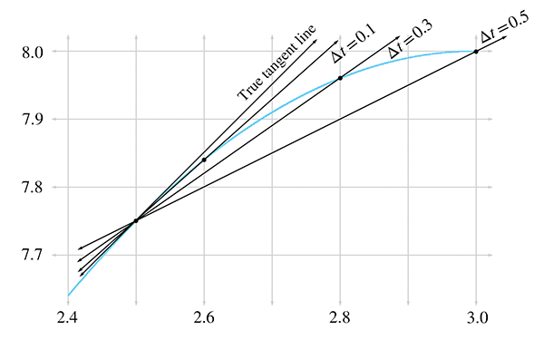
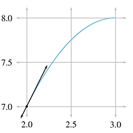
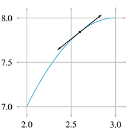
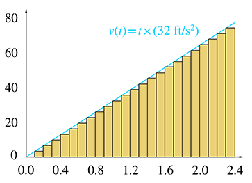
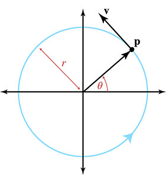

[<< Mathematical Topics\\ from 3D Graphics](graphics.html)

[Contents](./)

[Mechanics 2: Linear and Rotational Dynamics >>](dynamics.html)

Chapter 11 

Mechanics 1: Linear Kinematics and Calculus

Never mistake motion for action.

— Ernest Hemingway (1899–1961

“Ladies and gentlemen, may I direct your attention to the center ring. Witness before you two ordinary textbooks, one labeled _College Physics_ and the other _Calculus_. Their combined 2,500+ pages weigh over 25 lbs. Yet in this chapter and the next, your brave stunt-authors will attempt a most death-defying and impossible spectacle of mysticism and subterfuge: to reduce these two massive books into a mere 150 pages!”

Just like any good circus act, this one is prefaced with a lot of build up to set your expectations. The difference here is that the purpose of our preface is to _lower_ your expectations.

# 11.1Overview and Other Expectation-Reducing  
Remarks

OK, there's no way we can really cover all of physics and calculus in two chapters. As any politician knows, the secret to effectively communicate complicated subject matter in a short amount of time is to use lies, both the omission and commission kind. Let's talk about each of these kinds of lies in turn, so you will know what's really in store.

## 11.1.1What is Left Out?

Just about everything—let's talk about what we are leaving out of physics first. To put the word “physics” on this chapter would be even more of an insult to people who do real physics than this chapter already is. We are concerned only with _mechanics_, and very simple mechanics of rigid bodies at that. Some topics traditionally found in a first-year physics textbook that are _not_ discussed in this book include:

*   energy and work
*   temperature, heat transfer, thermodynamics, entropy
*   electricity, magnetism, light
*   gases, fluids, pressure
*   oscillation and waves.

A note about energy and work is in order, because even in the limited context of mechanics, the fundamental concept of energy plays a central role in traditional presentations. Many problems are easier to solve by using conservation of energy than by considering the forces and applying Newton's laws. (In fact, an alternative to the Newtonian dynamics that we study in this book exists. It is known as _Lagrangian dynamics_ and focuses on energy rather than forces. When used properly, both systems produce the same results, but Lagrangian dynamics can solve certain problems more elegantly and is especially adept at handling friction, compared to Newtonian dynamics.) However, at the time of this writing, basic general purpose digital simulations are based on Newtonian dynamics, and energy does not play a direct role. That isn't to say an understanding of energy is useless; indeed disobedience of the conservation of energy law is at the heart of many simulation problems! Thus, energy often arises more as a way to understand the (mis)behavior of a digital simulation, even if it doesn't appear in the simulation code directly.

Now let's talk about the ways in which this book will irritate calculus professors. We think that a basic understanding of calculus is really important to fully grasp many of the concepts from physics. Conversely, physics provides some of the best examples for explaining calculus. Calculus and physics are often taught separately, usually with calculus coming first. It is our opinion that this makes calculus harder to learn, since it robs the student of the most intuitive examples—the physics problems for which calculus was invented to solve! We hope interleaving calculus with physics will make it easier for you to learn calculus.

Our calculus needs are extremely modest in this book, and we have left out even more from calculus than we did from physics. After reading this chapter, you should know:

*   The basic idea of what a derivative measures and what it is used for.
*   The basic idea of what an integral measures and what it is used for.
*   Derivatives and integrals of trivial expressions containing polynomials and trig functions.

Of course, we are aware that a large number of readers may already have this knowledge. Take a moment to put yourself into one of the following categories:

1.  I know absolutely nothing about derivatives or integrals.
2.  I know the basic idea of derivatives and integrals, but probably couldn't solve any freshman calculus problems with a pencil and paper.
3.  I have studied some calculus.

Level 2 knowledge of calculus is sufficient for this book, and our goal is to move everybody who is currently in category 1 into category 2. If you're in category 3, our calculus discussions will be a (hopefully entertaining) review.We have no delusions that we can move anyone who is not already there into category 3.

## 11.1.2Some Helpful Lies about Our Universe

The universe is commonly thought to be discrete in both space and time. Not only is matter broken up into discrete chunks called atoms, but there is evidence that the very fabric of space and time is broken up into discrete pieces also. Now, there is a difference of opinion as to whether it's really that way or just appears that way because the only way we can interact with space is to throw particles at it, but it's our opinion that if it looks like a duck, walks like a duck, quacks like a duck, has webbed feet and a beak, then it's a good working hypothesis that it tastes good when put into eggrolls with a little dark sauce.

For a long time, the mere thought that the universe might not be continuous had not even considered the slightest possibility of crossing anybody's mind, until the ancient Greeks got a harebrained and totally unjustified idea that things might be made up of atoms. The fact that this later turned out to be true is regarded by many as being good luck rather then good judgment. Honestly, who would have thought it? After all, everyday objects, such as the desk on which one of the authors is currently resting his wrists as he types this sentence, give every appearance of having smooth, continuous surfaces. But who cares? Thinking of the desk as having a smooth, continuous surface is a harmless but useful delusion that lets the author rest his wrists comfortably without worrying about atomic bond energy and quantum uncertainty theory at all.

Not only is this trick of thinking of the world as continuous a handy psychological rationalization, it's also good mathematics. It turns out that the math of continuous things is a lot less unwieldy than the math of discrete things. That's why the people who were thinking about how the world works in the 15th century were happy to invent a mathematics for a continuous universe; experimentally, it was a good approximation to reality, and theoretically the math worked out nicely. Sir Isaac Newton was thus able to discover a lot of fundamental results about continuous mathematics, which we call “calculus,” and its application to the exploration of a continuous universe, which we call “physics.”

Now, we're mostly doing this so that we can model a game world inside a computer, which is inherently discrete. There's a certain amount of cognitive dissonance involved with programming a discrete simulation of a continuous model of a discrete universe, but we'll try not to let it bother us. Suffice it to say that we are in complete control of the discrete universe inside our game, and that means that we can choose the kind of physics that applies inside that universe. All we really need is for the physical laws to be sufficiently like the ones we're used to for the player to experience willing suspension of disbelief, and hopefully say, “Wow! Cool!” and want to spend more money. For almost all games that means a cozy Newtonian universe without the nasty details of quantum mechanics or relativity. Unfortunately, that means also that there are a pair of nasty trolls lurking under the bridge, going by the names of chaos and instability, but we will do our best to appease them.

For the moment, we are concerned about the motion of a small object called a “particle.” At any given moment, we know its position and velocity.[1](#footnote_1) The particle has mass. We do not concern ourselves with the orientation of the particle (for now), and thus we don't think of the particle as spinning. The particle does not have any size, either. We will defer adding those elements until later, when we shift from particles to rigid bodies.

We are studying classical mechanics, also known as Newtonian mechanics, which has several simplifying assumptions that are incorrect in general but true in everyday life in most ways that really matter to us. So we can darn well make sure they are true inside our computer world, if we please. These assumptions are:

*   Time is absolute.
*   Space is Euclidian.
*   Precise measurements are possible.
*   The universe exhibits causality and complete predictability.

The first two are shattered by relatively, and the second two by quantum mechanics. Thankfully, these two subjects are not necessary for video games, because your authors do not have more than a pedestrian understanding of them.

We will begin our foray into the field of mechanics by learning about _kinematics_, which is the study of the equations that describe the motion of a particle in various simple but commonplace situations. When studying kinematics, we are _not_ concerned with the causes of motion—that is the subject of _dynamics_, which will be covered in [Chapter 12](dynamics.html). For now, “ours is not to question why,” ours is just to do the math to get equations that predict the position, velocity, and acceleration of the particle at any given time t , or die. Well, forget about the last part anyway.

Because we are treating our objects as particles and tracking their position only, we will not consider their orientation or rotational effects until [Chapter 12](dynamics.html). When rotation is ignored, all of the ideas of linear kinematics extend into 3D in a straightforward way, and so for now we will be limiting ourselves to 2D (and 1D). This is convenient, since the authors do not know how to design those little origami-like things that lay flat and then pop up when you open the book, and the publisher wouldn't let us even if we were compulsive enough to learn how to do it. Later we'll see why treating objects as particles is perfectly justifiable.

# 11.2Basic Quantities and Units

Mechanics is concerned with the relationship among three fundamental quantities in nature: _length_, _time_, and _mass_. Length is a quantity you are no doubt familiar with; we measure length using units such as centimeters, inches, meters, feet, kilometers, miles, and astronomical units.[2](#footnote_2) Time is another quantity we are very comfortable with measuring, in fact most of us probably learned how to read a clock before we learned how to measure distances.[3](#footnote_3) The units used to measure time are the familiar second, minute, day, week, fortnight,[4](#footnote_4) and so on. The month and the year are often not good units to use for time because different months and years have different durations.

The quantity _mass_ is not quite as intuitive as length and time. The measurement of an object's mass is often thought of as measuring the “amount of stuff” in the object. This is not a bad (or at least, not completely terrible) definition, but its not quite right, either [\[1\]](#reference_1). A more precise definition might be that mass is a measurement of _inertia_, that is, how much resistance an object has to being accelerated. The more massive an object is, the more force is required to start it in motion, stop its motion, or change its motion.

Mass is often confused with _weight_, especially since the units used to measure mass are also used to measure weight: the gram, pound, kilogram, ton, and so forth. The mass of an object is an intrinsic property of an object, whereas the weight is a local phenomenon that depends on the strength of the gravitational pull exerted by a nearby massive object. Your mass will be the same whether you are in Chicago, on the moon, near Jupiter, or light-years away from the nearest heavenly body, but in each case your weight will be very different. In this book and in most video games, our concerns are confined to a relatively small patch on a _flat_ Earth, and we approximate gravity by a constant downward pull. It won't be too harmful to confuse mass and weight because gravity for us will be a constant. (But we couldn't resist a few cool exercises about the International Space Station.)

In many situations, we can discuss the relationship between the fundamental quantities without concern for the units of measurement we are using. In such situations, we'll find it useful to denote length, time, and mass by L , T , and M , respectively. One important such case is in defining _derived quantities_. We've said that length, time, and mass are the fundamental quantities—but what about other quantities, such as area, volume, density, speed, frequency, force, pressure, energy, power, or any of the numerous quantities that can be measured in physics? We don't give any of these their own capital letter, since each of these can be defined in terms of the fundamental quantities.

For example, we might express a measurement of area as a number of “square feet.” We have created a unit that is in terms of another unit. In physics, we say that a measurement of area has the unit “length squared,” or L2 . How about speed? We measure speed using the units such as miles per hour or meters per second. Thus speed is the ratio of a distance per unit time, or L / T .

One last example is frequency. You probably know that _frequency_ measures how many times something happens in a given time interval (how “frequently” it happens). For example, a healthy adult has an average heart rate of around 70 beats per minute (BPM). The motor in a car might be rotating at a rate of 5,000 revolutions per minute (RPM). The NTSC television standard is defined as 29.97 frames per second (FPS). Note that in each of these, we are counting how many times something happens within a given duration of time. So we can write frequency in generic units as 1 / T or T −1 , which you can read as “per unit time.” One of the most important measurements of frequency is the _Hertz_, abbreviated Hz, which means “per second.” When you express a frequency in Hz, you are describing the number of events, oscillations, heartbeats, video frames, or whatever _per second_. By definition, 1  Hz \=1  s −1 .

[Table 11.1](#units_table) summarizes several quantities that are measured in physics, their relation to the fundamental quantities, and some common units used to measure them.

**Quantity**

**Notation**

**SI unit**

**Other units**

Length

L

m

cm , km , in , ft , mi , light year, furlong

Time

T

s

min , hr , ms

Mass

M

kg

g , slug, lb (pound-mass)

Velocity

L / T

m / s

ft / s , m / hr , km / hr

Acceleration

L / T2

m / s 2

ft / s 2 , (m / hr) / s , (km / hr) / s

Force

ML / T2

N  (Newton) = kg⋅m / s2

lb (pound-force), poundal

Area

L2

m2

mm2 , cm2 , km2 , in2 , ft2 , mi2 ,acre, hectare

Volume

L3

m3

mm3 , cm3 , L (liter), in3 , ft3 , teaspoon,fl oz (fluid ounce), cup, pint, quart, gallon

Pressure

Force/Area = (ML / T2) / L2 \= M / (LT2)

Pa  (Pascal) = N / m2 \= kg / (m⋅s2)

psi  ( lbs / in2 ), millibar, inch of mercury, atm  (atmosphere)

Energy

Force × Length = (ML / T2)⋅L \= ML2 / T2

J  (Joule) = N⋅m2 \= kg⋅m s2⋅m \= kg⋅m2 s2

kW⋅hr  (kilowatt-hour), foot-pound, erg, calorie, BTU  (British thermal unit), ton of TNT

Power

Energy / Time = (ML2 / T2) / T \= ML2 / T3

W  (Watt) = J / s \= kg⋅m2 s2 ⋅ s −1 \= kg⋅m2 s3

hp  (horsepower)

Frequency

1 / T\=T −1

Hz\=1 / s\=s −1 \= “per second”

KHz\=1,000 Hz , MHz\=1,000,000 Hz , “per minute”, “per annum”

Table 11.1Selected physical quantities and common units of measurements

Of course, any real measurement doesn't make sense without attaching specific units to it. One way to make sure that your calculations always make sense is to carry around the units at all times and treat them like algebraic variables. For example, if you are computing a pressure and your answer comes out with the units m/s, you know you have done something wrong; pressure has units of force per unit area, or ML / (T2L2) . On the other hand, if you are solving a problem and you end up with an answer in pounds per square inch (psi), but you are looking for a value in Pascals, your answer is probably correct, but just needs to be converted to the desired units. This sort of reasoning is known as _dimensional analysis_. Carrying around the units and treating them as algebraic variables quite often highlights mistakes caused by different units of measurement, and also helps make unit conversion a snap.

Because unit conversion is an important skill, let's briefly review it here. The basic concept is that to convert a measurement from one set of units to another, we multiply that measurement by a well-chosen fraction that has a value of 1. Let's take a simple example: how many feet is 14.57 meters? Looking up the conversion factor,[5](#footnote_5) we see that 1  m ≈3.28083  ft . This means that 1  m / 3.28083  ft ≈1 . So let's take our measurement and multiply it by a special value of “1:”

(11.1)14.57  m \=14.57  m ×1≈14.57  m × 3.28083  ft 1  m ≈47.80  ft .

Our conversion factor tells us that the numerator and denominator of the fraction in [Equation (11.1)](#unit_conversion_example) are equal: 3.28083 feet is _equal to_ 1 meter. Because the numerator and denominator are equal, the “value” of this fraction is 1. (In a physical sense, though, certainly numerically the fraction doesn't equal 1.) And we know that multiplying anything by 1 does not change its value. Because we are treating the units as algebraic variables, the m on the left cancels with the m in the bottom of the fraction.

Of course, applying one simple conversion factor isn't too difficult, but consider a more complicated example. Let's convert 188 km/hr to ft/s. This time we need to multiply by “1” several times:

188 km hr × 1  hr 3600  s × 1000  m 1  km × 3.28083  ft 1  m ≈171 ft s .

# 11.3Average Velocity

We begin our study of kinematics by taking a closer look at the simple concept of speed. How do we measure speed? The most common method is to measure how much time it takes to travel a fixed distance. For example, in a race, we say that the fastest runner is the one who finishes the race in the shortest amount of time.

Consider the fable of the tortoise and the hare. In the story, they decide to have a race, and the hare, after jumping to an early lead, becomes overconfident and distracted. He stops during the race to take a nap, smell the flowers, or some other form of lollygagging. Meanwhile, the tortoise plods along, eventually passing the hare and crossing the finish line first. Now this is a math book and not a self-help book, so please ignore the moral lessons about focus and perseverance that the story contains, and instead consider what it has to teach us about average velocity. Examine [Figure 11.1](#tortoise_hare), which shows a plot of the position of each animal over time.

Figure 11.1 Plot of position versus time during the race between the tortoise and the hare

A play-by-play of the race is as follows. The gun goes off at time t0 , and the hare sprints ahead to time t1 . At this point his hubris causes him to slow his pace, until time t2 when a cute female passes by in the opposite direction. (Her position over time is not depicted in the diagram.) At this point a different tragic male trait causes the hare to turn around and walk with her, and he proceeds to chat her up. At t3 , he realizes that his advances are getting him nowhere, and he begins to pace back and forth along the track dejectedly until time t4 . At that point, he decides to take a nap. Meanwhile, the tortoise has been making slow and steady progress, and at time t5 , he catches up with the sleeping hare. The tortoise plods along and crosses the tape at t6 . Quickly thereafter, the hare, perhaps awakened by the sound of the crowd celebrating the tortoise's victory, wakes up at time t7 and hurries in a frenzy to the finish. At t8 , the hare crosses the finish line, where he is humiliated by all his peers, and the cute girl bunny, too.

To measure the _average velocity_ of either animal during any time interval, we divide the animal's displacement by the duration of the interval. We'll be focusing on the hare, and we'll denote the position of the hare as x , or more explicitly as x(t) , to emphasize the fact that the hare's position varies as a function of time. It is a common convention to use the capital Greek letter delta (“ Δ ”) as a prefix to mean “amount of change in.” For example, Δx would mean “the change in the hare's position,” which is a displacement of the hare. Likewise Δt means “the change in the current time,” or simply, “elapsed time between two points.” Using this notation, the average velocity of the hare from ta to tb is given by the equation

Definition of average velocity

average velocity \= displacement elapsed time \= Δx Δt \= x(tb)−x(ta) tb−ta .

This is the definition of average velocity. No matter what specific units we use, velocity always describes the ratio of a length divided by a time, or to use the notation discussed in [Section 11.2](#quantities_and_units), velocity is a quantity with units L / T .

If we draw a straight line through any two points on the graph of the hare's position, then the slope of that line measures the average velocity of the hare over the interval between the two points. For example, consider the average velocity of the hare as he decelerates from time t1 to t2 , as shown in [Figure 11.2](#tortoise_hare_average_velocity_slope). The slope of the line is the ratio Δx / Δt . This slope is also equal to the tangent of the angle marked α , although for now the values Δx and Δt are the ones we will have at our fingertips, so we won't need to do any trig.

Figure 11.2Determining average velocity graphically

Returning to [Figure 11.1](#tortoise_hare), notice that the hare's average velocity from t2 to t3 is _negative_. This is because velocity is defined as the ratio of _net displacement_ over time. Compare this to speed, which is the _total distance_ divided by time and cannot be negative. The sign of displacement and velocity are sensitive to the direction of travel, whereas distance and speed are intrinsically nonnegative. We've already spoken about these distinctions way back in [Section 2.2](vectors.html#geometric_definition). Of course it's obvious that the average velocity is negative between t2 and t3 , since the hare was going backwards during the entire interval. But average velocity can also be negative on an interval even in situations where forward progress is being made for a portion of the interval, such as the larger interval between t2 and t4 . It's a case of “one step forward, two steps back.”

Average velocity can also be zero, as illustrated during the hare's nap from t4 to t7 . In fact, the average velocity will be zero any time an object starts and ends at the same location, even if it was it motion during the entire interval! (“Two steps forward, two steps back.”) Two such intervals are illustrated in [Figure 11.3](#tortoise_hare_average_velocity_zero_pacing).

Figure 11.3 Two intervals during which the hare has no net displacement, and thus his average velocity is zero

And, of course, the final lesson of the fable is that the average velocity of the tortoise is _greater_ than the average velocity of the hare, at least from t0 to t7 , when the tortoise crosses the finish line. This is true despite the fact that the hare's average _speed_ was higher, since he certainly traveled a larger distance with all the female distractions and pacing back and forth.

One last thing to point out. If we assume the hare learned his lesson and congratulated the tortoise (after all, let's not attribute to the poor animal _all_ the negative personality traits!), then at t\=t8 they were standing at the same place. This means their net displacements from t0 to t8 are the same, and thus they have the _same_ average velocity during this interval.

# 11.4Instantaneous Velocity and the Derivative

We've seen how physics defines and measures the average velocity of an object over an interval, that is, between two time values that differ by some finite amount Δt . Often, however, it's useful to be able to speak of an object's _instantaneous velocity_, which means the velocity of the object for one value of t , a single moment in time. You can see that this is not a trivial question because the familiar methods for measuring velocity, such as

average velocity \= displacement elapsed time \= Δx Δt \= x(tb)−x(ta) tb−ta ,

don't work when we are considering only a single instant in time. What are ta and tb , when we are looking at only one time value? In a single instant, displacement and elapsed time are both zero; so what is the meaning of the ratio Δx / Δt ? This section introduces a fundamental tool of calculus known as the _derivative_. The derivative was invented by Newton to investigate precisely the kinematics questions we are asking in this chapter. However, its applicability extends to virtually every problem where one quantity varies as a function of some other quantity. (In the case of velocity, we are interested in how position varies as a function of time.)

Because of the vast array of problems to which the derivative can be applied, Newton was not the only one to investigate it. Primitive applications of integral calculus to compute volumes and such date back to ancient Egypt. As early as the 5th century, the Greeks were exploring the building blocks of calculus such as infinitesimals and the method of exhaustion. Newton usually shares credit with the German mathematician Gottfried Leibniz[6](#footnote_6) (1646–1716) for inventing calculus in the 17th century, although Persian and Indian writings contain examples of calculus concepts being used. Many other thinkers made significant contributions, includingFermat, Pascal, and Descartes.[7](#footnote_7) It's somewhat interesting that many of the earlier applications of calculus were integrals, even though most calculus courses cover the “easier” derivative before the “harder” integral.

We first follow in the steps of Newton and start with the physical example of velocity, which we feel is the best example for obtaining intuition about how the derivative works. Afterwards, we consider several other examples where the derivative can be used, moving from the physical to the more abstract.

## 11.4.1Limit Arguments and the Definition of the Derivative

Back to the question at hand: how do we measure instantaneous velocity? First, let's observe one particular situation for which it's easy: if an object moves with constant velocity over an interval, then the velocity is the same at every instant in the interval. That's the very definition of constant velocity. In this case, the average velocity over the interval must be the same as the instantaneous velocity for any point within that interval. In a graph such as [Figure 11.1](#tortoise_hare), it's easy to tell when the object is moving at constant velocity because the graph is a straight line. In fact, almost all of [Figure 11.1](#tortoise_hare) is made up of straight line segments,[8](#footnote_8) so determining instantaneous velocity is as easy as picking any two points on a straight-line interval (the endpoints of the interval seem like a good choice, but any two points will do) and determining the average velocity between those endpoints.

But consider the interval from t1 to t2 , during which the hare's overconfidence causes him to gradually decelerate. On this interval, the graph of the hare's position is a curve, which means the slope of the line, and thus the velocity of the hare, is changing continuously. In this situation, measuring instantaneous velocity requires a bit more finesse.

For concreteness in this example, let's assign some particular numbers. To keep those numbers round (and also to stick with the racing theme), please allow the whimsical choice to measure time in minutes and distance in furlongs.[9](#footnote_9) We will assign t1\=1  min and t2\=3  min , so the total duration is 2 minutes. Let's say that during this interval, the hare travels from x(1)\=4  fur to x(3)\=8  fur .[10](#footnote_10) For purposes of illustration, we will set our sights on the answer to the question: what is the hare's instantaneous velocity at t\=2.5  min ? This is all depicted in [Figure 11.4](#instantaneous_velocity_1).

Figure 11.4 What is the hare's velocity at t\=2.5  min ?

It's not immediately apparent how we might measure or calculate the velocity at the _exact moment_ t\=2.5 , but observe that we can get a good approximation by computing the average velocity of a very small interval near t\=2.5 . For a small enough interval, the graph is nearly the same as a straight line segment, and the velocity is nearly constant, and so the instantaneous velocity at any given instant within the interval will not be too far off from the average velocity over the whole interval.

In [Figure 11.5](#instantaneous_velocity_2), we fix the left endpoint of a line segment at t\=2.5 and move the right endpoint closer and closer. As you can see, the shorter the interval, the more the graph looks like a straight line, and the better our approximation becomes. Thinking graphically, as the second endpoint moves closer and closer to t\=2.5 , the slope of the line between the endpoints will converge to the slope of the line that is _tangent_ to the curve at this point. A tangent line is the graphical equivalent of instantaneous velocity, since it measures the slope of the curve just at that one point.

Figure 11.5 Approximating instantaneous velocity as the average velocity of a smaller and smaller interval

Let's carry out this experiment with some real numbers and see if we cannot approximate the instantaneous velocity of the hare. In order to do this, we'll need to be able to know the position of the hare at any given time, so now would be a good time to tell you that the position of the hare is given by the function[11](#footnote_11)

x(t)\=−t2+6t−1.

[Table 11.2](#instantaneous_velocity_tabulated_values) shows tabulated calculations for average velocity over intervals with a right hand endpoint t+Δt that moves closer and closer to t\=2.5 .

The right-most column, which is the average velocity, appears to be converging to a velocity of 1 furlong/minute. But how certain are we that this is the correct value? Although we do not have any calculation that will produce a resulting velocity of exactly 1 furlong/minute, for all practical purposes, we may achieve any degree of accuracy desired by using this approximation technique and choosing Δt sufficiently small. (We are ignoring issues related to the precision of floating point representation of numbers in a computer.)

t

Δt

t+Δt

x(t)

x(t+Δt)

x(t+Δt)−x(t)

x(t+Δt)−x(t) Δt

\[6pt\] 2.500

0.500

3.000

7.750

8.0000

0.2500

0.5000

2.500

0.100

2.600

7.750

7.8400

0.0900

0.9000

2.500

0.050

2.550

7.750

7.7975

0.0475

0.9500

2.500

0.010

2.510

7.750

7.7599

0.0099

0.9900

2.500

0.005

2.505

7.750

7.7549

0.0049

0.9950

2.500

0.001

2.501

7.750

7.7509

0.0009

0.9990

Table 11.2Calculating average velocity for intervals of varying durations

This is a powerful argument. We have essentially assigned a value to an expression that we cannot evaluate directly. Although it is mathematically illegal to substitute Δt\=0 into the expression, we can argue that for smaller and smaller values of Δt , we converge to a particular value. In the parlance of calculus, this value of 1 furlong/minute is a _limiting value_, meaning that as we take smaller and smaller positive values for Δt , the result of our computation approaches 1, but does not cross it (or reach it exactly).

Convergence arguments such as this are defined with rigor in calculus by using a formalized tool known as a _limit_. The mathematical notation for this is

(11.2)v(t)\=lim Δt→0 x(t+Δt)−x(t) Δt .

The notation \` → ' is usually read as “approaches” or “goes to.” So the right side of [Equation (11.2)](#instantaneous_velocity_as_limit) might be read as

‘‘The limit of  x(t+Δt)−x(t) Δt   as  Δt  approaches zero,''

or

‘‘The limit as  Δt  approaches zero of  x(t+Δt)−x(t) Δt .''

In general, an expression of the form lim a→k \[ blah \] is interpreted to mean “The value that \[blah\] converges to, as a gets closer and closer to k .”

This is an important idea, as it defines what we mean by instantaneous velocity.

Instantaneous velocity at a given time t may be interpreted as the average velocity of an interval that contains t , in the limit as the duration of the interval approaches zero.

We won't have much need to explore the full power of limits or get bogged down in the finer points; that is the mathematical field of _analysis_, and would take us a bit astray from our current, rather limited,[12](#footnote_12) objectives. We are glossing over some important details[13](#footnote_13) so that we can focus on one particular case, and that is the use of limits to define the _derivative_.

The derivative measures the _rate of change_ of a function. Remember that “function” is just a fancy word for any formula, computation, or procedure that takes an input and produces an output. The derivative quantifies the rate at which the output of the function will change in response to a change to the input. If x denotes the value of a function at a specific time  t , the derivative of that function at t is the ratio dx / dt . The symbol dx represents the change in the output produced by a very small change in the input, represented by dt . We'll speak more about these “small changes” in more detail in just a moment.

For now, we are in an imaginary racetrack where rabbits and turtles race and moral lessons are taught through metaphor. We have a function with an input of t , the number of minutes elapsed since the start of the race, and an output of x , the distance of the hare along the racetrack. The rule we use to evaluate our function is the expression x(t)\=−t2+6t−1 . The derivative of this function tells us the rate of change of the hare's position with respect to time and is the _definition_ of instantaneous velocity. Just previously, we defined instantaneous velocity as the average velocity taken over smaller and smaller intervals, but this is essentially the same as the definition of the derivative. We just phrased it the first time using terminology specific to position and velocity.

When we calculate a derivative, we won't end up with a single number. Expecting the answer to “What is the velocity of the hare?” to be a single number makes sense only if the velocity is the same everywhere. In such a trivial case we don't need derivatives, we can just use average velocity. The interesting situation occurs when the velocity varies over time. When we calculate the derivative of a position function in such cases, we get a velocity _function_, which allows us to calculate the instantaneous velocity at any point in time.

The previous three paragraphs express the most important concepts in this section, so please allow us to repeat them.

A derivative measures a rate of change. Since velocity is the rate of change of position with respect to time, the derivative of the position function is the velocity function.

The next few sections discuss the mathematics of derivatives in a bit more detail, and we return to kinematics in [Section 11.5](#acceleration). This material is aimed at those who have not had[14](#footnote_14) first-year calculus. If you already have a calculus background, you can safely skip ahead to [Section 11.5](#acceleration) unless you feel in need of a refresher.

[Section 11.4.2](#examples_of_derivatives) lists several examples of derivatives to give you a better understanding of what it means to measure a rate of change, and also to back up our claim that the derivative has very broad applicability. [Section 11.4.3](#calculating_derivatives_definition) gives the formal mathematical definition of the derivative[15](#footnote_15) and shows how to use this definition to solve problems. We also finally figure out how fast that hare was moving at t\=2.5 . [Section 11.4.4](#derivative_notations) lists various commonly used alternate notations for derivatives, and finally, [Section 11.4.5](#derivative_rules) lists just enough rules about derivatives to satisfy the very modest differential calculus demands of this book.

## 11.4.2Examples of Derivatives

Velocity may be the easiest introduction to the derivative, but it is by no means the only example. Let's look at some more examples to give you an idea of the wide array of problems to which the derivative is applied.

The simplest types of examples are to consider other quantities that vary with time. For example, if R(t) is the reading of a rain meter at a given time t , then the derivative, denoted R′(t) , describes how hard it was raining at time t . Perhaps P(t) is the reading of a pressure valve on a tank containing some type of gas. Assuming the pressure reading is proportional to the mass of the gas inside the chamber,[16](#footnote_16) the rate of change P′(t) indicates how fast gas is flowing into or out of the chamber attime t .

There are also physical examples for which the independent variable is not time. The prototypical case is a function y(x) that gives the height of some surface above a reference point at the horizontal position x . For example, perhaps x is the distance along our metaphorical racetrack and y measures the height at that point above or below the altitude at the starting point. The derivative y′(x) of this function is the slope of the surface at x , where positive slopes mean the runners are running uphill, and negative values indicate a downhill portion of the race. This example is not really a new example, because we've looked at graphs of functions and considered how the derivative is a measure of the slope of the graph in 2D.

Now let's become a bit more abstract, but still keep a physical dimension as the independent variable. Let's say that for a popular rock-climbing wall, we know a function S(y) that describes, for a given height y , what percentage of rock climbers are able to reach that height or higher. If we assume the climbers start at y\=0 , then S(0)\=100% . Clearly S(y) is a nonincreasing function that eventually goes all the way down to 0%at some maximum height y max that nobody has ever reached.

Now consider the interpretation of derivative S′(y) . Of course, S′(y)≤0 , since S(y) is nonincreasing. A large negative value of S′(y) is an indication that the height y is an area where climbers are likely to drop[17](#footnote_17) out. Perhaps the wall at that height is a challenging area. S′(y) closer to zero is an indication that fewer climbers drop out at height y . Perhaps there is a plateau that climbers can reach, and there they rest. We might expect S′(y) to decrease just after this plateau, since the climbers are more rested. In fact, S′(y) might also become closer to zero just _before_ the plateau, because as climbers begin to get close to this milestone, they push a bit harder and are more reluctant to give up.[18](#footnote_18)

Figure 11.6Happiness versus salary

One last example. [Figure 11.6](#happy) shows happiness as a function of salary. In this case, the derivative is essentially the same thing as what economists would call “marginal utility.” It's the ratio of additional units of happiness per additional unit of income. According this figure, the marginal utility of income decreases, which of course is the famous law of diminishing returns. According to our research,[19](#footnote_19) it even becomes negative after a certain point, where the troubles associated with high income begin to outweigh the psychological benefits. The economist-speak phrase “negative marginal utility” is translated into everyday language as “stop doing that.”

## 11.4.3Calculating Derivatives from the Definition

Now we're ready for the official[20](#footnote_20) definition of the derivative found in most math textbooks, and to see how we can compute derivatives using the definition. A derivative can be understood as the limiting value of Δx / Δt , the ratio of the change in output divided by the change in input, taken as we make Δt infinitesimally small. Let's repeat this description using mathematical notation. It's an equation we gave earlier in the chapter, only this time we put a big box around it, because that's what math books do to equations that are definitions.

The Definition of a Derivative

(11.3) dx dt \=lim Δt→0 Δx Δt \=lim Δt→0 x(t+Δt)−x(t) Δt .

Here the notation for the derivative dx / dt is known as _Leibniz's notation_. The symbols dx and dt are known as _infinitesimals_. Unlike Δx and Δt , which are variables representing finite changes in value, dx and dt are symbols representing “an infinitesimally small change.” Why is it so important that we use a very small change? Why can't we just take the ratio Δx / Δt directly? Because the rate of change is varying _continuously_. Even within a very small interval of Δt\=.0001 , it is not constant. This is why a limit argument is used, to make the interval as small as we can possibly make it—infinitesimally small.

In certain circumstances, infinitesimals may be manipulated like algebraic variables (and you can also attach units of measurement to them and carry out dimensional analysis to check your work). The fact that such manipulations are often correct is what gives Leibniz notation its intuitive appeal. However, because they are infinitely small values, they require special handling, similar to the symbol ∞ , and so should not be tossed around willy-nilly. For the most part, we interpret the notation dx dt not as a ratio of two variables, but as a single symbol that means “the derivative of x with respect to t .” This is the safest procedure and avoids any chance of the aforementioned willy-nilliness. We have more to say later on Leibniz and other notations, but first, let's finally calculate a derivative and answer the burning question: how fast was the hare traveling at t\=2.5 ?

Differentiating a simple function by using the definition [Equation (11.3)](#derivative_definition) is an important rite of passage, and we are proud to help you cross this threshold. The typical procedure is this:

1.  Substitute x(t) and x(t+Δt) into the definition. (In our case, x(t)\=−t2+6t−1 ).
2.  Perform algebraic manipulations until it is legal to substitute Δt\=0 . (Often this boils down to getting Δt out of the denominator.)
3.  Substitute Δt\=0 , which evaluates the expression “at the limit,” removing the limit notation.
4.  Simplify the result.

Applying this procedure to our case yields

v(t)\= dx dt \=lim Δt→0 x(t+Δt)−x(t) Δt \=lim Δt→0 \[−(t+Δt)2+6(t+Δt)−1\]−(−t2+6t−1) Δt \=lim Δt→0 (−t2−2t(Δt)−(Δt)2+6t+6(Δt)−1)+(t2−6t+1) Δt \=lim Δt→0 −2t(Δt)−(Δt)2+6(Δt) Δt \=lim Δt→0 Δt (−2t−Δt+6) Δt (11.4)\=lim Δt→0 −2t−Δt+6 .

Now we are at step 3. Taking the limit in [Equation (11.4)](#compute_derivative_from_definition_example_1) is now easy; we simply substitute Δt\=0 . This substitution was not legal earlier because there was a Δt in the denominator:

v(t)\= dx dt \=lim Δt→0 −2t−Δt+6 \=−2t−(0)+6(11.5)\=−2t+6.

v(2.0)\=−2(2.0)+6\=2.0

v(2.4)\=−2(2.4)+6\=1.2

v(2.5)\=−2(2.5)+6\=1.0

v(2.6)\=−2(2.6)+6\=0.8

v(3.0)\=−2(3.0)+6\=0.0

Figure 11.7The hare's velocity and corresponding tangent line at selected times

Finally! [Equation (11.5)](#hare_instantaneous_velocity_solution) is the velocity function we've been looking for. It allows us to plug in any value of t and compute the instantaneous velocity of the hare at that time. Putting in t\=2.5 , we arrive at the answer to our question:

v(t)\=−2t+6,v(2.5)\=−2(2.5)+6\=1.

So the instantaneous velocity of the hare at t\=2.5 was precisely 1 furlong per minute, just as our earlier arguments predicted. But now we can say it with confidence.

[Figure 11.7](#instantaneous_velocity_3) shows this point and several others along the interval we've been studying. For each point, we have calculated the instantaneous velocity at that point according to [Equation (11.5)](#hare_instantaneous_velocity_solution) and have drawn the tangent line with the same slope.

It's very instructive to compare the graphs of position and velocity side by side. [Figure 11.8](#tortoise_hare_position_and_velocity) compares the position and velocity of our fabled racers.

Figure 11.8 Comparing position and velocity

There are several interesting observations to be made about [Figure 11.8](#tortoise_hare_position_and_velocity).

*   When the position graph is a horizontal line, there is zero velocity, and the velocity graph traces the v\=0 horizontal axis (for example, during the hare's nap).
*   When the position is increasing, the velocity is positive, and when the position is decreasing (the hare is moving the wrong way) the velocity is negative.
*   When the position graph is a straight line, this constant velocity is indicated by a horizontal line in the velocity graph.
*   When the position graph is curved, the velocity is changing continuously, and the velocity graph will not be a horizontal line. In this case, the velocity graph happens to be a straight line, but later we'll examine situations where the velocity graph is curved.
*   When the position function changes slope at a “corner,” the velocity graph exhibits a discontinuity. In fact, the derivative at such points does not exist, and there is no way to define the instantaneous velocity at those points of discontinuity. Fortunately, such situations are nonphysical—in the real world, it is impossible for an object to change its velocity instantaneously. Changes to velocity always occur via an acceleration over a (potentially brief, but finite) amount of time.[21](#footnote_21) Later we show that such rapid accelerations over short durations are often approximated by using _impulses_.
*   There are sections on the velocity graph that look identical to each other even though the corresponding intervals on the position graph are different from one another. This is because the derivative measures only the rate of change of a variable. The absolute value of the function does not matter. If we add a constant to a function, which produces a vertical shift in the graph of that function, the derivative will not be affected. We have more to say on this when we talk about the relationship between the derivative and integral.

At this point, we should acknowledge a few ways in which our explanation of the derivative differs from most calculus textbooks. Our approach has been to focus on one specific example, that of instantaneous velocity. This has led to some cosmetic differences, such as notation. But there were also many finer points that we are glossing over. For example, we have not bothered defining continuous functions, or given rigorous definitions for when the derivative is defined and when it is not defined. We have discussed the _idea_ behind what a limit is, but have not provided a formal definition or considered limits when approached from the left and right, and the criteria for the existence of a well-defined limit. We feel that leading off with the best intuitive example is always the optimum way to teach something, even if it means “lying” to the reader for a short while. If we were writing a calculus textbook, at this point we would back up and correct some of our lies, reviewing the finer points and giving more precise definitions.

However, since this is _not_ a calculus textbook, we will only warn you that what we said above is the big picture, but isn't sufficient to handle many edge cases when functions do weird things like go off into infinity or exhibit “jumps” or “gaps.” Fortunately, such edge cases just don't happen too often for functions that model physical phenomena, and so these details won't become an issue for us in the context of physics.

We _do_ have room, however, to mention alternate notations for the derivative that you are likely to encounter.

## 11.4.4Notations for the Derivative

Several different notations for derivatives are in common use. Let's point out some ways that other texts might look different from what we've said here. First of all, there is a trivial issue of naming. Most calculus textbooks define the derivative in very general terms, where the output variable is named y , the symbol x refers to the input variable rather than the output variable, and the function is simply named f . In other words, the function being differentiated is y\=f(x) . Furthermore, many will assign the shrinking “step amount” to the variable h rather than using the Δ notation, which has advantages when solving the equations that result when you work out derivatives from the definition.[22](#footnote_22) With these variables, they would define the derivative as

Definition of a derivative using variables in most calculus textbooks

(11.6) dy dx \=lim h→0 y(x+h)−y(x) h .

The differences between Equations [(11.3)](#derivative_definition) and [(11.6)](#derivative_definition_textbook) are clearly cosmetic.

A variation on the Leibniz notation we prefer in this book is to prefix an expression with d / dt to mean “the derivative with respect to t of this thing on the right.” For example

d dt (t2+5t)

can be read as “the derivative with respect to t of t2+5t .” This is a very descriptive and intuitive notation. If we call the expression on the right x , and interpret the juxtaposition of symbols as multiplication, we can pull the x back on top of the fraction to get our original notation, as in

d dt (t2+5t)\= d dt x\= dx dt .

It's important to interpret these manipulations as notational manipulations rather than having any real mathematical meaning. The notation is attractive because such algebraic manipulations with the infinitesimals often work out. But we reiterate our warning to avoid attaching much mathematical meaning to such operations.

Another common notation is to refer to the derivative of a function f(x) with a prime: f′(x) . This is known as _prime notation_ or _Lagrange's_

_notation_. It's used when the independent variable that we are differentiating with respect to is implied or understood by context. Using this notation we would define velocity as the derivative of the position function by v(t)\=x′(t) .

One last notation, which was invented by Newton and is used mostly when the independent variable is time (such as in the physics equations Newton invented), is _dot notation_. A derivative is indicated by putting a dot over the variable; for example, v(t)\= x˙ (t) .

Here is a summary of the different notations for the derivative you will see, using velocity and position as the example:

v(t)\= dx dt \=d dt x(t)\=x′(t)\= x˙ (t).

## 11.4.5A Few Differentiation Rules and Shortcuts

Now let's return to calculating derivatives. In practice, it's seldom necessary to go back to the definition of the derivative in order to differentiate an expression. Instead, there are simplifying rules that allow you to break down complicated functions into smaller pieces that can then be differentiated. There are also special functions, such as ln⁡x and tan⁡x , for which the hard work of applying the definition has already been done and written down in those tables that line the insides of the front and back covers of calculus books. To differentiate expressions containing such functions, one simply refers to the table (although we're going to do just a bit of this “hard work” ourselves for sine and cosine).

In this book, our concerns are limited to the derivatives of a very small set of functions, which luckily can be differentiated with just a few simple rules. Unfortunately, we don't have the space here to develop the mathematical derivations behind these rules, so we are simply going to accompany each rule with a brief explanation as to how it is used, and a (mathematically nonrigorous) intuitive argument to help you convince yourself that it works.

Our first rule, known as the _constant rule_, states that the derivative of a constant function is zero. A constant function is a function that always produces the same value. For example, x(t)\=3 is a constant function. You can plug in any value of t , and this function outputs the value 3. Since, the derivative measures how fast the output of a function changes in response to changes in the input t , in the case of a constant function, the output _never changes_, and so the derivative is x′(t)\=0 .

The Constant Rule

d dt k\=0,k is any constant.

The next rule, sometimes known as the _sum rule_, says that differentiation is a _linear_ operator. The meaning of “linear” is essentially identical to our definition given in [Chapter 5](matrixtransforms.html), but let's review it in the context of the derivative. To say that the derivative is a linear operator means two things. First, to take the derivative of a sum, we can just take the derivative of each piece individually, and add the results together. This is intuitive—the rate of change of a sum is the total rate of change of all the parts added together. For example, consider a man who moves about on a train. His position in world space can be described as the sum of the train's position, plus the man's position in the body space of the train.[23](#footnote_23) Likewise, his velocity relative to the ground is the sum of the train's velocity relative to the ground, plus his velocity relative to the train.

Derivative of a Sum

(11.7) d dt \[f(t)+g(t)\] \= d dt f(t)+ d dt g(t).

The second property of linearity is that if we multiply a function by some constant, the derivative of that function gets scaled by that same constant. One easy way to see that this must be true is to consider unit conversions. Let's return to our favorite function that yields a hare's displacement as a function of time, measured in furlongs. Taking the derivative of this function with respect to time yields a velocity, in furlongs per minute. If somebody comes along who doesn't like furlongs, we can switch from furlongs to meters, by scaling the original position function by a factor of 201.168. This _must_ scale the derivative by the same factor, or else the hare would suddenly change speed just because we switched to another unit.

Derivative of a Function Times a Constant

(11.8) d dt \[kf(t)\] \=k \[ d dt f(t)\] ,k is any constant.

If we combine Equations [(11.7)](#derivative_linear_1) and [(11.8)](#derivative_linear_2), we can state the linearity rule in a more general way.

The Sum Rule

(11.4.5) d dt \[af(t)+bg(t)\] \=a \[ d dt f(t)\] +b \[ d dt g(t)\] .

The linear property of the derivative is very important since it allows us to break down many common functions into smaller, easier pieces.

One of the most important and common functions that needs to be differentiated also happens to be the easiest: the polynomial. Using the linear property of the derivative, we can break down, for example, a fourth-degree polynomial with ease:

x(t)\=c4t4+c3t3+c2t2+c1t+c0, dx dt \= d dt \[c4t4+c3t3+c2t2+c1t+c0\](11.9)\=c4 \[ d dt t4\] +c3 \[ d dt t3\] +c2 \[ d dt t2\] +c1 \[ d dt t\] + \[ d dt c0\] .

The last derivative d dt c0 is zero by the constant rule, since c0 does not vary. This leaves us with four simple derivatives, each of which can be plugged into the definition of a derivative, [Equation (11.3)](#derivative_definition), without too much trouble. Solving each of these four individually is considerably easier than plugging the original polynomial into [Equation (11.3)](#derivative_definition). If you do go through this exercise (like every first-year calculus student does), you notice two things. First of all, the algebraic tedium increases as the power of t gets higher. Second, a quite obvious pattern is revealed, known as the _power rule_.

The Power Rule

d dt tn\=nt n−1 ,n is an integer.

This rule gives us the answers to the four derivatives needed above:

d dt t4\=4t3, d dt t3\=3t2, d dt t2\=2t1\=2t, d dt t\=1t0\=1.

Notice in the last equation we used the identity t0\=1 . However, even without that identity,[24](#footnote_24) it should be very clear that d dt t _must_ be unity. Remember that the derivative answers the question, “What is the rate of change of the output, relative to the rate of change of the input?” In the case of d dt t , the “output” and the “input” are both the variable t , and so their rates of change are equal. Thus the ratio that defines the derivative is equal to one.

One last comment before we plug these results into [Equation (11.9)](#derivative_polynomial_example_after_sum_rule) to differentiate our polynomial. Using the identity t0\=1 , the power rule is brought into harmony with the constant rule:

Derivative of a constant, using the power rule

d dt k\= d dt (kt0) Using  t0\=1,\=k \[ d dt t0\] Linear property of derivative ,\=k\[0(t −1 )\] Power rule for  n\=0,\=0.

Let's get back to our fourth-degree polynomial. With the sum and power rule at our disposal, we can make quick work of it:

x(t)\=c4t4+c3t3+c2t2+c1t+c0, dx dt \=4c4t3+3c3t2+2c2t+c1.

Below are several more examples of how the power rule can be used. Notice that the power rule works for negative exponents as well:

d dt (3t5−4t)\=15t4−4, d dt (t 100 100+π) \=t 99 , d dt (1t+4t3) \= d dt (t −1 +4t −3 ) \=−t −2 −12t −4 \= −1 t2−12t4.

## 11.4.6Derivatives of Some Special Functions  
with Taylor Series

This section looks at some very special examples of differentiating polynomials. Given any arbitrary function f(x) , the _Taylor series_ of f is a way to express f as a polynomial. Each successive term in the polynomial is determined by taking a higher order derivative of the function, which is perhaps the main point of Taylor series that you should learn when you take a real calculus class, but right now we're not interested in where Taylor series come from, just that they exist. The Taylor series is a very useful tool in video games because it provides polynomial approximations, which are “easy” to evaluate in a computer, for functions that are otherwise “hard” to evaluate. We don't have the space to discuss much of anything about Taylor series in general, but we would like to look at a few important examples of Taylor series. The Taylor series for the sine and cosine functions are

Taylor series for sin⁡(x) and cos⁡(x)

sin⁡x\=x− x3 3! + x5 5! − x7 7! + x9 9! +⋯,(11.10)cos⁡x\=1− x2 2! + x4 4! − x6 6! + x8 8! +⋯.

This pattern continues forever; in other words, to compute the exact value of sin⁡x would require us to evaluate an infinite number of terms. However, notice that the denominators of the terms are growing very rapidly, which means we can approximate sin⁡x simply by stopping after a certain number of terms, and ignore the rest.

This is exactly the process by which trigonometric functions are computed inside a computer. First, trig identities are used to get the argument into a restricted range (since the functions are periodic). This is done because when the Taylor series is truncated, its accuracy is highest near a particular value of x , and in the case of the trig functions, this point is usually chosen to be x\=0 .[25](#footnote_25) Then the Taylor series polynomial with, say, four terms is evaluated. This approximation is highly accurate. Stopping at the x7 term is sufficient to calculate sin⁡x to about five and a half decimal digits for −1<x<+1 .

All this trivia concerning approximations is interesting, but our real reason for bringing up Taylor series is to use them as nontrivial examples of differentiating polynomials with the power rule, and also to learn some interesting facts about the sine, cosine, and exponential functions. Let's use the power rule to differentiate the Taylor series expansion of sin⁡(x) . It's not that complicated—we just have to differentiate each term by itself. We're not even intimidated by the fact that there are an infinite number of terms:

Differentiating Taylor series for sin⁡(x)

d dx sin⁡x\= d dx (x− x3 3! + x5 5! − x7 7! + x9 9! +⋯) \= d dx x− d dx x3 3! + d dx x5 5! − d dx x7 7! + d dx x9 9! +⋯(Sum rule)\=1− 3x2 3! + 5x4 4! − 7x6 7! + 9x8 9! +⋯(Power rule)(11.11)\=1− x2 2! + x4 4! − x6 6! + x8 8! +⋯

In the above derivation, we first used the sum rule, which says that to differentiate the whole Taylor polynomial, we can differentiate each term individually. Then we applied the power rule to each term, in each case multiplying by the exponent and decrementing it by one. (And also remembering that d dx  x\=1 for the first term.) To understand the last step, remember the definition of the factorial operator: n!\=1×2×3×⋯×n . Thus the constant in the numerator of each term cancels out the highest factor in the factorial in the denominator.

Does [Equation (11.11)](#differentiate_sin_result_cos) the last look familiar? It should, because it's the same as [Equation (11.10)](#taylor_series_cos), the Taylor series for cos⁡x . In other words, we now know the derivative of sin⁡x , and by a similar process we can also obtain the derivative of cos⁡x . Let's state these facts formally.[26](#footnote_26)

Derivatives of Sine and Cosine

d dx sin⁡x\=cos⁡x, d dx cos⁡x\=−sin⁡x.

The derivatives of the sine and cosine functions will become useful in later sections.

Now let's look at one more important special function that will play an important role later in this book, which will be convenient to be able to differentiate, and which also happens to have a nice, tidy Taylor series. The function we're referring to is the _exponential_ function, denoted ex . The mathematical constant e≈2.718282 has many well known and interesting properties, and pops up in all sorts of problems from finance to signal processing. Much of e 's special status is related to the unique nature of the function ex . One manifestation of this unique nature is that ex has such a beautiful Taylor series:

Taylor series of ex

(11.12)ex\=1+x+ x2 2! + x3 3! + x4 4! + x5 5! +⋯

Taking the derivative gives us

d dx ex\= d dx   (1+x+ x2 2! + x3 3! + x4 4! + x5 5! +⋯) \=0+1+ x 1! + x2 2! + x3 3! + x4 4! +⋯\=1+x+ x2 2! + x3 3! + x4 4! +⋯

But this result is equivalent to the definition of ex in [Equation (11.12)](#exponential_taylor_series); the only difference between them is the cosmetic issue of when to stop listing terms explicitly and end with the “ ⋯ ”. In other words, the exponential function is its own derivative: d / dx ex\=ex . The exponential function is the only function that can boast this unique property. (To be more precise, any _multiple_ of the exponential function, including zero, has this quality.)

The Exponential Function Is Its Own Derivative

d dx ex\=ex.

It is this special property about the exponential function that makes it unique and causes it to come up so frequently in applications. Anytime the rate of change of some value is proportionate to the value itself, the exponential function will almost certainly arise somewhere in the math that describes the dynamics of the system.

The example most of us are familiar with is compound interest. Let P(t) be the amount of money in your bank account at time t ; assume the amount is accruing interest. The rate of change per time interval—the amount of interest earned—is proportional to the amount of money in your account. The more money you have, the more interest you are earning, and the faster it grows. Thus, the exponential function works its way into finance with the equation P(t)\=P0e rt , which describes the amount of money at any given time t , assuming an initial amount P0 grows at an interest rate of r , where the interest is compounded continually.

You might have noticed that the Taylor series of ex is strikingly similar to the series representation of sin⁡x and cos⁡x . This similarity hints at a deep and surprising relationship between the exponential functions and the trig functions, which we explore in [Exercise 11](#complex_exponentials).

We hope this brief encounter with Taylor series, although a bit outside of our main thrust, has sparked your interest in a mathematical tool that is highly practical, in particular for its fundamental importance to all sorts of approximation and numerical calculations in a computer. We also hope it was an interesting non-trivial example of differentiation of a polynomial. It also has given us a chance to discuss the derivatives of the sine, cosine, and exponential functions; these derivatives come up again in latersections.

## 11.4.7The Chain Rule

The chain rule is the last rule of differentiation we discuss here. The chain rule tells us how to determine the rate of change of a function when the argument to that function is itself some other function we know how to differentiate.

In the race between the tortoise and hare, we never really thought much about exactly what our function x(t) measured, we just said it was the “position” of the hare. Let's say that the course was actually a winding track with hills and bridges and even a vertical loop, and that the function that we graphed and previously named x(t) actually measures the _linear distance_ along this winding path, rather than, say, a horizontal position. To avoid the horizontal connotations associated with the symbol x , let's introduce the variable s , which gives the distance along the track (in furlongs, of course).

Let's say that we have a function y(s) that describes the altitude of the track at a given distance. The derivative dy / ds tells us very basic things about the track at that location. A value of zero means the course is flat at that location, a positive value means the runners are running uphill, and a large positive or negative value indicates a location where the track is very steep.

Now consider the composite function y(s(t)) . You should be able to convince yourself that this tells us the hare's altitude for any given time t . The derivative dy / dt tells us how fast the hare was moving vertically, at a given time t . This is very different from dy / ds . How might we calculate dy / dt ? You might be tempted to say that to make this determination, we simply find out where the hare was on the track at time t , and then the answer is the slope of the track at this location. In math symbols, you are saying that the vertical velocity is y′(s(t)) . But that isn't right. For example, while the hare was taking a nap ( ds / dt\=0 ), it doesn't matter what the slope of the track was; since he wasn't moving along it, his vertical velocity is zero! In fact, at a certain point in the race he turned around and ran on the track in the wrong direction ( ds / dt<0 ), so his vertical velocity dy / dt would be _opposite_ of the track slope dy / ds . And obviously if he sprints quickly over a place in the track, his vertical velocity will be higher than if he strolled slowly over that same spot. But likewise, where the track is flat, it doesn't matter how fast he runs across it, his vertical velocity will be zero. So we see that the hare's vertical velocity is the _product_ of his speed (measured parametrically along the track) and the slope of the track at that point.

This rule is known as the _chain rule_. It is particularly intuitive when written in Leibniz notation, because the ds infinitesimals appear to “cancel.”

The Chain Rule of Differentiation

dy dt \= dy ds ds dt .

Here are a few examples, using functions we now know how to differentiate:

Examples of the  
chain rule

d dt sin⁡3x\=3cos⁡3x,d dt sin⁡(x2)\=2xcos⁡(x2),d dt e cos⁡x+3x \=(−sin⁡x+3)e cos⁡x+3x ,d dt e sin⁡3x+sin⁡(x2) \=(3cos⁡3x+2xcos⁡(x2))e sin⁡3x+sin⁡(x2) .

We're going to put calculus from a purely mathematical perspective on the shelf for a while and return our focus to kinematics. (After all, our purpose in discussing calculus was, like Ike Newton, to improve our understanding of mechanics.) However, it won't be long before we will return to calculus with the discussion of the integral and the fundamental theorem of calculus.

# 11.5Acceleration

We've made quite a fuss about the distinction between instantaneous velocity and average velocity, and this distinction is important (and the fuss is justified) when the velocity is changing continuously. In such situations, we might be interested to know the _rate_ at which the velocity is changing. Luckily we have just learned about the derivative, whose _raison d'être_ is to investigate rates of change. When we take the derivative of a velocity function v(t) we get a new function describing how quickly the velocity is increasing or decreasing at that instant. This instantaneous rate of change is an important quantity in physics, and it goes by a familiar name: _acceleration_.

In ordinary conversation, the verb “accelerate” typically means “speed up.” However, in physics, the word “acceleration” carries a more general meaning and may refer to _any_ change in velocity, not just an increase in speed. In fact, a body can undergo an acceleration even when its speed is constant! How can this be? Velocity is a vector value, which means it has both magnitude and direction. If the direction of the velocity changes, but the magnitude (its speed) remains the same, we say that the body is experiencing an acceleration. Such terminology is not mere nitpicking with words, the acceleration in this case is a very real sensation that would be felt by, say, two people riding in the back seat of a swerving car who find themselves pressed together to one side. We have more to say about this particular situation in [Section 11.8](#uniform_circular_motion).

We can learn a lot about acceleration just by asking ourselves what sort of units we should use to measure it. For velocity, we used the generic units of L / T , unit length per unit time. Velocity is a rate of change of position ( L ) per unit time ( T ), and so this makes sense. Acceleration is the rate of change of velocity per unit time, and so it must be expressed in terms of “unit velocity per unit time.” In fact, the units used to measure velocity are L / T2 . If you are disturbed by the idea of “time squared,” think of it instead as (L / T) / T , which makes more explicit the fact that it is a unit of velocity (L / T) per unit time.

For example, an object in free fall near Earth's surface accelerates at a rate of about 32  ft / s 2 , or 9.8  m / s 2 . Let's say that you are dangling a metal bearing off the side of Willis Tower.[27](#footnote_27) You drop the bearing, and it begins accelerating, adding 9.8  m / s to its downward velocity each second. (We are ignoring wind resistance.) After, say, 2.4 seconds, its velocity will be

2.4  s ×32  ft s 2 \=76.8  ft s .

More generally, the velocity at an arbitrary time t of an object under constant acceleration is given by the simple linear formula

(11.13)v(t)\=v0+at,

where v0 is the initial velocity at time t\=0 , and a is the constant acceleration. We study the motion of objects in free fall in more detail in [Section 11.6](#constant_acceleration), but first, let's look at a graphical representation of acceleration. [Figure 11.9](#position_velocity_acceleration) shows plots of a position function and the corresponding velocity and acceleration functions.

Figure 11.9 Plots of position, velocity, and acceleration over time.

You should study [Figure 11.9](#position_velocity_acceleration) until it makes sense to you. In particular, here are some noteworthy observations:

*   Where the acceleration is zero, the velocity is constant and the position is a straight (but possibly sloped) line.
*   Where the acceleration is positive, the position graph is curved like ⋃ , and where it is negative, the position graph is curved like ⋂ . The most interesting example occurs on the right side of the graphs. Notice that at the time when the acceleration graph crosses a\=0 , the velocity curve reaches its apex, and the position curve switches from ⋃ to ⋂ .
*   A discontinuity in the velocity function causes a “kink” in the position graph. Furthermore, it causes the acceleration to become infinite (actually, undefined), which is why, as we said previously, such discontinuities don't happen in the real world. This is why the lines in the velocity graph are connected at those discontinuities, because the graph is of a physical situation being approximated by a mathematical model.
*   A discontinuity in the acceleration graph causes a kink in the velocity graph, but notice that the position graph is still smooth. In fact, acceleration _can_ change instantaneously, and for this reason we have chosen not to bridge the discontinuities in the acceleration graph.

The accelerations experienced by an object can vary as a function of time, and indeed we can continue this process of differentiation, resulting in yet another function of time, which some people call the “jerk” function. We stick with the position function and its first two derivatives in this book. Furthermore, it's very instructive to consider situations in which the acceleration is constant (or at least has constant magnitude). This is precisely what we're going to do in the next few sections.

[Section 11.6](#constant_acceleration) considers objects under constant acceleration, such as objects in free fall and projectiles. This will provide an excellent backdrop to introduce the integral, the complement to the derivative, in [Section 11.7](#integral). Then [Section 11.8](#uniform_circular_motion) examines objects traveling in a circular path, which experience an acceleration that has a constant magnitude but a direction that changes continually and always points towards the center of the circle.

# 11.6Motion under Constant Acceleration

Let's look now at the trajectory an object takes when it accelerates at a constant rate over time. This is a simple case, but a common one, and an important one to fully understand. In fact, the equations of motion we present in this section are some of the most important mechanics equations to know by heart, especially for video game programming.

Before we begin, let's consider an even simpler type of motion—motion with constant velocity. Motion with constant velocity is a special case of motion with constant acceleration—the case where the acceleration is constantly zero. The motion of a particle with constant velocity is an intuitive linear equation, essentially the same as [Equation (9.1)](geomprims.html#ray_parametric_vector), the equation of a ray. In one dimension, the position of a particle as a function of time is

(11.14)x(t)\=x0+vt,

where x0 is the position of the particle at time t\=0 , and v is the constant velocity.

Now let's consider objects moving with constant acceleration. We've already mentioned at least one important example: when they are in free fall, accelerating due to gravity. (We'll ignore wind resistance and all other forces.) Motion in free fall is often called _projectile motion_. We start out in one dimension here to keep things simple. Our goal is a formula x(t) for the position of a particle at a given time.

Take our example of illegal ball-bearing-bombing off of Willis Tower. Let's set a reference frame where x increases in the downward direction, and x0\=0 . In other words, x(t) measures the distance the object has fallen from its drop height at time t . We also assume for now that initial velocity is v0\=0  ft / s , meaning you merely release the ball bearing and don't throw it.

At this point, we don't even know what form x(t) should take, so we're a bit stuck. The “front door” to this solution seems to be locked for us at the moment, so instead we try to sneak around and enter through the back, using an approach similar to the one we used earlier to define instantaneous velocity. We'll consider ways that we might approximate the answer and then watch what happens as the approximations get better and better.

6 Slices ,Δt\=0.40t0v0Δx0.000.000.000.4012.805.120.8025.6010.241.2038.4015.361.6051.2020.482.0064.0025.60 Total 76.80 12 Slices ,Δt\=0.20t0v0Δx0.000.000.000.206.401.280.4012.802.560.6019.203.840.8025.605.121.0032.006.401.2038.407.681.4044.808.961.6051.2010.241.8057.6011.522.0064.0012.802.2070.4014.08 Total 84.48 24 Slices ,Δt\=0.10t0v0Δx0.000.000.000.103.200.320.206.400.640.309.600.960.4012.801.280.5016.001.600.6019.201.920.7022.402.240.8025.602.560.9028.802.881.0032.003.201.1035.203.521.2038.403.841.3041.604.161.4044.804.481.5048.004.801.6051.205.121.7054.405.441.8057.605.761.9060.806.082.0064.006.402.1067.206.722.2070.407.042.3073.607.36 Total 88.32

Table 11.3Values for different numbers of slices

Let's make our example a bit more specific. Earlier, we computed that after being in free fall for 2.4 seconds, the ball bearing would have a velocity of v(2.4)\=76.8  ft / s . However, we didn't say anything about how far it had traveled during that time. Let's try to compute this distance, which is x(2.4) . To do this, we chop up the total 2.4 second interval into a number of smaller “slices” of time, and approximate how far the ball bearing travels during each slice. We can approximate the total distance traveled as the sum of the distances traveled during each slice. To approximate how far the ball bearing travels during one single slice, we first compute the velocity of the ball bearing at the start of the slice by using [Equation (11.13)](#velocity_constant_acceleration). Then we approximate the distance traveled during the slice by plugging this velocity as the constant velocity for the slice into [Equation (11.14)](#position_constant_velocity).

[Table 11.3](#constant_acceleration_tabulated_values) shows tabulated values for 6, 12, and 24 slices. For each slice, t0 refers to the starting time of the slice, v0 is the velocity at the start of the slice (computed according to [Equation (11.13)](#velocity_constant_acceleration) as v0\=t0×32  ft / s 2 ), Δt is the duration of the slice, and Δx is our approximation for the displacement during the slice (computed according to [Equation (11.14)](#position_constant_velocity) as Δx\=v0Δt ).

Since each slice has a different initial velocity, we are accounting for the fact that the velocity changes over the entire interval. (In fact, the computation of the starting velocity for the slice is not an approximation—it is exact.) However, since we ignore the change in velocity _within_ a slice, our answer is only an approximation. Taking more and more slices, we get better and better approximations, although it's difficult to tell to what value these approximations are converging. Let's look at the problem graphically to see if we can gain some insight.

In [Figure 11.10](#constant_acceleration_rectangles), each rectangle represents one time interval in our approximation. Notice that the distance traveled during an interval is the same as the area of the corresponding rectangle:

( area of rectangle )\=( width of rectangle )×( height of rectangle )\=( duration of slice )×( velocity used for slice )\=( displacement during slice ).

 

Figure 11.10Graphical representation of [Table 11.3](#constant_acceleration_tabulated_values)

Now we come to the key observation. As we increase the number of slices, the total area of the rectangles becomes closer and closer to the area of the triangle under the velocity curve. In the limit, if we take an infinite number of rectangles, the two areas will be equal. Now, since total displacement of the falling ball bearing is equal to the total area of the rectangles, which is equal to the area under the curve, we are led to an important discovery.

The distance traveled is equal to the area under the velocity curve.

We have come to this conclusion by using a limit argument very similar to the one we made to define instantaneous velocity—we consider how a series of approximations converges in the limit as the approximation error goes to zero.

Notice that we have made no assumptions in this argument about v(t) . In the example at hand, it is a simple linear function, and the graph is a straight line; however, you should be able to convince yourself that this

procedure will work for any arbitrary velocity function.[28](#footnote_28) This limit argument is a formalized tool in calculus known as the _Riemann integral_, which we will consider in [Section 11.7](#integral). That will also be the appropriate time to consider the general case of any v(t) . However, since there is so much we can learn from this specific example, let's keep it simple as long as possible.

Remember the question we're trying to answer: how far does an object travel after being dropped at an initial zero velocity and then accelerated due to gravity for 2.4 seconds at a constant rate of 32  ft / s 2 ? How does this new realization about the equivalence of distance traveled and the area under the graph of v(t) help us? In this special case, v(t) is a simple linear function, and the area under the curve from t\=0 to t\=2.4 is a triangle. That's an easy shape for us to compute an area. The base of this triangle has length 2.4  s , and the height is v(2.4)\=76.8  ft / s , so the area is

base × height 2 \= 2.4  s ×76.8  ft / s 2 \=92.16  ft .

Thus after a mere 2.4 seconds, the ball bearing had already dropped more than 92 feet!

That solves the specific problem at hand, but let's be more general. Remember that the larger goal was a kinematic equation x(t) that predicts an object's position given any initial position and any initial velocity. First, let's replace the constant 2.4 with an arbitrary time t . Next, let's remove the assumption that the object initially has zero velocity, and instead allow an arbitrary initial velocity v0 . This means the area under the curve v(t) is no longer a triangle—it is a triangle on top of a rectangle, as shown in [Figure 11.11](#constant_acceleration_initial_velocity).

Figure 11.11 Calculating displacement at time t , given initial velocity v0 and constant acceleration a

The rectangle has base t and height v0 , and its area represents the distance that would be traveled if there were no acceleration. The triangle on top of the rectangle also has base t , and the height is at , the difference in v(t) compared to the initial velocity as a result of the acceleration at the rate a over the duration of t seconds. Summing these two parts together yields the total displacement, which we denote as Δx :

Δx\=(Area~of~rectangle)+(Area~of~triangle)\= (Rectanglebase) (Rectangleheight) + 12 (Trianglebase) (Triangleheight) \=(t)(v0)+(1 / 2)(t)(at)\=v0t+(1 / 2)at2.

We have just derived a very useful equation, so let's highlight it so that people who are skimming will notice it.

Formula for Displacement Given Initial Velocity and Constant Acceleration

(11.15)Δx\=v0t+(1 / 2)at2.

[Equation (11.15)](#displacement_formula_constant_acceleration) is one of only a handful of equations in this book that are worth memorizing. It is very useful for solving practical problems that arise in physics simulations.[29](#footnote_29)

It's common that we only need the displacement Δx , and the absolute position x(t) doesn't matter. However, since the function x(t) was our stated goal, we can easily express x(t) in terms of [Equation (11.15)](#displacement_formula_constant_acceleration) by adding the displacement to our initial position, which we denote as x0 :

x(t)\=x0+Δx\=x0+v0t+(1 / 2)at2.

Let's work through some examples to show the types of problems that can be solved by using [Equation (11.15)](#displacement_formula_constant_acceleration) and its variants. One tempting scenario is to let our ball bearing hit the ground. The observation deck on the 103rd floor of Willis Tower is 1,353 ft above the sidewalk. If it is dropped from that height, how long will it take to fall to the bottom? Solving [Equation (11.15)](#displacement_formula_constant_acceleration) for t , we have

Solving for time

Δx\=v0t+(1 / 2)at20\=(a / 2)t2+v0t−Δxt\= −v0±v02−4(a / 2)(−Δx) 2(a / 2) (quadratic formula)(11.16)t\= −v0±v02+2aΔx a .

[Equation (11.16)](#displacement_formula_constant_acceleration_solve_t) is a very useful general equation. Plugging in the numbers specific to this problem, we have

t\= −v0±v02+2aΔx a \= −(0)±(0)2+2(32  ft / s 2)(1353  ft ) 32  ft / s 2

\=± 86592 ( ft / s )2 32  ft / s 2 ≈± 294.3  ft / s 32  ft / s 2 ≈±9.197  s .

The square root in [Equation (11.16)](#displacement_formula_constant_acceleration_solve_t) introduces the possibility for two solutions. We always use the root that results in a positive value for t .[30](#footnote_30)

Naturally, a person in the business of dropping ball bearings from great heights is interested in how much damage he can do, so the next logical question is, “How fast is the ball bearing traveling when it hits the sidewalk?” To answer this question, we plug the total travel time into [Equation (11.13)](#velocity_constant_acceleration):

v(t)\=v0+at\=0  ft / s +(32  ft / s 2)(9.197  s )\=294.3  ft / s .

If we ignore wind resistance, at the moment of impact, the ball bearing is traveling at a speed that covers a distance of roughly a football field in one second! You can see why the things we are doing in our imagination are illegal in real life. Let's keep doing them.

Now let's assume that instead of just dropping the ball bearing, we give it an initial velocity (we toss it up or down). It was our free choice to decide whether up or down is positive in these examples, and we have chosen +x to be the downward direction, so that means the initial velocity will be negative. What must the initial velocity be in order for the ball bearing to stay in the air only a few seconds longer, say a total of 12 seconds? Once again, we'll first manipulate [Equation (11.15)](#displacement_formula_constant_acceleration) to get a general solution; this time we'll be solving for v0 :

Solving for initial velocity

Δx\=v0t+(1 / 2)at2,−v0t\=−Δx+(1 / 2)at2,v0\=Δx / t−(1 / 2)at.

And now plugging in the numbers for our specific problem, we have

v0\=Δx / t−(1 / 2)at\=(1353  ft ) / (12.0  s )−(1 / 2)(32  ft / s 2)(12.0  s )\=112.8  ft / s −192  ft / s \=−79.2  ft / s .

Notice that the result is negative, indicating an upwards velocity. If we give the ball bearing this initial velocity, we might wonder how long it takes for the bearing to come back down to its initial position. Using [Equation (11.16)](#displacement_formula_constant_acceleration_solve_t) and letting Δx\=0 , we have

t\= −v0±v02+2aΔx a \= −(−79.2  ft / s )±(−79.2  ft / s )2+2(32  ft / s 2)(0  ft ) 32  ft / s 2 \= 79.2  ft / s ±(−79.2  ft / s )2 32  ft / s 2 \= 79.2  ft / s ±79.2  ft / s 32  ft / s 2 \=0 or 4.95  s .

It's no surprise that t\=0 is a solution; we were solving for the time values when the ball bearing was at its initial position.

Examine the graph in [Figure 11.12](#projectile_position_velocity), which plots the position and velocity of an object moving under constant velocity a with an initial velocity v0 , where v0 and a have opposite signs. Let's make three key observations. Although we use terms such as “height,” which are specific to projectile motion, similar statements are true anytime the signs of v0 and a are opposite.

Figure 11.12Projectile motion

The first observation is that the projectile reaches its maximum height, denoted x max , when the acceleration has consumed all of the velocity and v(t)\=0 . It's easy to solve for the time when this will occur by using [Equation (11.13)](#velocity_constant_acceleration), v(t)\=v0+at :

Time to reach apex

v(t)\=0,v0+at\=0,t\=−v0 / a.

Right now we are in one dimension and considering only the height. But if we are in more than one dimension, only the velocity parallel to the acceleration must vanish. There could be horizontal velocity, for example. We discuss projectile motion in more than one dimension in just a moment.

The second observation is that the time it takes for the object to travel from its maximum altitude to its initial altitude, denoted te in [Figure 11.12](#projectile_position_velocity), is the same as the time taken to reach the maximum. In other words, the projectile reaches its apex at te / 2 .

The third and final observation is that the velocity at t\=te , which we have denoted ve , has the same magnitude as the initial velocity v0 , but the opposite sign.

Before we look at projectile motion in more than one dimension, let's summarize the formulas we have derived in this section. The first two are the only ones worth memorizing; the others can be derived from them.

Summary of Kinematics Equations Dealing with Constant Acceleration

v(t)\=v0+at,Δx\=v0t+(1 / 2)at2,x(t)\=x0+Δx\=x0+v0t+(1 / 2)at2,v0\=Δx / t−(1 / 2)at,(11.17)t\= −v0±v02+2aΔx a ,a\=2 Δx−v0t t2 .

Extending the ideas from the previous section into 2D or 3D is mostly just a matter of switching to vector notation; x , v , and a become p , v , and a , respectively.[31](#footnote_31) Of course, the time t remains a scalar:

Equations for motion under constant acceleration, in  
vector form

v (t)\= v 0+t a ,(11.18)Δ p \= v 0t+(t2 / 2) a ,(11.19) p (t)\= p 0+Δ p \= p 0+t v 0+(t2 / 2) a , v 0\=Δ p / t−(1 / 2)at, a \=2 Δ p −t v 0 t2 .

Note that we didn't make a vector version of [Equation (11.17)](#displacement_formula_constant_acceleration_solve_t_repeat); we'll get to that in a moment.

This seemingly trivial change in notation is actually hiding two rather deep facts. First, in the algebraic sense, the vector notation is really just shorthand for sets of parallel scalar equations for x , y , and z . The important point is that the three (Cartesian) coordinates are _completely independent of one another_. For example, we can make calculations regarding y and completely ignore the other dimensions, provided that the hypothesis of constant acceleration is met for the object's motion. If it were not for the independence of the coordinates, we could not make this change in notation. The second fact hidden in this notation is that, when we view the vectors in the equations above as geometric rather than algebraic entities, the particular coordinate system used to describe those vectors is irrelevant. We don't even need to specify one. Of course, this is a basic principle of physics: Mother Nature doesn't know what coordinate system you are using.

We were able to leap from 1D to 3D mostly just by bolding a few letters due to the independence of the coordinates. However, there is a bit more to say about projectile motion in multiple dimensions because there are situations where we need to consider the effects of all the coordinates at the same time. One situation has already been alluded to by the lack of a vector equation corresponding to [Equation (11.17)](#displacement_formula_constant_acceleration_solve_t_repeat). In other words, how could we solve for time t given a displacement Δ p , acceleration a , and initial velocity v 0 ? In one dimension, the projectile is “confined” and basically cannot help but hitting the target implied by Δx .[32](#footnote_32) But in two or more dimensions, the situation is more complicated. The increase in complexity that attends the increase in dimensions is analogous to computing the intersection of two rays (see [Section A.8](geomtests.html#intersection_3d_rays)). In 2D, any two rays must intersect unless they are parallel, whereas in 3D, the possibility exists for _skew_ rays, which are not parallel but do not intersect.

For example, earlier we computed how long it would take for a ball bearing dropped from a great height to hit the sidewalk below, which is a one-dimensional problem. The corresponding three-dimensional problem would be to try to drop the ball bearing into a bucket which is free to move around on the sidewalk. Let's say that the bucket is off to our left. Our initial velocity had better have some leftward component then, or else the ball bearing won't land in the bucket. Another indication that the multi-dimensional case is more complicated than 1D is that a direct translation of [Equation (11.17)](#displacement_formula_constant_acceleration_solve_t_repeat) into vector form results in nonsensical operations of taking the square root of a vector and dividing one vector by another.

The key to solving this problem is to realize that any horizontal changes (either to the bucket's position or the initial velocity of the ball bearing) do _not_ affect how long it takes the ball bearing to reach the sidewalk. This is because the coordinates are independent from one another. The horizontal velocity and acceleration do not interact with the vertical velocity and acceleration. To be specific, let's switch to our standard 3D coordinate system, which has +y pointing up and x and z in the horizontal plane. The time it takes the ball bearing to reach the altitude of the bucket depends _only_ on the equations having to do with y ; the x \- and z \-coordinates can be ignored for this purpose.[33](#footnote_33) In other words, calculating the time when a projectile will reach a target is still a one-dimensional calculation—we just need to chose which direction to use. We can apply [Equation (11.17)](#displacement_formula_constant_acceleration_solve_t_repeat) to solve for a time of impact t . But this solution is just a proposal. We know that _if_ the projectile were to hit the target, it would do so at this time. To make sure we really did hit the target, we must plug this time of alleged impact into [Equation (11.19)](#position_formula_constant_acceleration_vector) to see where the projectile will be at that location, and verify that the position of the projectile is within appropriate tolerances.

Let's talk a bit more about exactly what it means to “chose which direction to use,” as was stated in the previous paragraph. In cases of simple projectile motion, such as the ball-bearing example, where gravity is the constant acceleration, the direction to choose is obvious: use the direction of gravity. Furthermore, because coordinate systems are chosen such that “up” is one of the cardinal axes, the process of solving a one-dimensional problem in that direction is a trivial matter of plucking out the appropriate Cartesian coordinate and discarding the others. In general, however, the situation can be more complicated. But before we discuss the details of the general case, there are a few more things we can say about this very important and common special situation.

Figure 11.13Projectile motion

To study projectile motion where acceleration is solely due to gravity, which is a constant and acts along a cardinal axis, let's establish a 2D coordinate space where +y is up and x is the horizontal axis. Without loss of generality we can rotate our plane such that it contains the initial velocity, and thus the entire trajectory of the particle. We choose +x in the horizontal direction of the initial velocity. We also simplify things by setting the origin at the object's initial position. This notation (along with a few other items that we'll need in a moment) are illustrated in [Figure 11.13](#projectile_speed_angle).

Reviewing the notation in [Figure 11.13](#projectile_speed_angle), we see that we can express the position of the particle as a function of time either as p (t) , or we can refer to an individual coordinate with x(t) and y(t) . Instantaneous velocity (not shown on the diagram), can be denoted in vector form either as v (t) or using derivative notation as p˙ (t) . The scalar velocity components will be denoted using derivative notation as x˙ (t) and y˙ (t) . The initial position and velocity will be denoted by adding a subscript 0 ( y˙ 0 is the initial vertical velocity). We denote the acceleration due to gravity as either g or g .

Let's state the equations for velocity and position using the notation just described:

(11.20) p˙ (t)\= v 0+t g , x˙ (t)\= x˙ 0, y˙ (t)\= y˙ 0+gt,(11.21) p (t)\=t v 0+(t2 / 2) g ,x(t)\=t x˙ 0,y(t)\=t y˙ 0+(1 / 2)gt2.

The distances labeled h and d in [Figure 11.13](#projectile_speed_angle) are often of interest; they are the apex height and horizontal travel distance, respectively. As discussed earlier in a one-dimensional context, the maximum height is reached when all of the initial velocity in the upwards direction has been consumed by gravity, in other words when y˙ (t)\=0 . This occurs at time

Time to reach apex

ta\=− y˙ 0 / g,

and at this time, the height is equal to

Altitude at apex

h\=y(ta)\=ta y˙ 0+(1 / 2)gta2\=(− y˙ 0 / g) y˙ 0+(1 / 2)g(− y˙ 0 / g)2\=(− y˙ 02 / g)+(1 / 2)( y˙ 02 / g)\=− y˙ 02 / 2g.

We stated earlier that the time for the object to come back down to its initial height (which we denoted te ) was twice the time needed to reach its apex; however, at that time we merely appealed to a diagram. This time, let's verify it algebraically:

Time to return to  
initial altitude.

y(t)\=t y˙ 0+(1 / 2)gt2,0\=te y˙ 0+(1 / 2)gte2,(initial position is at the origin)−(1 / 2)gte2\=te y˙ 0,te\=−2 y˙ 0 / g. (divide by  −(1 / 2)gte )

As expected, the flight time te is twice the time needed to reach the apex. Now, let's compute d , the horizontal distance traveled:

Horizontal travel distance

d\=x(te)\=te x˙ 0\=−2 y˙ 0 x˙ 0 / g.

Of course, te and d are based on the assumption that we want to know when the projectile returns to its initial altitude. This is important when launching a projectile from a flat ground plane. If the projectile isn't launched from the ground, or if the ground isn't flat, then we'll need to consider where the parabola intersects the ground plane.

We often wish to specify the initial velocity in terms of an _angle_ and _speed_, rather than velocities along each axes. In other words, we wish to use polar coordinates rather than Cartesian. As shown in [Figure 11.13](#projectile_speed_angle), we denote the initial launch speed as s0 (which is equal to the magnitude of v 0 ) and the launch angle as θ . Converting the initial velocity from Cartesian to polar coordinates (see [Section 7.1.3](polarspace.html#polar_conversion_2d) if you don't remember how), we get

x˙ 0\=s0cos⁡θ, y˙ 0\=s0sin⁡θ.

Plugging this into our kinematics Equations [(11.20)](#projectile_motion_vector_and_scalar_first) and [(11.21)](#projectile_motion_vector_and_scalar_last), we get the equations of motion for a projectile in terms of its launch angle and speed:

x˙ (t)\=s0cos⁡θ, y˙ (t)\=s0sin⁡θ+gt,x(t)\=ts0cos⁡θ,y(t)\=ts0sin⁡θ+(1 / 2)gt2.

We can also express te , h , and d in terms of s0 and θ :

Important quantities in projectile motion, expressed in terms of launch angle and speed

ta\=− y˙ 0 / g\=−(s0sin⁡θ) / g\=−s0(sin⁡θ) / g,te\=−2 y˙ 0 / g\=−2(s0sin⁡θ) / g\=−2s0(sin⁡θ) / g,d\=−2 y˙ 0 x˙ 0 / g\=−2(s0sin⁡θ)(s0cos⁡θ) / g\=−2s02(sin⁡θ)(cos⁡θ) / g,h\=−(1 / 2) y˙ 02 / g\=−(1 / 2)(s0sin⁡θ)2 / g\=−s02(sin2⁡θ) / 2g.

These equations are highly practical because they directly capture the relationship between the “user-friendly” quantities of launch speed, launch angle, flight time, and flight distance.

At this point, let's pause to make an interesting observation about the relationship between the initial speed s0 and the horizontal distance traveled d . It's a quadratic relationship, meaning when we increase s0 by a factor of k , we increase d by a factor of k2 . It might seem more natural for the relationship to be linear, meaning that d would increase by the same factor k . We can understand the quadratic relationship by breaking the initial velocity into its horizontal and vertical components, denoted earlier as x˙ 0 and y˙ 0 , respectively. It's not difficult to see that increasing x˙ 0 will increase d by the same factor. Less obvious is that the same is true for y˙ 0 . This is true because the duration that the object is airborne is proportional to y˙ 0 . So if we increase the vertical velocity, we give the object more time to travel. Thus any scale factor we apply to s will affect the distance twice, once as a result of the increased ground velocity due to x˙ 0 , and again as a result of the increased travel time due to y˙ 0 . This produces a quadratic relationship between s and d .

Now let's return to a question we put on hold from earlier: how might we determine the point of impact for any arbitrary vectors Δ p , a , and v 0 ? We said before that the key was to “choose a direction” and solve a one-dimensional problem in that direction. If a cardinal direction is chosen, we just throw out the other coordinates. For an arbitrary direction, we project the problem onto a line in that direction. Any component of displacement, velocity, or acceleration perpendicular to that line is discarded during the projection. We learned how to project onto a line and measure displacement in a particular direction by using the dot product in [Section 2.11](vectors.html#dot_product). All that is left is to select a direction.

Assuming the projectile hits the target, we will get the same value for t no matter what direction we choose. But that doesn't mean the choice is irrelevant. For example, in the ball-bearing example, it would be a disaster to chose the +x or +z directions, since there is no acceleration in either of those directions and application of [Equation (11.17)](#displacement_formula_constant_acceleration_solve_t_repeat) would result in a division by zero. This suggests the strategy of simply using a itself as the direction of projection. To do this, we dot each vector quantity with a , making the substitutions Δx\=Δ p ⋅ a , v\= v ⋅ a , and a\= a ⋅ a . Then these scalar quantities can be plugged into [Equation (11.17)](#displacement_formula_constant_acceleration_solve_t_repeat). [Exercise 10](#constant_acceleration_vector_solve_t_dot) explores this in more detail.

# 11.7The Integral

We have just showed that the total displacement of an object in a time interval is equal to the area under the plot of the object's velocity. We used the example of constant acceleration, which has a simple graph, and the area was easy to solve geometrically. We did not pursue in further generality the limit argument that led us to the surprising equivalence, because this special case has such compelling applications. Now we are ready to discuss more general cases. The need to compute a “continuous summation,” where the rate of growth is a known function, is a common concept in engineering and science. The calculus tool used to compute these sums is the _integral_.

If you have already studied integral calculus and have a good intuition about what the integral is used for, then you can safely skip ahead to [Section 11.8](#uniform_circular_motion), when our focus returns to the subject of mechanics. However, if you've never had integral calculus or if your intuition about the integral is a bit shaky, keep reading.

There are two important ways of approaching the integral. The first way is essentially to make the notion of “summing up many tiny elements” a bit more precise and introduce some mathematical formalism. The other way is to compare the integral to the derivative. It's important to understand both interpretations. The integral is a bit more difficult to grasp than the derivative, but for reasons that become apparent later, it plays a much greater role in physics simulations and many other areas of video game programming. Understanding what the integral _does_ is very important, even if the vast assortment of pen-and-paper techniques to compute integrals analytically is not very useful in our case, being replaced instead by techniques of numerical integration.

Let's turn our informal summation into mathematics notation, in which we compute the area under the curve f(x) in the interval a≤x≤b . We partition this interval into n slices, each having the width Δx\=(b−a) / n . The i th rectangle will have a left-hand coordinate xi , a height equal to f(xi) , and an area of f(xi)Δx . Using summation notation, we add up all these rectangles:

Area ≈∑ i\=1 nf(xi)Δx.

The error in this approximation decreases as we increase the number of slices n , and by now, unless you're the new kid in town, you know that we need to take it to the limit one more time.[34](#footnote_34) By taking the limit as n increases without bound and the slices become infinitesimally small, we get our definition of the _definite integral_.

Definite Integral

(11.22)∫abf(x) dx\=lim n→∞ ∑ i\=1 nf(xi)Δx.

In this equation,

Δx\=(b−a) / n,xi\=a+iΔx.

[Equation (11.22)](#definite_integral_definition) is read as “The integral from a to b of f(x) dx .” Some people read dx as “with respect to x .” The great similarity in notation between the left- and right-hand sides of [Equation (11.22)](#definite_integral_definition) is by design. Just like with the derivative, the finite step size Δx becomes the infinitesimal dx . The sigma symbol ∑ used for discrete summations is replaced with the symbol ∫ , which is an elongated S that Leibniz intended to stand for “summation.”[35](#footnote_35) The a and b are known as the “limits of integration” and define the starting and ending points. The function being integrated is called the _integrand_.

An integral defined as a sum of “vertical slices” like this is known as a _Riemann integral_. It's the most common definition, but not the most general. In fact, our definition is not quite as general as the typical definition of a Riemann integral. The astute reader may notice that Δx is a constant, and could be pulled in front of the summation, making it Δx∑ i\=1 nf(xi) . That works in this case because we are using a _regular partition_, and all the slices are the same width. In general, however, this restriction is not necessary. The traditional definition of the Riemann integral takes the limit as the width of the largest slice goes to zero. Our definition is certainly powerful enough for well-behaved functions we deal with, but more powerful definitions are needed to integrate more esoteric functions. Furthermore, you may wonder why we calculate the area of the rectangle by using the function value at the left-hand side of the rectangle, instead of, say the center point. Surely that would be more accurate. For theoretical purposes of defining the Riemann integral, these choices become identical in the limit and so we are free to make any choice we want. However, when approximating integrals numerically, it is useful to consider such options.

## 11.7.1Examples of Integrals

At this point, we have introduced just enough notation and terminology that we can look at some examples of integrals. We would like to do this before going any deeper into the mathematical details. Many applications of the integral in video game programming (and many other engineering disciplines) are more directly thought of not as an area under the curve, but as a “running total.” Think of an electric meter. At any given time, the meter is increasing at a rate that is determined by the amount of electricity being used at that instant. The meter is a continuous running total, and we say that it _integrates_ the consumption rate. When the air-conditioner kicks in, the consumption rate increases, and the meter counts up faster; at night, when all the lights are out and the windows are open because the weather is nice outside, the consumption is lowest and the meter turns slowly. The consumption rate is a function that varies with time and is the function being integrating. A definite integral of this function between two time values a and b would give us the total amount of energy consumed during that time interval:

Calculating electricity usage

(11.23) ( Total energy used ) \=∫ Start time End time ( Instantaneous consumption rate )  dt.

Although it's not important for our discussion here, we might as well mention what the proper physics terms and units are. Going back to our dimensional analysis from [Section 11.2](#quantities_and_units), energy is a derived quantity; it is the product of force and length. [Chapter 12](dynamics.html) shows that force is itself a derived quantity that has units ML / T2 and is measured in the SI system using the Newton (N). Thus, energy has abstract units ML2 / T2 , a combination of fundamental units that truly boggles the mind. In the SI system, energy is measured in _Joules_ (J), and 1  J \=1  N   m \=1  kg   m 2 / s 2 . The proper physics term for “rate of energy transfer per unit time” is _power_, and the SI unit for power is the _watt_ (W), which is equal to one joule per second.

Denoting the total energy consumption as E and the instantaneous consumption rate as P(t) , we can rewrite [Equation (11.23)](#energy_consumption_integral_english) as

Calculating electricity usage, this time with more dignified notation

(11.24)E\=∫ Start time End time P(t) dt.

Although the details of how to quantify energy are not core to our discussion, there is one very important observation to make: [Equation (11.24)](#energy_consumption_integral_math) is dimensionally consistent. On the left, the quantity measured is energy, which in the SI system is measured in joules. But on the right, the consumption rate is measured in watts. How can this be? Remember that the integral represents a summation, and the infinitesimal items being summed are the _product_ of the integrand (in this case, P(t) ) and a infinitesimal bit of the domain of integration (in this case, dt ). In terms of a Riemann integral, the former determines the height of each slice, and the latter determines its width. Here, dt represents an infinitesimally small step in time, measured in seconds, so the units on the right are W × s \=( J / s )× s \= J . Thus, the left- and right-hand sides of [Equation (11.24)](#energy_consumption_integral_math) are measured in joules.

We can extend this example by calculating the electricity bill, rather than just the total usage. Of course, if the price for energy is fixed, then we simply multiply the consumption by the price. But what if the price varied on a moment-by-moment basis? (This shouldn't be too hard to imagine nowadays.) In this case, we would be integrating the _cost_ rather than the energy. We determine how to calculate the cost of a single interval of duration dt (a “differential” slice of time) and then sum over all the intervals:

Calculating electricity cost

( Total cost ) \=∫ Start time End time RateOfExpendature (t) dt\=∫ Start time End time ConsumptionRate (t) Price (t) dt.

Moving on to another example of the integral, imagine a man using a sewing machine with a foot pedal that has variable-speed response. If he depresses the pedal just a bit, the sewing machine advances the fabric slowly, and if he “puts the pedal to the metal,” the sewing machine moves at its fastest rate. Now, imagine his daughter sitting under the table watching her father sew. She can only see the pedal, but not the sewing machine or the fabric. The only information available to the girl is the amount of depression of the pedal, and we assume that, based on her knowledge of sewing machines and foot pedals, she can infer a function f(t) that describes the rate that the fabric is moving at time t . The girl watches the pedal for a minute or so, and then her father stops and asks her, “How far have I traveled along the fabric?” Let's say this girl is particularly bright and knows some integral calculus, so she integrates the function f(t) , to yield the total amount of fabric that has passed under the needle. As we see later, this sort of question is actually quite close to the types of mechanics problems that are solved with integrals in video games!

One last helpful analogy: think of a derivative as a speedometer that tells you an instantaneous rate of change, and the integral as an odometer describing the continuous summation of this rate of change. Notice that the reading on the speedometer does not depend on that road trip last summer, or even what happened two seconds ago. The speedometer reading is only affected by what is happening _at that instant._ The odometer, on the other hand, is a running tally, and the entire history since the car was first driven off the lot is included in its reading. Our girl under the sewing table must pay attention to the pedal the entire time if she is going to make an accurate estimate of the total amount of fabric consumed at any giventime.

Many types of engineering problems solved with integrals are couched in terms of continuous summations such as these: What is the total displacement, when I know the velocity function v(t) ? What is the total amount of water in the bathtub, given the history of the deflection angle of the faucet? How much fuel is remaining, given the burn rate as a function of time? To set up the integral for problems like these, we can first imagine approximating the value we wish to calculate by using a finite sum ( ∑ ) and a finite step size ( Δx ). We then use a limit argument to replace the ∑ with a ∫ , and the Δx with a dx (review [Equation (11.22)](#definite_integral_definition)). This is the essence of what is meant by a “continuous summation.”

Of course, we can use the integral to calculate the area under a curve, as calculus textbooks are so fond of pointing out. As we sweep a line from left to right, the function being integrated determines the rate at which we are accumulating area. Where the function has a large value, our total area is adding up more rapidly, because the “slices” in that area are tall. However, from the viewpoint of a video game programmer, calculus textbooks seem to focus on this particular application of the integral in great disproportion to its application to real world problems.

## 11.7.2The Relationship between the Derivative  
and the Integral

Let's see how we calculate integrals now that the purpose of an integral is (we hope) firmly grounded in your mind. Looking at the definition [Equation (11.22)](#definite_integral_definition), one wonders how in the world you can evaluate this limit. For the derivative, we were able to manipulate the expression being taken to the limit such that we could simply substitute Δt\=0 , but this doesn't seem possible in [Equation (11.22)](#definite_integral_definition). As it turns out, [Equation (11.22)](#definite_integral_definition) is mostly useful as a way to recognize when the problem you have is an integral, and is helpful to properly turn that problem into integral notation. It's also used when we approximate integrals numerically, where instead of taking the slice width down to zero, we just stop at some small but finite Δx . But this definition is not used to solve integrals with pen andpaper.

Let's poke around with [Equation (11.15)](#displacement_formula_constant_acceleration), the integral we were able to solve through a simple geometric argument. Since this is a function that describes position as a function of time, we should be able to take its derivative and get a function describing the velocity function v(t) , and then take the derivative again to get the acceleration function a(t) . Let's make sure this is true:

(11.25)x(t)\=x0+v0t+(1 / 2)at2, x˙ (t)\=v(t)\=v0+at,(taking the derivative) x¨ (t)\= v˙ (t)\=a(t)\=a.(taking the derivative again)

OK, that turned out as expected. No surprises here, but it's comforting to confirm that math and physics do actually work. We knew that the derivative of the position function is the velocity function. The question is: why didn't we use this knowledge earlier? Remember that we knew v(t) and were trying to figure out what x(t) was. We were able to get at the answer through a graphical argument, but it seems like there may be another way. Instead of looking for a function to calculate the area under the curve, we could have instead looked for _a position function whose derivative was the velocity function we already knew_. Such a function is known as an _antiderivative_.

Let's investigate this idea of “integration as an antiderivative” a bit further. To do so, essentially all we need to do is apply the rules of differentiation, including the small subset we learned in [Section 11.4.5](#derivative_rules), in reverse.[36](#footnote_36) Assume that we start with the velocity function v(t)\=v0+at , and we are looking for an x(t) whose derivative is v(t) . Pretend for the moment that you don't already know the answer. To find x(t) , we break up v(t) into its terms (using the sum rule in reverse), then take the antiderivative of each term (using the power rule in reverse). Remember that the power rule of differentiation basically says, “Multiply by the exponent, and then decrease the exponent by one.” So the power rule for antidifferentiation is “Increase the exponent by one, and then divide by the new exponent.” Applying these two rules to v0+at leads us to write

v(t)\= x˙ (t)\=v0+at,x(t)\=v0t+(1 / 2)at2.

But compare this result to [Equation (11.25)](#displacement_constant_acceleration_derivative_example); you'll notice that it's missing an x0 term. What happened? There is a certain amount of “information loss” that occurs when we take the derivative. If we know how fast we were going, we can always figure out how far we traveled. However, we cannot know where we ended up unless we know where we started. This extra term x0 is the “starting point” that the derivative throws out, because any constant value has a derivative of zero. For this reason, it's not entirely accurate to refer to “the” antiderivative of v(t) , since there is not a unique function whose derivative is v(t) , but infinitely many. All the different antiderivatives are really just copies of one another, shifted on the graph vertically according to their particular value of x0 .

We've stated in a general way that there is some relationship between the (definite) integral and the antiderivative. So we know that in a certain sense the operations of integration and differentiation are inverse operations. The theorem of calculus that summarizes these relationships precisely goes by an important-sounding name: _the fundamental theorem of calculus_. The theorem actually consists of two parts. (Sources don't always list them in the same order.)

The first part shows how a definite integral may be computed by using an antiderivative.

Fundamental Theorem of Calculus, Part 1

Let f(t)\=F′(t) . (In other words, F(t) is any antiderivative of f(t) .) Then the definite integral ∫abf(x) dx can be computed as

(11.26)∫abf(t) dx\=F(b)−F(a).

[Equation (11.26)](#fundamental_theorem_of_calculus_1) can seem a bit mystifying in abstract terms, but when we replace the generic F(t) and f(t) with notation specific to position and velocity, the first part of the fundamental theorem of calculus seems to state the obvious:

∫abv(t) dt\=x(b)−x(a).

This says that the cumulative effect of velocity from time a to time b (the net displacement during that interval), is equal to the difference in the position at time b and the position at time a .

Notice how _any_ antiderivative will work—it doesn't matter which one. That's because the constant offset x0 inside of x(t) cancels itself out when we do the subtraction x(b)−x(a) . To see this, consider the metaphor of the electric meter. You can think of the raw numeric readout on the meter as an antiderivative of your consumption rate. The readings on the dial at the beginning and end of the month correspond to F(a) and F(b) , respectively. Note that the raw numeric value of the reading is mostly irrelevant. It could contain data that was influenced by somebody who lived in the house before you. The _difference_ between the two readings, however, is quite relevant. It corresponds to the definite integral, and will determine how much your electric bill is for the month.

Or consider the odometer on a car. Let's say you wanted to measure the length of a particular journey. To do so, at the start of the trip you would reach over to the dedicated trip odometer that every car has had since about 1980 and press the reset button, and then at the end of the trip you just read off the value of the trip odometer. Then you would rejoice in not having to exercise your brain one iota or utilize a single principle from calculus. But what if the trip odometer was broken and all you had was the master odometer? This cannot be easily reset.[37](#footnote_37) In this case, armed with the calculus knowledge you gleaned from this book (or maybe just common sense you could have picked up anywhere), you would subtract the odometer reading at the end of the journey from the reading at the start of the journey to obtain the distance of the journey. The actual readings of the odometer are F(a) and F(b) , the values of the antiderivative. Just as with the electric meter, the raw values are not useful[38](#footnote_38)—only their differencematters.

The first part of the fundamental theorem of calculus is very important because it's how we actually compute integrals, at least with a pen and paper. Remember that we defined the definite integral as a sum of a large number of slices in the limit as the number of slices approached infinity and the slices became infinitesimally thin. This definition is not amenable to algebraic manipulation, like the definition of the derivative was. The first part of the fundamental theorem of calculus says that although we may formulate problems using the definition of the integral, we compute definite integrals by finding an antiderivative of the function being integrated (with pen-and-paper, at least).

The second part of the fundamental theorem of calculus is the flip side of the first part. The first part said that definite integrals can be calculated by using antiderivatives; the second part shows how to define an antiderivative in terms of a definite integral.

Fundamental Theorem of Calculus, Part 2

Let F(t) be defined by

(11.27)F(t)\=∫ t0 tf(u) du.

Then the derivative of F(t) is given by

F′(t)\=f(t).

It can take some effort to decipher this terse elegance, so let's restate it in English. We start with a given function f . We then form a new function F , whose value is determined by taking the definite integral of f from any arbitrary starting point t0 , and an ending point t . Note that the argument to F is used to define _when to stop_ the integration of f . The variable u is a notational dummy variable of integration; it is not seen outside of the integral. The second fundamental theorem of calculus says that if we take the derivative of this new function F , the result is our original function f . In this sense, integration and differentiation are inverseoperations.

It can be difficult to grasp the reason why t ends up in what may seem to be an odd location, defining the upper limit of the integration, but that is the essential point. The second theorem is saying that a function defined as an integral such as [Equation (11.27)](#fundamental_theorem_of_calculus_2a) will grow at a rate determined by the integrand. If we adjust the upper limit of integration a tiny bit, the change in the result of the overall sum will be proportional to the value of integrand. Thinking of an integral as calculating an area, the upper limit of integration, t , determines the right-hand boundary. If we push this boundary to the right a bit, the increase in the amount of area will depend on the height of the function at t .

Let's rewrite the theorem using notation particular to displacements and velocities:

x(t)\=∫ t0 tv(u) du,x′(t)\=v(t).

Now we see that, to define the displacement x(t) in terms of v(t) , there's really only one logical place we could put t . The velocity _before_ t is relevant to the displacement that had occurred by time t , and the history _after_ t is not relevant. We use t to define the stopping point of the time range of velocities to integrate.

Where does t0 come from? It is an arbitrary starting point, reflecting a degree of uncertainty (or freedom) very similar to the unknown (or irrelevant) starting position x0 . We can pick t0 to be whatever we want our measurements to be relative to. The value of t0 defines the point where x(t)\=0 . It's probably more precise to say that x(t) describes our _relative_ position. Relative to where? Wherever we were at time t0 .

Now we're ready to clear up the sometimes confusing relationship between the definite and indefinite integral. The adjective “definite” in “definite integral” comes from the fact that we have specified the limits of integration. Because of this, the “answer” to a definite integral can be a single number. When we evaluate a definite integral, such as

∫ t start t end v(t) dt,

the t gets “integrated out” and does not appear in the result. The meaning of the above is “the continuous summation of the velocity during the time interval t start to t end .” It wouldn't make sense for the result to contain t —which t would we be talking about? Thus, if all the other variables in v(t) are known, and the limits t start and t end are known, we can boil down the answer to a simple number. If, however, v(t) contains some other unknown quantities (perhaps some variable density ρ ), or the limits of integration themselves are parameters, then the result will be function in terms of those variables. In any case, in a definite integral the t will _not_ be part of the result. If you're a programmer, then you can think of the t as a “local variable” to the definite integral.

An indefinite integral, on the other hand, since it is an antiderivative, will have an “answer” that is _function_, not a single number. It is denoted simply by dropping the limits of integration, such as

∫v(t) dt.

Again, we stress that while this may look very similar to the notation used to denote a definite integral, its meaning is actually quite different. The result of evaluating this integral should not be a number, but an antiderivative of v(t) ; that is, we should get a _function_ of t . Furthermore, a proper result will have some arbitrary constant added, known as the _constant of integration_, which reminds us that there is a whole family of functions whose derivative is v(t) . Thus, the meaning of the indefinite integral above is “some function that expresses the continuous summation of the velocity as a function of time, from some unknown starting point.” We have been denoting this constant offset as x0 , but in a more general setting it is typically written with a capital C . For example,

Constant of integration

∫v(t) dt\=x(t)+x0(displacement and velocity notation),∫f(t) dt\=F(t)+C(common abstract notation).

We do not need to write the limits of integration in an indefinite integral because they are implicit. As we saw in the second part of the fundamental theorem of calculus, the interpretation of an antiderivative in terms of a definite integral is to use the argument of the antiderivative as the upper limit of the range of integration. In other words, an indefinite integral is simply a definite integral with implied limits of integration of the form in [Equation (11.27)](#fundamental_theorem_of_calculus_2a). The degree of freedom in [Equation (11.27)](#fundamental_theorem_of_calculus_2a) connecting the set of possible antiderivatives was captured by the unknown lower limit of integration ( t0 ). In an indefinite integral we don't write the limits of integration, and instead the uncertainty is contained in the constant of integration ( x0 or C ). We can summarize this (written using both naming schemes) by

The indefinite integral

∫v(t) dt\=∫ t0 tv(u) du\=x(t)+x0,x0\=−x(t0),∫f(t) dt\=∫ t0 tv(u) du\=F(t)+C,C\=−F(t0).

## 11.7.3Summary of Calculus

We have completed our main presentation of calculus in this book, aside from a few small bits that come up in later sections. Our goal has been to take a reader with absolutely no knowledge of calculus to a point where that reader understands the big picture of what derivatives and integrals are used for. We have whizzed right past the many, many details and techniques that arise in practical situations—these details fill up thousands of pages in calculus textbooks.

Let's summarize the important points that you need to know about calculus to fully utilize the remainder of this book.

*   The basic purpose of a derivative is to measure a rate of change.
*   The derivative is defined by using a limit argument. We form an approximation of the result, and then watch what happens as we take better and better approximations in the limit as our error approaches zero.
*   We presented just a few pen-and-paper rules for differentiation. Differentiation is a linear operator, which allows us to differentiate sums. The power rule tells us how to evaluate expressions of the form d dt tn . Together, these rules allow us to take derivatives of polynomials. We also presented the derivatives for the sine, cosine, and exponential function. The chain rule tells us how to differentiate a function of the form f(g(t)) .
*   An integral is a “continuous summation,” or “running total.” These sums are also equivalent to the area under the graph of the function being summed.
*   A Riemann integral defines an integral using a limit argument. We take the sum of a large number of small elements, which in general is an approximation to the true sum when the number of elements is finite. The true sum is obtained by considering what happens as we increase the number of elements to infinity, causing the error in our approximation to vanish.
*   Riemann integrals are usually not directly solvable in the same way that derivatives are. They are used to recognize when the problem we are solving is an integral, and to help set up the integral properly. It's also how we solve them numerically (we have not yet discussed the details of how to do this).
*   The fundamental theorem of calculus says that integration and differentiation are inverse operations. On paper, definite integrals are computed by looking for an antiderivative, not by evaluating the Riemann integral at the limit. A function whose argument defines the upper limit of integration will be an antiderivative of the integrand.
*   An indefinite integral is a function that is an antiderivative of the integrand. A definite integral produces a number representing the continuous summation of the integrand over the interval identified by the limits of integration. A definite integral can be calculated by evaluating any antiderivative at the starting and ending points, and taking the difference between these two values (by subtracting the value at the start of the interval from the value at the end of the interval). An indefinite integral is actually a definite integral where the limits of integration are implied.

# 11.8Uniform Circular Motion

Enough calculus—let's get back to physics. This section studies the motion of a particle moving in a circle at a constant speed. We study the motion of a particle because many physics calculations can be simplified by representing a rigid body as a point mass at its so-called center of mass. Since a circular path is inherently restricted to a plane, [Section 11.8.1](#uniform_circular_motion_2d) begins our investigation in two dimensions. After establishing the basic relations, [Section 11.8.2](#uniform_circular_motion_3d) shows how to apply these in a world where the plane of orbit is arbitrarily oriented in three dimensions.

## 11.8.1Uniform Circular Motion in the Plane

Figure 11.14Uniform circular motion

A particle traveling in a circle with constant speed does _not_ have constant velocity; if it did, it would travel in a straight line. Since the object's velocity is changing over time, it must be under some sort of acceleration. Let's see if we can determine what that is. Consider an object moving at constant speed s in a circular path of radius r . To make our calculations easier, and without loss of generality, we establish a two-dimensional reference frame that lies in the plane of motion and has its origin at the center of the circle. Remember that the instantaneous velocity v (t) of a particle is always tangent to its trajectory, so the velocity vector at any given point will always be tangent to the circle at that point. Also, from the definition of speed, we know that ∥ v (t) ∥ \=s .

On the left side of [Figure 11.14](#uniform_circular_motion_acceleration) we see a particle moving in uniform circular motion during a finite time step Δt . The figure examines the state of the particle at time t and also at a later time t+Δt .

Let's consider instantaneous velocity and acceleration, starting with a geometric tack. Examine the triangles on the right-hand side of [Figure 11.14](#uniform_circular_motion_acceleration). The triangle on the top shows the change in position over some time interval Δt , as a result of the angular change Δθ . It is an isosceles triangle in which the legs have length r , the radius of the circle, and the base is Δ p , which is the net change in position during the interval. The bottom triangle depicts the change in velocity over this same interval, and it is also an isosceles triangle. The legs of the bottom triangle have length s , since we are hypothesizing that the velocity has constant magnitude, and the base is Δ v . The two triangles are similar, since both triangles are isosceles with the included angle Δθ , so we can write

∥ Δ v ∥ s \= ∥ Δ p ∥ r .

In general, the length of Δ p measures a “shortcut” through the circle, rather than the actual distance traveled around the perimeter of the circle, which is rΔθ\=sΔt . But consider what happens as Δt and Δθ become very small, as shown in [Figure 11.15](#uniform_circular_motion_small_angle).

Figure 11.15A small rotation.

Notice that as Δθ grows smaller and smaller, the length of Δ p approaches the true distance, and in the limit, the two distances are equal:

lim Δt→0 ∥ Δ p ∥ \=sΔt.

Plugging this into our result from similar triangles, we have

∥ Δ v ∥ s \= ∥ Δ p ∥ r ,lim Δt→0 ∥ Δ v ∥ s \= sΔt r ,(11.28)lim Δt→0 ∥ Δ v ∥ Δt \= s2r .

The left-hand side of [Equation (11.28)](#uniform_circular_accel_geom_derive_1) is a change in velocity over an interval as the length of the interval approaches zero. This is the definition of instantaneous acceleration! Thus the magnitude of the accelerationis s2 / r .

Of course, acceleration is a vector quantity, and all we have determined so far is its (constant) magnitude. What is the direction? To see this, compare the vectors p (t) and Δ v in [Figure 11.15](#uniform_circular_motion_small_angle). Notice that they point in opposite directions. In fact, in the limit as Δθ goes to zero, they point in _exactly_ the opposite direction. That is, the acceleration is always towards the center of the circle, which is why it is called _centripetal_ (“center-seeking”) acceleration.

Velocity and Acceleration of Uniform Circular Motion

When an object moves with constant speed s in a circular path with radius r , the velocity v is tangent to the circle. The acceleration at any instant is pointed towards the center of the circle and has magnitude

(11.29)a\=s2 / r.

By combining some elementary geometry with some ideas of calculus, we have obtained the most important facts about uniform circular motion. A slightly different combination of geometry and calculus will yield the actual kinematics equations. To this end, it will be helpful to refer to θ(t) , the angle that the vector p makes with with +x axis using the traditional mathematical conventions, as shown in [Figure 11.16](#uniform_circular_motion_velocity).

Figure 11.16 The position of the particle can be identified by the angle θ

Previously, we were concerned with the Δθ , the _change_ in this angle, but now we consider its value as a function of time. We denote the initial angle as θ(0)\=θ0 . We also define the _angular frequency_ as ω\=s / r , which

is measured in radians per second.[39](#footnote_39) Thus, we can express the angle at any given time as

θ(t)\=θ0+ωt.

Angle as a function of time

We've seen the parametric equation for a circle before in [Section 9.1](geomprims.html#representation_techniques), so we know how to express the kinematics equations for the particle's position in terms of the radius r and the angle θ(t) , as

Position as a function of time

x(t)\=rcos⁡(θ(t))\=rcos⁡(θ0+ωt),y(t)\=rsin⁡(θ(t))\=rsin⁡(θ0+ωt).

Since the velocity function is the derivative of the position function, we can differentiate these equations to obtain the velocity equations. Luckily, we learned the derivatives of the sine and cosine functions in [Section 11.4.6](#derivatives_special_functions_taylor_series) and the chain rule in [Section 11.4.7](#derivatives_chain_rule). Differentiating gives us

Velocity as a function of time

x˙ (t)\= d dt  (rcos⁡(θ0+ωt))\=−rωsin⁡(θ0+ωt), y˙ (t)\= d dt  (rsin⁡(θ0+ωt))\=rωcos⁡(θ0+ωt).

Differentiating once more to get the acceleration, we have

Acceleration as a function of time

x¨ (t)\= d dt  (−rωsin⁡(θ0+ωt))\=−rω2cos⁡(θ0+ωt), y¨ (t)\= d dt  (rωcos⁡(θ0+ωt))\=−rω2sin⁡(θ0+ωt).

These results agree with our earlier findings. Comparing the acceleration functions to the position, we confirm that they do indeed point in opposite directions. Furthermore, recalling that ω\=s / r , we note that, as predicted, acceleration has a length of s2 / r .

Sometimes ω is more immediately accessible than s . In these situations, it's useful to be able to express the magnitude of the centripetal acceleration just in terms of ω and r . Solving ω\=s / r for s gives us s\=rω . Plugging this in to [Equation (11.29)](#uniform_circular_motion_acceleration_sr), we have

Acceleration in terms of angular speed ω and radius r

(11.30)a\=s2 / r\=(rω)2 / r\=rω2.

Let's work through an interesting example, the results of which will be useful in later sections. All of us are aboard a spinning centrifuge right now: Earth! Earth's rotation creates an apparent centrifugal force, which tends to throw us away from the Earth's center. Luckily, Earth's gravity is strong enough to keep us here. Given that Earth's mean radius is 6,371 km, what is the centripetal acceleration experienced at the equator?

To answer this question, we use [Equation (11.30)](#uniform_circular_motion_acceleration_omegar). The radius was given as r\=6,371  km , and the rotation rate is ω\=2π / day .

Centripetal acceleration at the equator due to Earth's rotation

a\=rω2\=(6371  km )(2π / day )2\=(6.371×106  m )(2π / (86400  s ))2≈(6.371×106  m )(5.2885×10 −9   s −2 )≈0.03369  m / s 2 .

What about the magnitude of the centripetal acceleration at the poles? Is it the same? Keep this question in mind; we return to it in [Section 12.2.1](dynamics.html#force_gravity).

## 11.8.2Uniform Circular Motion in Three Dimensions

So far, we've essentially been working in two dimensions, operating “in the plane” and not concerning ourselves with how this plane might be oriented in three dimensions. Now let us consider the more general case. We wish to describe the position, velocity, and acceleration of the particle as three-dimensional vectors, where the axis of rotation (which is perpendicular to the plane containing the circular path) is arbitrarily oriented.

Suppose a particle at position p is moving in a circular path around point o . Since there are many different circular paths that contain both o and p , we must also specify an axis of rotation perpendicular to the plane. As we've done in earlier chapters (see [Section 5.1.3](matrixtransforms.html#rotation_3d_arbitrary_axis) and [Section 8.4](orient.html#axis_angle_exponential_map)), we describe the direction of the axis by using a unit vector n ^ , and, as before, the sign of n ^ tells us which direction is considered positive rotation using the left-hand rule. The scalar ω defines the rate of rotation, in radians per unit time. The question we want to answer is this: What is the velocity v of the particle at that instant?

Figure 11.17Uniform circular motion in three dimensions

Let's review what we already know. First of all, from the relationship between speed and angular frequency observed earlier, we know that the speed s\= ∥ v ∥ must be ωr , where r is the radius of the circle, or the distance between o and p . Second, v must be perpendicular to n ^ , or else the particle will stray from the plane containing the circular path, and v must also be tangent to this path. Thus, we know both the magnitude and direction of the velocity v , we just need a way to express it algebraically. To do so, let's introduce the vector r \= p − o , the radial vector from o to p . Note that r lies in the plane of rotation and has a constant length, the radius of the circular path, as shown in [Figure 11.17](#uniform_circular_motion_3d).

Now, v is perpendicular to both r (since it's tangent to the path) and n ^ (since it lies in the plane of orbit). You may remember that we have a tool that can compute a vector that is perpendicular to two other given vectors: the cross product. Perhaps n ^ × r \= v ? The direction works out correctly,[40](#footnote_40) but let's consider the length. Remember from [Section 2.12.2](vectors.html#cross_product_geometry) that the length of the cross product is equal to the product of the magnitudes of the inputs, times the sine of the angle between the two vectors. Well n ^ is a unit vector by assumption, and n ^ and r are perpendicular, so the sine of the angle between them is unity. Thus the length of the cross product n ^ × r is simply ∥ r ∥ . The correct speed is ωr\=ω ∥ r ∥ , so we are just missing a factor of ω .

Putting this all together, we have the formula for the velocity of a particle with radial vector r \= p − o rotating about the axis n ^ at an angular rate of ω radians per unit time:

Calculating linear point velocity from angular velocity

v \=ω n ^ × r .

As we discussed in [Section 8.4](orient.html#axis_angle_exponential_map), angular velocity is often described in exponential map form by a single vector ω ω \=ω n ^ (note the boldface ω ω to indicate a vector quantity). In this case, the formula is even simpler.

Calculating Linear Point Velocity from Angular Velocity

(11.31) v \= ω ω × r .

Now let's consider the opposite problem. Assume we know p and v , and we wish the measure the angular velocity relative to o . Again, we can use the cross product, but this time, we need a division to get the right length:

Angular velocity of a particle relative to an arbitrary point

(11.32) ω ω \= r × v ∥ r ∥ 2 .

To understand the division by ∥ r ∥ 2 , consider two points on a rigid disk that is rotating around its center. Assume that angular velocity is measured relative to this center. One point has the radial vector r , and another point has a radial vector k r , which is in the same direction from the center, but at a distance scaled by the factor k . These two points (indeed, _all_ the points on the disk) should have the same angular velocity. Thus one division by ∥ r ∥ is necessary to compensate for the change in r as we adjust the radius. The extra division is necessary because the outer points have a higher velocity; if we move on the disk by scaling r by k , the new point will have a velocity that also is scaled by k .

Although thus far we have been assuming that p is actually rotating about o , it may not be. It might be rotating about some other point, or moving in a straight line. However, we can still calculate the angular velocity of p relative to o . Essentially, what [Equation (11.32)](#angular_velocity_arbitrary) tells us is what the angular velocity would be if p were indeed orbiting around o , in the plane containing both r and v . The axis of rotation, which is parallel to ω ω , is perpendicular to this plane. Actually, there is one slight wrinkle— r and v might not be perpendicular, which, of course, they would be if the particle were orbiting around o . The cross product in [Equation (11.32)](#angular_velocity_arbitrary) essentially discards any velocity parallel to r ; only velocity perpendicular to r contributes to the results.

If the particle p is indeed orbiting o at constant speed, then the angular velocity computed by [Equation (11.32)](#angular_velocity_arbitrary) will be constant. In general, however, the angular velocity measured relative to any arbitrary point is not constant. For example, consider a particle moving with constant linear velocity. The angular velocity measured relative to a stationary point o will grow as the particle approaches o , reaches a maximum at the point of closest approach, and then decreases. Furthermore, even if the particle _is_ moving in an orbital path, the angular velocity will be a constant only when measured relative to the center of the orbit.

One extremely important example of orbital motion in 3D is a particle attached to a rigid body rotating about an axis. Let's choose o to be at the intersection of the axis of rotation and the plane that contains the circular orbit of p ; This causes r to be perpendicular to the axis of rotation. Under these assumptions, the orbital angular velocity computed by [Equation (11.32)](#angular_velocity_arbitrary) is the same for every particle, and it's also the same as the _spin angular velocity_ of the rigid body. We have more to say about this in the next chapter.

We don't often need to calculate angular velocity of a point relative to some point that isn't the center of the orbit. (However, [Equation (11.31)](#point_velocity_from_angular_velocity_3d) is used frequently to compute a linear point velocity based on its orbital velocity.) So why do we talk about this? Because the computation is similar to the way we measure _torque_ (see [Section 12.5](dynamics.html#rotational_dynamics)) for a force applied at an arbitrary direction at an arbitrary location.

# Exercises

1.  The Pascal is a unit of measurement for pressure, defined as one Newton per square meter. One Pascal is equal to how many psi? (The psi is one pound of force per square inch.)
2.  The 1D position of a particle is described piecewise by
    
    x(t)\= {2t−t20≤t<2,02≤t<4,sin⁡(πt)4≤t<7,7−t7≤t.
    
    Plot a graph of the particle's motion.
3.  What is the average velocity of the particle from [Exercise 2](#piecewise_position_function), over the following intervals?
    1.  (a) t\=0…1 ?
    2.  (b) t\=1…2 ?
    3.  (c) t\=0…2 ?
    4.  (d) t\=5.5…6.5 ?
    5.  (e) t\=0…9 ?
4.  Write a similar piece-wise function v(t) that describes the velocity of the the particle from [Exercise 2](#piecewise_position_function) at time t . In this case, the velocity is not defined at the “junctions” between the pieces, so only worry about what happens in the middle of each piece. (This is unfortunately one of those finer points we had to skip over.)
5.  What is the instantaneous velocity of the particle from [Exercise 2](#piecewise_position_function) at the following times?
    1.  (a) t\=0.1
    2.  (b) t\=1.0
    3.  (c) t\=1.9
    4.  (d) t\=4.1
    5.  (e) t\=5
    6.  (f) t\=6.5
    7.  (g) t\=8
    8.  (h) t\=9
6.  Write a similar piece-wise function a(t) that describes the acceleration of the particle from [Exercise 2](#piecewise_position_function) at time t . Once again, don't worry about what happens at the junction points.
7.  What is the particle's acceleration at the following times?
    1.  (a) t\=0.1
    2.  (b) t\=1.0
    3.  (c) t\=1.9
    4.  (d) t\=4.1
    5.  (e) t\=5
    6.  (f) t\=6.5
    7.  (g) t\=8
    8.  (h) t\=9
8.  What physical situation is signified by a negative discriminant in [Equation (11.16)](#displacement_formula_constant_acceleration_solve_t), resulting in complex solutions? What if the discriminant is zero and there is only one solution?
9.  A projectile is launched with an initial speed of 150 ft/s, with an angle of inclination of 40° from the initial position p 0\=(0  ft , 10 ft ) .
    1.  (a)What is the initial velocity in vector form?
    2.  (b)At what time will the projectile reach its apex?
    3.  (c)What are the coordinates of the projectile at the apex?
    4.  (d)How long will it take the projectile to come back to an altitude of y\=10 ?
    5.  (e)What will the horizontal displacement be at this time?
10.  At the end of our projectile discussion in [Section 11.6](#constant_acceleration), we posed the problem of solving for the time of intersection when the acceleration is an arbitrary vector a . Take [Equation (11.18)](#displacement_formula_constant_acceleration_vector) and dot both sides with a , and then solve for t . (Use the quadratic formula, as before.)
11.  _Complex exponentials_ such as e ix (were i is the imaginary number such that i2\=−1 ) are very important in differential equations, control systems, and signal processing. Although it seems odd to put a complex number into the exponent, _Euler's formula_ gives a meaningful interpretation. To find this interpretation, you could just go to [wikipedia.com](https://wikipedia.com) and look it up (which is why the answer is in the back of the book, anyway). But before you do, expand the Taylor series of e ix and see whether you can figure it out for yourself. (_Then_ go online and read about the surprising importance of this expression.)
12.  The International Space Station orbits Earth at approximately 340 km above Earth's surface. (The orbit is actually elliptical, but ignore that and assume it moves with uniform circular motion.) Given that the average speed is about 27,740 km/hr, what is the orbital period? What is the centripetal acceleration in m / s 2 ? Think carefully!

Of course the mathematicians know how to write all those numbers. You can read someday in a mathematics book how to write them all in a high-class and elegant form, but it is first a good idea to know in a rough way what it is that you are trying to write about.

— Richard Feynman (1918–1988) from  
_The Feynman Lectures on Physics_

References

\[1\] Robert Resnick and David Halliday.   _Physics_, Third edition.   New York: John Wiley and Sons, 1977.

1.  Thanks to Heisenberg, we know that's not possible on the atomic level, but when we said “small” we didn't mean _that_ small.
2.  An astronomical unit is equal to the average distance between the Earth and the sun, approximately 150 million kilometers or 93 million miles. That's a big number, but I wouldn't say it's astronomical.
3.  In fact, it's even easier now. Only dinosaurs like the authors know how to read an analog clock that has hands.
4.  OK, maybe that one's not so familiar. It is to one of the authors, but that's because he's British.
5.  By “looking it up,” we mean using the Internet. There isn't room in this book for tables of information that are easily found online. We needed the space for all of our opinions, jokes, and useless footnotes.
6.  Ian Parberry is conflicted by this. Although he is British and feels that he should consequently support Newton's case, his PhD adviser's adviser's … adviser back 14 generations ago was Leibniz, and hence he feels he owes him some “familial” loyalty.
7.  Pascal and Descartes are PhD adviser “cousins” of Ian Parberry's back to the 16th generation, but nonetheless he can't help thinking of Monty Python's _Philosopher's Song_ whenever he thinks of Descartes.
8.  Mostly because that's the easiest thing for lazy authors to create in _Photoshop_.
9.  The speed chosen for the hare bears some semblance to reality, but for pedagogical reasons and to make [Figure 11.1](#tortoise_hare) fit nicely on a page, the speed of the tortoise is totally fudged. Sticklers should remind themselves that this is a story with a talking bunny rabbit and turtle. Oh, and a furlong is 1/8 of a mile.
10.  The abbreviation “fur” means “furlongs” and has nothing to do with the fur on the bunny.
11.  While it may seem nicely contrived that the hare's motion is described by a quadratic equation with whole number coefficients, we'll see later that it isn't as contrived as you might think. Nature apparently likes quadratic equations. But you do have us on the whole number coefficients, which were cherry-picked.
12.  No pun intended. Regretfully.
13.  Including such things as continuity, limits taken from the left, from the right, etc.
14.  The authors define “had” to mean that you passed it, you understood it, and you remember it.
15.  Spoiler alert: we already gave it to you in this section!
16.  This would be true if we are operating in a range where the ideal gas law is a valid approximation, and the temperature remains constant.
17.  So to speak.
18.  The alert reader may have noticed that, because there are only a finite number of climbers to sample, S(y) comes from samples data, and therefore has discontinuous “steps” in it, rather than being a smooth line. At those steps, the derivative isn't really defined. For purposes of this illustration, let's assume that we have fit a smooth curve through the experimental data in order to yield a continuous function.
19.  We just made quotes in the air with our fingers as we wrote that word.
20.  We use the word “official” here because there are other ways to define the derivative that lead to improved methods for approximating derivatives numerically with a computer. Such methods are useful when an analytical solution is too difficult or slow to compute.
21.  For all you math sticklers who object to the vertical lines at the discontinuities where the derivative is mathematically undefined, the engineer's justification in this and other similar situations is that the mathematical formula is only a _model_ for what is actually a physical situation.
22.  Notice our klunky need for parentheses with (Δt)2 to avoid the potentially confusing notation Δt2 .
23.  Assume that the train tracks are straight, so that the train's body axes are aligned with the world axes, and no rotation is needed.
24.  Be careful, t0 is _undefined_ when t\=0 .
25.  In this special case, the Taylor series is given the more specific name of _Maclaurin series_.
26.  We emphasize that we have not proven that these are the correct derivatives, because we started with the Taylor series expansion, which is actually _defined_ in terms of the derivatives.
27.  The building that everybody still calls the Sears Tower.
28.  Well, almost. There are certain limitations we must place on v(t) . For example, if it blows up and goes to infinity, it's likely, though not certain, that the displacement will be infinite or undefined. In this book, we are focused on physical phenomena and so we sidestep these issues by assuming our functions will be well-behaved.
29.  It comes up frequently in job interviews, too.
30.  The negative root tells us the other point where the infinite parabola containing the ball bearing's trajectory crosses the sidewalk.
31.  We use p , which is short for “position,” rather than x , to avoid the assumption that the x \-coordinate is special compared to y or z .
32.  With one exception—see [Exercise 8](#constant_acceleration_1d_no_solutions).
33.  This is all assuming _ideal_ projectile motion, which ignores wind resistance. Of course we can't crash into an adjacent building, or else the horizontal motion certainly would be relevant.
34.  A shout out to all the Eagles fans out there who got that joke. The rest of you will find out in the long run. Just take it easy, get over it, and you'll get a peaceful, easy feeling.
35.  Actually, “summierung” since he spoke German; we're just lucky it works in English, too.
36.  This statement applies more generally than is usually acknowledged. For example, if you've had some calculus, notice that the technique of integration known as “integration by parts” is actually just the product rule of differentiation in reverse!
37.  Nor, as we learned from _Ferris Bueller's Day Off_, can it be easily rolled back.
38.  At least not for this purpose. When the timing chain breaks 5 miles past your warranty expiration, those raw values are _very_ important.
39.  Omega ( ω ) is the traditional letter for angular frequency. To see where the calculation s / r comes from, consider that the circumference of the circle is 2πr , and this distance is traversed at a speed of s . Therefore the angular frequency is 2πr / s revolutions per second. But one revolution is equal to 2π radians, so the factor of 2π cancels out. This is an example of why the use of radians is often so convenient (provided we are working symbolically and aren't concerned with the numeric values of any angles).
40.  Don't just trust [Figure 11.17](#uniform_circular_motion_3d), use your left hand to verify this. Your thumb is the first argument, n ^ ; index finger is the second argument, r ; and middle finger is the result, v . Look at your hand with your thumb pointing at you (it's the axis of rotation, remember), and rotate your hand in the direction of v (your middle finger), performing the rotation about your thumb. (The particle is at the end of your index finger.) Your hand will rotate clockwise from your perspective, which is the definition of positive rotation according to the left-hand rule.