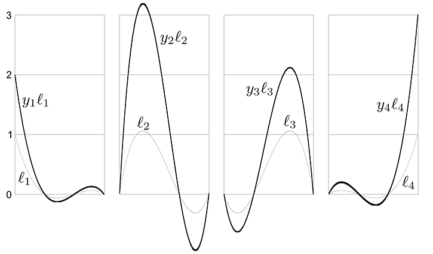
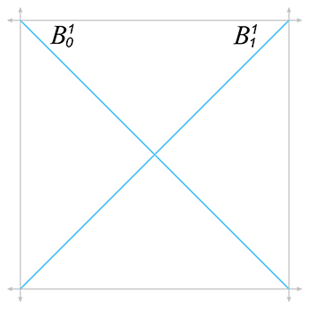

[<< Mechanics 2: Linear and Rotational Dynamics](dynamics.html)

[Contents](./)

[Afterword >>](afterword.html)

Chapter 13 

Curves in 3D

I didn't discover curves; I only uncovered them.

— Mae West (1892–1980)

This chapter talks about how to represent curves mathematically in 3D. Recreating a curve from its mathematical definition is relatively easy; the tricky part is obtaining a curve with desired properties, or alternatively, making a tool that designers can use to draw such curves. Our goal in this chapter is to provide a graceful and intuitive introduction to the mathematics of curves. In comparison with most of the other books on the subject, our aim is to hit the most important points, without stopping every other paragraph to prove that what we are saying is true. (We will, however, stop periodically to discuss correct pronunciation, which is probably appropriate considering that most of the people who developed the math we'll be using in this chapter were French.) Curves and splines are very useful for all sorts of reasons. There are obvious applications such as moving objects around on curved trajectories. But then the coordinates of our curve need not have a spatial interpretation; essentially, any time we wish to fit a function for a color, intensity, or other property to given data points, we have a potential application for curves and splines.

The chapter is divided roughly into two parts. The first part is about simple, “short” curves that can be described by one equation.

*   [Section 13.1](#parametric_polynomial_curves) introduces the specific type of curve we focus on almost exclusively: the parametric polynomial curve. (It pays special attention to cubic polynomials.)
*   [Section 13.2](#polynomial_interpolation) describes polynomial interpolation, whereby a curve is threaded through specified control points.
*   [Section 13.3](#hermite_curves) discusses Hermite form, which describes a curve in terms of its endpoints and the derivatives at those endpoints.
*   [Section 13.4](#bezier_curves) shows how the Bézier form specifies the curve endpoints, plus interior control points that influence the shape of the curve but are not interpolated.
*   [Section 13.5](#subdivision) shows how to subdivide a curve into smaller pieces.

The second half of the chapter covers _splines_, which are longer curves created by joining together multiple curves in succession.

*   [Section 13.6](#splines) introduces some basic notation, terminology, and concepts.
*   [Section 13.7](#hermite_and_bezier_splines) discusses how to join together Hermite or Bézier curves into a spline.
*   [Section 13.8](#continuity) considers continuity (smoothness) conditions for splines.
*   [Section 13.9](#automatic_tangent_control) ends the discussion on splines by considering various methods for automatically determining the tangents of a spline at the control points.

# 13.1Parametric Polynomial Curves

We focus here almost exclusively on one particular type of curve, the _parametric polynomial_ curve. It's important to understand what the two adjectives _parametric_ and _polynomial_ mean, so [Section 13.1.1](#parametric_curves) and [Section 13.1.2](#polynomial_curves). discuss them in detail. [Section 13.1.3](#matrix_notation) reviews some useful alternate notation. [Section 13.1.4](#parametric_line) examines the straight line, which is a particularly instructive example of a parametric polynomial curve. [Section 13.1.5](#endpoints) considers the relationship between the endpoints of the curve and polynomial coefficients. [Section 13.1.6](#velocities_and_tangents) discusses derivatives, such as velocity and acceleration, and shows how they are related to tangent vectors and local curvature.

## 13.1.1Parametric Curves

The word _parametric_ in the phrase “parametric polynomial curve” means (not altogether surprisingly) that the curve can be described by a function of an independent parameter, which is often assigned the symbol t . This curve function is of the form p (t) , taking a scalar input (the parameter t ) and returning the point on the curve corresponding to that parameter value as a vector output. The function p (t) traces out the shape of the curve as t varies. For example, consider the classic parametric description of a unit circle,

(13.1)x(t)\=cos⁡(2πt),y(t)\=sin⁡(2πt).

Parametric description of a circle

We briefly introduced parametric representation of geometric primitives in [Section 9.1](geomprims.html#representation_techniques). Let's take a moment to review some of the alternative forms from that section so we can understand ways of describing a curve that are _not_ parametric. An _implicit_ representation is a relation that is true for all points in the shape being described; for example, the unit circle can be described implicitly as the set of points satisfying x2+y2\=1 . Another alternative to parametric form is the _functional_ form, in which one coordinate is expressed as a function of the other coordinate or coordinates; for example, the top half of a unit circle can be described in functional form as y\=1−x2 .

The curve p (t) could be infinite, particularly if we place no limits on the range of t . Often it's useful to select a finite segment by restricting t to a particular bounded domain, most commonly the domain \[0,1\] . It's natural to designate the “forward” direction as the direction of increasing t , so the curve “starts” at t\=0 , “ends” at t\=1 , and consists of all of the points between.

Sometimes we think of the position function p (t) as a single function that yields a vector result; other times it will be helpful to extract the function for a specific coordinate. For example, the scalar function x(t) specifies the x \-coordinate of p (t) , so in two dimensions p (t)\= (x(t),y(t)) . Notice that each coordinate is specified by a function that depends only on the parameter value so that each coordinate is independent of the others. We work in the plane for the majority of this chapter because almost every important aspect of parametric curves can be demonstrated in 2D and, in general, extension into three dimensions is straightforward.

## 13.1.2Polynomial Curves

Now that we know what the adjective _parametric_ means, let's turn our attention to the second important word, _polynomial_. A polynomial parametric curve is a parametric curve function p (t) that can be written as a polynomial in t :

Polynomial parametric form of arbitrary degree  n

p (t)\= c 0+ c 1t+ c 2t2+⋯+ c n−1 t n−1 + c ntn.

The number n is called the _degree_ of the polynomial. Higher degree polynomials are more flexible in the sense that they can describe curves with more “wiggles.” However, sometimes extra “wiggles” come in that we don't want;[1](#footnote_1) more on this in [Section 13.6](#splines).

We've already seen an example of a curve function that is parametric but not polynomial—the parametric circle given by [Equation (13.1)](#parametric_circle). The expressions for x(t) and y(t) are not polynomials because they use trig functions. A complete circle can't be described in parametric polynomial form, although a circular arc can be described by a _rational curve_. A rational curve is essentially the result of dividing one curve by another, sort of like the projective geometry of homogeneous coordinates (see [Section 6.4.1](matrixmore.html#4d_homogeneous_space)). The curve in the denominator is a 1D curve. Rational curves are not as common in video games as simple polynomial curves and are not discussed in this book.

Of most interest to us are the parametric polynomial curves of degree 3, known as _cubic_ curves. Cubic curves are those that can be expressed in the form shown in [Equation (13.2)](#cubic_parametric_form_vector_coefficients).

Cubic Curve in Monomial Form

(13.2) p (t)\= c 0+ c 1t+ c 2t2+ c 3t3.

This method of describing curves is often called the _monomial_ form or the _power_ form, to emphasize the fact that the curve is specified by listing the coefficients of the powers of t . Sections [13.2](#polynomial_interpolation)–[13.4](#bezier_curves) discuss other methods of describing a curve with more direct geometric data, such as a list of control points that the curve is to pass through or nearby. These other forms are still polynomial curves in the sense that they can be converted to monomial form.

Once we have the coefficients, it's easy to reconstruct the curve by evaluating the function p (t) for different values of t . For example, let's say we wish to move a platform along a path in a video game. Our platform actor would have a state variable to remember its parametric position t along the path, and at each simulation time step, we would update t and set the position of the platform to p (t) .

Suppose we need to render a curve. One simple way to do this is to approximate it with, say, 10 line segments, sampling the curve at t\=0,110,210,…,910,1 and drawing line segments between consecutive sample points. We can reduce the error in the approximation to any desiredthreshold simply by using more sample points. We can do much better than this naïve approach by adaptively subdividing the curve, using more segments in the “curvier” parts and fewer in the “straighter” parts.

But where do the coefficients c 0, c 1, c 2, c 3 come from? How can we set them to design a particular curve? In general, the monomial form is particularly ill-suited to this task, so we use other forms and convert to monomial form when appropriate. (In many cases, we don't need the monomial form at all!) Before we discuss these other forms, however, we need to introduce some more notation and concepts about curves.

## 13.1.3Matrix Notation

We can rewrite the monomial form ([Equation (13.2)](#cubic_parametric_form_vector_coefficients)) in several different ways. It's useful to be able to refer to a coefficient for a particular coordinate. For example, in 2D let's use the notation c i\= \[ c 1,i c 2,i \] so we have one polynomial per coordinate:

2D cubic curve in expanded monomial form

x(t)\=c 1,0 +c 1,1 t+c 1,2 t2+c 1,3 t3,y(t)\=c 2,0 +c 2,1 t+c 2,2 t2+c 2,3 t3.

Some books are fond of writing this more compactly by using matrix notation. Let's put the coefficients into a matrix C and create a column vector t from the powers of t , such that t i\=t i−1 :

C \= \[c 1,0 c 1,1 c 1,2 c 1,3 c 2,0 c 2,1 c 2,2 c 2,3 \] , t \= \[ t0 t1 t2 t3 \] \= \[ 1 t t2 t3 \] .

Now we can express our curve function p (t) as a single matrix product:

2D cubic curve in monomial form, expressed as a matrix product

(13.1.3) p (t)\= C t \= \[c 1,0 c 1,1 c 1,2 c 1,3 c 2,0 c 2,1 c 2,2 c 2,3 \] \[ 1 t t2 t3 \] .

Don't try to apply any geometric interpretations just yet. The vector t is not to be interpreted as a point in space, and the matrix C is not a transformation matrix. Although we're about to learn how to extract geometric meaning from C , the techniques are very different from those learned in previous chapters. For now, let's just be happy to use matrix notation purely for sake of compactness.

The matrix C must be as “tall” as the number of dimensions the data have; for example, three if we have 3D data. However, we don't need to refer to specific x , y , or z coordinates much in this chapter because most of the ideas work the same in 3D or 2D (or 1D!). We can just leave each coefficient c i in vector form and assume that it is a vector of the appropriate dimension, so that each c i corresponds to a single column of C :

Coefficients as column vectors

C \= \[ | | | | c 0 c 1 c 2 c 3 | | | | \] , p (t)\= C t \= \[ | | | | c 0 c 1 c 2 c 3 | | | | \] \[ 1 t t2 t3 \] .

When dealing with a higher degree polynomial, the matrix C is wider and the power vector t is taller, since we have more coefficients and more powers of t . This not only makes sense, it's the law: for the product C t to be legal according to linear algebra rules, the number of columns in C must match the number of rows in t .

## 13.1.4Two Trivial Types of Curves

Although you're reading this section because you want to learn how to draw a curve, allow a brief digression to mention two trivial types of “curves”: a straight line segment and a point.

We showed how to represent a line segment parametrically in [Section 9.2](geomprims.html#lines_and_rays) when we discussed rays. Consider a ray from the point p 0 to the point p 1 . If we let d be the delta vector p 1− p 0 , then the ray is expressed parametrically as

Parametric line segment

(13.3) p (t)\= p 0+ d t.

Observe that this is a polynomial of the type we've been considering, where c 0\= p 0 , c 1\= d , and the other coefficients are zero. In other words, this _linear curve_ is a polynomial curve of degree 1.

As boring as lines are, there's an even less interesting shape that can be represented in parametric polynomial form: the point. Lowering the degree of the polynomial from 1 to 0 results in a so-called _constant curve_. In this case, the function p (t)\= c 0 always returns the same value, resulting in a “curve” that is a single stationary point.

## 13.1.5Endpoints in Monomial Form

Clearly, one of the most basic properties of a curve that we want to control are the locations of its start and end, p (0) and p (1) , respectively. Let's see what p (t) looks like at the endpoints. We'll use the cubic case as our example. At t\=0 , we have

c 0 specifies the start point

p (0)\= c 0+ c 1(0)+ c 2(0)2+ c 3(0)3\= c 0.

In other words, c 0 specifies the start point of the curve. Now let's see what happens at the end of the curve at t\=1 :

The endpoint is the sum of the coefficients

p (1)\= c 0+ c 1(1)+ c 2(1)2+ c 3(1)3\= c 0+ c 1+ c 2+ c 3.

So the endpoint of the curve is given by the sum of the coefficients.

## 13.1.6Velocities and Tangents

We can think of curves as being either static or dynamic. In the static sense, a curve defines a shape. We operate in this mode of thinking when we use a curve to describe the cross section of an airplane wing or a portion of the letter “S” in the Times Roman font. In the dynamic sense, a curve can be a trajectory or path of an object over time, with the parameter t as “time” and the position function p (t) describing the position of a particle at time t as it moves along the path.

If we consider only the static shape of the curve, then the timing of the curve doesn't matter and our task is a bit easier. For example, when defining a shape, it doesn't matter which endpoint is considered the “start” and which is the ”end”; but if we are using the curve to define a path traversed over time, then it matters very much where the path starts and where it ends.

Using the dynamic mental framework and thinking about curves as paths and not just shapes, some natural questions to ask are, “In what direction is the particle moving at a given point in time?” “How fast is it moving?” These questions can be answered if we create another function v (t) that describes the _instantaneous velocity_ of the particle at time t .

The phrase “instantaneous velocity” implies that the velocity changes over time. So the next logical step is to ask, “How fast is the velocity changing?” Thus it is also helpful to define an _instantaneous acceleration_ function a (t) that describes the rate at which the velocity of the particle is changing at time t .

If you've had at least a semester of calculus, or if you read [Chapter 11](kinematics_calculus.html), you should recognize that the velocity function v (t) is the first derivative of the position function p (t) because velocity measures the rate of change in position over time. Likewise, the acceleration function a (t) is the derivative of the velocity function v (t) because acceleration measures the rate of change of velocity over time.

We're considering curves where p (t) is a polynomial of t here, so the derivatives are trivially obtained. The position, velocity, and acceleration functions for polynomials of arbitrary degree n are

Velocity and acceleration are the first and second derivatives, remember?

p (t)\= c 0+ c 1t+ c 2t2+⋯+ c n−1 t n−1 + c ntn, v (t)\= p ˙ (t)\= c 1+2 c 2t+⋯+(n−1) c n−1 t n−2 +n c nt n−1 , a (t)\= v ˙ (t)\= p ¨ (t)\=2 c 2+⋯+(n−1)(n−2) c n−1 t n−3 +n(n−1) c nt n−2 .

The derivatives of cubic curves are especially notable and appear several times in this chapter.

Velocity and Acceleration of Cubic Monomial Curve

p (t)\= c 0+ c 1t+ c 2t2+ c 3t3,(13.5) v (t)\= p ˙ (t)\= c 1+2 c 2t+3 c 3t2,(13.6) a (t)\= v ˙ (t)\= p ¨ (t)\=2 c 2+6 c 3t.

Now let's examine velocity and acceleration in the special case of a parametric ray. Applying the velocity and acceleration functions of Equations [(13.5)](#velocity_cubic) and [(13.6)](#acceleration_cubic) to the original parameterization of a ray from [Equation (13.3)](#parametric_ray_original_form) yields

Velocity and acceleration of a ray

p (t)\= p 0+ d t, v (t)\= c 1+2 c 2t+3 c 3t2\= d , a (t)\=2 c 2+6 c 3t\= 0 .

As we'd expect, the velocity is constant; there is no acceleration.

Sometimes two curves define the same shape but different paths (see [Figure 13.1](#ray_same_shape_different_paths)). We've already mentioned one example of this: if we traverse the path backwards it still traces out the same shape. A more general way to generate alternate paths that trace out the same shape is to _reparameterize_ the curve. For example, let's reparameterize our line segment p (t)\= p 0+ d t . We'll make a new function s(t)\=t2 and see what p (s(t)) looks like:

p (s(t))\= p (t2)\= p 0+ d t2.

Figure 13.1 Two curves that define the same “shape,” but not the same “path”

Notice that both curves in [Figure 13.1](#ray_same_shape_different_paths) define the same static shape, but different paths. On the left, the particle moves with constant velocity, but on the right it starts out slowly and accelerates to the finish.

If we are using a curve as a shape and not a path, then this reparameterization doesn't have a visible effect. But that doesn't mean that the derivatives of the curve are irrelevant in the context of shape design. Imagine that we are creating a font using a curve to define a segment of the letter S. In this instance, we might not care about the velocity at any point, but we would care very much about the _tangent_ of the line at any given point. The tangent at a point is the direction the curve is moving at that point, the line that just touches the curve. The tangent is basically the normalized velocity of the curve. Let's formally define the tangent of a curve to be the unit vector pointing in the same direction as the velocity:

The tangent vector

t (t)\= v ^ (t)\= v (t) ∥ v (t) ∥ .

Higher derivatives also have geometric meaning. The second derivative is related to _curvature_, which is sometimes denoted κ , the lowercase Greek letter kappa. We can define a measure of curvature by considering a circle of a given radius. A circle with radius r has curvature equal to κ\=1 / r everywhere on the circle. A straight portion of a curve has zero curvature, which can be interpreted as the curvature of a circle with infinite radius. The curvature is computed by the formula

Curvature

κ(t)\= ∥ v (t)× a (t) ∥ ∥ v (t) ∥ 3 .

# 13.2Polynomial Interpolation

You are probably already familiar with _linear interpolation_. Given two “endpoint” values, create a function that transitions at a constant rate (spatially, in a straight line) from one to the other. We say that the function _interpolates_ the two control points, meaning that it passes through the control points and can be used to compute intermediate values.

Polynomial interpolation is similar. Given a series of control points, our goal is to construct a polynomial that interpolates them. The degree of the polynomial depends on the number of control points. A polynomial of degree n can be made to interpolate n+1 control points. For example, linear interpolation is simply first-degree polynomial interpolation. We're primarily interested in cubic (third-degree) curves in this chapter, so we are creating polynomials that interpolate four control points.

In the context of curve design, to say that a curve _interpolates_ control points is to place specific emphasis on the fact that the curve _passes_ _through_ the control points. This is to be contrasted with a curve that merely _approximates_ the control points, meaning it doesn't pass through thepoints but is attracted to them in some way. We use the word“knot” to refer to control points that are interpolated, invoking the meta-phor of a rope with knots in it. It would seem at first glance that the availability of an interpolation scheme would make any approximation schemeobsolete, but we'll see that approximation techniques do have their advantages.

Polynomial interpolation is a classic problem with several well-studied solutions. Since this is a book on 3D math we cast the discussion primarily in geometric terms, but be aware that most of the literature on polynomial interpolation adopts a more general view, because the task of fitting a function to a set of data points has broad applicability.

To facilitate the discussion we use a particular example curve, shown in [Figure 13.2](#polynomial_interpolation_example_s). It's somewhat like an _S_ turned on its side. We've marked the four control points on the curve that we are attempting to interpolate. We've chosen to place the y coordinates on the interval \[2,3\] for reasons that will be useful later.

tx(t)y(t)0021 / 31 / 332 / 32 / 32113

Figure 13.2An example curve and four control points. Can we draw this shape?

Notice that we must specify not only the _position_ of each control point (the x and y coordinates), but the _time_ when we want the curve to reach that control point (the t value). We use the notation that the independent value (the “time values”) of the control points are named t1,t2,…,tn and the dependent variables (the spatial coordinate values at those times) are y1,y2,…,yn. The symbol P stands for the polynomial function that we seek: yi\=P(ti) .

The array of time values t1…tn is known in other contexts as the _knot vector_ or _knot sequence_. The word “vector” indicates that the sequence of t values is an array of numbers, not that these numbers form a vector in the geometric sense of the word. If the t s are spaced evenly like they are in our example, then we have a _uniform_ knot vector; otherwise, we say that the knot vector is _nonuniform_. (Because it might be confusing, let us clarify that the knot vector is the sequence of t values, not the sequence of control points.)

What about the x \-coordinate? Because the x and y coordinates are independent of one another, a general 2D curve-fitting application involves two separate one-dimensional problems. Aside from the fact that the two problems use the same knot vector, the coordinates are otherwise unrelated. Even though [Figure 13.2](#polynomial_interpolation_example_s) may look like a 2D curve, it is more properly interpreted as a graph of one coordinate (the y \-coordinate) as a function of time. We chose as the example curve an S turned on its side, rather than an S in its regular orientation, since the latter is not the graph of a function (technically it's called a _relation_ because it associates more than one value of y with each value of x ).

With that said, there are two ways of interpreting [Figure 13.2](#polynomial_interpolation_example_s). We can interpret it either as a 1D function of y(t) , or as a 2D curve, where one of the coordinates has a trivial form x\=t . This is a common source of confusion when looking at diagrams of curves in this book and elsewhere. Make sure you pay special attention to the horizontal axis to make sure you know whether it is a graph of one coordinate over time or a plot of the 2D curve that includes the behavior of both spatial coordinates. The traditional literature on polynomial interpolation is mostly in abstract terms of any function of the form y\=f(x) . In this context, x would be the independent variable rather than a dependent value as it is for us. The notation we have chosen avoids the symbol x and its associated baggage.

Now we are ready to answer a question some readers might be thinking: “I don't care what time the curve reaches the points, I just want a smooth shape that goes through the points.” Unfortunately, this doesn't unambiguously define a curve—we need to provide some other criteria to nail down the shape, and one way to do this is to associate time values with each control point. In typical applications of polynomial interpolation, we _want_ to be able to specify the values of the dependent variable, because we are trying to fit a function to some known data points. There are some reasonable ways we can synthesize this information if we don't have it—for example, by making the difference between adjacent t values proportional to the Euclidian distance between the corresponding control points. However, the general fact that polynomial interpolation needs us to provide the t values when we often don't have a good way to decide what they should be is a harbinger of later discoveries.

Now that we've set the ground rules, let's try to create this curve. We first take a geometric approach in [Section 13.2.1](#aitkens_algorithm). Then, in [Section 13.2.2](#lagrange_basis_polynomials), we look at the problem from a slightly more abstract mathematical perspective.

## 13.2.1Aitken's Algorithm

Our first approach to polynomial interpolation is a recursive technique due to Alexander Aitken (1895–1967). Like many recursive algorithms, it works on the principle of _divide and conquer_. To solve a difficult problem, we first divide it into two (or more) easier problems, solve the easier problems independently, and then combine the results to get the solution to the harder problem. In this case, the “hard” problem is to create a curve that interpolates n control points. We split this curve into two “easier” curves: (1) one that interpolates only the first n−1 points, disregarding the last point; and (2) another that interpolates the last n−1 points without worrying about the first point. Then, we blend these two curves together.

Let's take the important cubic (third-degree) case as an example. A cubic curve has four control points y1…y4 that we wish to interpolate at the corresponding times t1…t4 . Applying the “divide-and-conquer” approach, we split this up into two smaller problems: one curve to interpolate y1…y3 , and another curve to interpolate y2…y4 . Since each of these curves has three control points, they are quadratic (second-degree) curves. Of course, quadratic curve-fitting is still a “hard” problem for us, and so each curve must be further subdivided.

Consider the first quadratic curve, between y1 , y2 , and y3 . We further divide this curve into two parts, the first part between y1 and y2 and the other part between y2 and y3 . These two curves have only two control points each; they are straight line segments. Finally, a problem that is truly “easy”!

Since we have lots of curves at this point, we should invent some notation for them. We let yi1(t) denote the linear curve between yi and y i+1 , the notation yi2(t) denote the quadratic curve between yi and y i+2 , and so on. In other words, the superscript indicates the recursion level in the divide-and-conquer algorithm (and also the degree of the polynomial), and the subscript indexes along the length of the curve.

Take a look at the first quadratic curve y12(t) that interpolates y1 , y2 , and y3 . It is formed by blending together the two lines containing the first two linear segments. An example of such blending is shown in [Figure 13.3](#aitkens_1). (This figure doesn't use the data from our _S_ example; it's a less symmetric case that better illustrates the blending process.) Notice that each curve segment is an interval from an infinite curve that is defined for any value of t .

Figure 13.3 Creating a quadratic curve as a blend of two linear segments according to Aitken's algorithm

Now let's look at the math behind this. It's all linear interpolation. The easiest are the linear segments, which are defined by linear interpolation between the adjacent control points:

Linear interpolation between two control points

y11(t)\= (t2−t)y1+(t−t1)y2 t2−t1 ,y21(t)\= (t3−t)y2+(t−t2)y3 t3−t2 .

The quadratic curve is only slightly more complicated. We just linearly interpolate between the line segments:

Linear interpolation of lines yields a quadratic curve

y12(t)\= (t3−t) \[y11(t)\] +(t−t1) \[y21(t)\] t3−t1 .

Hopefully you can see the pattern—each curve is the result of linearly interpolating two curves of lesser degree. Aitken's algorithm can be summarized succinctly as a recurrence relation.

Aitken's Algorithm

yi0(t)\=yi,yij(t)\= (t i+j −t) \[yi j−1 (t)\] +(t−ti) \[y i+1 j−1 (t)\] t i+j −ti .

Aitken's algorithm works because, at each level both curves being blended already touch the middle control points. The two outermost control points are touched by only one curve or the other, but for those values of t , the blend weights reach their extreme values and all the weight is given to the curve that touches the control point.

  

Figure 13.4Two levels of Aitken's algorithm

Now that we have the basic idea, let's apply it to our sideways S. [Figure 13.4](#aitkens_example_s) shows Aitken's algorithm at work with our four data points. On the left, the three linear segments are blended to form two quadratic segments. On the right, the two quadratic curves are blending, yielding the final result that we've been seeking: a cubic spline that interpolates all four control points.

So we've successfully interpolated the four control points, and accomplished the goal set out at the start of this section, right? Well, not exactly. Although our curve does pass through the control points, it isn't really the curve we wanted. If we compare the curve on the right side of [Figure 13.4](#aitkens_example_s) with the curve we set out to create at the start of this section in [Figure 13.2](#polynomial_interpolation_example_s), we see that the curve produced by Aitken's algorithm overshoots the y value of the two middle control points. We have discovered an inconvenient truth.[2](#footnote_2)

Polynomial interpolation doesn't really give us the type of control we want for curve design in geometric settings.

But don't despair! We've learned several important ideas that will be helpful when we discuss Bézier curves in [Section 13.4](#bezier_curves) and splines in [Section 13.6](#splines). In fact, we're going to beg your patience to allow us to extend the discussion on polynomial interpolation just a bit further. It's sort of like watching the movie _Titanic_; even though you know that the journey will end tragically, you still might find something useful along the way. We promise that the other techniques in this chapter will have practical as well as educational value.

By the way, you might have noticed that we didn't actually compute the polynomial P that produces the curve. Working through this math is straightforward, but a bit tedious and not all that enlightening. The important point is that Aitken's algorithm is a recursive process of blending curves together and works by repeated linear interpolation. Besides, why bother with the details when we have computers to solve algebra problems for us?[3](#footnote_3) However, you needn't feel short-changed by lazy authors. If you really want to know what the polynomial is (or just want to feel like you're getting your money's worth), keep reading. We'll discover it in the next section by using a different method that's less tedious mathematically.

## 13.2.2Lagrange Basis Polynomials

[Section 13.2.1](#aitkens_algorithm) applied geometric intuition to the problem of polynomial interpolation and came up with Aitken's algorithm. Now we approach the subject from a more abstract mathematical point of view.

One mathematical approach to the interpolation problem comes from linear algebra.[4](#footnote_4) Each control point gives us one equation, and each coefficient gives us one unknown. This system of equations can be put into an n×n matrix,[5](#footnote_5) which can be solved by standard techniques such as Gaussian elimination or LU decomposition. Such techniques are outside the scope of this book, but you can learn about them in practically any good book on linear algebra or numerical methods.

Solving a matrix is a relatively time-consuming computational process, requiring O(n3) time for an n×n matrix in the worst case. Luckily there are more efficient approaches. As we did with Aitken's algorithm, we solve a large complicated problem by dividing it into a series of smaller, simpler problems, and then combining those results. Aitken's algorithm is a recursive procedure, but here we will make one “simple” problem per control point.

Let's ignore the y 's for now and think only about the t 's. What if we could create a polynomial for each knot ti such that the polynomial evaluates to unity at that knot, but for all the other knots it evaluates to zero? If we denote the i th polynomial as ℓi , then this idea can be expressed in mathspeak: ℓi(ti)\=1 , and ℓi(tj)\=0 for all j≠i . For example, let's assume n\=4 . Then our polynomials would have the following values at the knots:

ℓ1(t1)\=1,ℓ1(t1)\=0,ℓ3(t1)\=0,ℓ4(t1)\=0,ℓ1(t2)\=0,ℓ2(t2)\=1,ℓ3(t2)\=0,ℓ4(t2)\=0,ℓ1(t3)\=0,ℓ2(t3)\=0,ℓ3(t3)\=1,ℓ4(t3)\=0,ℓ1(t4)\=0,ℓ2(t4)\=0,ℓ3(t4)\=0,ℓ4(t4)\=1.

If we were able to create polynomials with the above properties, we would be able to use them as _basis polynomials_. We would scale each basis polynomial ℓi by the corresponding coordinate value yi , and add all the scaled polynomials together:

Interpolating polynomial in Lagrange basis form

(13.7)P(t)\=∑ i\=1 nyiℓi(t)\=y1ℓ1(t)+y2ℓ2(t)+⋯+y n−1 ℓ n−1 (t)+ynℓn(t).

You might want to take a moment to convince yourself that this polynomial actually interpolates the control points, meaning P(ti)\=yi .

Notice that the basis polynomials depend only on the knot vector (the t 's) and not on the coordinate values (the y 's). Because of this, a set of basis polynomials can be used to quickly construct multiple curves with the same knot vector. This is precisely the situation we find ourselves in when dealing with a 3D curve, which is really three one-dimensional curves that share the same knot sequence.

Of course, all of this would work only if we knew the basis polynomials, and finding ℓi is itself a problem of polynomial interpolation. However, the “data points” we wish ℓi to interpolate are all either 0 or 1, so ℓi can be expressed in a simple form. Such basis polynomials are called _Lagrange basis polynomials_.[6](#footnote_6) A Lagrange[7](#footnote_7) basis polynomial ℓi for knot vector t1…tn looks like [Equation (13.8)](#lagrange_basis_polynomial):

Lagrange Basis Polynomial

(13.8)ℓi(t) \=∏ 1≤j≤n,j≠i t−tj ti−tj  \=  t−t0 ti−t0 ⋯ t−t i−1 ti−t i−1   t−t i+1 ti−i i+1 ⋯ t−t n ti−t n .

This trick works because at the knot ti , all the terms in the product equal 1, causing the entire expression to evaluate to 1, and at any other knot, one of the terms in the product is 0, which causes the entire expression to evaluate to 0.

Let's apply this to our example S curve. Recall that it used the uniform knot vector (0,13,23,1) . Here, we work through the first basis polynomial and just present the results for the others:

ℓ1(t)\= ( t−t2 t1−t2 ) ( t−t3 t1−t3 ) ( t−t4 t1−t4 ) \= ( t−1 / 3 0−1 / 3 ) ( t−2 / 3 0−2 / 3 ) ( t−1 0−1 ) \= ( 3t−1 −1 ) ( 3t−2 −2 ) ( t−1 −1 ) \= (3t−1)(3t−2)(t−1) −2 \=−(9 / 2)t3+9t2−(11 / 2)t+1,

ℓ2(t)\=(27 / 2)t3−(45 / 2)t2+9t,ℓ3(t)\=−(27 / 2)t3+18t2−(9 / 2)t,ℓ4(t)\=(9 / 2)t3−(9 / 2)t2+t.

[Figure 13.5](#lagrange_basis_polynomials_example) shows what these basis polynomials look like.

Figure 13.5Cubic Lagrange basis polynomials for uniform knot vector

Now that we have the Lagrange basis polynomials for the knot vector, let's plug in the y values from our example S curve ([Figure 13.2](#polynomial_interpolation_example_s)) into [Equation (13.7)](#interpolating_polynomial_lagrange_form) to get the complete interpolating polynomial:

P(t)\=y1ℓ1(t)+y2ℓ2(t)+y3ℓ3(t)+y4ℓ4(t)\=2\[−(9 / 2)t3+9t2−(11 / 2)t+1\]+3\[(27 / 2)t3−(45 / 2)t2+9t\]+2\[−(27 / 2)t3+18t2−(9 / 2)t\]+3\[(9 / 2)t3−(9 / 2)t2+t\]\=−9t3+18t2−11t+2+(81 / 2)t3−(135 / 2)t2+27t−27t3+36t2−9t+(27 / 2)t3−(27 / 2)t2+3t\=18t3−27t2+10t+2.

Let's show these results graphically. First, we scale each basis polynomial by the corresponding coordinate value, as shown in [Figure 13.6](#lagrange_basis_polynomials_scaled).

Finally, adding the scaled basis vectors together yields the interpolating polynomial P , the blue curve at the top of [Figure 13.7](#lagrange_polynomial_interpolation_s).

Figure 13.6 Scaling each Lagrange basis polynomial by the corresponding coordinate value

Figure 13.7 The interpolating curve is the sum of the scaled basis polynomials

We use the word _basis_ in _basis polynomial_ to emphasize the fact that we can use these polynomials as building blocks to reconstruct absolutely any polynomial whatsoever, given the values of the polynomial at the knots. It's the same basic concept as a basis vector (see [Section 3.3.3](multiplespaces.html#basis_vectors)): any arbitrary vector can be described as a linear combination of the basis vectors. In our case, the space being spanned by the basis is not a geometric 3D space, but the vector space of all possible polynomials of a certain degree, and the scale values for each curve are the known values of the polynomial at the knots.

But there's an alternate way to understand the multiplication and summing that's going on. Instead of thinking about the polynomials as the building blocks and the control points as the scale factors, we can view each point on the curve as a result of taking a weighted average of the control points, where the basis polynomials provide the blending weights. So the control points are the building blocks and the basis polynomials provide the scale factors, although we prefer to be more specific and call these scale factors _barycentric coordinates_. We introduced barycentric coordinates in the context of triangles in [Section 9.6.3](geomprims.html#triangle_barycentric_space), but the term refers to a general technique of describing some value as a weighted average of data points.

We can think of basis polynomials as functions yielding barycentric coordinates (blending weights).

Notice that some values are negative or greater than 1 on certain intervals, which explains why direct polynomial interpolation overshoots the control points. When all barycentric coordinates are inside the \[0,1\] range, the resulting point is guaranteed to lie inside the _convex hull_ of the control points. (The convex hull is the smallest polygon that contains all the control points. It “shrink wraps” the control points, sort of like if you were to stretch a rubber band around the control points and then release it.) But when we have any one coordinate outside this interval, the resulting point could extend outside the convex hull. For purposes of geometric curve design, the convex hull guarantee is a very nice one to have. [Section 13.4](#bezier_curves) shows that Bézier curves _do_ provide this guarantee through the _Bernstein basis_.

## 13.2.3Polynomial Interpolation Summary

We've approached polynomial interpolation from two perspectives. Aitken's algorithm is a geometric approach based on repeated linear interpolation, and with it we can compute a point on the curve for a given t without knowing the polynomial for the curve. Lagrange interpolation works by creating basis functions that depend only on the knot vector. We can view the use of the basis polynomials in two ways. Either we can think about scaling each basis polynomial by the corresponding coordinate value and then adding them all together, or we can think about the polynomials as functions that compute barycentric coordinates that are used as blending weights in a simple weighted average of the coordinate points.

Both methods yield the same curve when given the same data. Furthermore, this polynomial is unique—no other polynomial of the same degree interpolates the data points. An informal argument for why this is true goes like this: A polynomial of degree n has n+1 degrees of freedom, corresponding to the n+1 coefficients in monomial form. Therefore, the degree n polynomial that interpolates n+1 control points must be unique. (Farin [\[1\]](#reference_1) gives a more rigorous argument.)

For purposes of curve design, polynomial interpolation is not ideal, primarily because of our inability to control the overshoot. The overshoot is guaranteed by the fact that the underlying Lagrange basis polynomials are not restricted to the unit interval \[0,1\] , and the curve escapes the convex hull of the control points.

Direct polynomial interpolation finds limited application in video games, but our study has introduced the themes of repeated linear interpolation and basis polynomials. We've also seen a bit of the beautiful duality between the two techniques.

# 13.3Hermite Curves

Polynomial interpolation tries to control the interior of the curve by threading the curve through specified knots. This doesn't work as well as we would like, because of the tendency to oscillate and overshoot, so let's try a different approach. We're still going to want to specify the endpoint positions, of course. But instead of specifying the interior positions to interpolate, let's control the shape of the curve through the tangents at the endpoints. A curve thus specified is said to be a _Hermite curve_ or a curve in _Hermite form_, named in honor of Charles Hermite[8](#footnote_8) (1822–1901).

The Hermite form specifies a curve by listing its starting and ending positions and derivatives. A cubic curve has only four coefficients, which allows for the specification of just the first derivatives, the velocities at the endpoints. So describing a cubic curve in Hermite form boils down to the following four pieces of information:

*   The start position at t\=0 ,
*   The first derivative (initial velocity) at t\=0 ,
*   The end position at t\=1 ,
*   The first derivative (final velocity) at t\=1 .

Let's call the desired start and end positions p 0 and p 1 and the start and end velocities v 0 and v 1 . [Figure 13.8](#hermite_curves_examples) shows some examples of cubic Hermite curves. Please note that the velocity vectors v 0 and v 1 have been drawn at one-third their actual length. One reason for doing this is to save space, and another will make sense later once we learn about Bézier curves in [Section 13.4](#bezier_curves).

Figure 13.8Some cubic Hermite curves

Determining the monomial coefficients from the Hermite values is a relatively straightforward algebraic process of combining equations previously discussed in this chapter. The four Hermite values can be translated into the following system of equations:

(13.9) p (0)\= p 0⟹ c 0\= p 0,(13.10) v (0)\= v 0⟹ c 1\= v 0,(13.11) v (1)\= v 1⟹ c 1+2 c 2+3 c 3\= v 1,(13.12) p (1)\= p 1⟹ c 0+ c 1+ c 2+ c 3\= p 1.

System of equations for Hermite conditions

Equations [(13.9)](#monomial_to_hermite_first) and [(13.12)](#monomial_to_hermite_last), which specify the endpoints, just repeat what we said in [Section 13.1.5](#endpoints). Equations [(13.10)](#monomial_to_hermite_v0) and [(13.11)](#monomial_to_hermite_v1), which specify velocities, follow directly from the velocity equations for a cubic polynomial ([Equation (13.5)](#velocity_cubic). The order in which these equations are listed is a convention used in other literature on curves, and the utility of this convention will become apparent later in this chapter.

Solving this system of equations results in a method to compute the monomial coefficients from the Hermite positions and derivatives:

Converting Hermite form to monomial form

(13.13) c 0\= p 0, c 1\= v 0, c 2\=−3 p 0−2 v 0− v 1+3 p 1,(13.16) c 3\=2 p 0+ v 0+ v 1−2 p 1.

We can also write these equations in the compact matrix notation introduced in [Section 13.1.2](#polynomial_curves). Remember that when we put the coefficients as columns in a matrix C , and the powers of t into the column vector t , we can express a polynomial curve as the matrix product C t ,

We can write monomial form using matrix notation, remember?

p (t)\= C t \= \[ | | | | c 0 c 1 c 2 c 3 | | | | \] \[ 1 t t2 t3 \] ,

where p (t) and each of the coefficient vectors c i are column vectors whose height matches the number of geometric dimensions (1D, 2D, or 3D). The height of t matches the number of c 's, which depends on the degree of the curve.

The coefficient matrix C may be expressed as a matrix product by putting the Hermite positions and velocities as columns in a matrix P and multiplying by a conversion matrix H :

Cubic Hermite curve using matrix notation

p (t)\= C t \= P H t \= \[ | | | | p 0 v 0 v 1 p 1 | | | | \] \[10−3201−2100−11003−2\] \[ 1 t t2 t3 \] .

We can interpret the product P H t in two ways. If we group it like P ( H t ) , then the matrix product H t can be interpreted as Hermite basis functions; we'll have more to say about this basis shortly. Or, we can think about C \= P H , in which case, multiplication by H can be considered a conversion from the Hermite basis to the monomial basis, essentially a restatement of Equations [(13.13)](#hermite_to_monomial_first)–[(13.16)](#hermite_to_monomial_last).

We emphasize that the adjectives “monomial,” “Hermite,” and “Bézier” refer to different ways of describing the same set of polynomial curves; they are not different sets of curves. We convert a curve from Hermite form to monomial form by using Equations [(13.13)](#hermite_to_monomial_first)–[(13.16)](#hermite_to_monomial_last), and from monomial form to Hermite form with Equations [(13.9)](#monomial_to_hermite_first)–[(13.12)](#monomial_to_hermite_last).

Let's take a closer look at the Hermite basis and hopefully gain some geometric intuition as to why it works. Remember that we can interpret basis functions as functions of t yielding barycentric coordinates. For cubic Hermite curves, four values are being blended: the two positions and the two velocity vectors.[9](#footnote_9) Thus, we have four basis functions that are the elements of the column result of the matrix product H t . Expanding the product, we have

p (t)\= P ( H t )\= \[ | | | | p 0 v 0 v 1 p 1 | | | | \] ( \[10−3201−2100−11003−2\] \[ 1 t t2 t3 \] ) \= \[ | | | | p 0 v 0 v 1 p 1 | | | | \] \[ 1−3t2+2t3 t−2t2+t3 −t2+t3 3t2−2t3 \] .

Next, we name these basis functions (the rows of H t ) as H 0 (t)…H 3 (t) (you may see these same functions indexed with different subscripts in other sources):

The cubic Hermite basis functions

H 0 (t)\=1−3t2+2t3,H 1 (t)\=t−2t2+t3,H 2 (t)\=−t2+t3,H 3 (t)\=3t2−2t3.

Now, expanding the matrix multiplication makes it explicit that these functions serve as blending weights:

Interpreting the Hermite basis functions as blending weights

p (t)\= \[ | | | | p 0 v 0 v 1 p 1 | | | | \] \[ H 0 (t) H 1 (t) H 2 (t) H 3 (t) \] \=H 0 (t) p 0+H 1 (t) v 0+H 2 (t) v 1+H 3 (t) p 1.

[Figure 13.9](#hermite_basis) shows a graph of the Hermite basis functions.

Figure 13.9The Hermite basis functions

Now let's make a few observations. First, notice that H 0 (t)+H 3 (t)\=1 , so those who object to the idea of adding “points” together can breath a sigh of relief, as we can interpret the situation as a proper barycentric combination of the points.

The curve H 3 (t) deserves special attention. It is also is known as the _smoothstep_ function and is truly a gem that every game programmer should know. This function is found in many places, including the Renderman shading language and HLSL. To remove the rigid, robotic feeling from any linear interpolation (especially camera transitions), simply compute the normalized interpolation fraction t as usual (in the range 0≤t≤1 ), and then replace t with 3t2−2t3 . _Voila!_ Everything will suddenly feel more polished. The reason for this is that the smoothstep function eliminates the sudden jump in velocity at the endpoints: H 3 ′(0)\=H 3 ′(1)\=0 .

Smoothstep is Your Friend

The Hermite basis function H 3 (t) is also known as the smoothstep function. Almost any transition based on linear interpolation, especially a camera transition, feels better when replaced with the smoothstep function.

One final word about Hermite curves. Like the other forms for polynomial curves, it's possible to design a scheme for Hermite curves of higher degree, although the cubic polynomial is the most commonly used in computer graphics and animation. With the cubic spline, we specified the position (the “0th” derivative) and velocities (first derivatives) at the end points. A quintic (fifth-degree) Hermite curve happens when we also specify the accelerations (second derivatives).

# 13.4Bézier Curves

This chapter has so far discussed a number of ideas about curves that were enlightening, but it has yet to describe a fully practical way to design a curve. All of that will change in this section.[10](#footnote_10) Bézier curves were invented by Pierre Bézier (1910–1999), a French[11](#footnote_11) engineer, while he was working for the automaker Renault. Bézier curves have many desirable properties that make them well suited for curve design. Importantly, Bézier curves _approximate_ rather than interpolate: although they do pass through the first and last control points, they only pass near the interior points. For this reason, the Bézier control points are called “control points” rather than “knots.” Some example cubic Bézier curves are shown in [Figure 13.10](#bezier_curves_examples).

Figure 13.10Some cubic Bézier curves

Recall from [Section 13.2](#polynomial_interpolation) that the problem of polynomial interpolation had two solutions that produced the same result. Aitken's algorithm was a recursive construction technique that appealed to our geometric sensibilities, and a more abstract approach yielded the Lagrange basis polynomials. Bézier curves exhibit a similar duality. The counterpart of Aitken's algorithm for Bézier curves is the _de Casteljau_ algorithm, a recursive geometric technique for constructing Bézier curves through repeated linear interpolation; this is the subject of [Section 13.4.1](#de_casteljau_algorithm). The analog to the Lagrange basis is the Bernstein basis, which is discussed in [Section 13.4.2](#bernstein_basis). After considering both sides of this coin, [Section 13.4.3](#bezier_derivatives) investigates the derivatives[12](#footnote_12) of Bézier curves and reveals the relationship to Hermite form.

We've seen some beautiful cooperation between math and geometry in this book, but the convergence is particularly elegant for Bézier curves. It seems as if almost every important property of Bézier curves was independently discovered multiple times by researchers in different fields. Rogers' book [\[4\]](#reference_4) includes an interesting look at this story.

t\=.25

t\=.50

t\=.75

Unknown environment 'picture' Unknown environment 'picture'

Unknown environment 'picture' Unknown environment 'picture'

Unknown environment 'picture' Unknown environment 'picture'

Unknown environment 'picture' Unknown environment 'picture'

Unknown environment 'picture' Unknown environment 'picture'

Unknown environment 'picture' Unknown environment 'picture'

Unknown environment 'picture' Unknown environment 'picture'

Unknown environment 'picture' Unknown environment 'picture'

Unknown environment 'picture' Unknown environment 'picture'

Unknown environment 'picture' Unknown environment 'picture'

Unknown environment 'picture' Unknown environment 'picture'

Unknown environment 'picture' Unknown environment 'picture'

Figure 13.11The de Casteljau algorithm applied to a cubic curve

## 13.4.1The de Casteljau Algorithm

The _de Casteljau algorithm_ defines a method for constructing Bézier curves through repeated linear interpolation. It was created in 1959 by physicist and mathematician Paul de Casteljau (1910–1999).[13](#footnote_13) We show how the algorithm works for the important cubic case as our example. First, a bit of notation is necessary. A cubic curve is defined by four control points, b 0… b 3 . Notice that Bézier control points traditionally are indexed starting at zero (which will appeal to the C programmers amongst us). Also, as with Aitken's algorithm, we add a superscript to indicate the level of recursion. The original control points are assigned level 0, thus b i0\= b i .

With that out of the way, let's consider a specific parameter value t from 0 to 1. The de Casteljau algorithm geometrically constructs the corresponding point on the curve p (t) as follows. Between each pair of consecutive control points, we interpolate according to the fraction t to obtain a new point. So, starting with the original four control points b 00… b 30 , we derive three new points b 01 , b 11 , and b 21 . Another round of interpolation between each pair of these three points gives us two points b 02 and b 12 , and a final interpolation yields the point b 03\= p (t) we're looking for. [Figure 13.11](#de_casteljau_cubic_exalple) shows the de Casteljau algorithm applied to the same curve at t\=.25 , t\=.50 , and t\=.75 .

It's helpful to write out all the b s in a triangular fashion, as shown in [Figure 13.12](#de_casteljau_triangle_table). Each intermediate point is the result of linearly interpolating between two points on the row above.

b 00 b 10 b 20 b 30↘↙↘↙↘↙ b 01 b 11 b 21↘↙↘↙ b 02 b 12↘↙ b 03

Figure 13.12 Hierarchical relationships in the de Casteljau algorithm for a cubic curve

If we combine these recursive relationships with the basic linear interpolation formula, we obtain the de Casteljau recurrence relation.

De Casteljau Recurrence Relation

b i0(t)\= b i, b in(t)\=(1−t)\[ b i n−1 (t)\]+t\[ b i+1 n−1 (t)\].

[Listing 13.1](#decasteljau) illustrates how the de Casteljau algorithm could be implemented in C++ to evaluate a Bézier curve for a specific value of t . The caller passes in the original control points in an array, which is also used as a temporary working space as the operation is performed in place. Each iteration of the outer loop performs one round of interpolation, replacing the points at one level with the points at the next higher numbered superscript. This process is continued until there is one point remaining, the desired result p (t) . This example is intended to illustrate how the algorithm works, not how to do anything particularly fast or provide a clean interface.

Vector3 deCasteljau(
    int n,            // order of the curve, the number of points
    Vector3 points\[\], // array of points.  Overwritten, as
                      // the algorithm works in place
    float t           // parameter value we wish to evaluate
) {

    // Perform the conversion in place
    while (n > 1) {
        --n;

        // Perform the next round of interpolation, reducing the
        // degree of the curve by one.
        for (int i = 0 ; i < n ; ++i) {
            points\[i\] = points\[i\]\*(1.0f-t) + points\[i+1\]\*t;
        }
    }

    // Result is now in the first slot.
    return points\[0\];
}

This gives us a method for locating a point at any given t through repeated interpolation, but it doesn't directly give us a closed form expression to calculate the point in terms of the control points. We emphasize that such a closed form expression is often not needed, but let's derive it in monomial form anyway. We're looking for a polynomial grouped by powers of t . We'll work our way up from the linear and quadratic cases to the cubic. [Section 13.4.2](#bernstein_basis) presents a general pattern leading us to the expression for arbitrary degree curves.

The linear case comes straight from the recurrence relation without any real work:

b i0(t)\= b i, b i1(t)\=(1−t)\[ b i0(t)\]+t\[ b i+1 0(t)\]\=(1−t) b i+t b i+1 \= b i+t( b i+1 − b i).

Applying one more level gives us a quadratic polynomial:

b i2(t)\=(1−t)\[ b i1(t)\]+t\[ b i+1 1(t)\]\=(1−t)\[ b i+t( b i+1 − b i)\]+t\[ b i+1 +t( b i+2 − b i+1 )\]\=\[ b i+t( b i+1 − b i)\]−t\[ b i+t( b i+1 − b i)\]+t\[ b i+1 +t( b i+2 − b i+1 )\]\= b i+t( b i+1 − b i)−t b i−t2( b i+1 − b i)+t b i+1 +t2( b i+2 − b i+1 )\= b i+t(2 b i+1 −2 b i)+t2( b i−2 b i+1 + b i+2 ).

In other words, quadratic Bézier curves, which have three control points, can be expressed in monomial form as

Quadratic Bézier curve in monomial form

(13.17) p (t)\= b 02(t)\= b 0+t(2 b 1−2 b 0)+t2( b 0−2 b 1+ b 2).

Before we do the last round of interpolation to get the cubic curve, let's take a closer look at the quadratic expression in [Equation (13.17)](#bezier_quadratic_in_monomial). This conversion from Bézier form to monomial basis can be written with fewer letters by using the matrix form introduced earlier in this chapter. After putting the control points b 0 , b 1 , b 2 as columns into a matrix B , we can write

Quadratic Bézier curve using matrix notation

(13.18) p (t)\= C t \= B M t \= \[ | | | b 0 b 1 b 2 | | | \] \[1−2102−2001\] \[ 1 t t2 \] .

As we saw in [Section 13.3](#hermite_curves) with Hermite curves, the two different ways to group the product B M t lead to two different interpretations. If we perform the multiplication B M first, we get the matrix of monomial coefficients C , meaning M is a conversion matrix from Bézier form to monomial form. Direct evaluation of the monomial form is faster than implementing the de Casteljau algorithm, and so this form might be preferable in situations where we need to evaluate the same curve for many different values of t , for example, when moving an object over time along a path described by a Bézier curve. (However, one must be aware of issues related to precision. For example, we can ensure that performing de Casteljau using t\=1.0 produces a result that matches the last control point _exactly_. However, substituting t\=1.0 into the polynomial in monomial form, the coefficients might not sum exactly to this value due to floating point representation.)

The other way to group the product B M t is to perform the right-hand multiplication first: B ( M t ) . When we plug in a specific value of t , the product M t yields a column vector of barycentric coordinates. If we perform this multiplication leaving t as a variable, we get a column vector of polynomials that can be interpreted as a basis. The basis polynomials for Bézier curves are the Bernstein basis, discussed in [Section 13.4.2](#bernstein_basis).

Back to repeated interpolation. One last round gives us the cubic polynomial:

One last iteration of de Casteljau iteration yields the cubic polynomial.  
\\  
Whew, expanding it all out like this is pretty exhausting!

b i3(t)\=(1−t)\[ b i2(t)\]+t\[ b i+1 2(t)\]\=(1−t)\[ b i+t(2 b i+1 −2 b i)+t2( b i−2 b i+1 + b i+2 )\]+t\[ b i+1 +t(2 b i+2 −2 b i+1 )+t2( b i+1 −2 b i+2 + b i+3 )\]\=\[ b i+t(2 b i+1 −2 b i)+t2( b i−2 b i+1 + b i+2 )\]−t\[ b i+t(2 b i+1 −2 b i)+t2( b i−2 b i+1 + b i+2 )\]+t\[ b i+1 +t(2 b i+2 −2 b i+1 )+t2( b i+1 −2 b i+2 + b i+3 )\]\= b i+t(2 b i+1 −2 b i)+t2( b i−2 b i+1 + b i+2 )−t b i−t2(2 b i+1 −2 b i)−t3( b i−2 b i+1 + b i+2 )+t b i+1 +t2(2 b i+2 −2 b i+1 )+t3( b i+1 −2 b i+2 + b i+3 )

\= b i+t(3 b i+1 −3 b i)+t2(3 b i−6 b i+1 +3 b i+2 )+t3(− b i+3 b i+1 −3 b i+2 + b i+3 ).

Writing the last line again, but this time assuming the cubic level is the final level of recursion, we have

Cubic Bézier curve in monomial form

(13.19) p (t)\= b 03(t)\= b 0+t(3 b 1−3 b 0)+t2(3 b 0−6 b 1+3 b 2)+t3(− b 0+3 b 1−3 b 2+ b 3).

Just to make sure you didn't miss it, [Equation (13.19)](#cubic_bezier_monomial_form) tells us how to convert a cubic Bézier curve to monomial form. Since this is important, let's write it a bit more deliberately as

Cubic monomial coefficients from Bézier control points

c 0\= b 0, c 1\=−3 b 0+3 b 1, c 2\=3 b 0−6 b 1+3 b 2, c 3\=− b 0+3 b 1−3 b 2+ b 3.

We can now put this conversion into a matrix like we did with the quadratic case in [Equation (13.18)](#bezier_quadratic_matrix_notation). The cubic equation for a specific point on the curve p (t) is written in matrix notation as

Cubic Bézier curve using matrix notation

p (t)\= C t \= B M t \= \[ | | | | b 0 b 1 b 2 b 3 | | | | \] \[1−33−103−63003−30001\] \[ 1 t t2 t3 \] .

We can also invert this process, meaning we can convert any polynomial curve from monomial form to Bézier form. Given any polynomial curve, the Bézier control points that describe the curve are uniquely determined:

Computing Bézier control points from monomial coefficients

(13.20) b 0\= c 0, b 1\= c 0+(1 / 3) c 1, b 2\= c 0+(2 / 3) c 1+(1 / 3) c 2,(13.23) b 3\= c 0+ c 1+ c 2+ c 3.

And, of course, we can write this in matrix form:

Converting from monomial to Bézier form, in matrix notation

\[ | | | | b 0 b 1 b 2 b 3 | | | | \] \= \[ | | | | c 0 c 1 c 2 c 3 | | | | \] \[111101 / 32 / 31001 / 310001\] .

## 13.4.2The Bernstein Basis

[Section 13.4.1](#de_casteljau_algorithm) ended with a bit of algebra to calculate the polynomial for a curve from the Bézier control points. This polynomial was expressed in monomial form, meaning the coefficients were for the powers of t . We can also write the polynomial in Bézier form by collecting the terms on the control points rather than the powers of t . When written this way, each control point has a coefficient that represents the barycentric weight as a function of t that the control point contributes to the curve.

Let's repeat the algebra exercise from [Section 13.4.1](#de_casteljau_algorithm), only this time we'll be writing things in a slightly different way that will lead us to some observations. As we did before, we start with the linear case (remember, b i0\= b i ):

b i1(t)\=(1−t)\[ b i0(t)\]+t\[ b i+1 0(t)\]\=(1−t) b i+t b i+1 .

Next comes the quadratic:

b i2(t)\=(1−t) b i1(t)+t b i+1 1(t)\=(1−t)\[(1−t) b i+t b i+1 \]+t\[(1−t) b i+1 +t b i+2 \]\=(1−t)2 b i+t(1−t) b i+1 +t(1−t) b i+1 +t2 b i+2 \=(1−t)2 b i+2t(1−t) b i+1 +t2 b i+2 .

And finally, we have the cubic case:

b i3(t)\=(1−t)\[ b i2(t)\]+t\[ b i+1 2(t)\]\=(1−t)\[(1−t)2 b i+2t(1−t) b i+1 +t2 b i+2 \]+t\[(1−t)2 b i+1 +2t(1−t) b i+2 +t2 b i+3 \]\=(1−t)3 b i+2t(1−t)2 b i+1 +t2(1−t) b i+2 +t(1−t)2 b i+1 +2t2(1−t) b i+2 +t3 b i+3 \=(1−t)3 b i+3t(1−t)2 b i+1 +3t2(1−t) b i+2 +t3 b i+3 .

You might see a pattern emerging, but just to make it even more clear, let's show the curves up to degree 5 (we'll skip over the algebra; it's similar to what we did above):

Bézier curves of degree 1–5

b 01(t)\=(1−t) b 0+t b 1, b 02(t)\=(1−t)2 b 0+2t(1−t) b 1+t2 b 2,(13.26) b 03(t)\=(1−t)3 b 0+3t(1−t)2 b 1+3t2(1−t) b 2+t3 b 3,

b 04(t)\=(1−t)4 b 0+4t(1−t)3 b 1+6t2(1−t)2 b 2+4t3(t−1) b 3+t4 b 4, b 05(t)\=(1−t)5 b 0+5t(1−t)4 b 1+10t2(1−t)3 b 2+10t3(1−t)2 b 3+5t4(1−t) b 4+t5 b 5.

Now the pattern is more clear. Each term has a constant coefficient, a power of (1−t) , and a power of t . The powers of t are numbered in increasing order, so b i has a coefficient ti . The powers of (1−t) follow the opposite pattern and are numbered in decreasing order.

The pattern for the constant coefficients is a bit more complicated. Please permit a brief, but hopefully interesting, detour into combinatorics. Let's write out the first eight levels in a triangular form to make the pattern a bit easier to see:

Pascal's triangle

01111212131331414641515101051616152015617172135352171

With the exception of the 1s on the outer edge of the triangle, all other numbers are the sum of the two numbers above it. You are looking at a very famous number pattern that has been studied for centuries, known as the _binomial coefficients_ because the n th row gives the coefficients when expanding the binomial (a+b)n . The compulsion to organize these numbers in a triangular manner like this has struck many people, including the mathematician and physicist Blaise Pascal (1623–1662).[14](#footnote_14) This triangular arrangement of the binomial coefficients is known as _Pascal's triangle_.[15](#footnote_15)

Binomial coefficients have a special notation. We can refer to the k th number on row n in Pascal's triangle (where the indexing starts at 0 for both n and k ) using binomial coefficient notation as

Binomial coefficient notation

( nk ) .

For example, ( 62 ) \=15 . We read ( nk ) as “ n choose k ,” because the value of ( nk ) also happens to be the number of subsets of k objects that can be chosen from a set of n objects, disregarding the order.

Now let's look at the general formula for computing binomial coefficients. (We emphasize that this formula is primarily for entertainment purposes, since our use of binomial coefficients in this chapter on curves will be restricted to the first few lines of Pascal's triangle.) Remember from [Section 11.4.6](kinematics_calculus.html#derivatives_special_functions_taylor_series) the _factorial_ operator, denoted n! , which is the product of all the whole numbers up to and including n :

Factorial operator

n!\=∏ i\=1 ni\=1×2×3×⋯×n.

Using factorials, and defining 0!≡1 , we compute a binomial coefficient as

Binomial coefficient

( nk ) \= n! k!(n−k)! .

Binomial coefficients arise frequently in applications dealing with combinations and permutations, such as probability and analysis of algorithms. Because of their importance, and the amazingly large number of patterns that can be found in them, they have been the subject of quite a large amount of study. A very thorough discussion of binomial coefficients, especially regarding their use in computer algorithms, is presented by Knuth [\[2\]](#reference_2).

Back to curves. We've analyzed the pattern of the barycentric weights. Now let's rewrite a Bézier curve, replacing each control point weight with a function Bin(t) , and using the cubic curve formula ([Equation (13.26)](#bezier_cubic_bernstein_1)) as our example:

b 03(t)\=(1−t)3 b 0+3t(1−t)2 b 1+3t2(1−t) b 2+t3 b 3\=\[B03(t)\] b 0+\[B13(t)\] b 1+\[B23(t)\] b 2+\[B33(t)\] b 3.

More generally, we can write a Bézier curve of degree n (having n+1 control points) as

Bézier curve of arbitrary degree

b 0n(t)\=∑ i\=0 n\[Bin(t)\] b i.

B01(t)\=1−t

B02(t)\=(1−t)2

B11(t)\=t

B12(t)\=2(1−t)t

B22(t)\=t2

B03(t)\=(1−t)3

B04(t)\=(1−t)4

B13(t)\=3t(1−t)2

B14(t)\=4t(1−t)3

B23(t)\=3t2(1−t)

B24(t)\=6t2(1−t)2

B33(t)\=t3

B34(t)\=4t3(1−t)

B44(t)\=t4

Figure 13.13Bernstein polynomials of degrees 1–4

The function Bin(t) is a _Bernstein polynomial_, named after Sergei Bernstein (1880–1968).[16](#footnote_16) We've already figured out the pattern of these polynomials, but here's the precise formula:

Bernstein polynomial

Bin(t)\= ( ni ) ti(1−t) n−i  ,0≤i≤n.

[Figure 13.13](#bernstein_polynomials) shows the graphs for the Bernstein polynomials up to the quartic case.

The properties of the Bernstein polynomials tell us a lot about how Bézier curves behave. Let's discuss a few properties in particular.

Sum to one. The Bernstein polynomials sum to unity for all values of t , which is nice because if they didn't, then they wouldn't define proper barycentric coordinates. This fact is not immediately obvious, neither from visual inspection of [Figure 13.13](#bernstein_polynomials) nor from a cursory examination of the equations, but it can be proven. If you relish the idea of working through such a proof for the quadratic case, check out [Exercise 4](#prove_quadratic_bernstein_basis_sum_to_one).

Convex hull property. The range of the Bernstein polynomials is 0…1 for the entire length of the curve, 0≤t≤1 . Combined with the previous property, this means that Bézier curves obey the _convex hull_ property: the curve is bounded to stay within the convex hull of the control points. Compare this with the Lagrange basis polynomials, which do not stay within the \[0,1\] interval, causing polynomial interpolation to _not_ obey the convex hull property. One manifestation of this is the undesirable “overshooting” witnessed in [Figure 13.4](#aitkens_example_s).

Endpoints interpolated. The first and last polynomials attain unity when we need them to. Because B0n(0)\=1 and Bnn(1)\=1 , the curve touches the endpoints. Notice that t\=0 and t\=1 are the _only_ places where any of the basis polynomials reach 1, which is why the other control points are only approximated and not interpolated.

Global support. All the polynomials are nonzero on the open interval (0,1 )—that is, the entire curve excluding the endpoints. The region where the blending weight for a control point is nonzero is called the _support_ of the control point. Wherever the control point has support, it exerts some influence on the curve.

Bézier control points have _global support_ because the Bernstein polynomials are nonzero everywhere other than the endpoints. The practical result is that when any one control point is moved, the entire curve is affected. This is _not_ a desirable property for curve design. Once we have a section of the curve that looks how we want, we would prefer that editing of some other distant control point not disturb the section that was shaped the way we liked it. This envious situation, known as _local support_, occurs when we move a particular control point and only the part of the curve near that control point is affected, for some definition of “near.”

Local support means that the basis function is nonzero only in some interval, and outside this interval it is zero. Unfortunately, such a basis function cannot be described as a polynomial, and thus no polynomial curve can achieve local control. However, local support is possible by piecing together small curves that fit together just right to form a _spline_, as [Section 13.6](#splines) discusses.

One local maximum. Although each control point exercises influence over the entire curve, each exerts the _most_ influence at _one_ particular point along the curve. Each Bernstein polynomial Bin(t) , which serves as the blend weight for the control point b i , has one maximum at the auspicious time t\=i / n . Furthermore, at that time, b i exerts more weight than any other control point.

Thus, although every point on the interior of the curve is influenced to some degree by all the control points (because Bézier control points have global support), the nearest control point has the _most_ influence.

## 13.4.3Bézier Derivatives and Their Relationship  
to the Hermite Form

Let's take a look at the derivatives of a Bézier curve. Since we like to use the cubic curve as our example, we're talking about the velocity and acceleration of the curve. Remember that the velocity is related to the tangent (direction) of the curve, and the acceleration is related to its curvature.

[Section 13.1.6](#velocities_and_tangents) showed how to get the velocity function of a curve from the monomial coefficients:

Position and velocity of a cubic curve

p (t)\= c 0+ c 1t+ c 2t2+ c 3t3,(13.29) v (t)\= p ˙ (t)\= c 1+2 c 2t+3 c 3t2.

And [Section 13.4.1](#de_casteljau_algorithm) showed how to extract the monomial coefficients from a cubic Bézier curve:

c 0\= b 0, c 1\=3 b 1−3 b 0, c 2\=3 b 0−6 b 1+3 b 2, c 3\=− b 0+3 b 1−3 b 2+ b 3.

Plugging these coefficients into the velocity formula (Equation [(13.29)](#cubic_velocity_derivative_setup)), we obtain a formula for the instantaneous velocity of a curve in terms of the Bézier control points:

First derivative (velocity) of a cubic Bézier curve

v (t)\= c 1+2 c 2t+3 c 3t2\=(3 b 1−3 b 0)+2(3 b 0−6 b 1+3 b 2)t+3(− b 0+3 b 1−3 b 2+ b 3)t2.

Now consider the velocity at the endpoints t\=0 and t\=1 :

Velocity at the endpoints of a cubic Bézier curve

v (0)\= (3 b 1−3 b 0)+2(3 b 0−6 b 1+3 b 2)(0)+3(− b 0+3 b 1−3 b 2+ b 3)(0)2(13.30)\= 3( b 1− b 0), v (1)\= (3 b 1−3 b 0)+2(3 b 0−6 b 1+3 b 2)(1)+3(− b 0+3 b 1−3 b 2+ b 3)(1)2\= 3 b 1−3 b 0+6 b 0−12 b 1+6 b 2−3 b 0+9 b 1−9 b 2+3 b 3(13.31)\= 3( b 3− b 2).

This is interesting. Observe that b 1− b 0 gives us the vector from the first control point to the second control point, and b 3− b 2 is the vector from the third control point to the last control point. So the tangent at the start of the curve at t\=0 is “aimed towards” the first control point, and the tangent at the end of the curve at t\=1 is “aimed towards” the third control point. (Actually, the tangent at t\=1 points directly _away_ from the third control point, if we think about moving along the curve in the direction of increasing t ). This is a key point.

The first edge of the Bézier control polygon completely determines the tangent at the start of the curve, and the last edge determines the tangent at the end of the curve.

Another way to illustrate the role of the middle control points in a cubic Bézier curve is to examine the relationship between the Bézier and Hermite forms. Remember that the cubic Hermite form contains the initial position p 0 and velocity p 1 and the final position p 1 and velocity v 1 . Now that we know the relationship between the Bézier control points and the curve velocity, it's easy to convert from Bézier to Hermite form:

Converting cubic curve from Bézier form to Hermite form

(13.32) p 0\= b 0, v 0\=3( b 1− b 0), v 1\=3( b 3− b 2),(13.35) p 1\= b 3.

Or, we can convert from Hermite to Bézier:

Converting cubic curve from Hermite form to Bézier form

b 0\= p 0, b 1\= p 0+(1 / 3) v 0, b 2\= p 1−(1 / 3) v 1, b 3\= p 1.

Thus, Hermite and Bézier forms are very closely related, and it is very easy to convert between them. Their relationship is depicted graphically in [Figure 13.14](#bezier_and_hermite_forms).

Figure 13.14 Relationship between Bézier and Hermite forms

We've said that the first derivative at either endpoint is completely determined by the nearest two Bézier control points. We can actually make a more general statement. The n th derivative at either endpoint is completely determined by the nearest n+1 control points. The “0th derivative” (the position of the curve) is completely determined by the interpolated control point. The first derivative has been discussed. The second derivative (acceleration) at the end of the curve is determined by the closest three control points. In fact, let's see exactly what the acceleration is in terms of the Bézier control points for a cubic curve. Converting the acceleration function ([Equation (13.6)](#acceleration_cubic)) from monomial to Bézier form, we get

Acceleration of a cubic Bézier curve

a (t)\=2 c 2+6 c 3t\=2(3 b 0−6 b 1+3 b 2)+6(− b 0+3 b 1−3 b 2+ b 3)t\=(6 b 0−12 b 1+6 b 2)+(−6 b 0+18 b 1−18 b 2+6 b 3)t.

At the endpoints, the acceleration is given by

Acceleration of a cubic Bézier curve at the endpoints

a (0)\=(6 b 0−12 b 1+6 b 2)+(−6 b 0+18 b 1−18 b 2+6 b 3)0\=6 b 0−12 b 1+6 b 2, a (1)\=(6 b 0−12 b 1+6 b 2)+(−6 b 0+18 b 1−18 b 2+6 b 3)1\=6 b 1−12 b 2+6 b 3.

As expected, the acceleration at the start is completely determined by the first three control points, and the acceleration at the end is determined by the last three control points.

Let's define d i\= b i+1 − b i as shorthand for the delta between consecutive control points, the vector of the i th edge of the Bézier control polygon. With this notation, the acceleration formulas bear a striking resemblance to the velocity formulas:

Acceleration of a cubic Bézier curve at the endpoints, in terms of the delta between consecutive control points

a (0)\=6 b 0−12 b 1+6 b 2\=6 b 0−6 b 1−6 b 1+6 b 2\=6 (( b 2− b 1)−( b 1− b 0)) (13.36)\=6( d 1− d 0), a (1)\=6 b 1−12 b 2+6 b 3\=6 b 1−6 b 2−6 b 2+6 b 3\=6 (( b 3− b 2)−( b 2− b 1)) (13.37)\=6( d 2− d 1).

The above discussion applies to Bézier curves of any degree. In general, the pattern is this: if we move control point b i , we affect the i th derivative and higher at the start of the curve, but not lower-numbered derivatives. (Similar statements apply at the end of the curve, regarding control point b i and the derivative n−i and higher.) Of course, for a cubic spline that's just about the end of the story, since we cannot move _any_ control point without potentially changing the third derivative at every point on the spline, since the third derivative is constant for a cubic, and all higher derivatives are zero. We come back to these ideas in [Section 13.8.1](#parametric_continuity) when we talk about the continuity conditions of two or more Bézier curve segments joined in a spline.

# 13.5Subdivision

Beginning with [Section 13.6](#splines), this chapter addresses the topic of joining together curves into a _spline_, which we can make as long and as complex as we want. Before we do that, this section considers the opposite problem: how to take a curve and chop it up into smaller pieces.

Why would we ever want to do this? There are a couple of reasons.

*   Curve refinement. In the process of designing a curve interactively, we may find that we _almost_ have the shape we want, but one curve can't quite give us the flexibility that we need. So we cut the curve into two pieces (forming a spline), which gives us greater flexibility.
*   Approximation techniques. Another reason to subdivide a curve is that a piece of a curve is generally simpler than the whole curve, where “simpler” means “more like a straight line.” So we can cut it into a sufficiently large number of pieces, and then do something with those pieces as if they were straight line segments, such as render them or raytrace them. In this way, we can approximate the result we would get if we were able to render or raytrace the curve analytically.  
    Strictly speaking, we don't need subdivision to do piecewise linear approximation—we already discussed one simple technique that evaluates the curve at fixed-size intervals and draws lines between those sample points. But subdivision allows us to choose the number of line segments _adaptively_ by using fewer line segments on the straighter parts of the curve and more line segments on the curvier parts.

So that's the “why” of curve subdivision. Before we learn the “how,” let's be a bit more precise about the “what.” Consider a parametric polynomial curve P defined by the function p (t) , adopting the usual conventions that the curve starts at t\=0 and ends at t\=1 . Now consider a segment Q that starts at an arbitrary time t\=a and ends at t\=b . This is illustrated in [Figure 13.15](#subdivision_intro).

Figure 13.15Extracting a segment of a curve by using subdivision

The goal of subdivision is a mathematical description for Q in some form (monomial, Hermite, or Bézier). But don't we already have that? After all, we assume that have a mathematical description of P in some form, and so it's perfectly valid to define Q by saying, “Take the curve defined by P , but instead of starting at 0 and ending at 1, start at a and end at b .” That's not really what we want. We want Q to be a fully independent and “regular” curve that makes no reference to P , not subordinate or qualified in some way. For example, if we are using Bézier form, then we want new Bézier control points that define Q .

The following sections present two different methods for subdividing curves. [Section 13.5.1](#subdivision_monomial) presents a straightforward algebraic approach in monomial form. [Section 13.5.2](#subdivision_bezier) considers Bézier curve subdivision, which is geometrically based and lends itself towards rather elegant and efficient implementations.

Hermite form doesn't lend itself naturally to subdivision. If we wish to subdivide a Hermite form, we first convert the curve to another form (probably Bézier) and do the subdivision in that form.

## 13.5.1Subdividing Curves in Monomial Form

Extracting a segment from a curve in monomial form is a straightforward algebraic task. Remember that monomial form is just an explicit polynomial on t . Although we are typically interested only in the part where 0≤t≤1 , the polynomial is defined for _all_ values of t and so it actually defines an _infinite_ curve. The smaller segment Q that we wish to extract is just a different subsection of the same infinite curve.

With this in mind, we realize that the problem of subdivision can easily be viewed as a simple problem of reparameterization. Rather than trying to muck directly with the monomial coefficients, we perform some algebra on the parameter value. Let's introduce a _local parameter_ s that varies from 0 to 1 as q (s) traces out the curve Q . Given this, we can define the curve q (s) in terms of p (t) as

t\=F(s), q (s)\= p (t)\= p (F(s)),

where the function F(s) is our reparameterization function that returns the global parameter t corresponding to the local parameter s . It's not too hard to see what form F should be, since we wish to satisfy the endpoint conditions F(0)\=a and F(1)\=b . Adopting a straightforward linear relation between t and s yields

t\=F(s)\=a+s(b−a).

You might want to verify that this does behave correctly at the endpoints.

Of course, all we have really accomplished is to define Q in terms of P , which is precisely what we said was _not_ sufficient at the start of this section. The difference is that if we continue working through the math, and substitute for p (t) and eliminate t , we can get a direct equation for q (s) , which _is_ a “regular” and independent curve satisfying the goals outlined at the start of this section.

However, the ensuing algebra gruntwork produces a messy result without revealing any insight. The main thing we wish to communicate here is that subdivision of a curve in monomial form is a simple matter of reparameterization, which can be accomplished algebraically. Furthermore, because we can convert between monomial forms and other forms, we now have a surefire method for subdividing any polynomial curve in any format.

But we need not be satisfied with this “brute force” approach; as it turns out, in Bézier\\ form, we can do better.

## 13.5.2Subdividing Curves in Bézier Form

Subdivision of a Bézier curve can be done geometrically through a variant of the de Casteljau algorithm. The full algorithm of extracting any subsection for arbitrary endpoint parameters a and b is not immediately grasped, so we follow Farin [\[1\]](#reference_1) and start off with a simple case.

We begin by restricting ourselves to extracting only the “left side” of a curve. In other words, we fix a\=0 . Clearly, the first Bézier control point on the smaller curve (at s\=0 ) is the same as the first control point on the larger curve (at t\=0 ). Equally clear is that the endpoint at t\=b is obtainable by the basic de Casteljau algorithm from [Section 13.4.1](#de_casteljau_algorithm). An example situation with b\=0.75 is illustrated in [Figure 13.16](#subdivision_decasteljau_endpoint).

Figure 13.16 Locating the interior endpoint using the de Casteljau algorithm

We have the endpoints—now for those tricky interior points. Surprisingly, if you look closely at [Figure 13.16](#subdivision_decasteljau_endpoint), you'll notice that we already constructed them! As it turns out, each round of de Casteljau interpolation produces one of our Bézier control points. [Figure 13.17](#subdivision_decasteljau_allpoints) makes this clearer, showing the selected Bézier points and the control polygon.

Figure 13.17 The de Casteljau algorithm gives us _all_ the Bézier control points of the extracted curve segment

Why does this work? Recall the relationship between the Bézier form and the Hermite form from [Section 13.4.3](#bezier_derivatives). The first interior control point b 1 completely determines the first derivative (the velocity) at t\=0 . Now, the subcurve that we are extracting is part of the same infinite curve, and thus its position and derivatives match everywhere, in a geometric sense. However, the derivative is a rate of change _relative to the rate of change of the parameter_. By subdividing, we have made the parameter t move “faster,” since it goes from 0 to 1 over a smaller spatial interval. Thus, the derivative of the subcurve is in the same direction, but it is shorter according to the fraction of the curve that we are extracting, in our case the value b .

Let's summarize our findings. To extract the left half of a curve, 0≤t≤b , we perform de Casteljau subdivision as if we were trying to locate the endpoint at t\=b . The first control point from each round of interpolation gives us another control point for our subdivided curve. Extracting the right half of a curve is analogous, so we won't go into detail here.

There is one important special case of Bézier subdivision that we can do armed only with what we know so far: subdividing a curve “in half” at t\=1 / 2 . This computation makes possible rather elegant recursive algorithms for adaptive subdivision. Let's use our standard notation b i for the original Bézier control points. For the two halves, we pick two letters at random and call the control points for the left and right halves of the curve q i and r i , respectively. The seven control points are given by

Subdividing a Bézier curve at t\=1 / 2

q 0\= b 0, q 1\= b 0 / 2+ b 1 / 2, q 2\= b 0 / 4+ b 1 / 2+ b 2 / 4, q 3\= r 0\= b 0 / 8+3 b 1 / 8+3 b 2 / 8+ b 3 / 8, r 1\= b 1 / 4+ b 2 / 2+ b 3 / 4,

r 2\= b 2 / 2+ b 3 / 2, r 3\= b 3.

The general case is obtained through _blossoming_, which is a general term referring to a number of techniques involving repeated de Casteljau steps taken with different interpolation fractions. To determine each control point, we take three de Casteljau steps (for a cubic curve, at least). For each control point b i we take i of those steps using t\=b , and the rest using t\=a . As it turns out, it doesn't matter which of the interpolation steps use a and which use b , but the number of steps using a or b is important. Let's consider each point on the cubic curve to make this clear. To compute b 0 , at each round we use t\=a as the interpolation fraction. For b 1 , we use t\=a for two of the rounds, and t\=b for one round. To calculate b 2 , we use t\=a for the interpolation fraction in only one round, and t\=b for the other two. And of course, for the last control point b 3 , we use t\=b for all three rounds, exactly as we described at the start of this section.

# 13.6Splines

So far we have been focusing on cubic curves, and for good reason; they are the most commonly used type of curves in 3D. Such curves inherently have four degrees of freedom, whether we are using Bézier curves with four control points, monomial curves with four coefficients, or Hermite curves with two ending points plus two derivatives. Because there are only four degrees of freedom, the set of curves that can be represented by using only the techniques of cubic curves is sharply limited.

Additional freedom is obtained by joining smaller curves together in a _spline_, which is the subject of the remainder of this chapter. Before we discuss splines, let's pause for a moment to discuss one potential alternative: using a higher degree polynomial. Obviously any degree n curve can be converted to a degree n+1 curve; such a conversion is known as _degree elevation_. In monomial form, of course, this is trivial, we just add a new leading coefficient of zero.

In Bézier form, degree elevation adds a new control point and, as you might have guessed, the positions of the new control points can be constructed geometrically by using linear interpolation. Given a curve of degree n , which has n+1 control points denoted b i , degree elevation produces a degree n+1 curve with n+2 control points, denoted b j′ . To determine these new control points, we linearly interpolate using an interpolation fraction proportional to the index of the control point:

Degree elevation in Bézier form

(13.38) b j′\=j n+1 b j−1 + (1−j n+1 ) b j ,0≤j≤n+1.

(Note that the computation of b j′ will “blend” the nonexistent point b −1 ′ with a weight of zero.)

For Hermite curves, we usually are interested only in odd values for n , so that we have the same number of derivatives at each endpoint.

A higher degree polynomial has the ability to describe a curve with more “wiggles,” but, unfortunately, in general it suffers from several shortcomings:

*   The curve has _global support_. Each control point exerts some nonzero weight on every point along the curve, with the exception of the endpoints.
*   The curve has extraneous “wiggles” that sometimes show up in places we don't want, oscillating back and forth between the control points. This is known as the _Runge[17](#footnote_17) phenomenon_.
*   Somewhat related to the extra wiggles is the fact that higher degree curves are very sensitive. Due to the curve's global support, a change to any one of the control points will result in a change over the entire curve; due to the high sensitivity, this response can be very large.
*   Having ruled out polynomial interpolation as a viable curve design tool, we cannot directly specify a point that we want the curve to interpolate, other than the endpoints.

The basic problem is that we are asking too much from a single polynomial. Splines do not have these shortcomings.

Here's what's in store. First, to facilitate the discussion, we must expand our notation and introduce a level of indirection between the local and global parameterization, which we do in Sections [13.6.1](#rules_of_the_game) and [13.6.2](#knots). Then, in [Section 13.7](#hermite_and_bezier_splines), we talk about Hermite and Bézier splines, which are used in many software packages, such as _Adobe Photoshop_ and _Autodesk 3DS Max_. From there, our focus naturally gravitates towards deciding what to do at the “seams.” The first hurdle is to define the criteria that must be met so that the curve is smooth at these junction points. Such continuity conditions are the subject of [Section 13.8](#continuity). Once we understand these issues, we will have finally reached our goal set at the start of this chapter, a spline system that provides an intuitive means to define a curved shape.

Having developed a flexible design tool where the user can specify the position and tangent at each control point, [Section 13.9](#automatic_tangent_control) then investigates methods by which the designer need specify only the positions of the control points, and the tangents are computed automatically based on a set of intuitive user controls.

## 13.6.1Rules of the Game

Our spline is composed of n segments, denoted q 0 , q 1 , …,  q n−1 . The i th segment q i is a function that accepts a _local parameter_, named si , which is normalized to vary from 0 to 1 over the length of the segment. In other words, for each segment there is a curve function q i(si) exactly like the ones we studied in the first part of this chapter; the only differences are the cosmetic renaming of the function from p to q i and the argument from t to si .

We use two different notations to refer to the entire spline. One way is to just drop the subscripts from the notation above, so the function q (s) refers to the entire spline, and the parameter s (without subscript) is a _global parameter_. As s varies from 0 to n , the function q (s) traces out the entire spline.

The composite function q (s) is very simple. Basically we take the integer portion of s to get the index i , describing which segment we are on, and then the fractional portion is used as si and plugged into the segment q i . So the first segment q 0(s0) defines the spline on the interval between q (0) and q (1) , the second segment defines the spline from q (1) to q (2) , and so on. More formally,

A composite curve with a simple global parameterization

i\=⌊s⌋,(select segment by using the floor function)si\=s−i,(calculate local parameter) q (s)\= q i(si).(evaluate segment)

Note that, given a particular value for s , we can unambiguously identify the point q (s) along the spline. However, a particular value of si is meaningful only within the context of segment i ; this is emphasized by the subscript.

If we are not concerned with the timing of our curve, then this notation may be all we need. However, when defining an animation path, we usually need a level of indirection. We introduce the notation p (t) to refer to the final curve, a function that returns our position at a given “time” t . It's just a different parameterization of the same curve; p (t) and q (s) trace out the same shape, but the s and t values for a particular point along the path are usually not be the same. We can parameterize the curve so that some sections are traversed quickly and others more slowly. The range of s is fixed by the number of knots, but we are free to assign the range of t , the total duration of the curve, to anything we wish.

In general, we can define p (t) in terms of q (s) by creating a function that maps a time value t to a parameter value s . When we want to be explicit that s is a function of t , we use the notation s(t) , and this function is called the _time-to-parameter_ function. If you're a computer programmer, you can think of p (t) as the public interface, and q (s) as an internal implementation detail. We are engaging in a fundamental practice of computer science: breaking down complexity by introducing a level of indirection.

With the above notation established, the basic game plan for evaluating p (t) is as follows:

1.  Map the time value t into a value of s by evaluating the time-to-parameter function s(t) .
2.  Extract the integer portion of s as i , and the fractional portion as si .
3.  Evaluate the curve segment q i(si) .

Of course, if we don't care about the timing of the spline (perhaps we only care about its shape), then we have no need of the first step, and we can just use the trivial mapping of s(t)\=t . Unfortunately, due to space constraints, this is precisely what we're going to do in this book. We don't discuss the subtleties of dealing with the timing.

With the assumption for now that s\=t , the first step is trivial. The second step is also easy, and we devoted the first part of this chapter to the third step. So we really already know how to _evaluate_ a spline; let's look at how we might _create_ one.

## 13.6.2Knots

Think about the juncture between two segments. For the curve to be continuous, clearly the ending point of one segment must be coincident with the starting point of the next segment. ([Section 13.8](#continuity) addresses additional desirable criteria.) These shared control points that are interpolated by the spline are called the _knots_ of the spline. The knot at index i is denoted k i , and since there is one more knot than the number of segments, the knots are numbered k 0… k n .

We assume that the segments are connected at the knots. In other words, q (s) passes through the knots at integer values of s . With this assumption, there's no need for separate notation (or separate storage space in a computer program) for the beginning point and ending point of each segment. Instead, each interior knot k i serves a dual role as the starting point of segment q i and the ending point of segment q i−1 . Thus, we establish the following relations:

q (i)\= k i, q i(0)\= k i, q i(1)\= k i+1 .

Note that k i specifies a single point, whereas the notation q i refers to an entire segment, which is a function of a local parameter si that yields a point. All of this notation is depicted in [Figure 13.18](#knot_numbering).

Figure 13.18 A spline with n segments has n+1 knots, named k 0… k n .

In animation contexts, the knots are sometimes called _keys_. This is a reference to the old-school animation methods where a master animator would create the _key frames_, or frames where the characters reached important poses. The in-between frames would be filled in by a less experienced (and less expensive) apprentice. In computer animation, a key can be any position, orientation, or other piece of data whose value at a particular time is specified by a human animator (or any other source). The role of the apprentice to “fill in the missing frames” is played by the animation program, using interpolation methods such as the ones being discussed in this chapter. As we've noted before, most of the early research on splines was aimed at defining static shapes, not animated trajectories, and so the term “knot” is more prevalent.

# 13.7Hermite and Bézier Splines

A spline is made by patching together curve segments so that they fit together smoothly. What sorts of curve segments? For reasons that will soon become apparent, it is most convenient for us to use the Hermite representation for the individual segments. When we say convenient “for us,” we mean the people writing the code for an animation system or carrying out the mathematical discussion in the following sections. When it comes to depicting or manipulating splines graphically, the Bézier form is typically preferred. Of course, the Hermite and Bézier forms are closely related, and it is easy to convert between the two forms. If you don't remember this relationship, we review it in just a moment.

Remember that a Hermite curve segment is defined by its starting and ending positions and velocities. When we were focused on a single segment, we denoted the positions by p 0 and p 1 , and the velocities by v 0 and v 1 . In the context of a spline, we use a notation organized around a knot rather than a segment. For positions, we don't use the p s because, as we've said earlier, the knot k i , which is the starting position of the segment q i(0) , also serves as the ending position of the previous segment at q i−1 (1) . For velocities, the notation v i out refers to the outgoing velocity at knot i and defines the starting velocity for the segment q i . Likewise, the incoming velocity from the left side of k i is denoted v i in and defines the ending velocity of the previous segment q i−1 . We also refer to these velocity vectors as _tangents_.

[Figure 13.19](#hermite_knot_numbering) shows a spline with five Hermite segments. All of the knots, segments, and tangents are labeled according to the notation just described.

Figure 13.19Our notation for splines with segments in Hermite form

Be warned that the tangents in [Figure 13.19](#hermite_knot_numbering)—and all the figures of Hermite curves in this chapter—are drawn at one-third scale. Officially we'd like to tell you that this was done so that the diagrams would be smaller and this book would consume less of the Earth's natural resources. A more accurate reason is that we draw the tangents at one-third length so the tangents will be the same as the edges of the Bézier control polygon. Matching the Bézier control polygon has some educational benefits, but, more importantly, it facilitates laziness on the part of the authors: the tools we used to create the curves in the diagrams are based on Bézier splines.

The splines in the diagrams in this book were created in Adobe _Photoshop_ by making a path and then “stroking” the path. The arrows for the tangent vectors were drawn by putting one end at a knot and the other end at the “handle” used to control the shape of the curve, which is essentially the same as the Bézier control point. (_Photoshop_ calls the knots the “anchor points” and refers to the interior Bézier control points that are not interpolated as “control points.”)

For example, [Figure 13.20](#splines_in_photoshop_screen_capture) is a screen capture taken while one author was hard at work creating [Figure 13.19](#hermite_knot_numbering). (The opacity of the actual figure has been decreased to make it easier to see the _Photoshop_ controls.)

Figure 13.20Creating [Figure 13.19](#hermite_knot_numbering) with Adobe _Photoshop_.

While we're on the subject of Bézier curves, let's take this opportunity to introduce the notation we use for Bézier splines. When we were dealing with only a single Bézier segment, we referred to the i th control point on that segment as b i . Here we use the notation f i to refer to the control point “in front” of the i th knot, and a i for the control point “after” it.[18](#footnote_18) This notation is illustrated in [Figure 13.21](#bezier_numbering).

Figure 13.21 A spline with its Bézier control polygon, and the notation we use for Bézier splines

The important relationship between Hermite and Bézier forms was introduced in [Section 13.4.3](#bezier_derivatives). Let's restate it here in the newly-introduced spline notation:

Converting between Bézier and Hermite forms

v i in \=3( k i− f i), f i\= k i− v i in / 3, v i out \=3( a i− k i), a i\= k i+ v i out / 3.

# 13.8Continuity

For a few sections now we've been promising to tell you how you can piece together segments into a spline such that they fit together smoothly. All this lead-up may have given the impression that it's a mysterious secret. But if you take a closer look at [Figure 13.19](#hermite_knot_numbering), you'll see that the criterion is relatively obvious: if the incoming and outgoing velocity vectors are equal at a knot, as they are at k 1 and also k 2 , then the curve will be smooth. Notice that at k 3 , the tangents are not equal, and the curve has a kink in it. Pretty obvious, eh? Actually, as it turns out, there's quite a bit more to say on this subject.

Consider the curve near k 4 in [Figure 13.19](#hermite_knot_numbering). Notice that the curve is “smooth,” yet the incoming velocity vector v 4 in is much longer than v 4 out . Now, you might be thinking, “That curve isn't smooth there! If you were traveling along the curve, you would slam on the brakes just as you crossed the key.” But take the tangent vectors out of the diagram and just look at the shape of the curve. It's a smooth shape, right? We're back to a recurring theme: animation paths are more “demanding” than static shapes. (Notice that in the objection you just raised, you used animation-oriented terminology when you said “key” instead of “knot.” You're really catching on fast!)

Speaking of smooth animations, we just said that the curve is smooth at k 1 and k 2 . But is it? We can see that the _shape_ is smooth, but we've just pointed out how there is a difference between a smooth shape and a smooth animation. In general, we cannot tell if the animation is smooth without knowing more about the time-to-parameter function s(t) . If the shape is not smooth, the animation will not be smooth (with one exception to be discussed momentarily). But even if the shape is smooth, discontinuities in s(t) can result in discontinuities in the animation. When s(t)\=t , no discontinuities are introduced by this trivial mapping, so if the tangents are equal, the motion will be smooth.

Finally, consider a knot for which the incoming and outgoing velocities are both zero. In this case, even though the tangents are continuous, most people would agree that the shape is not smooth at this knot. What about the motion? Is the motion smooth when we come to a complete stop and then accelerate away in a potentially different direction? That will depend on your needs.

It looks like the answer to the question “Is it smooth?” is a bit fuzzy. This is a mathematics book, and it's really bad form to be putting quotation marks around vague words such as “smooth.” We really need some more precise terminology. In the context of curves, the most important smoothness criteria are _parametric continuity_ and the closely related _geometric continuity_. Let's look at each of these in turn, starting with parametric continuity, which is easier to define mathematically.

## 13.8.1Parametric Continuity

A curve is said to have Cn continuity if its first n derivatives are continuous. A C0 curve is one in which the position (the “0th derivative”) is continuous. C0 continuity means that we can draw a shape on a piece of paper in one stroke without lifting our pencil, or we can move along an animation path without “teleporting.”[19](#footnote_19) A C1 curve has a continuous first derivative, which means the velocity doesn't jump instantaneously. This doesn't mean the velocity cannot change _rapidly_, but it never jumps from a velocity at one instant to a different velocity at the next instant without passing through velocities in between. For example, the curve in [Figure 13.19](#hermite_knot_numbering) forms one connected line, so it is C0 continuous everywhere. It is C1 continuous everywhere except at k 3 and k 4 , where the velocity jumps suddenly.

Higher numbers for n just mean the curve's higher-order derivatives are continuous. A curve is C2 if its second derivative (acceleration) is continuous. Continuity conditions beyond C1 are not that important for our purposes in this book. The lack of C1 continuity (a sudden change in velocity) corresponds to an infinite acceleration, and this can create many problems. If the path is used to control a physical object, such as a robot or cutting tool, then we are asking for the motors driving the object to do something that is physically impossible. Even if the animation is taking place entirely inside of the virtual world of a computer, when such paths are observed by humans, they are usually perceived as “jerky.” Thus it's usually desirable to avoid (or at least control) velocity discontinuities. In contrast, a sudden change in acceleration does not create such a jarring sensation and for most purposes is perfectly acceptable.

Any individual polynomial curve segment by itself has C ∞ continuity, since we can take the derivative of a polynomial as many times as we want and we always get a real-valued, continuous function. (Eventually, the derivatives become the constant zero function.) This is why the question of continuity didn't arise earlier in the chapter—the only places we have to worry about continuity are at the knots.

One last comment regarding higher derivatives. When we say that a curve is Cn continuous, this implies continuity for all lower derivatives as well. For example, if the acceleration is continuous, then the velocity and position must also be continuous. A discontinuity in a function means that the function's derivative is undefined where the discontinuity occurs.

Now that we've discussed parametric continuity informally, let's define the criteria mathematically for Hermite and Bézier curves. To do so, we make use of some observations concerning the derivatives of Bézier curves from [Section 13.4.3](#bezier_derivatives); our findings from that section are summarized here.

*   The n th derivative at an endpoint of a Bézier curve segment is completely determined by the endpoint and the nearest n control points.
*   The velocity at an endpoint is proportional to the vector between the endpoint and the adjacent control point (Equations [(13.30)](#cubic_bezier_velocity_start) and [(13.31)](#cubic_bezier_velocity_end)).
*   The acceleration at an endpoint is proportional to the difference of the delta vectors along the nearest two segments of the control polygon (Equations [(13.36)](#cubic_bezier_acceleration_start) and [(13.37)](#cubic_bezier_acceleration_end)).

Let's start with C0 , which is a no-brainer due to our choice of notation. In our scheme, the ending point of one segment is the same as the starting point of the next segment by definition. Moving on to C1 continuity, we've said that it occurs when the tangents are equal at a key. This translates directly to Hermite form as

C1 continuity condition for Hermite splines

v i in \= v i out ,

and with just a little effort we can also express it in Bézier form as

C1 continuity condition for cubic Bézier splines

(13.8.1) k i− f i\= a i− k i.

With a quick application of algebra, we see that geometrically this means that the knot is at the midpoint of the line between f i and a i :

k i− f i\= a i− k i,2 k i\= f i+ a i, k i\=( f i+ a i) / 2.

Most curve design tools will automatically enforce this rule for you. For example, when you move a control point in _Photoshop_, it automatically moves the opposing control point like a seesaw, and if you pull the control point away from the anchor point (the knot), the opposing control point will mirror your movements to maintain the C1 continuity relationship. (If you want to force a corner in the curve, you can hold a modifier key to tell _Photoshop_ not to do this).

Now let's look at C2 continuity. It's is easier to visualize in Bézier form than Hermite. We just need to apply what we learned in [Section 13.4.3](#bezier_derivatives) to make the ending acceleration of one segment (the left side of the equations below) match the starting acceleration of the next segment (on the right side):

C2 continuity condition for cubic Bézier splines

6 a i−1 −12 f i+6 k i\=6 k i−12 a i+6 f i+1 , a i−1 −2 f i+ k i\= k i−2 a i+ f i+1 2 f i− a i−1 ,\=2 a i− f i+1 , f i+( f i− a i−1 )\= a i+( a i− f i+1 ).

The geometric interpretation of this is as follows: Take the two Bézier control polygon segments that are not direct neighbors of the knot, but one segment away, and “double” them. If they meet at a common point, the curve is C2 continuous. To visualize this, compare the two Bézier curves in [Figure 13.22](#bezier_continuity). Both have C1 continuity, since the knot k i is on the midpoint of the line between f i and a i for both curves. However, the top curve is C2 continuous because the extensions of the neighboring control polygon lines meet at the common point; the curve on the bottom is not C2 continuous.

Figure 13.22Continuity conditions for cubic Bézier splines.

## 13.8.2Geometric Continuity

_Geometric continuity_ is a broader criterion of continuity. Different authors use different definitions for geometric continuity, but a very general one is that a curve has Gn continuity if there exists _some_ way to parameterize the curve such that the curve has Cn continuity. Let's look at an example.

In [Figure 13.19](#hermite_knot_numbering) the curve is not C1 continuous at k 4 because the tangents are not equal. However, the curve _is_ G1 continuous at this location. The hint, of course, is that the tangents are parallel at the knot. If the tangents at a knot are not parallel, then there's no way to move along the curve in a smooth way. However, if the tangents are parallel, then the discontinuity is purely a change in speed, not a change in direction. We could remove this discontinuity by carefully introducing an offsetting discontinuity in the time-to-parameter function s(t) that exactly “undoes” the jump in speed.

Higher-order geometric continuity extends this idea, although it is a bit more difficult to visualize. We say that a curve is G2 continuous if its curvature changes continuously.

## 13.8.3How Smooth Can a Curve Be?

We end our discussion on continuity by asking an important question: what's the highest level of continuity we can expect from a polynomial spline? We said earlier that any particular curve segment has C ∞ continuity, because we can differentiate it as many times as we want and the result is always a continuous function. Can we achieve this same level of smoothness with a spline?

Consider two adjacent cubic Bézier segments. Let's fix the first segment and consider what happens to the second segment as we demand higher and higher levels of continuity at the knot. When we demand C0 continuity, we lock in the first Bézier control point. Clearly, the first endpoint must match the last endpoint of the first segment for the spline to be C0 continuous.

What about C1 continuity? Remember that the velocity at an endpoint is completely determined by the endpoint and the adjacent control point. This means if we want to match the velocity, we are locking in the position of the second control point as well.

Continuing this pattern, we see that for a Bézier segment to match n derivatives requires us to “lock in” n+1 control points. For a cubic curve, if we ask for C4 continuity or higher, we can get it, but only by making every segment be a piece of the same infinite polynomial. We have gained continuity, but we have lost the flexibility that was the very reason we used splines in the first place!

The bottom line is that, practically speaking, a polynomial curve of degree n (a Bézier curve with n+1 control points) can really achieve only C n−1 continuity. For example, a piecewise linear (degree 1) polynomial can only achieve C0 continuity. We can make a curve which is connected, but with straight lines, we cannot match the tangents. A quadratic (degree 2) polynomial can match tangents ( C1 ), but not accelerations. A cubic curve, the type of curve we have been focusing on in this book, can achieve C2 continuity by reducing the number of degrees of freedom per segment to one. Continuity beyond C2 can be achieved only by eliminating all degrees of freedom (other than the curve timing), and setting each segment to be a section of the same polynomial.

# 13.9Automatic Tangent Control

At the start of this chapter, we began our investigation into curves with the plan of defining a curve just by listing points that we wanted the curve to pass through. We tried basic polynomial interpolation in [Section 13.2](#polynomial_interpolation), but found that it didn't give us what we wanted. We then developed the Bézier forms, which require the user to specify two endpoints, which are interpolated, and two (in the case of a cubic Bézier) interior control points, which are not interpolated but instead define the derivatives at the endpoints. So far in this chapter, we've learned how to piece together those Bézier segments in a smooth spline.

This section investigates various methods whereby a spline can be determined by just the knots, without the need for the user to specify any additional criteria. This is useful to generate a curve that looks “natural” and passes through some points, or any other time we wish to smoothly interpolate some data points.

For the moment, let's ignore the first and last knots and focus our attention on the interior knots. The problem at hand is to compute an appropriate v i in and v i out using only the positions of the knots. Notice that we are posing the problem in Hermite form, which turns out to be the easiest form to use for this problem. The situation is depicted in [Figure 13.23](#auto_tangent_control_problem), which shows three control points and three different choices we could use for the tangents.

Figure 13.23 Three different choices of tangents for the middle knot, leading to three different interpolating splines

The following sections discuss a family of techniques that can be used to pick tangents that result in “good” interpolating splines. First, [Section 13.9.1](#catmull_rom) discuss the _Catmull-Rom_ spline, which is a simple and straightforward technique. Then [Section 13.9.2](#tcb_splines) considers _TCB_ splines, a generalization of the Catmull-Rom form and a hybrid that exposes additional “sliders” to the user to adjust the shape of the curve in a (hopefully) more intuitive manner without resorting to direct geometric specification of the tangents. Finally, [Section 13.9.3](#endpoint_conditions) lists a few options for dealing with the endpoints.

When reading the following sections, keep in mind that all of these splines are still Hermite splines. We are just introducing various techniques for autocalculating the tangents. Once the tangents have been determined, the spline is no different than any other Hermite spline.

## 13.9.1Catmull-Rom Splines

Looking at [Figure 13.23](#auto_tangent_control_problem), it seems obvious which of the three choices of tangents is the most natural: the one in the middle. Why is this? The vector from the previous knot k i−1 to the next knot k i+1 is a horizontal line, and therefore it makes sense that our tangents should be horizontal. So it looks like one heuristic we could use to pick good tangents would be to make the tangents at a knot be parallel to the line between the previous and next knot. (Note that our example is slightly contrived in that the middle knot happens to be halfway between its neighbors, which is a special case. However, the fact that the neighbors lie on a horizontal line is _not_ a special case, since we can always rotate our perspective to view the points in this configuration.)

But how long should the tangents be? Perhaps we should again use the vector between the previous and next knots as our guide. It seems as though the farther apart our neighbors are, the larger the curve, and so making our tangents be a constant multiple of this vector would be a good idea. In other words, we would set v i in \= v i out \=a( k i+1 − k i−1 ) . But what should we use for the value of a ?

One way would be just to experiment and find a nice round number that seems to give results that are aesthetically pleasing. The constant a\=1 / 2 is a nice round number and works moderately well, so let's go with that. [Figure 13.24](#catmull_rom_example) shows a spline loop generated by this technique.

Figure 13.24A Catmull-Rom spline

Although a\=1 / 2 gives “medium” results, there's definitely an argument to be made that it is a matter of preference. Sometimes we want a “tighter” curve, which would correspond to smaller values of a , and sometimes we want a “looser” curve. This is a good idea, but let's put it on ice for a moment to say two more quick things about the method we've stumbled upon.

First, let's give a formal definition and name to this technique. A spline with the tangents derived according to the relation

Tangent computation for the Catmull-Rom spline and its Bézier control polygon

(13.39) v i in \= v i out \= k i+1 − k i−1 2

is known as a _Catmull-Rom_ spline. The name comes from the two people who invented it, one of whom is Edwin Catmull (1945–). He later went on to become the president of Walt Disney Animation Studios and Pixar Animation Studios.

The other thing we'd like to discuss is an alternative way to derive [Equation (13.39)](#catmullrom_average_adjacent_knots). Just a bit of algebraic manipulation yields

Catmull-Rom spline as average of adjacent delta vectors

v i in \= v i out \= k i+1 − k i−1 2 \= k i+1 − k i + k i − k i−1 2 \= ( k i+1 − k i )+( k i − k i−1 ) 2 .

The geometric interpretation of the last line states that to compute a tangent at a knot, we take the two neighboring difference vectors of the control polygon and average them.

## 13.9.2TCB Splines

[Section 13.9.1](#catmull_rom) showed that the tangent at a knot can be computed by multiplying the vectors of the adjacent edges of the control polygon by an appropriate constant, which we called a , and adding the result. By varying a , we had an intuitive “dial” we could turn to adjust the shape of the curve. We can generalize this idea further by having not just one scaling factor, but two. In other words, we can take an arbitrary linear combination of the adjacent edge vectors. Taking the straightforward approach of assigning one “dial” for each of the two scale factors doesn't quite work out as an intuitive system. Instead, a standard technique is to provide three intuitive dials, known as _tension_, _continuity_, and _bias_, and derive the two scale factors from these dials. A spline with the tangents thus derived is known as _Kochanek-Bartels_ spline, often called a _TCB_ spline for obvious reasons.[20](#footnote_20)

Kochanek and Bartels [\[3\]](#reference_3) designed the equations so that if we turn all three dials to zero, we get the standard Catmull-Rom curve. The typical useful range for all of the parameters is \[−1,+1\] , although there's no problem in going outside this range. Thus, you can think of each setting as a way to start with a Catmull-Rom curve and tweak it in a particular direction. First, let's show how each of these settings could be implemented by itself, and then let's present the full formulas that combine all three settings together.

Figure 13.25A TCB spline with different values for continuity.

The _tension_ setting is related to the a value we discovered in the previous section. We the symbol t to refer to tension, and luckily there won't be any situations where this will be confused with the other meaning of t , the time parameter. Like all the TCB settings, a value of t\=0 corresponds to the regular Catmull-Rom curve. As we increase the tension, the curve “tightens”—essentially the same effect we got by decreasing the value of a in the previous section. [Figure 13.25](#tcb_tension) shows the effect of the tension parameter. In each curve, the continuity and bias values are zero. Compare this with the standard Catmull-Rom curve in [Figure 13.24](#catmull_rom_example), corresponding to t\=0 .

Note that t\=1 results in v i in \= v i out \= 0 , causing the velocity to come to a stop at the knot, creating a cusp in the shape. If we increase t further, the velocities point in the “wrong direction,” which creates a loop at the knots. At the other extreme, the value t\=−1 results in a curve that is “twice as loose” as a Catmull-Rom curve. There's nothing special about this particular value; you can easily make the curve even looser by making t more negative.

We incorporate tension into the Catmul-Rom tangent formula as follows:

Catmull-Rom formula extended to allow tension adjustments

v i in \= v i out \= (1−t)( k i+1 − k i−1 ) 2 \= (1−t) 2 ( k i − k i−1 )+ (1−t) 2 ( k i+1 − k i ).

Next let's turn to the _continuity_ setting, which can be used to break the smoothness of the curve and force a corner at the knot. The value of zero will result in equal tangent (no matter what values for tension and bias are used), thus ensuring C2 parametric continuity, as discussed in [Section 13.8.1](#parametric_continuity). As we decrease the continuity value, each tangent begins to turn towards its adjacent knot. At c\=−1 , each tangent will point directly to the neighboring knot, causing the “spline” to be composed of linear segments. [Figure 13.26](#tcb_continuity) illustrates the effect that different continuity values have on the spline.

One important observation to note is that setting c\=−1 appears to have an effect on the shape of the curve similar to that of t\=1 ; both result in segments that are shaped like straight line segments. However, they are very different when viewed from an animation perspective. A spline with 100%tension _comes to a stop_ at each key, and reaches a maximum value in the middle of the segment. (This is the Hermite smoothstep velocity profile, observable in the nonuniform spacing of the dots in each segment.) Notice that Bézier control points for the t\=1 spline in [Figure 13.25](#tcb_tension) are not visible as they are coincident with the knots. Compare this to the c\=−1 spline in [Figure 13.26](#tcb_continuity), where the Bézier control points are spaced equally along each linear segment. We observed earlier that this produces a curve with constant velocity, as evidenced by the equal spacing of the smaller black dots used to draw the curve.

Figure 13.26A TCB spline with different values for continuity.

Figure 13.27A TCB spline with different values for bias.

The math behind TCB continuity is written as

Catmull-Rom formula extended to allow continuity adjustments

v i in \= (1−c) 2 ( k i − k i−1 )+ (1+c) 2 ( k i+1 − k i ), v i out \= (1+c) 2 ( k i − k i−1 )+ (1−c) 2 ( k i+1 − k i ).

Finally, the _bias_ argument can be used to turn the tangents towards one or the other adjacent knots, rather than being parallel to the line between the adjacent knots, as the Catmull-Rom curve does. Consider a sequence of three knots. A negative bias causes the curve to “anticipate” the third knot, turning the curve in the direction of the third knot a bit before the middle knot is reached. In contrast, a positive bias value causes the curve to wait to make the turn towards the third knot, causing some “overshoot” through the middle knot. [Figure 13.27](#tcb_bias) shows our example spline with several different bias values.

The bias value works by scaling the relative weights that the two control polygon edges have on the resultant tangent:

Catmull-Rom formula extended to allow bias adjustments

v i in \= v i out \= (1+b) 2 ( k i − k i−1 )+ (1−b) 2 ( k i+1 − k i ).

The equations presented thus far have isolated each setting to make it easier to understand the math behind each one. Now let's put all three settings together:

Computing Tangents for TCB Splines

v i in \= (1 − t)(1 + b)(1 − c) 2 ( k i − k i−1 ) +  (1 − t)(1 − b)(1 + c) 2 ( k i+1 − k i ), v i out \= (1 − t)(1 + b)(1 + c) 2 ( k i − k i−1 ) +  (1 − t)(1 − b)(1 − c) 2 ( k i+1 − k i ).

One last note. The examples in this section used the same values at each knot in the spline, but that need not be the case. The TCB values are often adjusted on a per-knot basis.

## 13.9.3Endpoint Conditions

The Catmull-Rom methods rely on the previous and next knots to compute the tangent at a given knot. What should we do at an endpoint when there is no “previous” or “next” knot? Several solutions to this problem have been proposed.

One obvious answer would be to just throw our hands in the air and set the tangent to zero at an endpoint. While this seems like surrendering before the first shot is fired, it actually can be a good choice if the spline is to be used for animation, since it's often natural to want the object being animated to start and end “at rest.”

Another idea is to create extra knots k −1 and k n+1 , which are used for tangent computations but are not interpolated. Where should we place these so-called _phantom points_? One idea is to duplicate the neighboring endpoint, which produces zero tangents and is equivalent to the “surrender” spline of the previous paragraph. Another idea is simply to ask the user to place the phantom point. When this method is used, the spline is known as a _Cardinal spline._

One final method is to fit the first (or last) three knots to a quadratic, and use the endpoint tangent of this curve. The curve fitting is an example of polynomial interpolation and can thus be done by using the techniques from earlier in this chapter, such as Aitken's algorithm.

# Exercises

1.  Compute the Lagrange basis polynomials for the knot sequence t1\=0 , t2\=1 , t3\=2 .
2.  The motion of a projectile (see [Section 11.6](kinematics_calculus.html#constant_acceleration)) can be described by the quadratic function
    
    p (t)\= p 0+t v 0+t2( a / 2),
    
    where p 0 is the initial position, v 0 is the initial velocity, and a is the constant acceleration (typically due to gravity).  
    Imagine you want to animate the path of a projectile—say, a herring sandwich. Assume you are working in our standard 3D coordinate space (see [Section 1.3.4](cartesianspace.html#3d_conventions)) and the object is launched from the origin, reaches a maximum at t\=1 when its position is p (1)\=(0,h,d / 2) , and finally lands at t\=2 at the position p (2)\=(0,0,d) . Derive an expression for p (t) in monomial form, in terms of the variables h and d .
3.  Consider the Bézier curve in the figure below.  
    
    1.  (a)Use de Casteljau to determine the position on the curve at t\=0.40 .
    2.  (b)Convert the curve to Hermite form.
    3.  (c)Convert the curve to monomial form.
    4.  (d)Check your work on part (a) by substituting t\=0.40 into the polynomial computed in part (c).
    5.  (e)What is the velocity polynomial function v (t) ?
    6.  (f)What is the velocity at t\=0.40 , t\=0.00 , and t\=1.00 ?
4.  Prove that the quadratic Bernstein basis polynomials sum to 1 for any value of t .
5.  Where should we put the Bézier control points to get a “constant curve” where p (t) always returns the same point?
6.  Where should we put the Bézier control points to get a linear “curve,” which is a straight line segment with constant velocity?
7.  Where should we put the Bézier control points to get a straight line shape, but this time the velocity of the curve follows the smoothstep pattern: it starts at zero, accelerates to a maximum velocity at the middle, and then decelerates to end with zero velocity?
8.  Describe the motion of a particle that moves along the Bézier curve where b 0\= b 2 and b 1\= b 3 .
9.  Consider the projectile herring sandwich from [Exercise 2](#projectile_herring_sandwich). Assume you need to animate this sandwich, and the only tools available to you are cubic Bézier\\ curves. Where should you put the four Bézier control points to get physically realistic motion, which is quadratic? Don't worry about the total duration the sandwich is airborne; consider only the shape of the trajectory.
10.  To plot the shape of the parabola in [Figure 12.8](dynamics.html#cog_weird_shape_experiment_toss_parabola) , the authors tabulated a list of x,y image-space coordinates of the center of the mass of the board, and then did a least-squares fit to arrive at the equation for the parabola y\=−0.364x2+1.145x+2.110 . The pen tool in Adobe _Illustrator_, which was used to draw the parabola, is based on cubic Bézier curves. The starting and ending x \-coordinates for our curve were −0.9683 and 4.2253, respectively. What were the (x,y) coordinates for all four control points?
11.  Returning to the curve in [Exercise 3](#example_bezier_curve):
    1.  (a)Compute the Bézier control points for the segment of the curve from 0.2 to 0.5.
    2.  (b)Split this curve into two halves at t\=1 / 2 . What are the Bézier control points of the curve on each side?
    3.  (c)Perform degree elevation on this curve to the quartic case. What are the five control points?

My curves are not crazy.

— Henri Matisse (1869–1954)

References

\[1\] Gerald Farin.   _Curves and Surfaces for Computer Aided Geometric Design: A Practical Guide_, Second edition.   Boston: Academic Press, 1990.

\[2\] Donald E. Knuth.   _The Art of Computer Programming, Volume 1: Fundamental Algorithms_, Third edition.   Reading, MA: Addison-Wesley Longman, 1997.

\[3\] Doris H. U. Kochanek and Richard H. Bartels.   “Interpolating Splines with Local Tension, Continuity, and Bias Control.”   _SIGGRAPH Comput. Graph._ 18:3 (1984), 33–41.

\[4\] David F. Rogers.   _An Introduction to NURBS: With Historical Perspective_.   New York: Academic Press, 2001.

1.  This is not intended as a comment on a certain Australian children's musical group, but may be misinterpreted as such.
2.  Aitken's Al Gore rhythm, if you will.
3.  Don't try this excuse with your professor, but it's been known to work in job interviews.
4.  We're talking about _real_ linear algebra, not the geometry-focused subset of it we study in this book.
5.  This type of matrix, in which each row or column is a geometric series of the powers of some term, is known as a _Vandermonde_ matrix, after the French mathematician Alexandre-Théophile Vandermonde (1735–1796).
6.  Although they are named for Joseph Louis Lagrange (1736–1813), Lagrange basis polynomials were discovered in 1779 by Edward Waring (1736–1798). It may be interesting to some readers that Lagrange is Ian Parberry's PhD adviser's PhD adviser's,…, PhD adviser back 10 iterations.
7.  It's important to pronounce the name of this French mathematician “_luh-GRAWNGE_”. Otherwise, people might think you are talking about the small Texas town of La Grange (pronounced “_luh-GRAYNGE_”). To the authors' knowledge, La Grange, Texas is not the namesake of any basis polynomials, although ZZ Top did name a song after the town in honor of a nearby brothel.
8.  He's another French guy, and his mother probably pronounced his name “air-MEET.” But many English speakers, even some we know with PhDs, pronounce it “HUR-mite,” so you can probably do the same.
9.  If you're one of those purists who objects to the idea of “blending” points with vectors (see [Section 2.4](vectors.html#vectors_vs_points)), don't worry. It's possible to interpret the equations such that the offensive comingling does not occur.
10.  Well, just some of that is going to change—we hope your reading will still be enlightening. You know what we mean.
11.  See, we told you a lot of these guys were French! By the way, it's pronounced “BEZ-ee-ay.”
12.  “Rate of exchange,” if you will pardon the pun.
13.  Yep, he's French, too, and that means you'd better pronounce his name correctly: “duh CAS-tul-jho.” He worked for Renault's rival, Citroen.
14.  Yes, he was French, too. He appears in Ian Parberry's PhD adviser tree somewhat off to the left back 16 generations.
15.  In addition to his triangle, Pascal has an SI unit of pressure, a law, a programming language, and a wager named after him, although the latter two are no longer in serious use.
16.  Russian, not French.
17.  Pronounced “RUN-guh.”
18.  Note that by using knot-centric notation and assigning different letters to the control points (based on handy mnemonic memory aids!), we are locking in the degree of the segments to cubic. In other sources you'll find notation such as b ij to refer to the i th point on segment j , or just refer to all the points on the polygon as b i , where the knots are b 0 , b 3 , b 7 . This notation has the advantage of being more general, but to read it requires more mental effort—something we definitely want to minimize.
19.  Oops, there are the quotation marks that we just said were bad form in a math book!
20.  The most important for us is that TCB is easier to pronounce than koh-CHAN-ick.