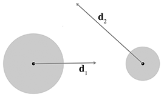
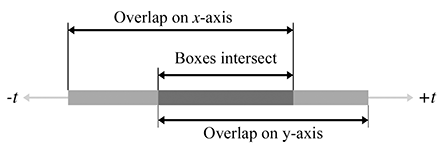

[<< Afterword](afterword.html)

[Contents](./)

[Answers to the Exercises >>](answers.html)

Chapter A 

Geometric Tests

[Chapter 9](geomprims.html) discussed a number of calculations that can be performed on a single primitive. Here, we present a number of useful calculations that operate on more than one primitive. This appendix is a collection of various geometric calculations that are sometimes useful. It is also instructive to browse these tests, because many illustrate general principles.

A more comprehensive list of fast intersection methods can be found at [http://www.realtimerendering.com/intersections.html](http://www.realtimerendering.com/intersections.html).

# A.1Closest Point on 2D Implicit Line

Consider an infinite line L in 2D defined implicitly by all points p such that

p ⋅ n ^ \=d,

where n ^ is a unit vector. Our goal is to find, for any point q , the point q ′ that is the closest point on L to q . This is the result of projecting q onto L . Let us draw a second line M through q , parallel to L , as shown in [Figure A.1](#closest_point_implicit_line).

Figure A.1 Finding the closest point on a 2D implicit line

Let n ^ M and dM be the normal and d value, respectively, of the line equation for M ; since L and M are parallel, they have the same normal: n ^ M\= n ^ . Since q is on M , dM can be computed as q ⋅ n ^ .

Now the signed distance from M to L measured parallel to n ^ is simply

d−dM\=d− q ⋅ n ^ .

This distance is obviously the same as the distance from q to q ′ . (If we need only the distance and not the value of q ′ , then we can stop here.) To compute the value of q ′ , we can simply take q and displace it by a multiple of n ^ :

Computing the closest point on a 2D implicit line

(A.1) q ′\= q +(d− q ⋅ n ^ ) n ^ .

# A.2Closest Point on a Parametric Ray

Consider the parametric ray R in 2D or 3D defined by

p (t)\= p org +t d ^ ,

Figure A.2 Finding the closest point on a ray

where d ^ is a unit vector, and the parameter t varies from 0 to l , where l is the length of R . For a given point q , we wish to find the point q ′ on R that is closest to q .

This is just a simple matter of projecting one vector onto another, which was presented in [Section 2.11.2](vectors.html#dot_product_geometry). Let v be the vector from p org to q . We wish to compute the result of projecting v onto d ^ —in other words, the portion of q parallel to d ^ . This is illustrated in [Figure A.2](#closest_point_parametric_ray).

The value of the dot product v ⋅ d ^ is the value t such that p (t)\= q ′ :

Computing the closest point on a parametric ray

t\= d ^ ⋅ v \= d ^ ⋅( q − p org ),(A.2) q ′\= p (t)\= p org +t d ^ \= p org +( d ^ ⋅( q − p org )) d ^ .

Actually, [Equation (A.2)](#closest_point_on_ray), for p (t) computes the point closest to q on the _infinite line_ containing R . If t<0 or t\>l , then p (t) is not within the ray R , in which case, the closest point to q on R will be the ray origin (if t<0 ) or endpoint (if t\>l ).

If the ray is defined where t varies from 0 to 1 and d is not necessarily a unit vector, then we must divide by the magnitude of d to compute the t value:

t\= d ⋅( q − p org ) ∥ d ∥ .

# A.3Closest Point on a Plane

Consider a plane P defined in the standard implicit manner as all points p that satisfy

p ⋅ n ^ \=d,

where n ^ is a unit vector. Given a point q , we wish to find the point q ′ , which is the result of projecting q onto P . Point q ′ is the closest point to q on P .

We showed how to compute the distance from a point to a plane in [Section 9.5.4](geomprims.html#plane_distance_to_point). To compute q ′ , we simply displace q by this distance, parallel to n ^ .

Computing the closest point on a plane

q ′\= q +(d− q ⋅ n ^ ) n ^

Notice that this is the same as [Equation (A.1)](#closest_point_2d_line), which computes the closest point to an implicit line in 2D.

# A.4Closest Point on a Circle or Sphere

Figure A.3 Finding the closest point on a circle

Imagine a 2D point q and a circle with center c and radius r . (The following discussion also applies to a sphere in 3D.) We wish to find q ′ , which is the closest point on the circle to q .

Let d be the vector from q to c . This vector intersects the circle at q ′ . Let b be the vector from q to q ′ , as shown in [Figure A.3](#closest_point_sphere).

Now, clearly, ∥ b ∥ \= ∥ d ∥ −r . Therefore,

b \= ∥ d ∥ −r ∥ d ∥ d .

Adding this displacement to q to project onto the circle, we get

Computing the closest point on a circle or sphere

q ′\= q + b \= q + ∥ d ∥ −r ∥ d ∥ d .

If ∥ d ∥ <r , then q is inside the circle. What should we with this situation? Should q ′\= q , or should we project q outwards onto the surface of the circle? Particular circumstances might call for either behavior. If we decide we wish to project the points onto the surface of the circle, then we'll be forced to make an arbitrary decision on what to do in the degenerate case where q \= c .

# A.5Closest Point in an AABB

Let B be an axially aligned bounding box (AABB) defined by the extreme points p min and p max . For any point q we can easily compute q ′ , the closest point in B to q . This is done by “pushing” q into B along each axis in turn, as illustrated in [Listing A.1](#closest_point_aabb). Notice that if the point is already inside the box, this code returns the original point.

if (x < minX) {
    x = minX;
} else if (x > maxX) {
    x = maxX;
}

if (y < minY) {
    y = minY;
} else if (y > maxY) {
    y = maxY;
}

if (z < minZ) {
    z = minZ;
} else if (z > maxZ) {
    z = maxZ;
}

# A.6Intersection Tests

The remaining sections of this chapter present an assortment of _intersection tests_. These tests are designed to determine whether two geometric primitives intersect, and (in some cases) to locate the intersection. We will consider different two types of intersection tests: static and dynamic.

*   A static test checks two _stationary_ primitives and detects whether the two primitives intersect. It is a Boolean test—that is, it usually returns only true (there is an intersection) or false (there is no intersection). If the test returns more details about the intersection, this extra information usually has the purpose of describing where the intersection occurred.
*   A dynamic test checks two _moving_ primitives and detects if and when two primitives intersect. Usually, the movement is expressed parametrically, and therefore the result of such a test is not only a Boolean true/false result but also a time value (the value of the parameter t ) that indicates when the primitives intersect. For the tests that we consider here, the movement value is a simple linear displacement—a vector offset by which the primitive moves as t varies from 0 to 1.  
    Although each object may have its own displacement over the time interval under consideration, it will be often easier to view the problem from the point of view of one of the primitives, considering that primitive to be “still” while the other primitive does all of the “moving.” We can easily do this by combining the two displacement vectors to get a single relative displacement vector that describes how the two primitives move in relation to each other. Thus, the dynamic tests will usually involve one stationary primitive and one moving primitive.  
    Notice that many important tests involving rays are actually dynamic tests, since a ray can be viewed as a moving point.

# A.7Intersection of Two Implicit Lines in 2D

Finding the intersection of two lines defined implicitly in 2D is a straightforward matter of solving a system of linear equations. We have two equations (the two implicit equations of the lines) and two unknowns (the x \- and y \-coordinates of the point of intersection). Our two equations are

a1x+b1y\=d1,a2x+b2y\=d2.

Solving this system of equations yields

Computing the intersection of two lines in 2D

(A.3)x\= b2d1−b1d2 a1b2−a2b1 ,y\= a1d2−a2d1 a1b2−a2b1 .

Just as for any system of linear equations, there are three solution possibilities (as illustrated in [Figure A.4](#intersection_two_lines_2d)):

*   There is one solution. In this case, the denominators in [Equation (A.3)](#intersection_2d_lines) will be nonzero.
*   There are no solutions. This indicates that the lines are parallel and not intersecting. The denominators are zero.
*   There are an infinite number of solutions. This is the case when the two lines are coincident. All the numerators and denominators are zero in this case.

Figure A.4Intersection of two lines in 2D—the three cases

# A.8Intersection of Two Rays in 3D

Given two rays in 3D defined parametrically by

r 1(t1)\= p 1+t1 d 1, r 2(t2)\= p 2+t2 d 2,

we can solve for their point of intersection. For a moment, let us not restrict the range of t1 and t2 ; therefore, we consider the infinite lines that contain the rays. The delta vectors d 1 and d 2 do not necessarily have to be unit vectors. If the rays lie in a plane, then we have the same three cases possible as in the previous section:

*   The rays intersect at exactly one point.
*   The rays are parallel, and there is no intersection.
*   The rays are coincident, and there are an infinite number of solutions

However, in 3D we have a fourth case, where the rays are skew and do not share a common plane. An example of skew lines is illustrated in [Figure A.5](#skew_rays).

Figure A.5Skew lines in 3D do not share a common plane or intersect.

We can solve for t1 and t2 . At the point of intersection,

r 1(t1)\= r 2(t2), p 1+t1 d 1\= p 2+t2 d 2,t1 d 1\= p 2+t2 d 2− p 1,(t1 d 1)× d 2\=( p 2+t2 d 2− p 1)× d 2,t1( d 1× d 2)\=(t2 d 2)× d 2+( p 2− p 1)× d 2,t1( d 1× d 2)\=t2( d 2× d 2)+( p 2− p 1)× d 2,t1( d 1× d 2)\=t2 0 +( p 2− p 1)× d 2,t1( d 1× d 2)\=( p 2− p 1)× d 2,t1( d 1× d 2)⋅( d 1× d 2)\= (( p 2− p 1)× d 2) ⋅( d 1× d 2),t1\= (( p 2− p 1)× d 2) ⋅( d 1× d 2) ∥ d 1× d 2 ∥ 2.

We obtain t2 in a similar fashion:

t2\= (( p 2− p 1)× d 1) ⋅( d 1× d 2) ∥ d 1× d 2 ∥ 2.

If the lines are parallel (or coincident), then the cross product of d 1 and d 2 is the zero vector, and therefore the denominator of both equations is zero. If the lines are skew, then r 1(t1) and r 2(t2) are the points of closest approach. To distinguish between skew and intersecting lines, we examine the distance between r 1(t1) and r 2(t2) . Of course, in practice, an exact intersection rarely occurs due to floating point imprecision, and therefore a tolerance must be used.

This discussion has assumed that the range of the parameters t1 and t2 were not restricted. If the rays have finite length (or extend in only one direction), then, of course, the appropriate boundary tests would be applied after computing t1 and t2 .

# A.9Intersection of a Ray and Plane

A ray intersects a plane in 3D at a point. Let the ray be defined parametrically by

p (t)\= p 0+t d .

The plane will be defined in the standard implicit manner, by all points p such that

p ⋅ n \=d.

Although we often restrict the plane normal n and the ray direction vector d to be unit vectors, in this case neither restriction is necessary.

Figure A.6 Intersection of a ray and plane in 3D

Let us solve for t at the point of intersection, assuming an infinite ray for the moment:

Parametric intersection of a ray and a plane

( p 0+t d )⋅ n \=d, p 0⋅ n +t d ⋅ n \=d,t d ⋅ n \=d− p 0⋅ n ,(A.4)t\= d− p 0⋅ n d ⋅ n .

If the ray is parallel to the plane, then the denominator d ⋅ n is zero and there is no intersection. If the value for t is out of range, then the ray does not intersect the plane. We may also wish to intersect only with the front of the plane. In this case, we say there is an intersection only if the ray points in a direction opposite to the normal of the plane (i.e., d ⋅ n <0 ).

# A.10Intersection of an AABB and Plane

Consider a 3D axially aligned bounding box defined by extreme points p min and p max , and a plane defined in the standard implicit manner by all points p that satisfy

p ⋅ n \=d,

where n is not necessarily a unit vector. The plane must be expressed in the same coordinate space as the AABB.

One obvious implementation strategy for a static test would be to classify each corner point as being on either the front or back side of the plane. We do this by taking the dot products of the corner points with n and comparing these dot products with d . If all of the dot products are greater than d , then the box is completely on the front side of the plane. If all of the dot products are less than d , then the box is completely on the back side of the plane.

As it turns out, we don't have to check all eight corner points. We'll use a trick similar to the one used in [Section 9.4.4](geomprims.html#transforming_aabbs) to transform an AABB. For example, if n x \>0 , then the corner with the minimal dot product has x\=x min and the corner with the maximal dot product has x\=x max . If n x <0 , then the opposite is true. Similar statements apply to n y and n z . We compute the minimum and maximum dot product values. If the minimum dot product value is greater than d , or if the maximum dot product is less than d , then there is no intersection. Otherwise, two corners were found that are on opposite sides of the plane, and therefore an intersection is detected. This strategy is implemented in [Listing A.2](#aabb_plane_intersection).

// Perform static AABB-plane intersection test.  Returns:
//
// <0   Box is completely on the BACK side of the plane
// >0   Box is completely on the FRONT side of the plane
// 0    Box intersects the plane
int AABB3::classifyPlane(const Vector3 &n, float d) const {

    // Inspect the normal and compute the minimum and maximum
    // D values.
    float minD, maxD;

    if (n.x > 0.0f) {
        minD = n.x\*min.x; maxD = n.x\*max.x;
    } else {
        minD = n.x\*max.x; maxD = n.x\*min.x;
    }

    if (n.y > 0.0f) {
        minD += n.y\*min.y; maxD += n.y\*max.y;
    } else {
        minD += n.y\*max.y; maxD += n.y\*min.y;
    }

    if (n.z > 0.0f) {
        minD += n.z\*min.z; maxD += n.z\*max.z;
    } else {
        minD += n.z\*max.z; maxD += n.z\*min.z;
    }

    // Check if completely on the front side of the plane
    if (minD >= d) {
        return +1;
    }

    // Check if completely on the back side of the plane
    if (maxD <= d) {
        return -1;
    }

    // We straddle the plane
    return 0;
}

A dynamic test is just one step further. Let's consider the plane to be stationary (recall from [Section A.6](#intersection_tests) that it is simpler to view the test from the frame of reference of one of the moving objects). The displacement of the box will be defined by a unit vector d and a length l . As before, we first locate the corner points with the minimum and maximum dot products and check for an intersection at t\=0 . If the box is not initially intersecting the plane, then it must first strike the plane at the corner point closest to the plane. This will be one of the two corner points identified in the first step. If we are interested only in colliding with the “front” of the plane, then we can always use the corner with the minimum dot product value. Once we have determined which corner will strike the plane, we use the ray-plane intersection test in [Section A.9](#intersection_ray_plane).

# A.11Intersection of Three Planes

In 3D, three planes intersect at a point, as shown in [Figure A.7](#intersection_three_planes).

Figure A.7 Three planes intersect at a point in 3D

Let the three planes be defined implicitly as

p ⋅ n 1\=d1, p ⋅ n 2\=d2, p ⋅ n 3\=d3.

Although we usually use unit vectors for the plane normals, in this case it is not necessary that n i be of unit length. These three plane equations give us a system of linear equations with three equations and three unknowns (the x \-, y \-, and z \-coordinates of the point of intersection). Solving this system of equations yields the following result, from Goldman [\[4\]](#reference_4):

Three planes intersect at a point

p \= d1( n 2× n 3)+d2( n 3× n 1)+d3( n 1× n 2) ( n 1× n 2)⋅ n 3 .

If any pair of planes is parallel, then the point of intersection either does not exist or is not unique. In either case, the triple product in the denominator is zero.

# A.12Intersection of Ray and a Circle or Sphere

This section discusses how to compute the intersection of a ray and a circle in 2D. This also works for computing the intersection of a ray and a sphere in 3D, since we can operate in the plane that contains the ray and the center of the circle and turn the 3D problem into a 2D one. (If the ray lies on a line that passes through the center of the sphere, the plane is not uniquely defined. This not a problem, however, because any of the infinitely many planes that pass through the ray and the center of the sphere can be used.)

Figure A.8 Intersection of a ray and sphere

We will use a construction inspired by Hultquist [\[5\]](#reference_5); see [Figure A.8](#intersection_ray_sphere). The sphere is defined by its center c and radius r , and the ray is defined by

p (t)\= p 0+t d ^ .

In this case, we use a unit vector d ^ and vary t from 0 to l , where l is the length of the ray.

We are solving for the value of t at the point of intersection. Clearly, t\=a−f . We can compute a as follows. Let e be the vector from p 0 to c :

e \= c − p 0.

Now we project e onto d ^ (see [Section 2.11.2](vectors.html#dot_product_geometry)). The length of this vector is a , and can be computed by

a\= e ⋅ d ^ .

Now all that remains is to compute f . First, by the Pythagorean theorem, we clearly see that

f2+b2\=r2.

We can solve for b2 by using the Pythagorean theorem on the larger triangle:

a2+b2\=e2,b2\=e2−a2,

where e is the distance from the origin of the ray to the center, that is, the length of the vector e . Thus, e2 can be computed by

e2\= e ⋅ e .

Substituting and solving for f , we get

f2+b2\=r2,f2+(e2−a2)\=r2,f2\=r2−e2+a2,f\=r2−e2+a2.

Finally, solving for t , we have

Parametric intersection of a ray and a circle or sphere

t\=a−f\=a−r2−e2+a2.

If the argument to the square root ( r2−e2+a2 ) is negative, then the ray does not intersect the sphere.

The origin of the ray could be inside the sphere. This is indicated by e2<r2 . Appropriate behavior in this case would vary, depending on the purpose of the test.

# A.13Intersection of Two Circles or Spheres

Figure A.9Intersection of two spheres

Detecting the static intersection of two spheres is relatively easy. (The discussion in this section also applies to circles—in fact, we use circles in the diagrams.) Consider two spheres defined by centers c 1 and c 2 and radii r1 and r2 , as shown in [Figure A.9](#intersection_two_spheres). Let d be the distance between their centers. Clearly, the spheres intersect if d<r1+r2 . In practice, we can avoid the square root involved in the calculation of d by checking that d2<(r1+r2)2 .

Detecting the intersection of two moving spheres is slightly more difficult. Assume, for the moment, that we have two separate displacement vectors d1 and d2 , one for each sphere, which describe how the spheres will move during the period of time under consideration. This is shown in [Figure A.10](#intersection_dynamic_spheres_both_moving).

Figure A.10 Two moving spheres

We can simplify the problem by viewing it from the point of view of the first sphere, considering that sphere to be “stationary” while the other sphere is the “moving” sphere. This gives us a single displacement vector d , computed as the difference of the two movement vectors d 2− d 1 . This is illustrated in [Figure A.11](#intersection_dynamic_spheres_one_moving).

Figure A.11 Combining displacement vectors so that one sphere is considered stationary

Let the stationary sphere be defined by its center c s and radius rs . The radius of the moving sphere is rm . The center of the moving sphere is c m at t\=0 . Rather than varying t from 0 to 1 as described previously, we normalize d ^ and vary t from 0 to l , where l is the length of the total relative displacement. So the position of the center of the moving sphere at time t is given by c m+t d ^ . Our goal is to find t , the time at which the moving sphere touches the stationary sphere. The geometry involved is illustrated in [Figure A.12](#intersection_dynamic_spheres).

Figure A.12Dynamic intersection of circles or spheres

To solve for t , we begin by calculating an intermediate vector e as the vector from c m to c s , and set r equal to the sum of the radii:

e \= c s− c m,r\=rm+rs.

According to the law of cosines (see [Section 1.4.5](cartesianspace.html#trig_identities)), we have

Undefined control sequence \\intertext Undefined control sequence \\intertext

Which root do we pick? The lower number (the negative root) produces the t value when the spheres _begin intersecting_. The greater number (the positive root) is the point where the spheres _cease to intersect_. We are interested in the first intersection:

t\= e ⋅ d ^ −( e ⋅ d ^ )2+r2− e ⋅ e .

If ∥ e ∥ <r , then the spheres are intersecting at t\=0 . If t<0 or t\>l , then the intersection does not occur within the period of time being considered. If the value inside the square root is negative, then there is no intersection.

# A.14Intersection of a Sphere and AABB

To detect the static intersection of a sphere and an AABB, we first find the point on the box that is closest to the center of the sphere by using the techniques from [Section A.5](#closest_point_aabb). We compute the distance from this point to the center of the sphere and compare this distance with the radius. (Actually, in practice we compare the distance squared against the radius squared to avoid the square root in the distance computation.) If the distance is smaller than the radius, then the sphere intersects the AABB.

Arvo [\[1\]](#reference_1) discusses this technique, which he uses for intersecting spheres with “solid” boxes. He also discusses some tricks for intersecting spheres with “hollow” boxes.

Unfortunately, the dynamic test is more complicated than the static one. For details, see Lengyel [\[6\]](#reference_6).

# A.15Intersection of a Sphere and a Plane

Detecting the static intersection of a sphere and a plane is relatively easy—we simply compute the distance from the center of the sphere to the plane by using [Equation (9.14)](geomprims.html#plane_distance_to_point). If this distance is less than the radius of the sphere, then the sphere intersects the plane. We can actually make a more robust test, which classifies the sphere as being completely on the front, completely on the back, or straddling the sphere. A code snippet is given in [Listing A.3](#intersection_sphere_plane).

// Given a sphere and plane, determine which side of the plane
// the sphere is on.
//
// Return values:
//
// < 0  Sphere is completely on the back
// > 0  Sphere is completely on the front
// 0    Sphere straddles plane

int classifySpherePlane(
    const Vector3 &planeNormal,  // must be normalized
    float          planeD,       // p \* planeNormal = planeD
    const Vector3 &sphereCenter, // center of sphere
    float          sphereRadius  // radius of sphere
) {

    // Compute distance from center of sphere to the plane
    float d = planeNormal \* sphereCenter - planeD;

    // Completely on the front side?
    if (d >= sphereRadius) {
        return +1;
    }

    // Completely on the back side?
    if (d <= -sphereRadius) {
        return -1;
    }

    // Sphere intersects the plane
    return 0;
}

The dynamic situation is only slightly more complicated. We consider the plane to be stationary, assigning all relative displacement to the sphere.

We define the plane in the usual manner by a normalized surface normal n ^ and distance value d such that all points p in the plane satisfy the equation p ⋅ n ^ \=d . The sphere is defined by its radius r and the initial position of the center, c . The displacement of the sphere is given by a unit vector d ^ specifying the direction, and a distance l . As t varies from 0 to l , the motion of the center of the sphere is given by the line equation c +t d ^ . This situation is shown, viewing the plane edge-on, in [Figure A.13](#intersection_dynamic_sphere_plane).

Figure A.13 A sphere moving towards a plane

The problem is greatly simplified by realizing that no matter where on the surface of the plane the intersection occurs, the point of contact on the surface of the sphere is always the same. That point of contact p 0 is given by c −r n ^ , as shown in [Figure A.14](#intersection_dynamic_sphere_plane_2).

Figure A.14 Point of contact between a sphere and a plane

Now that we know which point on the sphere first contacts the plane, we can use a simple ray-plane intersection test from [Section A.9](#intersection_ray_plane). We start with our solution to the ray-plane intersection test from [Equation (A.4)](#intersection_ray_plane) and then substitute c −r n ^ for p 0 :

Dynamic intersection of a sphere and plane

t\= d− p 0⋅ n ^ d ^ ⋅ n ^ ,\= d−( c −r n ^ )⋅ n ^ d ^ ⋅ n ^ ,\= d− c ⋅ n ^ +r d ^ ⋅ n ^ .

# A.16Intersection of a Ray and a Triangle

The ray-triangle intersection test is very important in graphics and computational geometry. In the absence of a special raytrace test against a given complex object, we can always represent (or at least approximate) the surface of an object as a triangle mesh and then raytrace against this triangle mesh representation.

Here we use a simple strategy from Badouel [\[2\]](#reference_2). The first step is to compute the point where the ray intersects the plane containing the triangle. [Section A.9](#intersection_ray_plane) showed how to compute the intersection of a plane and a ray. Then we test to see whether that point is inside the triangle by computing the barycentric coordinates of the point, as discussed in [Section 9.6.4](geomprims.html#triangle_barycentric_computing).

To speed up this test, we use a few tricks:

*   Detect and return a negative result (no collision) as soon as possible. This is known as “early out.”
*   Defer expensive mathematical operations, such as division, as long as possible. This is done for two reasons. First, if the result of the expensive calculation is not needed (for example, if we took an early out), then the time we spent performing the operation was wasted. Second, it gives the compiler plenty of room to take advantage of the operator pipeline in modern processors. If an operation such as division has a long latency, then the compiler may be able to look ahead and generate code that begins the division operation early. It then generates code that performs other tests (possibly taking an early out) while the division operation is under way. Then, at execution time, if and when the result of the division is actually needed, the result will be available or at least partially completed.
*   Only detect collisions where the ray approaches the triangle from the _front_ side. This allows us to take a very early out on approximately half of the triangles. Intersecting with both sides is slightly slower.

[Listing A.4](#ray_triangle_intersection) implements these techniques. Although it is commented in the listing, we have chosen to perform some floating point comparisons “backwards” since this behaves better in the presence of invalid floating point input data and NaNs (Not a Number).

float rayTriangleIntersect(
    const Vector3 &rayOrg,   // origin of the ray
    const Vector3 &rayDelta, // ray length and direction
    const Vector3 &p0,       // triangle vertices
    const Vector3 &p1,       // .
    const Vector3 &p2,       // .
    float minT               // closest intersection found so far.
                             // (Start with 1.0)
) {

    // We'll return this huge number of no intersection is detected
    const float kNoIntersection = FLT\_MAX;

    // Compute clockwise edge vectors.
    Vector3 e1 = p1 - p0;
    Vector3 e2 = p2 - p1;

    // Compute surface normal.  (Unnormalized)
    Vector3 n = crossProduct(e1, e2);

    // Compute gradient, which tells us how steep of an angle
    // we are approaching the \*front\* side of the triangle
    float dot = n \* rayDelta;

    // Check for a ray that is parallel to the triangle, or not
    // pointing towards the front face of the triangle.
    //
    // Note that this also will reject degenerate triangles and
    // rays as well.  We code this in a very particular
    // way so that NANs will bail here.  (I.e. this does NOT
    // behave the same as \`\`dot >= 0.0f'' when NANs are involved)
    if (!(dot < 0.0f)) {
        return kNoIntersection;
    }

    // Compute d value for the plane equation.  We will
    // use the plane equation with d on the right side:
    // Ax + By + Cz = d
    float d = n \* p0;

    // Compute parametric point of intersection with the plane
    // containing the triangle, checking at the earliest
    // possible stages for trivial rejection
    float t = d - n \* rayOrg;

    // Is ray origin on the backside of the polygon?  Again,
    // we phrase the check so that NANs will bail
    if (!(t <= 0.0f)) {
        return kNoIntersection;
    }

    // Closer intersection already found?  (Or does
    // ray not reach the plane?)
    //
    // since dot < 0:
    //
    //      t/dot > minT
    //
    // is the same as
    //
    //      t < dot\*minT
    //
    // (And then we invert it for NAN checking...)
    if (!(t >= dot\*minT)) {
        return kNoIntersection;
    }

    // OK, ray intersects the plane.  Compute actual parametric
    // point of intersection
    t /= dot;
    assert(t >= 0.0f);
    assert(t <= minT);

    // Compute 3D point of intersection
    Vector3 p = rayOrg + rayDelta\*t;

    // Find dominant axis to select which plane
    // to project onto, and compute u's and v's
    float u0, u1, u2;
    float v0, v1, v2;
    if (fabs(n.x) > fabs(n.y)) {
        if (fabs(n.x) > fabs(n.z)) {
            u0 = p.y - p0.y;
            u1 = p1.y - p0.y;
            u2 = p2.y - p0.y;

            v0 = p.z - p0.z;
            v1 = p1.z - p0.z;
            v2 = p2.z - p0.z;
        } else {
            u0 = p.x - p0.x;
            u1 = p1.x - p0.x;
            u2 = p2.x - p0.x;

            v0 = p.y - p0.y;
            v1 = p1.y - p0.y;
            v2 = p2.y - p0.y;
        }
    } else {
        if (fabs(n.y) > fabs(n.z)) {
            u0 = p.x - p0.x;
            u1 = p1.x - p0.x;
            u2 = p2.x - p0.x;

            v0 = p.z - p0.z;
            v1 = p1.z - p0.z;
            v2 = p2.z - p0.z;
        } else {
            u0 = p.x - p0.x;
            u1 = p1.x - p0.x;
            u2 = p2.x - p0.x;

            v0 = p.y - p0.y;
            v1 = p1.y - p0.y;
            v2 = p2.y - p0.y;
        }
    }

    // Compute denominator, check for invalid
    float temp = u1 \* v2 - v1 \* u2;
    if (!(temp != 0.0f)) {
        return kNoIntersection;
    }
    temp = 1.0f / temp;

    // Compute barycentric coords, checking for out-of-range
    // at each step
    float alpha = (u0 \* v2 - v0 \* u2) \* temp;
    if (!(alpha >= 0.0f)) {
        return kNoIntersection;
    }

    float beta = (u1 \* v0 - v1 \* u0) \* temp;
    if (!(beta >= 0.0f)) {
        return kNoIntersection;
    }

    float gamma = 1.0f - alpha - beta;
    if (!(gamma >= 0.0f)) {
        return kNoIntersection;
    }

    // Return parametric point of intersection
    return t;
}

There is one more significant strategy, not illustrated in [Listing A.4](#ray_triangle_intersection), for optimizing expensive calculations: precompute their results. If values such as the polygon normal can be computed ahead of time, then different strategies may be used.

Because of the fundamental importance of this test, programmers are always looking for ways to make it faster. The technique we have given here is a standard one that is easy to understand and produces the barycentric coordinates, often a useful byproduct, as a side effect. It is not the fastest. See Tomas Akenine-Möller's collection of intersection tests on the web page for _Real-Time Rendering_ at [http://www.realtimerendering.com/intersections.html](http://www.realtimerendering.com/intersections.html).

# A.17Intersection of Two AABBs

Detecting the static intersection of two AABBs is an extremely important operation. Luckily, it's rather trivial.[1](#footnote_1) We simply check for overlapping extents on each dimension independently. If there is no overlap on a particular dimension, then the two AABBs do not intersect. This technique is used in [Listing A.5](#aabb_aabb_overlap).

bool aabbsOverlap(const AABB3 &a, const AABB3 &b) {

    // Check for a separating axis.
    if (a.min.x >= b.max.x) return false;
    if (a.max.x <= b.min.x) return false;
    if (a.min.y >= b.max.y) return false;
    if (a.max.y <= b.min.y) return false;
    if (a.min.z >= b.max.z) return false;
    if (a.max.z <= b.min.z) return false;

    // Overlap on all three axes, so their
    // intersection must be non-empty
    return true;
}

This strategy is actually an instance of a more general strategy known as the _separating axis_ test. If two convex polyhedra do not overlap, then there exists a separating axis upon which, if we project the two polyhedra, their projections will not overlap. (In 3D, it's easier to visualize a plane perpendicular to the separating axis that can be placed between the two polyhedra.) The key to the separating axis method is that only a finite number of axes need to be tested: the normals of the faces and certain cross products; for details, see Ericson [\[3\]](#reference_3). If the projections of the polyhedra onto those axes overlap in all cases, then it is safe to assume that no separating axis can be found. In the case of two AABBs, only the three cardinal axes need to be tested. Furthermore, these “projections” simply extract the appropriate coordinate.

The dynamic intersection of AABBs is only slightly more complicated. Consider a stationary AABB defined by extreme points s min and s max , and a moving AABB, which has extreme points m min and m max in the initial position at t\=0 . The moving AABB displaces by an amount given by the vector d , as t varies from 0 to 1.

Our task is to compute t , the parametric point in time where the moving box first collides with the stationary box. (We assume that the boxes are not initially intersecting.) To do this, we will attempt to determine the first point in time when the boxes have overlap on all dimensions simultaneously. Since this applies in 2D or 3D, we illustrate the problem here in 2D; extending the technique into 3D is straightforward. We analyze each coordinate separately, solving two (or three, in 3D) separate one-dimensional problems, and then combining these results to give the answer.

The problem is now one-dimensional. We need to know the interval of time when the two boxes overlap on a particular dimension. Imagine projecting the problem onto the x \-axis (for example), as shown in [Figure A.15](#intersection_dynamic_aabb).

Figure A.15 Projecting the dynamic AABB intersection problem onto one axis

As we advance in time, the line segment representing the moving box will slide along the number line. In the illustration in [Figure A.15](#intersection_dynamic_aabb), at t\=0 the moving box is completely to the left of the stationary box, and at t\=1 , the moving box is completely to the right of the stationary box. There is a point t enter where the boxes first begin to overlap, and a point t leave where the boxes cease to overlap. For the dimension we are considering, let m min (t) and m max (t) be the minimum and maximum values, respectively, of the moving box at time t , given by

m min (t)\=m min (0)+td,m max (t)\=m max (0)+td,

where m min (0) and m max (0) are the initial extents of the moving box and d is the component of the displacement vector d for this axis. Let s min and s max have similar definitions for the stationary box. (Of course, these values are independent of t since the box is stationary.) The time t enter is the t value for which m max (t)\=s min . Solving, we get

m max (t enter )\=s min ,m max (0)+t enter d\=s min ,t enter d\=s min −m max (0),t enter \= s min −m max (0) d.

Likewise, we can solve for t leave :

m min (t leave )\=s max ,m min (0)+t leave d\=s max ,t leave d\=s max −m min (0),t leave \= s max −m min (0) d.

Three important points are noted here:

*   If the denominator d is zero, then boxes either always overlap or never overlap.
*   If the moving box begins on the right side of the stationary box and moves left, then t enter \>t leave . We handle this scenario by swapping their values to ensure that t enter <t leave .
*   The values for t enter and t leave may be outside the range \[0,1\]. To accommodate t values outside this range, we can think of the moving box as moving along an infinite trajectory parallel to d . If t enter \>1 or t leave <0 , then there is no overlap in the period of time under consideration.

We now have a way to find the interval of time, bounded by t enter and t leave , when the two boxes overlap on a single dimension. The intersection of these intervals on all dimensions gives us the interval of time where the boxes intersect with each other. This is illustrated in [Figure A.16](#intersection_dynamic_aabb_t_overlap) for two time intervals in 2D.

Figure A.16 Intersecting two intervals of time

Don't confuse [Figure A.16](#intersection_dynamic_aabb_t_overlap) with [Figure A.15](#intersection_dynamic_aabb). In [Figure A.16](#intersection_dynamic_aabb_t_overlap), the axis is the time axis; in [Figure A.15](#intersection_dynamic_aabb) the axis is the x \-axis.

If the interval is empty, then the boxes never collide. If the interval lies completely outside the range 0≤t≤1 , then there is no collision over the period of time of interest. Actually, the interval during which the boxes overlap is more information than we wanted, since we are interested only in the point in time when the boxes begin intersecting, not when they cease to intersect. Still, we need to maintain this interval, mainly to determine whether it is empty.

Unfortunately, in practice, bounding boxes for objects are rarely axially aligned in the same coordinate space. However, because this test is relatively fast, it is useful as a preliminary trivial rejection test, to be followed by a more specific (and usually more expensive) test.

# A.18Intersection of a Ray and an AABB

Computing the intersection of a ray with an AABB is an important calculation because the result of this test is commonly used for trivial rejection on more complicated objects. (For example, if we wish to raytrace against multiple triangle meshes, we can first raytrace against the AABBs of the meshes to trivially reject entire meshes at once, rather than having to check each triangle.)

Woo [\[7\]](#reference_7) describes a method that first determines which side of the box would be intersected and then performs a ray-plane intersection test against the plane containing that side. If the point of intersection with the plane is within the box, then there is an intersection; otherwise, there is no intersection. This is implemented in [Listing A.6](#ray_box_intersection).

// Return parametric point of intersection 0...1, or a really huge
// number if no intersection is found
float AABB3::rayIntersect(
    const Vector3 &rayOrg,      // orgin of the ray
    const Vector3 &rayDelta,    // length and direction of the ray
    Vector3 \*returnNormal       // optionally, the normal is returned
) const {

    // We'll return this huge number if no intersection
    const float kNoIntersection = FLT\_MAX;

    // Check for point inside box, trivial reject, and
    // determine parametric distance to each front face
    bool inside = true;

    float xt, xn;
    if (rayOrg.x < min.x) {
        xt = min.x - rayOrg.x;
        if (xt > rayDelta.x) return kNoIntersection;
        xt /= rayDelta.x;
        inside = false;
        xn = -1.0f;
    } else if (rayOrg.x > max.x) {
        xt = max.x - rayOrg.x;
        if (xt < rayDelta.x) return kNoIntersection;
        xt /= rayDelta.x;
        inside = false;
        xn = 1.0f;
    } else {
        xt = -1.0f;
    }

    float yt, yn;
    if (rayOrg.y < min.y) {
        yt = min.y - rayOrg.y;
        if (yt > rayDelta.y) return kNoIntersection;
        yt /= rayDelta.y;
        inside = false;
        yn = -1.0f;
    } else if (rayOrg.y > max.y) {
        yt = max.y - rayOrg.y;
        if (yt < rayDelta.y) return kNoIntersection;
        yt /= rayDelta.y;
        inside = false;
        yn = 1.0f;
    } else {
        yt = -1.0f;
    }

    float zt, zn;
    if (rayOrg.z < min.z) {
        zt = min.z - rayOrg.z;
        if (zt > rayDelta.z) return kNoIntersection;
        zt /= rayDelta.z;
        inside = false;
        zn = -1.0f;
    } else if (rayOrg.z > max.z) {
        zt = max.z - rayOrg.z;
        if (zt < rayDelta.z) return kNoIntersection;
        zt /= rayDelta.z;
        inside = false;
        zn = 1.0f;
    } else {
        zt = -1.0f;
    }

    // Ray origin inside box?
    if (inside) {
        if (returnNormal != NULL) {
            \*returnNormal = -rayDelta;
            returnNormal->normalize();
        }
        return 0.0f;
    }

    // Select farthest plane - this is
    // the plane of intersection.
    int which = 0;
    float t = xt;
    if (yt > t) {
        which = 1;
        t = yt;
    }
    if (zt > t) {
        which = 2;
        t = zt;
    }
    switch (which) {

        case 0: // intersect with yz plane
        {
            float y = rayOrg.y + rayDelta.y\*t;
            if (y < min.y || y > max.y) return kNoIntersection;
            float z = rayOrg.z + rayDelta.z\*t;
            if (z < min.z || z > max.z) return kNoIntersection;

            if (returnNormal != NULL) {
                returnNormal->x = xn;
                returnNormal->y = 0.0f;
                returnNormal->z = 0.0f;
            }

        } break;

        case 1: // intersect with xz plane
        {
            float x = rayOrg.x + rayDelta.x\*t;
            if (x < min.x || x > max.x) return kNoIntersection;
            float z = rayOrg.z + rayDelta.z\*t;
            if (z < min.z || z > max.z) return kNoIntersection;

            if (returnNormal != NULL) {
                returnNormal->x = 0.0f;
                returnNormal->y = yn;
                returnNormal->z = 0.0f;
            }

        } break;

        case 2: // intersect with xy plane
        {
            float x = rayOrg.x + rayDelta.x\*t;
            if (x < min.x || x > max.x) return kNoIntersection;
            float y = rayOrg.y + rayDelta.y\*t;
            if (y < min.y || y > max.y) return kNoIntersection;

            if (returnNormal != NULL) {
                returnNormal->x = 0.0f;
                returnNormal->y = 0.0f;
                returnNormal->z = zn;
            }

        } break;
    }

    // Return parametric point of intersection
    return t;

}

References

\[1\] James Arvo.   “A Simple Method for Box-Sphere Intersection Testing.”   In _Graphics Gems_, edited by Andrew S. Glassner. San Diego: Academic Press Professional, 1990.

\[2\] Didier Badouel.   “An Efficient Ray-Polygon Intersection.”   In _Graphics Gems_, edited by Andrew S. Glassner. San Diego: Academic Press Professional, 1990.

\[3\] Christer Ericson.   _Real-Time Collision Detection_.   San Francisco: Morgan Kaufmann Publishers, 2005.

\[4\] Ronald Goldman.   “Intersection of Three Planes.”   In _Graphics Gems_, edited by Andrew S. Glassner. San Diego: Academic Press Professional, 1990.

\[5\] Jeff Hultquist.   “Intersection of a Ray with a Sphere.”   In _Graphics Gems_, edited by Andrew S. Glassner. San Diego: Academic Press Professional, 1990.

\[6\] Eric Lengyel.   _Mathematics for 3D Game Programming and Computer Graphics_, Second edition.   Boston: Charles River Media, 2004.   [http://www.terathon.com/books/mathgames2.html](http://www.terathon.com/books/mathgames2.html).

\[7\] Andrew Woo.   “Fast Ray-Box Intersection.”   In _Graphics Gems_, edited by Andrew S. Glassner. San Diego: Academic Press Professional, 1990.

1.  This is one of Fletcher's favorite interview questions. It's surprising how many programmers do not know how to perform this very simple operation. Don't be one of those applicants!