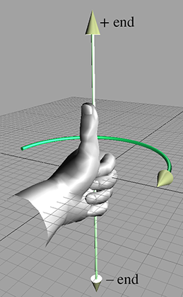
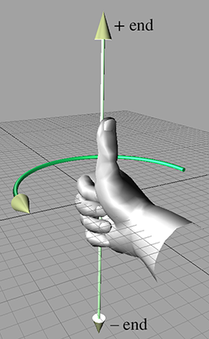
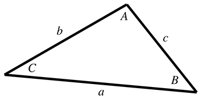

[<< Introduction](intro.html)

[Contents](./)

[Vectors >>](vectors.html)

Chapter 1 

Cartesian Coordinate Systems

Before turning to those moral and mental aspects of the matter which present the greatest difficulties, let the inquirer begin by mastering more elementary problems.

— Sherlock Holmes from _A Study in Scarlett_ (1887)

3D math is all about measuring locations, distances, and angles precisely and mathematically in 3D space. The most frequently used framework to perform such calculations using a computer is called the _Cartesian coordinate system_. Cartesian mathematics was invented by (and is named after) a brilliant French philosopher, physicist, physiologist, and mathematician named René Descartes, who lived from 1596 to 1650. René Descartes is famous not just for inventing Cartesian mathematics, which at the time was a stunning unification of algebra and geometry. He is also well-known for making a pretty good stab of answering the question “How do I know something is true?”—a question that has kept generations of philosophers happily employed and does not necessarily involve dead sheep (which will perhaps disturbingly be a central feature of the next section), unless you really want it to. Descartes rejected the answers proposed by the Ancient Greeks, which are _ethos_ (roughly, “because I told you so”), _pathos_ (“because it would be nice”), and _logos_ (“because it makes sense”), and set about figuring it out for himself with a pencil and paper.

This chapter is divided into four main sections.

*   [Section 1.1](#1d) reviews some basic principles of number systems and the first law of computer graphics.
*   [Section 1.2](#2d) introduces 2D Cartesian mathematics, the mathematics of flat surfaces. It shows how to describe a 2D cartesian coordinate space and how to locate points using that space.
*   [Section 1.3](#3d_cartesian) extends these ideas into three dimensions. It explains left- and right-handed coordinate spaces and establishes some conventions used in this book.
*   [Section 1.4](#odds_and_ends) concludes the chapter by quickly reviewing assorted prerequisites.

# 1.11D Mathematics

You're reading this book because you want to know about 3D mathematics, so you're probably wondering why we're bothering to talk about 1D math. Well, there are a couple of issues about number systems and counting that we would like to clear up before we get to 3D.

 Figure 1.1One dead sheep

The _natural numbers_, often called the _counting numbers_, were invented millennia ago, probably to keep track of dead sheep. The concept of “one sheep” came easily (see [Figure 1.1](#sheep)), then “two sheep,” “three sheep,” but people very quickly became convinced that this was too much work, and gave up counting at some point that they invariably called “many sheep.” Different cultures gave up at different points, depending on their threshold of boredom. Eventually, civilization expanded to the point where we could afford to have people sitting around thinking about numbers instead of doing more survival-oriented tasks such as killing sheep and eating them. These savvy thinkers immortalized the concept of zero (no sheep), and although they didn't get around to naming all of the natural numbers, they figured out various systems whereby they could name them if they really wanted to using digits such as 1, 2, etc. (or if you were Roman, M, X, I, etc.). Thus, mathematics was born.

Figure 1.2A number line for the natural numbers

The habit of lining sheep up in a row so that they can be easily counted leads to the concept of a number line, that is, a line with the numbers marked off at regular intervals, as in [Figure 1.2](#naturals). This line can in principle go on for as long as we wish, but to avoid boredom we have stopped at five sheep and used an arrowhead to let you know that the line can continue. Clearer thinkers can visualize it going off to infinity, but historical purveyors of dead sheep probably gave this concept little thought outside of their dreams and fevered imaginings.

At some point in history, it was probably realized that sometimes, particularly fast talkers could sell sheep that they didn't actually own, thus simultaneously inventing the important concepts of debt and negative numbers. Having sold this putative sheep, the fast talker would in fact own “negative one” sheep, leading to the discovery of the _integers_, which consist of the natural numbers and their negative counterparts. The corresponding number line for integers is shown in [Figure 1.3](#integers).

Figure 1.3 A number line for integers. (Note the ghost sheep for negative numbers.)

The concept of poverty probably predated that of debt, leading to a growing number of people who could afford to purchase only half a dead sheep, or perhaps only a quarter. This led to a burgeoning use of fractional numbers consisting of one integer divided by another, such as 2/3 or 111/27. Mathematicians called these _rational numbers_, and they fit in the number line in the obvious places between the integers. At some point, people became lazy and invented decimal notation, writing “3.1415” instead of the longer and more tedious 31415/10000, for example.

After a while it was noticed that some numbers that appear to turn up in everyday life were not expressible as rational numbers. The classic example is the ratio of the circumference of a circle to its diameter, usually denoted π (the Greek letter pi, pronounced “pie”). These are the so-called _real numbers_, which include the rational numbers and numbers such as π that would, if expressed in decimal notation, require an infinite number of decimal places. The mathematics of real numbers is regarded by many to be the most important area of mathematics—indeed, it is the basis of most forms of engineering, so it can be credited with creating much of modern civilization. The cool thing about real numbers is that although rational numbers are countable (that is, can be placed into one-to-one correspondence with the natural numbers), the real numbers are uncountable. The study of natural numbers and integers is called _discrete mathematics_, and the study of real numbers is called _continuous mathematics_.

The truth is, however, that real numbers are nothing more than a polite fiction. They are a relatively harmless delusion, as any reputable physicist will tell you. The universe seems to be not only discrete, but also finite. If there are a finite amount of discrete things in the universe, as currently appears to be the case, then it follows that we can only count to a certain fixed number, and thereafter we run out of things to count on—not only do we run out of dead sheep, but toasters, mechanics, and telephone sanitizers, too. It follows that we can describe the universe using only discrete mathematics, and only requiring the use of a finite subset of the natural numbers at that (large, yes, but finite). Somewhere, someplace there may be an alien civilization with a level of technology exceeding ours who have never heard of continuous mathematics, the fundamental theorem of calculus, or even the concept of infinity; even if we persist, they will firmly but politely insist on having no truck with π , being perfectly happy to build toasters, bridges, skyscrapers, mass transit, and starships using 3.14159 (or perhaps 3.1415926535897932384626433832795 if they are fastidious) instead.

So why do we use continuous mathematics? Because it is a useful tool that lets us do engineering. But the real world is, despite the cognitive dissonance involved in using the term “real,” discrete. How does that affect you, the designer of a 3D computer-generated virtual reality? The computer is, by its very nature, discrete and finite, and you are more likely to run into the consequences of the discreteness and finiteness during its creation than you are likely to in the real world. C++ gives you a variety of different forms of number that you can use for counting or measuring in your virtual world. These are the short, the int, the float and the double, which can be described as follows (assuming current PC technology). The short is a 16-bit integer that can store 65,536 different values, which means that “many sheep” for a 16-bit computer is 65,537. This sounds like a lot of sheep, but it isn't adequate for measuring distances inside any reasonable kind of virtual reality that take people more than a few minutes to explore. The int is a 32-bit integer that can store up to 4,294,967,296 different values, which is probably enough for your purposes. The float is a 32-bit value that can store a subset of the rationals (slightly fewer than 4,294,967,296 of them, the details not being important here). The double is similar, using 64 bits instead of 32.

The bottom line in choosing to count and measure in your virtual world using ints, floats, or doubles is not, as some misguided people would have it, a matter of choosing between discrete shorts and ints versus continuous floats and doubles; it is more a matter of precision. They are all discrete in the end. Older books on computer graphics will advise you to use integers because floating-point hardware is slower than integer hardware, but this is no longer the case. In fact, the introduction of dedicated floating point vector processors has made floating-point arithmetic faster than integer in many common cases. So which should you choose? At this point, it is probably best to introduce you to the first law of computer graphics and leave you to think about it.

The First Law of Computer Graphics

If it _looks_ right, it _is_ right.

We will be doing a lot of trigonometry in this book. Trigonometry involves real numbers such as π , and real-valued functions such as sine and cosine (which we'll get to later). Real numbers are a convenient fiction, so we will continue to use them. How do you know this is true? Because, Descartes notwithstanding, we told you so, because it would be nice, and because it makes sense.

# 1.22D Cartesian Space

You probably have used 2D Cartesian coordinate systems even if you have never heard the term “Cartesian” before. “Cartesian” is mostly just a fancy word for “rectangular.” If you have ever looked at the floor plans of a house, used a street map, seen a football[1](#footnote_1) game, or played chess, you have some exposure to 2D Cartesian coordinate spaces.

This section introduces 2D Cartesian mathematics, the mathematics of flat surfaces. It is divided into three main subsections.

*   [Section 1.2.1](#2d_cartesia) provides a gentle introduction to the concept of 2D Cartesian space by imagining a fictional city called Cartesia.
*   [Section 1.2.2](#2d_arbitrary) generalizes this concept to arbitrary or abstract 2D Cartesian spaces. The main concepts introduced are
    *   the origin
    *   the x \- and y \-axes
    *   orienting the axes in 2D
*   [Section 1.2.3](#2d_locatepoints) describes how to specify the location of a point in the 2D plane using Cartesian (x,y) coordinates.

## 1.2.1An Example: The Hypothetical City of Cartesia

Let's imagine a fictional city named Cartesia. When the Cartesia city planners were laying out the streets, they were very particular, as illustrated in the map of Cartesia in [Figure 1.4](#map_of_cartesia).

Figure 1.4 Map of the hypothetical city of Cartesia

As you can see from the map, Center Street runs east-west through the middle of town. All other east-west streets (parallel to Center Street) are named based on whether they are north or south of Center Street, and how far they are from Center Street. Examples of streets that run east-west are North 3rd Street and South 15th Street.

The other streets in Cartesia run north-south. Division Street runs north-south through the middle of town. All other north-south streets (parallel to Division Street) are named based on whether they are east or west of Division Street, and how far they are from Division Street. So we have streets such as East 5th Street and West 22nd Street.

The naming convention used by the city planners of Cartesia may not be creative, but it certainly is practical. Even without looking at the map, it is easy to find the donut shop at North 4th and West 2nd. It's also easy to determine how far you will have to drive when traveling from one place to another. For example, to go from that donut shop at North 4th and West 2nd, to the police station at South 3rd and Division, you would travel seven blocks south and two blocks east.

## 1.2.2Arbitrary 2D Coordinate Spaces

Before Cartesia was built, there was nothing but a large flat area of land. The city planners arbitrarily decided where the center of town would be, which direction to make the roads run, how far apart to space the roads, and so forth. Much like the Cartesia city planners laid down the city streets, we can establish a 2D Cartesian coordinate system anywhere we want—on a piece of paper, a chessboard, a chalkboard, a slab of concrete, or a football field.

[Figure 1.5](#2d_cartesian_space) shows a diagram of a 2D Cartesian coordinate system.

Figure 1.5A 2D Cartesian coordinate space

As illustrated in [Figure 1.5](#2d_cartesian_space), a 2D Cartesian coordinate space is defined by two pieces of information:

*   Every 2D Cartesian coordinate space has a special location, called the origin, which is the “center” of the coordinate system. The origin is analogous to the center of the city in Cartesia.
*   Every 2D Cartesian coordinate space has two straight lines that pass through the origin. Each line is known as an axis and extends infinitely in two opposite directions. The two axes are perpendicular to each other. (Actually, they don't have to be, but most of the coordinate systems we will look at will have perpendicular axes.) The two axes are analogous to Center and Division streets in Cartesia. The grid lines in the diagram are analogous to the other streets in Cartesia.

At this point it is important to highlight a few significant differences between Cartesia and an abstract mathematical 2D space:

*   The city of Cartesia has official city limits. Land outside of the city limits is not considered part of Cartesia. A 2D coordinate space, however, extends infinitely. Even though we usually concern ourselves with only a small area within the plane defined by the coordinate space, in theory this plane is boundless. Also, the roads in Cartesia go only a certain distance (perhaps to the city limits) and then they stop. In contrast, our axes and grid lines extend potentially infinitely in two directions.
*   In Cartesia, the roads have thickness. In contrast, lines in an abstract coordinate space have location and (possibly infinite) length, but no real thickness.
*   In Cartesia, you can drive only on the roads. In an abstract coordinate space, every point in the plane of the coordinate space is part of the coordinate space, not just the “roads.” The grid lines are drawn only for reference.

In [Figure 1.5](#2d_cartesian_space), the horizontal axis is called the x \-axis, with positive x pointing to the right, and the vertical axis is the y \-axis, with positive y pointing up. This is the customary orientation for the axes in a diagram. Note that “horizontal” and “vertical” are terms that are inappropriate for many 2D spaces that arise in practice. For example, imagine the coordinate space on top of a desk. Both axes are “horizontal,” and neither axis is really “vertical.”

The city planners of Cartesia could have made Center Street run north-south instead of east-west. Or they could have oriented it at a completely arbitrary angle. For example, Long Island, New York, is reminiscent of Cartesia, where for convenience the “streets” (1st Street, 2nd Street etc.) run across the island, and the “avenues” (1st Avenue, 2nd Avenue, etc.) run along its long axis. The geographic orientation of the long axis of the island is an arbitrary result of nature. In the same way, we are free to orient our axes in any way that is convenient to us. We must also decide for each axis which direction we consider to be positive. For example, when working with images on a computer screen, it is customary to use the coordinate system shown in [Figure 1.6](#screen_space). Notice that the origin is in the upper left-hand corner, +x points to the right, and +y points down rather than up.

Figure 1.6Screen coordinate space

Unfortunately, when Cartesia was being laid out, the only mapmakers were in the neighboring town of Dyslexia. The minor-level functionary who sent the contract out to bid neglected take into account that the dyslectic mapmaker was equally likely to draw his maps with north pointing up, down, left, or right. Although he always drew the east-west line at right angles to the north-south line, he often got east and west backwards. When his boss realized that the job had gone to the lowest bidder, who happened to live in Dyslexia, many hours were spent in committee meetings trying to figure out what to do. The paperwork had been done, the purchase order had been issued, and bureaucracies being what they are, it would be too expensive and time-consuming to cancel the order. Still, nobody had any idea what the mapmaker would deliver. A committee was hastily formed.

Figure 1.7 Possible map axis orientations in 2D

The committee fairly quickly decided that there were only eight possible orientations that the mapmaker could deliver, shown in [Figure 1.7](#2d_axes_orientations). In the best of all possible worlds, he would deliver a map oriented as shownin the top-left rectangle, with north pointing to the top of thepage and east to the right, which is what people usually expect. A subcommittee formed for the task decided to name this the normalorientation.

After the meeting had lasted a few hours and tempers were beginning to fray, it was decided that the other three variants shown in the top row of [Figure 1.7](#2d_axes_orientations) were probably acceptable too, because they could be transformed to the normal orientation by placing a pin in the center of the page and rotating the map around the pin. (You can do this, too, by placing this book flat on a table and turning it.) Many hours were wasted by tired functionaries putting pins into various places in the maps shown in the second row of [Figure 1.7](#2d_axes_orientations), but no matter how fast they twirled them, they couldn't seem to transform them to the normal orientation. It wasn't until everybody important had given up and gone home that a tired intern, assigned to clean up the used coffee cups, noticed that the maps in the second row can be transformed into the normal orientation by holding them up against a light and viewing them from the back. (You can do this, too, by holding [Figure 1.7](#2d_axes_orientations) up to the light and viewing it from the back—you'll have to turn it, too, of course.) The writing was backwards too, but it was decided that if Leonardo da Vinci (1452–1519) could handle backwards writing in 15th century, then the citizens of Cartesia, though by no means his intellectual equivalent (probably due to daytime TV), could probably handle it in the 21st century.

In summary, no matter what orientation we choose for the x \- and y \-axes, we can always rotate the coordinate space around so that +x points to our right and +y points up. For our example of screen-space coordinates, imagine turning the coordinate system upside down and looking at the screen from behind the monitor. In any case, these rotations do not distort the original shape of the coordinate system (even though we may be looking at it upside down or reversed). So in one particular sense, all 2D coordinate systems are “equal.” In [Section 1.3.3](#3d_hands), we discover the surprising fact that this is not the case in 3D.

## 1.2.3Specifying Locations in 2D Using Cartesian Coordinates

A coordinate space is a framework for specifying location precisely. A gentleman of Cartesia could, if he wished to tell his lady love where to meet him for dinner, for example, consult the map in [Figure 1.4](#map_of_cartesia) and say, “Meet you at the corner of East 2nd Street and North 4th Street.” Notice that he specifies two coordinates, one in the horizontal dimension (East 2nd Street, listed along the top of the map in [Figure 1.4](#map_of_cartesia)) and one in the vertical dimension (North 4th Street, listed along the left of the map). If he wished to be concise he could abbreviate the “East 2nd Street” to “2” and the “North 4th Street” to “4” and say to his lady love, somewhat cryptically, “Meet you at ( 2,4 ).”

The ordered pair ( 2,4 ) is an example of what are called _Cartesian coordinates_. In 2D, two numbers are used to specify a location. (The fact that we use two numbers to describe the location of a point is the reason it's called _two_\-dimensional space. In 3D, we will use three numbers.) The first coordinate (the 2 in our example ( 2,4 )) is called the x \-coordinate, and the second coordinate (the 4 in our example ( 2,4 )) is called the y \-coordinate.

Figure 1.8 How to locate a point using 2D Cartesian coordinates

Analogous to the street names in Cartesia, each of the two coordinates specifies which side of the origin the point is on and how far away the point is from the origin in that direction. More precisely, each coordinate is the _signed distance_ (that is, positive in one direction and negative in the other) to one of the axes, measured along a line parallel to the other axis. Essentially, we use positive coordinates for east and north streets and negative coordinates for south and west streets. As shown in [Figure 1.8](#2d_locating_points), the x \-coordinate designates the signed distance from the point to the y \-axis, measured along a line parallel to the x \-axis. Likewise, the y \-coordinate designates the signed distance from the point to the x \-axis, measured along a line parallel to the y \-axis.

Figure 1.9 Example points labeled with 2D Cartesian coordinates

[Figure 1.9](#2d_labeled_points) shows several points and their Cartesian coordinates. Notice that the points to the left of the y \-axis have negative x values, and those to the right of the y \-axis have positive x values. Likewise, points with positive y are located above the x \-axis, and points with negative y are below the x \-axis. Also notice that _any_ point can be specified, not just the points at grid line intersections. You should study this figure until you are sure that you understand the pattern.

Let's take a closer look at the grid lines usually shown in a diagram. Notice that a vertical grid line is composed of points that all have the same x \-coordinate. In other words, a vertical grid line (actually _any_ vertical line) marks a line of constant x . Likewise, a horizontal grid line marks a line of constant y ; all the points on that line have the same y coordinate. We'll come back to this idea in a bit when we discuss polar coordinatespaces.

# 1.33D Cartesian Space

The previous sections have explained how the Cartesian coordinate system works in 2D. Now it's time to leave the flat 2D world and think about 3D space.

It might seem at first that 3D space is only “50%more complicated” than 2D. After all, it's just _one_ more dimension, and we already had _two_. Unfortunately, this is not the case. For a variety of reasons, 3D space is _more_ than incrementally more difficult than 2D space for humans to visualize and describe. (One possible reason for this difficulty could be that our physical world is 3D, whereas illustrations in books and on computer screens are 2D.) It is frequently the case that a problem that is “easy” to solve in 2D is much more difficult or even undefined in 3D. Still, many concepts in 2D do extend directly into 3D, and we frequently use 2D to establish an understanding of a problem and develop a solution, and then extend that solution into 3D.

This section extends 2D Cartesian math into 3D. It is divided into four major subsections.

*   [Section 1.3.1](#3d_zaxis) begins the extension of 2D into 3D by adding a third axis. The main concepts introduced are  
    *   the z \-axis
    *   the xy , xz , and yz planes
*   [Section 1.3.2](#3d_locatepoints) describes how to specify the location of a point in the 3D plane using Cartesian (x,y,z) coordinates.
*   [Section 1.3.3](#3d_hands) introduces the concepts of left-handed and right-handed 3D coordinate spaces. The main concepts introduced are  
    *   the hand rule, an informal definition for left-handed and right-handed coordinate spaces
    *   differences in rotation in left-handed and right-handed coordinate spaces
    *   how to convert between the two
    *   neither is better than the other, only different
*   [Section 1.3.4](#3d_conventions) describes some conventions used in this book.

## 1.3.1Extra Dimension, Extra Axis

In 3D, we require three axes to establish a coordinate system. The first two axes are called the x \-axis and y \-axis, just as in 2D. (However, it is not accurate to say that these are the _same_ as the 2D axes; more on this later.) We call the third axis (predictably) the z \-axis. Usually, we set things up so that all axes are mutually perpendicular, that is, each one is perpendicular to the others. [Figure 1.10](#3d_cartesian_space) shows an example of a 3D coordinate space.

Figure 1.10 A 3D Cartesian coordinate space

As discussed in [Section 1.2.2](#2d_arbitrary), it is customary in 2D for +x to point to the right and +y to point up. (Or sometimes +y may point down, but in either case, the x \-axis is horizontal and the y \-axis is vertical.) These conventions in 2D are fairly standardized. In 3D, however, the conventions for arrangement of the axes in diagrams and the assignment of the axes onto physical dimensions (left, right, up, down, forward, back) are not very standardized. Different authors and fields of study have different conventions. [Section 1.3.4](#3d_conventions) discusses the conventions used in thisbook.

As mentioned earlier, it is not entirely appropriate to say that the x \-axis and y \-axis in 3D are the “same” as the x \-axis and y \-axis in 2D. In 3D, any pair of axes defines a plane that contains the two axes and is perpendicular to the third axis. For example, the plane containing the x \- and y \-axes is the xy plane, which is perpendicular to the z \-axis. Likewise, the xz plane is perpendicular to the y \-axis, and the yz plane is perpendicular to the x \-axis. We can consider any of these planes a 2D Cartesian coordinate space in its own right. For example, if we assign +x , +y , and +z to point right, up, and forward, respectively, then the 2D coordinate space of the “ground” is the xz plane, as shown in [Figure 1.10](#3d_cartesian_space).

## 1.3.2Specifying Locations in 3D

In 3D, points are specified using three numbers, x , y , and z , which give the signed distance to the yz , xz , and xy planes, respectively. This distance is measured along a line parallel to the axis. For example, the x \-value is the signed distance to the yz plane, measured along a line parallel to the x \-axis. Don't let this precise definition of how points in 3D are located confuse you. It is a straightforward extension of the process for 2D, as shown in [Figure 1.11](#3d_locating_points).

Figure 1.11Locating points in 3D

## 1.3.3Left-handed versus Right-handed Coordinate Spaces

As we discussed in [Section 1.2.2](#2d_arbitrary), all 2D coordinate systems are “equal” in the sense that for any two 2D coordinate spaces A and B , we can rotate coordinate space A such that +x and +y point in the same direction as they do in coordinate space B . (We are assuming perpendicular axes.) Let's examine this idea in more detail.

[Figure 1.5](#2d_cartesian_space) shows the “standard” 2D coordinate space. Notice that the difference between this coordinate space and “screen” coordinate space shown [Figure 1.6](#screen_space) is that the y \-axis points in opposite directions. However, imagine rotating [Figure 1.6](#screen_space) clockwise 180 degrees so that +y points up and +x points to the left. Now rotate it by “turning the page” and viewing the diagram from behind. Notice that now the axes are oriented in the “standard” directions like in [Figure 1.5](#2d_cartesian_space). No matter how many times we flip an axis, we can always find a way to rotate things back into the standard orientation.

Let's see how this idea extends into 3D. Examine [Figure 1.10](#3d_cartesian_space) once more. We stated earlier that +z points into the page. Does it have to be this way? What if we made +z point out of the page? This is certainly allowed, so let's flip the z \-axis.

Now, can we rotate the coordinate system around such that things line up with the original coordinate system? As it turns out, we cannot. We can rotate things to line up two axes at a time, but the third axes always points in the wrong direction! (If you have trouble visualizing this, don't worry. In just a moment we will illustrate this principle in more concrete terms.)

All 3D coordinate spaces are not equal, in the sense that some pairs of coordinate systems cannot be rotated to line up with each other. There are exactly two distinct types of 3D coordinate spaces: _left-handed_ coordinate spaces and _right-handed_ coordinate spaces. If two coordinate spaces have the same handedness, then they can be rotated such that the axes are aligned. If they are of opposite handedness, then this is not possible.

What exactly do “left-handed” and “right-handed” mean? The most intuitive way to identify the handedness of a particular coordinate system is to use, well, your hands! With your left hand, make an \`L' with your thumb and index finger.[2](#footnote_2) Your thumb should be pointing to your right, and your index finger should be pointing up. Now extend your third finger[3](#footnote_3) so it points directly forward. You have just formed a left-handed coordinate system. Your thumb, index finger, and third finger point in the +x , +y , and +z directions, respectively. This is shown in [Figure 1.12](#left_handed_coordinate_space).

Figure 1.12 Left-handed coordinate space

Now perform the same experiment with your right hand. Notice that your index finger still points up, and your third finger points forward. However, with your right hand, your thumb will point to the left. This is a right-handed coordinate system. Again, your thumb, index finger, and third finger point in the +x , +y , and +z directions, respectively. A right-handed coordinate system is shown in [Figure 1.13](#right_handed_coordinate_space).

Figure 1.13Right-handed coordinate space

Try as you might, you cannot rotate your hands into a position such that all three fingers simultaneously point the same direction on both hands. (Bending your fingers is not allowed.)

Left-handed and right-handed coordinate systems also differ in the definition of “positive rotation.” Let's say we a have line in space and we need to rotate about this line by a specified angle. We call this line an _axis of rotation_, but don't think that the word _axis_ implies that we're talking only about one of the cardinal axes (the x \-, y \-, or z \-axis). An axis of rotation can be arbitrarily oriented. Now, if you tell me to “rotate 30 o about the axis,” how do I know which way to rotate? We need to agree between us that one direction of rotation is the positive direction, and the other direction is the negative direction. The standard way to tell which is which in a left-handed coordinate system is called the _left-hand rule_. First, we must define which way our axis “points.” Of course, the axis of rotation is theoretically infinite in length, but we still consider it having a positive and negative end, just like the normal cardinal axes that define our coordinate space. The left-hand rule works like this: put your left hand in the “thumbs up” position, with your thumb pointing towards the positive end of the axis of rotation. Positive rotation about the axis of rotation is in the direction that your fingers are curled. There's a corresponding rule for right-handed coordinate spaces; both of these rules are illustrated in [Figure 1.14](#left_vs_right_rotation).

Left-hand rule

Right-hand rule

Figure 1.14 The left-hand rule and right-hand rule define which direction is considered “positive” rotation.

As you can see, in a left-handed coordinate system, positive rotation rotates _clockwise_ when viewed from the positive end of the axis, and in a right-handed coordinate system, positive rotation is _counterclockwise_. [Table 1.1](#left_vs_right_table) shows what happens when we apply this general rule to the specific case of the cardinal axes.

When looking  
towards the origin  
from…

**Positive rotation**

**Negative rotation**

Left-handed: Clockwise

Left-handed: Counterclockwise

Right-handed: Counterclockwise

Right-handed: Clockwise

+x

+y→+z→−y→−z→+y

+y→−z→−y→+z→+y

+y

+z→+x→−z→−x→+z

+z→−x→−z→+x→+z

+z

+x→+y→−x→−y→+x

+x→−y→−x→+y→+x

Table 1.1 Rotation about the cardinal axes in left- and right-handed coordinate systems

Any left-handed coordinate system can be transformed into a right-handed coordinate system, or vice versa. The simplest way to do this is by swapping the positive and negative ends of one axis. Notice that if we flip _two_ axes, it is the same as rotating the coordinate space 180 o about the third axis, which does not change the handedness of the coordinate space. Another way to toggle the handedness of a coordinate system is to exchange two axes.

Both left-handed and right-handed coordinate systems are perfectly valid, and despite what you might read in other books, neither is “better” than the other. People in various fields of study certainly have preferences for one or the other, depending on their backgrounds. For example, some newer computer graphics literature uses left-handed coordinate systems, whereas traditional graphics texts and more math-oriented linear algebra people tend to prefer right-handed coordinate systems. Of course, these are gross generalizations, so always check to see what coordinate system is being used. The bottom line, however, is that in many cases it's just a matter of a negative sign in the z \-coordinate. So, appealing to the first law of computer graphics in [Section 1.1](#1d), if you apply a tool, technique, or resource from another book, web page, or article and it doesn't look right, try flipping the sign on the z \-axis.

## 1.3.4Some Important Conventions Used in This Book

When designing a 3D virtual world, several design decisions have to be made beforehand, such as left-handed or right-handed coordinate system, which direction is +y , and so forth. The map makers from Dyslexia had to choose from among eight different ways to assign the axes in 2D (see [Figure 1.7](#2d_axes_orientations)). In 3D, we have a total of 48 different combinations to choose from; 24 of these combinations are left-handed, and 24 are right-handed. ([Exercise 3](#all_3d_axes_combinations) asks you to list all of them.)

Different situations can call for different conventions, in the sense that certain tasks can be easier if you adopt the right conventions. Usually, however, it is not a major deal as long as you establish the conventions early in your design process and stick to them. (In fact, the choice is most likely thrust upon you by the engine or framework you are using, because very few people start from scratch these days.) All of the basic principles discussed in this book are applicable regardless of the conventions used. For the most part, all of the equations and techniques given are applicable regardless of convention, as well.[4](#footnote_4) However, in some cases there are some slight, but critical, differences in application dealing with left-handed versus right-handed coordinate spaces. When those differences arise, we will point them out.

We use a left-handed coordinate system in this book. The +x , +y , and +z directions point right, up, and forward, respectively, as shown in [Figure 1.15](#3d_conventions). In situations where “right” and “forward” are not appropriate terms (for example, when we discuss the world coordinate space), we assign +x to “east” and +z to “north.”

Figure 1.15 The left-handed coordinate system conventions used in this book

# 1.4Odds and Ends

In this book, we spend a lot of time focusing on some crucial material that is often relegated to a terse presentation tucked away in an appendix in the books that consider this material a prerequisite. We, too, must assume a nonzero level of mathematical knowledge from the reader, or else every book would get no further than a review of first principles, and so we also have our terse presentation of some prerequisites. In this section we present a few bits of mathematical knowledge with which most readers are probably familiar, but might need a quick refresher.

## 1.4.1Summation and Product Notation

_Summation notation_ is a shorthand way to write the sum of a list of things. It's sort of like a mathematical for loop. Let's look at an example:

Summation notation

∑ i\=1 6ai\=a1+a2+a3+a4+a5+a6.

The variable i is known as the _index variable_. The expressions above and below the summation symbol tell us how many times to execute our “loop” and what values to use for i during each iteration. In this case, i will count from 1 to 6. To “execute” our loop, we iterate the index through all the values specified by the control conditions. For each iteration, we evaluate the expression on the right-hand side of the summation notation (substituting the appropriate value for the index variable), and add this to our sum.

Summation notation is also known as _sigma notation_ because that cool-looking symbol that looks like an E is the capital version of the Greek letter sigma.

A similar notation is used when we are taking the product of a series of values, only we use the symbol Π , which is the capital version of the letter π :

Product notation

∏ i\=1 nai\=a1×a2×⋯×a n−1 ×an.

## 1.4.2Interval Notation

Several times in this book, we refer to a subset of the real number line using _interval notation_. The notation \[a,b\] means, “the portion of the number line from a to b .” Or, more formally, we could read \[a,b\] as “all numbers x such that a≤x≤b .” Notice that this is a _closed_ interval, meaning that the endpoints a and b are included in the interval. An _open_ interval is one in which the endpoints are excluded. It is denoted using parentheses instead of square brackets: (a,b) . This interval contains all x such that a<x<b . Sometimes a closed interval is called _inclusive_ and an open interval called _exclusive_.

Occasionally, we encounter _half-open_ intervals, which include one endpoint but exclude the other. These are denoted with a lopsided[5](#footnote_5) notation such as \[a,b) or (a,b\] , with the square bracket being placed next to the endpoint that is included. By convention, if an endpoint is infinite, we consider that end to be open. For example, the set of all nonnegative numbers is \[0,∞) .

Notice that the notation (x,y) could refer to an open interval or a 2D point. Likewise, \[x,y\] could be a closed interval or a 2D vector (discussed in the next chapter). The context will always make clear which is the case.

## 1.4.3Angles, Degrees, and Radians

An angle measures an amount of rotation in the plane. Variables representing angles are often assigned the Greek letter θ .[6](#footnote_6) The most important units of measure used to specify angles are degrees (°) and radians (rad).

Humans usually measure angles using _degrees_. One degree measures 1/360th of a revolution, so 360 o represents a complete revolution.[7](#footnote_7) Mathematicians, however, prefer to measure angles in _radians_, which is a unit of measure based on the properties of a circle. When we specify the angle between two rays in radians, we are actually measuring the length of the intercepted arc of a unit circle (a circle centered at the origin with radius 1), as shown in [Figure 1.16](#radians_measure_intercepted_arc).

Figure 1.16A radian measures arc length on a unit circle

The circumference of a unit circle is 2π , with π approximately equal to 3.14159265359 . Therefore, 2π radians represents a complete revolution.

Since 360 o \=2π  rad , 180 o \=π  rad . To convert an angle from radians to degrees, we multiply by 180 / π≈57.29578 , and to convert an angle from degrees to radians, we multiply by π / 180≈0.01745329 . Thus,

Converting between radians and degrees

1  rad \= (180 / π) o ≈57.29578 o ,1 o \= (π / 180)   rad ≈0.01745329  rad .

In the next section, [Table 1.2](#common_angles) will list several angles in both degree and radian format.

## 1.4.4Trig Functions

There are many ways to define the elementary trig functions. In this section, we define them using the unit circle. In two dimensions, if we begin with a unit ray pointing towards +x , and then rotate this ray counterclockwise by an angle θ , we have drawn the angle in the _standard position_. (If the angle is negative, rotate the ray in the other direction.) This is illustrated in [Figure 1.17](#angle_in_standard_position).

Figure 1.17An angle in standard position

The (x,y) coordinates of the endpoint of a ray thus rotated have special properties and are so significant mathematically that they have been assigned special functions, known as the _cosine_ and _sine_ of the angle:

Defining sine and cosine using the unit circle

cos⁡θ\=x,sin⁡θ\=y.

You can easily remember which is which because they are in alphabetical order: x comes before y , and cos comes before sin .

The _secant_, _cosecant_, _tangent_, and _cotangent_ are also useful trig functions. They can be defined in terms of the the sine and cosine:

sec⁡θ\=1 cos⁡θ ,tan⁡θ\= sin⁡θ cos⁡θ ,csc⁡θ\=1 sin⁡θ ,cot⁡θ\=1 tan⁡θ \= cos⁡θ sin⁡θ .

If we form a right triangle using the rotated ray as the hypotenuse (the side opposite the right angle), we see that x and y give the lengths of the legs (those sides that form the right angle). The length of the adjacent leg is x , and the length of the opposite leg is y , with the terms “adjacent” and “opposite” interpreted relative to the angle θ . Again, alphabetical order is a useful memory aid: “adjacent” and “opposite” are in the same order as the corresponding “cosine” and “sine.” Let the abbreviations hyp , adj , and opp refer to the lengths of the hypotenuse, adjacent leg, and opposite leg, respectively, as shown in [Figure 1.18](#hyp_adj_opp).

Figure 1.18The hypotenuse and the adjacent and opposite legs

The primary trig functions are defined by the following ratios:

cos⁡θ\= adj hyp ,sin⁡θ\= opp hyp ,tan⁡θ\= opp adj ,sec⁡θ\= hyp adj ,csc⁡θ\= hyp opp ,cot⁡θ\= adj opp .

Because of the properties of similar triangles, the above equations apply even when the hypotenuse is not of unit length. However, they do not apply when θ is obtuse, since we cannot form a right triangle with an obtuse interior angle. But by showing the angle in standard position and allowing the rotated ray to be of any length r ([Figure 1.19](#angle_in_standard_position_arbitrary_length_ray)), we can express the ratios using x , y , and r :

Figure 1.19 A more general interpretation using (x,y) coordinates rather than side lengths

cos⁡θ\=x / r,sin⁡θ\=y / r,tan⁡θ\=y / x,sec⁡θ\=r / x,csc⁡θ\=r / y,cot⁡θ\=x / y.

[Table 1.2](#common_angles) shows several different angles, expressed in degrees and radians, and the values of their principal trig functions.

θ o θ  rad cos⁡θsin⁡θtan⁡θsec⁡θcsc⁡θcot⁡θ001001 undef undef 30π6≈0.5236321233 23 32345π4≈0.78542222122160π3≈1.0472123232 23 33390π2≈1.570801 undef undef 10120 2π 3≈2.0944−1232−3−2 23 3−33135 3π 4≈2.3562−2222−1−22−1150 5π 6≈2.6180−3212−33− 23 32−3180π≈3.1416−100−1 undef undef 210 7π 6≈3.6652−32−1233− 23 3−2−3225 5π 4≈3.9270−22−221−2−2−1240 4π 3≈4.1888−12−323−2− 23 3−33270 3π 2≈4.71240−1 undef undef −10300 5π 3≈5.236012−32−32− 23 3−33315 7π 4≈5.497822−22−12−2−1330 11π 6≈5.759632−12−33 23 3−2−33602π≈6.28321001 undef undef

Table 1.2Common angles in degrees and radians, and the values of the principal trig functions

## 1.4.5Trig Identities

In this section we present a number of basic relationships between the trig functions. Because we assume in this book that the reader has some prior exposure to trigonometry, we do not develop or prove these theorems. The proofs can be found online or in any trigonometry textbook.

A number of identities can be derived based on the symmetry of the unit circle:

Basic identities related to symmetry

sin⁡(−θ)\=−sin⁡θ,cos⁡(−θ)\=cos⁡θ,tan⁡(−θ)\=−tan⁡θ,sin⁡ (π2−θ) \=cos⁡θ,cos⁡ (π2−θ) \=sin⁡θ,tan⁡ (π2−θ) \=cot⁡θ.

Perhaps the most famous and basic identity concerning the right triangle, one that most readers learned in their primary education, is the _Pythagorean theorem_. It says that the sum of the squares of the two legs of a right triangle is equal to the square of the hypotenuse. Or, more famously, as shown in [Figure 1.20](#pythagorean_theorem),

Pythagorean theorem

a2+b2\=c2.

Figure 1.20The Pythagorean theorem

By applying the Pythagorean theorem to the unit circle, one can deduce the identities

Pythagorean identities

sin2⁡θ+cos2⁡θ\=1,1+tan2⁡θ\=sec2⁡θ,1+cot2⁡θ\=csc2⁡θ.

The following identities involve taking a trig function on the sum or difference of two angles:

Sum and difference identities

sin⁡(a+b)\=sin⁡acos⁡b+cos⁡asin⁡b,(1.1)sin⁡(a−b)\=sin⁡acos⁡b−cos⁡asin⁡b,cos⁡(a+b)\=cos⁡acos⁡b−sin⁡asin⁡b,cos⁡(a−b)\=cos⁡acos⁡b+sin⁡asin⁡b,tan⁡(a+b)\= tan⁡a+tan⁡b 1−tan⁡atan⁡b ,tan⁡(a−b)\= tan⁡a−tan⁡b 1+tan⁡atan⁡b .

If we apply the sum identities to the special case where a and b are the same, we get the following double angle identities:

Double angle identities

sin⁡2θ\=2sin⁡θcos⁡θ,cos⁡2θ\=cos2⁡θ−sin2⁡θ\=2cos2⁡θ−1\=1−2sin2⁡θ,tan⁡2θ\= 2tan⁡θ 1−tan2⁡θ .

We often need to solve for an unknown side length or angle in a triangle, in terms of the known side lengths or angles. For these types of problems the _law of sines_ and _law of cosines_ are helpful. The formula to use will depend on which values are known and which value is unknown. [Figure 1.21](#law_of_sines_law_of_cosines) illustrates the notation and shows that these identities hold for any triangle, not just right triangles:

Figure 1.21Notation used for the law of sines and law of cosines

Law of sines

sin⁡A a\= sin⁡B b\= sin⁡C c,

Law of cosines

a2\=b2+c2−2bccos⁡A,b2\=a2+c2−2accos⁡B,c2\=a2+b2−2abcos⁡C.

# Exercises

1.  Give the coordinates of the following points. Assume the standard 2D conventions. The darker grid lines represent one unit.
    
    
    
2.  Give the coordinates of the following points:
    
    
    
3.  List the 48 different possible ways that the 3D axes may be assigned to the directions “north,” “east,” and “up.” Identify which of these combinations are left-handed, and which are right-handed.
4.  In the popular modeling program _3DS Max_, the default orientation of the axes is for +x to point right/east, +y to point forward/north, and +z to point up.
    1.  (a)Is this a left- or right-handed coordinate space?
    2.  (b)How would we convert 3D coordinates from the coordinate system used by _3DS Max_ into points we could use with our coordinate conventions discussed in [Section 1.3.4](#3d_conventions)?
    3.  (c)What about converting from our conventions to the _3DS Max_ conventions?
5.  A common convention in aerospace is that +x points forward/north, +y points right/east, and z points down.
    1.  (a)Is this a left- or right-handed coordinate space?
    2.  (b)How would we convert 3D coordinates from these aerospace conventions into our conventions?
    3.  (c)What about converting from our conventions to the aerospace conventions?
6.  In a left-handed coordinate system:
    
    1.  (a)when looking from the positive end of an axis of rotation, is positive rotation clockwise (CW) or counterclockwise (CCW)?
    2.  (b)when looking from the negative end of an axis of rotation, is positive rotation CW or CCW?
    
    In a right-handed coordinate system:
    1.  (c)when looking from the positive end of an axis of rotation, is positive rotation CW or CCW?
    2.  (d)when looking from the negative end of an axis of rotation, is positive rotation CW or CCW?
7.  Compute the following: (a) ∑ i\=1 5i     (b) ∑ i\=1 52i     (c) ∏ i\=1 52i     (d) ∏ i\=0 47(i+1)     (e)[8](#footnote_8) ∑ i\=1 100 i
8.  Convert from degrees to radians:  
    
    (a) 30 o
    
    (b) −45 o
    
    (c) 60 o
    
    (d) 90 o
    
    (e) −180 o
    
    (f) 225 o
    
    (g) −270 o
    
    (h) 167.5 o
    
    (i) 527 o
    
    (j) −1080 o
    
9.  Convert from radians to degrees:  
    
    (a) −π / 6
    
    (b) 2π / 3
    
    (c) 3π / 2
    
    (d) −4π / 3
    
    (e) 2π
    
    (f) π / 180
    
    (g) π / 18
    
    (h) −5π
    
    (i) 10π
    
    (j) π / 5
    
10.  In _The Wizard of Oz_, the scarecrow receives his degree from the wizard and blurts out this mangled version of the Pythagorean theorem:
    
    The sum of the square roots of any two sides of an isosceles triangle is equal to the square root of the remaining side.
    
    Apparently the scarecrow's degree wasn't worth very much, since this “proof that he had a brain” is actually wrong in at least two ways.[9](#footnote_9) What should the scarecrow have said?
11.  Confirm the following:
    1.  (a) (sin⁡(α) / csc⁡(α))+(cos⁡(α) / sec⁡(α))\=1
    2.  (b) (sec2⁡(θ)−1) / sec2⁡(θ)\=sin2⁡(θ)
    3.  (c) 1+cot2⁡(t)\=csc2⁡(t)
    4.  (d) cos⁡(ϕ)(tan⁡(ϕ)+cot⁡(ϕ))\=csc⁡(ϕ)

People, places, science, odds and ends, and things you should have learned in school had you been paying attention.

— Categories from Michael Feldman's  
weekend radio show _Whaddya know?_

1.  This sentence works no matter which sport you think we are referring to with the word “football.” Well, OK, it works a little better with American football because of the clearly marked yard lines.
2.  You may have to put the book down.
3.  This may require some dexterity. The authors advise that you _not_ do this in public without first practicing privately, to avoid offending innocent bystanders.
4.  This is due to a fascinating and surprising symmetry in nature. You might say that nature doesn't know if we are using left- or right-handed coordinates. There's a really interesting discussion in _The Feynman Lectures on Physics_ about how it is impossible without very advanced physics to describe the concepts of “left” or “right” to someone without referencing some object you both have seen.
5.  And confusing to the delimiter matching feature of your text editor.
6.  One prerequisite that we do _not_ assume in this book is familiarity with the Greek alphabet. The symbol θ is the lowercase theta, pronounced “THAY-tuh.”
7.  The number 360 is a relatively arbitrary choice, which may have had its origin in primitive calendars, such as the Persian calendar, which divided the year into 360 days. This error was never corrected to 365 because the number 360 is so darn convenient. The number 360 has a whopping 22 divisors (not counting itself and 1): 2, 3, 4, 5, 6, 8, 9, 10, 12, 15, 18, 20, 24, 30, 36, 40, 45, 60, 72, 90, 120, and 180. This means 360 can be divided evenly in a large number of cases without needing fractions, which was apparently a good thing to early civilizations. As early as 1750 BCE the Babylonians had devised a sexagesimal (base 60) number system. The number 360 is also large enough so that precision to the nearest whole degree is sufficient in many circumstances.
8.  There is a well-known story about the mathematician Karl Friedrich Gauss solving this problem in only a few seconds while a student in primary school. As the story goes, his teacher wanted to occupy the students by having them add the numbers 1 to 100 and turn in their answers at the end of class. However, mere seconds after being given this assignment, Gauss handed the correct answer to his teacher as the teacher and the rest of the class gazed in astonishment at the young Gauss.
9.  Homer Simpson repeated the same jibberish after putting on a pair of glasses found in a toilet. A man in a nearby stall corrected him on one of his errors. So if you saw that episode of _The Simpsons_, then you have a headstart on this question, but not the whole answer.