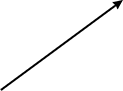
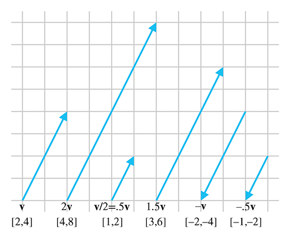
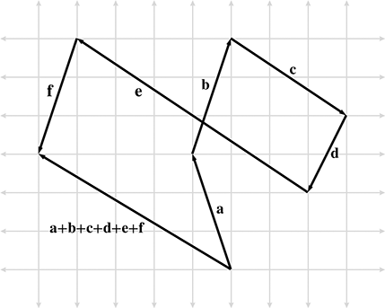
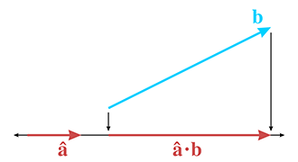
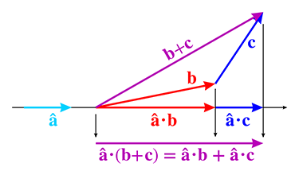
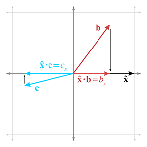
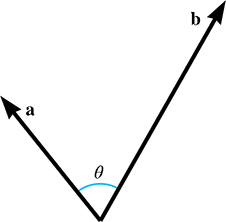
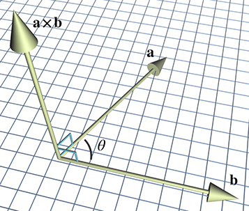
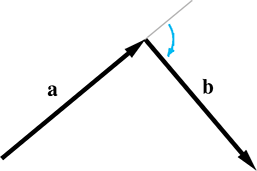
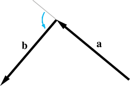

[<< Cartesian Coordinate Systems](cartesianspace.html)

[Contents](./)

[Multiple Coordinate Spaces >>](multiplespaces.html)

Chapter 2 

Vectors

Yellow fever vaccine should be administered  
10 to 12 days before exposure to the vector.

— _The United States Dispensatory_ (1978)

Vectors are the formal mathematical entities we use to do 2D and 3D math. The word _vector_ has two distinct but related meanings. Mathematics books, especially those on linear algebra, tend to focus on a rather abstract definition, caring about the numbers in a vector but not necessarily about the context or actual meaning of those numbers. Physics books, on the other hand, tend towards an interpretation that treats a vector as a geometric entity to the extent that they avoid any mention of the coordinates used to measure the vector, when possible. It's no wonder that you can sometimes find people from these two disciplines correcting one another on the finer points of “how vectors _really_ work.” Of course the reality is that they are both right,[1](#footnote_1) and to be proficient with 3D math, we need to understand both interpretations of vectors and how the two interpretations are related.

This chapter introduces the concept of vectors. It is divided into the following sections.

*   [Section 2.1](#math_definition) covers some of the basic mathematical properties of vectors.
*   [Section 2.2](#geometric_definition) gives a high-level introduction to the geometric properties of vectors.
*   [Section 2.3](#specifying) connects the mathematical definition with the geometric one and discusses how vectors work within the framework of Cartesian coordinates.
*   [Section 2.4](#vectors_vs_points) discusses the often confusing relationship between points and vectors and considers the rather philosophical question of why it is so difficult to make absolute measurements.
*   Sections [2.5](#vector_negation)–[2.12](#cross_product) discuss the fundamental calculations we can perform with vectors, considering both the algebra and geometric interpretations of each operation.
*   [Section 2.13](#vector_algebra_identities) presents a list of helpful vector algebra laws.

# 2.1Mathematical Definition of Vector,  
and Other Boring Stuff

To mathematicians, a vector is a list of numbers. Programmers will recognize the synonymous term _array_. Notice that the STL template array class in C++ is named vector, and the basic Java array container class is java.util.Vector. So mathematically, a vector is nothing more than an array of numbers.

Yawn… If this abstract definition of a vector doesn't inspire you, don't worry. Like many mathematical subjects, we must first introduce some terminology and notation before we can get to the “fun stuff.”

Mathematicians distinguish between vector and _scalar_ (pronounced “SKAY-lur”) quantities. You're already an expert on scalars—scalar is the technical term for an ordinary number. We use this term specifically when we wish to emphasize that a particular quantity is not a vector quantity. For example, as we will discuss shortly, “velocity” and “displacement” are vector quantities, whereas “speed” and “distance” are scalar quantities.

The _dimension_ of a vector tells how many numbers the vector contains. Vectors may be of any positive dimension, including one. In fact, a scalar can be considered a 1D vector. In this book, we primarily are interested in 2D, 3D, and (later) 4D vectors.

When writing a vector, mathematicians list the numbers surrounded by square brackets, for example, \[1,2,3\] . When we write a vector inline in a paragraph, we usually put commas between the numbers. When we write it out in an equation, the commas are often omitted. In either case, a vector written horizontally is called a _row vector_. Vectors are also frequently written vertically:

A 3D column vector

\[ 1 2 3 \] .

A vector written vertically is known as a _column vector_. This book uses both notations. For now, the distinction between row and column vectors won't matter. However, in [Section 4.1.7](matrixintro.html#matrix_times_vector) we discuss why in certain circumstances the distinction is critical.

When we wish to refer to the individual components in a vector, we use subscript notation. In math literature, integer indices are used to access the elements. For example v 1 refers to the first element in v . However, we are specifically interested in 2D, 3D, and 4D vectors rather than vectors of arbitrary dimension n , so we rarely use this notation. Instead, we use x and y to refer to the elements in a 2D vector; x , y , and z to refer to the elements in a 3D vector; and x , y , z , and w to refer to the elements in a 4D vector. This notation is shown in [Equation (2.1)](#vector_subscript_notation).

Vector subscript notation

(2.1) a \= \[ 1 2 \] a 1 \= a x \=1 a 2 \= a y \=2 b \= \[ 3 4 5 \] b 1 \= b x \=3 b 2 \= b y \=4 b 3 \= b z \=5 c \= \[ 6 7 8 9 \] c 1 \= c x \=6 c 2 \= c y \=7 c 3 \= c z \=8 c 4 \= c w \=9

Notice that the components of a 4D vector are not in alphabetical order. The fourth value is w . (Hey, they ran out of letters in the alphabet!)

Now let's talk about some important typeface conventions that are used in this book. As you know, _variables_ are placeholder symbols used to stand for unknown quantities. In 3D math, we work with scalar, vector, and (later) matrix quantities. In the same way that it's important in a C++ or Java program to specify what type of data is stored by a variable, it is important when working with vectors to be clear what type of data is represented by a particular variable. In this book, we use different fonts for variables of different types:

*   Scalar variables are represented by lowercase Roman or Greek letters in italics: a , b , x , y , z , θ , α , ω , γ .
*   Vector variables of any dimension are represented by lowercase letters in boldface: a , b , u , v , q , r .
*   Matrix variables are represented using uppercase letters in boldface: A , B , M , R .

Note that other authors may use different conventions. One common convention used frequently when writing vectors by hand, is to draw an arrow over the vector, for example, a→ .

Before we go any further, a bit of context is in order concerning the perspective that we are adopting about vectors. The branch of mathematics that deals primarily with vectors and matrices is called _linear algebra_, a subject that assumes the abstract definition given previously: a vector is an array of numbers. This highly generalized approach allows for the exploration of a large set of mathematical problems. In linear algebra, vectors and matrices of dimension n are used to solve a system of n linear equations for n unknowns, without knowing or caring what physical significance, if any, is attached to any of the numbers. This is certainly a fascinating and highly practical study, but it is not of primary interest to our investigation of 3D math. For 3D math, we are mostly concerned with the geometric interpretations of vectors and vector operations.

Our focus is geometric, so we omit many details and concepts of linear algebra that do not further our understanding of 2D or 3D geometry. Even though we occasionally discuss properties or operations for vectors of an arbitrary dimension n , we will usually focus on 2D, 3D, and (later) 4D vectors and matrices. Even when the numbers in a vector _do not_ have any physical significance, the ability to visualize the linear algebra operations is of some utility, so learning how to interpret the operations geometrically is useful even in nonphysical applications. Some more context about how the topics in this book fit into the bigger picture of linear algebra can be found in [Section 4.3](matrixintro.html#bigger_picture).

# 2.2Geometric Definition of Vector

Now that we have discussed what a vector is mathematically, let's look at a more geometric interpretation of vectors. Geometrically speaking, a vector is a directed line segment that has _magnitude_ and _direction_.

*   The magnitude of a vector is the length of the vector. A vector may have any nonnegative length.
*   The direction of a vector describes which way the vector is pointing in space. Note that “direction” is not exactly the same as “orientation,” a distinction we will reexamine in [Section 8.1](orient.html#terminology).

 Figure 2.1A 2D vector

Let's look at a vector. [Figure 2.1](#what_a_vector_looks_like) shows an illustration of a vector in 2D.

It looks like an arrow, right? This is the standard way to represent a vector graphically, since the two defining characteristics of a vector are captured: its magnitude and direction.

We sometimes refer to the _head_ and _tail_ of a vector. As shown in [Figure 2.2](#vector_head_tail), the head is the end of the vector with the arrowhead on it (where the vector “ends”), and the tail is the other end (where the vector “starts”).

Figure 2.2A vector has a head and a tail

_Where_ is this vector? Actually, that is not an appropriate question. Vectors do not have position, only magnitude and direction. This may sound impossible, but many quantities we deal with on a daily basis have magnitude and direction, but no position. Consider how the two statements below could make sense, regardless of the location where they are applied.

*   Displacement. “Take three steps forward.” This sentence seems to be all about positions, but the actual quantity used in the sentence is a relative displacement and does not have an absolute position. This relative displacement consists of a magnitude (3 steps) and a direction (forward), so it could be represented by a vector.
*   Velocity. “I am traveling northeast at 50 mph.” This sentence describes a quantity that has magnitude (50 mph) and direction (northeast), but no position. The concept of “northeast at 50 mph” can be represented by a vector.

Notice that _displacement_ and _velocity_ are technically different from the terms _distance_ and _speed_. Displacement and velocity are vector quantities and therefore entail a direction, whereas distance and speed are scalar quantities that do not specify a direction. More specifically, the scalar quantity distance is the magnitude of the vector quantity displacement, and the scalar quantity speed is the magnitude of the vector quantity velocity.

Because vectors are used to express displacements and relative differences between things, they can describe relative positions. (“My house is 3 blocks east of here.”) However, you should not think of a vector as having an absolute position itself, instead, remember that it is describing the displacement from one position to another, in this case from “here” to “my house.” (More on relative versus absolute position in [Section 2.4.1](#relative_position).) To help enforce this, when you imagine a vector, picture an arrow. Remember that the length and direction of this arrow are significant, but not the position.

Since vectors do not have a position, we can represent them on a diagram anywhere we choose, provided that the length and direction of the vector are represented correctly. We often use this fact to our advantage by sliding the vector around into a meaningful location on a diagram.

Now that we have the big picture about vectors from a mathematical and geometric perspective, let's learn how to work with vectors in the Cartesian coordinate system.

# 2.3Specifying Vectors with Cartesian Coordinates

When we use Cartesian coordinates to describe vectors, each coordinate measures a _signed displacement_ in the corresponding dimension. For example, in 2D, we list the displacement parallel to the x \-axis, and the displacement parallel to the y \-axis, as illustrated in [Figure 2.3](#measuring_vector).

Figure 2.3 Vectors are specified by giving the signed displacement in each dimension.

[Figure 2.4](#2d_labeled_vectors) shows several 2D vectors and their values. Notice that the position of each vector on the diagram is irrelevant. (The axes are conspicuously absent to emphasize this fact, although we do assume the standard convention of +x pointing to the right and +y pointing up.) For example, two of the vectors in [Figure 2.4](#2d_labeled_vectors) have the value \[1.5,1\] , but they are not in the same place on the diagram.

Figure 2.4 Examples of 2D vectors and their values

3D vectors are a simple extension of 2D vectors. A 3D vector contains three numbers, which measure the signed displacements in the x , y , and z directions, just as you'd expect.

We are focusing on Cartesian coordinates for now, but they are not the only way to describe vectors mathematically. _Polar coordinates_ are also common, especially in physics textbooks. Polar coordinates are the subject of [Chapter 7](polarspace.html).

## 2.3.1Vector as a Sequence of Displacements

One helpful way to think about the displacement described by a vector is to break out the vector into its axially aligned components. When these axially aligned displacements are combined, they cumulatively define the displacement defined by the vector as a whole.

Figure 2.5 Interpreting a vector as a sequence of displacements

For example, the 3D vector \[1,−3,4\] represents a single displacement, but we can visualize this displacement as moving 1 unit to the right, 3 units down, and then 4 units forward. (Assume our convention that +x , +y , and +z point right, up, and forward, respectively. Also note that we do not “turn” between steps, so “forward” is always parallel to +z .) This displacement is illustrated in [Figure 2.5](#3d_sequence_of_displacements).

The order in which we perform the steps is not important; we could move 4 units forward, 3 units down, and then 1 unit to the right, and we would have displaced by the same total amount. The different orderings correspond to different routes along the axially aligned bounding box containing the vector. [Section 2.7.2](#vector_addition_geometry) mathematically verifies this geometric intuition.

## 2.3.2The Zero Vector

For any given vector dimension, there is a special vector, known as the _zero vector_, that has zeroes in every position. For example, the 3D zero vector is \[0,0,0\] . We denote a zero vector of any dimension using a boldface zero:  0 . In other words,

The zero vector

0 \= \[00 ⋮ 0\] .

The zero vector is special because it is the only vector with a magnitude of zero. All other vectors have a positive magnitude. The zero vector is also unique because it is the only vector that does not have a direction.

Since the zero vector doesn't have a direction or length, we don't draw it as an arrow like we do for other vectors. Instead, we depict the zero vector as a dot. But don't let this make you think of the zero vector as a “point” because a vector does not define a location. Instead, think of the zero vector as a way to express the concept of “no displacement,” much as the scalar zero stands for the concept of “no quantity.”

Like the scalar zero you know, the zero vector of a given dimension is the _additive identity_ for the set of vectors of that dimension. Try to take yourself back to your algebra class, and retrieve from the depths of your memory the concept of the additive identity: for any set of elements, the additive identity of the set is the element x such that for all y in the set, y+x\=y .[2](#footnote_2) In other words, when we add the zero vector to any other vector, we get that vector: 0 + a \= a . [Section 2.7](#vector_addition) deals with vector addition.

# 2.4Vectors versus Points

Recall that a “point” has a location but no real size or thickness. In this chapter, we have learned how a “vector” has magnitude and direction, but no position. So “points” and “vectors” have different purposes, conceptually: a “point” specifies a position, and a “vector” specifies a displacement.

But now examine [Figure 2.6](#locating_point_vs_measuring_vector), which compares an illustration from [Chapter 1](cartesianspace.html) ([Figure 1.8](cartesianspace.html#2d_locating_points)), showing how 2D points are located, with a figure from earlier in this chapter ([Figure 2.3](#measuring_vector)), showing how 2D vectors are specified. It seems that there is a strong relationship between points and vectors. This section examines this important relationship.

Figure 2.6Locating points versus specifying vectors

## 2.4.1Relative Position

[Section 2.2](#geometric_definition) discussed the fact that because vectors can describe displacements, they can describe relative positions. The idea of a relative position is fairly straightforward: the position of something is specified by describing where it is in relation to some other, known location.

This begs the questions: Where are these “known” locations? What is an “absolute” position? It is surprising to realize that there is no such thing! Every attempt to describe a position requires that we describe it relative to something else. Any description of a position is meaningful only in the context of some (typically “larger”) reference frame. Theoretically, we could establish a reference frame encompassing everything in existence and select a point to be the “origin” of this space, thus defining the “absolute” coordinate space. However, even if such an absolute coordinate space were possible, it would not be practical. Luckily for us, absolute positions in the universe aren't important. Do you know _your_ precise position in the universe right now? We don't know ours, either.[3](#footnote_3)

## 2.4.2The Relationship between Points and Vectors

Vectors are used to describe displacements, and therefore they can describe relative positions. Points are used to specify positions. But we have just established in [Section 2.4.1](#relative_position) that _any_ method of specifying a position must be relative. Therefore, we must conclude that points are relative as well—they are relative to the origin of the coordinate system used to specify their coordinates. This leads us to the relationship between points and vectors.

[Figure 2.7](#2d_vector_vs_point) illustrates how the point (x,y) is related to the vector \[x,y\] , given arbitrary values for x and y .

Figure 2.7 The relationship between points and vectors

As you can see, if we start at the origin and move by the amount specified by the vector \[x,y\] , we will end up at the location described by the point (x,y) . Another way of saying this is that the vector \[x,y\] gives the displacement from the origin to the point (x,y) .

This may seem obvious, but it is important to understand that points and vectors are conceptually distinct, but mathematically equivalent. This confusion between “points” and “vectors” can be a stumbling block for beginners, but it needn't be a problem for you. When you think of a location, think of a point and visualize a dot. When you think of a displacement, think of a vector and visualize an arrow.

In many cases, displacements are from the origin, and so the distinction between points and vectors will be a fine one. However, we often deal with quantities that are not relative to the origin, or any other point for that matter. In these cases, it is important to visualize these quantities as an arrow rather than a point.

The math we develop in the following sections operates on “vectors” rather than “points.” Keep in mind that any point can be represented as a vector from the origin.

Actually, now would be a good time to warn you that a lot of people take a much firmer stance on this issue and would not approve of our cavalier attitude in treating vectors and points as mathematical equals.[4](#footnote_4) Such hard-liners will tell you, for example, that while you can add two vectors (yielding a third vector), and you can add a vector and a point (yielding a point), you cannot add two points together. We admit that there is some value in understanding these distinctions in certain circumstances. However, we have found that, especially when writing code that operates on points and vectors, adherence to these ethics results in programs that are almost always longer and never faster.[5](#footnote_5) Whether it makes the code cleaner or easier to understand is a highly subjective matter. Although this book does not use different notations for points and vectors, in general it will be clear whether a quantity is a point or a vector. We have tried to avoid presenting results with vectors and points mixed inappropriately, but for all the intermediate steps, we might not have been quite as scrupulous.

## 2.4.3It's All Relative

Before we move on to the vector operations, let's take a brief philosophical intermission. Spatial position is not the only aspect of our world for which we have difficulty establishing an “absolute” reference, and so we use relative measurements. There are also temperature, loudness, and velocity.

Temperature. One of the first attempts to make a standard temperature scale occurred about AD 170, when Galen proposed a standard “neutral” temperature made up of equal quantities of boiling water and ice. On either side of this temperature were four degrees of “hotter” and four degrees of “colder.” Sounds fairly primitive, right? In 1724, Gabriel Fahrenheit suggested a bit more precise system. He suggested that mercury be used as the liquid in a thermometer, and calibrated his scale using two reference points: the freezing point of water, and the temperature of a healthy human being. He called his scale the _Fahrenheit_ scale, and measurements were in °F. In 1745, Carolus Linnaeus of Uppsala, Sweden, suggested that things would be simpler if we made the scale range from 0 (at the freezing point of water) to 100 (water's boiling point), and called this scale the _centigrade_ scale. (This scale was later abandoned in favor of the _Celsius_ scale, which is technically different from centigrade in subtle ways that are not important here.) Notice that all of these scales are _relative_—they are based on the freezing point of water, which is an arbitrary (but highly practical) reference point. A temperature reading of x o C basically means “ x degrees hotter than the temperature at which water freezes.” It wasn't until 1848, with the invention of the Kelvin scale by Lord Kelvin, that mankind finally had an absolute temperature scale. 0 K is the coldest possible temperature, corresponding to −273 o C.

Loudness. Loudness is usually measured in _decibels_ (abbreviated dB). To be more precise, decibels are used to measure the _ratio_ of two power levels. If we have two power levels P1 and P2 , then the _difference in decibels_ between the two power levels is

10log 10 ⁡(P2 / P1)  dB .

So, if P2 is about twice the level of P1 , then the difference is about 3 dB. Notice that this is a relative system, providing a precise way to measure the _relative strength_ of two power levels, but not a way to assign a number to one power level. In other words, we haven't established any sort of absolute reference point. (It's also a logarithmic scale, but that isn't important here.) You may have used a mixer board, volume control knob, or digital audio program that measures volume in dB. Normally, there's an arbitrary point marked 0 dB, and then most of the readings have negative values. In other words, 0 dB is the loudest volume, and all other volume settings are softer.

None of these values are absolute—but how could they be? How could your digital audio program know the absolute loudness you will experience, which depends not only on the audio data, but also the volume setting on your computer, the volume knob on your amplifier, the power supplied by the amplifier to your speakers, the distance you are from the speakers, and so on.

Sometimes people describe how loud something is in terms of an absolute dB number. Following in the footsteps of Gabriel Fahrenheit, this scale uses a reference point based on the human body. “Absolute” dB numbers are actually relative to the threshold of hearing for a normal human.[6](#footnote_6) Because of this, it's actually possible to have an “absolute” dB reading that is negative. This simply means that the intensity is below the threshold where most people are able to hear it.

At this point, we should probably mention that there _is_ a way to devise an absolute scale for loudness, by measuring a physical quantity such as pressure, energy, or power, all of which have an absolute minimum value of zero. The point is that these absolute systems aren't used in many cases—the relative system is the one that's the most useful.

Velocity. How fast are you moving right now? Perhaps you're sitting in a comfy chair, so you'd say that your speed was zero. Maybe you're in a car and so you might say something like 65 mph. (Hopefully someone _else_ is driving!) Actually, you are hurtling through space at almost 30 km _per second_! That's about the speed that Earth travels in order to make the 939-million-km trek around the sun each year. Of course, even this velocity is relative to the sun. Our solar system is moving around within the Milky Way galaxy. So then how fast are we actually moving, in absolute terms? Galileo told us back in the 17th century that this question doesn't have an answer—all velocity is relative.

Our difficulty in establishing absolute velocity is similar to the difficulty in establishing position. After all, velocity is displacement (difference between positions) over time. To establish an absolute velocity, we'd need to have some reference location that would “stay still” so that we could measure our displacement from that location. Unfortunately, everything in our universe seems to be orbiting something else.

# 2.5Negating a Vector

The previous sections have presented a high-level overview of vectors. The remainder of this chapter looks at specific mathematical operations we perform on vectors. For each operation, we first define the mathematical rules for performing the operation and then describe the geometric interpretations of the operation and give some practical uses for the operation.

The first operation we'd like to consider is that of vector negation. When discussing the zero vector, we asked you to recall from group theory the idea of the _additive identity_. Please go back to wherever it was in your brain that you found the additive identity, perhaps between the metaphorical couch cushions, or at the bottom of a box full of decade-old tax forms. Nearby, you will probably find a similarly discarded obvious-to-the-point-of-useless concept: the _additive inverse_. Let's dust it off. For any group, the additive inverse of x , denoted by −x , is the element that yields the additive identity (zero) when added to x . Put simply, x+(−x)\=0 . Another way of saying this is that elements in the group can be negated.

The negation operation can be applied to vectors. Every vector v has an additive inverse − v of the same dimension as v such that v +(− v )\= 0 . (We will learn how to add vectors in [Section 2.7](#vector_addition).)

## 2.5.1Official Linear Algebra Rules

Figure 2.8 Examples of vectors and their negatives. Notice that a vector and its negative are parallel and have the same magnitude, but point in opposite directions.

To negate a vector of any dimension, we simply negate each component of the vector. Stated formally,

Negating a vector

− \[a1a2 ⋮ a n−1 a n \] \= \[−a1−a2 ⋮ −a n−1 −a n \] .

Applying this to the specific cases of 2D, 3D, and 4D vectors, we have

Negating 2D, 3D, and 4D vectors

− \[ x y \] \= \[ −x −y \] ,− \[ x y z \] \= \[ −x −y −z \] ,− \[ x y z w \] \= \[ −x −y −z −w \] .

A few examples are

− \[ 4 −5 \] \= \[ −4 5 \] ,− \[ −1 0 3 \] \= \[ 1 0 −3 \] ,− \[ 1.34 −3 / 4 −5 π \] \= \[ −1.34 3 / 4 5 −π \] .

## 2.5.2Geometric Interpretation

Negating a vector results in a vector of the same magnitude but opposite direction, as shown in [Figure 2.8](#negating_vectors_example).

Remember, the position of a vector on a diagram is irrelevant—only the magnitude and direction are important.

# 2.6Vector Multiplication by a Scalar

Although we cannot add a vector and a scalar, we can multiply a vector by a scalar. The result is a vector that is parallel to the original vector, with a different length and possibly opposite direction.

## 2.6.1Official Linear Algebra Rules

Vector-times-scalar multiplication is straightforward; we simply multiply each component of the vector by the scalar. Stated formally,

Multiplying a vector by a scalar

k \[a1a2 ⋮ a n−1 a n \] \= \[a1a2 ⋮ a n−1 a n \] k\= \[ka1ka2 ⋮ ka n−1 ka n \] .

Applying this rule to 3D vectors, as an example, we get

Multiplying a 3D vector by a scalar

k \[ x y z \] \= \[ x y z \] k\= \[ kx ky kz \] .

Although the scalar and vector may be written in either order, most people choose to put the scalar on the left, preferring k v to v k .

A vector may also be divided by a nonzero scalar. This is equivalent to multiplying by the reciprocal of the scalar:

Dividing a 3D vector by a scalar

v k\= (1k) v \= \[ v x / k v y / k v z / k \] for 3D vector  v  and nonzero scalar  k .

Figure 2.9A 2D vector multiplied by various scalars

Some examples are

2 \[ 1 2 3 \] \= \[ 2 4 6 \] ,−3 \[ −5.4 0 \] \= \[ 16.2 0 \] , \[ 4.7 −6 8 \] / 2\= \[ 2.35 −3 4 \] .

Here are a few things to notice about multiplication of a vector by a scalar:

*   When we multiply a vector and a scalar, we do not use any multiplication symbol. The multiplication is signified by placing the two quantities side-by-side (usually with the vector on the right).
*   Scalar-times-vector multiplication and division both occur before any addition and subtraction. For example 3 a + b is the same as (3 a )+ b , not 3( a + b ) .
*   A scalar may not be divided by a vector, and a vector may not be divided by another vector.
*   Vector negation can be viewed as the special case of multiplying a vector by the scalar −1 .

## 2.6.2Geometric Interpretation

Geometrically, multiplying a vector by a scalar k has the effect of scaling the length by a factor of | k | . For example, to double the length of a vector we would multiply the vector by 2. If k<0 , then the direction of the vector is flipped. [Figure 2.9](#vector_times_scalar_examples_fig) illustrates a vector multiplied by several different scalars.

# 2.7Vector Addition and Subtraction

We can add and subtract two vectors, provided they are of the same dimension. The result is a vector quantity of the same dimension as the vector operands. We use the same notation for vector addition and subtraction as is used for addition and subtraction of scalars.

## 2.7.1Official Linear Algebra Rules

The linear algebra rules for vector addition are simple: to add two vectors, we add the corresponding components:

Adding two vectors

\[a1a2 ⋮ a n−1 a n \] + \[b1b2 ⋮ b n−1 b n \] \= \[a1+b1a2+b2 ⋮ a n−1 +b n−1 a n +b n \] .

Subtraction can be interpreted as adding the negative, so a − b \= a +(− b ) :

Subtracting two vectors

\[a1a2 ⋮ a n−1 a n \] − \[b1b2 ⋮ b n−1 b n \] \= \[a1a2 ⋮ a n−1 a n \] + (− \[b1b2 ⋮ b n−1 b n \] ) \= \[a1−b1a2−b2 ⋮ a n−1 −b n−1 a n −b n \] .

For example, given

a \= \[ 1 2 3 \] , b \= \[ 4 5 6 \] , c \= \[ 7 −3 0 \] ,

then

a + b \= \[ 1 2 3 \] + \[ 4 5 6 \] \= \[ 1+4 2+5 3+6 \] \= \[ 5 7 9 \] , a − b \= \[ 1 2 3 \] − \[ 4 5 6 \] \= \[ 1−4 2−5 3−6 \] \= \[ −3 −3 −3 \] , b + c − a \= \[ 4 5 6 \] + \[ 7 −3 0 \] − \[ 1 2 3 \] \= \[ 4+7−1 5+(−3)−2 6+0−3 \] \= \[ 10 0 3 \] .

A vector cannot be added or subtracted with a scalar, or with a vector of a different dimension. Also, just like addition and subtraction of scalars, vector addition is commutative,

a + b \= b + a ,

whereas vector subtraction is anticommutative,

a − b \=−( b − a ).

## 2.7.2Geometric Interpretation

Figure 2.102D vector addition and subtraction using the triangle rule.

We can add vectors a and b geometrically by positioning the vectors so that the head of a touches the tail of b and then drawing a vector from the tail of a to the head of b . In other words, if we start at a point and apply the displacements specified by a and then b , it's the same as if we had applied the single displacement a + b . This is known as the _triangle rule_ of vector addition. It also works for vector subtraction, as shown in [Figure 2.10](#triangle_rule).

[Figure 2.10](#triangle_rule) provides geometric evidence that vector addition is commutative but vector subtraction is not. Notice that the vector labeled a + b is identical to the vector labeled b + a , but the vectors d − c and c − d point in opposite directions because d − c \=−( c − d ) .

Figure 2.11Extending the triangle rule to more than two vectors

The triangle rule can be extended to more than two vectors. [Figure 2.11](#triangle_rule_multiple_vectors) shows how the triangle rule verifies something we stated in [Section 2.3.1](#series_of_displacements): a vector can be interpreted as a sequence of axially aligned displacements.

[Figure 2.12](#3d_sequence_of_displacements2) is a reproduction of [Figure 2.5](#3d_sequence_of_displacements), which shows how the vector \[1,−3,4\] may be interpreted as a displacement of 1 unit to the right, 3 units down, and then 4 units forward, and can be verified mathematically by using vector addition:

\[ 1 −3 4 \] \= \[ 1 0 0 \] + \[ 0 −3 0 \] + \[ 0 0 4 \] .

Figure 2.12Interpreting a vector as a sequence of displacements

This seems obvious, but this is a very powerful concept. We will use a similar technique in [Section 4.2](matrixintro.html#geometric_definition) to transform vectors from one coordinate space to another.

## 2.7.3Displacement Vector from One Point to Another

It is very common that we will need to compute the displacement from one point to another. In this case, we can use the triangle rule and vector subtraction. [Figure 2.13](#2d_vector_between_points) shows how the displacement vector from a to b can be computed by subtracting a from b .

Figure 2.13 Using 2D vector subtraction to compute the vector from point a to point b

As [Figure 2.13](#2d_vector_between_points) shows, to compute the vector from a to b , we interpret the points a and b as vectors from the origin, and then use the triangle rule. In fact, this is how vectors are defined in some texts: the subtraction of two points.

Notice that the vector subtraction b − a yields a vector _from a to b_ . It doesn't make any sense to simply find the vector “between two points,” since the language in this sentence does not specify a direction. We must always form a vector that goes _from_ one point _to_ another point.

# 2.8Vector Magnitude (Length)

As we have discussed, vectors have magnitude and direction. However, you might have noticed that neither the magnitude nor the direction is expressed explicitly in the vector (at least not when we use Cartesian coordinates). For example, the magnitude of the 2D vector \[3,4\] is neither 3 nor 4; it's 5. Since the magnitude of the vector is not expressed explicitly, we must compute it. The magnitude of a vector is also known as the _length_ or _norm_ of the vector.

## 2.8.1Official Linear Algebra Rules

In linear algebra, the magnitude of a vector is denoted by using double vertical bars surrounding the vector. This is similar to the single vertical bar notation used for the absolute value operation for scalars. This notation and the equation for computing the magnitude of a vector of arbitrary dimension n are shown in [Equation (2.2)](#vector_magnitude_nd):

Magnitude of a vector of arbitrary dimension

(2.2) ∥ v ∥ \=∑ i\=1 n v i 2\= v 1 2+ v 2 2+⋯+ v n−1 2+ v n 2.

Thus, the magnitude of a vector is the square root of the sum of the squares of the components of the vector. This sounds complicated, but the magnitude equations for 2D and 3D vectors are actually very simple:

Vector magnitude for 2D and 3D vectors

(2.3) ∥ v ∥ \= v x 2+ v y 2(for a 2D vector\\  v ), ∥ v ∥ \= v x 2+ v y 2+ v z 2(for a 3D vector\\  v ).

The magnitude of a vector is a nonnegative scalar quantity. An example of how to compute the magnitude of a 3D vector is

∥ \[ 5 −4 7 \] ∥ \=52+ (−4) 2+72\=25+16+49\=90≈9.4868.

Some books use a single bar notation to indicate vector magnitude:  | v |

One quick note to satisfy all you sticklers who already know about vector norms and at this moment are pointing your web browser to [gamemath.com](https://gamemath.com), looking for the email address for errata. The term _norm_ actually has a very general definition, and basically any equation that meets a certain set of criteria can call itself a norm. So to describe [Equation (2.2)](#vector_magnitude_nd) as _the_ equation for the vector norm is slightly misleading. To be more accurate, we should say that [Equation (2.2)](#vector_magnitude_nd) is the equation for the _2-norm_, which is one specific way to calculate a norm. The 2-norm belongs to a class of norms known as the _p \-norms_, and the p \-norm is not the only way to define a norm. Still, omitting this level of generality isn't too harmful of a delusion; because the 2-norm measures Euclidian distance, it is by far the most commonly used norm in geometric applications. It is also widely used in situations even where a geometric interpretation is not directly applicable. Readers interested in such exotica should check out [Exercise 15](#p_norm).

## 2.8.2Geometric Interpretation

Figure 2.14Geometric interpretation of the magnitude equation

Let's try to get a better understanding of why [Equation (2.3)](#vector_magnitude_2d) works. For any vector v in 2D, we can form a right triangle with v as the hypotenuse, as shown in [Figure 2.14](#pythagorean_theorem_vectors).

Notice that to be precise we had to put absolute value signs around the components v x and v y . The components of the vector may be negative, since they are _signed displacements_, but _length_ is always positive.

The Pythagorean theorem states that for any right triangle, the square of the length of the hypotenuse is equal to the sum of the squares of the lengths of the other two sides. Applying this theorem to [Figure 2.14](#pythagorean_theorem_vectors), we have

∥ v ∥ 2\= | v x | 2+ | v y | 2.

Since | x | 2\=x2 , we can omit the absolute value symbols:

∥ v ∥ 2\= v x 2+ v y 2.

Then, by taking the square root of both sides and simplifying, we get

∥ v ∥ 2\= v x 2+ v y 2, ∥ v ∥ \= v x 2+ v y 2,

which is the same as [Equation (2.3)](#vector_magnitude_2d). The proof of the magnitude equation in 3D is only slightly more complicated.

For any positive magnitude m , there are an infinite number of vectors of magnitude m . Since these vectors all have the same length but different directions, they form a circle when the tails are placed at the origin, as shown in [Figure 2.15](#infinite_vectors_with_same_magnitude).

Figure 2.15 For any positive magnitude, there are an infinite number of vectors with that magnitude

# 2.9Unit Vectors

For many vector quantities, we are concerned only with direction and not magnitude: “Which way am I facing?” “Which way is the surface oriented?” In these cases, it is often convenient to use unit vectors. A _unit vector_ is a vector that has a magnitude of one. Unit vectors are also known as _normalized vectors_.

Unit vectors are also sometimes simply called _normals_; however, a warning is in order concerning terminology. The word “normal” carries with it the connotation of “perpendicular.” When most people speak of a “normal” vector, they are usually referring to a vector that is perpendicular to something. For example, a _surface normal_ at a given point on an object is a vector that is perpendicular to the surface at that location. However, since the concept of perpendicular is related only to the direction of a vector and not its magnitude, in most cases you will find that unit vectors are used for normals instead of a vector of arbitrary length. When this book refers to a vector as a “normal,” it means “a unit vector perpendicular to something else.” This is common usage, but be warned that the word “normal” primarily means “perpendicular” and not “unit length.” Since it is so common for normals to be unit vectors, we will take care to call out any situation where a “normal” vector does not have unit length.

In summary, a “normalized” vector always has unit length, but a “normal” vector is a vector that is perpendicular to something and by convention usually has unit length.

## 2.9.1Official Linear Algebra Rules

Figure 2.16Normalizing vectors in 2D

For any nonzero vector v , we can compute a unit vector that points in the same direction as v . This process is known as _normalizing_ the vector. In this book we use a common notation of putting a hat symbol over unit vectors; for example, v ^ (pronounced “v hat”). To normalize a vector, we divide the vector by its magnitude:

Normalizing a vector

v ^ \= v ∥ v ∥ for any nonzero vector  v .

For example, to normalize the 2D vector \[12,−5\] ,

\[ 12 −5 \] ∥ \[ 12 −5 \] ∥ \= \[ 12 −5 \] 122+52\= \[ 12 −5 \] 169\= \[ 12 −5 \] 13\= \[ 1213 −5 13 \] ≈ \[ 0.923 −0.385 \] .

The zero vector cannot be normalized. Mathematically, this is not allowed because it would result in division by zero. Geometrically, it makes sense because the zero vector does not define a direction—if we normalized the zero vector, in what direction should the resulting vector point?

## 2.9.2Geometric Interpretation

In 2D, if we draw a unit vector with the tail at the origin, the head of the vector will touch a unit circle centered at the origin. (A unit circle has a radius of 1.) In 3D, unit vectors touch the surface of a unit sphere. [Figure 2.16](#normalized_vectors) shows several 2D vectors of arbitrary length in gray, beneath their normalized counterparts in black.

Notice that normalizing a vector makes some vectors shorter (if their length was greater than 1) and some vectors longer (if their length was less than 1).

# 2.10The Distance Formula

We are now prepared to derive one of the oldest and most fundamental formulas in computational geometry: the distance formula. This formula is used to compute the distance between two points.

First, let's define distance as the length of the line segment between the two points. Since a vector is a directed line segment, geometrically it makes sense that the distance between the two points would be equal to the length of a vector from one point to the other. Let's derive the distance formula in 3D. First, we will compute the vector d from a to b . We learned how to do this in 2D in [Section 2.7.3](#vector_between_points). In 3D, we use

d \= b − a \= \[ b x − a x b y − a y b z − a z \] .

The distance between a and b is equal to the length of the vector d , which we computed in [Section 2.8](#vector_magnitude):

distance ( a , b ) \= ∥ d ∥ \= d x 2+ d y 2+ d z 2.

Substituting for d , we get

The 3D distance formula

distance ( a , b ) \= ∥ b − a ∥ \=( b x − a x )2+( b y − a y )2+( b z − a z )2.

Thus, we have derived the distance formula in 3D. The 2D equation is even simpler:

The 2D distance formula

distance ( a , b ) \= ∥ b − a ∥ \=( b x − a x )2+( b y − a y )2.

Let's look at an example in 2D:

distance ( \[ 5 0 \] , \[ −1 8 \] ) \=(−1−5)2+(8−0)2\=(−6)2+82\=100\=10.

Notice that it doesn't matter which point we call a and which point we call b . If we define d to be the vector from b to a instead of from a to b , we will derive a slightly different, but mathematically equivalent, equation.

# 2.11Vector Dot Product

[Section 2.6](#vector_times_scalar) showed how to multiply a vector by a scalar. We can also multiply two vectors together. There are two types of vector products. The first vector product is the _dot product_ (also known as the _inner product_), the subject of this section. We talk about the other vector product, the _cross product_, in [Section 2.12](#cross_product).

The dot product is ubiquitous in video game programming, useful in everything from graphics, to simulation, to AI. Following the pattern we used for the operations, we first discuss the algebraic rules for computing dot products in [Section 2.11.1](#dot_product_math), followed by some geometric interpretations in [Section 2.11.2](#dot_product_geometry).

The dot product formula is one of the few formulas in this book worth memorizing. First of all, it's really easy to memorize. Also, if you understand what the dot product does, the formula makes sense. Furthermore, the dot product has important relationships to many other operations, such as matrix multiplication, convolution of signals, statistical correlations, and Fourier transforms. Understanding the formula will make these relationships more apparent.

Even more important than memorizing a formula is to get an intuitive grasp for what the dot product _does_. If there is only enough space in your brain for either the formula or the geometric definition, then we recommend internalizing the geometry, and getting the formula tattooed on your hand. You need to understand the geometric definition in order to _use_ the dot product. When programming in computer languages such as C++, HLSL, or even Matlab and Maple, you won't need to know the formula anyway, since you will usually tell the computer to do a dot product calculation not by typing in the formula, but by invoking a high-level function or overloaded operator. Furthermore, the geometric definition of the dot product does not assume any particular coordinate frame or even the use of Cartesian coordinates.

## 2.11.1Official Linear Algebra Rules

The name “dot product” comes from the dot symbol used in the notation: a ⋅ b . Just like scalar-times-vector multiplication, the vector dot product is performed before addition and subtraction, unless parentheses are used to override this default order of operations. Note that although we usually omit the multiplication symbol when multiplying two scalars or a scalar and a vector, we must not omit the dot symbol when performing a vector dot product. If you ever see two vectors placed side-by-side with no symbol in between, interpret this according to the rules of _matrix multiplication_, which we discuss in [Chapter 4](matrixintro.html).[7](#footnote_7)

The dot product of two vectors is the sum of the products of corresponding components, resulting in a _scalar_:

Vector dot product

\[a1a2 ⋮ a n−1 a n \] ⋅ \[b1b2 ⋮ b n−1 b n \] \=a1b1+a2b2+⋯+a n−1 b n−1 +anbn.

This can be expressed succinctly by using the summation notation

Dot product using summation notation

a ⋅ b \=∑ i\=1 n a i b i .

Applying these rules to the 2D and 3D cases yields

2D and 3D dot products

a ⋅ b \= a x b x + a y b y ( a  and  b  are 2D vectors), a ⋅ b \= a x b x + a y b y + a z b z ( a  and  b  are 3D vectors).

Examples of the dot product in 2D and 3D are

\[ 4 6 \] ⋅ \[ −3 7 \] \=(4)(−3)+(6)(7)\=30, \[ 3 −2 7 \] ⋅ \[ 0 4 −1 \] \=(3)(0)+(−2)(4)+(7)(−1)\=−15.

It is obvious from inspection of the equations that vector dot product is commutative: a ⋅ b \= b ⋅ a . More vector algebra laws concerning the dot product are given in [Section 2.13](#vector_algebra_identities).

## 2.11.2Geometric Interpretation

Now let's discuss the more important aspect of the dot product: what it means geometrically. It would be difficult to make too big of a deal out of the dot product, as it is fundamental to almost every aspect of 3D math. Because of its supreme importance, we're going to dwell on it a bit. We'll discuss two slightly different ways of thinking about this operation geometrically; since they are really equivalent, you may or may not think one interpretation or the other is “more fundamental,” or perhaps you may think we are being redundant and wasting your time. You might especially think this if you already have some exposure to the dot product, but please indulge us.

The first geometric definition to present is perhaps the less common of the two, but in agreement with the advice of Dray and Manogue [\[1\]](#reference_1), we believe it's actually the more useful. The interpretation we first consider is that of the dot product performing a _projection_.

Assume for the moment that a ^ is a unit vector, and b is a vector of any length. Now take b and _project_ it onto a line parallel to a ^ , as in [Figure 2.17](#dot_product_project).

Figure 2.17The dot product as a projection

(Remember that vectors are displacements and do not have a fixed position, so we are free to move them around on a diagram anywhere we wish.) We can define the dot product a ^ ⋅ b as the signed length of the projection of b onto this line. The term “projection” has a few different technical meanings (see [Section 5.3](matrixtransforms.html#orthographic_projection)) and we won't bother attempting a formal definition here.[8](#footnote_8) You can think of the projection of b onto a ^ as the “shadow” that b casts on a ^ when the rays of light are perpendicular to a ^ .

We have drawn the projections as arrows, but remember that the result of a dot product is a scalar, not a vector. Still, when you first learned about negative numbers, your teacher probably depicted numbers as arrows on a number line, to emphasize their sign, just as we have. After all, a scalar is a perfectly valid one-dimensional vector.

What does it mean for the dot product to measure a _signed_ length? It means the value will be negative when the projection of b points in the opposite direction from a ^ , and the projection has zero length (it is a single point) when a ^ and b are perpendicular. These cases are illustrated in [Figure 2.18](#dot_product_project_signs).

Figure 2.18Sign of the dot product

In other words, the sign of the dot product can give us a rough classification of the relative directions of the two vectors. Imagine a line (in 2D) or plane (in 3D) perpendicular to the vector a ^ . The sign of the dot product a ^ ⋅ b tells us which half-space b lies in. This is illustrated in [Figure 2.19](#dot_product_signs).

Figure 2.19 The sign of the dot product gives a rough classification of the relative orientation of two vectors.

Next, consider what happens when we scale b by some factor k . As shown in [Figure 2.20](#dot_product_project_kb), the length of the projection (and thus the value of the dot product) increases by the same factor. The two triangles have equal interior angles and thus are similar. Since the hypotenuse on the right is longer than the hypotenuse on the left by a factor of k , by the properties of similar triangles, the base on the right is also longer by a factor of k .

Figure 2.20Scaling one operand of the dot product

Let's state this fact algebraically and prove it by using the formula:

Dot product is associative with multiplication by a scalar

a ^ ⋅(k b )\= a x (k b x )+ a y (k b y )+ a z (k b z )\=k( a x b x + a y b y + a z b z )\=k( a ^ ⋅ b ).

The expanded scalar math in the middle uses three dimensions as our example, but the vector notation at either end of the equation applies for vectors of any dimension.

We've seen what happens when we scale b : the length of its projection onto a ^ increases along with the value of the dot product. What if we scale a ? The algebraic argument we just made can be used to show that the value of the dot product scales with the length of a , just like it does when we scale b . In other words,

Dot product is associative with multiplication by a scalar for either vector

(k a )⋅ b \=k( a ⋅ b )\= a ⋅(k b ).

So scaling a scales the numeric value of the dot product. However, this scale has no affect geometrically on the length of the projection of b onto a . Now that we know what happens if we scale either a or b , we can write our geometric definition without any assumptions about the length of the vectors.

Dot Product as Projection

The dot product a ⋅ b is equal to the signed length of the projection of b onto any line parallel to a , multiplied by the length of a .

As we continue to examine the properties of the dot product, some will be easiest to illustrate geometrically when either a , or both a and b , are unit vectors. Because we have shown that scaling either a or b directly scales the value of the dot product, it will be easy to generalize our results after we have obtained them. Furthermore, in the algebraic arguments that accompany each geometric argument, unit vector assumptions won't be necessary. Remember that we put hats on top of vectors that are assumed to have unit length.

You may well wonder why the dot product measures the projection of the second operand onto the first, and not the other way around. When the two vectors a ^ and b ^ are unit vectors, we can easily make a geometric argument that the projection of a ^ onto b ^ has the same length as the projection of b ^ onto a ^ . Consider [Figure 2.21](#dot_product_commutative). The two triangles have equal interior angles and thus are similar. Since a ^ and b ^ are corresponding sides and have the same length, the two triangles are reflections of each other.

Figure 2.21Dot product is commutative

We've already shown how scaling either vector will scale the dot product proportionally, so this result applies for a and b with arbitrary length. Furthermore, this geometric fact is also trivially verified by using the formula, which does not depend on the assumption that the vectors have equal length. Using two dimensions as our example this time,

a ⋅ b \= a x b x + a y b y \= b x a x + b y a y \= b ⋅ a .

Dot product is commutative

The next important property of the dot product is that it distributes over addition and subtraction, just like scalar multiplication. This time let's do the algebra before the geometry. When we say that the dot product “distributes,” that means that if one of the operands to the dot product is a sum, then we can take the dot product of the pieces individually, and then take their sum. Switching back to three dimensions for our example,

Dot product distributes over addition and subtraction

a ⋅( b + c )\= \[ a x a y a z \] ⋅ \[ b x + c x b y + c y b z + c z \] \= a x ( b x + c x )+ a y ( b y + c y )+ a z ( b z + c z )\= a x b x + a x c x + a y b y + a y c y + a z b z + a z c z \=( a x b x + a y b y + a z b z )+( a x c x + a y c y + a z c z )\= a ⋅ b + a ⋅ c .

By replacing c with − c , it's clear that the dot product distributes over vector subtraction just as it does for vector addition. [Figure 2.22](#dot_product_distributes) shows how the dot product distributes over addition.

Figure 2.22The dot product distributes over addition.

Now let's look at a special situation in which one of the vectors is the unit vector pointing in the +x direction, which we'll denote as x ^ . As shown in [Figure 2.23](#dot_product_onto_x), the signed length of the projection is simply the x \-coordinate of the original vector. In other words, taking the dot product of a vector with a cardinal axis “sifts” out the coordinate for that axis.

If we combine this “sifting” property of the dot product with the fact that it distributes over addition, which we have been able to show in purely geometric terms, we can see why the formula has to be what it is.

Figure 2.23 Taking the dot product with a cardinal axis sifts out the corresponding coordinate.

Because the dot product measures the length of a projection, it has an interesting relationship to the vector magnitude calculation. Remember that the vector magnitude is a scalar measuring the amount of displacement (the length) of the vector. The dot product also measures the amount of displacement, but only the displacement _in a particular direction_ is counted; perpendicular displacement is discarded by the projecting process. But what if we measure the displacement in the same direction that the vector is pointing? In this case, _all_ of the vector's displacement is in the direction being measured, so if we project a vector onto itself, the length of that projection is simply the magnitude of the vector. But remember that a ⋅ b is equal to the length of the projection of b onto a , scaled by ∥ a ∥ . If we dot a vector with itself, such as v ⋅ v , we get the length of the projection, which is ∥ v ∥ , times the length of the vector we are projecting onto, which is also ∥ v ∥ . In other words,

Relationship between vector magnitude and the dot product

v ⋅ v \= ∥ v ∥ 2, ∥ v ∥ \= v ⋅ v .

Before we switch to the second interpretation of the dot product, let's check out one more very common use of the dot product as a projection. Assume once more that a ^ is a unit vector and b has arbitrary length. Using the dot product, it's possible to separate b into two values, b ∥ and b ⊥ (read “ b parallel” and “ b perp”), which are parallel and perpendicular to a ^ , respectively, such that b \= b ∥+ b ⊥ . [Figure 2.24](#project_vector) illustrates the geometry involved.

Figure 2.24Projecting one vector onto another

We've already established that the length of b ∥ will be equal to a ^ ⋅ b . But the dot product yields a scalar, and b ∥ is a vector, so we'll take the direction specified by the unit vector a ^ and scale it up:

b ∥\=( a ^ ⋅ b ) a ^ .

Once we know b ∥ , we can easily solve for b ⊥ :

b ⊥+ b ∥\= b , b ⊥\= b − b ∥, b ⊥\= b −( a ^ ⋅ b ) a ^ .

It's not too difficult to generalize these results to the case where a is not a unit vector.

In the rest of this book, we make use of these equations several times to separate a vector into components that are parallel and perpendicular to another vector.

Now let's examine the dot product through the lens of trigonometry. This is the more common geometric interpretation of the dot product, which places a bit more emphasis on the angle between the vectors. We've been thinking in terms of projections, so we haven't had much need for this angle. Less experienced and conscientious authors [\[2\]](#reference_2) might give you just one of the two important viewpoints, which is probably sufficient to interpret an equation that contains the dot product. However, a more valuable skill is to recognize situations for which the dot product is the correct tool for the job; sometimes it helps to have other interpretations pointed out, even if they are “obviously” equivalent to each other.

Figure 2.25 Interpreting the dot product by using the trigonometry of the right triangle

Consider the right triangle on the right-hand side of [Figure 2.25](#dot_product_adj_over_hyp). As the figure shows, the length of the hypotenuse is 1 (since b ^ is a unit vector) and the length of the base is equal to the dot product a ^ ⋅ b ^ . From elementary trig (which was reviewed in [Section 1.4.4](cartesianspace.html#trig_functions)), remember that the cosine of an angle is the ratio of the length of the adjacent leg divided by the length of the hypotenuse. Plugging in the values from [Figure 2.25](#dot_product_adj_over_hyp), we have

cos⁡θ\=adjacenthypotenuse\= a ^ ⋅ b ^ 1\= a ^ ⋅ b ^ .

In other words, the dot product of two unit vectors is equal to the cosine of the angle between them. This statement is true even if the right triangle in [Figure 2.25](#dot_product_adj_over_hyp) cannot be formed, when a ^ ⋅ b ^ ≤0 and θ\>90 o . Remember that the dot product of any vector with the vector x ^ \=\[1,0,0\] will simply extract the x \-coordinate of the vector. In fact, the x \-coordinate of a unit vector that has been rotated by an angle of θ from standard position is one way to _define_ the value of cos⁡θ . Review [Section 1.4.4](cartesianspace.html#trig_functions) if this isn't fresh in your memory.

By combining these ideas with the previous observation that scaling either vector scales the dot product by the same factor, we arrive at the general relationship between the dot product and the cosine.

Dot Product Relation to Intercepted Angle

The dot product of two vectors a and b is equal to the cosine of the angle θ between the vectors, multiplied by the lengths of the vectors (see [Figure 2.26](#dot_product)). Stated formally,

(2.4) a ⋅ b \= ∥ a ∥ ∥ b ∥ cos⁡θ.

Figure 2.26The dot product is related to the angle between two vectors.

What does it mean to measure the angle between two vectors in 3D? Any two vectors will always lie in a common plane (place them tail to tail to see this), and so we measure the angle in the plane that contains both vectors. If the vectors are parallel, the plane is not unique, but the angle is either 0 o or ±180 o , and it doesn't matter which plane we choose.

The dot product provides a way for us to compute the angle between two vectors. Solving [Equation (2.4)](#dot_product) for θ ,

Using the dot product to compute the angle between two vectors

(2.5)θ\=arccos⁡ ( a ⋅ b ∥ a ∥ ∥ b ∥ ) .

We can avoid the division in [Equation (2.5)](#dot_product_computing_angle) if we know that a and b are unit vectors. In this very common case, the denominator of [Equation (2.5)](#dot_product_computing_angle) is trivially 1, and we are left with

Computing the angle between two unit vectors

θ\=arccos⁡ ( a ^ ⋅ b ^ ) (assume  a ^  and  b ^  are unit vectors) .

If we do not need the exact value of θ , and need only a classification of the relative orientation of a and b , then we need only the _sign_ of the dot product. This is the same idea illustrated in [Figure 2.18](#dot_product_project_signs), only now we can relate it to the angle θ , as shown in [Table 2.1](#sign_of_dot_product).

**a ⋅ b**

**θ**

**Angle is**

**a and b are**

\>0

0 o ≤θ<90 o

acute

pointing mostly in the same direction

0

θ\=90 o

right

perpendicular

<0

90 o <θ≤180 o

obtuse

pointing mostly in the opposite direction

Table 2.1 The sign of the dot product can be used as a rough classification of the angle between two vectors.

Since the magnitude of the vectors does not affect the sign of the dot product, [Table 2.1](#sign_of_dot_product) applies regardless of the lengths of a and b . However, notice that if either a or b is the zero vector, then a ⋅ b \=0 . Thus, when we use the dot product to classify the relationship between two vectors, the dot product acts as if the zero vector is perpendicular to any other vector. As it turns out, the cross product behaves differently.

Let's summarize the dot product's geometric properties.

*   The dot product a ⋅ b measures the length of the projection of b onto a , multiplied by the length of a .
*   The dot product can be used to measure displacement in a particular direction.
*   The projection operation is closely related to the cosine function. The dot product a ⋅ b also is equal to ∥ a ∥ ∥ b ∥ cos⁡θ , where θ is the angle between the vectors.

We review the commutative and distributive properties of the dot product at the end of this chapter along with other algebraic properties of vector operations.

# 2.12Vector Cross Product

The other vector product, known as the _cross product_, can be applied only in 3D. Unlike the dot product, which yields a scalar and is commutative, the vector cross product yields a 3D vector and is not commutative.

## 2.12.1Official Linear Algebra Rules

Similar to the dot product, the term “cross” product comes from the symbol used in the notation a × b . We always write the cross symbol, rather than omitting it as we do with scalar multiplication. The equation for the cross product is

Cross product

\[ x1 y1 z1 \] × \[ x2 y2 z2 \] \= \[ y1z2−z1y2 z1x2−x1z2 x1y2−y1x2 \] .

For example,

\[ 1 3 4 \] × \[ 2 −5 8 \] \= \[ (3)(8)−(4)(−5) (4)(2)−(1)(8) (1)(−5)−(3)(2) \] \= \[ 24−(−20) 8−8 −5−6 \] \= \[ 44 0 −11 \] .

The cross product enjoys the same level of operator precedence as the dot product: multiplication occurs before addition and subtraction. When dot product and cross product are used together, the cross product takes precedence: a ⋅ b × c \= a ⋅( b × c ) . Luckily, there's an easy way to remember this: it's the only way it could work. The dot product returns a scalar, and so ( a ⋅ b )× c is undefined, since you cannot take the cross product of a scalar and a vector. The operation a ⋅( b × c ) is known as the _triple product_. We present some special properties of this computation in [Section 6.1](matrixmore.html#determinant).

As mentioned earlier, the vector cross product is not commutative. In fact, it is _anticommutative_: a × b \=−( b × a ) . The cross product is not associative, either. In general, ( a × b )× c ≠ a ×( b × c ) . More vector algebra laws concerning the cross product are given in [Section 2.13](#vector_algebra_identities).

## 2.12.2Geometric Interpretation

The cross product yields a vector that is perpendicular to the original two vectors, as illustrated in [Figure 2.27](#cross_product).

Figure 2.27Vector cross product

The length of a × b is equal to the product of the magnitudes of a and b and the sine of the angle between a and b :

The magnitude of the cross product is related to the sine of the angle between the vectors

∥ a × b ∥ \= ∥ a ∥ ∥ b ∥ sin⁡θ.

As it turns out, this is also equal to the area of the parallelogram formed with two sides a and b . Let's see if we can verify why this is true by using [Figure 2.28](#cross_product_area).

Figure 2.28A parallelogram with sides a and b

Figure 2.29Area of a parallelogram

First, from planar geometry, we know that the area of the parallelogram is bh , the product of the base and the height. (In [Figure 2.28](#cross_product_area), the base is b\= ∥ b ∥ .) We can verify this rule by “clipping” off a triangle from one end and moving it to the other end, forming a rectangle, as shown in [Figure 2.29](#parallelogram_area).

The area of a rectangle is given by its length and width. In this case, this area is the product bh . Since the area of the rectangle is equal to the area of the parallelogram, the area of the parallelogram must also be bh .

Returning to [Figure 2.28](#cross_product_area), let a and b be the lengths of a and b , respectively, and note that sin⁡θ\=h / a . Then

A\=bh\=b(asin⁡θ)\= ∥ a ∥ ∥ b ∥ sin⁡θ\= ∥ a × b ∥ .

If a and b are parallel, or if a or b is the zero vector, then a × b \= 0 . So the cross product interprets the zero vector as being parallel to every other vector. Notice that this is different from the dot product, which interprets the zero vector as being _perpendicular_ to every other vector. (Of course, it is ill-defined to describe the zero vector as being perpendicular or parallel to any vector, since the zero vector has no direction.)

We have stated that a × b is perpendicular to a and b . But there are two directions that are perpendicular to a and b —which of these two directions does a × b point? We can determine the direction of a × b by placing the tail of b at the head of a , and examining whether we make a clockwise or counterclockwise turn from a to b . In a left-handed coordinate system, a × b points towards you if the vectors a and b make a clockwise turn from your viewpoint, and away from you if a and b make a counterclockwise turn. In a right-handed coordinate system, the exact opposite occurs: if a and b make a counterclockwise turn, a × b points towards you, and if a and b make a clockwise turn, a × b points away from you.

**Clockwise turn**

**Counterclockwise turn**

In a left-handed coordinate system, a × b (not shown) points towards you. In a right-handed coordinate system, a × b points away from you.

In a left-handed coordinate system, a × b (not shown) points away from you. In a right-handed coordinate system, a × b points towards you.

Figure 2.30Determining clockwise versus counterclockwise turns

[Figure 2.30](#cross_product_cw_ccw) shows clockwise and counterclockwise turns. Notice that to make the clockwise or counterclockwise determination, we must align the

head of a with the tail of b . Compare this to [Figure 2.26](#dot_product), where the tails are touching. The tail-to-tail alignment shown in [Figure 2.26](#dot_product) is the correct way to position the vectors to measure the angle between them, but to judge whether the turn is clockwise or counterclockwise, the vectors should be aligned head-to-tail, as shown in [Figure 2.30](#cross_product_cw_ccw).

Let's apply this general rule to the specific case of the cardinal axes. Let x ^ , y ^ , and z ^ be unit vectors that point in the +x , +y , and +z directions, respectively. The results of taking the cross product of each pair of axes are

Cross product of the cardinal axes

x ^ y ^ z ^ , y ^ x ^ − z ^ , y ^ z ^ x ^ , z ^ y ^ − x ^ , z ^ x ^ y ^ , x ^ z ^ − y ^ .

You can also remember which way the cross product points by using your hand, similar to the way we distinguished between left-handed and right-handed coordinate spaces in [Section 1.3.3](cartesianspace.html#3d_hands). Since we're using a left-handed coordinate space in this book, we'll show how it's done using your left hand. Let's say you have two vectors, a and b , and you want to figure out which direction a × b points. Point your thumb in the direction of a , and your index finger (approximately) in the direction of b . If a and b are pointing in nearly the opposite direction, this may be difficult. Just make sure that if your thumb points exactly in the direction of a ; then your index finger is on the same side of a as the vector b is. With your fingers in this position, extend your third finger to be perpendicular to your thumb and index finger, similar to what we did in [Section 1.3.3](cartesianspace.html#3d_hands). Your third finger now points in the direction of a × b .

Of course, a similar trick works with your right hand for right-handed coordinate spaces.

One of the most important uses of the cross product is to create a vector that is perpendicular to a plane (see [Section 9.5](geomprims.html#planes)), triangle ([Section 9.6](geomprims.html#triangles)), or polygon ([Section 9.7](geomprims.html#polygons)).

# 2.13Linear Algebra Identities

The Greek philosopher Arcesilaus reportedly said, “Where you find the laws most numerous, there you will find also the greatest injustice.” Well, nobody said vector algebra was fair. [Table 2.2](#table_of_vector_algebra_identities) lists some vector algebra laws that are occasionally useful but should not be memorized. Several identities are obvious and are listed for the sake of completeness; all of them can be derived from the definitions given in earlier sections.

**Identity**

**Comments**

a + b \= b + a

Commutative property of vector addition

a − b \= a +(− b )

Definition of vector subtraction

( a + b )+ c \= a +( b + c )

Associative property of vector addition

s(t a )\=(st) a

Associative property of scalar multiplication

k( a + b )\=k a +k b

Scalar multiplication distributes over vector addition

∥ k a ∥ \= | k | ∥ a ∥

Multiplying a vector by a scalar scales the magnitude by a factor equal to the absolute value of the scalar

∥ a ∥ ≥0

The magnitude of a vector is nonnegative

∥ a ∥ 2+ ∥ b ∥ 2\= ∥ a + b ∥ 2

The Pythagorean theorem applied to vector addition.

∥ a ∥ + ∥ b ∥ ≥ ∥ a + b ∥

Triangle rule of vector addition. (No side can be longer than the sum of the other two sides.)

a ⋅ b \= b ⋅ a

Commutative property of dot product

∥ a ∥ \= a ⋅ a

Vector magnitude defined using dot product

k( a ⋅ b )\=(k a )⋅ b \= a ⋅(k b )

Associative property of scalar multiplication with dot product

a ⋅( b + c )\= a ⋅ b + a ⋅ c

Dot product distributes over vector addition and subtraction

a × a \= 0

The cross product of any vector with itself is the zero vector. (Because any vector is parallel with itself.)

a × b \=−( b × a )

Cross product is anticommutative.

a × b \=(− a )×(− b )

Negating both operands to the cross product results in the same vector.

k( a × b )\=(k a )× b \= a ×(k b )

Associative property of scalar multiplication with cross product.

a ×( b + c )\= a × b + a × c

Cross product distributes over vector addition and subtraction.

Table 2.2Table of vector algebra identities

# Exercises

1.  Let
    
    a \= \[ −3 8 \] , b \= \[ 4 0 5 \] , c \= \[ 16 −1 4 6 \] .
    
    1.  Identify a , b , and c , as row or column vectors, and give the dimension of each vector.
    2.  Compute b y + c w + a x + b z .
2.  Identify the quantities in each of the following sentences as scalar or vector. For vector quantities, give the magnitude and direction. (Note: some directions may be implicit.)
    1.  How much do you weigh?
    2.  Do you have any idea how fast you were going?
    3.  It's two blocks north of here.
    4.  We're cruising from Los Angeles to New York at 600 mph, at an altitude of 33,000 ft.
3.  Give the values of the following vectors. The darker grid lines represent one unit.
    
    
    
4.  Identify the following statements as true or false. If the statement is false, explain why.
    1.  The size of a vector in a diagram doesn't matter; we just need to draw it in the right place.
    2.  The displacement expressed by a vector can be visualized as a sequence of axially aligned displacements.
    3.  These axially aligned displacements from the previous question must occur in order.
    4.  The vector \[x,y\] gives the displacement from the point (x,y) to the origin.
5.  Evaluate the following vector expressions:
    1.  − \[ 3 7 \]
    2.  ∥ \[ −12 5 \] ∥
    3.  ∥ \[ 8 −3 1 / 2 \] ∥
    4.  3 \[ 4 −7 0 \]
    5.  \[ 4 5 \] / 2
6.  Normalize the following vectors:
    1.  \[ 12 5 \]
    2.  \[ 0 743.632 \]
    3.  \[ 8 −3 1 / 2 \]
    4.  \[ −12 3 −4 \]
    5.  \[ 1 1 1 1 \]
7.  Evaluate the following vector expressions:
    1.  \[ 7 −2 −3 \] + \[ 6 6 −4 \]
    2.  \[ 2 9 −1 \] + \[ −2 −9 1 \]
    3.  \[ 3 10 7 \] − \[ 8 −7 4 \]
    4.  \[ 4 5 −11 \] − \[ −4 −5 11 \]
    5.  3 \[ a b c \] −4 \[ 2 10 −6 \]
8.  Compute the distance between the following pairs of points:
    1.  \[ 10 6 \] , \[ −14 30 \]
    2.  \[ 0 0 \] , \[ −12 5 \]
    3.  \[ 3 10 7 \] , \[ 8 −7 4 \]
    4.  \[ −2 −4 9 \] , \[ 6 −7 9.5 \]
    5.  \[ 4 −4 −4 4 \] , \[ −6 6 6 −6 \]
9.  Evaluate the following vector expressions:
    1.  \[ 2 6 \] ⋅ \[ −3 8 \]
    2.  −7 \[ 1 2 \] ⋅ \[ 11 −4 \]
    3.  10+ \[ −5 1 3 \] ⋅ \[ 4 −13 9 \]
    4.  3 \[ −2 0 4 \] ⋅ ( \[ 8 −2 3 / 2 \] + \[ 0 9 7 \] )
10.  Given the two vectors
    
    v \= \[ 4 3 −1 \] , n ^ \= \[ 2 / 2 2 / 2 0 \] ,
    
    separate v into components that are perpendicular and parallel to n ^ . (As the notation implies, n ^ is a unit vector.)
11.  Use the geometric definition of the dot product
    
    a ⋅ b \= ∥ a ∥ ∥ b ∥ cos⁡ θ
    
    to prove the law of cosines.
12.  Use trigonometric identities and the algebraic definition of the dot product in 2D
    
    a ⋅ b \= a x b x + a y b y
    
    to prove the geometric interpretation of the dot product in 2D. (Hint: draw a diagram of the vectors and all angles involved.)
13.  Calculate a × b and b × a for the following vectors:
    1.  a \= \[ 0 −1 0 \] , b \= \[ 0 0 1 \]
    2.  a \= \[ −2 4 1 \] , b \= \[ 1 −2 −1 \]
    3.  a \= \[ 3 10 7 \] , b \= \[ 8 −7 4 \]
14.  Prove the equation for the magnitude of the cross product
    
    ∥ a × b ∥ \= ∥ a ∥ ∥ b ∥ sin⁡ θ .
    
    (Hint: make use of the geometric interpretation of the dot product and try to show how the left and right sides of the equation are equivalent, rather than trying to derive one side from the other.)
15.  [Section 2.8](#vector_magnitude) introduced the norm of a vector, namely, a scalar value associated with a given vector. However, the definition of the norm given in that section is not the only definition of a norm for a vector. In general, the _p \-norm_ of an n \-dimensional vector is defined as
    
    ∥ x ∥ p≡ (∑ i\=1 n | x i | p ) 1 / p .
    
    Some of the more common p \-norms include:
    
    *   The L1 norm, a.k.a. Taxicab norm ( p\=1 ):
        
        ∥ x ∥ 1≡∑ i\=1 n | x i | .
        
    *   The L2 norm, a.k.a. Euclidean norm ( p\=2 ). This is the most common and familiar norm, since it measures geometric length:
        
        ∥ x ∥ 2≡∑ i\=1 n x i 2.
        
    *   The infinity norm, a.k.a. Chebyshev norm ( p\=∞ ):
        
        ∥ x ∥ ∞≡max ( | x 1 | ,…, | x n | ) .
        
    
    Each of these norms can be thought of as a way to assigning a length or size to a vector. The Euclidean norm was discussed in [Section 2.8](#vector_magnitude). The Taxicab norm gets its name from how a taxicab would measure distance driving the streets of a city laid out in a grid (e.g., Cartesia from [Section 1.2.1](cartesianspace.html#2d_cartesia)). For example, a taxicab that drives 1 block east and 1 block north drives a total distance of 2 blocks, whereas a bird flying “as the crow flies” can fly in a straight line from start to finish and travel only 2 blocks (Euclidean norm). The Chebyshev norm is simply the absolute value of the vector component with the largest absolute value. An example of how this norm can be used is to consider the number of moves required to move a king in a game of chess from one square to another. The immediately surrounding squares require 1 move, the squares surrounding those require 2 moves, and so on.
    1.  (a)For each of the following find ∥ x ∥ 1 , ∥ x ∥ 2 , ∥ x ∥ 3 , and ∥ x ∥ ∞ :
        1.  (1) \[ 3 4 \]
        2.  (2) \[ 5 −12 \]
        3.  (3) \[ −2 10 −7 \]
        4.  (4) \[ 6 1 −9 \]
        5.  (5) \[ −2 −2 −2 −2 \]
    2.  \*(b)Draw the unit circle (i.e., the set of all vectors with ∥ x ∥ p\=1 ) centered at the origin for the L1 norm, L2 norm, and infinity norm.
16.  A man is boarding a plane. The airline has a rule that no carry-on item may be more than two feet long, two feet wide, or two feet tall. He has a very valuable sword that is three feet long, yet he is able to carry the sword on board with him.[9](#footnote_9) How is he able to do this? What is the longest possible item that he could carry on?
17.  Verify [Figure 2.11](#triangle_rule_multiple_vectors) numerically.
18.  Is the coordinate system used in [Figure 2.27](#cross_product) a left-handed or right-handed coordinate system?
19.  One common way of defining a bounding box for a 2D object is to specify a center point c and a _radius vector_ r , where each component of r is half the length of the side of the bounding box along the corresponding axis.
    1.  Describe the four corners p UpperLeft , p UpperRight , p LowerLeft , and p LowerRight .
    2.  Describe the eight corners of a bounding cube, extending this idea into 3D.
20.  A nonplayer character (NPC) is standing at location p with a forward direction of v .
    1.  How can the dot product be used to determine whether the point x is in front of or behind the NPC?
    2.  Let p \= \[ −3 4 \] and v \= \[ 5 −2 \] . For each of the following points x determine whether x is in front of or behind the NPC:
        1.  (1) x \= \[ 0 0 \]
        2.  (2) x \= \[ 1 6 \]
        3.  (3) x \= \[ −6 0 \]
        4.  (4) x \= \[ −4 7 \]
        5.  (5) x \= \[ 5 5 \]
        6.  (6) x \= \[ −3 0 \]
        7.  (7) x \= \[ −6 −3.5 \]
21.  Extending the concept from [Exercise 20](#npc_front_or_behind), consider the case where the NPC has a limited field of view (FOV). If the total FOV angle is ϕ , then the NPC can see to the left or right of its forward direction by a maximum angle of ϕ / 2 .
    1.  How can the dot product be used to determine whether the point x is visible to the NPC?
    2.  For each of the points x in [Exercise 20](#npc_front_or_behind) determine whether x is visible to the NPC if its FOV is 90 ∘ .
    3.  Suppose that the NPC's viewing distance is also limited to a maximum distance of 7 units. Which points are visible to the NPC then?
22.  Consider three points labeled a , b , and c in the xz plane of our left-handed coordinate system, which represent waypoints on an NPC's path.
    1.  How can the cross product be used to determine whether, when moving from a to b to c , the NPC makes a clockwise or counterclockwise turn at b , when viewing the path from above?
    2.  For each of the following sets of three points, determine whether the NPC is turning clockwise or counterclockwise when moving from a to b to c :
        1.  (1) a \= \[ 2 0 3 \] , b \= \[ −1 0 5 \] , c \= \[ −4 0 1 \]
        2.  (2) a \= \[ −3 0 −5 \] , b \= \[ 4 0 0 \] , c \= \[ 3 0 3 \]
        3.  (3) a \= \[ 1 0 4 \] , b \= \[ 7 0 −1 \] , c \= \[ −5 0 −6 \]
        4.  (4) a \= \[ −2 0 1 \] , b \= \[ 1 0 2 \] , c \= \[ 4 0 4 \]
23.  In the derivation of a matrix to scale along an arbitrary axis, we reach a step where we have the vector expression
    
    p ′\= p + (k−1) ( p ⋅ n ) n ,
    
    where n is an arbitrary vector \[ n x , n y , n z \] and k is an arbitrary scalar, but p is one of the cardinal axes. Plug in the value p \=\[1,0,0\] and simplify the resulting expression for p ′ . The answer is not a vector expression, but a single vector, where the scalar expressions for each coordinate have been simplified.
24.  A similar problem arises with the derivation of a matrix to rotate about an arbitrary axis. Given an arbitrary scalar θ and a vector n , substitute p \=\[1,0,0\] and simplify the value of p ′ in the expression
    
    p ′\=cos⁡θ ( p − ( p ⋅ n ) n ) +sin⁡θ ( n × p ) + ( p ⋅ n ) n .
    

What's our vector, Victor?

— Captain Oveur in _Airplane!_ (1980)

References

\[1\] Tevian Dray and Corinne A. Manogue.   “The Geometry of the Dot and Cross Products.”   _Journal of Online Mathematics and Its Applications_ 6.   [http://mathdl.maa.org/images/upload\_library/4/vol6/Dray2/Dray.pdf](http://mathdl.maa.org/images/upload_library/4/vol6/Dray2/Dray.pdf).

\[2\] Fletcher Dunn and Ian Parberry.   _3D Math Primer for Graphics and Game Development_, First edition.   Plano, TX: Wordware Publishing, 2002.

1.  But the perspective taken by physics textbooks is probably the one that's more appropriate for video game programming, at least in the beginning.
2.  The typeface used here is not intended to limit the discussion to the set of scalars. We are talking about elements in any set. Also, we request leniency from the abstract algebra sticklers for our use of the word “set,” when we should use “group.” But the latter term is not as widely understood, and we could only afford this footnote to dwell on the distinction.
3.  But we do know our position relative to the nearest Taco Bell.
4.  If you _are_ one of those people, then this is a warning of a slightly different sort!
5.  Indeed, sometimes slower, depending on your compiler.
6.  About 20 micropascals. However, this number varies with frequency. It also increases with age. One author remembers that when he was young, his father would never turn the radio in the car completely off, but rather would turn the volume down below the (father's) threshold of hearing. The son's threshold of hearing was just low enough for this to be irritating. Today the son owns his own car and car radio, and has realized, with some degree of embarrassment, that he _also_ often turns the radio volume down without turning it off. However, he offers in his defense that he turns it _all the way_ down, below _everyone's_ threshold of hearing. (The other author wishes to suggest that clearly even the term “normal human” is relative.)
7.  One notation you will probably bump up against is treating the dot product as an ordinary matrix multiplication, denoted by a T b if a and b are interpreted as column vectors, or a b T for row vectors. If none of this makes sense, don't worry, we will repeat it after we learn about matrix multiplication and row and column vectors in [Chapter 4](matrixintro.html).
8.  Thus shirking our traditional duties as mathematics authors to make intuitive concepts sound much more complicated than they are.
9.  Please ignore the fact that nowadays this could never happen for security reasons. You can think of this exercise as taking place in a Quentin Tarantino movie.