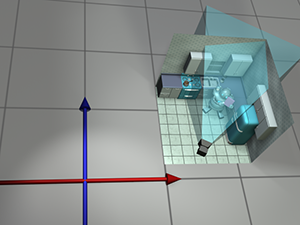
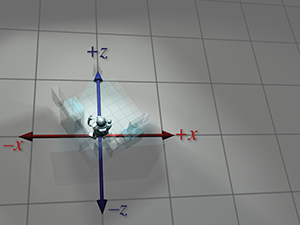

[<< Vectors](vectors.html)

[Contents](./)

[Introduction to Matrices >>](matrixintro.html)

Chapter 3 

Multiple Coordinate Spaces

The boundary lines have fallen for me in pleasant places;  
surely I have a delightful inheritance.

— Psalm 16:6 (New International Version)

[Chapter 1](cartesianspace.html) discussed how we can establish a coordinate space anywhere we want simply by picking a point to be the origin and deciding how we want the axes to be oriented. We usually don't make these decisions arbitrarily; we form coordinate spaces for specific reasons (one might say “different spaces for different cases”). This chapter gives some examples of common coordinate spaces that are used for graphics and games. We will then discuss how coordinate spaces are nested within other coordinate spaces.

This chapter introduces the idea of multiple coordinate systems. It is divided into five main sections.

*   [Section 3.1](#why) justifies the need for multiple coordinate systems.
*   [Section 3.2](#examples) introduces some common coordinate systems. The main concepts introduced are
    *   world space
    *   object space
    *   camera space
    *   upright space
*   [Section 3.3](#transformations) describes coordinate-space transformations.
    *   [Section 3.3.1](#two_perspectives) exposes a duality between two ways of thinking about coordinate-space transformations.
    *   [Section 3.3.2](#specifying_spaces) describes how to specify one coordinate system in terms of another.
    *   [Section 3.3.3](#basis_vectors) discusses the very important concept of _basis vectors_.
*   [Section 3.4](#nested_spaces) discusses nested coordinate spaces, commonly used for animating hierarchically segmented objects in 3D space.
*   [Section 3.5](#defense_of_upright_space) is a political campaign for more human readable code.

# 3.1Why Bother with Multiple Coordinate Spaces?

Why do we need more than one coordinate space? After all, any _one_ 3D coordinate system extends infinitely and thus contains all points in space. So we could just pick a coordinate space, declare it to be the “world” coordinate space, and all points could be located using this coordinate space. Wouldn't that be easier? In practice, the answer to this is “no.” Most people find it more convenient to use different coordinate spaces in different situations.

The reason multiple coordinate spaces are used is that certain pieces of information are known only in the context of a particular reference frame. It might be true that theoretically all points could be expressed using a single “world” coordinate system. However, for a certain point a , we may not know the coordinates of a in the “world” coordinate system. But we may be able to express a relative to some _other_ coordinate system.

For example, the residents of Cartesia (see [Section 1.2.1](cartesianspace.html#2d_cartesia)) use a map of their city with the origin centered quite sensibly at the center of town and the axes directed along the cardinal points of the compass. The residents of Dyslexia use a map of their city with the coordinates centered at an arbitrary point and the axes running in some arbitrary directions that probably seemed a good idea at the time. The citizens of both cities are quite happy with their respective maps, but the State Transportation Engineer assigned the task of running up a budget for the first highway between Cartesia and Dyslexia needs a map showing the details of both cities, which therefore introduces a third coordinate system that is superior to him, though not necessarily to anybody else. Each major point on both maps needs to be converted from the local coordinates of the respective city to the new coordinate system to make the new map.

The concept of multiple coordinate systems has historical precedent. While Aristotle (384–322 BCE), in his books _On the Heavens_ and _Physics_, proposed a geocentric universe with Earth at the origin, Aristarchus (ca. 310–230 BCE) proposed a heliocentric universe with the sun at the origin. So we can see that more than two millennia ago the choice of coordinate system was already a hot topic for discussion. The issue wasn't settled for another couple of millennia until Nicolaus Copernicus (1473–1543) observed in his book _De Revolutionibus Orbium Coelestium_ (_On the Revolutions of the Celestial Orbs_) that the orbits of the planets can be explained more simply in a heliocentric universe without all the mucking about with wheels within wheels in a geocentric universe.

In _Sand-Reckoner_, Archimedes (d. 212 BCE), perhaps motivated by some of the concepts introduced in [Section 1.1](cartesianspace.html#1d), developed a notation for writing down very large numbers—numbers much larger than anybody had ever counted at that time. Instead of choosing to count dead sheep, as in [Section 1.1](cartesianspace.html#1d), he chose to count the number of grains of sand it would take to fill the universe. (He estimated that it would take 8×10 63 grains of sand, but he did not, however, address the question of where he would get the sand.) In order to make the numbers larger, he chose not the geocentric universe generally accepted at the time, but Aristarchus' revolutionary new heliocentric universe. In a heliocentric universe, Earth orbits the sun, in which case the fact that the stars show no parallax means that they must be much farther away than Aristotle could ever have imagined. To make his life more difficult, Archimedes deliberately chose the coordinate system that would produce larger numbers. We will use the direct opposite of his approach. In creating our virtual universe inside the computer we will choose coordinate systems that make our lives _easier_, not_harder_.

In today's enlightened times, we are accustomed to hearing in the media about cultural relativism, which promotes the idea that it is incorrect to consider one culture or belief system or national agenda to be superior to another. It's not too great a leap of the imagination to extend this to what we might call “transformational relativism”—the contention that no place or orientation or coordinate system can be considered superior to others. In a certain sense that's true, but to paraphrase George Orwell in _Animal Farm_: “All coordinate systems are considered equal, but some are more equal than others.” Now let's look at some examples of common coordinate systems that you will meet in 3D graphics.

# 3.2Some Useful Coordinate Spaces

Different coordinate spaces are needed because some information is meaningful or available only in a particular context. In this section, we give some examples of common coordinate spaces.

## 3.2.1World Space

The authors wrote this book in 2011 from Chicago, Illinois, and Denton, Texas. More precisely, their locations were as shown in [Table 3.1](#authors_lat_lon).

**Author**

**City**

**Latitude**

**Longitude**

Fletcher

Chicago

41°57'

North

87°39'

West

Ian

Denton

33°11'

North

97°

West

Table 3.1Locations of authors, including a random offset introduced to protect us from our many obsessive stalker fans.

These latitude and longitude values express our “absolute” position in the world. You don't need to know where Denton, Chicago, Texas, Illinois, or even the United States is to use this information because the position is absolute. The origin, or (0,0) point, in the world was decided for historical reasons to be located on the equator at the same longitude as the Royal Observatory in the town of Greenwich, England.

(The astute reader will note that these coordinates are not Cartesian coordinates, but rather they are spherical coordinates—see [Section 7.3.2](polarspace.html#spherical_coordinates). That is not significant for this discussion. We live in a flat 2D world wrapped around a sphere, a concept that supposedly eluded most people until Christopher Columbus verified it experimentally.)

The _world coordinate system_ is a special coordinate system that establishes the “global” reference frame for all other coordinate systems to be specified. In other words, we can express the position of other coordinate spaces in terms of the world coordinate space, but we cannot express the world coordinate space in terms of any larger, outer coordinatespace.

In a nontechnical sense, the world coordinate system establishes the “biggest” coordinate system that we care about, which in most cases is not actually the entire world. For example, if we wanted to render a view of Cartesia, then for all practical purposes Cartesia would be “the world,” since we wouldn't care where Cartesia is located (or even if it exists at all). To find the optimal way to pack automobile parts into a box, we might write a physics simulation that “jiggles” a box full of parts around until they settle. In this case we confine our “world” to the inside of a box. So in different situations the world coordinate space will define a different “world.”

We've said that world coordinate space is used to describe absolute positions. We hope you pricked up your ears when you heard this, and you knew we weren't being entirely truthful. We already discussed in [Section 2.4.1](vectors.html#relative_position) that there's really no such thing as “absolute position.” In this book, we use the term “absolute” to mean “absolute with respect to the largest coordinate space we care about.” In other words, “absolute” to us actually means “expressed in the world coordinate space.”

The world coordinate space is also known as the _global_ or _universal_ coordinate space.

## 3.2.2Object Space

_Object space_ is the coordinate space associated with a particular object. Every object has its own independent object space. When an object moves or changes orientation, the object coordinate space associated with that object is carried along with it, so it moves or changes orientation too. For example, we all carry our own personal coordinate system around with us. If we were to ask you to “take one step forward,” we are giving you an instruction in your object space. (Please forgive us for referring to you as an object—you know what we mean.) We have no idea which way you will move in absolute terms. Some of you will move north, some south, and those wearing magnet boots on the side of a building might move upward! Concepts such as “forward,” “back,” “left,” and “right” are meaningful in object coordinate space. When someone gives you driving directions, sometimes you will be told to “turn left” and other times you will be told to “go east.” “Turn left” is a concept that is expressed in object space, and “go east” is expressed in world space.

Locations as well as directions can be specified in object space. For example, if I asked you where the muffler on your car was, you wouldn't tell me “Cambridge,[1](#footnote_1) MA,” even if you were Tom or Ray Magliozzi and your car was actually _in_ Cambridge. In this case, an answer expressed with a global perspective like this is totally useless;[2](#footnote_2) I want you to express the location of your muffler _in the object space of your car_.

In the context of graphics, object space is also known as _model_ space, since the coordinates for the vertices of a model are expressed in model space. Object space is also known as _body_ space, especially in physics contexts. It's also common to use a phrase like “with respect to the body axes,” which means the same thing as “expressed using body space coordinates.”

## 3.2.3Camera Space

One especially important example of an object space is _camera space_, which is the object space associated with the viewpoint used for rendering. In camera space, the camera is at the origin, with +x pointing to the right, +z pointing forward (into the screen, the direction the camera is facing), and +y pointing “up.” (Not “up” with respect to the world, “up” with respect to the top of the camera.) [Figure 3.1](#camera_space) shows a diagram of camera space.

Figure 3.1Camera space using left-handed conventions

These are the traditional left-handed conventions; others are common. In particular, the OpenGL tradition is right-handed, with −z pointing into the screen and +z coming out of the screen towards the viewer.

Note carefully the differences between camera space, which is a 3D space, and screen space, which is a 2D space. The mapping of camera-space coordinates to screen-space coordinates involves an operation known as _projection_. We'll discuss camera space in more detail, and this conversion process in particular, when we talk about coordinate spaces used in rendering in [Section 10.3](graphics.html#coordinate_spaces).

## 3.2.4Upright Space

Sometimes the right terminology is the key to unlocking a better understanding of a subject. Don Knuth coined the phrase “name and conquer” to refer to the common and important practice in mathematics and computer science of giving a name to a concept that is used frequently. The goal is to avoid repeating the details of this idea each time it is invoked, resulting in a reduction of clutter and an easier time focusing on the larger issue, for which the thing being named is only one part. It has been our experience that to conquer coordinate space transformations, when communicating either to human beings via words or to computers via code, it is helpful to associate with each object a new coordinate space, which we call the _upright_ coordinate space of the object. An object's upright space is, in a certain sense, “halfway” between world space and its object space. The axes of upright space are parallel with the axes of world space, but the origin of upright space is coincident with the origin of object space. [Figure 3.2](#object_inertial_world_spaces) illustrates this principle in 2D. (Notice that we have made an arbitrary choice to place the origin between the robot's feet, rather than at her center of mass.)

Figure 3.2Object, upright, and world space.

Figure 3.3 Conversion between world and upright space via translation; upright and object space are related by rotation

Why is upright space interesting? To transform a point between object space and upright space requires only rotation, and to transform a point between upright space and world space requires only a change of location, which is usually called a translation. Thinking about these two things independently is easier than trying to cope with them both at once. This is shown in [Figure 3.3](#object_inertial_world_translate_rotate). World space (on the left) is transformed into upright space (in the center) by translating the origin. To transform upright space into object space, we rotate the axes until they align with the object-space axes. In this example, the robot thinks that her y \-axis points from her feet to her head and that her x \-axis points to her left.[3](#footnote_3) We will return to this concept in [Section 3.3](#transformations).

The term “upright” is of our own invention and is not (yet!) a standard you are likely to find elsewhere. But it's a powerful concept in search of a good name. In physics, the term “center of mass coordinates” is sometimes used to describe coordinates expressed in the space that we are calling upright space. In the first edition of this book, we used the term “inertial space” to refer to this space, but we have changed it to avoid confusion with inertial reference frames in physics, which have some similar connotations but are different. We'll have a bit more philosophical pleas regarding upright space at the end of this chapter.

# 3.3Basis Vectors and Coordinate Space  
Transformations

We said that a major justification for the existence of more than one coordinate space is because certain positions or directions are known only in a particular coordinate space. Likewise, sometimes certain _questions_ can be answered only in particular coordinate spaces. When the question is best asked in one space, and the information we need in order to answer that question is known in a different space, we have a problem to solve.

For example, suppose that our robot is attempting to pick up a herring sandwich in our virtual world. We initially know the position of the sandwich and the position of the robot in _world coordinates_. World coordinates can be used to answer questions like “Is the sandwich north or south of me?” A different set of questions could be answered if we knew the position of the sandwich in the _object space_ of the robot—for example, “Is the sandwich in front of me or behind me?” “Which way should I turn to face the sandwich?” “Which way do I move my herring sandwich scoop to get in position to pick up the sandwich?” Notice that to decide how to manipulate the gears and circuits, the object-space coordinates are the relevant ones. Furthermore, any data provided by sensors would be expressed in object space. Of course, our own bodies work under similar principles. All of us are capable of seeing a tasty morsel in front of us and putting it into our mouths without knowing which direction is “north.” (And thank goodness, too, or many of us would starve to death.)

Further, suppose that we wish to render an image of the robot picking up the sandwich, and that the scene is illuminated by the light mounted on her shoulder. We know the position of the light within the robot's object space, but to properly light the scene, we must know the position of the light in world space.

These problems are two sides of the same coin: we know how to express a point in one coordinate space, and we need to express that point in some other coordinate space. The technical term for this computation is a _coordinate space transformation_. We need to _transform_ the position from world space to object space (in the example of the sandwich) or from object space to world space (in the example of the light). Notice that in this example, neither the sandwich nor the light really move, we are just expressing their locations in a different coordinate space.

The remainder of this section describes how to perform coordinate space transformations. Because this topic has such fundamental importance, and it can be so darn confusing, please allow us to present a very gradual transition from the warm fluffy high level to the cold hard math. [Section 3.3.1](#two_perspectives) considers transformations in the very context they are often encountered for beginning video game programmers: graphics. Using the most ridiculous example we could think of, we show the basic need of transformations, and also demonstrate the duality between two useful ways of visualizing transformations. [Section 3.3.2](#specifying_spaces) makes sure we are clear about what it means to specify a coordinate space in terms of another space. Finally, [Section 3.3.3](#basis_vectors) presents the key idea of _basis vectors_.

## 3.3.1Dual Perspectives

In our robot example, the discussion was phrased in a way such that the process of transforming a point didn't really “move” the point, we just changed our frame of reference and were able to describe the point using a different coordinate space. In fact, you might say that we really didn't transform the point, we transformed the coordinate space! But there's another way of looking at coordinate space transformations. Some people find it easier in certain situations to imagine the coordinate space staying still while the point moves from one place to another. When we develop the math for actually _calculating_ these transformations, this is the paradigm that is more natural. Coordinate space transforms are such an important tool, and the confusion that can arise because of an incomplete awareness of these two perspectives is so common that we will take a little bit of extra space to work through some examples.

Now for that ridiculous example. Let's say that we are working for a advertising agency that has just landed a big account with a food manufacturer. We are assigned to the project to make a slick computer-generated ad promoting one of their most popular items, _Herring Packets_, which are microwaveable herring food products for robots.

Figure 3.4 One serving contains 100%of a robot's recommended daily allowance of essential oils.

Of course, the client has a tendency to want changes made at the last minute, so we might need models of the product and robot in all possible positions and orientations. Our first attempt to accomplish this is to request, from the art department, the robot model and the product model in every possible configuration of positions and orientations. Unfortunately, they estimate that since this is an infinite amount, it will take all of eternity to produce this many assets, even after factoring in Moore's law and the fact that the product model is just a box. The director suggests increasing the art staff in order to achieve her vision, but unfortunately, after crunching the numbers, the producer discovers that this doesn't decrease the time required to finish the project.[4](#footnote_4) In fact, the company can afford resources to produce only _one_ robot model and _one_ box of microwaveable herring food product.

Although you may regret spending the past 60 seconds of your life reading the preceding paragraph, this example does illustrate the fundamental necessity of coordinate space transformations. It's also a relatively accurate depiction of the creative process. Time estimates are always padded, project managers will throw more people at a project in desperation, projects must be done by a certain date to meet a quarter, and, most pertinent to this book, artists will deliver only _one_ model, leaving it up to _us_ to move it around in the world.

The 3D model we get from the artist is a mathematical representation of a robot. This description likely includes control points, called _vertices_, and some sort of surface description, which tells how to connect the vertices together to form the surface of the object. Depending on what tools were used by the artist to create the model, the surface description might be a polygon mesh or a subdivision surface. We're not too concerned about the surface description here; what's important is that we can move the model around by moving its vertices around. Let's ignore for now the fact that the robot is an articulated creature, and assume we can only move it around in the world like a chess piece, but not animate it.

The artist who built our robot model decided (quite reasonably) to create her at the origin of the world space. This is depicted in [Figure 3.5](#robot_at_origin).

Figure 3.5 The robot model was created with the world origin at her feet.

To simplify the rest of this example, we're going to look at things from above. Although this is basically a 2D example, we're going to use our 3D conventions, ignoring the y \-axis for now. In this book the convention is for +z to point “forward” in object space and “north” in upright space, whereas +x points “right” in object space and “east” in upright space.

Figure 3.6Moving the model into position

For now, because the model is in its home position, object space and world space (and upright space) are all the same _by definition_. For all practical purposes, in the scene that the artist built containing only the model of the robot, world space _is_ object space.

Original  
position

Step 1.  
Rotate

Step 2.  
Translate

Figure 3.7Transforming the robot from object space to world space by rotating, then translating

Back to advertising. Our goal is to transform the vertices of the model from their “home” location to some new location (in our case, into a make-believe kitchen), according to the desired position and orientation of the robot based on the executive whims at that moment, as shown in [Figure 3.6](#robot_transform_origin_to_kitchen).

Let's talk a bit about how to accomplish this. We won't get too far into the mathematical details—that's what the rest of this chapter is for. Conceptually, to move the robot into position we first rotate her clockwise 120 o (or, as we'll learn in [Section 8.3](orient.html#euler_angles), by “heading left 120 o ”). Then we translate 18 ft east and 10 ft north, which according, to our conventions, is a 3D displacement of \[18,0,10\] . This is shown in [Figure 3.7](#robot_rotate_translate).

At this time, please allow us a brief digression to answer a question that some readers may be asking: “Do we have to rotate first, and then translate?” The answer to this question is basically “yes.” Although it may seem more natural to translate before rotating, it's usually easier to rotate first. Here's why. When we rotate the object first, the center of rotation is the origin. Rotation about the origin and translation are two primitive tools we have at our disposal, and each is easy. (Recall our motivation for introducing upright space in [Section 3.2.4](#upright_space).) If we rotate second, then that rotation will occur about a point that is _not_ the origin. Rotation about the origin is a linear transform, but rotation about any other point is an _affine_ transform. As we show in [Section 6.4.3](matrixmore.html#general_affine_transformations), to perform an affine transformation, we compose a sequence of primitive operations. For rotation about an arbitrary point, we translate the center of rotation to the origin, rotate about the origin, and then translate back. In other words, if we want to move the robot into place by translating first and rotating second, we likely go through the followingprocess:

Translating first and then rotating

1.  Translate.
2.  Rotate. Because we're rotating about a point that's not the origin, this is a three step process:
    1.  a.Translate the center of rotation to the origin. (This undoes step 1.)
    2.  b.Perform the rotation about the origin.
    3.  c.Translate to put the center of rotation in place.

Notice that steps 1 and 2a cancel each other out, and we're left with the two steps: rotate first, then translate.

Overhead view

Camera's view

Figure 3.8The layout of the camera and robot in the scene

So we've managed to get the robot model into the right place in the world. But to render it, we need to transform the vertices of the model into _camera space_. In other words, we need to express the coordinates of the vertices relative to the camera. For example, if a vertex is 9 ft in front of the camera and 3 ft to the right, then the z \- and x \-coordinates of that vertex in camera space would be 9 and 3, respectively. [Figure 3.8](#robot_ad_closeup_and_overhead) shows a particular shot we might want to capture. On the left, we see the layout of the shot from an external perspective, and on the right is what the camera sees.

It was easy to visualize transforming the model into world space. We literally “moved” it into place.[5](#footnote_5) But how do we transform from world space to camera space? The objects are both already “in place,” so where do we “move” them? For situations like this, it's helpful to think about transforming the coordinate space rather than transforming the objects, a technique we'll discuss in the next section. However, let's see if we can keep the coordinate space stationary, and still achieve the desired result by only “moving objects.”

When we transformed from object space to world space, we were able to do so because we imagined the robot starting out at the origin in world space. Of course, the robot never really was at the location in world space, but we imagined it. Since we transformed from object space to world space by moving the object, perhaps we can transform from world space to camera space by moving the world! Imagine taking the entire world, including the robot, the camera, and the kitchen, and moving everything around. Clearly, such operations wouldn't affect what the camera would “see,” because they don't change the relative relationship between the camera and the objects in the world. If we moved the world and camera together, such that the camera moved to the origin, then world-space coordinates and camera-space coordinates would be the same. [Figure 3.9](#robot_ad_transform_camera_and_world) shows the two-step process that we would use to achieve this.

Original  
position

Step 1.  
Translate

Step 2.  
Rotate

Figure 3.9Transforming _everything_ from world space to camera space by translating, then rotating

Notice that, in this case, it's easier to translate before rotating. That's because we want to rotate about the origin. Also, we use the _opposite_ translation and rotation amounts, compared to the camera's position and orientation. For example, in [Figure 3.9](#robot_ad_transform_camera_and_world) the coordinates of the camera are approximately (13.5,4,2) . (The grid lines represent 10 units.) So to move the camera to the origin, we translate everything by \[−13.5,−4,−2\] . The camera is facing roughly northeast and thus has a clockwise heading compared to north; a counterclockwise rotation is required to align camera-space axes with the world-space axes.

After picking up and moving around an entire robot in the first step, and then the _entire world_[6](#footnote_6) in the second step, we finally have the coordinates of the vertices in camera space, and can proceed with rendering. If all this imaginary heavy lifting has worn you out, don't worry; in just a moment we will discuss an alternate way to think about this process.

Before we move on, a few important notes about this example. First, the world-to-camera transform is usually done in a vertex shader; you can leave this to the graphics API if you are working at a high level and not writing your own shaders. Second, camera space isn't the “finish line” as far as the graphics pipeline is concerned. From camera space, vertices are transformed into _clip space_ and finally projected to _screen space_. These details are covered in [Section 10.2.3](graphics.html#view_frustum).

**Absolute perspective**

**Local perspective**

Robot  
object  
space

Robot  
upright  
space

World  
space

Camera  
upright  
space

Camera  
space

Figure 3.10 The same sequence of coordinate space transformations is viewed from two perspectives. On the left, it appears as if the objects are moving, and the coordinate axes are stationary. On the right, the objects appear to be stationary, and the coordinate space axes are transformed.

So we've seen how we can compute world-space coordinates from object-space coordinates by imagining moving the model from the origin to its position in the world. Then we could compute camera-space coordinates from world-space coordinates by shifting the entire world to put the camera at the origin. The point to emphasize is that the coordinate space used to describe the points remained constant (even if we called it different names at different times), while we imaged the points moving in space. A transformation thus interpreted is sometimes called an _active transformation_.

Alternatively, we can think of the same process as a _passive transformation_. In the passive paradigm, we imagine the points being stationary while we move the coordinate space used to describe those points. _In either case, the coordinates of the points are the same at each step._ It's all in how we choose to view the situation. Earlier, our perspective was fixed with the coordinate space, because we were thinking of the transformation in active terms. Now we show the dual perspective, which is fixed relative to the object.

[Figure 3.10](#robot_ad_two_perspectives) reviews the four-step sequence from the robot's object space to the camera's object space from both perspectives. On the left, we repeat the presentation just given, where the coordinate space is stationary and the robot is moving around. On the right, we show the _same process_ as a passive transformation, from a perspective that remains fixed relative to the robot. Notice how the coordinate space appears to move around. Also, notice that when we perform a certain transformation to the vertices, it's equivalent to performing the _opposite_ transformation to the coordinate space. The duality between active and passive transformations is a frequent a source of confusion. Always make sure when you are turning some transformation into math (or code), to be clear in your mind whether the object or the coordinate space is being transformed. We consider a classic example of this confusion from graphics in [Section 8.7.1](orient.html#euler_to_matrix), when we discuss how to convert Euler angles to the corresponding rotation matrix.

Note that for clarity, the first two rows in [Figure 3.10](#robot_ad_two_perspectives) have the kitchen and camera mostly transparent. In reality, each individual object—the pots, the refrigerator, and so on—could have been made by an artist at the center of some scene, and conceptually each undergoes its own unique transform from object space to world space.

We discussed two useful ways of imagining coordinate space transformations. One way is to fix our perspective with the coordinate space. This is the active transformation paradigm: the vectors and objects move around as their coordinates change. In the passive transformation paradigm, we keep our perspective fixed relative to the thing being transformed, making it appear as if we are transforming the coordinate space used to measure the coordinates. Transforming an object has the same effect on the coordinates as performing the opposite transformation to the coordinate space. Both the active and passive paradigms are quite useful, and an inadequate appreciation of the difference between them is a common cause of mistakes.

## 3.3.2Specifying Coordinate Spaces

We are almost ready to talk about transformations. But there's actually one more basic question we should answer first: exactly how do we specify a coordinate space relative to another coordinate space?[7](#footnote_7) Recall from [Section 1.2.2](cartesianspace.html#2d_arbitrary) that a coordinate system is defined by its origin and axes. The origin defines the _position_ of the coordinate space, and the axes describe its _orientation_. (Actually, the axes can describe other information, such as scale and skew. For the moment, we assume that the axes are perpendicular and the units used by the axes are the same as the units used by the parent coordinate space.) So if we can find a way to describe the origin and the axes, then we have fully documented the coordinate space.

Specifying the position of the coordinate space is straightforward. All we have to do is describe the location of the origin. We do this just like we do for any other point. Of course, we must express this point relative to the _parent coordinate space_, not the local child space. The origin of the child space, by definition, is always (0,0,0) when expressed in child coordinate space. For example, consider the position of the 2D robot in [Figure 3.2](#object_inertial_world_spaces). To establish a scale for the diagram, let's say the robot is around 5 1/2 feet tall. Then the world-space coordinates of her origin are close to (4.5,1.5) .

Specifying the orientation of a coordinate space in 3D is only slightly more complicated. The axes are vectors (directions), and can be specified like any other direction vector. Going back to our robot example, we could describe her orientation by telling what directions the green vectors labeled +x and +y were pointing—these are the axes of the robot's object space. (Actually, we would use vectors with unit length. The axes in the diagrams were drawn as large as possible, but, as we see in just a moment, unit vectors are usually used to describe the axes.) Just as with position, we do not use the object space itself to describe the object-space axis directions, since those coordinates are \[1,0\] and \[0,1\] by definition. Instead, the coordinates are specified in upright space. In this example, unit vectors in the +x and +y object-space directions have upright-space coordinates of \[0.87,0.50\] and \[−0.50,0.87\] , respectively.

What we have just described is one way to specify the orientation of a coordinate space, but there are others. For example, in 2D, rather than listing two 2D vectors, we could give a single angle. (The robot's object axes are rotated clockwise 30 o relative to the upright axes.) In 3D, describing orientation is considerably more complicated, and in fact we have devoted all of [Chapter 8](orient.html) to the subject.

We specify a coordinate space by describing its origin and axes. The origin is a point that defines the position of the space and can be described just like any other point. The axes are vectors and describe the orientation of the space (and possibly other information such as scale), and the usual tools for describing vectors can be used. The coordinates we use to measure the origin and axes must be relative to some _other_ coordinate space.

## 3.3.3Basis Vectors

Now we are ready to actually compute some coordinate space transforms. We start with a concrete 2D example. Let's say that we need to know the world-space coordinates of the light that is attached to the robot's right shoulder. We start with the object-space coordinates, which are (−1,5) . How do we get the world-space coordinates? To do this, we must go back to the beginning and poke deeper into some ideas that are so fundamental as to be taken for granted. How do we locate a point indicated by a given set of Cartesian coordinates? Let's say we needed to give step-by-step directions for how to locate the light to somebody who didn't know how Cartesian coordinates worked. We would say:

1.  Start at the origin.
2.  Move to the right 1 foot.
3.  Move up 5 feet.

We assume this person has a tape measure, and understands that when we say “right” and “up,” we mean the _robot's_ “right” and “up,” the directions that we enlightened people know as being parallel to the object-space axes.

Now here's the key point: we already know how to describe the origin, the direction called “the robot's right,” and the direction called “the robot's up” in world coordinates! They are part of the specification of the coordinate space, which we just gave in the previous section. So all we have to do is follow our own instructions, and at each step, keep track of the world-space coordinates. Examine [Figure 3.2](#object_inertial_world_spaces) again.

1.  Start at the origin. No problem, we previously determined that her origin was at
    
    (4.5,1.5).
    
2.  Move to the right 1 foot. We know that the vector “the robot's left” is \[0.87,0.50\] , and so we scale this direction by the distance of −1 unit, and add on the displacement to our position, to get
    
    (4.5,1.5)+(−1)×\[0.87,0.50\]\=(3.63,1).
    
3.  Move up 5 feet. Once again, we know that “the robot's up” direction is \[−0.50,0.87\] , so we just scale this by 5 units and add it to the result, yielding
    
    (4.5,1.5)+(−1)×\[0.87,0.50\]+5×\[−0.50,0.87\]\=(1.13,5.35).
    

If you look again at [Figure 3.2](#object_inertial_world_spaces), you'll see that, indeed, the world-space coordinates of the light are approximately (1.13,5.35) .

Now let's remove the numbers specific to this example, and make some more abstract statements. Let b be some arbitrary point whose body-space coordinates b \=(bx,by) are known. Let w \=(wx,wy) represent the world-space coordinates of that same point. We know the world-space coordinates for the origin o and the left and up directions, which we denote as p and q , respectively. Now w can be computed by

(3.1) w \= o +bx p +by q .

Now let's be even more general. In order to do so, it will help greatly to remove translation from our consideration. One way to do this is to discard “points” and think exclusively of vectors, which, as geometric entities, do not have a position (only magnitude and direction); thus translation does not really have a meaning for them. Alternatively, we can simply restrict the object space origin to be the same as the world-space origin.

Remember that in [Section 2.3.1](vectors.html#series_of_displacements) we discussed how any vector may be decomposed geometrically into a sequence of axially-aligned displacements. Thus, an arbitrary vector v can be written in “expanded” form as

Expressing a 3D vector as a linear combination of basis vectors

(3.2) v \=x p +y q +z r .

Here, p , q , and r are _basis vectors_ for 3D space. The vector v could have any possible magnitude and direction, and we could uniquely determine the coordinates x , y , z (unless p , q , and r are chosen poorly; we discuss this key point in just a moment). [Equation (3.2)](#vector_as_linear_combination_of_basis_3d) expresses v as a _linear combination_ of the basis vectors.

Here is a common, but a bit incomplete, way to think about basis vectors: most of the time, p \=\[1,0,0\] , q \=\[0,1,0\] , and r \=\[0,0,1\] ; in other unusual circumstances, p , q , and r have different coordinates. This is not quite right. When thinking about p , q , and r , we must distinguish between the vectors as geometric entities (earlier, p and q were the physical directions of “left” and “up”) and the particular coordinates used to describe those vectors. The former is inherently immutable; the latter depends on the choice of basis. Plenty of books emphasize this by defining all vectors in terms of the “world basis vectors,” which are often denoted i , j , and k and are interpreted as elemental geometric entities that cannot be further decomposed. They do not have “coordinates,” although certain axioms are taken to be true, such as i × j \= k . In this framework, a coordinate triple \[x,y,z\] is a mathematical entity, which does not have a geometric meaning until we take the linear combination x i +y j +z k . Now, in response to the assertion i \=\[1,0,0\] , we might argue that since i is a geometric entity, it cannot be compared against a mathematical object, in the same way that the equation “ kilometer \=3.2 ” is nonsense. Because the letters i , j , and k carry this weighty elemental connotation, we instead use the less presumptuous symbols p , q , and r , and whenever we use these symbols to name our basis vectors, the message is: “we're using these as our basis vectors for now, but we might know how to express p , q , r relative to some other basis, so they aren't necessarily the \`root' basis.”

The coordinates of p , q , and r are always equal to \[1,0,0\] , \[0,1,0\] , and \[0,0,1\] , respectively, when expressed using the coordinate space for which they are the basis, but relative to some other basis they will have arbitrary coordinates. When we say that we are using the standard basis, this is equivalent to saying that we are concerning ourselves with only a single coordinate space. What we call that coordinate space makes no difference, since we have no way to reference any other coordinate space without introducing basis vectors. When we do consider any alternative basis, we have implicitly introduced another coordinate space: the space used to measure the coordinates of the basis vectors!

The coordinates of basis vectors are measured in terms of a reference frame that is different from the one for which they are a basis. Thus basis vectors are intimately linked with coordinate space transformations.

We said earlier that p , q , and r could be chosen “poorly.” This begs the question: what makes a good basis? We are accustomed to having basis vectors that are mutually perpendicular. We are also used to them having the same length: we expect the displacements 5 p and 5 q to be in different directions, but we ordinarily would assume that they have the same length. Finally, when multiple coordinate spaces are involved, we are also used to them all having the same scale. That is, the vector v has the same numeric magnitude, no matter what coordinate system we use to measure it. But as we're about to see, that isn't necessarily the case. These properties are certainly desirable; in fact, we might say that this is the “best basis” in many cases. But they may not always be immediately available, they are often not necessary, and there are some situations for which we purposefully choose basis vectors without these properties.

We briefly mention here two examples, both from the world of graphics. Imagine we want to animate a squishing or stretching motion of our robot model. To do so, we would modify the coordinate space used to interpret the coordinates of our vertices. We would animate the basis vectors of the robot's object space, probably in ways that caused them to have different lengths from one another or to cease to be perpendicular. As we squish or stretch the object-space vectors, the object-space coordinates of the vertices remain constant, but the resulting camera-space coordinates change, producing the desired animation.

Another example arises with basis vectors for texture mapping. (We're getting a bit ahead of ourselves, since we won't talk about texture mapping until [Section 10.5](graphics.html#texture_mapping); however we are aware that our readers are not a _tabula rasa_, and we suspect you have at least heard of these concepts. We are also aware that many readers' first introduction to the term _basis vector_ is in the context of bump mapping; hopefully this example will help place that particular usage of the term in the proper context.) It's often helpful to establish a local coordinate space on the surface of an object where one axis (we'll use +z ) is parallel to the surface normal, and the other axes point in the direction of increasing u and v in the texture. These latter two basis vectors are sometimes called the _tangent_ and _binormal_. Motion in 3D space in the direction of the tangent basis vector corresponds to horizontal motion in the 2D image space of the texture, while a displacement in 3D space in the direction of the binormal would correspond to vertical image-space displacement. The key fact is that the flat 2D texture often must be warped to wrap it around an irregular surface, and the basis vectors are not guaranteed to be perpendicular.[8](#footnote_8)

Figure 3.11Basis vectors don't have to be perpendicular.

[Figure 3.11](#nonparallel_basis) shows a situation in which the basis vectors p and q have the same length, but are not perpendicular. Although we've shown only two example vectors, a and b , the set of vectors that can be described as a linear combination x p +y q fill an infinite plane, and for any vector in this plane, the coordinates \[x,y\] are uniquely determined.

The set of vectors that can be expressed as a linear combination of the basis vectors is called the _span_ of the basis. In the example in [Figure 3.11](#nonparallel_basis), the span is an infinite 2D plane. This might seem at first like it's the only possible scenario, but let's examine some more interesting situations. First of all, note that we said that the vectors fill “an” infinite plane, not “the” plane. Just because we have two coordinates and basis vectors does _not_ mean that p and q must be 2D vectors! They could be 3D vectors, in which case their span will be some arbitrary plane within 3D space, as depicted in [Figure 3.12](#two_basis_vectors_in_3d).

Figure 3.12 The two basis vectors p and q span a 2D subset of the 3D space.

[Figure 3.12](#two_basis_vectors_in_3d) illustrates several key points. Note that we have chosen a and b to have the same coordinates from [Figure 3.11](#nonparallel_basis), at least relative to the basis vectors p and q . Second, when working within the space of p and q , our example vectors a and b are 2D vectors; they have only two coordinates, x and y . We might also be interested in their 3D “world” coordinates; these are obtained simply by expanding the linear combination x p +y q ; the result of this expression is a 3D vector.

Consider the vector c , which lies behind the plane in [Figure 3.12](#two_basis_vectors_in_3d). This vector is _not_ in the span of p and q , which means we cannot express it as a linear combination of the basis. In other words, there are no coordinates \[cx,cy\] such that c \=cx p +cy q .

The term used to describe the number of dimensions in the space spanned by the basis is the _rank_ of the basis. In both of the examples so far, we have two basis vectors that span a two-dimensional space. Clearly, if we have n basis vectors, the best we can hope for is _full rank_, meaning the span is an n \-dimensional space. But is it possible for the rank to be less than n ? For example, if we have three basis vectors, is it possible that the span of those basis vectors is only 2D or 1D? The answer is “yes,” and this situation corresponds to what we meant earlier by a “poor choice” of basis vectors.

For example, let's say we add a third basis vector r to our set p and q . If r lies in the span of p and q (for example, let's say we chose r \= a or r \= b as our third basis vector), then the basis vectors are _linearly dependent_, and do not have full rank. Adding in this last vector did not allow us to describe any vectors that could not already be described with just p and q . Furthermore, now the coordinates \[x,y,z\] for a given vector in the span of the basis are not uniquely determined. The basis vectors span a space with only two degrees of freedom, but we have three coordinates. The blame doesn't fall on r in particular, he just happened to be the new guy. We could have chosen _any pair_ of vectors from p , q , a , and b , as a valid basis for this same space. The problem of linear dependence is a problem with the set as a whole, not just one particular vector. In contrast, if our third basis vector was chosen to be _any other vector_ that didn't lie in the plane spanned by p and q (for example, the vector c ), then the basis would be linearly independent and have full rank. If a set of basis vectors are linearly independent, then it is not possible to express any one basis vector as a linear combination of the others.

So a set of linearly dependent vectors is certainly a poor choice for a basis. But there are other more stringent properties we might desire of a basis. To see this, let's return to coordinate space transformations. Assume, as before. that we have an object whose basis vectors are p , q , and r , and we know the coordinates of these vectors in world space. Let b \=\[bx,by,bz\] be the coordinates of some arbitrary vector in body space, and u \=\[ux,uy,uz\] be the coordinates of that same vector, in upright space. From our robot example, we already know the relationship between u and b :

ux\=bxpx+byqx+bzrx, u \=bx p +by q +bz r ,or equivalently,uy\=bxpy+byqy+bzry,uz\=bxpz+byqz+bzrz.

Make sure you understand the relationship between these equations and [Equation (3.1)](#point_object_to_world) before moving on.

Now here's the key problem: what if u is known and b is the vector we're trying to determine? To illustrate the profound difference between these two questions, let's write the two systems side-by-side, replacing the unknown vector with “?”:

?x\=bxpx+byqx+bzrx,ux\=?xpx+?yqx+?zrx,?y\=bxpy+byqy+bzry,uy\=?xpy+?yqy+?zry,?z\=bxpz+byqz+bzrz,uz\=?xpz+?yqz+?zrz.

The system of equations on the left is not really much of a “system” at all, it's just a list; each equation is independent, and each unknown quantity can be immediately computed from a single equation. On the right, however, we have three _interrelated_ equations, and none of the unknown quantities can be determined without all three equations. In fact, if the basis vectors are linearly dependent, then the system on the right may have zero solutions ( u is not in the span), or it might have an infinite number of solutions ( u is in the span and the coordinates are not uniquely determined). We hasten to add that the critical distinction is not between upright or body space; we are just using those spaces to have a specific example. The important fact is whether the known coordinates of the vector being transformed are expressed relative to the basis (the easy situation on the left), or if the coordinates of the vector and the basis vectors are all expressed in the same coordinate space (the hard situation on theright).

Linear algebra provides a number of general-purpose tools for solving systems of linear equations like this, but we don't need to delve into these topics, because the solution to this system is not our primary aim. For now, we're interested in understanding one special situation for which the solution is easy. (In [Section 6.2](matrixmore.html#inverse), we show how to use the _matrix inverse_ to solve the general case.)

The dot product is the key. Remember from [Section 2.11.2](vectors.html#dot_product_geometry) that the dot product can be used to measure distance in a particular direction. As we observed in that same section, when using the standard basis p \=\[1,0,0\] , q \=\[0,1,0\] , and r \=\[0,0,1\] , corresponding to the object axes being parallel with the world axes in our robot example, we can dot the vector with a basis vector to “sift out” the corresponding coordinate.

bx\= u ⋅ p \= u ⋅ \[ 1 0 0 \] \=uxby\= u ⋅ q \= u ⋅ \[ 0 1 0 \] \=uybz\= u ⋅ r \= u ⋅ \[ 0 0 1 \] \=uz

Algebraically, this is rather obvious. But does this “sifting” action work for any arbitrary basis? Sometimes, but not always. In fact, we can see that it doesn't work for the example we have been using. [Figure 3.13](#nonparallel_basis_dot_product) compares the correct coordinates ax and ay with the dot products a ⋅ p and a ⋅ q . (The illustration is completely correct only if p and q are unit vectors.)

Figure 3.13 The dot product doesn't “sift out” the coordinate in this case.

Notice that, in each case, the result produced by the dot product is larger than the correct coordinate value. To understand what's wrong, we need to go back and correct a little lie that we told in [Chapter 1](cartesianspace.html). We said that a coordinate measures the displacement from the origin in a given direction; this displacement is exactly what the dot product is measuring. While that is the simplest way to explain coordinates, it works only under special circumstances. (Our lie isn't that harmful because these circumstances are very common!) Now that we understand basis vectors, we're ready for the more complete description.

The numeric coordinates of a vector with respect to a given basis are the coefficients in the expansion of that vector as a linear combination of the basis vectors. For example, a \=ax p +ay q .

The reason the dot product doesn't “sift out” the coordinates in [Figure 3.13](#nonparallel_basis_dot_product) is because we are ignoring the fact that y q will cause some displacement parallel to p . To visualize this, imagine that we increased ax while holding ay constant. As a moves to the right and slightly upwards, its projection onto q , which is measured by the dot product, increases.

The problem is that _the basis vectors are not perpendicular_. A set of basis vectors that are mutually perpendicular is called an _orthogonal_ basis.

When the basis vectors are orthogonal, the coordinates are uncoupled. Any given coordinate of a vector v can be determined solely from v and the corresponding basis vector. For example, we can compute vx knowing only p , provided that the other basis vectors are perpendicular to p .

Although we won't investigate it further in this book, the idea of orthonormal basis is a broadly powerful one with applications outside our immediate concerns. For example, it is the idea behind Fourier analysis.

If it's good when basis vectors are orthogonal, then it's best when they all have unit length. Such a set of vectors are known as an _orthonormal_ basis. Why is the unit length helpful? Remember the geometric definition of the dot product: a ⋅ p is equal to the signed length of a projected onto p , _times the length of p_ . If the basis vector doesn't have unit length, but it is perpendicular to all the others, we can still determine the corresponding coordinate with the dot product; we just need to divide by the square of the length of the basis vector.

In an orthonormal basis, each coordinate of a vector v is the signed displacement v measured in the direction of the corresponding basis vector. This can be computed directly by taking the dot product of v with that basis vector.

Thus, in the special circumstance of an orthonormal basis, we have a simple way to determine the body space coordinates, knowing only the world coordinates of the body axes. Thus, assuming p , q , and r form an orthonormal basis,

bx\= u ⋅ p ,by\= u ⋅ q ,bz\= u ⋅ r .

Although our example uses body space and upright space for concreteness, these are general ideas that apply to any coordinate space transformation.

Orthonormal bases are the special circumstances under which our lie from [Chapter 1](cartesianspace.html) is harmless; fortunately they are extremely common. At the beginning of this section, we mentioned that most of the coordinate spaces we are “accustomed to” have certain properties. All of these “customary” coordinate spaces have an orthonormal basis, and in fact they meet an even further restriction: the coordinate space is not mirrored. That is, p × q \= r , and the axes obey the prevailing handedness conventions (in this book, we use the left-hand conventions). A mirrored basis where p × q \=− r can still be an orthonormal basis.

# 3.4Nested Coordinate Spaces

Each object in a 3D virtual universe has its own coordinate space—its own origin and its axes. Its origin could be located at its center of mass, for example. Its axes specify which directions it considers to be “up,” “right,” and “forward” relative to its origin. A 3D model created by an artist for a virtual world will have its origin and axes decided by the artist, and the points that make up the polygon mesh will be relative to the object space defined by this origin and axes. For example, the center of a sheep could be placed at (0,0,0) , the tip of its snout at (0,0,1.5) , the tip if its tail at (0,0,−1.2) , and the tip of its right ear at (0.5,0.2,1.2) . These are the locations of these parts in sheep space.

The position and orientation of an object at any point in time needs be specified in world coordinates so that we can compute the interactions between nearby objects. To be precise, we must specify the location and orientation of the object's axes in world coordinates. To specify the city of Cartesia's position (see [Section 1.2.1](cartesianspace.html#2d_cartesia)) in world space, we could state that the origin is at longitude p o and latitude q o and that the positive x \-axis points east and the positive y \-axis points north. To locate the sheep in a virtual world, it is sufficient to specify the location of its origin and the orientation of its axes in world space. The world location of the tip of its snout, for example, can be worked out from the relative position of its snout to the world coordinates of its origin. But if the sheep is not actually being drawn, we can save effort by keeping track of only the location and orientation of its object space in world space. It becomes necessary to compute the world coordinates of its snout, tail, and right ear at only certain times—for example, when it moves into view of the camera.

Since the object space moves around in world space, it is convenient to view the world space as a “parent” space, and the object space as a “child” space. It is also convenient to break objects into subobjects and to animate them independently. A model decomposed into a hierarchy like this is sometimes called an _articulated_ model. For example, as the sheep walks, its head swings back and forth and its ears flap up and down. In the coordinate space of the sheep's head, the ears appear to be flapping up and down—the motion is in the y \-axis only and so is relatively easy to understand and animate. In the sheep's coordinate space its head is swinging from side to side along the sheep's x \-axis, which is again relatively easy to understand. Now, suppose that the sheep is moving along the world's z \-axis. Each of the three actions—ears flapping, head swinging, and sheep moving forwards—involves a single axis and is easy to understand in isolation from the others. The motion of the tip of the sheep's right ear, however, traces a complicated path through the world coordinate space, truly a nightmare for a programmer to compute from scratch. By breaking the sheep into a hierarchically organized sequence of objects with nested coordinate spaces, however, the motion can be computed in separate components and combined relatively easily with linear algebra tools such as matrices and vectors, as we see in later chapters.

For example, let's say we need to know the world coordinates of the tip of the ear of the sheep. To compute these coordinates, we might first use what we know about the relationship of the sheep's ear relative to its head to compute the coordinates of that point in “head space.” Next, we use the position and orientation of the head relative to the body to compute the coordinates in “body space.” Finally, since we know the position and orientation of the sheep's body relative to the world's origin and axes, we can compute the coordinates in world space. The next few chapters go deeper into the details of how to do this.

It's convenient to think of the sheep's coordinate space moving relative to world space, the sheep's head coordinate space moving relative to the sheep's space, and the sheep's ear space moving relative to the sheep's head space. Thus we view the head space as a child of the sheep space, and the ear space as a child of the head space. Object space can be divided into many different subspaces at many different levels, depending on the complexity of the object being animated. We can say that the child coordinate space is _nested_ in the parent coordinate space. This parent-child relationship between coordinate spaces defines a hierarchy, or tree, of coordinate spaces. The world coordinate space is the root of this tree. The nested coordinate space tree can change dynamically during the lifetime of a virtual world; for example, the sheep's fleece can be sheared and taken away from the sheep, and thus the fleece coordinate space goes from being a child of the sheep body's coordinate space to being a child of the world space. The hierarchy of nested coordinate spaces is dynamic and can be arranged in a manner that is most convenient for the information that is importantto us.

# 3.5In Defense of Upright Space

Finally, please allow us a few paragraphs to try to persuade you that the concept of upright space is highly useful, even though the term may not be standard. Lots[9](#footnote_9) of people don't bother distinguishing between world space and upright space. They would just talk about rotating a vector from object space to “world space.” But consider the common situation in code when the same data type, say float3, is used to store both “points” and “vectors.” (See [Section 2.4](vectors.html#vectors_vs_points) if you don't remember why those terms were just put in quotes.) Let's say we have one float3 that represents the position of a vertex in object space, and we wish to know the position of that vertex in world space. The transformation from object to world space must involve translation by the object's position. Now compare this to a different float3 that describes a direction, such as a surface normal or the direction a gun is aiming. The conversion of coordinates of the direction vector from object space to “world space” (what we would call “upright space”) should _not_ contain this translation.

When you are communicating your intentions to a person, sometimes the other person is able to understand what you mean and fill in the blanks as to whether the translation happens or not when you say “world space.” This is because they can visualize what you are talking about and implicitly know whether the quantity being transformed is a “point” or a “vector.” But a computer does not have this intuition, so we must find a way to be explicit. One strategy for communicating this explicitly to a computer is to use two different data types, for example, one class named Point3 and another named Vector3. The computer would know that vectors should never be translated but points should be because you would write two different transformation routines. This is a strategy adopted in some sources of academic origin, but in production code in the game industry, it is not common. (It also doesn't really work well in HLSL/Cg, which greatly encourages the use of the generic float3 type.) Thus, we must find some other way to communicate to the computer whether, when transforming some given float3 from object space to “world space,” the translation should occur.

What seems to be the norm in a lot of game code is to simply have vector math details strewn about everywhere that multiplies by a rotation matrix (or its inverse) and explicitly has (or does not have) a vector addition or subtraction, as appropriate. We advocate giving a name to this intermediate space to differentiate it from “world space,” in order to facilitate code that uses human-readable words such as “object,” “upright,” and “world,” rather than explicit math tokens such as “add,” “subtract,” and “inverse.” It is our experience that this sort of code is easier to read and write. We also hope this terminology will make this book easier to read as well! Decide for yourself if our terminology is of use to you, but please make sure you read the rest of our small crusade for more human-readable code in [Section 8.2.1](orient.html#matrix_form_which_matrix).

# Exercises

1.  What coordinate space (object, upright, camera, or world) is the most appropriate in which to ask the following questions?
    1.  (a)Is my computer in front of me or behind me?
    2.  (b)Is the book east or west of me?
    3.  (c)How do I get from one room to another?
    4.  (d)Can I see my computer?
2.  Suppose the world axes are transformed to our object axes by rotating them counterclockwise around the y \-axis by 42°, then translating 6 units along the z \-axis and 12 units along the x \-axis. Describe this transformation from the perspective of a point on the object.
3.  For the following sets of basis vectors, determine if they are linearly independent. If not, describe why not.
    1.  (a) \[ 1 0 0 \] , \[ 0 0 0 \] , \[ 0 2 0 \]
    2.  (b) \[ 1 0 2 \] , \[ −1 − 1 − 2 \] , \[ 0 1 2 \]
    3.  (c) \[ 1 2 3 \] , \[ −1 − 2 − 3 \] , \[ − 1 −2 − 3 \] , \[ − 1 − 2 −3 \]
    4.  (d) \[ 1 2 3 \] , \[ 0 1 5 \] , \[ −2 −4 −6 \]
    5.  (e) \[ 1 1 5 \] , \[ − 0 −5 − 4 \] , \[ − 1 −4 − 9 \]
    6.  (f) \[ 1 2 3 \] , \[ −1 − 2 − 3 \] , \[ − 1 −2 − 3 \]
4.  For the following sets of basis vectors, determine if they are orthogonal. If not, tell why not.
    1.  (a) \[ 1 0 0 \] , \[ 0 0 4 \] , \[ 0 2 0 \]
    2.  (b) \[ 1 2 3 \] , \[ −1 − 2 − 3 \] , \[ − 1 −2 − 3 \]
    3.  (c) \[ 0 4 1 \] , \[ − 0 −1 − 4 \] , \[ 8 0 0 \]
    4.  (d) \[ − 4 −6 − 2 \] , \[ −4 −2 − 2 \] , \[ −3 −6 −12 \]
    5.  (e) \[ − 7 −1 − 5 \] , \[ − 5 − 5 −6 \] , \[ −2 − 0 − 1 \]
5.  Are these basis vectors orthonormal? If not, tell why not.
    1.  (a) \[ 1 0 0 \] , \[ 0 0 4 \] , \[ 0 2 0 \]
    2.  (b) \[ 1 2 3 \] , \[ −1 − 2 − 3 \] , \[ − 1 −2 − 3 \]
    3.  (c) \[ 1 0 0 \] , \[ − 0 − 0 −1 \] , \[ 0 1 0 \]
    4.  (d) \[ 0 1 0 \] , \[ 0 .707 .707 \] , \[ 1 0 0 \]
    5.  (e) \[ − 0 − .707 −.707 \] , \[ 0 .707 .707 \] , \[ 1 0 0 \]
    6.  (f) \[ − .921 − .294 −.254 \] , \[ −.254 − .951 − .178 \] , \[ − .294 −.100 − .951 \]
    7.  (g) \[ − .995 − 0 −.100 \] , \[ .840 .810 .837 \] , \[ − .054 −1.262 − .537 \]
6.  Assume that the robot is at the position (1,10,3) , and her right, up, and forward vectors expressed in upright space are \[0.866,0,−0.500\] , \[0,1,0\] , and \[0.500,0,0.866\] , respectively. (Note that these vectors form an orthonormal basis.) The following points are expressed in object space. Calculate the coordinates for these points in upright and world space.
    
    1.  (a) (−1,2,0)
    2.  (b) (1,2,0)
    3.  (c) (0,0,0)
    4.  (d) (1,5,0.5)
    5.  (e) (0,5,10)
    
    The coordinates below are in world space. Transform these coordinates from world space to upright space and object space.
    1.  (f) (1,10,3)
    2.  (g) (0,0,0)
    3.  (h) (2.732,10,2.000)
    4.  (i) (2,11,4)
    5.  (j) (1,20,3)
7.  Name five examples of nested coordinate-space hierarchies.

Many a small thing has been made large  
by the right kind of advertising.

— Mark Twain (1835–1910),  
_A Connecticut Yankee in King Arthur's Court_

1.  Our fair city.
2.  Come to think of it, this is _exactly_ what Tom or Ray Magliozzi would say.
3.  Please forgive us for turning the robot around to face you, which caused us to break from our usual conventions where +x is “right” in object space. In our defense, this is a 2D diagram, and we're not really sure if people living in a flat world would have any concept of “front” and “back” (though they would probably be able to tell between “regular” and “reflected” states—just as in 3D we have left- and right-handed coordinate systems). So who's to say if a 2D robot is really facing away from you or towards you, or which direction she thinks is her left or right?
4.  Although this is an extreme example, it illustrates a well-known principle that, in most creative projects, total project time is not simply the amount of work divided by the number of workers. As the saying goes, “Nine women can't make a baby in a month.”
5.  OK, since this is all taking place in our imagination, the word _literally_ might be a bit out of place.
6.  Yes, including the kitchen sink.
7.  We imagine that if this chapter were an episode of _Elmo's World_, this very obvious and important question would be the one that Elmo's goldfish, Dorothy, would have asked right off the bat.
8.  Note that it is a common optimization to ignore this possibility and assume that they are perpendicular, even when they aren't. This assumption introduces some error in some cases, but it permits a reduction in storage and bandwidth, and the error is usually not noticeable in practice. We'll discuss this in greater detail in [Section 10.9](graphics.html#bump_mapping).
9.  Here, the word “lots” means “almost everybody.”