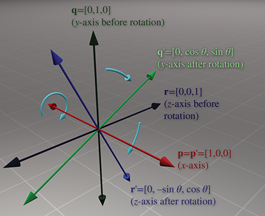
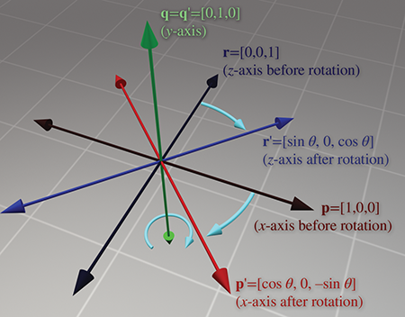
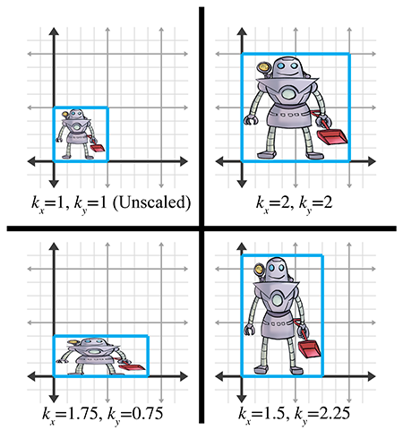
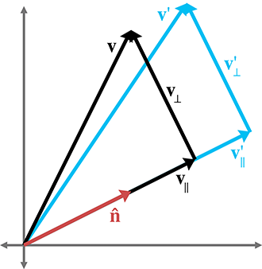
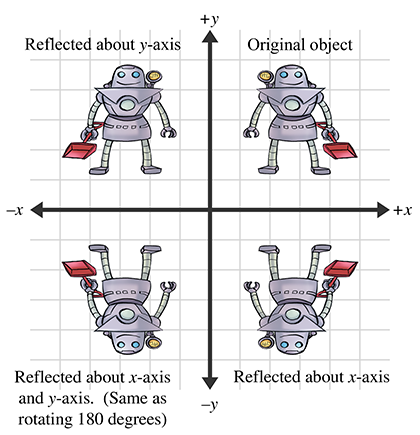
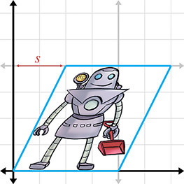

[<< Introduction to Matrices](matrixintro.html)

[Contents](./)

[More on Matrices >>](matrixmore.html)

Chapter 5 

Matrices and Linear Transformations

It's time to transform!

— _Super WHY!_

[Chapter 4](matrixintro.html) investigated some of the basic mathematical properties of matrices. It also developed a geometric understanding of matrices and their relationship to coordinate space transformations in general. This chapter continues our investigation of transformations.

To be more specific, this chapter is concerned with expressing _linear transformations_ in 3D using 3×3 matrices. We give a more formal definition of linear transformations at the end of this chapter, but for now, recall from our informal introduction to linear transformations in [Section 4.2](matrixintro.html#geometric_definition) that one important property of linear transformations is that they do not contain translation. A transformation that contains translation is known as an _affine_ transformation. Affine transformations in 3D cannot be implemented using 3×3 matrices. [Section 5.7.2](#affine_transformations) gives a formal definition of affine transformations, and [Section 6.4](matrixmore.html#homogeneous_matrices) shows how to use 4×4 matrices to represent affine transformations.

This chapter discusses the implementation of linear transformations via matrices. It is divided roughly into two parts. In the first part, Sections [5.1](#rotation)–[5.5](#shearing), we take the basic tools from previous chapters to derive matrices for primitive linear transformations of rotation, scaling, orthographic projection, reflection, and shearing. For each transformation, examples and equations in 2D and 3D are given. The same strategy will be used repeatedly: determine what happens to the standard basis vectors as a result of the transformation and then put those transformed basis vectors into the rows of our matrix. Note that these discussions assume an _active_ transformation: the object is transformed while the coordinate space remains stationary. Remember from [Section 3.3.1](multiplespaces.html#two_perspectives) that we can effectively perform a passive transformation (transform the coordinate space and keep the object still) by transforming the object by the oppositeamount.

A lot of this chapter is filled with messy equations and details, so you might be tempted to skip over it—but don't! There are a lot of important, easily digested principles interlaced with the safely forgotten details. We think it's important to be able to understand how various transform matrices can be derived, so in principle you can derive them on your own from scratch. Commit the high-level principles in this chapter to memory, and don't get too bogged down in the details. This book will not self-destruct after you read it, so keep it on hand for reference when you need a particular equation.

The second part of this chapter returns to general principles of transformations. [Section 5.6](#combining_transformations) shows how a sequence of primitive transformations may be combined by using matrix multiplication to form a more complicated transformation. [Section 5.7](#classes_of_transformations) discusses various interesting categories of transformations, including linear, affine, invertible, angle-preserving, orthogonal, and rigid-body transforms.

# 5.1Rotation

We have already seen general examples of rotation matrices. Now let's develop a more rigorous definition. First, [Section 5.1.1](#rotation_2d) examines 2D rotation. [Section 5.1.2](#rotation_3d_cardinal_axis) shows how to rotate about a cardinal axis. Finally, [Section 5.1.3](#rotation_3d_arbitrary_axis) tackles the most general case of rotation about an arbitrary axis in 3D.

## 5.1.1Rotation in 2D

In 2D, there's really only one type of rotation that we can do: rotation about a point. This chapter is concerned with linear transformations, which do not contain translation, so we restrict our discussion even further to rotation about the origin. A 2D rotation about the origin has only one parameter, the angle θ , which defines the amount of rotation. The standard convention found in most math books is to consider counterclockwise rotation positive and clockwise rotation negative. (However, different conventions are more appropriate in different situations.) [Figure 5.1](#2d_rotation) shows how the basis vectors p and q are rotated about the origin, resulting in the new basis vectors p ′ and q ′ .

Figure 5.1Rotation about the origin in 2D

Now that we know the values of the basis vectors after rotation, we can build our matrix:

2D rotation matrix

(5.1.1) R (θ)\= \[ − p ′− − q ′− \] \= \[cos⁡θsin⁡θ−sin⁡θcos⁡θ\] .

Figure 5.2Rotating about the x \-axis in 3D

## 5.1.23D Rotation about Cardinal Axes

In 3D, rotation occurs about an _axis_ rather than a point, with the term _axis_ taking on its more commonplace meaning of a line about which something rotates. An axis of rotation does not necessarily have to be one of the cardinal x , y , or z axes—but those special cases are the ones we consider

in this section. Again, we are not considering translation in this chapter, so we will limit the discussion to rotation about an axis that passes through the origin. In any case, we'll need to establish which direction of rotation is considered “positive” and which is considered “negative.” We're going to obey the left-hand rule for this. Review [Section 1.3.3](cartesianspace.html#3d_hands) if you've forgotten this rule.

Let's start with rotation about the x \-axis, as shown in [Figure 5.2](#rotate_about_x_1). Constructing a matrix from the rotated basis vectors, we have

3D matrix to rotate about the x \-axis

R x(θ)\= \[ − p ′− − q ′− − r ′− \] \= \[1000cos⁡θsin⁡θ0−sin⁡θcos⁡θ\] .

Rotation about the y \-axis is similar (see [Figure 5.3](#rotate_about_y_1)). The matrix to rotate about the y \-axis is

3D matrix to rotate about the y \-axis

R y(θ)\= \[ − p ′− − q ′− − r ′− \] \= \[cos⁡θ0−sin⁡θ010sin⁡θ0cos⁡θ\] .

Figure 5.3Rotating about the y \-axis in 3D

Figure 5.4Rotating about the z \-axis in 3D

And finally, rotation about the z \-axis (see [Figure 5.4](#rotate_about_z_1)) is done with the matrix

3D matrix to rotate about the z \-axis

R z(θ)\= \[ − p ′− − q ′− − r ′− \] \= \[cos⁡θsin⁡θ0−sin⁡θcos⁡θ0001\] .

Please note that although the figures in this section use a left-handed convention, the matrices work in either left- or right-handed coordinate systems, due to the conventions used to define the direction of positive rotation. You can verify this visually by looking at the figures in a mirror.

## 5.1.33D Rotation about an Arbitrary Axis

We can also rotate about an arbitrary axis in 3D, provided, of course, that the axis passes through the origin, since we are not considering translation at the moment. This is more complicated and less common than rotating about a cardinal axis. As before, we define θ to be the amount of rotation about the axis. The axis will be defined by a unit vector n ^ .

Let's derive a matrix to rotate about n ^ by the angle θ . In other words, we wish to derive the matrix R ( n ^ ,θ) such that when we multiply a vector v by R ( n ^ ,θ) , the resulting vector v ′ is the result of rotating v about n ^ by the angle θ :

v ′\= v R ( n ^ ,θ).

To derive the matrix R ( n ^ ,θ) , let's first see if we can express v ′ in terms of v , n ^ , and θ . The basic idea is to solve the problem in the plane perpendicular to n ^ , which is a much simpler 2D problem. To do this, we separate v into two vectors, v ∥ and v ⊥ , which are parallel and perpendicular to n ^ , respectively, such that v \= v ∥+ v ⊥ . (We learned how to do this with the dot product in [Section 2.11.2](vectors.html#dot_product_geometry).) By rotating each of these components individually, we can rotate the vector as a whole. In other words, v ′\= v ∥′+ v ⊥′ . Since v ∥ is parallel to n ^ , it will not be affected by the rotation about n ^ . In other words, v ∥′\= v ∥ . So all we need to do is compute v ⊥′ , and then we have v ′\= v ∥+ v ⊥′ . To compute v ⊥′ , we construct the vectors v ∥ , v ⊥ , and an intermediate vector w , as follows:

*   The vector v ∥ is the portion of v that is parallel to n ^ . Another way of saying this is that v ∥ is the value of v _projected onto_ n ^ . From [Section 2.11.2](vectors.html#dot_product_geometry), we know that v ∥\=( v ⋅ n ^ ) n ^ .
*   The vector v ⊥ is the portion of v that is perpendicular to n ^ . Since v \= v ∥+ v ⊥ , v ⊥ can be computed by v − v ∥ . v ⊥ is the result of projecting v onto the plane perpendicular to n ^ .
*   The vector w is mutually perpendicular to v ∥ and v ⊥ and has the same length as v ⊥ . It can be constructed by rotating v ⊥ 90 o about n ^ ; thus we see that its value is easily computed by w \= n ^ × v ⊥ .

These vectors are shown in [Figure 5.5](#rotate_about_arbitrary_axis_derive_matrix).

Figure 5.5 Rotating a vector about an arbitrary axis

How do these vectors help us compute v ⊥′ ? Notice that w and v ⊥ form a 2D coordinate space, with v ⊥ as the “ x \-axis” and w as the “ y \-axis.” (Note that the two vectors don't necessarily have unit length.) v ⊥′ is the result of rotating v ′ in this plane by the angle θ . Note that this is almost identical to rotating an angle into standard position. [Section 1.4.4](cartesianspace.html#trig_functions) showed that the endpoints of a unit ray rotated by an angle θ are cos⁡θ and sin⁡θ . The only difference here is that our ray is not a unit ray, and we are using v ⊥ and w as our basis vectors. Thus, v ⊥′ can be computed as

v ⊥′\=cos⁡θ v ⊥+sin⁡θ w .

Let's summarize the vectors we have computed:

v ∥\= ( v ⋅ n ^ ) n ^ , v ⊥\= v − v ∥\= v − ( v ⋅ n ^ ) n ^ , w \= n ^ × v ⊥\= n ^ × ( v − v ∥) \= n ^ × v − n ^ × v ∥\= n ^ × v − 0 \= n ^ × v , v ⊥′\=cos⁡θ v ⊥+sin⁡θ w \=cos⁡θ ( v − ( v ⋅ n ^ ) , n ^ ) +sin⁡θ ( n ^ × v ) .

Substituting for v ′ , we have

(5.1) v ′\= v ⊥′+ v ∥\=cos⁡θ ( v − ( v ⋅ n ^ ) n ^ ) +sin⁡θ ( n ^ × v ) + ( v ⋅ n ^ ) n ^ .

[Equation (5.1)](#rotate_vector_about_axis) allows us to rotate any arbitrary vector about any arbitrary axis. We could perform arbitrary rotation transformations armed only with this equation, so in a sense we are done—the remaining arithmetic is essentially a notational change that expresses [Equation (5.1)](#rotate_vector_about_axis) as a matrix multiplication.

Now that we have expressed v ′ in terms of v , n ^ , and θ , we can compute what the basis vectors are after transformation and construct our matrix. We're just presenting the results here; a reader interested in following each step can check out [Exercise 2.24](vectors.html#rotate_arbitrary_axis_3d):

p \= \[ 1 0 0 \] , p ′\= \[ n x 2 (1−cos⁡θ) +cos⁡θ n x n y (1−cos⁡θ) + n z sin⁡θ n x n z (1−cos⁡θ) − n y sin⁡θ \] T , q \= \[ 0 1 0 \] , q ′\= \[ n x n y (1−cos⁡θ) − n z sin⁡θ n y 2 (1−cos⁡θ) +cos⁡θ n y n z (1−cos⁡θ) + n x sin⁡θ \] T , r \= \[ 0 0 1 \] , r ′\= \[ n x n z (1−cos⁡θ) + n y sin⁡θ n y n z (1−cos⁡θ) − n x sin⁡θ n z 2 (1−cos⁡θ) +cos⁡θ \] T .

Note that p ′ and friends are actually row vectors, we are just writing them as transposed column vectors to fit on the page.

Constructing the matrix from these basis vectors, we get

3D matrix to rotate about an arbitrary axis

R ( n ^ ,θ)\= \[ − p ′− − q ′− − r ′− \] \= \[ n x 2 (1−cos⁡θ) +cos⁡θ n x n y (1−cos⁡θ) + n z sin⁡θ n x n z (1−cos⁡θ) − n y sin⁡θ n x n y (1−cos⁡θ) − n z sin⁡θ n y 2 (1−cos⁡θ) +cos⁡θ n y n z (1−cos⁡θ) + n x sin⁡θ n x n z (1−cos⁡θ) + n y sin⁡θ n y n z (1−cos⁡θ) − n x sin⁡θ n z 2 (1−cos⁡θ) +cos⁡θ \] .

# 5.2Scale

We can scale an object to make it proportionally bigger or smaller by a factor of k . If we apply this scale to the entire object, thus “dilating” the object about the origin, we are performing a _uniform scale_. Uniform scale preserves angles and proportions. Lengths increase or decrease uniformly by a factor of k , areas by a factor of k2 , and volumes (in 3D) by a factor of k3 .

If we wish to “stretch” or “squash” the object, we can apply different scale factors in different directions, resulting in _nonuniform scale_. Nonuniform scale does not preserve angles. Lengths, areas, and volumes are adjusted by a factor that varies according to the orientation relative to the direction of scale.

If | k | <1 , then the object gets “shorter” in that direction. If | k | \>1 , then the object gets “longer.” If k\=0 , then we have an _orthographic projection_, discussed in [Section 5.3](#orthographic_projection). If k<0 , then we have a _reflection_, covered in [Section 5.4](#reflection). For the remainder of this section, we will assume that k\>0 .

[Section 5.2.1](#scale_cardinal_axes) begins with the simple case of scaling along the cardinal axes. Then [Section 5.2.2](#scale_arbitrary_axis) examines the general case, scaling along an arbitrary axis.

## 5.2.1Scaling along the Cardinal Axes

The simplest scale operation applies a separate scale factor along each cardinal axis. The scale _along_ an axis is applied _about_ the perpendicular axis (in 2D) or plane (in 3D). If the scale factors for all axes are equal, then the scale is uniform; otherwise, it is nonuniform.

In 2D, we have two scale factors, kx and ky . [Figure 5.6](#2d_scale) shows an object with various scale values for kx and ky .

Figure 5.6Scaling a 2D object with various factors for kx and ky

As is intuitively obvious, the basis vectors p and q are independently affected by the corresponding scale factors:

p ′\=kx p \=kx \[ 1 0 \] \= \[ kx 0 \] , q ′\=ky q \=ky \[ 0 1 \] \= \[ 0 ky \] .

Constructing the 2D scale matrix S (kx,ky) from these basis vectors, we get

S (kx,ky)\= \[ − p ′− − q ′− \] \= \[kx00ky\] .

2D matrix to scale on cardinal axes

For 3D, we add a third scale factor kz , and the 3D scale matrix is then given by

3D matrix to scale on cardinal axes

S (kx,ky,kz)\= \[kx000ky000kz\] .

If we multiply any arbitrary vector by this matrix, then, as expected, each component is scaled by the appropriate scale factor:

\[ x y z \] \[kx000ky000kz\] \= \[ kxx kyy kzz \] .

## 5.2.2Scaling in an Arbitrary Direction

We can apply scale independent of the coordinate system used by scaling in an arbitrary direction. We define n ^ to be the unit vector parallel to the direction of scale, and k to be the scale factor to be applied about the line (in 2D) or plane (in 3D) that passes through the origin and is perpendicular to n ^ . We are scaling _along_ n ^ , not _about_ n ^ .

To derive a matrix that scales along an arbitrary axis, we'll use an approach similar to the one used in [Section 5.1.3](#rotation_3d_arbitrary_axis) for rotation about an arbitrary axis. Let's derive an expression that, given an arbitrary vector v , computes v ′ in terms of v , n ^ , and k . As before, we separate v into two values, v ∥ and v ⊥ , which are parallel and perpendicular to n ^ , respectively, such that v \= v ∥+ v ⊥ . The parallel portion, v ∥ , is the projection of v onto n ^ . From [Section 2.11.2](vectors.html#dot_product_geometry), we know that v ∥\=( v ⋅ n ^ ) n ^ . Since v ⊥ is perpendicular to n ^ , it will not be affected by the scale operation. Thus v ′\= v ∥′+ v ⊥ , and all we have left to do is compute the value of v ∥′ . Since v ∥ is parallel to the direction of scale, v ∥′ is trivially given by k v ∥ . This is shown in [Figure 5.7](#arbitrary_scale_vectors).

Figure 5.7 Scaling a vector along an arbitrary direction

Summarizing the known vectors and substituting gives us

v \= v ∥+ v ⊥, v ∥\= ( v ⋅ n ^ ) n ^ , v ⊥′\= v ⊥\= v − v ∥\= v − ( v ⋅ n ^ ) n ^ , v ∥′\=k v ∥\=k ( v ⋅ n ^ ) n ^ , v ′\= v ⊥′+ v ∥′\= v − ( v ⋅ n ^ ) n ^ +k ( v ⋅ n ^ ) n ^ \= v + (k−1) ( v ⋅ n ^ ) n ^ .

Now that we know how to scale an arbitrary vector, we can compute the value of the basis vectors after scale. We derive the first 2D basis vector; the other basis vector is similar, and so we merely present the results. (Note that column vectors are used in the equations below strictly to make the equations format nicely on the page.):

p \= \[ 1 0 \] , p ′\= p + (k−1) ( p ⋅ n ^ ) n ^ \= \[ 1 0 \] + (k−1) ( \[ 1 0 \] ⋅ \[ n x n y \] ) \[ n x n y \] \= \[ 1 0 \] + (k−1) n x \[ n x n y \] \= \[ 1 0 \] + \[ (k−1) n x 2 (k−1) n x n y \] \= \[ 1+ (k−1) n x 2 (k−1) n x n y \] , q \= \[ 0 1 \] , q ′\= \[ (k−1) n x n y 1+ (k−1) n y 2 \] .

Forming a matrix from the basis vectors, we arrive at the 2D matrix to scale by a factor of k in an arbitrary direction specified by the unit vector n ^ :

2D matrix to scale in an arbitrary direction

S ( n ^ ,k)\= \[ − p ′− − q ′− \] \= \[1+ (k−1) n x 2 (k−1) n x n y (k−1) n x n y 1+ (k−1) n y 2\] .

In 3D, the values of the basis vectors are computed by

p \= \[ 1 0 0 \] , p ′\= \[ 1+ (k−1) n x 2 (k−1) n x n y (k−1) n x n z \] T , q \= \[ 0 1 0 \] , q ′\= \[ (k−1) n x n y 1+ (k−1) n y 2 (k−1) n y n z \] T , r \= \[ 0 0 1 \] , r ′\= \[ (k−1) n x n z (k−1) n y n z 1+ (k−1) n z 2 \] T .

A suspicious reader wondering if we just made that up can step through the derivation in [Exercise 2.23](vectors.html#scale_arbitrary_axis_3d).

Finally, the 3D matrix to scale by a factor of k in an arbitrary direction specified by the unit vector n ^ is

3D matrix to scale in an arbitrary direction

S ( n ^ ,k)\= \[ − p ′− − q ′− − r ′− \] \= \[ 1+ (k−1) n x 2 (k−1) n x n y (k−1) n x n z (k−1) n x n y 1+ (k−1) n y 2 (k−1) n y n z (k−1) n x n z (k−1) n y n z 1+ (k−1) n z 2 \] .

# 5.3Orthographic Projection

In general, the term _projection_ refers to any dimension-reducing operation. As we discussed in [Section 5.2](#scale), one way we can achieve projection is to use a scale factor of zero in a direction. In this case, all the points are flattened or _projected_ onto the perpendicular axis (in 2D) or plane (in 3D). This type of projection is an _orthographic projection_, also known as a _parallel projection_, since the lines from the original points to their projected counterparts are parallel. We present another type of projection, _perspective projection_, in [Section 6.5](matrixmore.html#perspective_projection).

First, [Section 5.3.1](#orthographic_projection_cardinal_axis) discusses orthographic projection onto a cardinal axis or plane, and then [Section 5.3.2](#orthographic_projection_arbitrary_axis) examines the general case.

## 5.3.1Projecting onto a Cardinal Axis or Plane

The simplest type of projection occurs when we project onto a cardinal axis (in 2D) or plane (in 3D). This is illustrated in [Figure 5.8](#ortho_project_teapot).

Figure 5.8Projecting a 3D object onto a cardinal plane

Projection onto a cardinal axis or plane most frequently occurs not by actual transformation, but by simply discarding one of the coordinates while assigning the data into a variable of lesser dimension. For example, we may turn a 3D object into a 2D object by discarding the z components of the points and copying only x and y .

However, we can also project onto a cardinal axis or plane by using a scale value of zero on the perpendicular axis. For completeness, we present the matrices for these transformations:

Projecting onto a cardinal axis

P x\= S ( \[ 0 1 \] ,0) \= \[1000\] , P y\= S ( \[ 1 0 \] ,0) \= \[0001\] ,

Projecting onto a cardinal plane

P xy \= S ( \[ 0 0 1 \] ,0) \= \[100010000\] , P xz \= S ( \[ 0 1 0 \] ,0) \= \[100000001\] , P yz \= S ( \[ 1 0 0 \] ,0) \= \[000010001\] .

## 5.3.2Projecting onto an Arbitrary Line or Plane

We can also project onto any arbitrary line (in 2D) or plane (in 3D). As before, since we are not considering translation, the line or plane must pass through the origin. The projection will be defined by a unit vector n ^ that is perpendicular to the line or plane.

We can derive the matrix to project in an arbitrary direction by applying a zero scale factor along this direction, using the equations we developed in [Section 5.2.2](#scale_arbitrary_axis). In 2D, we have

2D matrix to project onto an arbitrary line

P ( n ^ )\= S ( n ^ ,0) \= \[1+ (0−1) n x 2 (0−1) n x n y (0−1) n x n y 1+ (0−1) n y 2\] \= \[1− n x 2− n x n y − n x n y 1− n y 2\] .

Remember that n ^ is _perpendicular_ to the line onto which we are projecting, not parallel to it. In 3D, we project onto the plane perpendicular to n ^ :

3D matrix to project onto an arbitrary plane

P ( n ^ )\= S ( n ^ ,0) \= \[ 1+ (0−1) n x 2 (0−1) n x n y (0−1) n x n z (0−1) n x n y 1+ (0−1) n y 2 (0−1) n y n z (0−1) n x n z (0−1) n y n z 1+ (0−1) n z 2 \] \= \[ 1− n x 2 − n x n y − n x n z − n x n y 1− n y 2 − n y n z − n x n z − n y n z 1− n z 2 \] .

# 5.4Reflection

Reflection (also called _mirroring_) is a transformation that “flips” the object about a line (in 2D) or a plane (in 3D). [Figure 5.9](#reflect_examples) shows the result of reflecting an object about the x \- and y \-axis.

Figure 5.9 Reflecting an object about an axis in 2D

Reflection can be accomplished by applying a scale factor of −1 . Let n ^ be a 2D unit vector. Then the matrix that performs a reflection about the axis of reflection that passes through the origin and is perpendicular to n ^ is given by

R ( n ^ )\= S ( n ^ ,−1) \= \[1+ (−1−1) n x 2 (−1−1) n x n y (−1−1) n x n y 1+ (−1−1) n y 2\] \= \[1−2 n x 2−2 n x n y −2 n x n y 1−2 n y 2\] .

2D matrix to reflect about an arbitrary axis

In 3D, we have a reflecting _plane_ instead of axis. For the transformation to be linear, the plane must contain the origin, in which case the matrix to perform the reflection is

R ( n ^ )\= S ( n ^ ,−1) \= \[ 1+ (−1−1) n x 2 (−1−1) n x n y (−1−1) n x n z (−1−1) n x n y 1+ (−1−1) n y 2 (−1−1) n y n z (−1−1) n x n z (−1−1) n y n z 1+ (−1−1) n z 2 \] \= \[ 1−2 n x 2 −2 n x n y −2 n x n z −2 n x n y 1−2 n y 2 −2 n y n z −2 n x n z −2 n y n z 1−2 n z 2 \] .

3D matrix to reflect about an arbitrary plane

Notice that an object can be “reflected” only once. If we reflect it again (even about a different axis or plane) then the object is flipped back to “right side out,” and it is the same as if we had rotated the object from its initial position. An example of this is shown in the bottom-left corner of [Figure 5.9](#reflect_examples).

# 5.5Shearing

Figure 5.10Shearing in 2D

Shearing is a transformation that “skews” the coordinate space, stretching it nonuniformly. Angles are not preserved; however, surprisingly, areas and volumes are. The basic idea is to add a multiple of one coordinate to the other. For example, in 2D, we might take a multiple of y and add it to x , so that x′\=x+sy . This is shown in [Figure 5.10](#shear_2d_x_example).

The matrix that performs this shear is

H x(s)\= \[10s1\] ,

where the notation H x denotes that the x \-coordinate is sheared by the other coordinate, y . The parameter s controls the amount and direction of the shearing. The other 2D shear matrix, H y , is

H y(s)\= \[1s01\] .

In 3D, we can take one coordinate and add different multiples of that coordinate to the other two coordinates. The notation H xy indicates that the x \- and y \-coordinates are shifted by the other coordinate, z . We present these matrices for completeness:

H xy (s,t)\= \[100010st1\] , H xz (s,t)\= \[100s1t001\] , H yz (s,t)\= \[1st010001\] .

3D shear matrices

Shearing is a seldom-used transform. It is also known as a _skew_ transform. Combining shearing and scaling (uniform or nonuniform) creates a transformation that is indistinguishable from a transformation containing rotation and nonuniform scale.

# 5.6Combining Transformations

This section shows how to take a sequence of transformation matrices and combine (or _concatenate_) them into one single transformation matrix. This new matrix represents the cumulative result of applying all of the original transformations in order. It's actually quite easy. The transformation that results from applying the transformation with matrix A followed by the transformation with matrix B has matrix AB . That is, matrix multiplication is how we compose transformations represented as matrices.

One very common example of this is in rendering. Imagine there is an object at an arbitrary position and orientation in the world. We wish to render this object given a camera in any position and orientation. To do this, we must take the vertices of the object (assuming we are rendering some sort of triangle mesh) and transform them from object space into world space. This transform is known as the _model transform_, which we denote M obj→wld . From there, we transform world-space vertices with the _view transform_, denoted M wld→cam , into camera space. The math involved is summarized by

p wld \= p obj M obj→wld , p cam \= p wld M wld→cam \=( p obj M obj→wld ) M wld→cam .

From [Section 4.1.6](matrixintro.html#matrix_times_matrix), we know that matrix multiplication is associative, and so we could compute one matrix to transform directly from object to camera space:

p cam \=( p obj M obj→wld ) M wld→cam \= p obj ( M obj→wld M wld→cam ).

Thus, we can concatenate the matrices outside the vertex loop, and have only one matrix multiplication inside the loop (remember there are many vertices):

M obj→cam \= M obj→wld M wld→cam , p cam \= p obj M obj→cam .

So we see that matrix concatenation works from an algebraic perspective by using the associative property of matrix multiplication. Let's see if we can get a more geometric interpretation of what's going on. Recall from [Section 4.2](matrixintro.html#geometric_definition), our breakthrough discovery, that the rows of a matrix contain the result of transforming the standard basis vectors. This is true even in the case of multiple transformations. Notice that in the matrix product A B , each resulting row is the product of the corresponding row from A times the matrix B . In other words, let the row vectors a 1 , a 2 , and a 3 stand for the rows of A . Then matrix multiplication can alternatively be written as

A \= \[ − a 1− − a 2− − a 3− \] , A B \= ( \[ − a 1− − a 2− − a 3− \] B ) \= \[ − a 1 B − − a 2 B − − a 3 B − \] .

This explicitly shows that the rows of the product of A B are actually the result of transforming the basis vectors in A by B .

# 5.7Classes of Transformations

We can classify transformations according to several criteria. This section discuss classes of transformations. For each class, we describe the properties of the transformations that belong to that class and specify which of the primitive transformations from Sections [5.1](#rotation) through [5.5](#shearing) belong to that class. The classes of transformations are not mutually exclusive, nor do they necessarily follow an “order” or “hierarchy,” with each one more or less restrictive than the next.

When we discuss transformations in general, we may make use of the synonymous terms _mapping_ or _function_. In the most general sense, a mapping is simply a rule that takes an input and produces an output. We denote that the mapping F maps a to b by writing F(a)\=b (read “ F of a equals b ”). Of course, we are primarily interested in the transformations that can be expressed by using matrix multiplication, but it is important to note that other mappings are possible.

This section also mentions the _determinant_ of a matrix. We're getting a bit ahead of ourselves here, since a full explanation of determinants isn't given until [Section 6.1](matrixmore.html#determinant). For now, just know that the determinant of a matrix is a scalar quantity that is very useful for making certain high-level, shall we say, _determinations_ about the matrix.

## 5.7.1Linear Transformations

We met linear functions informally in [Section 4.2](matrixintro.html#geometric_definition). Mathematically, a mapping F( a ) is linear if

Conditions satisfied if F is a linear mapping

(5.2)F( a + b )\=F( a )+F( b )and(5.3)F(k a )\=kF( a ).

This is a fancy way of stating that the mapping F is linear if it preserves the basic operations of addition and multiplication by a scalar. If we add two vectors, and then perform the transformation, we get the same result as if we perform the transformation on the two vectors individually and then add the transformed vectors. Likewise, if we scale a vector and then transform it, we should get the same resulting vector as when we transform the vector and then scale it.

There are two important implications of this definition of linear transformation. First, the mapping F( a )\= a M , where M is any square matrix, is a linear transformation, because

Matrix multiplication satisfies [Equation (5.2)](#linear_transform_condition_1)

F( a + b )\=( a + b ) M \= a M + b M \=F( a )+F( b )

and

Matrix multiplication satisfies [Equation (5.3)](#linear_transform_condition_2)

F(k a )\=(k a ) M \=k( a M )\=kF( a ).

In other words:

Any transformation that can be accomplished with matrix multiplication is a linear transformation.

Second, any linear transformation will transform the zero vector into the zero vector. If F( 0 )\= a , a ≠ 0 , then F cannot be a linear mapping, since F(k 0 )\= a and therefore F(k 0 )≠kF( 0 ) . Because of this,

Linear transformations do not contain translation.

Since all of the transformations we discussed in Sections [5.1](#rotation) through [5.5](#shearing) can be expressed using matrix multiplication, they are all linear transformations.

In some literature, a linear transformation is defined as one in which parallel lines remain parallel after transformation. This is almost completely accurate, with two exceptions. First, parallel lines remain parallel after translation, but translation is not a linear transformation. Second, what about projection? When a line is projected and becomes a single point, can we consider that point “parallel” to anything? Excluding these technicalities, the intuition is correct: a linear transformation may “stretch” things, but straight lines are not “warped” and parallel lines remain parallel.

## 5.7.2Affine Transformations

An _affine_ transformation is a linear transformation followed by translation. Thus, the set of affine transformations is a superset of the set of linear transformations: any linear transformation is an affine translation, but not all affine transformations are linear transformations.

Since all of the transformations discussed in this chapter are linear transformations, they are all also affine transformations (though none of them have a translation portion). Any transformation of the form v ′\= v M + b is an affine transformation.

## 5.7.3Invertible Transformations

A transformation is _invertible_ if there exists an opposite transformation, known as the _inverse_ of F , that “undoes” the original transformation. In other words, a mapping F( a ) is invertible if there exists an inverse mapping F −1 such that

F −1 (F( a ))\=F(F −1 ( a ))\= a

for all a . Notice that this implies that F −1 is also invertible.

There are nonaffine invertible transformations, but we will not consider them for the moment. For now, let's concentrate on determining if an affine transformation is invertible. As already stated, an affine transformation is a linear transformation followed by a translation. Obviously, we can always “undo” the translation portion by simply translating by the opposite amount. So the question becomes whether the linear transformation is invertible.

Intuitively, we know that all of the transformations other than projection can be “undone.” If we rotate, scale, reflect, or skew, we can always “unrotate,” “unscale,” “unreflect,” or “unskew.” But when an object is projected, we effectively discard one or more dimensions' worth of information, and this information cannot be recovered. Thus, all of the primitive transformations other than projection are invertible.

Since any linear transformation can be expressed as multiplication by a matrix, finding the inverse of a linear transformation is equivalent to finding the inverse of a matrix. We discuss how to do this in [Section 6.2](matrixmore.html#inverse). If the matrix has no inverse, we say that it is _singular_, and the transformation is noninvertible. The determinant of an invertible matrix is nonzero.

In a nonsingular matrix, the zero vector is the only input vector that is mapped to the zero vector in the output space; all other vectors are mapped to some other nonzero vector. In a singular matrix, however, there exists an entire subspace of the input vectors, known as the _null space_ of the matrix, that is mapped to the zero vector. For example, consider a matrix that projects orthographically onto a plane containing the origin. The null space of this matrix consists of the line of vectors perpendicular to the plane, since they are all mapped to the origin.

When a square matrix is singular, its basis vectors are not linearly independent (see [Section 3.3.3](multiplespaces.html#basis_vectors)). If the basis vectors are linearly independent, then they have full rank, and coordinates of any given vector in the span are uniquely determined. If the vectors are linearly dependent, then there is a portion of the full n \-dimensional space that is not in the span of the basis. Consider two vectors a and b , which differ by a vector n that lies in the null space of a matrix M , such that b \= a + n . Due to the linear nature of matrix multiplication, M maps a and b to the same output:

b M \=( a + n ) M \= a M + n M (Matrix multiplication is linear and distributes)\= a M + 0 ( n  is in the null space of  M )\= a M .

## 5.7.4Angle-Preserving Transformations

A transformation is _angle-preserving_ if the angle between two vectors is not altered in either magnitude or direction after transformation. Only translation, rotation, and uniform scale are angle-preserving transformations. An angle-preserving matrix preserves proportions. We do not consider reflection an angle-preserving transformation because even though the magnitude of angle between two vectors is the same after transformation, the direction of angle may be inverted. All angle-preserving transformations are affine and invertible.

## 5.7.5Orthogonal Transformations

_Orthogonal_ is a term that is used to describe a matrix whose rows form an orthonormal basis. Remember from [Section 3.3.3](multiplespaces.html#basis_vectors) that the basic idea is that the axes are perpendicular to each other and have unit length. Orthogonal transformations are interesting because it is easy to compute their inverse and they arise frequently in practice. We talk more about orthogonal matrices in [Section 6.3](matrixmore.html#orthogonal_matrices).

Translation, rotation, and reflection are the only orthogonal transformations. All orthogonal transformations are affine and invertible. Lengths, angles, areas, and volumes are all preserved; however in saying this, we must be careful as to our precise definition of angle, area, and volume, since reflection is an orthogonal transformation and we just got through saying in the previous section that we didn't consider reflection to be an angle-preserving transformation. Perhaps we should be more precise and say that orthogonal matrices preserve the _magnitudes_ of angles, areas, and volumes, but possibly not the signs.

As [Chapter 6](matrixmore.html) shows, the determinant of an orthogonal matrix is ±1 .

## 5.7.6Rigid Body Transformations

A _rigid body transformation_ is one that changes the location and orientation of an object, but not its shape. All angles, lengths, areas, and volumes are preserved. Translation and rotation are the only rigid body transformations. Reflection is not considered a rigid body transformation.

Rigid body transformations are also known as _proper transformations_. All rigid body transformations are orthogonal, angle-preserving, invertible, and affine. Rigid body transforms are the most restrictive class of transforms discussed in this section, but they are also extremely common in practice.

The determinant of any rigid body transformation matrix is 1.

## 5.7.7Summary of Types of Transformations

[Table 5.1](#types_of_transformations) summarizes the various classes of transformations. In this table, a Y means that the transformation in that row always has the property associated with that column. The absence of a Y does not mean “never”; rather, it means “not always.”

Transform

Linear

Affine

Invertible

Angles preserved

Orthogonal

Rigid body

Lengths preserved

Areas/volumes preserved

Determinant

Lineartransformations

Y

Y

Affinetransformations

Y

≠0

Invertibletransformations

Y

Angle-preserving transformations

Y

Y

Y

Orthogonaltransformations

Y

Y

Y

±1

Rigid bodytransformations

Y

Y

Y

Y

Y

Y

Y

1

Translation

Y

Y

Y

Y

Y

Y

Y

1

Rotation[1](#footnote_1)

Y

Y

Y

Y

Y

Y

Y

Y

1

Uniform scale[2](#footnote_2)

Y

Y

Y

Y

kn  [3](#footnote_3)

Non-uniformscale

Y

Y

Y

Orthographicprojection[4](#footnote_4)

Y

Y

0

Reflection[5](#footnote_5)

Y

Y

Y

Y

Y[6](#footnote_6)

Y

−1

Shearing

Y

Y

Y

Y[7](#footnote_7)

1

 

[1](#footnote_1)

About the origin in 2D or an axis passing through the origin in 3D.

[2](#footnote_2)

About the origin in 2D or an axis passing through the origin in 3D.

[3](#footnote_3)

The determinant is the square of the scale factor in 2D, and the cube of the scale factor in 3D.

[4](#footnote_4)

Onto a line (2D) or plane (3D) that passes through the origin.

[5](#footnote_5)

About a line (2D) or plane (3D) that passes through the origin.

[6](#footnote_6)

Not considering “negative” area or volume.

[7](#footnote_7)

Surprisingly!

Table 5.1Types of transformations

# Exercises

1.  Does the matrix below express a linear transformation? Affine?
    
    \[341.7π20184−9−1.3\]
    
2.  Construct a matrix to rotate −22 o about the x \-axis.
3.  Construct a matrix to rotate 30 o about the y \-axis.
4.  Construct a matrix to rotate −15 o about the axis \[0.267,−0.535,0.802\] .
5.  Construct a matrix that doubles the height, width, and length of an object in 3D.
6.  Construct a matrix to scale by a factor of 5 about the plane through the origin perpendicular to the vector \[0.267,−0.535,0.802\] .
7.  Construct a matrix to orthographically project onto the plane through the origin perpendicular to the vector \[0.267,−0.535,0.802\] .
8.  Construct a matrix to reflect orthographically about the plane through the origin perpendicular to the vector \[0.267,−0.535,0.802\] .
9.  An object initially had its axes and origin coincident with the world axes and origin. It was then rotated 30 o about the y \-axis and then −22 o about the world x \-axis.
    1.  (a)What is the matrix that can be used to transform row vectors from object space to world space?
    2.  (b)What about the matrix to transform vectors from world space to object space?
    3.  (c)Express the object's z \-axis using upright coordinates.

Upside down  
Boy, you turn me  
Inside out  
And round and round

— _Upside Down_ (1980) by Diana Ross