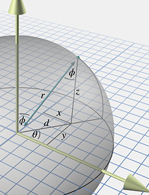

[<< More on Matrices](matrixmore.html)

[Contents](./)

[Rotation in Three Dimensions >>](orient.html)

Chapter 7 

Polar Coordinate Systems

First of all, we must note that the universe is spherical.

— Nicolaus Copernicus (1473–1543)

The Cartesian coordinate system isn't the only system for mapping out space and defining locations precisely. An alternative to the Cartesian system is the _polar_ coordinate system, which is the subject of this chapter. If you're not very familiar with polar coordinates, it might seem like an esoteric or advanced topic (especially because of the trig), and you might be tempted to gloss over. Please don't make this mistake. There are many very practical problems in areas such as AI and camera control whose solutions (and inherent difficulties!) can be readily understood in the framework of polar coordinates.

This chapter is organized into the following sections:

*   [Section 7.1](#2d_polar_space) describes 2D polar coordinates.
*   [Section 7.2](#polar_uses) gives some examples where polar coordinates are preferable to Cartesian coordinates.
*   [Section 7.3](#3d_polar) shows how polar space works in 3D and introduces _cylindrical_ and _spherical_ coordinates.
*   Finally, [Section 7.4](#polar_vectors) makes it clear that polar space can be used to describe vectors as well as positions.

# 7.12D Polar Space

This section introduces the basic idea behind polar coordinates, using two dimensions to get us warmed up. [Section 7.1.1](#2d_polar_coordinates) shows how to use polar coordinates to describe position. [Section 7.1.2](#polar_aliasing) discusses _aliasing_ of polar coordinates. [Section 7.1.3](#polar_conversion_2d) shows how to convert between polar and Cartesian coordinates in 2D.

## 7.1.1Locating Points by Using 2D Polar Coordinates

Remember that a 2D Cartesian coordinate space has an origin, which establishes the position of the coordinate space, and two axes that pass through the origin, which establish the orientation of the space. A 2D polar coordinate space also has an origin (known as the _pole_), which has the same basic purpose—it defines the “center” of the coordinate space. A polar coordinate space has only _one_ axis, however, sometimes called the _polar axis_, which is usually depicted as a ray from the origin. It is customary in math literature for the polar axis to point to the right in diagrams, and thus it corresponds to the +x axis in a Cartesian system, as shown in [Figure 7.1](#2d_polar_space).

Figure 7.1A 2D polar coordinate space

It's often convenient to use different conventions than this, as shown in [Section 7.3.3](#polar_conventions). Until then, our discussion adopts the traditional conventions of the math literature.

In the Cartesian coordinate system, we described a 2D point using two signed distances, x and y . The polar coordinate system uses one distance and one _angle_. By convention, the distance is usually assigned to the variable r (which is short for “radius”) and the angle is usually called θ . The polar coordinate pair (r,θ) specifies a point in 2D space as follows:

Locating the point described by 2D polar coordinates (r,θ)

Step 1.Start at the origin, facing in the direction of the polar axis, and rotate by the angle θ . Positive values of θ are usually interpreted to mean counterclockwise rotation, negative values mean clockwise rotation.

Step 2.Now move forward from the origin a distance of r units. You have arrived at the point described by the polar coordinates (r,θ) .

This process is shown in [Figure 7.2](#2d_polar_locating_points).

Figure 7.2 Locating a point using 2D polar coordinates

Figure 7.3 Example points labeled with 2D polar coordinates

In summary, r defines the distance from the point to the origin, and θ defines the direction of the point from the origin. [Figure 7.3](#2d_polar_labeled_points) shows several points and their polar coordinates. You should study this figure until you are convinced that you know how it works.

You might have noticed that the diagrams of polar coordinate spaces contain grid lines, but that these grid lines are slightly different from the grid lines used in diagrams of Cartesian coordinate systems. Each grid line in a Cartesian coordinate system is composed of points with the same value for one of the coordinates. A vertical line is composed of points that all have the same x \-coordinate, and a horizontal line is composed of points that all have the same y \-coordinate. The grid lines in a polar coordinate system are similar:

*   The “grid circles” show lines of constant r . This makes sense; after all, the definition of a circle is the set of all points equidistant from its center. That's why the letter r is the customary variable to hold this distance, because it is a _radial_ distance.
*   The straight grid lines that pass through the origin show lines of constant θ , consisting of points that are the same direction from the origin.

One note regarding angle measurements. With Cartesian coordinates, the unit of measure wasn't really significant. We could interpret diagrams using feet, meters, miles, yards, light-years, beard-seconds, or picas, and it didn't really matter.[1](#footnote_1) If you take some Cartesian coordinate data, interpreting that data using different physical units just makes whatever you're looking at get bigger or smaller, but it's proportionally the same shape. However, interpreting the angular component of polar coordinates using different angular units can produce drastically distorted results.

It really doesn't matter whether you use degrees or radians (or grads, mils, minutes, signs, sextants, or Furmans), as long as you keep it straight. In the text of this book, we almost always give specific angular measurements in degrees and use the o symbol after the number. We do this because we are human beings, and most humans who are not math professors find it easier to deal with whole numbers rather than fractions of π . Indeed, the choice of the number 360 was specifically designed to make fractions avoidable in many common cases. However, computing machines[2](#footnote_2) prefer to work with angles expressed using radians, and so the code snippets in this book use radians rather than degrees.

## 7.1.2Aliasing

Hopefully you're starting to get a good feel for how polar coordinates work and what polar coordinate space looks like. But there may be some nagging thoughts in the back of your head. Consciously or subconsciously, you may have noticed a fundamental difference between Cartesian and polar space. Perhaps you imagined a 2D Cartesian space as a perfectly even continuum of space, like a flawless sheet of Jell-O, spanning infinitely in all directions, each infinitely thin bite identical to all the others. Sure, there are some “special” places, like the origin, and the axes, but those are just like marks on the bottom of the pan—the Jell-O itself is the same there as everywhere else. But when you imagined the fabric of polar coordinate space, something was different. Polar coordinate space has some “seams” in it, some discontinuities where things are a bit “patched together.” In the infinitely large circular pan of Jell-O, there are multiple sheets of Jell-O stacked on top of each other. When you put your spoon down a particular place to get a bite, you often end up with multiple bites! There's a piece of hair in the block of Jell-O, a singularity that requires special precautions.

Whether your mental image of polar space was of Jell-O, or some other yummy dessert, you were probably pondering some of these questions:

1.  Can the radial distance r ever be negative?
2.  Can θ ever go outside the interval \[−180 o , +180 o \] ?
3.  The value of the angle θ directly “west” of the origin (i.e., for points where x<0 and y\=0 using Cartesian coordinates) is ambiguous. You may have noticed that none of these points are labeled in [Figure 7.3](#2d_polar_labeled_points). Is θ equal to +180 o or −180 o for these points?
4.  The polar coordinates for the origin itself are also ambiguous. Clearly r\=0 , but what value of θ should we use? Wouldn't _any_ value work?

The answer to all of these questions is “yes.”[3](#footnote_3) In fact, we must face a rather harsh reality about polar space.

For any given point, there are infinitely many polar coordinate pairs that can be used to describe that point.

This phenomenon is known as _aliasing_. Two coordinate pairs are said to be _aliases_ of each other if they have different numeric values but refer to the same point in space. Notice that aliasing doesn't happen in Cartesian space—each point in space is assigned exactly one (x,y) coordinate pair; the mapping of points to coordinate pairs is one-to-one.

Before we discuss some of the difficulties created by aliasing, let's be clear about one task for which aliasing does _not_ pose any problems: interpreting a particular polar coordinate pair (r,θ) and locating the point in space referred to by those coordinates. No matter what the values of r and θ , we can come up with a sensible interpretation.

When r<0 , it is interpreted as “backward” movement—displacement in the opposite direction that we would move if r were positive. If θ is outside the range \[−180 o , +180 o \] , that's not a cause for panic; we can still determine the resulting direction.[4](#footnote_4) In other words, although there may be some “unusual” polar coordinates, there's no such thing as “invalid” polar coordinates. A given point in space corresponds to many coordinate pairs, but a coordinate pair unambiguously designates exactly one point in space.

One way to create an alias for a point (r,θ) is to add a multiple of 360 o to θ . This adds one or more whole “revolutions,” but doesn't change the resulting direction defined by θ . Thus (r,θ) and (r,θ+k360 o ) describe the same point, where k is an integer. We can also generate an alias by adding 180 o to θ and negating r ; which means we face the other direction, but we displace by the opposite amount.

In general, for any point (r,θ) other than the origin, all of the polar coordinates that are aliases for (r,θ) can be expressed as

((−1)kr,θ+k180 o ) ,

where k is any integer.

So, in spite of aliasing, we can all agree what point is described by the polar coordinates (r,θ) , no matter what values of r and θ are used. But what about the reverse problem? Given an arbitrary point p in space, can we all agree what polar coordinates (r,θ) should be used to describe p ? We've just said that there are an infinite number of polar coordinate pairs that could be used to describe the location p . Which do we use? The short answer is: “Any one that works is _OK_, but only one is the _preferred_ one to use.”

It's like reducing fractions. We all agree that 13 / 26 is a perfectly valid fraction, and there's no dispute as to what the value of this fraction is. Even so, 13 / 26 is an “unusual” fraction; most of us would prefer that this value be expressed as 1 / 2 , which is simpler and easier to understand. A fraction is in the “preferred” format when it's expressed in lowest terms, meaning there isn't an integer greater than 1 that evenly divides both the numerator and denominator. We don't _have_ to reduce 13 / 26 to 1 / 2 , but by convention we normally do. A person's level of commitment to this convention is usually based on how many points their math teacher counted off on their homework for not reducing fractions to lowest terms.[5](#footnote_5)

For polar coordinates, the “preferred” way to describe any given point is known as the _canonical_ coordinates for that point. A 2D polar coordinate pair (r,θ) is in the canonical set if r is nonnegative and θ is in the interval (−180 o ,180 o \] . Notice that the interval is half open: for points directly “west” of the origin ( x<0,y\=0) , we will use θ\=+180 o . Also, if r\=0 (which is only true at the origin), then we usually assign θ\=0 . If you apply all these rules, then for any given point in 2D space, there is exactly _one_ way to represent that point using canonical polar coordinates. We can summmarize this succintly with some math notation. A polar coordinate pair (r,θ) is in the canonical set if all of the following are true:

Conditions satisfied by canonical coordinates

r≥0We don't measure distances \`\`backwards.'' −180 o <θ≤180 o The angle is limited to 1/2 revolution. We use {+180\\degrees} for \`\`west.''r\=0  ⇒  θ\=0At the origin, set the angle to zero.

The following algorithm can be used to convert a polar coordinate pair into its canonical form:

Converting a polar coordinate pair (r,θ) to canonical form

1.  If r\=0 , then assign θ\=0 .
2.  If r<0 , then negate r , and add 180 o to θ .
3.  If θ≤−180 o , then add 360 o to θ until θ\>−180 o .
4.  If θ\>180 o , then subtract 360 o from θ until θ≤180 o .

[Listing 7.1](#polar_to_canonical) shows how it could be done in C. As discussed in [Section 7.1.1](#2d_polar_coordinates), our computer code will normally store angles using radians.

// Radial distance
float r;

// Angle in RADIANS
float theta;

// Declare a constant for 2\*pi (360 degrees)
const float TWOPI = 2.0f\*PI;

// Check if we are exactly at the origin
if (r == 0.0f) {

    // At the origin - slam theta to zero
    theta = 0.0f;
} else {

    // Handle negative distance
    if (r < 0.0f) {
        r = -r;
        theta += PI;
    }

    // Theta out of range?  Note that this if() check is not
    // strictly necessary, but we try to avoid doing floating
    // point operations if they aren't necessary.  Why
    // incur floating point precision loss if we don't
    // need to?
    if (fabs(theta) > PI) {

        // Offset by PI
        theta += PI;

        // Wrap in range 0...TWOPI
        theta -= floor(theta / TWOPI) \* TWOPI;

        // Undo offset, shifting angle back in range -PI...PI
        theta -= PI;
    }
}

Picky readers may notice that while this code ensures that θ is in the _closed_ interval \[−π, +π \] , it does not explicitly avoid the case where θ\=−π . The value of π is not exactly representable in floating point. In fact, because π is an irrational number, it can never be represented exactly in floating point, or with any finite number of digits in any base, for that matter! The value of the constant PI in our code is not exactly equal to π , it's the closest number to π that is representable by a float. Using double-precision arithmetic can get us closer to the exact value, but it is still not exact. So you can think of this function as returning a value from the _open_ interval (−π,+π) .

## 7.1.3Converting between Cartesian and  
Polar Coordinates in 2D

This section describes how to convert between the Cartesian and polar coordinate systems in 2D. By the way, if you were wondering when we were going to make use of the trigonometry that we reviewed in [Section 1.4.5](cartesianspace.html#trig_identities), this is it.

[Figure 7.4](#2d_cartesian_polar_convert) shows the geometry involved in converting between polar and Cartesian coordinates in 2D.

Figure 7.4 Converting between Cartesian and polar coordinates

Converting polar coordinates (r,θ) to the corresponding Cartesian coordinates follows almost immediately from the definitions of sine and cosine:

Converting 2D polar coordinates to Cartesian

(7.1)x\=rcos⁡θ;y\=rsin⁡θ.

Notice that aliasing is a nonissue; Equation [(7.1)](#2d_polar_to_cartesian) works even for “weird” values of r and θ .

Computing the polar coordinates (r,θ) from the Cartesian coordinates (x,y) is the tricky part. Due to aliasing, there isn't only one right answer; there are infinitely many (r,θ) pairs that describe the point (x,y) . Usually, we want the canonical coordinates.

We can easily compute r by using the Pythagorean theorem,

r\=x2+y2.

Since the square root function always returns the positive root, we don't have to worry about r causing our computed polar coordinates to be outside the canonical set.

Computing r was pretty easy, so now let's solve for θ :

yx\= rsin⁡θ rcos⁡θ ,yx\= sin⁡θ cos⁡θ ,y / x\=tan⁡θ,θ\=arctan⁡(y / x).

Unfortunately, there are two problems with this approach. The first is that if x\=0 , the division is undefined. The second is that the arctan function has a range of only \[−90 o , +90 o \] . The basic problem is that the division y / x effectively discards some useful information. Both x and y can either be positive or negative, resulting in four different possibilities, corresponding to the four different quadrants that may contain the point. But the division y / x results in a single value. If we negate both x and y , we move to a different quadrant in the plane, but the ratio y / x doesn't change.

Because of these problems, the complete equation for conversion from Cartesian to polar coordinates requires some “if statements” to handle each quadrant, and is a bit of a mess for “math people.” Luckily, “computer people” have the atan2 function, which properly computes the angle θ for all x and y , except for the pesky case at the origin. Borrowing this notation, let's define an atan2 function we can use in this book in our math notation:

The atan2 function used in this book

(7.2) atan2 (y,x)\= {0,x\=0,y\=0,+90 o ,x\=0,y\>0,−90 o ,x\=0,y<0,arctan⁡(y / x),x\>0,arctan⁡(y / x)+180 o ,x<0,y≥0,arctan⁡(y / x)−180 o ,x<0,y<0.

Let's make two key observations about [Equation (7.2)](#atan2). First, following the convention of the atan2 function found in the standard libraries of most computer languages, the arguments are in the “reverse” order: y,x . You can either just remember that it's reversed, or you might find it handy to remember the lexical similarity between atan2 (y,x) and arctan⁡(y / x) . Or remember that tan⁡θ\=sin⁡θ / cos⁡θ , and θ\= atan2 (sin⁡θ,cos⁡θ) .

Second, in many software libraries, the atan2 function is _undefined_ at the origin, when x\=y\=0 . The atan2 function we are defining for use in our equations in the text of this book is defined such that atan2 (0,0)\=0 . In our code snippets, we use the library function atan2 and explicitly handle the origin as a special case, but in our equations, we use the abstract function atan2 , which is defined at the origin. (Note the difference in typeface.)

Back to the task at hand: computing the polar angle θ from a set of 2D Cartesian coordinates. Armed with the atan2 function, we can easily convert 2D Cartesian coordinates to polar form:

2D Cartesian to polar coordinate conversion

r\=x2+y2;θ\= atan2 (y,x).

The C code in [Listing 7.2](#2d_cartesian_to_polar) shows how to convert a Cartesian (x,y) coordinate pair to the corresponding canonical polar (r,θ) coordinates.

// Input: Cartesian coordinates
float x,y;

// Output: polar radial distance, and angle in RADIANS
float r, theta;

// Check if we are at the origin
if (x == 0.0f && y == 0.0f) {

    // At the origin - slam both polar coordinates to zero
    r = 0.0f;
    theta = 0.0f;
} else {

    // Compute values.  Isn't the atan2 function great?
    r = sqrt(x\*x + y\*y);
    theta = atan2(y,x);
}

# 7.2Why Would Anybody Use Polar Coordinates?

With all of the complications with aliasing, degrees and radians, and trig, why would anybody use polar coordinates when Cartesian coordinates work just fine, without any hairs in the Jell-O? Actually, you probably use polar coordinates more often than you do Cartesian coordinates. They arise frequently in informal conversation.

For example, one author is from Alvarado, Texas. When people ask where Alvarado, Texas, is, he tells them, “About 15 miles southeast of Burleson.” He's describing where Alvarado is by using polar coordinates, specifying an origin (Burleson), a distance (15 miles), and an angle (southeast). Of course, most people who aren't from Texas (and many people who are) don't know where Burleson is, either, so it's more natural to switch to a different polar coordinate system and say, “About 50 miles southwest of Dallas.” Luckily, even people from outside the United States usually know where Dallas is.[6](#footnote_6) By the way, everyone in Texas does _not_ wear a cowboy hat and boots. We _do_ use the words “y'all” and “fixin',” however.[7](#footnote_7)

In short, polar coordinates often arise because people naturally think about locations in terms of distance and direction. (Of course, we often aren't very _precise_ when using polar coordinates, but precision is not really one of the brain's strong suits.) Cartesian coordinates are just not our native language. The opposite is true of computers—in general, when using a computer to solve geometric problems, it's easier to use Cartesian coordinates than polar coordinates. We discuss this difference between humans and computers again in [Chapter 8](orient.html) when we compare different methods for describing orientation in 3D.

Perhaps the reason for our affinity for polar coordinates is that each polar coordinate has concrete meaning all by itself. One fighter pilot may say to another “Bogey, six o'clock!”[8](#footnote_8) In the midst of a dogfight, these brave fighter pilots are actually using polar coordinates. “Six o'clock” means “behind you” and is basically the angle θ that we've been studying. Notice that the pilot didn't need to specify a distance, presumably because the other pilot could turn around and see for himself faster than the other pilot could tell him. So one polar coordinate (in this case, a direction) is useful information by itself. The same types of examples can be made for the other polar coordinate, distance ( r ). Contrast that with the usefulness of a lone Cartesian coordinate. Imagine a fighter pilot saying, “Bogey, x\=1000 ft !” This information is more difficult to process, and isn't as useful.

In video games, one of the most common times that polar coordinates arise is when we want to aim a camera, weapon, or something else at some target. This problem is easily handled by using a Cartesian-to-polar coordinate conversion, since it's usually the angles we need. Even when angular data can be avoided for such purposes (we might be able to completely use vector operations, for example, if the orientation of the object is specified using a matrix), polar coordinates are still useful. Usually, cameras and turrets and assassins' arms cannot move instantaneously (no matter how good the assassin), but targets _do_ move. In this situation, we usually “chase” the target in some manner. This chasing (whatever type of control system is used, whether a simple velocity limiter, a lag, or a second-order system) is usually best done in polar space, rather than, say, interpolating a target position in 3D space.

Polar coordinates are also often encountered with physical data acquisition systems that provide basic raw measurements in terms of distance and direction.

One final occasion worth mentioning when polar coordinates are more natural to use than Cartesian coordinates is moving around on the surface of a sphere. When would anybody do that? You're probably doing it right now. The latitude/longitude coordinates used to precisely describe geographic locations are really not Cartesian coordinates, they are polar coordinates. (To be more precise, they are a type of 3D polar coordinates known as _spherical_ coordinates, which we'll discuss in [Section 7.3.2](#spherical_coordinates).) Of course, if you are looking at a relatively small area compared to the size of the planet and you're not too far away from the equator, you can use latitude and longitude as Cartesian coordinates without too many problems. We do it all the time in Dallas.

# 7.33D Polar Space

Polar coordinates can be used in 3D as well as 2D. As you probably have already guessed, 3D polar coordinates have _three_ values. But is the third coordinate another linear distance (like  r ) or is it another angle (like  θ )? Actually, we can choose to do either; there are _two_ different types of 3D polar coordinates. If we add a linear distance, we have _cylindrical coordinates_, which are the subject of the next section. If we add another angle instead, we have _spherical coordinates_, which are covered in the later sections. Although cylindrical coordinates are less commonly used than spherical coordinates, we describe them first because they are easier to understand.

[Section 7.3.1](#cylindrical_coordinates) discusses one kind of 3D polar coordinates, _cylindrical coordinates_, and [Section 7.3.2](#spherical_coordinates) discusses the other kind of 3D polar coordinates, _spherical coordinates_. [Section 7.3.3](#polar_conventions) presents some alternative polar coordinate conventions that are often more streamlined for use in video game code. [Section 7.3.4](#spherical_aliasing) describes the special types of aliasing that can occur in spherical coordinate space. [Section 7.3.5](#spherical_cartesian_conversion) shows how to convert between spherical coordinates and 3D Cartesian coordinates.

## 7.3.1Cylindrical Coordinates

Figure 7.5 Cylindrical coordinates

To extend Cartesian coordinates into 3D, we start with the 2D system, used for working in the plane, and add a third axis perpendicular to this plane. This is basically how cylindrical coordinates work to extend polar coordinates into 3D. Let's call the third axis the z \-axis, as we do with Cartesian coordinates. To locate the point described by the cylindrical coordinates (r,θ,z) , we start by processing r and θ just like we would for 2D polar coordinates, and then move “up” or “down” according to the z coordinate. [Figure 7.5](#cylindrical_coordinates) shows how to locate a point (r,θ,z) by using cylindrical coordinates.

Conversion between 3D Cartesian coordinates and cylindrical coordinates is straightforward. The z coordinate is the same in either representation, and we convert between (x,y) and (r,θ) via the 2D techniques from [Section 7.1.3](#polar_conversion_2d).

We don't use cylindrical coordinates much in this book, but they are useful in some situations when working in a cylinder-shaped environment or describing a cylinder-shaped object. In the same way that people often use polar coordinates without knowing it (see [Section 7.2](#polar_uses)), people who don't know the term “cylindrical coordinates” may still use them. Be aware that even when people do acknowledge that they are using cylindrical coordinates, notation and conventions vary widely. For example, some people use the notation (ρ,ϕ,z) . Also, the orientation of the axes and definition of positive rotation are set according to whatever is most convenient for a given situation.

## 7.3.2Spherical Coordinates

The more common kind of 3D polar coordinate system is a _spherical coordinate system_. Whereas a set of cylindrical coordinates has two distances and one angle, a set of spherical coordinates has two angles and one distance.

Let's review the essence of how polar coordinates work in 2D. A point is specified by giving a direction ( θ ) and a distance ( r ). Spherical coordinates also work by defining a direction and distance; the only difference is that in 3D it takes _two_ angles to define a direction. There are also two polar axes in a 3D spherical space. The first axis is “horizontal” and corresponds to the polar axis in 2D polar coordinates or +x in our 3D Cartesian conventions. The other axis is vertical, corresponding to +y in our 3D Cartesian conventions.

Different people use different conventions and notation for spherical coordinates, but most math people have agreed that the two angles are named θ and ϕ .[9](#footnote_9) Math people also are in general agreement about how these two angles are to be interpreted to define a direction. The entire process works like this:

Locating points in 3D using polar coordinates

Step 1.Begin by standing at the origin, facing the direction of the horizontal polar axis. The vertical axis points from your feet to your head. Point your right[10](#footnote_10) arm straight up, in the direction of the vertical polar axis.

Step 2.Rotate counterclockwise by the angle θ (the same way that we did for 2D polar coordinates).

Step 3.Rotate your arm downward by the angle ϕ . Your arm now points in the direction specified by the polar angles θ and ϕ .

Step 4.Displace from the origin along this direction by the distance r . You've arrived at the point described by the spherical coordinates (r,θ,ϕ) .

[Figure 7.6](#spherical_coordinates_math_people) shows how this works.

Figure 7.6 Spherical coordinates used by math people

Other people use different notation. The convention in which the symbols θ and ϕ are reversed is frequently used, especially in physics. Other authors, perhaps intent on replacing all Roman letters with Greek, use ρ instead of r as the name of the radial distance. We present some conventions that are a bit more practical for video game purposes in [Section 7.3.3](#polar_conventions).

The horizontal angle θ is known as the _azimuth_, and ϕ is the _zenith_. Other terms that you've probably heard are _longitude_ and _latitude_. _Longitude_ is basically the same as θ , and _latitude_ is the angle of inclination, 90 o −ϕ . So, you see, the latitude/longitude system for describing locations on planet Earth is actually a type of spherical coordinate system. We're often interested only in describing points on the planet's surface, and so the radial distance r , which would measure the distance to the center of the Earth, isn't necessary. We can think of r as being roughly equivalent to _altitude_, although the value is offset by Earth's radius[11](#footnote_11) in order to make either ground level or sea level equal to zero, depending on exactly what is meant by “altitude.”

## 7.3.3Some Polar Conventions Useful in 3D Virtual Worlds

The spherical coordinate system described in the previous section is the traditional right-handed system used by math people, and the formulas for converting between Cartesian and spherical coordinates are rather elegant under these assumptions. However, for most people in the video game industry, this elegance is only a minor benefit to be weighed against the following irritating disadvantages of the traditional conventions:

*   The default horizontal direction at θ\=0 points in the direction of +x . This is unfortunate, since for us, +x points “to the right” or “east,” neither of which are the “default” directions in most people's mind. Similar to the way that numbers on a clock start at the top, it would be nicer for us if the horizontal polar axis pointed towards +z , which is “forward” or “north.”
*   The conventions for the angle ϕ are unfortunate in several respects. It would be nicer if the 2D polar coordinates (r,θ) were extended into 3D simply by adding a third coordinate of zero, similar to how we extend the Cartesian system from 2D to 3D. But the spherical coordinates (r,θ,0) don't correspond to the 2D polar coordinates (r,θ) as we'd like. In fact, assigning ϕ\=0 puts us in the awkward situation of _Gimbal lock_, a singularity we describe in [Section 7.3.4](#spherical_aliasing). Instead, the points in the 2D plane are represented as (r,θ,90 o ) . It might have been more intuitive to measure latitude, rather than zenith. Most people think of the default as “horizontal,” and “up” as the extreme case.
*   No offense to the Greeks, but θ and ϕ take a little while to get used to. The symbol r isn't so bad because at least it stands for something meaningful: radial distance or radius. Wouldn't it be great if the symbols we used to denote the angles were similarly short for English words, rather than completely arbitrary Greek symbols?
*   It would be nice if the two angles for spherical coordinates were the same as the first two angles we use for _Euler angles_,[12](#footnote_12) which are used to describe orientation in 3D. We're not going to discuss Euler angles until [Section 8.3](orient.html#euler_angles), so for now let us disagree with Descartes twice-over by saying “It'd be nice because we told you so.”[13](#footnote_13)
*   It's a right-handed system, and we use a left-handed system (in this book at least).

Let's describe some spherical coordinate conventions that are better suited for our purposes. We have no complaints against the standard conventions for the radial distance r , and so we preserve both the name and semantics of this coordinate. Our grievances are primarily concerning the two angles, both of which we rename and repurpose.

Figure 7.7 Heading and pitch angles used in this book

The horizontal angle θ is renamed h , which is short for _heading_ and is similar to a compass heading. A heading of zero indicates a direction of “forward” or “to the north,” depending on the context. This matches standard aviation conventions. If we assume our 3D Cartesian conventions described in [Section 1.3.4](cartesianspace.html#3d_conventions), then a heading of zero (and thus our primary polar axis) corresponds to +z . Also, since we prefer a left-handed coordinate system, positive rotation will rotate _clockwise_ when viewed from above.

The vertical angle ϕ is renamed p , which is short for _pitch_ and measures how much we are looking up or down. The default pitch value of zero indicates a horizontal direction, which is what most of us intuitively expect. Perhaps not so intuitively, positive pitch rotates _downward_, which means that pitch actually measures the _angle of declination_. This might seem to be a bad choice, but it is consistent with the left-hand rule (see [Figure 1.14](cartesianspace.html#left_vs_right_rotation)). Later we see how consistency with the left-hand rule bears fruit worth suffering this small measure of counterintuitiveness.

[Figure 7.7](#spherical_coordinates_our_conventions) shows how heading and pitch conspire to define a direction.

## 7.3.4Aliasing of Spherical Coordinates

[Section 7.1.2](#polar_aliasing) examined the bothersome phenomenon of _aliasing_ of 2D polar coordinates: different numerical coordinate pairs are _aliases_ of each other when they refer to the same point in space. Three basic types of aliasing were presented, which we review here because they are also present in the 3D spherical coordinate system.

The first sure-fire way to generate an alias is to add a multiple of 360 o to either angle. This is really the most trivial form of aliasing and is caused by the cyclic nature of angular measurements.

The other two forms of aliasing are a bit more interesting because they are caused by the interdependence of the coordinates. In other words, the meaning of one coordinate, r , depends on the values of the other coordinate(s), the angles. This dependency creates a form of aliasing and a singularity:

*   The _aliasing_ in 2D polar space can be triggered by negating the radial distance r and adjusting the angle so that the opposite direction is indicated. We can do the same with spherical coordinates. Using the heading and pitch conventions described in [Section 7.3.3](#polar_conventions), all we need to do is flip the heading by adding an odd multiple of 180°, and then negate the pitch.
*   The _singularity_ in 2D polar space occurs at the origin, because the angular coordinate is irrelevant when r\=0 . With spherical coordinates, both angles are irrelevant at the origin.

So spherical coordinates exhibit similar aliasing behavior because the meaning of r changes depending on the values of the angles. However, spherical coordinates also suffer additional forms of aliasing because the pitch angle rotates about an axis that varies depending on the heading angle. This creates an additional form of aliasing and an additional singularity, which are analogous to those caused by the dependence of r on the direction.

*   Different heading and pitch values can result in the same direction, even excluding trivial aliasing of each individual angle. An _alias_ of ( h,p) can be generated by (h±180 o ,180 o −p) . For example, instead of turning right 90°(facing “east”) and pitching down 45°, we could turn left 90°(facing “west”) and then pitch down 135°. Although we would be upside down, we would still be looking in the same direction.
*   A _singularity_ occurs when the pitch angle is set to ±90 o (or any alias of these values). In this situation, known as _Gimbal lock_, the direction indicated is purely vertical (straight up or straight down), and the heading angle is irrelevant. We have a great deal more to say about Gimbal lock when we discuss Euler angles in [Section 8.3](orient.html#euler_angles).

Just as we did in 2D, we can define a set of canonical spherical coordinates such that any given point in 3D space maps unambiguously to exactly one coordinate triple within the canonical set. We place similar restrictions on r and h as we did for polar coordinates. Two additional constraints are added related to the pitch angle. First, pitch is restricted to be on the interval \[−90 o ,+90 o \] . Second, since the heading value is irrelevant when pitch reaches the extreme values in the case of Gimbal lock, we force h\=0 in that case. The conditions that are satisfied by the points in the canonical set are summarized by the criteria below. (Note that these criteria assume our heading and pitch conventions, not the traditional math conventions with θ and ϕ .)

Conditions satisfied by canonical spherical coordinates, assuming the conventions for spherical coordinates in this book

r≥0We don't measure distances \`\`backwards.'' −180 o <h≤180 o Heading is limited to 1/2 revolution. We use {+180\\degrees} for \`\`south.'' −90 o ≤p≤90 o Pitch limits are straight up and down. We can't \`\`pitch over backwards.''r\=0  ⇒  h\=p\=0At the origin, we set the angles to zero. | p | \=90 o   ⇒  h\=0When looking directly up or down, we set the heading to zero.

The following algorithm can be used to convert a spherical coordinate triple into its canonical form:

Converting a spherical coordinate triple (r,h,p) to canonical form

1.  If r\=0 , then assign h\=p\=0 .
2.  If r<0 , then negate r , add 180 o to h , and negate p .
3.  If p<−90 o , then add 360 o to p until p≥−90 o .
4.  If p\>270 o , then subtract 360 o from p until p≤270 o .
5.  If p\>90 o , then add 180 o to h and set p\=180 o −p .
6.  If h≤−180 o , then add 360 o to h until h\>−180 o .
7.  If h\>180 o , then subtract 360 o from h until h≤180 o .

[Listing 7.3](#spherical_to_canonical) shows how it could be done in C. Remember that computers like radians.

// Radial distance
float r;

// Angles in radians
float heading, pitch;

// Declare a few constants
const float TWOPI = 2.0f\*PI; // 360 degrees
const float PIOVERTWO = PI/2.0f; // 90 degrees

// Check if we are exactly at the origin
if (r == 0.0f) {

    // At the origin - slam angles to zero
    heading = pitch = 0.0f;
} else {

    // Handle negative distance
    if (r < 0.0f) {
        r = -r;
        heading += PI;
        pitch = -pitch;
    }

    // Pitch out of range?
    if (fabs(pitch) > PIOVERTWO) {

        // Offset by 90 degrees
        pitch += PIOVERTWO;

        // Wrap in range 0...TWOPI
        pitch -= floor(pitch / TWOPI) \* TWOPI;

        // Out of range?
        if (pitch > PI) {

            // Flip heading
            heading += PI;

            // Undo offset and also set pitch = 180-pitch
            pitch = 3.0f\*PI/2.0f - pitch; // p = 270 degrees - p

        } else {

            // Undo offset, shifting pitch in range
            // -90 degrees ... +90 degrees
            pitch -= PIOVERTWO;
        }
    }

    // Gimbal lock?  Test using a relatively small tolerance
    // here, close to the limits of single precision.
    if (fabs(pitch) >= PIOVERTWO\*0.9999) {
        heading = 0.0f;
    } else {

        // Wrap heading, avoiding math when possible
        // to preserve precision
        if (fabs(heading) > PI) {

            // Offset by PI
            heading += PI;

            // Wrap in range 0...TWOPI
            heading -= floor(heading / TWOPI) \* TWOPI;

            // Undo offset, shifting angle back in range -PI...PI
            heading -= PI;
        }
    }
}

## 7.3.5 Converting between Spherical and Cartesian Coordinates

Figure 7.8 Spherical and Cartesian coordinates for math people

Let's see if we can convert spherical coordinates to 3D Cartesian coordinates. Examine [Figure 7.8](#spherical_to_cartesian_math_people), which shows both spherical and Cartesian coordinates. We first develop the conversions using the traditional right-handed conventions for both Cartesian and spherical spaces, and then we show conversions applicable to our left-handed conventions.

Notice in [Figure 7.8](#spherical_to_cartesian_math_people) that we've introduced a new variable d , which is the horizontal distance between the point and the vertical axis. From the right triangle with hypotenuse r and legs d and z , we get

z / r\=cos⁡ϕ,z\=rcos⁡ϕ.

and so we're left to compute x and y .

Consider that if ϕ\=90 o , we basically have 2D polar coordinates. Let's assign x′ and y′ to stand for the x and y coordinates that would result if ϕ\=90 o . From [Section 7.1.3](#polar_conversion_2d), we have

x′\=rcos⁡θ,y′\=rsin⁡θ.

Notice that when ϕ\=90 o , d\=r . As ϕ decreases, d decreases, and by the properties of similar triangles, x / x′\=y / y′\=d / r . Looking at △drz again, we observe that d / r\=sin⁡ϕ . Putting all this together, we have

Converting spherical coordinates used by math people to 3D Cartesian coordinates

x\=rsin⁡ϕ cos⁡θ,y\=rsin⁡ϕ sin⁡θ,z\=rcos⁡ϕ.

These equations are applicable for right-handed math people. If we adopt our conventions for both the Cartesian (see [Section 1.3.4](cartesianspace.html#3d_conventions)) and spherical (see [Section 7.3.3](#polar_conventions)) spaces, the following formulas should be used:

Spherical-to-Cartesian conversion for the conventions used in this book

(7.3)x\=rcos⁡p sin⁡h,y\=−rsin⁡p,z\=rcos⁡p cos⁡h.

Converting from Cartesian coordinates to spherical coordinates is more complicated, due to aliasing. We know that there are multiple sets of spherical coordinates that map to any given 3D position; we want the canonical coordinates. The derivation that follows uses our preferred aviation-inspired conventions in [Equation (7.3)](#spherical_to_cartesian_our_conventions) because those conventions are the ones most commonly used in video games.

As with 2D polar coordinates, computing r is a straightforward application of the distance formula:

r\=x2+y2+z2.

As before, the singularity at the origin, where r\=0 , is handled as a special case.

The heading angle is surprisingly simple to compute using our atan2 function:

h\= atan2 (x,z).

The trick works because atan2 uses only the ratio of its arguments and their signs. By examining [Equation (7.3)](#spherical_to_cartesian_our_conventions), we notice that the scale factor of rcos⁡p is common to both x and z . Furthermore, by using canonical coordinates, we are assuming r\>0 and −90 o ≤p≤90 o ; thus, cos⁡p≥0 and the common scale factor is always nonnegative. The Gimbal lock case is dealt with by our definition of atan2 .

Finally, once we know r , we can solve for p from y :

y\=−rsin⁡p,−y / r\=sin⁡p,p\=arcsin⁡(−y / r).

The arcsin function has a range of \[−90 o ,90 o \] , which fortunately coincides with the range for p within the canonical set.

[Listing 7.4](#cartesian_to_spherical) illustrates the entire procedure.

// Input Cartesian coordinates
float x,y,z;

// Output radial distance
float r;

// Output angles in radians
float heading, pitch;

// Declare a few constants
const float TWOPI = 2.0f\*PI; // 360 degrees
const float PIOVERTWO = PI/2.0f; // 90 degrees

// Compute radial distance
r = sqrt(x\*x + y\*y + z\*z);

// Check if we are exactly at the origin
if (r > 0.0f) {

    // Compute pitch
    pitch = asin(-y/r);

    // Check for gimbal lock, since the library atan2
    // function is undefined at the (2D) origin
    if (fabs(pitch) >= PIOVERTWO\*0.9999) {
        heading = 0.0f;
    } else {
        heading = atan2(x,z);
    }
} else {

    // At the origin - slam angles to zero
    heading = pitch = 0.0f;
}

# 7.4Using Polar Coordinates to Specify Vectors

We've seen how to describe a point by using polar coordinates, and how to describe a vector by using Cartesian coordinates. It's also possible to use polar form to describe vectors. Actually, to say that we can “also” use polar form is sort of like saying that a computer is controlled with a keyboard but it can “also” be controlled with the mouse. Polar coordinates directly describe the two key properties of a vector—its direction and length. In Cartesian form, these values are stored indirectly and obtained only through some computations that essentially boil down to a conversion to polar form. This is why, as we discussed in [Section 7.2](#polar_uses), polar coordinates are the local currency in everyday conversation.

But it isn't just laymen who prefer polar form. It's interesting to notice that most physics textbooks contain a brief introduction to vectors, and this introduction is carried out using a framework of polar coordinates. This is done despite the fact that it makes the math significantly more complicated.

As for the details of how polar vectors work, we've actually already covered them. Consider our “algorithm”FIXME link for locating a point described by 2D polar coordinates. If you take out the phrase “start at the origin” and leave the rest intact, the instructions describe how to visualize the displacement (vector) described by any given polar coordinates. This is the same idea from [Section 2.4](vectors.html#vectors_vs_points): a vector is related to the point with the same coordinates because it gives us the displacement from the origin to that point.

We've also already learned the math for converting vectors between Cartesian and polar form. The methods discussed in [Section 7.1.3](#polar_conversion_2d) were presented in terms of points, but they are equally valid for vectors.

# Exercises

1.  Plot and label the points with the following polar coordinates:
    
    a \=(2,60 o ) b \=(5,195 o ) c \=(3,−45 o ) d \=(−2.75,300 o ) e \=(4,π / 6  rad ) f \=(1,4π / 3  rad ) g \=(−5 / 2,−π / 2  rad )
    
2.  Convert the following 2D polar coordinates to canonical form:
    1.  (a) (4,207 o )
    2.  (b) (−5,−720 o )
    3.  (c) (0,45.2 o )
    4.  (d) (12.6,11π / 4  rad )
3.  Convert the following 2D polar coordinates to Cartesian form:
    1.  (a) (1,45 o )
    2.  (b) (3,0 o )
    3.  (c) (4,90 o )
    4.  (d) (10,−30 o )
    5.  (e) (5.5,π  rad )
4.  Convert the polar coordinates in [Exercise 2](#2d_polar_to_canonical) to Cartesian form.
5.  Convert the following 2D Cartesian coordinates to (canonical) polar form:
    1.  (a) (10,20)
    2.  (b) (−12,−5)
    3.  (c) (0,4.5)
    4.  (d) (−3,4)
    5.  (e) (0,0)
    6.  (f) (−5280,0)
6.  Convert the following cylindrical coordinates to Cartesian form:
    1.  (a) (4,120 o ,5)
    2.  (b) (2,45 o ,−1)
    3.  (c) (6,−π / 6,−3)
    4.  (d) (3,3π,1)
7.  Convert the following 3D Cartesian coordinates to (canonical) cylindrical form:
    1.  (a) (1,1,1)
    2.  (b) (0,−5,2)
    3.  (c) (−3,4,−7)
    4.  (d) (0,0,−3)
8.  Convert the following spherical coordinates (r,θ,ϕ) to Cartesian form according to the standard mathematical convention:
    1.  (a) (4,π / 3,3π / 4)
    2.  (b) (5,−5π / 6,π / 3)
    3.  (c) (2,−π / 6,π)
    4.  (d) (8,9π / 4,π / 6)
9.  Interpret the spherical coordinates (a)–(d) from the previous exercise as (r,h,p) triples, switching to our video game conventions.
    1.  1.Convert to canonical (r,h,p) coordinates.
    2.  2.Use the canonical coordinates to convert to Cartesian form (using the video game conventions).
10.  Convert the following 3D Cartesian coordinates to (canonical) spherical form using our modified convention:
    1.  (a) (2,23,−2)
    2.  (b) (23,6,−4)
    3.  (c) (−1,−1,−1)
    4.  (d) (2,−23,4)
    5.  (e) (−3,−3,22)
    6.  (f) (3,4,12)
11.  What do the “grid lines” look like in spherical space? Assuming the spherical conventions used in this book, describe the shape defined by the set of all points that meet the following criteria. Do not restrict the coordinates to the canonical set.
    1.  (a)A fixed radius r\=r0 , but any arbitrary values for h and p .
    2.  (b)A fixed heading h\=h0 , but any arbitrary values for r and p .
    3.  (c)A fixed pitch p\=p0 , but any arbitrary values for r and h .
12.  During crunch time one evening, a game developer decided to get some fresh air and go for a walk. The developer left the studio walking south and walked for 5 km. She then turned east and walked another 5 km. Realizing that all the fresh air was making her light-headed, she decided to return to the studio. She turned north, walked 5 km and was back at the studio, ready to squash the few remaining programming bugs left on her list. Unfortunately, waiting for her at the door was a hungry bear, and she was eaten alive.[14](#footnote_14) What color was the bear?

For the execution of the voyage to the Indies,  
I did not make use of intelligence, mathematics or maps.

— Christopher Columbus (1451–1506)

1.  There might be some employees at NASA who feel otherwise, since the $125 million Mars Climate Orbiter went astray due to a bug involving confusion between metric and English units. Perhaps we should say that knowing the specific units of measurement isn't necessary to understand the _concepts_ of Cartesian coordinates.
2.  Such as math professors.
3.  Even question 3.
4.  Warning: extremely large values of θ may cause dizziness if step 1 in [Figure 7.2](#2d_polar_locating_points) is followed literally.
5.  Speaking of math teachers and reduced fractions, one author remembers his middle school math teacher engaged in a fierce debate about whether a mixed fraction such as 2 3 / 5 is “simpler” than the corresponding improper fraction 13 / 5 . Luckily, the answer to this profound mystery isn't necessary in the context of polar coordinate aliasing.
6.  This is due to Dallas's two rather unfortunate claims to fame: the assassination of President Kennedy and a soap opera named after the city, which inexplicably had international appeal.
7.  These two facts have nothing to do with math, but everything to do with correcting misconceptions.
8.  The authors have never actually heard anything like this first-hand. However, they have seen it in movies.
9.  ϕ is the Greek letter phi, which is pronounced “fee” by most people. Some people prefer to make it rhyme with “fly.”
10.  We mean no prejudice against our left-handed readers; you may imagine using your left arm if you wish. However, this is a right-handed coordinate system, so you may feel more official using your imaginary right arm. Save your left arm for later, when we discuss some left-handed conventions.
11.  Earth's radius is about 6,371 km (3,959 miles), on average.
12.  It's been said that the name _Euler_ is a one-word math test: if you know how to pronounce it, then you've learned some math. Please make the authors of this book proud by passing this test, and pronouncing it “oiler,” not “yooler.”
13.  You read the first part of [Chapter 1](cartesianspace.html), right?
14.  We know this scenario is totally impossible. I mean, a game developer taking a walk during crunch time?!