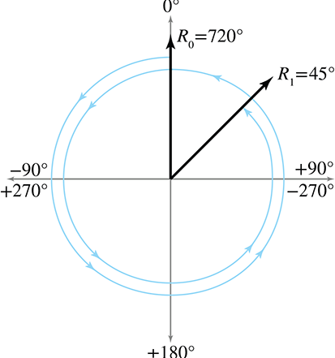

[<< Polar Coordinate Systems](polarspace.html)

[Contents](./)

[Geometric Primitives >>](geomprims.html)

Chapter 8 

Rotation in Three Dimensions

If you do not change direction,  
you may end up where you are heading.

— Lao Tzu (600–531 BCE)

This chapter tackles the difficult problem of describing the orientation of an object in 3D. It also discusses the closely related concepts of rotation and angular displacement. There are several different ways we can express orientation and angular displacement in 3D. Here we discuss the three most important methods—matrices, Euler angles, and quaternions—as well as two lesser known forms—axis-angle and exponential map. For each method, we define precisely how the representation method works, and discuss the peculiarities, advantages, and disadvantages of the method.

Different techniques are needed in different circumstances, and each technique has its advantages and disadvantages. It is important to know not only how each method works, but also which technique is most appropriate for a particular situation and how to convert between representations.

The discussion of orientation in 3D is divided into the following sections:

*   [Section 8.1](#terminology) discusses the subtle differences between terms like “orientation,” “direction,” and “angular displacement.”
*   [Section 8.2](#matrix_form) describes how to express orientation using a matrix.
*   [Section 8.3](#euler_angles) describes how to express angular displacement using Euler angles.
*   [Section 8.4](#axis_angle_exponential_map) describes the axis-angle and exponential map forms.
*   [Section 8.5](#quaternions) describes how to express angular displacement using a quaternion.
*   [Section 8.6](#comparison_of_methods) compares and contrasts the different methods.
*   [Section 8.7](#converting_between_forms) explains how to convert an orientation from one form to another.

This chapter makes extensive use of the terms _object space_ and _upright space_. If you aren't familiar with these terms, you should flip back to [Section 3.2](multiplespaces.html#examples), where the terms were first introduced.

# 8.1What Exactly is “Orientation”?

Before we can begin to discuss how to describe orientation in 3D, let us first define exactly what it is that we are attempting to describe. The term _orientation_ is related to other similar terms, such as

*   direction
*   angular displacement
*   rotation.

Intuitively, we know that the “orientation” of an object basically tells us what direction the object is facing. However, “orientation” is not exactly the same as “direction.”

For example, a vector has a direction, but not an orientation. The difference is that when a vector points in a certain direction, you can twist the vector along its length (see [Figure 8.1](#twist_vector)), and there is no real change to the vector, since a vector has no thickness or dimension other than its length.

Figure 8.1 Twisting a vector results in no appreciable change to the vector

In contrast to a simple vector, consider an object, such as a jet, facing a certain direction. If we twist the jet (see [Figure 8.2](#twist_object)) in the same way that we twisted the vector, we _will_ change the _orientation_ of the jet. In [Section 8.3](#euler_angles), we refer to this twisting component of an object's orientation as _bank_.

Figure 8.2Twisting an object changes its orientation

The fundamental difference between direction and orientation is seen concretely by the fact that we can parameterize a direction in 3D with just two numbers (the spherical coordinate angles—see [Section 7.3.2](polarspace.html#spherical_coordinates)), whereas an orientation requires a minimum of three numbers (Euler angles—see [Section 8.3](#euler_angles)).

[Section 2.4.1](vectors.html#relative_position) discussed that it's impossible to describe the position of an object in absolute terms—we must always do so within the context of a specific reference frame. When we investigated the relationship between “points” and “vectors,” we noticed that specifying a position is actually the same as specifying an amount of translation from some other given reference point (usually the origin of some coordinate system).

In the same way, orientation cannot be described in absolute terms. Just as a position is given by a translation from some known point, an orientation is given by a _rotation_ from some known reference orientation (often called the “identity” or “home” orientation). The amount of rotation is known as an _angular displacement_. In other words, describing an orientation is mathematically equivalent to describing an angular displacement.

We say “mathematically equivalent” because in this book, we make a subtle distinction between “orientation” and terms such as “angular displacement” and “rotation.” It is helpful to think of an “angular displacement” as an operator that accepts an input and produces an output. A particular direction of transformation is implied; for example, the angular displacement _from_ the old orientation _to_ the new orientation, or _from_ upright space _to_ object space. An example of an angular displacement is, “Rotate 90 o about the z \-axis.” It's an action that we can perform on a vector.

However, we frequently encounter state variables and other situations in which this operator framework of input/output is not helpful and a parent/child relationship is more natural. We tend to use the word “orientation” in those situations. An example of an orientation is, “Standing upright and facing east.” It describes a state of affairs.

Of course, we can describe the orientation “standing upright and facing east” as an angular displacement by saying, “Stand upright, facing north, and then rotate 90 o about the z \-axis.” This distinction between orientation and angular displacement is similar to the distinction between points and vectors, which are two other terms that are equivalent mathematically but not identical conceptually. In both cases, the first term is used primarily to describe a single state, and the second term primarily used to describe a difference between two states. Of course, these conventions are purely a matter of preference, but they can be helpful.

You might also hear the word “attitude” used to refer the orientation of an object, especially if that object is an aircraft.

# 8.2Matrix Form

One way to describe the orientation of a coordinate space in 3D is to tell which way the basis vectors of that coordinate space (the +x , +y , and +z axes) point. Of course, we don't measure these vectors in the coordinate space we are attempting to describe—by definition, they are \[1,0,0\] , \[0,1,0\] , and \[0,0,1\] no matter what orientation the coordinate space is in. We must describe the basis vectors using some _other_ coordinate space. By doing so, we've established the relative orientation of the two coordinate spaces.

When these basis vectors are used to form the rows of a 3×3 matrix, we have expressed the orientation in _matrix form_.[1](#footnote_1) Another way of saying all this is that we can express the relative orientation of two coordinate spaces by giving a rotation matrix that can be used to transform vectors from one coordinate space to the other.

Figure 8.3 Defining an orientation using a matrix

## 8.2.1Which Matrix?

We have already seen how a matrix can be used to transform points from one coordinate space to another. In [Figure 8.3](#matrix_form_tripod), the matrix in the upper right-hand corner can be used to rotate points from the object space of the jet into upright space. We've pulled out the rows of this matrix to emphasize their direct relationship to the coordinates for the jet's body axes. The rotation matrix contains the object axes, expressed in upright space. Simultaneously, it is a rotation matrix: we can multiply row vectors by this matrix to transform those vectors from object-space coordinates to upright-space coordinates.

Legitimate question to ask are: Why does the matrix contain the body axes expressed using upright-space coordinates? Why not the upright axes expressed in object-space coordinates? Another way to phrase this is, Why did we choose to give a rotation matrix that transforms vectors from object space to upright space? Why not from upright space to object space?

From a mathematical perspective, this question is a bit ridiculous. Because rotation matrices are orthogonal, their inverse is the same as their transpose (see [Section 6.3.2](matrixmore.html#orthogonal_matrices_geometry)). Thus, the decision is entirely a cosmetic one.

But practically speaking, in our opinion, it is quite important. At issue is whether you can write code that is intuitive to read and works the first time, or whether it requires a lot of work to decipher, or a knowledge of conventions that are not stated because they are “obvious” to everyone but you. So please allow us a brief digression to continue a line of thought begun when we introduced the term “upright space” in [Section 3.2.4](multiplespaces.html#upright_space) concerning the practical aspects of what happens when the math of coordinate space transformations gets translated into code. Also please allow some latitude to express some opinions based on our observations watching programmers grapple with rotation matrices. We don't expect that everyone will agree with our assertions, but we hope that every reader will at least appreciate the value in considering these issues.

Certainly every good math library will have a 3×3 matrix class that can represent any arbitrary transformation, which is to say that it makes no assumptions about the value of the matrix elements. (Or perhaps it is a 4×4 matrix that can do projection, or a 4×3 which can do translation but not projection—those distinctions are not important here.) For a matrix like this, the operations inherently are in terms of some input coordinate space and an output coordinate space. This is just implicit in the idea of matrix multiplication. If you need to go from output to input, then you must obtain the inverse of the matrix.

It is common practice to use the generic transform matrix class to describe the orientation of an object. In this case, rotation is treated just like any other transformation. The interface remains in terms of a source and destination space. Unfortunately, it is our experience that the following two matrix operations are by far the most commonly used:[2](#footnote_2)

*   Take an object-space vector and express it in upright coordinates.
*   Take an upright-space vector and express it in object coordinates.

Notice that we need to be able to go in both directions. We have no experience or evidence that either direction is significantly more common than the other. But more important, the very nature of the operations and the way programmers think about the operations is in terms of “object space” and “upright space” (or some other equivalent terminology, such as “parent space” and “child space”). We do _not_ think of them in terms of a source space and a destination space. It is in this context that we wish to consider the question posed at the beginning of this section: Which matrix should we use?

First, we should back up a bit and remind ourselves of the mathematically moot but yet conceptually important distinction between orientation and angular displacement. (See the notes on terminology at the end of [Section 8.1](#terminology).) If your purpose is to create a matrix that performs a specific angular displacement (for example, “rotate 30 degrees about the x \-axis”), then the two operations above are not really the ones you probably have in your head, and using a generic transform matrix with its implied direction of transformation is no problem, and so this discussion does not apply. Right now, we are focusing on the situation in which the orientation of some object is stored as a state variable.

Let's assume that we adopt the common policy and store orientation using the generic transformation matrix. We are forced to arbitrarily pick a convention, so let's decide that multiplication by this matrix will transform from object to upright space. If we have a vector in upright space and we need to express it in object-space coordinates, we must multiply this vector by the inverse[3](#footnote_3) of the matrix.

Now let's see how our policy affects the code that is written and read hundreds of times by average game programmers.

*   _Rotate some vector from object space to upright space_ is translated into code as multiplication by the matrix.
*   _Rotate a vector from upright space to object space_ is translated into code as multiplication by the inverse (or transpose) of the matrix.

Notice that the code does not match one-to-one with the high-level intentions of the programmer. It forces every user to remember what the conventions are every time they use the matrix. It is our experience that this coding style is a contributing factor to the difficulty that beginning programmers have in learning how to use matrices; they often end up transposing and negating things randomly when things don't look right.

We have found it helpful to have a special 3×3 matrix class that is used exclusively for storing the orientation of an object, not for arbitrary transforms. The class assumes, as an invariant, that the matrix is orthogonal, meaning it contains only rotation. (We also would probably assume that the matrix does not contain a reflection, even though that is possible in an orthogonal matrix.) With these assumptions in place, we are now free to perform rotations using the matrix at a higher level of abstraction. Our interface functions match exactly the high-level intentions of the programmer. Furthermore, we have removed the confusing linear algebra details having to do with row vectors versus column vectors, which space is on the left or right, which way is the regular way and which is the inverse, and so forth. Or rather, we have confined such details to the class internals—the person implementing the class certainly needs to pick a convention (and hopefully document it). In fact, in this specialized matrix class, the operations of “multiply a vector” and “invert this matrix” really are not that useful. We would advocate keeping this dedicated matrix class confined to operations in terms of upright space and object space, rather than multiply a vector.

So, back to the question posed at the start of this section: Which matrix should we use? Our answer is, “It shouldn't matter.” By that we mean there is a way to design your matrix code in such a way that it can be used without knowing what choice was made. As far as the C++ code goes, this is purely a cosmetic change. For example, perhaps we just replace the function name multiply() with objectToUpright(), and likewise we replace multiplyByTranspose() with uprightToObject(). The version of the code with descriptive, named coordinate spaces is easier to read and write.

## 8.2.2Direction Cosines Matrix

You might come across the (very old school) term _direction cosines_ in the context of using a matrix to describe orientation. A direction cosines matrix is the same thing as a rotation matrix; the term just refers to a special way to interpret (or construct) the matrix, and this interpretation is interesting and educational, so let's pause for a moment to take a closer look. Each element in a rotation matrix is equal to the dot product of a cardinal axis in one space with a cardinal axis in the other space. For example, the center element m 22 in a 3×3 matrix gives the dot product that the y \-axis in one space makes with the y \-axis in the other space.

More generally, let's say that the basis vectors of a coordinate space are the mutually orthogonal unit vectors p , q , and r , while a second coordinate space with the same origin has as its basis a different (but also orthonormal) basis p ′ , q ′ , and r ′ . (Please allow us to break from convention by dropping all the hats from the unit vectors in this section, to avoid distracting clutter in the equations.) The rotation matrix that rotates row vectors from the first space to the second can be constructed from the cosines of the angles between each pair of basis vectors. Of course, the dot product of two unit vectors is exactly equal to the cosine of the angle between them, so the matrix product is

(8.1) v \[  p ⋅ p ′ q ⋅ p ′ r ⋅ p ′ p ⋅ q ′ q ⋅ q ′ r ⋅ q ′ p ⋅ r ′ q ⋅ r ′ r ⋅ r ′\] \= v ′.

These axes can be interpreted as geometric rather than numeric entities, so it really does not matter what coordinates are used to describe the axes (provided we use the same coordinate space to describe all of them), the rotation matrix will be the same.

For example, let's say that our axes are described using coordinates relative to the first basis. Then p , q , and r have the trivial forms \[1,0,0\] , \[0,1,0\] and \[0,0,1\] , respectively. The basis vectors of the second space, p ′ , q ′ , and r ′ have arbitrary coordinates. When we substitute the trivial vectors p , q , and r into the matrix in [Equation (8.1)](#direction_cosines) and expand the dot products, we get

\[ \[1,0,0\]⋅ p ′\[0,1,0\]⋅ p ′\[0,0,1\]⋅ p ′\[1,0,0\]⋅ q ′\[0,1,0\]⋅ q ′\[0,0,1\]⋅ q ′\[1,0,0\]⋅ r ′\[0,1,0\]⋅ r ′\[0,0,1\]⋅ r ′\] \= \[ px′py′pz′qx′qy′qz′rx′ry′rz′\] \= \[ − p ′− − q ′− − r ′− \] .

In other words, the rows of the rotation matrix are the basis vectors of the output coordinate space, expressed by using the coordinates of the input coordinate space. Of course, this fact is not just true for rotation matrices, it's true for _all_ transformation matrices. This is the central idea of why a transformation matrix works, which was developed in [Section 4.2](matrixintro.html#geometric_definition).

Now let's look at the other case. Instead of using coordinates relative to the first basis, we'll measure everything using the second coordinate space (the output space). This time, p ′ , q ′ , and r ′ have trivial forms, and p , q , and r are arbitrary. Putting these into the direction cosines matrix produces

\[  p ⋅\[1,0,0\] q ⋅\[1,0,0\] r ⋅\[1,0,0\] p ⋅\[0,1,0\] q ⋅\[0,1,0\] r ⋅\[0,1,0\] p ⋅\[0,0,1\] q ⋅\[0,0,1\] r ⋅\[0,0,1\]\] \= \[  p x q x r x p y q y r y p z q z r z \] \= \[ | | | p T q T r T | | | \] .

This says that the _columns_ of the rotation matrix are formed from the basis vectors of the input space, expressed using the coordinates of the output space. This is _not_ true of transformation matrices in general; it applies only to orthogonal matrices such as rotation matrices.

Also, remember that our convention is to use row vectors on the left. If you are using column vectors on the right, things will be transposed.

## 8.2.3Advantages of Matrix Form

Matrix form is a very explicit form of representing orientation. This explicit nature provides some benefits.

*   Rotation of vectors is immediately available. The most important property of matrix form is that you can use a matrix to rotate vectors between object and upright space. No other representation of orientation allows this[4](#footnote_4)—to rotate vectors, we must convert the orientation to matrix form.
*   Format used by graphics APIs. Partly due to reasons in the previous item, graphics APIs use matrices to express orientation. (API stands for Application Programming Interface. Basically, this is the code we use to communicate with the graphics hardware.) When we are communicating with the API, we are going to have to express our transformations as matrices. How we store transformations internally in our program is up to us, but if we choose another representation, we are going to have to convert them into matrices at some point in the graphics pipeline.
*   Concatenation of multiple angular displacements. A third advantage of matrices is that it is possible to “collapse” nested coordinate space relationships. For example, if we know the orientation of object A relative to object B, and we know the orientation of object B relative to object C, then by using matrices, we can determine the orientation of object A relative to object C. We encountered these concepts before when we discussed nested coordinate spaces in [Chapter 3](multiplespaces.html), and then we discussed how matrices could be concatenated in [Section 5.6](matrixtransforms.html#combining_transformations).
*   Matrix inversion. When an angular displacement is represented in matrix form, it is possible to compute the “opposite” angular displacement by using matrix inversion. What's more, since rotation matrices are orthogonal, this computation is a trivial matter of transposing the matrix.

## 8.2.4Disadvantages of Matrix Form

The explicit nature of a matrix provides some advantages, as we have just discussed. However, a matrix uses nine numbers to store an orientation, and it is possible to parameterize orientation with only three numbers. The “extra” numbers in a matrix can cause some problems.

*   Matrices take more memory. If we need to store many orientations (for example, keyframes in an animation sequence), that extra space for nine numbers instead of three can really add up. Let's take a modest example. Let's say we are animating a model of a human that is broken up into 15 pieces for different body parts. Animation is accomplished strictly by controlling the orientation of each part relative to its parent part. Assume we are storing one orientation for each part, per frame, and our animation data is stored at a modest rate, say, 15 Hz. This means we will have 225 orientations per second. Using matrices and 32-bit floating point numbers, each frame will take 8,100 bytes. Using Euler angles (which we will meet next in [Section 8.3](#euler_angles)), the same data would take only 2,700 bytes. For a mere 30 seconds of animation data, matrices would take 162K more than the same data stored using Euler angles!
*   Difficult for humans to use. Matrices are not intuitive for humans to work with directly. There are just too many numbers, and they are all between −1 and +1 . What's more, humans naturally think about orientation in terms of angles, but a matrix is expressed in terms of vectors. With practice, we can learn how to decipher the orientation from a given matrix. (The techniques from [Section 4.2](matrixintro.html#geometric_definition) for visualizing a matrix help a lot for this.) But still, this is much more difficult than Euler angles. And going the other way is _much_ more difficult—it would take forever to construct the matrix for a nontrivial orientation by hand. In general, matrices just aren't the way people naturally think about orientation.
*   Matrices can be ill-formed. As we have said, a matrix uses nine numbers, when only three are necessary. In other words, a matrix contains six degrees of redundancy. There are six constraints that must be satisfied for a matrix to be “valid” for representing an orientation. The rows must be unit vectors, and they must be mutually perpendicular (see [Section 6.3.2](matrixmore.html#orthogonal_matrices_geometry)).

Let's consider this last point in more detail. If we take any nine numbers at random and create a 3×3 matrix, it is very unlikely that these six constraints will be satisfied, and thus the nine numbers will not form a valid rotation matrix. In other words, matrices can be ill-formed, at least for purposes of representing an orientation. Ill-formed matrices can be a problem because they can lead to numerical exceptions, weird stretched graphics, and other unexpected behavior.

How could we ever end up with a bad matrix? There are several ways:

*   We may have a matrix that contains scale, skew, reflection, or projection. What is the “orientation” of an object that has been affected by such operations? There really isn't a clear definition for this. Any nonorthogonal matrix is not a well-defined rotation matrix. (See [Section 6.3](matrixmore.html#orthogonal_matrices) for a complete discussion on orthogonal matrices.) And reflection matrices (which are orthogonal) are not valid rotation matrices, either.
*   We may just get bad data from an external source. For example, if we are using a physical data acquisition system, such as motion capture, there could be errors due to the capturing process. Many modeling packages are notorious for producing ill-formed matrices.
*   We can actually _create_ bad data due to floating point round off error. For example, suppose we apply a large number of incremental changes to an orientation, which could routinely happen in a game or simulation that allows a human to interactively control the orientation of an object. The large number of matrix multiplications, which are subject to limited floating point precision, can result in an ill-formed matrix. This phenomenon is known as _matrix creep_. We can combat matrix creep by _orthogonalizing_ the matrix, as we already discussed in [Section 6.3.3](matrixmore.html#orthonogal_matrices_orthogonalizing).

## 8.2.5Summary of Matrix Form

Let's summarize what [Section 8.2](#matrix_form) has said about matrices.

*   Matrices are a “brute force” method of expressing orientation: we explicitly list the basis vectors of one space in the coordinates of some different space.
*   The term _direction cosines matrix_ alludes to the fact that each element in a rotation matrix is equal to the dot product of one input basis vector with one output basis vector. Like all transformation matrices, the rows of the matrix are the output-space coordinates of the input-space basis vectors. Furthermore, the columns of a rotation matrix are the input-space coordinates of the output-space basis vectors, a fact that is only true by virtue of the orthogonality of a rotation matrix.
*   The matrix form of representing orientation is useful primarily because it allows us to rotate vectors between coordinate spaces.
*   Modern graphics APIs express orientation by using matrices.
*   We can use matrix multiplication to collapse matrices for nested coordinate spaces into a single matrix.
*   Matrix inversion provides a mechanism for determining the “opposite” angular displacement.
*   Matrices can take two to three times as much memory as other techniques. This can become significant when storing large numbers of orientations, such as animation data.
*   The numbers in a matrix aren't intuitive for humans to work with.
*   Not all matrices are valid for describing an orientation. Some matrices contain mirroring or skew. We can end up with a ill-formed matrix either by getting bad data from an external source or through matrix creep.

# 8.3Euler Angles

Another common method of representing orientation is known as _Euler angles_. (Remember, Euler is pronounced “oiler,” not “yoolur.”) The technique is named after the famous mathematician who developed them, Leonhard Euler (1707–1783). [Section 8.3.1](#euler_angles_description) describes how Euler angles work and discusses the most common conventions used for Euler angles. [Section 8.3.2](#euler_angles_other_conventions) discusses other conventions for Euler angles, including the important _fixed axis_ system. We consider the advantages and disadvantages of Euler angles in [Section 8.3.3](#euler_angles_advantages) and [Section 8.3.4](#euler_angles_disadvantages). [Section 8.3.5](#euler_angles_summary) summarizes the most important concepts concerning of Euler angles.

This section utilizes many ideas, terms, and conventions from [Section 7.3.2](polarspace.html#spherical_coordinates) concerning spherical coordinates.

## 8.3.1What Are Euler Angles?

The basic idea behind Euler angles is to define an angular displacement as a sequence of three rotations about three mutually perpendicular axes. This sounds complicated, but actually it is quite intuitive. (In fact, its ease of use by humans is one of its primary advantages.)

So Euler angles describe orientation as three rotations about three mutually perpendicular axes. But which axes? And in what order? As it turns out, any three axes in any order will work, but most people have found it practical to use the cardinal axes in a particular order. The most common convention, and the one we use in this book, is the so-called “heading-pitch-bank” convention for Euler angles. In this system, an orientation is defined by a _heading_ angle, a _pitch_ angle, and a _bank_ angle.

Before we define the terms heading, pitch, and bank precisely, let us briefly review the coordinate space conventions we use in this book. We use a left-handed system, where +x is to the right, +y is up, and +z is forward. (Check out [Figure 1.15](cartesianspace.html#3d_conventions) for an illustration.) Also, if you have forgotten how positive rotation is defined according to the left-hand rule, you might want to flip back to [Figure 1.14](cartesianspace.html#left_vs_right_rotation) to refresh your memory.

Given heading, pitch, and bank angles, we can determine the orientation described by these Euler angles using a simple four-step process.

Step 1.Begin in the “identity” orientation—that is, with the object-space axes aligned with the upright axes.  

Figure 8.4Step 1: An object in its identity orientation

Step 2.Perform the _heading_ rotation, rotating about the y \-axis, as shown in [Figure 8.5](#jet_heading). Positive rotation rotates to the right (clockwise when viewed from above).  

Figure 8.5 Step 2: Heading is the first rotation and rotates about the vertical axis

Step 3.After heading has been applied, _pitch_ measures the amount of rotation about the x \-axis. This is the object-space x \-axis, not the upright x \-axis. Staying consistent with the left-hand rule, positive rotation rotates _downward_. In other words, pitch actually measures the angle of _declination_. This is illustrated in [Figure 8.6](#jet_pitch).  

Figure 8.6 Step 3: Pitch is the second rotation and rotates about the object lateral axis

Step 4.After heading and pitch angles have been applied, _bank_ measures the amount of rotation about the z \-axis. Again, this is the object-space z \-axis, not the original upright-space z \-axis. The left-hand rule dictates that positive bank rotates counterclockwise when viewed from the origin looking towards +z . This is illustrated in [Figure 8.7](#jet_bank).  

Figure 8.7 Step 4: Bank is the third and final rotation and rotates about the object longitudinal axis

  
It may seem contradictory that positive bank is counterclockwise, since positive heading is clockwise. But notice that positive heading is clockwise when viewed from the positive end of the axis towards the origin, the opposite perspective from the one used when judging clockwise/counterclockwise for bank. If we look from the origin to the positive end of the y \-axis, then positive heading does rotate counterclockwise. Or if we look from the positive end of the z \-axis towards the origin (looking backward from in front of the object), then positive bank appears to rotate the object clockwise. In either case, the left-hand rule prevails.

Now you have reached the orientation described by the Euler angles. Notice the similarity of Steps 1–3 to the procedure used in [Section 7.3.2](polarspace.html#spherical_coordinates) to locate the direction described by the spherical coordinate angles. In other words, we can think of heading and pitch as defining the basic direction that the object is facing, and bank defining the amount of twist.

## 8.3.2Other Euler Angle Conventions

The heading-pitch-bank system described in the previous section isn't the only way to define a rotation using three angles about mutually perpendicular axes. There are many variations on this theme. Some of these differences turn out to be purely nomenclature; others are more meaningful. Even if you like our conventions, we encourage you to not skip this section, as some very important concepts are discussed; these topics are the source of much confusion, which we hope to dispel.

First of all, there is the trivial issue of naming. The most common variation you will find was made popular by the field of aerospace, the _yaw-pitch-roll_ method.[5](#footnote_5) The term “roll” is completely synonymous with bank, and for all purposes they are identical. Similarly, within the limited context of yaw-pitch-roll, the term “yaw” is practically identical to the term heading. (However, in a broader sense, the word “yaw” actually has a subtly different meaning, and it is this subtle difference that drives our preference for the term _heading_. We discuss this rather nit-picky distinction in just a moment, but for the moment yaw and heading are the same.) So essentially yaw-pitch-roll is the same system as heading-pitch-bank.

Other less common terms are often used. Heading also goes by the name _azimuth_. The vertical angle that we call pitch is also called attitude or _elevation_. The final angle of rotation, which we call “bank,” is sometimes called _tilt_ or _twist_.

And, of course, there are those perverse mathematicians who (motivated by the need to save space when writing on a chalkboard?) insist on assaulting your eyeballs with a slew of Greek letters. You may see any of the following:

It's all Greek to us

(ϕ,θ,ψ)

(ψ,θ,ϕ)

(Ω,i,ω)

(α,βγ) .

Of course, these are cosmetic differences. Perhaps more interesting is that fact that you will often hear these same three words listed in the opposite order: roll-pitch-yaw. (A quick Google search for “roll pitch yaw” or “yaw pitch roll” yields plenty of results for both forms, with neither appearing more predominant.) Considering how the order of rotations is so critical, are people really that perverse that they choose to list them in the reverse order? We're not just dwelling on terminology here; the distinctions in thinking hinted at by the differences in terminology will actually become useful when we consider how to convert Euler angles to a rotation matrix. As it turns out, there is a perfectly reasonable explanation for this “backwards” convention: it's the order in which we actually do the rotations inside a computer!

The _fixed-axis_ system is very closely related to the Euler angle system. In an Euler angle system, the rotation occurs about the _body_ axes, which change after each rotation. Thus, for example, the physical axis for the bank angle is always the longitudinal body space axis, but in general it is arbitrarily oriented in upright space. In a fixed-axis system, in contrast, the axes of rotation are always the fixed, _upright_ axes. But as it turns out, the fixed-axis system and the Euler angle system are actually equivalent, _provided that we take the rotations in the opposite order_.

You should visualize the following example to convince yourself this is true. Let's say we have a heading (yaw) of h and a pitch of p . (We'll ignore bank/roll for the moment.) According to the Euler angle convention, we first do the heading axis and rotate about the vertical axis (the y \-axis) by h . Then we rotate about the _object-space_ lateral axis (the x \-axis) by the angle p . Using a fixed-axis scheme, we arrive at this same ending orientation by doing the rotations in the opposite order. First, we do the pitch, rotating about the upright x \-axis by p . Then, we perform the heading rotation, rotating about the upright y \-axis by h . Although we might visualize Euler angles, inside a computer when rotating vectors from upright space to object space, we actually use a fixed-axis system. We discuss this in greater detail in [Section 8.7.1](#euler_to_matrix), when we show how to convert Euler angles to a rotation matrix. The fixed-axis conventions are also called _extrinsic_, the typical Euler angle conventions being referred to as _intrinsic_.

Euler angles rotate about the body axes, so the axis of rotation for a given step depends on the angles used in prior rotations. In the fixed-axis system, the axes of rotation are always the same—the upright axes. The two systems are equivalent, provided that the rotations are performed in the opposite order.

Now we'd like to make a brief but humble campaign for a more precise use of the term “yaw.” A lot of aeronautical terminology is inherited nautical terminology.[6](#footnote_6) In a nautical context, the original meaning of the word “yaw” was essentially the same thing as heading, both in terms of absolute angle and also a change in that angle. In the context of airplanes and other freely rotating bodies, however, we don't feel that yaw and heading are the same thing. A yawing motion produces a rotation about the _object_ y \-axis, whereas a change in heading produces a rotation about the _upright_ y \-axis. For example, when the pilot of an airplane uses the pedals to control the rudder, he is performing a _yaw_ rotation, because the rotation caused by the rudder is always about the object-space y \-axis of the plane. Imagine a plane diving straight down. If the pilot performs a 90 o yaw, the plane will end up “on its ear,” no longer looking downward, but looking towards the horizon, banked 90 o . This is illustrated in [Figure 8.8](#heading_vs_yaw).

Figure 8.8Heading versus yaw

In contrast, when players navigating a first-person shooter move the mouse from left to right, they are performing a _heading_ rotation. The rotation is always about the vertical axis (the upright y \-axis). If players are looking downward and move the mouse horizontally to perform a heading rotation, they continue to look downward and spin in place. The point is certainly not that heading is better than yaw because that's what we do in first-person shooters. The point is that a yawing motion cannot be accomplished by adjusting a single Euler angle, but a heading motion can. That's why we think “heading” is a better term: it's the action that results when you make an incremental change to the first Euler angle.

Alas, the same argument can be leveled against the term “pitch.” If bank is nonzero, an incremental change to the middle Euler angle does not produce a rotation about the object's lateral axis. But then, there isn't really a simple, good word to describe the angle that the object's longitudinal axis makes with the horizontal, which is what the middle Euler angle really specifies. (“Inclination” is no good as it is specific to the right-handed conventions.)

We hope you have read our opinions with the humility we intended, and also have received the more important message: investigating (seemingly cosmetic) differences in convention can sometimes lead us to a deeper understanding of the finer points. And then sometimes it's just plain nit-picking. Generations of aerospace engineers have been putting men on the moon and robots on Mars, and building airplanes that safely shuttle the authors to and from distant cities, all the while using the terms yaw and roll. Would you believe that some of these guys don't even know who we are!? Given the choice to pick your own terminology, we say to use the word “heading” when you can, but if you hear the word “yaw,” then for goodness sake don't make as big of a deal out of it as we have in these pages, especially if the person you are talking to is smarter than you.

Although in this book we do not follow the right-handed aerospace coordinate conventions (and we have a minor quibble about terminology), when it comes to the basic strategy of Euler angles, in a physical sense, we believe complete compliance with the wisdom of the aerospace forefathers is the only way to go, at least if your universe has some notion of “ground.” Remember that, in theory, any three axes can be used as the axes of rotation, in any order. But really, the conventions they chose are the only ones that make any practical sense, if you want the individual angles to be useful and meaningful. No matter how you label your axes, the first angle needs to rotate about the vertical, the second about the body lateral axis, and the third about the body longitudinal axis.

As if these weren't enough complications, let us throw in a few more. In the system we have been describing, each rotation occurs about a different body axes. However, Euler's own original system was a “symmetric” system in which the first and last rotations are performed around the _same_ axis. These methods are more convenient in certain situations, such as describing the motion of a top, where the three angles correspond to precession, nutation, and spin. You may encounter some purists who object to the name “Euler angles” being attached to an asymmetric system, but this usage is widespread in many fields, so rest assured that you outnumber them. To distinguish between the two systems, the symmetric Euler angles are sometimes called “proper” Euler angles, with the more common conventions being called _Tait-Bryan_ angles, first documented by the aerospace forefathers we mentioned [\[1\]](#reference_1). O'Reilly [\[10\]](#reference_10) discusses proper Euler angles, even _more_ methods of describing rotation, such as the Rodrigues vector, Cayley-Klein parameters, and interesting historical remarks. James Diebel's summary [\[3\]](#reference_3) compares different Euler angle conventions and the other major methods for describing rotation, much as this chapter does, but assumes a higher level of mathematical sophistication.

If you have to deal with Euler angles that use a different convention from the one you prefer, we offer two pieces of advice:

*   First, make sure you understand exactly how the other Euler angle system works. Little details such as the definition of positive rotation and order of rotations make a big difference.
*   Second, the easiest way to convert the Euler angles to your format is to convert them to matrix form and then convert the matrix back to your style of Euler angles. We will learn how to perform these conversions in [Section 8.7](#converting_between_forms). Fiddling with the angles directly is much more difficult than it would seem. See [\[12\]](#reference_12) for more information.

## 8.3.3Advantages of Euler Angles

Euler angles parameterize orientation using only three numbers, and these numbers are angles. These two characteristics of Euler angles provide certain advantages over other forms of representing orientation.

*   Euler angles are easy for humans to use—considerably easier than matrices or quaternions. Perhaps this is because the numbers in an Euler angle triple are _angles_, which is naturally how people think about orientation. If the conventions most appropriate for the situation are chosen, then the _most practical_ angles can be expressed directly. For example, the angle of declination is expressed directly by the heading-pitch-bank system. This ease of use is a serious advantage. When an orientation needs to be displayed numerically or entered at the keyboard, Euler angles are really the only choice.
*   Euler angles use the smallest possible representation. Euler angles use three numbers to describe an orientation. No system can parameterize 3D orientation using fewer than three numbers. If memory is at a premium, then Euler angles are the most economical way to represent an orientation.  
    Another reason to choose Euler angles when you need to save space is that the numbers you are storing are more easily compressed. It's relatively easy to pack Euler angles into a smaller number of bits using a trivial fixed-precision system. Because Euler angles are _angles_, the data loss due to quantization is spread evenly. Matrices and quaternions require using very small numbers, because the values stored are sines and cosines of the angles. The absolute numeric difference between two values is not proportionate to the perceived difference, however, as it is with Euler angles. In general, matrices and quaternions don't pack into a fixed-point system easily.  
    Bottom line: if you need to store a lot of 3D rotational data in as little memory as possible, as is very common when handling animation data, Euler angles (or the exponential map format—to be discussed in [Section 8.4](#axis_angle_exponential_map)) are the best choices.
*   Any set of three numbers is valid. If we take any three numbers at random, they form a valid set of Euler angles that we can interpret as an expression of an orientation. In other words, there is no such thing as an invalid set of Euler angles. Of course, the numbers may not be _correct_ but at least they are _valid_. This is not the case with matrices and quaternions.

## 8.3.4Disadvantages of Euler Angles

This section discusses some disadvantages of the Euler angle method of representing orientation; primarily,

*   The representation for a given orientation is not unique.
*   Interpolating between two orientations is problematic.

Let's address these points in detail. First, we have the problem that for a given orientation, there are many different Euler angle triples that can be used to describe that orientation. This is known as _aliasing_ and can be somewhat of an inconvenience. These irritating problems are very similar to those we met dealing with spherical coordinates in [Section 7.3.4](polarspace.html#spherical_aliasing). Basic questions such as “Do two Euler angle triples represent the same angular displacement?” are difficult to answer due to aliasing.

We've seen one trivial type of aliasing before with polar coordinates: adding a multiple of 360 o does not change the orientation expressed, even though the numbers are different.

A second and more troublesome form of aliasing occurs because the three angles are not completely independent of each other. For example, pitching down 135° is the same as heading 180°, pitching down 45°, and then banking 180°.

To deal with aliasing of spherical coordinates, we found it useful to establish a _canonical set_; any given point has a unique representation in the canonical set that is the “official” way to describe that point using polar coordinates. We use a similar technique for Euler angles. In order to guarantee a unique Euler angle representation for any given orientation, we restrict the ranges of the angles. One common technique is to limit heading and bank to (−180 o , +180 o \] and to limit pitch to \[−90 o , +90 o \] . For any orientation, there is only one Euler angle triple in the canonical set that represents that orientation. (Actually, there is one more irritating singularity that must be handled, which we describe in just a moment.) Using canonical Euler angles simplifies many basic tests such as “am I facing approximately east?”

The most famous (and irritating) type of aliasing problem suffered by Euler angles is illustrated by this example: if we head right 45 o and then pitch down 90 o , this is the same as pitching down 90°and then banking 45°. In fact, once we chose ±90 o as the pitch angle, we are restricted to rotating about the vertical axis. This phenomenon, in which an angle of ±90 o for the second rotation can cause the first and third rotations to rotate about the same axis, is known as _Gimbal lock_. To remove this aliasing from the canonical set of Euler angle triples, we assign all rotation about the vertical axis to _heading_ in the Gimbal lock case. In other words, in the canonical set, if pitch is ±90 o , then bank is zero.

This last rule for Gimbal lock completes the rules for the canonical set of Euler angles:

Conditions satisfied by Euler angles in the canonical set

−180 o <h≤180 o −90 o ≤p≤90 o −180 o <b≤180 o p\= ±90 o   ⇒  b\=0.

When writing C++ that accepts Euler angle arguments, it's usually best to ensure that they work given Euler angles in any range. Luckily this is usually easy; things frequently just work without taking any extra precaution, especially if the angles are fed into trig functions. However, when writing code that computes or _returns_ Euler angles, it's good practice to return the canonical Euler angle triple. The conversion methods shown in [Section 8.7](#converting_between_forms) demonstrate these principles.

Figure 8.9 Naïve interpolation can cause excessive rotation

A common misconception is that, because of Gimbal lock, certain orientations cannot be described using Euler angles. Actually, for the purposes of _describing_ an orientation, aliasing doesn't pose any problems. To be clear, _any_ orientation in 3D can be described by using Euler angles, and that representation is unique within the canonical set. Also, as we mentioned in the previous section, there is no such thing as an “invalid” set of Euler angles. Even if the angles are outside the usual range, we can always agree on what orientation is described by the Euler angles.

So for purposes of simply _describing_ orientation, aliasing isn't a huge problem, especially when canonical Euler angles are used. So what's so bad about aliasing and Gimbal lock? Let's say we wish to interpolate between two orientations R 0 and R 1 . In other words, for a given parameter t , 0≤t≤1 , we wish to compute an intermediate orientation R (t) that interpolates smoothly from R 0 to R 1 as t varies from 0 to 1 . This is an extremely useful operation for character animation and camera control, for example.

Figure 8.10 Naïve interpolation can rotate the long way around.

The naïve approach to this problem is to apply the standard linear interpolation formula (“lerp”) to each of the three angles independently:

Simple linear interpolation between two angles

Δθ\=θ1−θ0,θt\=θ0+tΔθ.

This is fraught with problems.

First, if canonical Euler angles are not used, we may have large angle values. For example, imagine the heading of R 0 , denoted h0 , is 720°. Assume h1\=45 o . Now, 720 o \=2×360 o , which is the same as 0°, so basically the h1 and h2 are only 45° apart. However, naïve interpolation will spin around nearly twice in the wrong direction, as shown in [Figure 8.9](#euler_angle_interpolation_problem_1).

Of course, the solution to this problem is to use canonical Euler angles. We could assume that we will always be interpolating between two sets of canonical Euler angles. Or we could attempt to enforce this by converting to canonical values inside our interpolation routine. (Simply wrapping angles within the (−180 o , +180 o \] range is easy, but dealing with pitch values outside the \[−90 o , +90 o \] range is more challenging.)

However, even using canonical angles doesn't completely solve the problem. A second type of interpolation problem can occur because of the cyclic nature of rotation angles. Suppose h0\=−170 o and h1\=170 o . Notice that these are canonical values for heading, both in the range (−180 o , +180 o \] . The two heading values are only 20 o apart, but again, naïve interpolation will not behave correctly, rotating the long way around by a clockwise rotation of 340 o instead of taking the shorter counterclockwise path of 20 o , as shown in [Figure 8.10](#euler_angle_interpolation_problem_2).

The solution to this second type of problem is to wrap the differences between angles used in the interpolation equation in the range (−180 o , +180 o \] in order to find the shortest arc. To do this, we introduce the notation

Wrapping an angle between ±180 o

wrapPi (x)\=x−360 o ⌊ (x+180 o ) / 360 o ⌋,

where ⌊⋅⌋ denotes the floor function.

The wrapPi function is a small, sharp tool that every game programmer should have in their toolbox. It elegantly handles common situations in which we must account for the cyclic nature of angles. It works by adding or subtracting the appropriate multiple of 360 o . [Listing 8.1](#wrapPi) shows how it would be implemented in C.

float wrapPi(float theta) {

    // Check if already in range.  This is not strictly necessary,
    // but it will be a very common situation.  We don't want to
    // incur a speed hit and perhaps floating precision loss if
    // it's not necessary
    if (fabs(theta) <= PI) {

        // One revolution is 2 PI.
        const float TWOPPI = 2.0f\*PI;

        // Out of range.  Determine how many "revolutions"
        // we need to add.
        float revolutions = floor((theta + PI) \* (1.0f/TWOPPI));

        // Subtract it off
        theta -= revolutions\*TWOPPI;
    }

    return theta;
}

Let's go back to Euler angles. As expected, using wrapPi () makes it easy to take the shortest arc when interpolating between two angles:

Taking the shortest arc when interpolating between two angles

Δθ\= wrapPi (θ1−θ0),θt\=θ0+tΔθ.

But even with these two Band-Aids, Euler angle interpolation still suffers from Gimbal lock, which in many situations causes a jerky, unnatural course. The object whips around suddenly and appears to be hung somewhere. The basic problem is that the angular velocity is not constant during the interpolation. If you have never experienced what Gimbal lock looks like, you may be wondering what all the fuss is about. Unfortunately, it is very difficult to fully appreciate the problem from illustrations in a book—you need to experience it in real time. Fortunately, though, it's easy to find an animation demonstrating the problem: just do a [youtube.com](https://youtube.com) search for “gimbal lock.”

The first two problems with Euler angle interpolation were irritating, but certainly not insurmountable. Canonical Euler angles and wrapPi provide relatively simple workarounds. Gimbal lock, unfortunately, is more than a minor nuisance; it's a fundamental problem. Could we perhaps reformulate our rotations and devise a system that does not suffer from these problems? Unfortunately, this is not possible. There is simply an inherent problem with using three numbers to describe 3D orientation. We could change our problems, but not eliminate them. Any system that parameterizes 3-space orientation using three numbers is guaranteed to have singularities in the parameterization space and therefore be subject to problems such as Gimbal lock. The exponential map form (see [Section 8.4](#axis_angle_exponential_map)), a different scheme for parameterizing 3D rotation with three numbers, manages to consolidate the singularities to a single point: the antipodes. This behavior is more benign for certain practical situations, but it does not remove the singularities completely. To do that, we must use quaternions, which are discussed in [Section 8.5](#quaternions).

## 8.3.5Summary of Euler Angles

Let's summarize our findings from [Section 8.3](#euler_angles) about Euler angles.

*   Euler angles store orientation by using three angles. These angles are ordered rotations about the three object-space axes.
*   The most common system of Euler angles is the heading-pitch-bank system. Heading and pitch tell which way the object is facing—heading gives a “compass reading” and pitch measures the angle of declination. Bank measures the amount of “twist.”
*   In a fixed-axis system, the rotations occur about the upright axes rather than the moving body axes. This system is equivalent to Euler angles, provided that we perform the rotations in the opposite order.
*   Lots of smart people use lots of different terms for Euler angles, and they can have good reasons for using different conventions.[7](#footnote_7) It's best not to rely on terminology when using Euler angles. Always make sure you get a precise working definition, or you're likely to get very confused.
*   In most situations, Euler angles are more intuitive for humans to work with compared to other methods of representing orientation.
*   When memory is at a premium, Euler angles use the minimum amount of data possible for storing an orientation in 3D, and Euler angles are more easily compressed than quaternions.
*   There is no such thing as an invalid set of Euler angles. Any three numbers have a meaningful interpretation.
*   Euler angles suffer from aliasing problems due to the cyclic nature of rotation angles and because the rotations are not completely independent of one another.
*   Using canonical Euler angles can simplify many basic queries on Euler angles. An Euler angle triple is in the canonical set if heading and bank are in the range (−180 o , +180 o \] and pitch is in the range \[−90 o , +90 o \] . What's more, if pitch is ±90 o , then bank is zero.
*   Gimbal lock occurs when pitch is ±90 o . In this case, one degree of freedom is lost because heading and bank both rotate about the vertical axis.
*   Contrary to popular myth, _any_ orientation in 3D can be represented by using Euler angles, and we can agree on a unique representation for that orientation within the canonical set.
*   The wrapPi function is a very handy tool that simplifies situations in which we have to deal with the cyclic nature of angles. Such situations arise frequently in practice, especially in the context of Euler angles, but at other times as well.
*   Simple forms of aliasing are irritating, but there are workarounds. Gimbal lock is a more fundamental problem with no easy solution. Gimbal lock is a problem because the parameter space of orientation has a discontinuity. This means small changes in orientation can result in large changes in the individual angles. Interpolation between orientations using Euler angles can freak out or take a wobbly path.

# 8.4Axis-Angle and Exponential Map  
Representations

Euler's name is attached to all sorts of stuff related to rotation (we just discussed Euler angles in [Section 8.3](#euler_angles)). His name is also attached to _Euler's rotation theorem_, which basically says that any 3D angular displacement can be accomplished via a _single_ rotation about a carefully chosen axis. To be more precise, given any two orientations R 1 and R 2 , there exists an axis n ^ such that we can get from R 1 to R 2 by performing _one_ rotation about n ^ . With Euler angles, we need three rotations to describe any orientation, since we are restricted to rotate about the cardinal axis. However, when we are free to choose the axis of rotation, its possible to find one such that only one rotation is needed. Furthermore, as we will show in this section, except for a few minor details, this axis of rotation is uniquely determined.

Euler's rotation theorem leads to two closely related methods for describing orientation. Let's begin with some notation. Assume we have chosen a rotation angle θ and an axis of rotation that passes through the origin and is parallel to the unit vector n ^ . (In this book, positive rotation is defined according to the left-hand rule; see [Section 1.3.3](cartesianspace.html#3d_hands).)

Taking the two values n ^ and θ as is, we have described an angular displacement in the _axis-angle_ form. Alternatively, since n ^ has unit length, we can multiply it by θ without loss of information, yielding the single vector e \=θ n ^ . This scheme for describing rotation goes by the rather intimidating and obscure name of _exponential map_.[8](#footnote_8) The rotation angle can be deduced from the length of e ; in other words, θ\= ∥ e ∥ , and the axis is obtained by normalizing e . The exponential map is not only more compact than the axis-angle (three numbers instead of four), it elegantly avoids certain singularities and has better interpolation and differentiation properties.

We're not going to discuss the axis-angle and exponential map forms in quite as much detail as the other methods of representing orientation because in practice their use is a bit specialized. The axis-angle format is primarily a conceptual tool. It's important to understand, but the method gets relatively little direct use compared to the other formats. It's one notable capability is that we can directly obtain an arbitrary multiple of the displacement. For example, given a rotation in axis-angle form, we can obtain a rotation that represents one third of the rotation or 2.65 times the rotation, simply by multiplying θ by the appropriate amount. Of course, we can do this same operation with the exponential map just as easily. Quaternions can do this through exponentiation, but an inspection of the math reveals that it's really using the axis-angle format under the hood. (Even though quaternions claim to be using the exponential map under the hood!) Quaternions can also do a similar operation using slerp, but in a more roundabout way and without the ability for intermediate results to store rotations beyond 180 degrees. We look at quaternions in [Section 8.5](#quaternions).

The exponential map gets more use than the axis-angle. First of all, its interpolation properties are nicer than Euler angles. Although it does have singularities (discussed next), they are not as troublesome as for Euler angles. Usually, when one thinks of interpolating rotations, one immediately thinks of quaternions; however, for some applications, such as storage of animation data, the underappreciated exponential map can be a viable alternative [\[5\]](#reference_5). But the most important and frequent use of the exponential map is to store not angular displacement, but rather angular _velocity_. This is because the exponential map differentiates nicely (which is somewhat related to its nicer interpolation properties) and can represent multiple rotations easily.

Like Euler angles, the axis-angle and exponential map forms exhibit aliasing and singularities, although of a slightly more restricted and benign manner. There is an obvious singularity at the identity orientation, or the quantity “no angular displacement.” In this case, θ\=0 , and our choice of axis is irrelevant—any axis may be used. Notice, however, that the exponential map nicely tucks this singularity away, since multiplication by θ causes e to vanish, no matter what rotation axis n ^ is chosen. Another trivial form of aliasing in axis-angle space can be produced by negating both θ and n ^ . However, the exponential map dodges this issue as well, since negating both θ and n ^ leaves e \=θ n ^ unchanged!

The other aliases cannot be dispatched so easily. As with Euler angles, adding a multiple of 360 o to θ produces an angular displacement that results in the same ending orientation, and this form of aliasing affects both the axis-angle and exponential map. However, this is not always a shortcoming—for describing angular velocity, this ability to represent such “extra” rotation is an important and useful property. For example, it's quite important to be able to distinguish between rotation about the x \-axis at a rate of 720 o per second versus rotation about the same axis at a rate of 1080 o per second, even though these displacements result in the same ending orientation if applied for an integral number of seconds. It is not possible to capture this distinction in quaternion format.

As it turns out, given any angular displacement that can be described by a rotation matrix, the exponential map representation is uniquely determined. Although more than one exponential map may produce the same rotation matrix, it is possible to take a subset of the exponential maps (those for which ∥ e ∥ <2π ) and form a one-to-one correspondence with the rotation matrices. This is the essence of Euler's rotation theorem.

Now let's consider concatenating multiple rotations. Let's say e 1 and e 2 are two rotations in exponential map format. The result of performing the rotations in sequence, for example, e 1 and then e 2 , is _not_ the same as performing a single rotation e 1+ e 2 . We know this cannot be true, because ordinary vector addition is commutative, but three-space rotations are not. Assume that e 1\=\[90 o ,0,0\] , and e 2\=\[0,90 o ,0\] . With our conventions, this is a 90 o downward pitch rotation, and a 90 o heading rotation to the east. Performing e 1 followed by e 2 , we would end up looking downward with our head pointing east, but doing them in the opposite order, we end up “on our ear” facing east. But what if the angles were much smaller, say 2 o instead of 90 o ? Now the ending rotations are more similar. As we take the magnitude of the rotation angles down, the importance of the order decreases, and at the extreme, for “infinitesimal” rotations, the order is completely irrelevant. In other words, for infinitesimal rotations, exponential maps _can_ be added vectorially. Infinitesimals are important topics from calculus, and they are at the heart of defining rate of change. We look at these topics in [Chapter 11](kinematics_calculus.html), but for now, the basic idea is that exponential maps do not add vectorially when used to define an amount of rotation (an angular displacement or an orientation), but they do properly add vectorially when they describe a _rate_ of rotation. This is why exponential maps are perfectly suited for describing angular velocity.

Before we leave this topic, a regretful word of warning regarding terminology. Alternative names for these two simple concepts abound. We have tried to choose the most standard names possible, but it was difficult to find strong consensus. Some authors use the term “axis-angle” to describe _both_ of these (closely related) methods and don't really distinguish between them. Even more confusing is the use of the term “Euler axis” to refer to either form (but not to Euler angles!). “Rotation vector” is another term you might see attached to what we are calling exponential map. Finally, the term “exponential map,” in the broader context of Lie algebra, from whence the term originates, actually refers to an _operation_ (a “map”) rather than a quantity. We apologize for the confusion, but it's not ourfault.

# 8.5Quaternions

The term _quaternion_ is somewhat of a buzzword in 3D math. Quaternions carry a certain mystique—which is a euphemismistic way of saying that many people find quaternions complicated and confusing. We think the way quaternions are presented in most texts contributes to their confusion, and we hope that our slightly different approach will help dispel quaternions' “mystique.”

There is a mathematical reason why using only three numbers to represent a 3-space orientation is guaranteed to cause the problems we discussed with Euler angles, such as Gimbal lock. It has something to do with some fairly advanced[9](#footnote_9) math terms such as “manifolds.” A quaternion avoids these problems by using _four_ numbers to express an orientation (hence the name _quat_ernion).

This section describes how to use a quaternion to define an angular displacement. We're going to deviate somewhat from the traditional presentation, which emphasizes the interesting (but, in our opinion, nonessential) interpretation of quaternions as complex numbers. Instead, we will be developing quaternions from a primarily geometric perspective. Here's what's in store: First, [Section 8.5.1](#quaternion_notation) introduces some basic notation. [Section 8.5.2](#quaternion_geometry) is probably the most important section—it explains how a quaternion may be interpreted geometrically. Sections [8.5.3](#quaternion_negation) through [Section 8.5.11](#quaternion_exponentiation) review the basic quaternion properties and operations, examining each from a geometric perspective. [Section 8.5.12](#quaternion_slerp) discusses the important slerp operation, which is used to interpolate between two quaternions and is one of the primary advantages of quaternions. [Section 8.5.13](#quaternion_advantages_disadvantages) discusses the advantages and disadvantages of quaternions. [Section 8.5.14](#quaternion_complex_number) is an optional digression into how quaternions may be interpreted as 4D complex numbers. [Section 8.5.15](#quaternion_summary) summaries the properties of quaternions.

Don't be scared off by what seems like a lot of hairy math in this section. The most important things to remember about quaternions are the high-level concepts that are summarized in [Section 8.5.15](#quaternion_summary). The nuts and bolts of quaternions are given here to show that everything about quaternions can be derived, and you don't have to take our word on faith. A detailed understanding of quaternions is not really needed in order to use them,[9](#footnote_9) but you need to understand what quaternions can do.

## 8.5.1Quaternion Notation

A quaternion contains a scalar component and a 3D vector component. We usually refer to the scalar component as w . We may refer to the vector component as a single entity v or as individual components x , y , and z . Here are examples of both notations:

Two types of quaternion notation

\[ w v \] , \[ w ( x y z ) \] .

In some cases it will be convenient to use the shorter notation, using v , and in some cases the “expanded” version is clearer. This chapter presents most equations in both forms.

We also may write expanded quaternions vertically:

\[ w ( x y z ) \] .

Unlike regular vectors, there is no significant distinction between “row” and “column” quaternions. We are free to make the choice strictly for aesthetic purposes.

We denote quaternion variables with the same typeface conventions used for vectors: lowercase letters in bold (e.g., q ). When vectors and quaternions appear together, the context (and the letters chosen for the variables!) usually make clear which are which.

## 8.5.2What Do Those Four Numbers Mean?

The quaternion form is closely related to the axis-angle and exponential map forms from [Section 8.4](#axis_angle_exponential_map). Let's briefly review the notation from that section, as the same notation will be used here. The unit vector n ^ defines an axis of rotation, and the scalar θ is the amount of rotation about this axis. Thus, the pair (θ, n ^ ) define an angular displacement using the axis-angle system. You need a left or right hand[11](#footnote_11) to determine which way is positive rotation.

A quaternion also contains an axis and angle, but n ^ and θ aren't simply stored in the four numbers of the quaternion directly, as they are in axis angle (that would be too easy!). Instead, they are encoded in a way that at first might seem weird, but turns out to be highly practical. [Equation (8.2)](#quaternion_definition) shows how the values of a quaternion are related to θ and n ^ , using both forms of quaternion notation:

Geometric meaning of the four values of a quaternion

(8.2) \[ w v \] \= \[ cos⁡(θ / 2) sin⁡(θ / 2) n ^ \] , \[ w ( x y z ) \] \= \[ cos⁡(θ / 2) ( sin⁡(θ / 2) n x sin⁡(θ / 2) n y sin⁡(θ / 2) n z ) \] .

Keep in mind that w is related to θ , but they are not the same thing. Likewise, v and n ^ are related, but not identical.

The next several sections discuss a number of quaternion operations from mathematical and geometric perspectives.

## 8.5.3Quaternion Negation

Quaternions can be negated. This is done in the obvious way of negating each component:

Quaternion negation

− q \=− \[ w ( x y z ) \] \= \[ −w ( −x −y −z ) \] \=− \[ w v \] \= \[ −w −v \] .

The surprising fact about negating a quaternion is that it really doesn't do anything, at least in the context of angular displacement.

The quaternions q and − q describe the _same_ angular displacement. Any angular displacement in 3D has exactly _two_ distinct representations in quaternion format, and they are negatives of each other.

It's not too difficult to see why this is true. If we add 360 o to θ , it doesn't change the angular displacement represented by q , but it negates all four components of q .

## 8.5.4Identity Quaternion(s)

Geometrically, there are two “identity” quaternions that represent “no angular displacement.” They are

Identity quaternions

\[ 1 0 \] and \[ −1 0 \] .

(Note the boldface zero, which indicates the zero vector.) When θ is an even multiple of 360°, then cos⁡(θ / 2)\=1 , and we have the first form. If θ is an odd multiple of 360°, then cos⁡(θ / 2)\=−1 , and we have the second form. In both cases, sin⁡(θ / 2) \= 0, so the value of n ^ is irrelevant. This makes intuitive sense; if the rotation angle θ is a whole number of complete revolutions about _any_ axis, then no real change is made to the orientation.

Algebraically, there is really only one identity quaternion: \[1, 0 \] . When we multiply any quaternion q by the identity quaternion, the result is q . (We present quaternion multiplication in [Section 8.5.7](#quaternion_cross_product).) When we multiply a quaternion q by the other “geometric identity” quaternion \[−1, 0 \] , we get − q . Geometrically, this results in the same quaternion, since q and − q represent the same angular displacement. Mathematically, however, q and − q are not equal, so \[−1, 0 \] is not a “true” identity quaternion.

## 8.5.5Quaternion Magnitude

We can compute the magnitude of a quaternion, just as we can for vectors and complex numbers. The notation and formula shown in [Equation (8.4)](#quaternion_magnitude) are similar to those used for vectors:

Quaternion magnitude

(8.4) ∥ q ∥ \= ∥ \[ w ( x y z ) \] ∥ \=w2+x2+y2+z2\= ∥ \[ w v \] ∥ \=w2+ ∥ v ∥ 2.

Let's see what this means geometrically for a rotation quaternion:

Rotation quaternions have unit magnitude

∥ q ∥ \= ∥ \[ w v \] ∥ \=w2+ ∥ v ∥ 2\=cos2⁡(θ / 2)+ (sin⁡(θ / 2) ∥ n ^ ∥ ) 2 (substituting using  θ  and  n ^ ) \=cos2⁡(θ / 2)+sin2⁡(θ / 2) ∥ n ^ ∥ 2\=cos2⁡(θ / 2)+sin2⁡(θ / 2)(1) ( n ^  is a unit vector) \=1(sin2⁡x+cos2⁡x\=1)\=1.

This is an important observation.

For our purposes of using quaternions to represent orientation, all quaternions are so-called _unit quaternions_, which have a magnitude equal to unity.

For information concerning nonnormalized quaternions, see the technical report by Dam et al. [\[2\]](#reference_2).

## 8.5.6Quaternion Conjugate and Inverse

The _conjugate_ of a quaternion, denoted q ∗ , is obtained by negating the vector portion of the quaternion:

Quaternion conjugate

(8.5) q ∗\= \[ w v \] ∗\= \[ w − v \] \= \[ w ( x y z ) \] ∗\= \[ w ( −x −y −z ) \] .

The term “conjugate” is inherited from the interpretation of a quaternion as a complex number. We look at this interpretation in more detail in [Section 8.5.14](#quaternion_complex_number).

The _inverse_ of a quaternion, denoted q −1 , is defined as the conjugate of a quaternion divided by its magnitude:

Quaternion inverse

(8.6) q −1 \= q ∗ ∥ q ∥ .

The quaternion inverse has an interesting correspondence with the multiplicative inverse for real numbers (scalars). For real numbers, the multiplicative inverse a −1 is 1 / a . In other words, a(a −1 )\=a −1 a\=1 . The same applies to quaternions. When we multiply a quaternion q by its inverse q −1 , we get the identity quaternion \[1, 0 \] . (We discuss quaternion multiplication in [Section 8.5.7](#quaternion_cross_product).)

[Equation (8.6)](#quaternion_inverse) is the _official_ definition of quaternion inverse. However, if you are interested only in quaternions that represent pure rotations, like we are in this book, then all the quaternions are unit quaternions and so the conjugate and inverse are equivalent.

The conjugate (inverse) is interesting because q and q ∗ represent opposite angular displacements. It is easy to see why this is the case. By negating v , we are negating the axis of rotation n ^ . This doesn't change the axis in the physical sense, since n ^ and − n ^ are parallel. However, it does flip the direction that we consider to be positive rotation. Thus, q rotates about an axis by an amount θ , and q ∗ rotates in the opposite direction by the same amount.

For our purposes, an alternative definition of quaternion conjugate could have been to negate w , leaving v (and thus n ^ ) unchanged. This would negate the amount of rotation θ , rather than reversing what is considered positive rotation by flipping the axis of rotation. This would have been equivalent to the definition given in [Equation (8.5)](#quaternion_conjugate) (for our geometric purposes, at least) and provided for a slightly more intuitive geometric interpretation. However, the term _conjugate_ has a special significance in the context of complex numbers, so let's stick with the original definition.

## 8.5.7Quaternion Multiplication

Quaternions can be multiplied. The result is similar to the cross product for vectors, in that it yields another quaternion (not a scalar), and it is not commutative. However, the notation is different: we denote quaternion multiplication simply by placing the two operands side-by-side. The formula for quaternion multiplication can be easily derived based upon the definition of quaternions as complex numbers (see [Exercise 6](#derive_quaternion_cross_product)), but we state it here without development, using both quaternion notations:

Quaternion product

q 1 q 2\= \[ w1 ( x1 y1 z1 ) \] \[ w2 ( x2 y2 z2 ) \] (8.5.7)\= \[ w1w2−x1x2−y1y2−z1z2 ( w1x2+x1w2+y1z2−z1y2 w1y2+y1w2+z1x2−x1z2 w1z2+z1w2+x1y2−y1x2 ) \] \= \[ w1 v 1 \] \[ w2 v 2 \] \= \[ w1w2− v 1⋅ v 2 w1 v 2+w2 v 1+ v 1× v 2 \] .

The quaternion product is also known as the _Hamilton product_; you'll understand why after reading about the history of quaternions in [Section 8.5.14](#quaternion_complex_number).

Let's quickly mention three properties of quaternion multiplication, all of which can be easily shown by using the definition given above. First, quaternion multiplication is associative, but not commutative:

Quaternion multiplication is associative, but not commutative

( a b ) c \= a ( b c ), a b ≠ b a .

Second, the magnitude of a quaternion product is equal to the product of the magnitudes (see [Exercise 9](#quaternion_product_magnitude)):

Magnitude of quaternion product

∥ q 1 q 2 ∥ \= ∥ q 1 ∥ ∥ q 2 ∥ .

This is very significant because it guarantees us that when we multiply two unit quaternions, the result is a unit quaternion.

Finally, the inverse of a quaternion product is equal to the product of the inverses taken in reverse order:

Inverse of quaternion product

( a b ) −1 \= b −1 a −1 ,( q 1 q 2⋯ q n−1 q n) −1 \= q n −1 q n−1 −1 ⋯ q 2 −1 q 1 −1 .

Now that we know some basic properties of quaternion multiplication, let's talk about why the operation is actually useful. Let us “extend” a standard 3D point (x,y,z) into quaternion space by defining the quaternion p \=\[0,(x,y,z)\] . In general, p is not a valid rotation quaternion, since it can have any magnitude. Let q be a rotation quaternion in the form we have been discussing, \[cos⁡θ / 2, n ^ sin⁡θ / 2\] , where n ^ is a unit vector axis of rotation, and θ is the rotation angle. It is surprising to realize that we can rotate the 3D point p about n ^ by performing the rather odd-looking

quaternion multiplication

Using quaternion multiplication to rotate a 3D vector

(8.7) p ′\= q p q −1 .

We could prove this by expanding the multiplication, substituting in n ^ and θ , and comparing the result to the matrix we derived to rotate about an arbitrary axis ([Equation (5.1.3)](matrixtransforms.html#rotation_3d_arbitrary_axis)), and indeed this is the approach taken in most texts on quaternions. While this certainly is an effective way to verify that the trick works, it leaves us wondering how the heck somebody could have ever stumbled upon it in the first place. In [Section 8.7.3](#quaternion_to_matrix), we derive the conversion from quaternion to matrix form in a straightforward way, solely from the geometry of the rotations and without referring to q p q −1 . As for how the association was discovered, we cannot say for sure, but we will offer a train of thought that can lead a person to discover the connection between this strange product and rotations in [Section 8.5.14](#quaternion_complex_number). This discussion also explains how a person might have discovered that it would be fruitful to use _half_ of the rotation angle for the components.

As it turns out, the correspondence between quaternion multiplication and 3D vector rotations is more of a theoretical interest than a practical one. Some people (“quaternio-philes?”) like to attribute quaternions with the useful property that vector rotations are immediately accessible by using [Equation (8.7)](#quaternion_rotate_vector). To the quaternion lovers, we admit that this compact notation is an advantage of sorts, but its practical benefit in computations is dubious. If you actually work through this math, you will find that it is just about the same number of operations involved as converting the quaternion to the equivalent rotation matrix (by using [Equation (8.20)](#quaternion_to_matrix), which is developed in [Section 8.7.3](#quaternion_to_matrix)) and then multiplying the vector by this matrix. Because of this, we don't consider quaternions to possess any direct ability to rotate vectors, at least for practical purposes in acomputer.

Although the correspondence between q p q −1 and rotation is not of direct practical importance, it is of supreme theoretical importance. It leads us to a slightly different use of quaternion multiplication, and this use _is_ highly practical in programming. Examine what happens when multiple rotations are applied to a vector. We'll rotate the vector p by the quaternion a , and then rotate that result by another quaternion b :

Concatenating multiple rotations with quaternion algebra

p ′\= b ( a p a −1 ) b −1 \=( b a ) p ( a −1 b −1 )\=( b a ) p ( b a ) −1 .

Notice that rotating by a and then by b is equivalent to performing a _single_ rotation by the quaternion product b a . This is a key observation.

Quaternion multiplication can be used to concatenate multiple rotations, just like matrix multiplication.

We say “just like matrix multiplication,” but in fact there is a slightly irritating difference. With matrix multiplication, our preference to use row vectors puts the vectors on the left, resulting in the nice property that concatenated rotations read left-to-right in the order of transformation. With quaternions, we don't have this flexibility: concatenation of multiple rotations will always read “inside out” from right to left.[12](#footnote_12)

## 8.5.8Quaternion “Difference”

Using the quaternion multiplication and inverse, we can compute the difference between two quaternions, with “difference” meaning the angular displacement from one orientation to another. In other words, given orientations a and b , we can compute the angular displacement d that rotates from a to b . This can be expressed compactly as

d a \= b .

(Remember that quaternion multiplication performs the rotations from right-to-left.)

Let's solve for d . If the variables in the equation represented scalars, we could simply divide by a . However, we can't divide quaternions; we can only multiply them. Perhaps multiplication by the inverse will achieve the desired effect? Multiplying both sides by a −1 on the right (we have to be careful since quaternion multiplication is not commutative) gives us

The quaternion “difference”

( d a ) a −1 \= b a −1 , d ( a a −1 )\= b a −1 , d \[ 1 0 \] \= b a −1 , d \= b a −1 .

Now we have a way to generate a quaternion that represents the angular displacement from one orientation to another. We use this in [Section 8.5.12](#quaternion_slerp), when we explore slerp.

Mathematically, the angular difference between two quaternions is actually more similar to a division than a true difference (subtraction).

## 8.5.9Quaternion Dot Product

The dot product operation is defined for quaternions. The notation and definition for this operation is very similar to the vector dot product:

Quaternion dot product

q 1⋅ q 2\= \[ w1 v 1 \] ⋅ \[ w2 v 2 \] \=w1w2+ v 1⋅ v 2\= \[ w1 ( x1 y1 z1 ) \] ⋅ \[ w2 ( x2 y2 z2 ) \] \=w1w2+x1x2+y1y2+z1z2.

Like the vector dot product, the result is a scalar. For unit quaternions a and b , −1≤ a ⋅ b ≤1 .

The dot product is perhaps not one of the most frequently used quaternion operators, at least in video game programming, but it does have an interesting geometric interpretation. In [Section 8.5.8](#quaternion_difference), we considered the difference quaternion d \= b a ∗ , which describes the angular displacement from orientation a to orientation b . (We assume unit quaternions and replace the quaternion inverse with the conjugate.) If we expand the product and examine the contents of d , we find that the w component is equal to the dot product a ⋅ b !

What does this mean geometrically? Remember Euler's rotation theorem: we can rotate from the orientation a into the orientation b via a single rotation about a carefully chosen axis. This uniquely determined (up to a reversal of sign) axis and angle are precisely the ones encoded in d . Remembering the relationship between the w component and the rotation angle θ , we see that a ⋅ b \=cos⁡(θ / 2) , where θ is the amount of rotation needed to go from the orientation a to the orientation b .

In summary, the quaternion dot product has an interpretation similar to the vector dot product. The larger the absolute value of the quaternion dot product a ⋅ b , the more “similar” are the angular displacements represented by a and b . While the vector dot product gives the cosine of the angle between vectors, the quaternion dot product gives the cosine of _half_ of the angle needed to rotate one quaternion into the other. For the purpose of measuring similarity, usually we are interested only in the absolute value of a ⋅ b , since a ⋅ b \=−( a ⋅− b ) , even though b and − b represent the same angular displacement.

Although direct use of the dot product is infrequent in most video game code, the dot product is the first step in the calculation of the slerp function, which we discuss in [Section 8.5.12](#quaternion_slerp).

## 8.5.10Quaternion log, exp, and Multiplication by a Scalar

This section discusses three operations on quaternions that, although they are seldom used directly, are the basis for several important quaternion operations. These operations are the quaternion logarithm, exponential, and multiplication by a scalar.

First, let us reformulate our definition of a quaternion by introducing a variable α to equal the half-angle, θ / 2 :

Defining a quaternion in terms of the half-angle α

α\=θ / 2, q \= \[ cos⁡α n ^ sin⁡α \] .

The logarithm of q is defined as

The logarithm of a quaternion

log⁡ q \=log⁡ ( \[ cos⁡α n ^ sin⁡α \] ) ≡ \[ 0 α n ^ \] .

We use the notation ≡ to mean equal by definition. In general, log⁡ q is not a unit quaternion. Note the similarity between taking the logarithm of a quaternion, and the exponential map format (see [Section 8.4](#axis_angle_exponential_map)).

The exponential function is defined in the exact opposite manner. First we define the quaternion p to be of the form \[0,α n ^ \] , with n ^ a unit vector:

p \= \[ 0 α n ^ \] ,( ∥ n ^ ∥ \=1).

Then the exponential function is defined as

The exponential function of a quaternion

exp⁡ p \=exp⁡ ( \[ 0 α n ^ \] ) ≡ \[ cos⁡α n ^ sin⁡α \] .

Note that, by definition, exp⁡ p always returns a unit quaternion.

The quaternion logarithm and exponential are related to their scalar analogs. For any scalar a ,

e ln⁡a \=a.

In the same way, the quaternion exp function is defined to be the inverse of the quaternion log function:

exp⁡(log⁡ q )\= q .

Finally, quaternions can be multiplied by a scalar, with the result computed in the obvious way of multiplying each component by the scalar. Given a scalar k and a quaternion q ,

Multiplying a quaternion by a scalar

k q \=k \[ w v \] \= \[ kw k v \] .

This will not usually result in a unit quaternion, which is why multiplication by a scalar is not a very useful operation in the context of representing angular displacement. (But we will find a use for it in [Section 8.5.11](#quaternion_exponentiation).)

## 8.5.11Quaternion Exponentiation

Quaternions can be _exponentiated_, which means that we can raise a quaternion to a scalar power. Quaternion exponentiation, denoted q t , should not be confused with the exponential function exp⁡ q . The exponential function accepts only one argument: a quaternion. Quaternion exponentiation has two arguments: the quaternion q and the scalar exponent t .

The meaning of quaternion exponentiation is similar to that of real numbers. Recall that for any scalar a , besides zero, a0\=1 and a1\=a . As the exponent t varies from 0 to 1 the value of at varies from 1 to a . A similar statement holds for quaternion exponentiation: as t varies from 0 to 1 the quaternion exponentiation q t varies from \[1, 0 \] to q .

Quaternion exponentiation is useful because it allows us to extract a “fraction” of an angular displacement. For example, to compute a quaternion that represents one third of the angular displacement represented by the quaternion q , we would compute q 1 / 3 .

Exponents outside the \[0,1\] range behave mostly as expected—with one major caveat. For example, q 2 represents twice the angular displacement as q . If q represents a clockwise rotation of 30° about the x \-axis, then q 2 represents a clockwise rotation of 60° about the x \-axis, and q −1 / 3 represents a counterclockwise rotation of 10° about the x \-axis. Notice in particular that the inverse notation q −1 can also be interpreted in this context and the result is the same: the quaternion that performs the opposite rotation.

The caveat we mentioned is this: a quaternion represents angular displacements using the shortest arc. Multiple spins cannot be represented. Continuing our example above, q 8 is not a 240° clockwise rotation about the x \-axis as expected; it is a 120°\\ counterclockwise rotation. Of course, rotating 240° in one direction produces the same end result as rotating 120° in the opposite direction, and this is the point: quaternions really capture only the end result. In general, many of the algebraic identities concerning exponentiation of scalars, such as (as)t\=a st , do not apply to quaternions.

In some situations, we _do_ care about the total amount of rotation, not just the end result. (The most important example is that of angular velocity.) In these situations, quaternions are not the correct tool for the job; use the exponential map (or its cousin, the axis-angle format) instead.

Now that we understand what quaternion exponentiation is used for, let's see how it is mathematically defined. Quaternion exponentiation is defined in terms of the “utility” operations we learned in the previous section. The definition is given by

Raising a quaternion to a power

(8.8) q t\=exp⁡ (tlog⁡ q ) .

Notice that a similar statement is true regarding exponentiation of a scalar:

at\=e (tln⁡a) .

It is not too difficult to understand why q t interpolates from identity to q as t varies from 0 to 1 . Notice that the log operation essentially converts the quaternion to exponential map format (except for a factor of 2). Then, when we perform the scalar multiplication by the exponent t , the effect is to multiply the angle by t . Finally, the exp “undoes” what the log operation did, recalculating the new w and v from the exponential vector. At least this is how it works academically in an equation. Although [Equation (8.8)](#quaternion_exponentiation) is the official mathematical definition and works elegantly in theory, direct translation into code is more complicated than necessary. [Listing 8.2](#quaternion_exponentiation) shows how we could compute the value of q t in C. Essentially, instead of working with a single exponential-map-like quantity as the formula tells us to, we break out the axis and half-angle separately.

// Quaternion (input and output)
float w,x,y,z;

// Input exponent
float exponent;

// Check for the case of an identity quaternion.
// This will protect against divide by zero
if (fabs(w) < .9999f) {

    // Extract the half angle alpha (alpha = theta/2)
    float alpha = acos(w);

    // Compute new alpha value
    float newAlpha = alpha \* exponent;

    // Compute new w value
    w = cos(newAlpha);

    // Compute new xyz values
    float mult = sin(newAlpha) / sin(alpha);
    x \*= mult;
    y \*= mult;
    z \*= mult;
}

There are a few points to notice about this code. First, the check for the identity quaternion is necessary since a value of w\=±1 would cause the computation of mult to divide by zero. Raising an identity quaternion to any power results in the identity quaternion, so if we detect an identity quaternion on input, we simply ignore the exponent and return the original quaternion.

Second, when we compute alpha, we use the arccos function, which always returns a positive angle. This does not create a loss of generality. Any quaternion can be interpreted as having a positive angle of rotation, since negative rotation about an axis is the same as positive rotation about the axis pointing in the opposite direction.

## 8.5.12Quaternion Interpolation, a.k.a. Slerp

The _raison d'être_ of quaternions in games and graphics today is an operation known as _slerp_, which stands for **S**pherical **L**inear int**erp**olation. The slerp operation is useful because it allows us to smoothly interpolate between two orientations. Slerp avoids all the problems that plagued interpolation of Euler angles (see [Section 8.3.4](#euler_angles_disadvantages)).

Slerp is a ternary operator, meaning it accepts three operands. The first two operands to slerp are the two quaternions between which we wish to interpolate. We'll assign these starting and ending orientations to the variables q 0 and q 1 , respectively. The interpolation parameter will be assigned to the variable t , and as t varies from 0 to 1 , the slerp function slerp ( q 0, q 1,t) returns an orientation that interpolates from q 0 to q 1 .

Let's see if we can't derive the slerp formula by using the tools we have so far. If we were interpolating between two scalar values a0 and a1 , we could use the standard linear interpolation (lerp) formula:

Simple linear interpolation

Δa\=a1−a0, lerp (a0,a1,t)\=a0+tΔa.

The standard linear interpolation formula works by starting at a0 and adding the fraction t of the difference between a1 and a0 . This requires three basic steps:

1.  Compute the difference between the two values.
2.  Take a fraction of this difference.
3.  Take the original value and adjust it by this fraction of the difference.

We can use the same basic idea to interpolate between orientations. (Again, remember that quaternion multiplication reads right-to-left.)

1.  Compute the difference between the two values. We showed how to do this in [Section 8.5.8](#quaternion_difference). The angular displacement from q 0 to q 1 is given by
    
    Δ q \= q 1 q 0 −1 .
    
2.  Take a fraction of this difference. To do this, we use quaternion exponentiation, which we discussed in [Section 8.5.11](#quaternion_exponentiation). The fraction of the difference is given by
    
    (Δ q )t.
    
3.  Take the original value and adjust it by this fraction of the difference. We “adjust” the initial value by composing the angular displacements via quaternion multiplication:
    
    (Δ q )t q 0.
    

Thus, the equation for slerp is given by

Quaternion slerp in theory

slerp ( q 0, q 1,t)\=( q 1 q 0 −1 )t q 0.

This algebraic form is how slerp is computed in theory. In practice, we use a formulation that is mathematically equivalent, but computationally more efficient. To derive this alternative formula, we start by interpreting the quaternions as existing in a 4D Euclidian space. Since all of the quaternions of interest are unit quaternions, they “live” on the surface of a 4D hypersphere. The basic idea is to interpolate around the arc that connects the two quaternions, along the surface of the 4D hypersphere. (Hence the name _spherical_ linear interpolation.)

We can visualize this in the plane (see [Figure 8.11](#slerp_derive_1)). Imagine two 2D vectors v 0 and v 1 , both of unit length. We wish to compute the value of v t , which is the result of smoothly interpolating around the arc by a fraction t of the distance from v 0 to v 1 . If we let ω [13](#footnote_13) be the angle intercepted by the arc from v 0 to v 1 , then v t is the result of rotating v 0 around this arc by an angle of tω .

Figure 8.11Interpolating a rotation

We can express v t as a linear combination of v 0 and v 1 . In other words, there exist nonnegative constants k0 and k1 such that v t\=k0 v 0+k1 v 1 . We can use elementary geometry to determine the values of k0 and k1 . [Figure 8.12](#slerp_derive_2) shows how this can be done.

Figure 8.12Interpolating a vector about an arc

Applying some trig to the right triangle with k1 v 1 as the hypotenuse (and recalling that v 1 is a unit vector), we see that

sin⁡ω\= sin⁡tω k1,k1\= sin⁡tω sin⁡ω .

A similar technique to solve for k0 yields the following result:

k0\= sin⁡(1−t)ω sin⁡ω .

Thus, v t can be expressed as

v t\=k0 v 0+k1 v 1\= sin⁡(1−t)ω sin⁡ω v 0+ sin⁡tω sin⁡ω v 1.

The same basic idea can be extended into quaternion space, and we can reformulate the slerp as

Quaternion slerp in practice

slerp ( q 0, q 1,t)\= sin⁡(1−t)ω sin⁡ω q 0+ sin⁡tω sin⁡ω q 1.

We just need a way to compute ω , the “angle” between the two quaternions. As it turns out, an analogy from 2D vector math can be carried into quaternion space; we can think of the quaternion dot product as returning cos⁡ω .

There are two slight complications. First, the two quaternions q and − q represent the same orientation, but may produce different results when used as an argument to slerp. This problem doesn't happen in 2D or 3D, but the surface of a 4D hypersphere has a different topology than Euclidian space. The solution is to choose the signs of q 0 and q 1 such that the dot product q 0⋅ q 1 is nonnegative. This has the effect of always selecting the shortest rotational arc from q 0 to q 1 . The second complication is that if q 0 and q 1 are very close, then ω is very small, and thus sin⁡ω is also very small, which will cause problems with the division. To avoid this, if sin⁡ω is very small, we will use simple linear interpolation. The code snippet in [Listing 8.3](#quaternion_slerp) applies all of this advice to compute the quaternion slerp.

// The two input quaternions
float w0,x0,y0,z0;
float w1,x1,y1,z1;

// The interpolation parameter
float t;

// The output quaternion will be computed here
float w,x,y,z;

// Compute the "cosine of the angle" between the
// quaternions, using the dot product
float cosOmega = w0\*w1 + x0\*x1 + y0\*y1 + z0\*z1;

// If negative dot, negate one of the input
// quaternions, to take the shorter 4D "arc"
if (cosOmega < 0.0f) {
    w1 = -w1;
    x1 = -x1;
    y1 = -y1;
    z1 = -z1;
    cosOmega = -cosOmega;
}

// Check if they are very close together, to protect
// against divide-by-zero
float k0, k1;
if (cosOmega > 0.9999f) {

    // Very close - just use linear interpolation
    k0 = 1.0f-t;
    k1 = t;

} else {

    // Compute the sin of the angle using the
    // trig identity sin^2(omega) + cos^2(omega) = 1
    float sinOmega = sqrt(1.0f - cosOmega\*cosOmega);

    // Compute the angle from its sine and cosine
    float omega = atan2(sinOmega, cosOmega);

    // Compute inverse of denominator, so we only have
    // to divide once
    float oneOverSinOmega = 1.0f / sinOmega;

    // Compute interpolation parameters
    k0 = sin((1.0f - t) \* omega) \* oneOverSinOmega;
    k1 = sin(t \* omega) \* oneOverSinOmega;
}

// Interpolate
w = w0\*k0 + w1\*k1;
x = x0\*k0 + x1\*k1;
y = y0\*k0 + y1\*k1;
z = z0\*k0 + z1\*k1;

## 8.5.13Advantages and Disadvantages of Quaternions

Quaternions offer a number of advantages over other methods of representing angular displacement:

*   Smooth interpolation. The interpolation provided by slerp provides smooth interpolation between orientations. No other representation method provides for smooth interpolation.
*   Fast concatenation and inversion of angular displacements. We can concatenate a sequence of angular displacements into a single angular displacement by using the quaternion cross product. The same operation using matrices involves more scalar operations, although which one is actually faster on a given architectures is not so clean-cut: single instruction multiple data (SIMD) vector operations can make very quick work of matrix multiplication. The quaternion conjugate provides a way to compute the opposite angular displacement very efficiently. This can be done by transposing a rotation matrix, but is not easy with Euler angles.
*   Fast conversion to and from matrix form. As we see in [Section 8.7](#converting_between_forms), quaternions can be converted to and from matrix form a bit faster than Euler angles.
*   Only four numbers. Since a quaternion contains four scalar values, it is considerably more economical than a matrix, which uses nine numbers. (However, it still is 33%larger than Euler angles.)

These advantages do come at some cost, however. Quaternions suffer from a few of the problems that affect matrices, only to a lesser degree:

*   Slightly bigger than Euler angles. That one additional number may not seem like much, but an extra 33%can make a difference when large amounts of angular displacements are needed, for example, when storing animation data. And the values inside a quaternion are not “evenly spaced” along the \[−1,+1\] interval; the component values do not interpolate smoothly, even if the orientation does. This makes quaternions more difficult to pack into a fixed-point number than Euler angles or an exponential map.
*   Can become invalid. This can happen either through bad input data, or from accumulated floating point roundoff error. (We can address this problem by normalizing the quaternion to ensure that it has unit magnitude.)
*   Difficult for humans to work with. Of the three representation methods, quaternions are the most difficult for humans to work with directly.

## 8.5.14Quaternions as Complex Numbers

We end our discussion on quaternions in the place that most texts begin: a discussion of their interpretation as complex numbers. If you are interested in quaternions solely for rotations, you can safely skip this section. If you want a bit deeper understanding or are interested in the mathematical heritage of quaternions and the circumstances that surrounded their invention, this section will be interesting. We will be following an approach due to John McDonald of DePaul University [\[9\]](#reference_9). Among other things, this method is able to explain two peculiarities of quaternions: the appearance of θ / 2 rather than θ and the unusual mathematical form q v q −1 :

We begin by considering how we can embed the set of real numbers in the set of 2×2 matrices. For any given scalar a , we associate it with exactly one 2×2 matrix, namely the matrix that has a on both of the diagonal elements:

Each real scalar maps to a 2×2 matrix

a≡ \[ a 00 a \] .

We have chosen a subset of the 2×2 matrices, and established a one-to-one correspondence between this smaller set of matrices and the set of all real numbers. We could have established this one-to-one relationship in other ways, but this particular way of doing it is important because it preserves all the ordinary algebra laws of addition, subtraction, and multiplication: the associative property, distributive property, nonfactorability of zero, and so on. (We can even include division if we treat division as multiplication by the inverse.) For example,

Addition, subtraction, and multiplication work the same

\[ a 00 a \] + \[ b 00 b \] \= \[ a+b 00 a+b \] , \[ a 00 a \] − \[ b 00 b \] \= \[ a−b 00 a−b \] , \[ a 00 a \] \[ b 00 b \] \= \[ ab 00 ab \] .

Now let's see if we can create a similar mapping for the set of complex numbers. You probably already have been introduced to complex numbers; if so, you should remember that the complex pair (a,b) defines the number a+bi . The number i is a special number such that i2\=−1 . It's often called the _imaginary number_ because no ordinary scalar (a “real” number) can have this property. The word “imaginary” gives one the impression that the number doesn't really exist; we're going avoid this term and instead stick with the more descriptive one: “complex.”

Complex numbers can be added, subtracted, and multiplied. All we need to do is follow the ordinary rules for arithmetic, and replace i2 with −1 whenever it appears. This results in the following identities:

Adding, subtracting, and multiplying complex numbers

(a+bi)+(c+di)\=(a+c)+(b+d)i,(a+bi)−(c+di)\=(a−c)+(b−d)i,(a+bi)(c+di)\=ac+adi+bci+bdi2\=ac+(ad+bc)i+bd(−1)\=(ac−bd)+(ad+bc)i.

Now, how can we extend our system of embedding numbers in the space of 2×2 matrices to include complex numbers? Before, we only had one degree of freedom, a , and now we have two, a and b . The mapping we use is

Mapping each complex number to a 2×2 matrix

(8.9)a+bi≡ \[a−bba\] .

We can easily verify that the complex number on the left behaves exactly the same as the matrix on the right. In a certain sense, they are just two notations for writing the same quantity:

Addition, subtraction, and multiplication in standard notation and our 2×2 form

(a+bi)+(c+di)≡ \[a−bba\] + \[c−ddc\] \= \[a+c−(b+d)b+da+c\] ≡(a+c)+(b+d)i,(a+bi)−(c+di)≡ \[a−bba\] − \[c−ddc\] \= \[a−c−(b−d)b−da−c\] ≡(a−c)+(b−d)i,(a+bi)(c+di)≡ \[a−bba\] \[c−ddc\] \= \[ac−bd−(ad+bc)ad+bcac−bd\] ≡(ac−bd)+(ad+bc)i.

We also verify that the equation i2\=−1 still holds:

i doesn't seem quite as “imaginary” in 2×2 form

i2≡ \[0−110\] 2\= \[0−110\] \[0−110\] \= \[−100−1\] ≡−1.

Let's apply the geometric perspective from [Chapter 5](matrixtransforms.html). Interpreting the columns[14](#footnote_14) \[0,1\] and \[−1,0\] as the basis vectors of a coordinate space, we see that this matrix performs a 90 o rotation.

We can interpret multiplication by i as a 90 o rotation.[14](#footnote_14)

There's nothing “imaginary” about this. Instead of thinking of i as the square root of −1 , think instead of the complex number a+bi as a mathematical entity with two degrees of freedom that behaves in particular ways when multiplied. The part we usually call the “real” part, a , is the main degree of freedom, and b measures some secondary degree of freedom. The two degrees of freedom are in some sense “orthogonal” to one another.

Continuing this further, we see that we can represent rotations by any arbitrary angle θ using this scheme. The basic 2×2 rotation matrix derived in [Section 5.1.1](matrixtransforms.html#rotation_2d) happens to be in this special set of matrices that we are mapping to the complex numbers. It maps to the complex number cos⁡θ+isin⁡θ :

Unit complex numbers as rotations

cos⁡θ+isin⁡θ≡ \[cos⁡θ−sin⁡θsin⁡θcos⁡θ\] .

Notice how complex conjugation (negating the complex part) corresponds to matrix transposition. This is particularly pleasing. Remember that the conjugate of a quaternion expresses the inverse angular displacement. A corresponding fact is true for transposing rotation matrices: since they are orthogonal, their transpose is equal to their inverse.

How do ordinary 2D vectors fit into this scheme? We interpret the vector \[x,y\] as the complex number x+iy , and then we can interpret the multiplication of two complex numbers

(cos⁡θ+isin⁡θ)(x+iy)\=xcos⁡θ+iycos⁡θ+ixsin⁡θ+i2ysin⁡θ\=(xcos⁡θ−ysin⁡θ)+i(xsin⁡θ+ycos⁡θ)

as performing a rotation. This is equivalent to the matrix multiplication

\[cos⁡θ−sin⁡θsin⁡θcos⁡θ\] \[xy\] \= \[xcos⁡θ−ysin⁡θxsin⁡θ+ycos⁡θ\] .

While this a not much more that mathematical trivia so far, our goal is to build up some parallels that we can carry forward to quaternions, so let's repeat the key result.

In 2D, we can interpret the vector \[x,y\] as a complex number x+yi and rotate it by using the complex multiplication (cos⁡θ+isin⁡θ)(x+iy) .

A similar conversion from ordinary vectors to complex numbers is necessary in order to multiply quaternions and 3D vectors.

Before we leave 2D, let's summarize what we've learned so far. Complex numbers are mathematical objects with two degrees of freedom that obey certain rules when we multiply them. These objects are usually written as a+bi , but can equivalently be written as a 2×2 matrix. When we write complex numbers as matrices, it begs the geometric interpretation of multiplication by i as a 90 o rotation. The rule i2\=−1 has the interpretation that combining two 90 o rotations yields a 180 o rotation, and that leaves us with a warm fuzzy feeling. More generally, any complex number with unit length can be written as cos⁡θ+isin⁡θ and interpreted as a rotation by the angle θ . If we convert a 2D vector into complex form and multiply it by cos⁡θ+isin⁡θ , it has the effect of performing the rotation.

It's very tempting to extend this trick from 2D into 3D. Tempting, but alas not possible in the straightforward way. The Irish mathematician William Hamilton (1805–1865) apparently fell victim to just this temptation, and had looked for a way to extend complex numbers from 2D to 3D for years. This new type of complex number, he thought, would have one real part and two imaginary parts. However, Hamilton was unable to create a useful type of complex number with two imaginary parts. Then, as the story goes, in 1843, on his way to a speech at the Royal Irish Academy, he suddenly realized that _three_ imaginary parts were needed rather than two. He carved the equations that define the properties of this new type of complex number on the Broom Bridge. His original marks have faded into legend, but a commemorative plaque holds their place. Thus quaternions were invented.

Since we weren't on the Broom Bridge in 1843, we can't say for certain what made Hamilton realize that a 3D system of complex numbers was no good, but we can show how such a set could not be easily mapped to 3×3 matrices and rotations. A 3D complex number would have two complex parts, i and j , with the properties i2\=j2\=−1 . (We would also need to define the values of the products ij and ji . Exactly what these rules should be, we're not sure; perhaps Hamilton realized this was a dead end. In any case, it doesn't matter for the present discussion.) Now, a straightforward extension of the ideas from 2D would mean that we could somehow associate the numbers 1, i , and j with the set of 3×3 matrices, such that all the usual algebra laws hold. The number 1 must obviously map to the 3D identity matrix I 3 . The number −1 should map to its negative, − I 3 , which has −1 s on the diagonal. But now we run into a problem trying to a find matrices for i and j whose square is − I 3 . We can quickly see that this is not possible because the determinant of − I 3 is −1 . To be a root of this matrix, i or j must have a determinant that is the square root of −1 because the determinant of a matrix product is the product of the determinants. The only way this can work is for i and j to contain entries that are complex. In short, there doesn't seem to be a coherent system of 3D complex numbers; certainly there isn't one that maps elegantly to rotations analogously to standard complex numbers and 2D rotations. For that, we need quaternions.

Quaternions extend the complex number system by having three imaginary numbers, i , j , and k , which are related by Hamilton's famous equations:

The rules for 4D complex numbers that Hamilton wrote on the Broom Bridge

(8.10)i2\=j2\=k2\=−1ij\=k,ji\=−k,jk\=i,kj\=−i,ki\=j,ik\=−j.

The quaternion we have been denoting \[w,(x,y,z)\] corresponds to the complex number w+xi+yj+zk . The definition of the quaternion product given in [Section 8.5.7](#quaternion_cross_product) follows from these rules. (Also see [Exercise 6](#derive_quaternion_cross_product).) The dot product, however, basically ignores all of this complex i,j,k business and treats the operands as simple 4D vectors.

Now we return to matrices. Can we embed the set of quaternions into the set of matrices such that Hamilton's rules in [Equation (8.10)](#quaternion_hamiltons_equations) still hold? Yes, we can, although, as you might expect, we map them to 4×4 matrices. Real numbers are mapped to a matrix with the number on each entry of the diagonal as before,

a≡ \[a0000a0000a0000a\] ,

and the complex quantities are mapped to the matrices

Mapping the three complex quantities to 4×4 matrices

(8.11)i≡ \[000100−100100−1000\] ,j≡ \[00100001−10000−100\] ,k≡ \[0−1001000000100−10\] .

We encourage you to convince yourself that these mappings do preserve all of Hamilton's rules before moving on.

Combining the above associations, we can map an arbitrary quaternion to a 4×4 matrix as

Encoding quaternions as 4×4 matrices

(8.12)w+xi+yj+zk≡ \[w−zyxzw−xy−yxwz−x−y−zw\] .

Once again, we notice how complex conjugation (negating x , y , and z ) corresponds to matrix transposition.

Everything we've said so far applies to quaternions of any length. Now let's get back to rotations. We can see that the i , j , k matrices in [Equation (8.11)](#ijk_map_4x4_matrices) permute and negate axes, so they bear some similarity to 90 o rotations or reflections. Let's see if we can carry the simple ideas from 2D forward with these matrices. Notice how the upper left 2×2 portion of the k matrix is the same as the very first 2×2 matrix for i ; in other words, part of k is a 90 o rotation about z . By analogy with the 2D case, we might reasonably expect the quaternion cos⁡θ+ksin⁡θ to represent a rotation about the z \-axis by an arbitrary angle θ . Let's multiply it by the vector \[1,0,0\] and see what happens. As in the 2D case, we need to “promote” the vector into the complex domain; what's different here is that quaternions have an extra number. We'll map \[x,y,z\] to the complex number 0+xi+yj+zk , so the vector \[1,0,0\] is simply i . Expanding the multiplication, we have

(cos⁡θ+ksin⁡θ)i\=icos⁡θ+kisin⁡θ,\=icos⁡θ+jsin⁡θ,

which corresponds to \[cos⁡θ,sin⁡θ,0\] , exactly what we would expect when rotating the x \-axis about the z \-axis. So far, all is good. Let's try a slightly more general vector \[1,0,1\] , which is represented in the complex domain as i+k :

(cos⁡θ+ksin⁡θ)(i+k)\=icos⁡θ+kcos⁡θ+kisin⁡θ+k2sin⁡θ(8.13)\=icos⁡θ+jsin⁡θ+kcos⁡θ−sin⁡θ.

This result does not correspond to a vector at all, since it has a nonzero value for w . The rotation in the xy \-plane worked as expected, but unfortunately, the z component did not come out right. There is unwanted rotation in the zw \-hyperplane. This is made perfectly clear by looking at how (cos⁡θ+ksin⁡θ) is represented as a 4×4 matrix:

cos⁡θ+ksin⁡θ≡ \[cos⁡θ−sin⁡θ00sin⁡θcos⁡θ0000cos⁡θsin⁡θ00−sin⁡θcos⁡θ\] .

The upper-left 2×2 rotation matrix is the one we want; the lower-right 2×2 rotation matrix is not wanted.

Now we are left wondering if maybe we did something wrong. Perhaps there are other 4×4 roots of −1 we could use for i , j , and k —alternative ways that we could embed the quaternion set within the set of 4×4 matrices. In fact, there are other alternatives, and this is a hint that something is a bit different from the 2D case. Unfortunately, all of these alternatives exhibit variations of what is essentially the same behavior we are seeing here. Perhaps, instead, our problem is that we did the multiplication in the wrong order. (After all, multiplication of i , j , and k is not commutative.) Let's try putting the vector on the left and the rotation quaternion on the right:

(i+k)(cos⁡θ+ksin⁡θ)\=icos⁡θ+iksin⁡θ+kcos⁡θ+k2sin⁡θ\=icos⁡θ−jsin⁡θ+kcos⁡θ−sin⁡θ.

Comparing this to [Equation (8.13)](#quaternion_complex_rotate_z_1), when the operands were in the opposite order, we see that the only difference is the sign of the y \-coordinate. At first glance, it looks like this is actually worse. The rotation in the xz \-plane that we want got inverted; now we have a rotation by −θ . Meanwhile, the extra rotation we didn't want is exactly the same as before. But perhaps you can already see the solution. If we use the opposite rotation, which corresponds to using the conjugate of the quaternion, we fix both problems:

(i+k)(cos⁡θ−ksin⁡θ)\=icos⁡θ+jsin⁡θ−kcos⁡θ+sin⁡θ.

So, multiplying on the left by (cos⁡θ+ksin⁡θ) produced the rotation we wanted, plus some extra rotation we didn't want, and multiplication on the right by the conjugate achieved the same rotation that was desired, with the opposite undesired rotation. If we combine these two steps, the unwanted rotation is canceled out, and we are left with only the rotation we want. Well, not quite, we are left with _twice_ the rotation we want, but this is easily fixed by using θ / 2 instead of θ . Of course, we knew that θ / 2 would appear somewhere, but now we see the reason. Let's summarize our findings from the preceding paragraphs.

To extend the ideas about complex numbers and rotations from 2D to quaternions, we first convert the vector \[x,y,z\] to quaternion form as v \=\[0,(x,y,z)\] . A straightforward approach to rotate the vector by the angle θ about the axis n ^ would be to create the quaternion q \=\[cos⁡θ,sin⁡θ n ^ \] and then perform the multiplication q v . This, however, does not work; while the result contains the rotation we want, it also contains an unwanted rotation into w . The multiplication v q ∗ also produces the rotation we want plus some unwanted rotation, but in this case the unwanted rotation is exactly opposite of that produced by q v . The solution is to use the half angle and set q \=\[cos⁡(θ / 2),sin⁡(θ / 2) n ^ \] , and the rotation is accomplished by performing both multiplications: q v q ∗ . The first rotation rotates halfway to the goal, plus some unwanted rotation involving w . The second rotation completes the desired rotation while also canceling the unwanted rotation.

Before we leave this section, let us go back and clear up one last finer point. We mentioned that there are other ways we could embed the set of quaternions within the set of 4×4 matrices. (Equations  [(8.11)](#ijk_map_4x4_matrices) and [(8.12)](#quaternion_map_4x4_matrix) aren't the only way to do it.) McDonald [\[9\]](#reference_9) explores this idea in more detail; here we merely want to note that this is another underlying cause of the need for q v q −1 . Using just a single multiplication, the variations in the embedding would produce variations in the rotated result. When both multiplications are present, the change from one style to another produces a change on the left that is exactly canceled by the matching change on the right.

## 8.5.15Summary of Quaternions

[Section 8.5](#quaternions) has covered a lot of math, and most of it isn't important to remember. The facts that _are_ important to remember about quaternions are summarized here.

*   Conceptually, a quaternion expresses angular displacement by using an axis of rotation and an amount of rotation about that axis.
*   A quaternion contains a scalar component w and a vector component v . They are related to the angle of rotation θ and the axis of rotation n ^ by
    
    w\=cos⁡(θ / 2), v \= n ^ sin⁡(θ / 2).
    
*   Every angular displacement in 3D has exactly two different representations in quaternion space, and they are negatives of each other.
*   The identity quaternion, which represents “no angular displacement,” is \[1, 0 \] .
*   All quaternions that represent angular displacement are “unit quaternions” with magnitude equal to 1.
*   The conjugate of a quaternion expresses the opposite angular displacement and is computed by negating the vector portion v . The inverse of a quaternion is the conjugate divided by the magnitude. If you use quaternions only to describe angular displacement (as we do in this book), then the conjugate and inverse are equivalent.
*   Quaternion multiplication can be used to concatenate multiple rotations into a single angular displacement. In theory, quaternion multiplication can also be used to perform 3D vector rotations, but this is of little practical value.
*   Quaternion exponentiation can be used to calculate a multiple of an angular displacement. This always captures the correct end result; however, since quaternions always take the shortest arc, multiple revolutions cannot be represented.
*   Quaternions can be interpreted as 4D complex numbers, which creates interesting and elegant parallels between mathematics and geometry.

A lot more has been written about quaternions than we have had the space to discuss here. The technical report by Dam et al [\[2\]](#reference_2) is a good mathematical summary. Kuiper's book [\[8\]](#reference_8) is written from an aerospace perspective and also does a good job of connecting quaternions and Euler angles. Hanson's modestly titled _Visualizing Quaternions_ [\[6\]](#reference_6) analyzes quaternions using tools from several different disciplines (Riemannian Geometry, complex numbers, lie algebra, moving frames) and is sprinkled with interesting engineering and mathematical lore; it also discusses how to visualize quaternions. A shorter presentation on visualizing quaternions is given by Hart et al. [\[7\]](#reference_7).

# 8.6Comparison of Methods

Let's review the most important discoveries from the previous sections. [Table 8.1](#method_comparison_table) summarizes the differences among the three representation methods.

*   Rotating points between coordinate spaces (object and upright)
    *   **Matrix**: Possible; can often by highly optimized by SIMD instructions.
    *   **Euler Angles**: Impossible (must convert to rotation matrix).
    *   **Exponential Map**: Impossible (must convert to rotation matrix).
    *   **Quaternion**: On a chalkboard, yes. Practically, in a computer, not really. You might as well convert to rotation matrix.
*   Concatenation of multiple rotations
    *   **Matrix**: Possible; can often be highly optimized by SIMD instructions. Watch out for matrix creep.
    *   **Euler Angles**: Impossible.
    *   **Exponential Map**: Impossible.
    *   **Quaternion**: Possible. Fewer scalar operations than matrix multiplication, but maybe not as easy to take advantage of SIMD instructions. Watch out for error creep.
*   Inversion of rotations
    *   **Matrix**: Easy and fast, using matrix transpose.
    *   **Euler Angles**: Not easy.
    *   **Exponential Map**: Easy and fast, using vector negation.
    *   **Quaternion**: Easy and fast, using quaternion conjugate.
*   Interpolation
    *   **Matrix**: Extremely problematic.
    *   **Euler Angles**: Possible, but Gimbal lock causes quirkiness.
    *   **Exponential Map**: Possible, with some singularities, but not as troublesome as Euler angles.
    *   **Quaternion**: Slerp provides smooth interpolation.
*   Direct human interpretation
    *   **Matrix**: Difficult.
    *   **Euler Angles**: Easiest.
    *   **Exponential Map**: Very difficult.
    *   **Quaternion**: Very difficult.
*   Storage efficiency in memory or in a file
    *   **Matrix**: Nine numbers.
    *   **Euler Angles**: Three numbers that can be easily quantized.
    *   **Exponential Map**: Three numbers that can be easily quantized.
    *   **Quaternion**: Four numbers that do not quantize well; can be reduced to three by assuming fourth component is always nonnegative and quaternion has unit length.
*   Unique representation for a given rotation
    *   **Matrix**: Yes.
    *   **Euler Angles**: No, due to aliasing.
    *   **Exponential Map**: No, due to aliasing, but not as complicated as Euler angles.
    *   **Quaternion**: Exactly two distinct representations for any angular displacement, and they are negatives of each other.
*   Possible to become invalid
    *   **Matrix**: Six degrees of redundancy inherent in orthogonal matrix. Matrix creep can occur.
    *   **Euler Angles**: Any three numbers can be interpreted unambiguously.
    *   **Exponential Map**: Any three numbers can be interpreted unambiguously.
    *   **Quaternion**: Error creep can occur.

Table 8.1Comparison of matrices, Euler angles, exponential maps, and quaternions

Some situations are better suited for one orientation format or another. The following advice should aid you in selecting the best format:

*   Euler angles are easiest for humans to work with. Using Euler angles greatly simplifies human interaction when specifying the orientation of objects in the world. This includes direct keyboard entry of an orientation, specifying orientations directly in the code (i.e., positioning the camera for rendering), and examination in the debugger. This advantage should not be underestimated. Certainly don't sacrifice ease of use in the name of “optimization” until you are certain that it will make a difference.
*   Matrix form must eventually be used if vector coordinate space transformations are needed. However, this doesn't mean you can't store the orientation in another format and then generate a rotation matrix when you need it. A common strategy is to store the “main copy” of an orientation in Euler angle or quaternion form, but also to maintain a matrix for rotations, recomputing this matrix any time the Euler angles or quaternion change.
*   For storage of large numbers of orientations (e.g., animation data), Euler angles, exponential maps, and quaternions offer various tradeoffs. In general, the components of Euler angles and exponential maps quantize better than quaternions. It is possible to store a rotation quaternion in only three numbers. Before discarding the fourth component, we check its sign; if it's negative, we negate the quaternion. Then the discarded component can be recovered by assuming the quaternion has unit length.
*   Reliable quality interpolation can be accomplished only by usingquaternions. Even if you are using a different form, you can always convert to quaternions, perform the interpolation, and then convert back to the original form. Direct interpolation using exponential maps might be a viable alternative in some cases, as the points of singularity are at very extreme orientations and in practice are often easily avoided.
*   For angular velocity or any other situation where “extra spins” need to be represented, use the exponential map or axis-angle.

# 8.7Converting between Representations

We have established that different methods of representing orientation are appropriate in different situations, and have also provided some guidelines for choosing the most appropriate method. This section discusses how to convert an angular displacement from one format to another. It is divided into six subsections:

*   [Section 8.7.1](#euler_to_matrix) shows how to convert Euler angles to a matrix.
*   [Section 8.7.2](#matrix_to_euler) shows how to convert a matrix to Euler angles.
*   [Section 8.7.3](#quaternion_to_matrix) shows how to convert a quaternion to a matrix.
*   [Section 8.7.4](#matrix_to_quaternion) shows how to convert a matrix to a quaternion.
*   [Section 8.7.5](#euler_angles_to_quaternion) shows how to convert Euler angles to a quaternion.
*   [Section 8.7.6](#quaternion_to_euler_angles) shows how to convert a quaternion to Euler angles.

For more on converting between representation forms, see the paper by James Diebel [\[3\]](#reference_3).

## 8.7.1Converting Euler Angles to a Matrix

Euler angles define a sequence of three rotations. Each of these three rotations is a simple rotation about a cardinal axis, so each is easy to convert to matrix form individually. We can compute the matrix that defines the total angular displacement by concatenating the matrices for each individual rotation. This exercise is carried out in numerous books and websites. If you've ever tried to use one of these references, you may have been left wondering, “Exactly what happens if I multiply a vector by this matrix?” The reason for your confusion is because they forgot to mention whether the matrix rotates from object space to upright space or from upright space to object space. In other words, there are actually _two_ different matrices, not just one. (Of course, they are transposes of each other, so, in a sense, there really is only one matrix.) This section shows how to compute both.

Some readers[16](#footnote_16) might think that we are belaboring the point. Maybe you figured out how to use that rotation matrix from that book or website, and now it's totally obvious to you. But we've seen this be a stumbling block for too many programmers, so we have chosen to dwell on this point. One common example will illustrate the confusion we've seen.

Consider a typical real-time situation with objects moving around. Assume that the orientation of each object is maintained in Euler angle format as a state variable. One of these objects is the camera, and naturally we use the same system of Euler angles to describe the orientation of the camera as we do for any other object. Now, at some point we are going to need to communicate those reference frames to the graphics API. This is where the confusion occurs: the matrix we use to describe the orientation of the objects is _not_ the same matrix we use to describe the orientation of the camera! The graphics API needs two types of matrices. (We'll discuss them in more detail in [Section 10.3.1](graphics.html#object_world_camera_space).) The _model transform_ is a matrix that transforms vectors from object space to world space. The _view transform_ transforms vectors from world space to the camera's object space. The rotation portion of the model transform matrix is an object-to-upright matrix, but the rotation portion of the view transform matrix is an upright-to-object matrix. So to speak of _the_ Euler rotation matrix leaves out some important practical details.

Now to derive the matrices. We start by deriving the object-to-upright matrix, which rotates points from object space to upright space. We will be using the simple rotation matrices developed in [Section 5.1.2](matrixtransforms.html#rotation_3d_cardinal_axis), and those were developed using the perspective of active transformation (see [Section 3.3.1](multiplespaces.html#two_perspectives) if you don't remember the difference between activate and passive transformations). Thus, to visualize the task at hand, imagine an arbitrary point on our object. The object starts out in the “identity” orientation, and the body coordinates for our point, which are the coordinates we know, also happen to be the upright coordinates at this time because the two spaces are aligned. We perform the sequence of Euler rotations on the object, and the point moves in space until, after the third rotation, the object has arrived in the orientation described by the Euler angles. All the while, our upright coordinate space used to measure the coordinates remains fixed. So the final result of these calculations is the upright coordinates for the point in its arbitrary orientation.

There's one last catch. The elementary rotation matrices that we wish to use as building blocks each rotate about a cardinal axis. With Euler angles, the axes of rotation are the body axes, which (after the first rotation) will be arbitrarily oriented. So instead of doing the Euler rotations about the body axes, we do fixed-axis rotations, where the rotations are about the upright axes. This means we actually do the rotations in the reverse order: first bank, then pitch, and finally heading. See [Section 8.3.2](#euler_angles_other_conventions) if you don't remember what fixed-axis rotations are.

In summary, the generation of the object-to-upright rotation matrix is a straightforward concatenation of three simple rotation matrices,

M o bject→upright \= B P H ,

where B , P , and H are the rotation matrices for bank, pitch, and heading, which rotate about the z \-, x \-, and y \-axes, respectively. We learned how to compute these elementary rotation matrices in [Section 5.1.2](matrixtransforms.html#rotation_3d_cardinal_axis).

Elementary rotation matrices for bank, pitch, and heading

B \= R z(b)\= \[cos⁡bsin⁡b0−sin⁡bcos⁡b0001\] , P \= R x(p)\= \[1000cos⁡psin⁡p0−sin⁡pcos⁡p\] , H \= R y(h)\= \[cos⁡h0−sin⁡h010sin⁡h0cos⁡h\] .

Putting it all together (and leaving out the messy math to actually do the matrix multiplications), we have

Object-to-upright rotation matrix from Euler angles

(8.14) M o bject→upright \= B P H \= \[  chcb+shspsbsbcp−shcb+chspsb−chsb+shspcbcbcpsbsh+chspcbshcp−spchcp \] ,

where we have introduced the shorthand notation

ch\=cos⁡h,cp\=cos⁡p,cb\=cos⁡b,sh\=sin⁡h,sp\=sin⁡p,sb\=sin⁡b.

To rotate vectors from upright space to object space, we will use the inverse of this object-to-upright matrix. We know that since a rotation matrix is orthogonal, the inverse is simply the transpose. However, let's verify this.

To visualize the upright-to-object transform, we imagine the undoing the fixed-axis rotations. We first undo the heading, and then the pitch, and finally the bank. As before, the object (and its points) are moving in space, and we are using upright coordinates to measure everything. The only difference is that we are starting with upright coordinates this time. At the end of these rotations, the objects' body axes are aligned with the upright axes, and the resulting coordinates are the object-space coordinates:

Upright-to-object rotation matrix from Euler angles

(8.15) M u pright→object \= H −1 P −1 B −1 \= R y(−h) R x(−p) R z(−b)\= \[ chcb+shspsb−chsb+shspcbshcpsbcpcbcp−sp−shcb+chspsbsbsh+chspcbchcp\] .

When we compare Equations [(8.14)](#euler_angles_to_matrix_object_to_upright) and [(8.15)](#euler_angles_to_matrix_upright_to_object), we see that the object-to-upright matrix is indeed the transpose of the upright-to-object matrix, as expected.

Also notice that we can think of the rotation matrices H −1 , P −1 , and B −1 either as the inverse matrices of their counterparts or as regular rotation matrices using the opposite rotation angles.

## 8.7.2Converting a Matrix to Euler angles

Converting an angular displacement from matrix form to Euler angle representation entails several considerations:

*   We must know which rotation the matrix performs: either object-to-upright, or upright-to-object. This section develops a technique using the object-to-upright matrix. The process of converting an upright-to-object matrix to Euler angles is very similar, since the two matrices are transposes of each other.
*   For any given angular displacement, there are an infinite number of Euler angle representations, due to Euler angle aliasing (see [Section 8.3.4](#euler_angles_disadvantages)). The technique we present here always returns canonical Euler angles, with heading and bank in the range ±180 o and pitch in the range ±90 o .
*   Some matrices may be ill-formed, and so we must be tolerant of floating point precision errors. Some matrices contain transformations other than rotation, such as scale, mirroring, or skew. The technique described here works only on proper rotation matrices, perhaps with the usual floating point imprecision but nothing grossly out of orthogonality. If this technique is used on a non-orthogonal matrix, the results are unpredictable.

With those considerations in mind, we set out to solve for the Euler angles from the rotation matrix ([Equation (8.14)](#euler_angles_to_matrix_object_to_upright)) directly. For your convenience, the matrix is expanded below:

\[cos⁡hcos⁡b+sin⁡hsin⁡psin⁡bsin⁡bcos⁡p−sin⁡hcos⁡b+cos⁡hsin⁡psin⁡b−cos⁡hsin⁡b+sin⁡hsin⁡pcos⁡bcos⁡bcos⁡psin⁡bsin⁡h+cos⁡hsin⁡pcos⁡bsin⁡hcos⁡p−sin⁡pcos⁡hcos⁡p\] .

We can solve for p immediately from m 32 :

m 32 \=−sin⁡p,−m 32 \=sin⁡p,arcsin⁡(−m 32 )\=p.

The C standard library function asin() returns a value in the range \[−π / 2, +π / 2\] radians, which is \[−90 o , +90 o \] , exactly the range of values for pitch allowed in the canonical set.

Now that we know p , we also know cos⁡p . Let us first assume that cos⁡p≠0 . Since −90 o ≤p≤+90 o , this means that cos⁡p\>0 . We can determine sin⁡h and cos⁡h by dividing m 13 and m 33 by cos⁡p :

m 31 \=sin⁡hcos⁡p,m 33 \=cos⁡hcos⁡p,(8.16)m 31 / cos⁡p\=sin⁡h,m 33 / cos⁡p\=cos⁡h.

Once we know the sine and cosine of an angle, we can compute the value of the angle with the C standard library function atan2(). This function returns an angle in the range \[−π, +π \] radians ( \[−180 o , +180 o \] ), which is again our desired output range. Knowing just the sine or cosine of angle isn't enough to uniquely identify an angle that is allowed to take on any value in this range, which is why we cannot just use asin() or acos().

Substituting the results from [Equation (8.16)](#matrix_to_euler_solve_h) yields

h\= atan2 (sin⁡h,cos⁡h)\= atan2 (m 31 / cos⁡p,m 33 / cos⁡p).

However, we can actually simplify this because atan2(y,x) works by taking the arctangent of the quotient y / x , using the signs of the two arguments to place the angle in the correct quadrant. Since cos⁡p\>0 , the divisions do not affect the signs of x or y , nor do they change the quotient y / x . Omitting the unnecessary divisions by cos⁡p , heading can be computed more simply by

h\= atan2 (m 31 ,m 33 ).

Bank is computed in a similar manner from m 12 and m 22 :

m 12 \=sin⁡bcos⁡p,m 12 / cos⁡p\=sin⁡b;m 22 \=cos⁡bcos⁡p,m 22 / cos⁡p\=cos⁡b;b\= atan2 (sin⁡b,cos⁡b)\= atan2 (m 12 / cos⁡p,m 22 / cos⁡p)\= atan2 (m 12 ,m 22 ).

Now we've got all three angles. However, if cos⁡p\=0 , then we cannot use the above trick since it would result in division by zero. But notice that when cos⁡p\=0 , then p\=±90 o , which means we are either looking straight up or straight down. This is the Gimbal lock situation, where heading and bank effectively rotate about the same physical axis (the vertical axis). In other words, the mathematical and geometric singularities occur at the same time. In this case, we will arbitrarily assign all rotation about the vertical axis to heading, and set bank equal to zero. This means that we know values of pitch and bank, and all we have left is to solve for heading. If we take the simplifying assumptions

cos⁡p\=0,b\=0,sin⁡b\=0,cos⁡b\=1,

and plug these assumptions into [Equation (8.14)](#euler_angles_to_matrix_object_to_upright), we get

\[cos⁡hcos⁡b+sin⁡hsin⁡psin⁡bsin⁡bcos⁡p−sin⁡hcos⁡b+cos⁡hsin⁡psin⁡b−cos⁡hsin⁡b+sin⁡hsin⁡pcos⁡bcos⁡bcos⁡psin⁡bsin⁡h+cos⁡hsin⁡pcos⁡bsin⁡hcos⁡p−sin⁡pcos⁡hcos⁡p\]

\= \[ cos⁡h(1)+sin⁡hsin⁡p(0)(0)(0)−sin⁡h(1)+cos⁡hsin⁡p(0)−cos⁡h(0)+sin⁡hsin⁡p(1)(1)(0)(0)sin⁡h+cos⁡hsin⁡p(1)sin⁡h(0)−sin⁡pcos⁡h(0)\] \= \[ cos⁡h0−sin⁡hsin⁡hsin⁡p0cos⁡hsin⁡p0−sin⁡p0\] .

Now we can compute h from −m 13 and m 11 , which contain the sine and cosine of heading, respectively.

[Listing 8.4](#matrix_to_euler) is C code that extracts the Euler angles from an object-to-upright rotation matrix, using the technique developed above.

// Assume the matrix is stored in these variables:
float m11,m12,m13;
float m21,m22,m23;
float m31,m32,m33;

// We will compute the Euler angle values in radians
// and store them here:
float h,p,b;

// Extract pitch from m32, being careful for domain errors with
// asin().  We could have values slightly out of range due to
// floating point arithmetic.
float sp = -m32;
if (sp <= -1.0f) {
    p = -1.570796f; // -pi/2
} else if (sp >= 1.0f) {
    p = 1.570796f; // pi/2
} else {
    p = asin(sp);
}

// Check for the Gimbal lock case, giving a slight tolerance
// for numerical imprecision
if (fabs(sp) > 0.9999f) {

    // We are looking straight up or down.
    // Slam bank to zero and just set heading
    b = 0.0f;
    h = atan2(-m13, m11);

} else {

    // Compute heading from m13 and m33
    h = atan2(m31, m33);

    // Compute bank from m21 and m22
    b = atan2(m12, m22);
}

## 8.7.3Converting a Quaternion to a Matrix

We have a few options for converting a quaternion to a rotation matrix. The more common way is to expand the quaternion multiplication q v q −1 . This produces the correct matrix, but we are left with no real confidence why the matrix is correct. (We are, however, left with some experience manipulating quaternions; see [Exercise 10](#quaternion_to_matrix_qvq_expand).) We take a different option and stick purely to the geometric interpretation of the components of the quaternion. Since a quaternion is essentially an encoded version of an axis-angle rotation, we attempt to construct the matrix from [Section 5.1.3](matrixtransforms.html#rotation_3d_arbitrary_axis), which rotates about an arbitrary axis:

\[ n x 2 (1−cos⁡θ) +cos⁡θ n x n y (1−cos⁡θ) + n z sin⁡θ n x n z (1−cos⁡θ) − n y sin⁡θ n x n y (1−cos⁡θ) − n z sin⁡θ n y 2 (1−cos⁡θ) +cos⁡θ n y n z (1−cos⁡θ) + n x sin⁡θ n x n z (1−cos⁡θ) + n y sin⁡θ n y n z (1−cos⁡θ) − n x sin⁡θ n z 2 (1−cos⁡θ) +cos⁡θ \] .

Unfortunately, this matrix is in terms of n ^ and θ , but the components of a quaternion are

w\=cos⁡(θ / 2),x\= n x sin⁡(θ / 2),y\= n y sin⁡(θ / 2),z\= n z sin⁡(θ / 2).

Let's see if we can't manipulate the matrix into a form that we can substitute in w , x , y , and z . We need to do this for all nine elements of the matrix. Luckily, the matrix has a great deal of structure, and there are really only two major cases to handle: the diagonal elements, and the nondiagonal elements.

This is a tricky derivation, and it is not necessary to understand how the matrix is derived in order to _use_ the matrix. If you're not interested in the math, skip to [Equation (8.20)](#quaternion_to_matrix).

Let's start with the diagonal elements of the matrix. We work through m 11 here; m 22 and m 33 can be solved similarly:

(8.7.3)m 11 \= n x 2 (1−cos⁡θ) +cos⁡θ.

We first perform some manipulations that may seem to be a detour. The purpose of these steps will become apparent in just a moment:

m 11 \= n x 2 (1−cos⁡θ) +cos⁡θ\= n x 2− n x 2cos⁡θ+cos⁡θ\=1−1+ n x 2− n x 2cos⁡θ+cos⁡θ\=1−(1− n x 2+ n x 2cos⁡θ−cos⁡θ)\=1−(1−cos⁡θ− n x 2+ n x 2cos⁡θ)\=1−(1− n x 2)(1−cos⁡θ).

Now we need to get rid of the cos⁡θ term; and we'd like to replace it with something that contains cos⁡θ / 2 or sin⁡θ / 2 , since the components of a quaternion contain those terms. As we have done before, let α\=θ / 2 . We write one of the double-angle formulas for cosine from [Section 1.4.5](cartesianspace.html#trig_identities) in terms of α , and then substitute in θ :

cos⁡2α\=1−2sin2⁡α,(8.17)cos⁡θ\=1−2sin2⁡(θ / 2).

Substituting for cos⁡θ in [Equation (8.17)](#double_angle_sin_quaternion_development), we have

m 11 \=1−(1− n x 2)(1−cos⁡θ)\=1−(1− n x 2) (1− (1−2sin2⁡(θ / 2)) ) \=1−(1− n x 2) (2sin2⁡(θ / 2)) .

Now we use the fact that since n ^ is a unit vector, n x 2+ n y 2+ n z 2\=1 , and therefore 1− n x 2\= n y 2+ n z 2 :

m 11 \=1−(1− n x 2) (2sin2⁡(θ / 2)) \=1−( n y 2+ n z 2) (2sin2⁡(θ / 2)) \=1−2 n y 2sin2⁡(θ / 2)−2 n z 2sin2⁡(θ / 2)\=1−2y2−2z2.

Elements m 22 and m 33 are derived in a similar fashion. The results are presented at the end of this section when we give the complete matrix in [Equation (8.20)](#quaternion_to_matrix).

Now let's look at the nondiagonal elements of the matrix; they are easier than the diagonal elements. We'll use m 12 as an example:

(8.18)m 12 \= n x n y (1−cos⁡θ) + n z sin⁡θ.

We use the reverse of the double-angle formula for sine (see [Section 1.4.5](cartesianspace.html#trig_identities)):

sin⁡2α\=2sin⁡αcos⁡α,(8.19)sin⁡θ\=2sin⁡(θ / 2)cos⁡(θ / 2).

Now we substitute Equations [(8.17)](#double_angle_sin_quaternion_development) and [(8.19)](#quaternion_to_matrix_m12_double_angle) into [Equation (8.18)](#quaternion_to_matrix_m12_step1) and simplify:

m 12 \= n x n y (1−cos⁡θ) + n z sin⁡θ\= n x n y (1− (1−2sin2⁡(θ / 2)) ) + n z (2sin⁡(θ / 2)cos⁡(θ / 2)) \= n x n y (2sin2⁡(θ / 2)) +2 n z sin⁡(θ / 2)cos⁡(θ / 2)\=2 ( n x sin⁡(θ / 2)) ( n y sin⁡(θ / 2)) +2cos⁡(θ / 2) ( n z sin⁡(θ / 2)) \=2xy+2wz.

The other nondiagonal elements are derived in a similar fashion.

Finally, we present the complete rotation matrix constructed from a quaternion:

Converting a quaternion to a 3×3 rotation matrix

(8.20) \[1−2y2−2z22xy+2wz2xz−2wy2xy−2wz1−2x2−2z22yz+2wx2xz+2wy2yz−2wx1−2x2−2y2\] .

Other variations can be found in other sources.[17](#footnote_17) For example m 11 \=−1+2w2+2z2 also works, since w2+x2+y2+z2\=1 . In deference to Shoemake, who brought quaternions to the attention of the computer graphics community, we've tailored our derivation to produce the version from his early and authoritative source [\[11\]](#reference_11).

## 8.7.4Converting a Matrix to a Quaternion

To extract a quaternion from the corresponding rotation matrix, we reverse engineer [Equation (8.20)](#quaternion_to_matrix). Examining the sum of the diagonal elements (known as the _trace_ of the matrix) we get

tr ( M )\=m 11 +m 22 +m 33 \=(1−2y2−2z2)+(1−2x2−2z2)+(1−2x2−2y2)\=3−4(x2+y2+z2)\=3−4(1−w2)\=4w2−1,

and therefore we can compute w by

(8.7.4)w\=m 11 +m 22 +m 33 +12.

The other three elements can be computed in a similar way, by negating two of the three elements in the trace:

m 11 −m 22 −m 33 \=(1 − 2y2 − 2z2)−(1 − 2x2 − 2z2)−(1 − 2x2 − 2y2)\=4x2−1,−m 11 +m 22 −m 33 \=−(1 − 2y2 − 2z2)+(1 − 2x2 − 2z2)−(1 − 2x2 − 2y2)\=4y2−1,

−m 11 −m 22 +m 33 \=−(1 − 2y2 − 2z2)−(1 − 2x2 − 2z2)+(1 − 2x2 − 2y2)\=4z2−1,x\=m 11 −m 22 −m 33 +12,y\=−m 11 +m 22 −m 33 +12,(8.26)z\=−m 11 −m 22 +m 33 +12.

Unfortunately, we cannot use this trick for all four components, since the square root will always yield positive results. (More accurately, we have no basis for choosing the positive or negative root.) However, since q and − q represent the same orientation, we can arbitrarily choose to use the nonnegative root for one of the four components and still always return a correct quaternion. We just can't use the above technique for all four values of the quaternion.

Another line of attack is to examine the sum and difference of diagonally opposite matrix elements:

(8.27)m 12 +m 21 \=(2xy+2wz)+(2xy−2wz)\=4xy,m 12 −m 21 \=(2xy+2wz)−(2xy−2wz)\=4wz,m 31 +m 13 \=(2xz+2wy)+(2xz−2wy)\=4xz,m 31 −m 13 \=(2xz+2wy)−(2xz−2wy)\=4wy,m 23 +m 32 \=(2yz+2wx)+(2yz−2wx)\=4yz,(8.32)m 23 −m 32 \=(2yz+2wx)−(2yz−2wx)\=4wx.

Armed with these formulas, we develop a two-step strategy. We first solve for one of the components from the trace, using one of Equations [(8.21)](#matrix_to_quaternion_trace_z_start)–[(8.26)](#matrix_to_quaternion_trace_z_end). Then we plug that known value into Equations [(8.27)](#matrix_to_quaternion_off_diagonal_start)–[(8.32)](#matrix_to_quaternion_off_diagonal_end) to solve for the other three. Essentially, this strategy boils down to selecting a row from [Table 8.2](#matrix_to_quaternion_values) and then solving the equations in that row from left to right.

w \= m 11 + m 22 + m 33 + 12 ⟹x \= m 23 − m 32 4w y \= m 31 − m 13 4w z \= m 12 − m 21 4w x \= m 11 − m 22 − m 33 + 12 ⟹w \= m 23 − m 32 4x y \= m 12 + m 21 4x z \= m 31 + m 13 4x y \= − m 11 + m 22 − m 33 + 12 ⟹w \= m 31 − m 13 4y x \= m 12 + m 21 4y z \= m 23 + m 32 4y z \= − m 11 − m 22 + m 33 + 12 ⟹w \= m 12 − m 21 4z x \= m 31 + m 13 4z y \= m 23 + m 32 4z

Table 8.2Extracting a quaternion from a rotation matrix

The only question is, “Which row should we use?” In other words, which component should we solve for first? The simplest strategy would be to just pick one arbitrarily and always use the same procedure, but this is no good. Let's say we choose to always use the top row, meaning we solve for w from the trace, and then for x , y , and z with the equations on the right side of the arrow. But if w\=0 , the divisions to follow will be undefined. Even if w\>0 , a small w will produce numeric instability. Shoemake [\[11\]](#reference_11) suggests the strategy of first determining which of w , x , y , and z has the largest absolute value (which we can do without performing any square roots), computing that component using the diagonal of the matrix, and then using it to compute the other three according to [Table 8.2](#matrix_to_quaternion_values).

[Listing 8.5](#matrix_to_quaternion) implements this strategy in a straightforward manner.

// Input matrix:
float m11,m12,m13;
float m21,m22,m23;
float m31,m32,m33;

// Output quaternion
float w,x,y,z;

// Determine which of w, x, y, or z has the largest absolute value
float fourWSquaredMinus1 = m11 + m22 + m33;
float fourXSquaredMinus1 = m11 - m22 - m33;
float fourYSquaredMinus1 = m22 - m11 - m33;
float fourZSquaredMinus1 = m33 - m11 - m22;

int biggestIndex = 0;
float fourBiggestSquaredMinus1 = fourWSquaredMinus1;
if (fourXSquaredMinus1 > fourBiggestSquaredMinus1) {
    fourBiggestSquaredMinus1 = fourXSquaredMinus1;
    biggestIndex = 1;
}
if (fourYSquaredMinus1 > fourBiggestSquaredMinus1) {
    fourBiggestSquaredMinus1 = fourYSquaredMinus1;
    biggestIndex = 2;
}
if (fourZSquaredMinus1 > fourBiggestSquaredMinus1) {
    fourBiggestSquaredMinus1 = fourZSquaredMinus1;
    biggestIndex = 3;
}

// Perform square root and division
float biggestVal = sqrt(fourBiggestSquaredMinus1 + 1.0f) \* 0.5f;
float mult = 0.25f / biggestVal;

// Apply table to compute quaternion values
switch (biggestIndex) {
    case 0:
        w = biggestVal;
        x = (m23 - m32) \* mult;
        y = (m31 - m13) \* mult;
        z = (m12 - m21) \* mult;
        break;

    case 1:
        x = biggestVal;
        w = (m23 - m32) \* mult;
        y = (m12 + m21) \* mult;
        z = (m31 + m13) \* mult;
        break;

    case 2:
        y = biggestVal;
        w = (m31 - m13) \* mult;
        x = (m12 + m21) \* mult;
        z = (m23 + m32) \* mult;
        break;

    case 3:
        z = biggestVal;
        w = (m12 - m21) \* mult;
        x = (m31 + m13) \* mult;
        y = (m23 + m32) \* mult;
        break;
}

## 8.7.5Converting Euler Angles to a Quaternion

To convert an angular displacement from Euler angle form to quaternion, we use a technique similar to the one used in [Section 8.7.1](#euler_to_matrix) to generate a rotation matrix from Euler angles. We first convert the three rotations to quaternion format individually, which is a trivial operation. Then we concatenate these three quaternions in the proper order. Just as with matrices, there are two cases to consider: one when we wish to generate an object-to-upright quaternion, and a second when we want the upright-to-object quaternion. Since the two are conjugates of each other, we walk through the derivation only for the object-to-upright quaternion.

As we did in [Section 8.7.1](#euler_to_matrix), we assign the Euler angles to the variables h , p , and b . Let h , p , and b be quaternions that perform the rotations about the y , x , and z \-axes, respectively:

h \= \[ cos⁡(h / 2) ( 0 sin⁡(h / 2) 0 ) \] , p \= \[ cos⁡(p / 2) ( sin⁡(p / 2) 0 0 ) \] , b \= \[ cos⁡(b / 2) ( 0 0 sin⁡(b / 2) ) \] .

Now we concatenate these in the correct order. We have two sources of “backwardness,” which cancel each other out. We are using fixed-axis rotations, so the order of rotations actually is bank, pitch, and lastly heading. However, quaternion multiplication performs the rotations from right-to-left (see [Section 8.7.1](#euler_to_matrix) if you don't understand the former source of backwardness, and [Section 8.5.7](#quaternion_cross_product) for the latter):

Computing the object-to-upright quaternion from a set of Euler angles

q object→upright (h,p,b)\= h p b \= \[ cos⁡(h / 2) ( 0 sin⁡(h / 2) 0 ) \] \[ cos⁡(p / 2) ( sin⁡(p / 2) 0 0 ) \] \[ cos⁡(b / 2) ( 0 0 sin⁡(b / 2) ) \] \= \[ cos⁡(h / 2)cos⁡(p / 2) ( cos⁡(h / 2)sin⁡(p / 2) sin⁡(h / 2)cos⁡(p / 2) −sin⁡(h / 2)sin⁡(p / 2) ) \] \[ cos⁡(b / 2) ( 0 0 sin⁡(b / 2) ) \] (8.7.5)\= \[ cos⁡(h / 2)cos⁡(p / 2)cos⁡(b / 2)+sin⁡(h / 2)sin⁡(p / 2)sin⁡(b / 2) ( cos⁡(h / 2)sin⁡(p / 2)cos⁡(b / 2)+sin⁡(h / 2)cos⁡(p / 2)sin⁡(b / 2) sin⁡(h / 2)cos⁡(p / 2)cos⁡(b / 2)−cos⁡(h / 2)sin⁡(p / 2)sin⁡(b / 2) cos⁡(h / 2)cos⁡(p / 2)sin⁡(b / 2)−sin⁡(h / 2)sin⁡(p / 2)cos⁡(b / 2) ) \] .

The upright-to-object quaternion is simply the conjugate:

The upright-to-object quaternion from a set of Euler angles

q upright→object (h,p,b)\= q object→upright (h,p,b)∗(8.33)\= \[ cos⁡(h / 2)cos⁡(p / 2)cos⁡(b / 2)+sin⁡(h / 2)sin⁡(p / 2)sin⁡(b / 2) ( −cos⁡(h / 2)sin⁡(p / 2)cos⁡(b / 2)−sin⁡(h / 2)cos⁡(p / 2)sin⁡(b / 2) cos⁡(h / 2)sin⁡(p / 2)sin⁡(b / 2)−sin⁡(h / 2)cos⁡(p / 2)cos⁡(b / 2) sin⁡(h / 2)sin⁡(p / 2)cos⁡(b / 2)−cos⁡(h / 2)cos⁡(p / 2)sin⁡(b / 2) ) \] .

## 8.7.6Converting a Quaternion to Euler Angles

To extract Euler angles from a quaternion, we could solve for the Euler angles from [Equation (8.33)](#euler_to_quaternion_upright_to_object) directly. However, let's see if we can take advantage of our work in previous sections and arrive at the answer without going through so much effort. We've already come up with a technique to extract Euler angles from a matrix in [Section 8.7.2](#matrix_to_euler). And we showed how to convert a quaternion to a matrix. So let's just take our technique for converting a matrix to Euler angles and plug in our results from [Equation (8.20)](#quaternion_to_matrix).

Our method from [Section 8.7.2](#matrix_to_euler) for extracting Euler angles from an object-to-upright matrix is summarized below.

(8.34)p\=arcsin⁡(−m 32 )h\= { atan2 (m 31 ,m 33 ) atan2 (−m 13 ,m 11 ) if cos⁡p≠0,otherwise.(8.36)b\= { atan2 (m 12 ,m 22 )0 if cos⁡p≠0,otherwise.

For convenience, we repeat the needed matrix elements from [Equation (8.20)](#quaternion_to_matrix):

(8.37)m 11 \=1−2y2−2z2,m 12 \=2xy+2wz,m 13 \=2xz−2wy,m 22 \=1−2x2−2z2,(8.39)m 31 \=2xz+2wy,m 32 \=2yz−2wx,m 33 \=1−2x2−2y2.

Substituting Equations [(8.37)](#quaternion_to_matrix_repeated_first)–[(8.39)](#quaternion_to_matrix_repeated_last) into Equations [(8.34)](#matrix_to_euler_repeated_first)–[(8.36)](#matrix_to_euler_repeated_last) and simplifying, we have

p\=arcsin⁡(−m 32 )\=arcsin⁡ (−2(yz−wx)) h\= { atan2 (m 31 ,m 33 ) \= atan2 (2xz+2wy,1−2x2−2y2)if cos⁡p≠0, \= atan2 (xz+wy,1 / 2−x2−y2) atan2 (−m 13 ,m 11 ) \= atan2 (−2xz+2wy,1−2y2−2z2)otherwise. \= atan2 (−xz+wy,1 / 2−y2−z2) b\= { atan2 (m 12 ,m 22 ) \= atan2 (2xy+2wz,1−2x2−2z2)if cos⁡p≠0, \= atan2 (xy+wz,1 / 2−x2−z2)0otherwise.

We can translate this directly into code, as shown in [Listing 8.6](#quaternion_to_euler_object_to_upright), which converts an object-to-upright quaternion into Euler angles.

// Input quaternion
float w,x,y,z;

// Output Euler angles (radians)
float h,p,b;

// Extract sin(pitch)
float sp = -2.0f \* (y\*z - w\*x);

// Check for Gimbal lock, giving slight tolerance
// for numerical imprecision
if (fabs(sp) > 0.9999f) {

    // Looking straight up or down
    p = 1.570796f \* sp; // pi/2

    // Compute heading, slam bank to zero
    h = atan2(-x\*z + w\*y, 0.5f - y\*y - z\*z);
    b = 0.0f;

} else {

    // Compute angles
    p = asin(sp);
    h = atan2(x\*z + w\*y, 0.5f - x\*x - y\*y);
    b = atan2(x\*y + w\*z, 0.5f - x\*x - z\*z);
}

To convert an upright-to-object quaternion to Euler angle format, we use nearly identical code, only with the x , y , and z values negated, since we assume the upright-to-object quaternion is the conjugate of the object-to-upright quaternion.

// Extract sin(pitch)
float sp = -2.0f \* (y\*z + w\*x);

// Check for Gimbal lock, giving slight tolerance
// for numerical imprecision
if (fabs(sp) > 0.9999f) {

    // Looking straight up or down
    p = 1.570796f \* sp; // pi/2

    // Compute heading, slam bank to zero
    h = atan2(-x\*z - w\*y, 0.5f - y\*y - z\*z);
    b = 0.0f;

} else {

    // Compute angles
    p = asin(sp);
    h = atan2(x\*z - w\*y, 0.5f - x\*x - y\*y);
    b = atan2(x\*y - w\*z, 0.5f - x\*x - z\*z);
}

# Exercises

Figure 8.13 Sample orientations used for Exercises [1](#orient_match_matrix), [2](#orient_match_euler_angles), [4](#orient_match_quaternion), and [5](#orient_match_axis_angle).

  

1.  Match each of the rotation matrices below with the corresponding orientation from [Figure 8.13](#exercise_orient_match). These matrices transform row vectors on the left from object space to upright space.
    1.  (a) \[0.7070.0000.7070.7070.000−0.7070.0001.0000.000\]
    2.  (b) \[1.0000.0000.0000.000−0.7070.7070.000−0.707−0.707\]
    3.  (c) \[0.0610.8140.578−0.9000.296−0.322−0.433−0.5000.750\]
    4.  (d) \[−0.713−0.450−0.5380.0910.702−0.7060.696−0.552−0.460\]
    5.  (e) \[1.0000.0000.0000.0001.0000.0000.0000.0001.000\]
    6.  (f) \[−0.7070.0000.7070.5000.7070.500−0.5000.707−0.500\]
2.  Match each of the following Euler angle triples with the corresponding orientation from [Figure 8.13](#exercise_orient_match), and determine whether the orientation is in the canonical set of Euler angles. If not, say why not.
    1.  (a)h = 180 o , p\=45 o , b\=180 o
    2.  (b)h = −135 o , p\=−45 o , b\=0 o
    3.  (c)h = 0 o , p\=−90 o , b\=−45 o
    4.  (d)h = 123 o , p\=33.5 o , b\=−32.7 o
    5.  (e)h = 0 o , p\=0 o , b\=0 o
    6.  (f)h = 0 o , p\=135 o , b\=0 o
    7.  (g)h = −45 o , p\=−90 o , b\=0 o
    8.  (h)h = 180 o , p\=−180 o , b\=180 o
    9.  (i)h = −30 o , p\=30 o , b\=70 o
3.  1.  Construct a quaternion to rotate 30° about the x \-axis.
    2.  What is the magnitude of this quaternion?
    3.  What is its conjugate?
    4.  Assume the quaternion is used to rotate points from object space to upright space of some object. What is the orientation, in Euler angles, of this object?
4.  Match each of the following quaternions with the corresponding orientation from [Figure 8.13](#exercise_orient_match). These quaternions transform vectors from object space to upright space. (We told you that quaternions are harder for humans to use! Try converting these to matrix or Euler angle form and take advantage of your previous work.)
    1.  (a) \[ −1.000 ( 0.000 0.000 0.000 ) \]
    2.  (b) \[ 0.653 ( −0.653 −0.271 −0.271 ) \]
    3.  (c) \[ 0.364 ( −0.106 0.848 −0.372 ) \]
    4.  (d) \[ 0.383 ( 0.924 0.000 0.000 ) \]
    5.  (e) \[ 1.000 ( 0.000 0.000 0.000 ) \]
    6.  (f) \[ −0.364 ( 0.106 −0.848 0.372 ) \]
    7.  (g) \[ 0.354 ( −0.146 −0.853 −0.354 ) \]
    8.  (h) \[ 0.726 ( 0.061 −0.348 0.590 ) \]
    9.  (i) \[ −0.383 ( −0.924 0.000 0.000 ) \]
5.  Match each of the following axis-angle orientations with the corresponding orientation from [Figure 8.13](#exercise_orient_match). (Hint: this can be quite difficult to visualize. Try converting the axis and angle to quaternion and then using the results of your previous results. Then see if you can visualize it.)
    1.  (a) 98.4 o ,\[−0.863,−0.357,−0.357\]
    2.  (b) 0 o ,\[0.707,−0.707,0.000\]
    3.  (c) 87.0 o ,\[0.089,−0.506,0.857\]
    4.  (d) 137 o ,\[−0.114,0.910,0.399\]
    5.  (e) 135 o ,\[1.000,0.000,0.000\]
    6.  (f) 261.6 o ,\[0.863,0.357,0.357\]
    7.  (g) 139 o ,\[−0.156,−0.912,−0.378\]
    8.  (h) 7200 o ,\[0.000,−1.000,0.000\]
    9.  (i) −135 o ,\[−1.000,0.000,0.000\]
6.  Derive the quaternion multiplication formula, by interpreting quaternions as 4D complex numbers and applying the rules from [Equation (8.10)](#quaternion_hamiltons_equations).
7.  Compute a quaternion that performs twice the rotation of the quaternion \[ 0.965 ( 0.149 −0.149 0.149 ) \] .
8.  Consider the quaternions:
    
    a \= \[ 0.233 ( 0.060 −0.257 −0.935 ) \] b \= \[ −0.752 ( 0.286 0.374 0.459 ) \]
    
    1.  (a)Compute the dot product a ⋅ b .
    2.  (b)Compute the quaternion product a b .
    3.  (c)Compute the difference from a to b .
9.  Prove the statement made in [Section 8.5.7](#quaternion_cross_product): the magnitude of the product of two quaternions is the product of the magnitudes.
10.  Expand the multiplication q v q −1 , and verify that the matrix [Equation (8.20)](#quaternion_to_matrix) is correct.
11.  Make a survey of some game engines and open source code and figure out the conventions regarding row/column vectors, rotation matrices, and Euler angles.

I wear a necklace, cause I wanna know when I'm upside down.

— Mitch Hedberg (1968–2005)

References

\[1\] G. H. Bryan.   _Stability In Aviation: An Introduction to Dynamical Stability as Applied to the Motions of Aeroplanes_.   London: Macmillan and Co., 1911.

\[2\] Erik B. Dam, Martin Koch, and Martin Lillholm.   “Quaternions, Interpolation and Animation.”   Technical Report DIKU-TR-98/5, Department of Computer Science, University of Copenhagen, 1998.   [http://www.diku.dk/students/myth/quat.html](http://www.diku.dk/students/myth/quat.html).

\[3\] James Diebel.   “Representing Attitude: Euler Angles, Unit Quaternions, and Rotation Vectors.”   [http://citeseerx.ist.psu.edu/viewdoc/summary?doi=10.1.1.110.5134](http://citeseerx.ist.psu.edu/viewdoc/summary?doi=10.1.1.110.5134), 2006.

\[4\] Fletcher Dunn and Ian Parberry.   _3D Math Primer for Graphics and Game Development_, First edition.   Plano, TX: Wordware Publishing, 2002.

\[5\] F. Sebastin Grassia.   “Practical Parameterization of Rotations Using the Exponential Map.”   _J. Graph. Tools_ 3 (1998), 29–48.   [http://jgt.akpeters.com/papers/Grassia98/](http://jgt.akpeters.com/papers/Grassia98/).

\[6\] Andrew J. Hanson.   _Visualizing Quaternions (The Morgan Kaufmann Series in Interactive 3D Technology)_.   San Francisco: Morgan Kaufmann, 2006.

\[7\] John C. Hart, George K. Francis, and Louis H. Kauffman.   “Visualizing Quaternion Rotation.”   _ACM Trans. Graph._ 13:3 (1994), 256–276.

\[8\] Jack B. Kuipers.   _Quaternions and Rotation Sequences: A Primer with Applications to Orbits, Aerospace, and Virtual Reality_.   Princeton, NJ: Princeton University Press, 1999.

\[9\] John McDonald.   “Teaching Quaternions Is Not Complex.”   _Computer Graphics Forum_ 29:8 (2010), 2447–2455.

\[10\] Oliver M. O'Reilly.   _Intermediate Dynamics for Engineers: A Unified Treatment of Newton–Euler and Lagrangian Mechanics_.   Cambridge, UK: Cambridge University Press, 2008.

\[11\] Ken Shoemake.   “Quaternions and 4×4 Matrices.”   In _Graphics Gems II_, edited by James Arvo. San Diego: Academic Press Professional, 1991.

\[12\] Ken Shoemake.   “Euler Angle Conversion.”   In _Graphics Gems IV_, edited by Paul S. Heckbert. San Diego: Academic Press Professional, 1994.

1.  Actually, we can put the vectors into the columns of a matrix, too. Certainly this is true if we are using column vectors—but it turns out to work even if our preference is to use row vectors. This is because rotation matrices are orthonormal, which means we can invert them by taking their transpose. We discuss this in [Section 8.2.1](#matrix_form_which_matrix).
2.  We are measuring frequency of use based on how many times the operation is coded, not how often it is executed at run time. For example, transforming vertices through the graphics pipeline is certainly an extremely commonly used matrix operation, but there are relatively few lines of code that do this operation. This has proven to be true in a wide variety of game genres, such as racing, combat, 3D board games, and shooters, although, of course, we cannot speak for everyone's work environment.
3.  Actually, probably multiplication by the transpose, since rotation matrices are orthogonal—but that is not the point here.
4.  It is an often-touted advantage of quaternions that they can be used to perform rotations through quaternion multiplication (see [Section 8.5.7](#quaternion_cross_product)). However, if we examine the math, we see that this “shortcut” amounts to multiplication by the corresponding rotation matrix.
5.  It's probably a bit presumptuous of us to refer to yaw-pitch-roll as a variation. After all, there is a Wikipedia article for yaw-pitch-roll, but none for heading-pitch-bank, so who's to say our preference isn't the variation? We admit this presumption and are prepared to defend our preference shortly.
6.  The word “aeronautical” is a prime example.
7.  There are also lots of stupid people who do _not_ have good reasons for the choices they make—but in the end, the result is the same.
8.  The reason for this is that it comes from the equally intimidating and obscure branch of mathematics known as Lie algebra. (Lie is pronounced “lee,” since it's named after a person.) The exponential map has a broader definition in this context, and the space of 3D rotations (sometimes denoted as SO(3) ) is just one type of Lie group. More regretful comments about terminology to come.
9.  In this case, the word “advanced” means “outside the authors' expertise.”
10.  That is, if your class libraries are designed well.
11.  With apologies to our readers in India, we prefer the left.
12.  Actually, you _do_ have some flexibility if you're willing to buck the system. Some crazy authors \\cite\_need\_fixup{first-edition} have gone so far as to provide an alternative definition of the quaternion product with the operands reversed. This can lead to code that is easier to understand, and this option might be worth considering in your own code. However, we'll stick with the standard in this book.
13.  This is the Greek letter omega, pronounced “oh-MAY-guh.”
14.  Our usual convention is to use row vectors, but we are going to use column vectors here because the right-to-left order of rotations matches quaternions more closely.
15.  Whether the rotation is clockwise or counterclockwise is a matter of convention and not inherent to complex numbers. In fact, you probably already noticed that we could have negated the other b in the matrix from [Equation (8.9)](#complex_number_mapping_2x2_matrix) and still had a valid way to map the set of complex numbers to 2×2 matrices. Our arbitrary choice will become useful in just a moment.
16.  Probably those who already know this stuff. Hey, what are you doing in the kiddie pool—don't you have some backflips off the diving board you should be doing right about now?
17.  Including the first edition of this book \\cite\_need\_fixup{first-edition}.