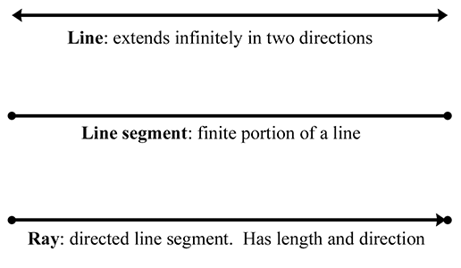
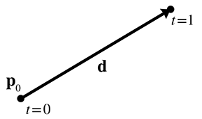
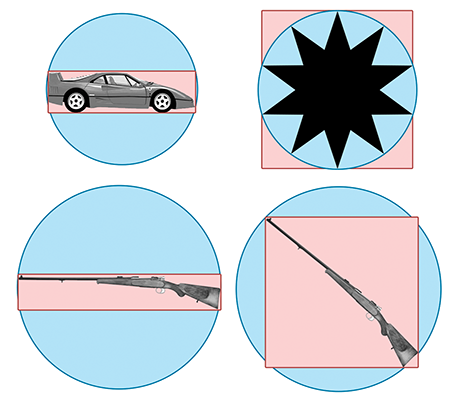
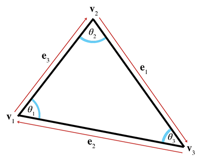
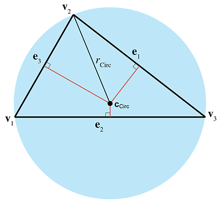
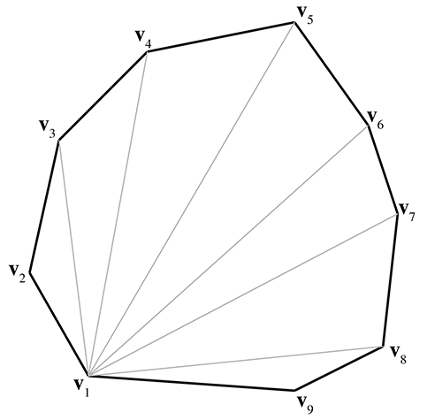

[<< Rotation in Three Dimensions](orient.html)

[Contents](./)

[Mathematical Topics\\ from 3D Graphics >>](graphics.html)

Chapter 9 

Geometric Primitives

Triangle man, triangle man.  
Triangle man hates particle man.  
They have a fight, triangle wins.  
Triangle man.

— _Particle Man_ (1990) by They Might Be Giants

This chapter is about geometric primitives in general and in specific.

*   [Section 9.1](#representation_techniques) discusses some general principles related to representing geometric primitives.
*   Sections [9.2](#lines_and_rays)–[9.7](#polygons) cover a number of specific important geometric primitives, including methods for representing those primitives and some classic properties and operations. Along the way, we'll present a few C++ snippets.

# 9.1Representation Techniques

Let's begin with a brief overview of the major strategies for describing geometric shapes. For any given primitive, one or more of these techniques may be applicable, and different techniques are useful in different situations.

We can describe an object in _implicit form_ by defining a Boolean function f(x,y,z) that is true for all points of the primitive and false for all other points. For example, the equation

Unit sphere in implicit form

x2+y2+z2\=1

is true for all points on the surface of a unit sphere centered at the origin. The _conic sections_ are classic examples of implicit representations of geometric shapes that you may already know. A conic section is a 2D shape formed by the intersection of a cone with a plane. The conic sections are the circle, ellipse, parabola, and hyperbola, all of which can be described in the standard implicit form Ax2+Bxy+Cy2+D\=0 .

_Metaballs_ [\[1\]](#reference_1) is an implicit method for representing fluid and organic shapes. The volume is defined by a collection of fuzzy “balls.” Each ball defines a three-dimensional scalar density function based on the distance from the center of the ball, with zero distance being the maximal value and greater distances having lower values. We can define an aggregate density function for any arbitrary point in space by taking the sum of the density of all the balls at that point. The twist with metaballs is that the volume of the fluid or organic object is defined to be the region where the density exceeds some _nonzero_ threshold. In other words, the balls have a “fuzzy” region around them that extends outside of the volume when the ball is in isolation. When two or more balls come together, the fuzzy regions interfere constructively, causing a graceful “bond” of solid volume to materialize in the region in between the balls, where no such solid would exist if either ball were in isolation. The _marching cubes_ algorithm [\[5\]](#reference_5) is a classic technique for converting an arbitrary implicit form into a surface description (such as a polygon mesh).

Figure 9.1Parametric circle

Another general strategy for describing shapes is the _parametric form_. Once again, the primitive is defined by a function, but instead of the spatial coordinates being the input to the function, they are the output. Let's begin with a simple 2D example. We define the following two functions of t :

Unit circle in parametric form

x(t)\=cos⁡2πt,y(t)\=sin⁡2πt.

The argument t is known as the _parameter_ and is independent of the coordinate system used. As t varies from 0 to 1, the point (x(t),y(t)) traces out the outline of the shape we are describing—in this example, a unit circle centered at the origin (see [Figure 9.1](#parametric_form_circle)).

It is often convenient to normalize the parameter to be in the range \[0,1\] , although we may allow t to assume any range of values we wish. Another common choice is \[0,l\] , where l is some measure of the length of the primitive.

When our functions are in terms of one parameter, we say that the functions are _univariate_. Univariate functions trace out a 1D shape: a curve. ([Chapter 13](curves.html) presents more about parametric curves.) It's also possible to use more than one parameter. A _bivariate function_ accepts two parameters, usually assigned to the variables s and t . Bivariate functions trace out a surface rather than a line.

We have dubbed the final method for representing primitives, for lack of a better term, _straightforward forms_. By this we mean all the ad-hoc methods that capture the most important and obvious information directly. For example, to describe a line segment, we could name the two endpoints. A sphere is described most simply by giving its center and radius. The straightforward forms are the easiest for humans to work with directly.

Regardless of the method of representation, each geometric primitive has an inherent number of degrees of freedom. This is the minimum number of “pieces of information” that are required to describe the entity unambiguously. It is interesting to notice that for the same geometric primitive, some representation forms use more numbers than others. However, we find that any “extra” numbers are always due to a redundancy in the parameterization of the primitive, which could be eliminated by assuming the appropriate constraint, such as a vector having unit length. For example, a circle in the plane has three degrees of freedom: two for the position of the center (xc,yc) and one for the radius r . In parametric form these variables appear directly:

Parametric circle with arbitrary center and radius

x(t)\=xc+rcos⁡2πt,y(t)\=yc+rsin⁡2πt.

However, the general conic section equation (the implicit form) is Ax2+Bxy+Cy2+D\=0 , which has four coefficients. A general conic section can be recognized as a circle if it can be manipulated into the form

Implicit circle with arbitrary center and radius

(x−xc)2+(y−yc)2\=r2.

# 9.2Lines and Rays

Now for some specific types of primitives. We begin with what is perhaps the most basic and important one of all: the linear segment. Let's meet the three basic types of linear segments, and also clarify some terminology. In classical geometry, the following definitions are used:

*   A _line_ extends infinitely in two directions.
*   A _line segment_ is a finite portion of a line that has two endpoints.
*   A _ray_ is “half” of a line that has an origin and extends infinitely in one direction.

In computer science and computational geometry, there are variations on these definitions. This book uses the classical definitions for line and line segment. However, the definition of “ray” is altered slightly:

*   A _ray_ is a directed line segment.

So to us, a ray will have an origin and an endpoint. Thus a ray defines a position, a _finite_ length, and (unless the ray has zero length) a direction. Since a ray is just a line segment where we have differentiated between the two ends, and a ray also can be used to define an infinite line, rays are of fundamental importance in computational geometry and graphics and will be the focus of this section. A ray can be imagined as the result of sweeping a point through space over time; rays are everywhere in video games. An obvious example is the rendering strategy known as _raytracing_, which uses eponymous rays representing the paths of photons. For AI, we trace “line of sight” rays through the environment to detect whether an enemy can see the player. Many user interface tools use raytracing to determine what object is under the mouse cursor. Bullets and lasers are always whizzing through the air in video games, and we need rays to determine what they hit. [Figure 9.2](#line_vs_line_segment_vs_ray) compares the line, line segment, and ray.

Figure 9.2Line, line segment, and ray

The remainder of this section surveys different methods for representing lines and rays in 2D and 3D. [Section 9.2.1](#rays) discusses some simple ways to represent a ray, including the all-important parametric form. [Section 9.2.2](#line_infinite_2d) discusses some special ways to define an infinite line in 2D. [Section 9.2.3](#ray_line_converting_forms) gives some examples of converting from one representation to another.

## 9.2.1Rays

Figure 9.3 Defining a ray using the starting and ending points

The most obvious way to define a ray (the “straightforward form”) is by two points, the ray origin and the ray endpoint, which we will denote as p org and p end (see [Figure 9.3](#ray_two_points)).

The parametric form of the ray is only slightly different, and is quite important:

Parametric definition of a ray using vector notation

(9.1) p (t)\= p 0+t d .

The ray starts at the point p (0)\= p 0 . Thus p 0 contains information about the _position_ of the ray, while the “delta vector” d contains its _length and direction_. We restrict the parameter t to the normalized range \[0,1\] , and so the ray ends at the point p (1)\= p 0+ d , as shown in [Figure 9.4](#ray_parametric).

Figure 9.4Defining a ray parametrically

We can also write out a separate scalar function for each coordinate, although the vector format is more compact and also has the nice property that it makes the equations the same in any dimension. For example, a 2D ray is defined parametrically by using the two scalar functions,

Parametric definition of a 2D ray

x(t)\=x0+tΔx,y(t)\=y0+tΔy.

A slight variation on [Equation (9.1)](#ray_parametric_vector) that we use in some of the intersection tests is to use a unit vector d ^ and change the domain of the parameter t to \[0,l\] , where l is the length of the ray.

## 9.2.2Special 2D Representations of Lines

Now let's look a bit closer at some special ways of describing (infinite) lines. These methods are applicable only in 2D; in 3D, techniques similar to these are used to define a plane, as we show in [Section 9.5](#planes). A 2D ray inherently has four degrees of freedom ( x0 , y0 , Δx , and Δy ), but an infinite line has only two degrees of freedom.

Most readers are probably familiar with the _slope-intercept_ form, which is an implicit method for representing an infinite line in 2D:

Slope-intercept form

(9.2)y\=mx+y0.

Figure 9.5The slope and y \-intercept of a line

The symbol m is the traditional one used to denote the slope of the line, expressed as a ratio of _rise_ over _run_: for every _rise_ units that we move up, we will move _run_ units to the right (see [Figure 9.5](#line_slope_intercept)). The _y-intercept_ is where the line crosses the y \-axis, and is the value that we have denoted y0 in [Equation (9.2)](#slope_intercept_form). (We're bucking tradition and not using the traditional variable, b , in order to avoid some confusion later on.) Substituting x\=0 clearly shows that the line crosses the y \-axis at y\=y0 .

The slope-intercept makes it easy to verify that an infinite line does, in fact, have two degrees of freedom: one degree for rotation and another for translation. Unfortunately, a vertical line has infinite slope and cannot be represented in slope-intercept form, since the implicit form of a vertical line is x\=k . (Horizontal lines are no problem, their slope is zero.)

We can work around this singularity by using the slightly different implicit form

Implicit definition of infinite line in 2D

(9.3)ax+by\=d.

Most sources use the form ax+by+d\=0 . This flips the sign of d compared to our equations. We will use the form in [Equation (9.3)](#line_implicit_2d) because it has fewer terms, and we also feel that d has a more intuitive meaning geometrically in this form.

If we assign the vector n \=\[a,b\] , we can write [Equation (9.3)](#line_implicit_2d) using vector notation as

Implicit definition of infinite 2D line using vector notation

(9.4) p ⋅ n \=d.

Figure 9.6 Defining a line using a perpendicular vector and distance to the origin

Since this form has three degrees of freedom, and we said that an infinite line in 2D has only two, we know there is some redundancy. Note that we can multiply both sides of the equation by any constant; by so doing, we are free to choose the length of n without loss of generality. It is often convenient for n to be a unit vector. This gives n and d interesting geometric interpretations, as shown in [Figure 9.6](#line_normal_and_distance).

Figure 9.7 Defining a line using a perpendicular vector and a point on the line

The vector n is the unit vector orthogonal to the line, and d gives the signed distance from the origin to the line. This distance is measured perpendicular to the line (parallel to n ). By _signed distance_, we mean that d is positive if the line is on the same side of the origin as the normal points. As d increases, the line moves in the direction of n . At least, this is the case when we put d on the right side of the equals sign, as in [Equation (9.4)](#line_implicit_2d_vector). If we move d to the left side of the equals sign and put zero on the right side, as in the traditional form, then the sign of d is flipped and these statements are reversed.

Notice that n describes the “orientation” of the line, while d describes its position. Another way to describe the position of the line is to give a point q that is on the line. Of course there are infinitely many points on the line, so any point will do (see [Figure 9.7](#line_normal_and_point)).

One final way to define a line is as the perpendicular bisector of two points, to which we assign the variables q and r (see [Figure 9.8](#line_perpendicular_bisector)). This is actually one of the earliest definitions of a line: the set of all points equidistant from two given points.

Figure 9.8 Defining a line as the perpendicular bisector of a line segment

## 9.2.3Converting between Representations

Now let's give a few examples of how to convert a ray or line between the various representation techniques. We will not cover all of the combinations. Remember that the techniques we learned for infinite lines are applicable only in 2D.

To convert a ray defined using two points to parametric form:

p 0\= p org , d \= p end − p org .

The opposite conversion, from parametric form to two-points form, is

p org \= p 0, p end \= p 0+ d .

Given a parametric ray, we can compute the implicit line that contains this ray:

(9.5)a\= d y ,b\=− d x ,d\=x org d y −y org d x .

To convert a line expressed implicitly to slope-intercept form:

(9.6)m\=−a / b,y0\=d / b.

Converting a line expressed implicitly to “normal and distance” form:

n ^ \= \[ a b \] / a2+b2, distance \=d / a2+b2.

Converting a normal and a point on the line to normal and distance form:

distance \= n ^ ⋅ q .

(This assumes that n ^ is a unit vector.)

Finally, to convert perpendicular bisector form to implicit form, we use

a\= q y − r y ,b\= r x − q x ,d\= q + r 2 ⋅ \[ a b \] \= q + r 2 ⋅ \[ q y − r y r x − q x \] \= ( q x + r x )( q y − r y )+( q y + r y )( r x − q x ) 2 \= ( q x q y − q x r y + r x q y − r x r y )+( q y r x − q y q x + r y r x − r y q x ) 2 \= r x q y − q x r y .

# 9.3Spheres and Circles

A sphere is a 3D object defined as the set of all points that are a fixed distance from a given point. The distance from the center of the sphere to a point is known as the _radius_ of the sphere. The straightforward representation of a sphere is to describe its center c and radius r .

Spheres appear often in computational geometry and graphics because of their simplicity. A bounding sphere is often used for trivial rejection because the equations for intersection with a sphere are simple. Also important is that rotating a sphere does not change its extents. Thus, when a bounding sphere is used for trivial rejection, if the center of the sphere is the origin of the object, then the orientation of the object can be ignored. A bounding box (see [Section 9.4](#bounding_boxes)) does not have this property.

The implicit form of a sphere comes directly from its definition: the set of all points that are a given distance from the center. The implicit form of a sphere with center c and radius r is

Implicit definition of a sphere using vector notation

(9.7) ∥ p − c ∥ \=r,

where p is any point on the _surface_ of the sphere. For a point p inside the sphere to satisfy the equation, we must change the “ \= ” to a “ ≤ ”. Since [Equation (9.7)](#sphere_definition_implicit_vector) uses vector notation, it also works in 2D, as the implicit definition of a circle. Another more common form is to expand the vector notation and square both sides:

Implicit definitions of a circle and a sphere

(9.8)(x− c x )2+(y− c y )2\=r2(2D circle)(9.9)(x− c x )2+(y− c y )2+(z− c z )2\=r2(3D sphere)

We might be interested in the diameter (distance from one point to a point on the exact opposite side), and circumference (the distance all the way around the circle) of a circle or sphere. Elementary geometry provides formulas for those quantities, as well as for the area of a circle, surface area of a sphere, and volume of a sphere:

D\=2r(diameter)C\=2πr\=πD(circumference)A\=πr2(area of circle)S\=4πr2(surface area of sphere)V\=43πr3(volume of sphere)

For the calculus buffs, it is interesting to notice that the derivative of the area of a circle with respect to r is the circumference, and the derivative for the volume of a sphere is the surface area.

# 9.4Bounding Boxes

Another simple geometric primitive commonly used as a bounding volume is the _bounding box_. Bounding boxes may be either axially aligned, or arbitrarily oriented. Axially aligned bounding boxes have the restriction that their sides be perpendicular to principal axes. The acronym AABB is often used for **a**xially **a**ligned **b**ounding **b**ox.

A 3D AABB is a simple 6-sided box with each side parallel to one of the cardinal planes. The box is _not_ necessarily a cube—the length, width, and height of the box may each be different. [Figure 9.9](#aabb) shows a few simple 3D objects and their axially aligned bounding boxes.

Figure 9.93D objects and their AABB's

Another frequently used acronym is OBB, which stands for **o**riented **b**ounding **b**ox. We don't discuss OBBs much in this section, for two reasons. First, axially aligned bounding boxes are simpler to create and use. But more important, you can think about an OBB as simply an AABB with an orientation; every bounding box is an AABB in _some_ coordinate space; in fact any one with axes perpendicular to the sides of the box will do. In other words, the difference between an AABB and an OBB is not in the box itself, but in whether you are performing calculations in a coordinate space aligned with the bounding box.

As an example, let's say that for objects in our world, we store the AABB of the object in the objects' object space. When performing operations in object space, this bounding box is an AABB. But when performing calculations in world (or upright) space, then this same bounding box is an OBB, since it may be “at an angle” relative to the world axes.

Although this section focuses on 3D AABBs, most of the information can be applied in a straightforward manner in 2D by simply dropping the third dimension.

The next four sections cover the basic properties of AABBs. [Section 9.4.1](#representing_aabbs) introduces the notation we use and describes the options we have for representing an AABB. [Section 9.4.2](#computing_aabbs) shows how to compute the AABB for a set of points. [Section 9.4.3](#aabb_vs_bounding_sphere) compares AABBs to bounding spheres. [Section 9.4.4](#transforming_aabbs) shows how to construct an AABB for a transformed AABB.

## 9.4.1Representing AABBs

Let us introduce several important properties of an AABB, and the notation we use when referring to these values. The points inside an AABB satisfy the inequalities

x min ≤x≤x max ,y min ≤y≤y max ,z min ≤z≤z max .

Two corner points of special significance are

p min \= \[ x min y min z min \] , p max \= \[ x max y max z max \] .

The center point c is given by

c \=( p min + p max ) / 2.

The “size vector” s is the vector from p min to p max and contains the width, height, and length of the box:

s \= p max − p min .

We can also refer to the “radius vector” r of the box, which is half of the size vector s , and can be interpreted as the vector from c to p max :

r \= p max − c \= s / 2.

To unambiguously define an AABB requires only two of the five vectors p min , p max , c , s , and r . Other than the pair s and r , any pair may be used. Some representation forms are more useful in particular situations than others. We advise representing a bounding box by using p min and p max , since in practice these values are needed far more frequently than s , c , and r . And, of course, computing any of these three vectors from p min and p max is very fast. In C, an AABB might be represented by using a struct like in [Listing 9.1](#aabb_struct).

struct AABB3 {
    Vector3 min;
    Vector3 max;
};

## 9.4.2Computing AABBs

void AABB3::empty() {
    min.x = min.y = min.z = FLT\_MAX;
    max.x = max.y = max.z = -FLT\_MAX;
}

void AABB3::add(const Vector3 &p) {
    if (p.x < min.x) min.x = p.x;
    if (p.x > max.x) max.x = p.x;
    if (p.y < min.x) min.y = p.y;
    if (p.y > max.x) max.y = p.y;
    if (p.z < min.x) min.z = p.z;
    if (p.z > max.x) max.z = p.z;
}

Computing an AABB for a set of points is a simple process. We first reset the minimum and maximum values to “infinity,” or what is effectively bigger than any number we will encounter in practice. Then, we pass through the list of points, expanding our box as necessary to contain each point.

An AABB class often defines two functions to help with this. The first function “empties” the AABB. The other function adds a single point into the AABB by expanding the AABB if necessary to contain the point. [Listing 9.2](#aabb_empty_and_add) shows such code.

Now, to create a bounding box from a set of points, we could use the following code:

// Our list of points
const int N;
Vector3 list\[N\];

// First, empty the box
AABB3 box;
box.empty();

// Add each point into the box
for (int i = 0 ; i < N ; ++i) {
    box.add(list\[i\]);
}

## 9.4.3AABBs versus Bounding Spheres

In many cases, we have a choice between using an AABB or a bounding sphere. AABBs offer two main advantages over bounding spheres.

The first advantage of AABBs over bounding spheres is that computing the optimal AABB for a set of points is easy to program and can be run in linear time. Computing the optimal bounding sphere is a much more difficult problem. (O'Rourke [\[6\]](#reference_6) and Lengyel [\[4\]](#reference_4) describe algorithms for computing bounding spheres.)

Second, for many objects that arise in practice, an AABB provides a tighter bounding volume, and thus better trivial rejection. Of course, for some objects, the bounding sphere is better. (Imagine an object that is itself a sphere!) In the worst case, an AABB will have a volume of just under twice the volume of the sphere, but when a sphere is bad, it can be _really_ bad. Consider the bounding sphere and AABB of a telephone pole, for example.

Figure 9.10 The AABB and bounding sphere for various objects

The basic problem with a sphere is that there is only one degree of freedom to its shape—the radius of the sphere. An AABB has three degrees of freedom—the length, width, and height. Thus, it can usually adapt to differently shaped objects better. For most of the objects in [Figure 9.10](#aabb_vs_sphere), the AABB is smaller than the bounding sphere. The exception is the star in the upper right-hand corner, where the bounding sphere is slightly smaller than the AABB. Notice that the AABB is highly sensitive to the orientation of the object, as shown by the AABBs for the two rifles on the bottom. In each case, the size of the rifle is the same, and only the orientation is different. Also notice that the bounding spheres are the same size since bounding spheres are not sensitive to the orientation of the object. When the objects are free to rotate, some of the advantage of AABBs can be eroded. There is an inherent trade-off between a tighter volume (OBB) and a compact, fast representation (bounding spheres). Which bounding primitive is best will depend highly on the application.

## 9.4.4Transforming AABBs

Sometimes we need to transform an AABB from one coordinate space to another. For example, let's say that we have the AABB in object space (which, from the perspective of world space, is basically the same thing as an OBB; see [Section 9.4](#bounding_boxes)) and we want to get an AABB in world space. Of course, in theory, we could compute a world-space AABB of the object itself. However, we assume that the description of the object shape (perhaps a triangle mesh with a thousand vertices) is more complicated than the AABB that we already have computed in object space. So to get an AABB in world space, we will transform the object-space AABB.

What we get as a result is not necessarily axially aligned (if the object is rotated), and is not necessarily a box (if the object is skewed). However, computing an AABB for the “transformed AABB” (we should perhaps call it a NNAABNNB—a “not-necessarily axially aligned bounding not-necessarily box”) is faster than computing a new AABB for all but the most simple transformed objects because AABBs have only eight vertices.

To compute an AABB for a transformed AABB it is _not_ enough to simply transform the original p min and p max . This could result in a bogus bounding box, for example, if x min \>x max . To compute a new AABB, we must transform the eight corner points, and then form an AABB from these eight transformed points.

Depending on the transformation, this usually results in a bounding box that is larger than the original bounding box. For example, in 2D, a rotation of 45 degrees will increase the size of the bounding box significantly (see [Figure 9.11](#aabb_transform)).

Figure 9.11The AABB of a transformed box

Compare the size of the original AABB in [Figure 9.11](#aabb_transform) (the blue box), with the new AABB (the largest red box on the right) which was computed solely from the rotated AABB. The new AABB is almost twice as big. Notice that if we were able to compute an AABB from the rotated object rather than the rotated AABB, it is about the same size as the original AABB.

As it turns out, the structure of an AABB can be exploited to speed up the generation of the new AABB, so it is not necessary to actually transform all eight corner points and build a new AABB from these points.

Let's quickly review what happens when we transform a 3D point by a 3×3 matrix (see [Section 4.1.7](matrixintro.html#matrix_times_vector) if you have forgotten how to multiply a vector by a matrix):

\[ x′ y′ z′ \] \= \[ x y z \] \[ m 11 m 12 m 13 m 21 m 22 m 23 m 31 m 32 m 33 \] ;x′\=m 11 x+m 21 y+m 31 z,y′\=m 12 x+m 22 y+m 32 z,z′\=m 13 x+m 23 y+m 33 z.

Assume the original bounding box is in x min , x max , y min , etc., and the new bounding box will be computed into x min ′ , x max ′ , y min ′ , etc. Let's examine how we might more quickly compute x min ′ as an example. In other words, we wish to find the minimum value of

m 11 x+m 21 y+m 31 z,

where \[x,y,z\] is any of the original eight corner points. Our job is to figure out which of these corner points would have the smallest x value after transformation. The trick to minimizing the entire sum is to minimize each of the three products individually. Let's look at the first product, m 11 x . We must decide which of x min or x max to substitute for x in order to minimize the product. Obviously, if m 11 \>0 , then the smaller of the two, x min , will result in the smaller product. Conversely, if m 11 <0 , then x max gives smaller product. Conveniently, whichever of x min or x max we use for computing x min ′ , we use the other value for computing x max ′ . We then apply this process for each of the nine elements in the matrix.

This technique is illustrated in [Listing 9.4](#transformed_aabb). The class Matrix4x3 is a 4×3 transform matrix, which can represent any affine transform. (It's a 4×4 matrix that acts on row vectors, where the right-most column is assumed to be \[0,0,0,1\] T .)

void AABB3::setToTransformedBox(const AABB3 &box, const Matrix4x3 &m) {

    // Start with the last row of the matrix, which is the translation
    // portion, i.e. the location of the origin after transformation.
    min = max = getTranslation(m);

    //
    // Examine each of the 9 matrix elements
    // and compute the new AABB
    //

    if (m.m11 > 0.0f) {
        min.x += m.m11 \* box.min.x; max.x += m.m11 \* box.max.x;
    } else {
        min.x += m.m11 \* box.max.x; max.x += m.m11 \* box.min.x;
    }

    if (m.m12 > 0.0f) {
        min.y += m.m12 \* box.min.x; max.y += m.m12 \* box.max.x;
    } else {
        min.y += m.m12 \* box.max.x; max.y += m.m12 \* box.min.x;
    }

    if (m.m13 > 0.0f) {
        min.z += m.m13 \* box.min.x; max.z += m.m13 \* box.max.x;
    } else {
        min.z += m.m13 \* box.max.x; max.z += m.m13 \* box.min.x;
    }

    if (m.m21 > 0.0f) {
        min.x += m.m21 \* box.min.y; max.x += m.m21 \* box.max.y;
    } else {
        min.x += m.m21 \* box.max.y; max.x += m.m21 \* box.min.y;
    }

    if (m.m22 > 0.0f) {
        min.y += m.m22 \* box.min.y; max.y += m.m22 \* box.max.y;
    } else {
        min.y += m.m22 \* box.max.y; max.y += m.m22 \* box.min.y;
    }

    if (m.m23 > 0.0f) {
        min.z += m.m23 \* box.min.y; max.z += m.m23 \* box.max.y;
    } else {
        min.z += m.m23 \* box.max.y; max.z += m.m23 \* box.min.y;
    }

    if (m.m31 > 0.0f) {
        min.x += m.m31 \* box.min.z; max.x += m.m31 \* box.max.z;
    } else {
        min.x += m.m31 \* box.max.z; max.x += m.m31 \* box.min.z;
    }

    if (m.m32 > 0.0f) {
        min.y += m.m32 \* box.min.z; max.y += m.m32 \* box.max.z;
    } else {
        min.y += m.m32 \* box.max.z; max.y += m.m32 \* box.min.z;
    }

    if (m.m33 > 0.0f) {
        min.z += m.m33 \* box.min.z; max.z += m.m33 \* box.max.z;
    } else {
        min.z += m.m33 \* box.max.z; max.z += m.m33 \* box.min.z;
    }
}

# 9.5Planes

A _plane_ is a flat, 2D subspace of 3D. Planes are extremely common tools in video games, and the concepts in this section are especially useful. The definition of a plane that Euclid would probably recognize is similar to the perpendicular bisector definition of an infinite line in 2D: the set of all points that are equidistant from two given points. This similarity in definitions hints at the fact that planes in 3D share many properties with infinite lines in 2D. For example, they both subdivide the space into two “half-spaces.”

This section covers the fundamental properties of planes. [Section 9.5.1](#plane_equation) shows how to define a plane implicitly with the plane equation. [Section 9.5.2](#plane_three_points) shows how three points may be used to define a plane. [Section 9.5.3](#plane_best_fit) describes how to find the “best-fit” plane for a set of points that may not be exactly planar. [Section 9.5.4](#plane_distance_to_point) describes how to compute the distance from a point to a plane.

## 9.5.1The Plane Equation: An Implicit Definition of a Plane

We can represent planes using techniques similar to the ones we used to describe infinite 2D lines in [Section 9.2.2](#line_infinite_2d). The implicit form of a plane is given by all points p \=(x,y,z) that satisfy the _plane equation_:

The plane equation

ax+by+cz\=d(scalar notation),(9.10) p ⋅ n \=d(vector notation).

Note that in the vector form, n \=\[a,b,c\] . Once we know n , we can compute d from any point known to be in the plane.

Most sources give the plane equation as ax+by+cz+d\=0 . This has the effect of flipping the sign of d . Our comments in [Section 9.2.2](#line_infinite_2d) explaining our preference to put d on the left side of the equals sign also apply here: our experience is that this form results in fewer terms and minus signs and a more intuitive geometric interpretation for d .

The vector n is called the plane _normal_ because it is perpendicular (normal) to the plane. Although n is often normalized to unit length, this is not strictly necessary. We use a hat ( n ^ ) when we are assuming unit length. The normal determines the orientation of the plane; d defines its position. More specifically, it determines the signed distance to the plane from the origin, measured in the direction of the normal. Increasing d slides the plane forward, in the direction of the normal. If d\>0 , the origin is on the back side of the plane, and if d<0 , the origin is on the front side. (This assumes we put d on the right-hand side of the equals sign, as in [Equation (9.10)](#plane_equation_vector). The standard homogenous form with d on the left has the opposite sign conventions.)

Let's verify that n is perpendicular to the plane. Assume p and q are arbitrary points in the plane, and therefore satisfy the plane equation. Substituting p and q into [Equation (9.10)](#plane_equation_vector), we get

n ⋅ p \=d, n ⋅ q \=d, n ⋅ p \= n ⋅ q , n ⋅ p − n ⋅ q \=0,(9.11) n ⋅( p − q )\=0.

Figure 9.12 The front and back sides of a plane

The geometric implication of [Equation (9.11)](#plane_equation_geometric_interpretation) is that n is perpendicular to the vector from q to p (see [Section 2.11](vectors.html#dot_product)). This is true for any points p and q in the plane, and therefore n is perpendicular to every vector in the plane.

We often consider a plane as having a “front” side and a “back” side. Usually, the front side of the plane is the direction that n points; i.e. when looking from the head of n towards the tail, we are looking at the front side of the plane (see [Figure 9.12](#plane_front_and_back)).

As mentioned previously, it's often useful to restrict n to have unit length. We can do this without loss of generality, since we can multiply the entire plane equation by any constant.

## 9.5.2Defining a Plane by Using Three Points

Another way we can define a plane is to give three noncollinear points that lie in the plane. Collinear points (points in a straight line) won't work because there would be an infinite number of planes that contain that line, and there would be no way of telling which plane we meant.

Let's compute n and d from three points p 1 , p 2 , and p 3 known to be in the plane. First, we must compute n . Which way will n point? The standard way to do this in a left-handed coordinate system is to assume that p 1 , p 2 , and p 3 are listed in clockwise order, when viewed from the front side of the plane, as illustrated in [Figure 9.13](#plane_from_three_points). (In a right-handed coordinate system, we usually assume the points are listed in counterclockwise order. Under these conventions, the equations are the same no matter what coordinate system is used.)

Figure 9.13 Computing a plane normal from three points in the plane

We will construct two vectors according to the clockwise ordering. The notation e stands for “edge” vector, since these equations commonly arise when computing the plane equation for a triangle. (The indexing may seem weird, but bear with us—this is the indexing we'll use in [Section 9.6.1](#triangle_notation) where triangles are discussed in more detail.) The cross product of these two vectors yields the perpendicular vector n , but this vector is not necessarily of unit length. As mentioned earlier, we usually normalize n . All of this is summarized succinctly by

The normal of a plane containing three points

(9.12) e 3\= p 2− p 1, e 1\= p 3− p 2, n ^ \= e 3× e 1 ∥ e 3× e 1 ∥ .

Notice that if the points are collinear, then e 3 and e 1 will be parallel, and thus the cross product will be 0 , which cannot be normalized. This mathematical singularity coincides with the physical singularity that collinear points do not unambiguously define a plane.

Now that we know n ^ , all that is left to do is compute d . This is easily done by taking the dot product of one of the points and n ^ .

## 9.5.3“Best Fit” Plane for More than Three Points

Occasionally, we may wish to compute the plane equation for a set of more than three points. The most common example of such a set of points is the vertices of a polygon. In this case, the vertices are assumed to be enumerated in a clockwise fashion around the polygon. (The ordering matters because it is how we decide which side is the front and which is the back, which in turn determines which direction our normal will point.)

One naïve solution is to arbitrarily select three consecutive points and compute the plane equation from those three points. However, the three points we choose might be collinear, or nearly collinear, which is almost as bad because it is numerically inaccurate. Or perhaps the polygon is concave and the three points we have chosen are a point of concavity and therefore form a counterclockwise turn (which would result in a normal that points in the wrong direction). Or the vertices of the polygon may not be coplanar, which can happen due to numeric imprecision or the method used to generate the polygon. What we really want is a way to compute the “best fit” plane for a set of points that takes into account _all_ of the points. Given n points,

p 1\= \[ x1 y1 z1 \] , p 2\= \[ x2 y2 z2 \] , ⋮

p n−1 \= \[ x n−1 y n−1 z n−1 \] , p n\= \[ xn yn zn \] ,

the best fit perpendicular vector n is given by

Computing the best-fit plane normal from n points

(9.13) n x \=(z1+z2)(y1−y2)+(z2+z3)(y2−y3)+⋯⋯+(z n−1 +zn)(y n−1 −yn)+(zn+z1)(yn−y1), n y \=(x1+x2)(z1−z2)+(x2+x3)(z2−z3)+⋯⋯+(x n−1 +xn)(z n−1 −zn)+(xn+x1)(zn−z1), n z \=(y1+y2)(x1−x2)+(y2+y3)(x2−x3)+⋯⋯+(y n−1 +yn)(x n−1 −xn)+(yn+y1)(xn−x1).

This vector must then be normalized if we wish to enforce the restriction that n be of unit length.

We can express [Equation (9.13)](#best_fit_plane_normal_from_points) succinctly by using summation notation. Adopting a circular indexing scheme such that p n+1 ≡ p 1 , we can write

(9.5.3) n x \=∑ i\=1 n(zi+z i+1 )(yi−y i+1 ), n y \=∑ i\=1 n(xi+x i+1 )(zi−z i+1 ), n z \=∑ i\=1 n(yi+y i+1 )(xi−x i+1 ).

[Listing 9.5](#best_fit_plane_normal_from_points) illustrates how we might compute a best-fit plane normal for a set of points.

Vector3 computeBestFitNormal(const Vector3 v\[\], int n) {

    // Zero out sum
    Vector3 result = kZeroVector;

    // Start with the \`\`previous'' vertex as the last one.
    // This avoids an if-statement in the loop
    const Vector3 \*p = &v\[n-1\];

    // Iterate through the vertices
    for (int i = 0 ; i < n ; ++i) {

        // Get shortcut to the \`\`current'' vertex
        const Vector3 \*c = &v\[i\];

        // Add in edge vector products appropriately
        result.x += (p->z + c->z) \* (p->y - c->y);
        result.y += (p->x + c->x) \* (p->z - c->z);
        result.z += (p->y + c->y) \* (p->x - c->x);

        // Next vertex, please
        p = c;
    }

    // Normalize the result and return it
    result.normalize();
    return result;
}

The best-fit d value can be computed as the average of the d values for each point:

Computing the best-fit plane d value

d\=1n∑ i\=1 n( p i⋅ n )\=1n (∑ i\=1 n p i) ⋅ n .

## 9.5.4Distance from Point to Plane

It is often the case that we have a plane and a point q that is not in the plane, and we want to calculate the distance from the plane to q , or at least classify q as being on the front or back side of the plane. To do this, we imagine the point p that lies in the plane and is the closest point in the plane to q . Clearly, the vector from p to q is perpendicular to the plane, and thus is of the form a n , as shown in [Figure 9.14](#plane_distance_to_point).

Figure 9.14 Computing the distance between a point and a plane

If we assume the plane normal n ^ is a unit vector, then the distance from p to q (and thus the distance from the plane to q ) is simply a . This is a signed distance, which means that it will be negative when q is on the back side of the plane. What's surprising is that we can compute a without knowing the location of p . We go back to our original definition of q and then perform some vector algebra to eliminate p :

Computing the signed distance from a plane to an arbitrary 3D point

p +a n ^ \= q ,( p +a n ^ )⋅ n ^ \= q ⋅ n ^ , p ⋅ n ^ +(a n ^ )⋅ n ^ \= q ⋅ n ^ ,d+a\= q ⋅ n ^ ,(9.14)a\= q ⋅ n ^ −d.

# 9.6Triangles

Triangles are of fundamental importance in modeling and graphics. The surface of a complex 3D object, such as a car or a human body, is approximated with many triangles. Such a group of connected triangles forms a _triangle mesh_, which is the topic of [Section 10.4](graphics.html#polygon_meshes). But before we can learn how to manipulate many triangles, we must first learn how to manipulate one triangle.

This section covers the fundamental properties of triangles. [Section 9.6.1](#triangle_notation) introduces some notation and basic properties of triangles. [Section 9.6.2](#triangle_area) lists several methods for computing the area of a triangle in 2D or 3D. [Section 9.6.3](#triangle_barycentric_space) discusses barycentric space. [Section 9.6.5](#triangle_special_points) discusses a few points on a triangle that are of special geometric significance.

## 9.6.1Notation

A triangle is defined by listing its three vertices. The order that these points are listed is significant. In a left-handed coordinate system, we typically enumerate the points in clockwise order when viewed from the front side of the triangle. We will refer to the three vertices as v 1 , v 2 , and v 3 .

A triangle lies in a plane, and the equation of this plane (the normal n and distance to origin d ) is important in a number of applications. We just discussed planes, including how to compute the plane equation given three points, in [Section 9.5.2](#plane_three_points).

Let us label the interior angles, clockwise edge vectors, and side lengths as shown in [Figure 9.15](#triangle_notation).

Figure 9.15Labeling triangles

Let li denote the length of e i . Notice that e i and li are opposite v i , the vertex with the corresponding index, and are given by

Notation for edge vectors and lengths

e 1\= v 3− v 2, e 2\= v 1− v 3, e 3\= v 2− v 1,l1\= ∥ e 1 ∥ ,l2\= ∥ e 2 ∥ ,l3\= ∥ e 3 ∥ .

For example, let's write the law of sines and law of cosines using this notation:

Law of sines

sin⁡θ1 l1\= sin⁡θ2 l2\= sin⁡θ3 l3,

Low of cosines

l1 2\= l2 2+ l3 2−2l2l3cos⁡θ1, l2 2\= l1 2+ l3 2−2l1l3cos⁡θ2, l3 2\= l1 2+ l2 2−2l1l2cos⁡θ3.

The perimeter of the triangle is often an important value, and is computed trivially by summing the three sides:

Perimeter of a triangle

p\=l1+l2+l3.

## 9.6.2Area of a Triangle

This section investigates several techniques for computing the area of a triangle. The most well known method is to compute the area from the _base_ and _height_ (also known as the _altitude_). Examine the parallelogram and enclosed triangle in [Figure 9.16](#triangle_enclosed_in_parallelogram).

Figure 9.16 A triangle enclosed in a parallelogram

From classical geometry, we know that the area of a parallelogram is equal to the product of the base and height. (See [Section 2.12.2](vectors.html#cross_product_geometry) for an explanation of why this is true.) Since the triangle occupies exactly one half of this area, the area of a triangle, is

Area of a triangle

A\=bh / 2.

If the altitude is not known, then _Heron's formula_ can be used, which requires only the lengths of the three sides. Let s equal one half the perimeter (also known as the _semiperimeter_). Then the area is given by

Heron's formula for the area of a triangle

s\= l1+l2+l3 2\=p2,A\=s(s−l1)(s−l2)(s−l3).

Heron's formula is particularly interesting because of the ease with which it can be applied in 3D.

Figure 9.17 The area “beneath” an edge vector

Often the altitude or lengths of the sides are not readily available and all we have are the Cartesian coordinates of the vertices. (Of course, we could always compute the side lengths from the coordinates, but there are situations for which we wish to avoid this relatively costly computation.) Let's see if we can compute the area of a triangle from the vertex coordinatesalone.

Let's first tackle this problem in 2D. The basic idea is to compute, for each of the three edges of the triangle, the signed area of the trapezoid bounded above by the edge and below by the x \-axis, as shown in [Figure 9.17](#triangle_area_under_edge). By “signed area,” we mean that the area is positive if the edge points from left to right, and negative if the edge points from right to left. Notice that no matter how the triangle is oriented, there will always be at least one positive edge and at least one negative edge. A vertical edge will have zero area. The formulas for the areas under each edge are

A( e 1)\= (y3+y2)(x3−x2) 2,A( e 2)\= (y1+y3)(x1−x3) 2,A( e 3)\= (y2+y1)(x2−x1) 2.

By summing the signed areas of the three trapezoids, we arrive at the area of the triangle itself. In fact, the same idea can be used to compute the area of a polygon with any number of sides.

We assume a clockwise ordering of the vertices around the triangle. Enumerating the vertices in the opposite order flips the sign of the area. With these considerations in mind, we sum the areas of the trapezoids to compute the signed area of the triangle:

A\=A( e 1)+A( e 2)+A( e 3)\= (y3+y2)(x3−x2)+(y1+y3)(x1−x3)+(y2+y1)(x2−x1) 2\= ((y3x3−y3x2+y2x3−y2x2)+(y1x1−y1x3+y3x1−y3x3)+(y2x2−y2x1+y1x2−y1x1)) 2\= −y3x2+y2x3−y1x3+y3x1−y2x1+y1x2 2\= y1(x2−x3)+y2(x3−x1)+y3(x1−x2) 2.

We can actually simplify this just a bit further. The basic idea is to realize that we can translate the triangle without affecting the area. We make an arbitrary choice to shift the triangle vertically, subtracting y3 from each of the y coordinates (in case you were wondering whether the trapezoid summing trick works if some of the triangle extends below the x \-axis, this shifting properly shows that it does):

Computing the area of a 2D triangle from the coordinates of the vertices

(9.15)A\= y1(x2−x3)+y2(x3−x1)+y3(x1−x2) 2\= (y1−y3)(x2−x3)+(y2−y3)(x3−x1)+(y3−y3)(x1−x2) 2\= (y1−y3)(x2−x3)+(y2−y3)(x3−x1) 2.

In 3D, we can use the cross product to compute the area of a triangle. Recall from [Section 2.12.2](vectors.html#cross_product_geometry) that the magnitude of the cross product of two vectors a and b is equal to the area of the parallelogram formed on two sides by a and b . Since the area of a triangle is half the area of the enclosing parallelogram, we have a simple way to calculate the area of the triangle. Given two edge vectors from the triangle, e 1 and e 2 , the area of the triangle is given by

(9.16)A\= ∥ e 1× e 2 ∥ 2.

Notice that if we extend a 2D triangle into 3D by assuming z\=0 , then [Equation (9.15)](#triangle_area_analytic_2d) and [Equation (9.16)](#triangle_area_cross_product) are equivalent.

## 9.6.3Barycentric Space

Even though we certainly use triangles in 3D, the surface of a triangle lies in a plane and is inherently a 2D object. Moving around on the surface of a triangle that is arbitrarily oriented in 3D is somewhat awkward. It would be nice to have a coordinate space that is related to the surface of the triangle and is independent of the 3D space in which the triangle “lives.” _Barycentric space_ is just such a coordinate space. Many practical problems that arise when making video games, such as interpolation and intersection, can be solved by using barycentric coordinates. We are introducing barycentric coordinates in the context of triangles here, but they have wide applicability. In fact, we meet them again in a slightly more general form in the context of 3D curves in [Chapter 13](curves.html).

Any point in the plane of a triangle can be expressed as a _weighted average_ of the vertices. These weights are known as _barycentric coordinates_. The conversion from barycentric coordinates (b1,b2,b3) to standard 3D space is defined by

Computing a 3D point from barycentric coordinates

(9.17)(b1,b2,b3)≡b1 v 1+b2 v 2+b3 v 3.

Of course, this is simply a linear combination of some vectors. [Section 3.3.3](multiplespaces.html#basis_vectors) showed how ordinary Cartesian coordinates can also be interpreted as a linear combination of the basis vectors, but the subtle distinction between barycentric coordinates and ordinary Cartesian coordinates is that for barycentric coordinates the sum of the coordinates is restricted to be unity:

b1+b2+b3\=1.

This normalization constraint removes one degree of freedom, which is why even though there are three coordinates, it is still a 2D space.

The values b1 , b2 , b3 are the “contributions” or “weights” that each vertex contributes to the point. [Figure 9.18](#triangle_barycentric_coordinates) shows some examples of points and their barycentric coordinates.

Figure 9.18 Examples of barycentric coordinates

Let's make a few observations here. First, notice that the three vertices of the triangle have a trivial form in barycentric space:

(1,0,0)≡ v 1,(0,1,0)≡ v 2,(0,0,1)≡ v 3.

Second, all points on the side opposite a vertex will have a zero for the barycentric coordinate corresponding to that vertex. For example, b1\=0 for all points on the line containing e 1 (which is opposite v 1 ).

Finally, _any_ point in the plane can be described in barycentric coordinates, not just the points inside the triangle. The barycentric coordinates of a point inside the triangle will all be in the range \[0,1\] . Any point outside the triangle will have at least one negative coordinate. Barycentric space tessellates the plane into triangles of the same size as the original triangle, as shown in [Figure 9.19](#triangle_barycentric_tessellates_plane).

Figure 9.19Barycentric coordinates tessellate the plane

There's another way to think about barycentric coordinates. Discarding b3 , we can interpret (b1,b2) as regular (x,y) 2D coordinates, where the origin is at v 3 , the x \-axis is v 1− v 3 , and the y \-axis is v 1− v 2 . This can be made more explicit by rearranging [Equation (9.17)](#triangle_barycentric_conversion):

Interpreting (b1,b2) as ordinary 2D coordinates

(b1,b2,b3)≡b1 v 1+b2 v 2+b3 v 3≡b1 v 1+b2 v 2+(1−b1−b2) v 3≡b1 v 1+b2 v 2+ v 3−b1 v 3−b2 v 3≡ v 3+b1( v 1− v 3)+b2( v 2− v 3).

This makes it very clear that, due to the normalization constraint, although there are three coordinates, there are only two degrees of freedom. We could completely describe a point in barycentric space using only two of the coordinates. In fact, the rank of the space described by the coordinates doesn't depend on the dimension of the “sample points” but rather on the _number_ of sample points. The number of degrees of freedom is one less than the number of barycentric coordinates, since we have the constraint that the coordinates sum to one. For example, if we have two sample points, the dimension of the barycentric coordinates is two, and the space that can be described using these coordinates is a line, which is a 1D space. Notice that the line may be a 1D line (i.e., interpolation of a scalar), a 2D line, a 3D line, or a line in some higher dimensional space. In this section, we've had three sample points (the vertices of our triangle) and three barycentric coordinates, resulting in a 2D space—a plane. If we had four sample points in 3D, then we could use barycentric coordinates to locate points in 3D. Four barycentric coordinates induce a “tetrahedronal” space, rather than the “triangular” space we get when there are three coordinates.

To convert a point from barycentric coordinates to standard Cartesian coordinates, we simply compute the weighted average of the vertices by applying [Equation (9.17)](#triangle_barycentric_conversion). The opposite conversion—computing the barycentric coordinates from Cartesian coordinates—is slightly more difficult, and is discussed in [Section 9.6.4](#triangle_barycentric_computing). However, before we get too far into the details (which might be skipped over by a casual reader), now that you have the basic idea behind barycentric coordinates, let us take this opportunity to mention a few places where barycentric coordinates are useful.

In graphics, it is common for parameters to be edited (or computed) per vertex, such as texture coordinates, colors, surface normals, lighting values, and so forth. We often then need to determine the interpolated value of one of those parameters at an arbitrary location within the triangle. Barycentric coordinates make this task easy. We first determine the barycentric coordinates of the interior point in question, and then take the weighted average of the values at the vertices for the parameter we seek.

Another important example is intersection testing. One simple way to perform ray-triangle testing is to determine the point where the ray intersects the infinite plane containing the triangle, and then to decide whether this point lies within the triangle. An easy way to make this decision is to calculate the barycentric coordinates of the point, using the techniques described here. If all of the coordinates lie in the \[0,1\] range, then the point is inside the triangle; otherwise at least one coordinate lies outside this range and the point is outside the triangle. It is common for the calculated barycentric coordinates to be further used to fetch some interpolated surface property. For example, let's say we are casting a ray to determine whether a light is visible to some point or if the point is in shadow. We strike a triangle on some model at an arbitrary location. If the model is opaque, the light is not visible. However, if the model uses transparency, we may need to determine the opacity at that location to determine what fraction of the light is blocked. Typically, this transparency is in a texture map, which is indexed using UV coordinates. (More about texture mapping is presented in [Section 10.5](graphics.html#texture_mapping).) To fetch the transparency at the location of ray intersection, we use the barycentric coordinates at the point to interpolate the UVs from the vertices. Then we use these UVs to fetch the texel from the texture map, and determine the transparency of that particular location on the surface.

## 9.6.4Calculating Barycentric Coordinates

Now let's see how to determine barycentric coordinates from Cartesian coordinates. We start in 2D with [Figure 9.20](#triangle_barycentric_coordinates_compute), which shows the three vertices v 1 , v 2 , and v 3 and the point  p . We have also labeled the three “subtriangles” T1 , T2 , T3 , which are opposite the vertex of the same index. These will become useful in just a moment.

Figure 9.20 Computing the barycentric coordinates for an arbitrary point p

We know the Cartesian coordinates of the three vertices and the point  p . Our task is to compute the barycentric coordinates b1 , b2 , and b3 . This gives us three equations and three unknowns:

b1x1+b2x2+b3x3\= p x ,b1y1+b2y2+b3y3\= p y ,b1+b2+b3\=1.

Solving this system of equations yields

Computing barycentric coordinates for a 2D point

(9.18)b1\= ( p y −y3)(x2−x3)+(y2−y3)(x3− p x ) (y1−y3)(x2−x3)+(y2−y3)(x3−x1) ,b2\= ( p y −y1)(x3−x1)+(y3−y1)(x1− p x ) (y1−y3)(x2−x3)+(y2−y3)(x3−x1) ,b3\= ( p y −y2)(x1−x2)+(y1−y2)(x2− p x ) (y1−y3)(x2−x3)+(y2−y3)(x3−x1) .

Examining [Equation (9.18)](#barycentric_computing_2d) closely, we see that the denominator is the same in each expression—it is equal to twice the area of the triangle, according to [Equation (9.15)](#triangle_area_analytic_2d). What's more, for each barycentric coordinate bi , the numerator is equal to twice the area of the “subtriangle” Ti . In other words,

Interpreting barycentric coordinates as ratios of areas

b1\=A(T1) / A(T),b2\=A(T2) / A(T),b3\=A(T3) / A(T).

Note that this interpretation applies even if p is outside the triangle, since our equation for computing area yields a negative result if the vertices are enumerated in a counterclockwise order. If the three vertices of the triangle are collinear, then the triangle is degenerate and the area in the denominator will be zero, and thus the barycentric coordinates cannot be computed.

Computing barycentric coordinates for an arbitrary point p in 3D is more complicated than in 2D. We cannot solve a system of equations as we did before, since we have three unknowns and four equations (one equation for each coordinate of p , plus the normalization constraint on the barycentric coordinates). Another complication is that p may not lie in the plane that contains the triangle, in which case the barycentric coordinates are undefined. For now, let's assume that p lies in the plane containing the triangle.

One trick that works is to turn the 3D problem into a 2D problem simply by discarding one of x , y , or z . This has the effect of projecting the triangle onto one of the three cardinal planes. Intuitively, this works because the projected areas are proportional to the original areas.

But which coordinate should we discard? We can't just always discard the same one, since the projected points will be collinear if the triangle is perpendicular to the projection plane. If our triangle is nearly perpendicular to the plane of projection, we will have problems with floating point accuracy. A solution to this dilemma is to choose the plane of projection so as to maximize the area of the projected triangle. This can be done by examining the plane normal, and whichever coordinate has the largest absolute value is the coordinate that we will discard. For example, if the normal is \[0.267,−0.802,0.535\] then we would discard the y values of the vertices and p , projecting onto the xz \-plane. The code snippet in [Listing 9.6](#barycentric_computing_3d) shows how to compute the barycentric coordinates for an arbitrary 3D point.

bool computeBarycentricCoords3d(
    const Vector3 v\[3\], // vertices of the triangle
    const Vector3 &p,   // point that we wish to compute coords for
    float b\[3\]          // barycentric coords returned here
) {

    // First, compute two clockwise edge vectors
    Vector3 d1 = v\[1\] - v\[0\];
    Vector3 d2 = v\[2\] - v\[1\];

    // Compute surface normal using cross product.  In many cases
    // this step could be skipped, since we would have the surface
    // normal precomputed.  We do not need to normalize it, although
    // if a precomputed normal was normalized, it would be OK.
    Vector3 n = crossProduct(d1, d2);

    // Locate dominant axis of normal, and select plane of projection
    float u1, u2, u3, u4;
    float v1, v2, v3, v4;
    if ((fabs(n.x) >= fabs(n.y)) && (fabs(n.x) >= fabs(n.z))) {

        // Discard x, project onto yz plane
        u1 = v\[0\].y - v\[2\].y;
        u2 = v\[1\].y - v\[2\].y;
        u3 = p.y - v\[0\].y;
        u4 = p.y - v\[2\].y;

        v1 = v\[0\].z - v\[2\].z;
        v2 = v\[1\].z - v\[2\].z;
        v3 = p.z - v\[0\].z;
        v4 = p.z - v\[2\].z;

    } else if (fabs(n.y) >= fabs(n.z)) {

        // Discard y, project onto xz plane
        u1 = v\[0\].z - v\[2\].z;
        u2 = v\[1\].z - v\[2\].z;
        u3 = p.z - v\[0\].z;
        u4 = p.z - v\[2\].z;

        v1 = v\[0\].x - v\[2\].x;
        v2 = v\[1\].x - v\[2\].x;
        v3 = p.x - v\[0\].x;
        v4 = p.x - v\[2\].x;

    } else {

        // Discard z, project onto xy plane
        u1 = v\[0\].x - v\[2\].x;
        u2 = v\[1\].x - v\[2\].x;
        u3 = p.x - v\[0\].x;
        u4 = p.x - v\[2\].x;

        v1 = v\[0\].y - v\[2\].y;
        v2 = v\[1\].y - v\[2\].y;
        v3 = p.y - v\[0\].y;
        v4 = p.y - v\[2\].y;
    }

    // Compute denominator, check for invalid
    float denom = v1\*u2 - v2\*u1;
    if (denom == 0.0f) {

        // Bogus triangle - probably triangle has zero area
        return false;
    }

    // Compute barycentric coordinates
    float oneOverDenom = 1.0f / denom;
    b\[0\] = (v4\*u2 - v2\*u4) \* oneOverDenom;
    b\[1\] = (v1\*u3 - v3\*u1) \* oneOverDenom;
    b\[2\] = 1.0f - b\[0\] - b\[1\];

    // OK
    return true;
}

Another technique for computing barycentric coordinates in 3D is based on the method for computing the area of a 3D triangle using the cross product, which is discussed in [Section 9.6.2](#triangle_area). Recall that given two edge vectors e 1 and e 2 of a triangle, we can compute the area of the triangle as ∥ e 1× e 2 ∥ / 2 . Once we have the area of the entire triangle and the areas of the three subtriangles, we can compute the barycentric coordinates.

There is one slight problem with this: the magnitude of the cross product is not sensitive to the ordering of the vertices—magnitude is by definition always positive. This will not work for points outside the triangle, since these points must always have at least one negative barycentric coordinate.

Let's see if we can find a way to work around this problem. It seems like what we really need is a way to calculate the length of the cross product vector that would yield a negative value if the vertices were enumerated in the “incorrect” order. As it turns out, there is a very simple way to do this with the dot product.

Let's assign c to be the cross product of two edge vectors of a triangle. Remember that the magnitude of c will equal twice the area of the triangle. Assume we have a normal n ^ of unit length. Now, n ^ and c are parallel, since they are both perpendicular to the plane containing the triangle. However, they may point in opposite directions. Recall from [Section 2.11.2](vectors.html#dot_product_geometry) that the dot product of two vectors is equal to the product of their magnitudes times the cosine of the angle between them. Since we know that n ^ is a unit vector, and the vectors are either pointing in the exact same or the exact opposite direction, we have

c ⋅ n ^ \= ∥ c ∥ ∥ n ^ ∥ cos⁡θ\= ∥ c ∥ (1)(±1)\=± ∥ c ∥ .

Dividing this result by two, we have a way to compute the “signed area” of a triangle in 3D. Armed with this trick, we can now apply the observation from the previous section, that each barycentric coordinate bi is proportional to the area of the subtriangle Ti . Let us first label all of the vectors involved, as shown in [Figure 9.21](#triangle_barycentric_coordinates_compute_3d).

Figure 9.21 Computing barycentric coordinates in 3D

As [Figure 9.21](#triangle_barycentric_coordinates_compute_3d) shows, each vertex has a vector from v i to p , named d i . Summarizing the equations for the vectors, we have

e 1\= v 3− v 2, e 2\= v 1− v 3, e 3\= v 2− v 1, d 1\= p − v 1, d 2\= p − v 2, d 3\= p − v 3.

We'll also need a surface normal, which can be computed by

n ^ \= e 1× e 2 ∥ e 1× e 2 ∥ .

Now the areas for the entire triangle (which we'll simply call T ) and the three subtriangles are given by

A(T)\=(( e 1× e 2)⋅ n ^ ) / 2,A(T1)\=(( e 1× d 3)⋅ n ^ ) / 2,A(T2)\=(( e 2× d 1)⋅ n ^ ) / 2,A(T3)\=(( e 3× d 2)⋅ n ^ ) / 2.

Each barycentric coordinate bi is given by A(Ti) / A(T) :

Computing barycentric coordinates in 3D

b1\=A(T1) / A(T)\= ( e 1× d 3)⋅ n ^ ( e 1× e 2)⋅ n ^ ,b2\=A(T2) / A(T)\= ( e 2× d 1)⋅ n ^ ( e 1× e 2)⋅ n ^ ,b3\=A(T3) / A(T)\= ( e 3× d 2)⋅ n ^ ( e 1× e 2)⋅ n ^ .

Notice that n ^ is used in all of the numerators and all of the denominators, and so it is doesn't necessarily have to be a unit vector.

This technique for computing barycentric coordinates involves more scalar math operations than the method of projection into 2D. However, it is branchless and offers better SIMD optimization.

## 9.6.5Special Points

In this section we discuss three points on a triangle that have special geometric significance:

*   center of gravity
*   incenter
*   circumcenter.

To present these classic calculations, we follow Goldman's article [\[3\]](#reference_3) from _Graphics Gems_. For each point, we discuss its geometric significance and construction and give its barycentric coordinates.

The _center of gravity_ is the point on which the triangle would balance perfectly. It is the intersection of the medians. (A _median_ is a line from one vertex to the midpoint of the opposite side.) [Figure 9.22](#triangle_center_of_gravity) shows the center of gravity of a triangle.

Figure 9.22 The center of gravity of a triangle

The center of gravity is the geometric average of the three vertices:

c Grav \= v 1+ v 2+ v 3 3.

The barycentric coordinates are

(13,13,13) .

The center of gravity is also known as the _centroid_.

The _incenter_ is the point in the triangle that is equidistant from the sides. It is called the incenter because it is the center of the circle inscribed in the triangle. The incenter is constructed as the intersection of the angle bisectors, as shown in [Figure 9.23](#triangle_incenter).

Figure 9.23The incenter of a triangle

The incenter is computed by

c In \= l1 v 1+l2 v 2+l3 v 3 p,

where p\= l 1+ l 2+ l 3 is the perimeter of the triangle. Thus the barycentric coordinates of the incenter are

(l1p,l2p,l3p) .

The radius of the inscribed circle can be computed by dividing the area of the triangle by its perimeter:

r In \=Ap.

The inscribed circle solves the problem of finding a circle tangent to three lines.

Figure 9.24The circumcenter of a triangle

The _circumcenter_ is the point in the triangle that is equidistant from the vertices. It is the center of the circle that circumscribes the triangle. The circumcenter is constructed as the intersection of the perpendicular bisectors of the sides. [Figure 9.24](#triangle_circumcenter) shows the circumcenter of a triangle.

To compute the circumcenter, we first define the following intermediate values:

d1\=− e 2⋅ e 3,d2\=− e 3⋅ e 1,d3\=− e 1⋅ e 2,c1\=d2d3,c2\=d3d1,c3\=d1d2,c\=c1+c2+c3.

With those intermediate values, the barycentric coordinates for the circumcenter are given by

( c2+c3 2c , c3+c1 2c , c1+c2 2c ) ;

thus, the circumcenter is given by

c Circ \= (c2+c3) v 1+(c3+c1) v 2+(c1+c2) v 3 2c .

The circumradius is given by

r Circ \=(d1+d2)(d2+d3)(d3+d1) / c2.

The circumradius and circumcenter solve the problem of finding a circle that passes through three points.

# 9.7Polygons

This section introduces polygons and discusses a few of the most important issues that arise when dealing with polygons. It is difficult to come up with a simple definition for polygon, since the precise definition usually varies depending on the context. In general, a polygon is a flat object made up of vertices and edges. The next few sections will discuss several ways in which polygons may be classified.

[Section 9.7.1](#polygons_simple_vs_complex) presents the difference between simple and complex polygons and mentions self-intersecting polygons. [Section 9.7.2](#polygons_convex_vs_concave) discusses the difference between convex and concave polygons. [Section 9.7.3](#polygons_triangulation) describes how any polygon may be turned into connected triangles.

## 9.7.1Simple versus Complex Polygons

A _simple_ polygon does not have any “holes,” whereas a _complex_ polygon may have holes (see [Figure 9.25](#polygon_simple_vs_complex).) A simple polygon can be described by enumerating the vertices in order around the polygon. (Recall that in a left-handed world, we usually enumerate them in clockwise order when viewed from the “front” side of the polygon.) Simple polygons are used much more frequently than complex polygons.

Figure 9.25Simple versus complex polygons

We can turn any complex polygon into a simple one by adding pairs of “seam” edges, as shown in [Figure 9.26](#polygon_complex_into_simple_seam_edges). As the close-up on the right shows, we add two edges per seam. The edges are actually coincident, although in the close-up they have been separated so you could see them. When we think about the edges being ordered around the polygon, the two seam edges point in opposite directions.

Figure 9.26 Turning complex polygons into simple ones by adding pairs of seam edges

The edges of most simple polygons do not intersect each other. If the edges do intersect, the polygon is considered a _self-intersecting_ polygon. An example of a self-intersecting polygon is shown in [Figure 9.27](#polygon_self_intersecting).

Figure 9.27A self-intersecting polygon

Most people usually find it easier to arrange things so that self-intersecting polygons are either avoided, or simply rejected. In most situations, this is not a huge burden on the user.

## 9.7.2Convex versus Concave Polygons

Non-self-intersecting simple polygons may be further classified as either _convex_ or _concave_. Giving a precise definition for “convex” is actually somewhat tricky because there are many sticky degenerate cases. For most polygons, the following commonly used definitions are equivalent, although some degenerate polygons may be classified as convex according to one definition and concave according to another.

*   Intuitively, a convex polygon doesn't have any “dents.” A concave polygon has at least one vertex that is a “dent,” which is called a _point of concavity_ (see [Figure 9.28](#polygon_convex_vs_concave)).
*   In a convex polygon, the line between any two points in the polygon is completely contained within the polygon. In a concave polygon, there is at least one pair of points in the polygon for which the line between the points is partially outside the polygon.
*   As we move around the perimeter of a convex polygon, at each vertex we will turn in the same direction. In a concave polygon, we will make some left-hand turns and some right-hand turns. We will turn the opposite direction at the point(s) of concavity. (Note that this applies to non-self-intersecting polygons only.)

As we mentioned, degenerate cases can make even these relatively clear-cut definitions blurry. For example, what about a polygon with two consecutive coincident vertices, or an edge that doubles back on itself? Are those polygons considered convex? In practice, the following “definitions” for convexity are often used:

*   If my code, which is supposed to work only for convex polygons, can deal with it, then it's convex. (This is the “if it ain't broke, don't fix it” definition.)
*   If my algorithm that tests for convexity decides it's convex, then it's convex. (This is an “algorithm as definition” explanation.)

For now, let's ignore the pathological cases, and give some examples of polygons that we can all agree are definitely convex or definitely concave. The top concave polygon in [Figure 9.28](#polygon_convex_vs_concave) has one point of concavity. The bottom concave polygon has five points of concavity.

Figure 9.28Convex vs. concave polygons

Any concave polygon may be divided into convex pieces. The basic idea is to locate the points of concavity (called “reflex vertices”) andsystematically remove them by adding diagonals. O\`Rourke [\[6\]](#reference_6) provides an algorithm that works for simple polygons, and de Berg et al. [\[2\]](#reference_2) show a more complicated method that works for complex polygons as well.

How can we know if a polygon is convex or concave? One method is to examine the sum of the angles at the vertices. Consider a convex polygon with n vertices. The sum of interior angles in a convex polygon is (n−2)180 o . We have two different ways to show this to be true.

First, let θi measure the interior angle at vertex i . Clearly, if the polygon is convex, then θi≤180 o . The amount of “turn” that occurs at each vertex will be 180 o −θi . A closed polygon will of course turn one complete revolution, or 360 o . Therefore,

∑ i\=1 n (180 o −θi)\=360 o ,n180 o −∑ i\=1 n θi\=360 o ,−∑ i\=1 n θi\=360 o −n180 o ,∑ i\=1 n θi\=n180 o −360 o ,∑ i\=1 n θi\=(n−2)180 o .

Figure 9.29 Using the dot product to determine whether a polygon is convex or concave

Second, as we will show in [Section 9.7.3](#polygons_triangulation), any convex polygon with n vertices can be triangulated into n−2 triangles. From classical geometry, the sum of the interior angles of a triangle is 180 o . The sum of the interior angles of all of the triangles is (n−2)180 o , and we can see that this sum must also be equal to the sum of the interior angles of the polygon itself.

Unfortunately, the sum of the interior angles is (n−2)180 o for concave as well as convex polygons. So how does this get us any closer to determining whether or not a polygon is convex? As shown in (see [Figure ???](#convexity_test_turn_angle_1)), the dot product can be used to measure the _smaller_ of the exterior and interior angles. The exterior angle of a polygon vertex is the compliment of the interior angle, meaning they sum to 360 o . (It's not the same as the “turn angle,” and you might notice that the definition of exterior angle for polygon vertices is different from the classic one used for triangle vertices.) So, if we take the sum of the smaller angle (interior or exterior) at each vertex, then the sum will be (n−2)180 o for convex polygons, and less than that if the polygon is concave.

[Listing 9.7](#polygon_convexity_text) shows how to determine if a polygon is convex by summing the angles.

bool isPolygonConvex(
    int n,              // Number of vertices
    const Vector3 vl\[\], // pointer to array of of vertices
) {

    // Initialize sum to 0 radians
    float angleSum = 0.0f;

    // Go around the polygon and sum the angle at each vertex
    for (int i = 0 ; i < n ; ++i) {

        // Get edge vectors.  We have to be careful on
        // the first and last vertices.  Also, note that
        // this could be optimized considerably
        Vector3 e1;
        if (i == 0) {
            e1 = vl\[n-1\] - vl\[i\];
        } else {
            e1 = vl\[i-1\] - vl\[i\];
        }

        Vector3 e2;
        if (i == n-1) {
            e2 = vl\[0\] - vl\[i\];
        } else {
            e2 = vl\[i+1\] - vl\[i\];
        }

        // Normalize and compute dot product
        e1.normalize();
        e2.normalize();
        float dot = e1 \* e2;

        // Compute smaller angle using \`\`safe'' function that protects
        // against range errors which could be caused by
        // numerical imprecision
        float theta = safeAcos(dot);

        // Sum it up
        angleSum += theta;
    }

    // Figure out what the sum of the angles should be, assuming
    // we are convex.  Remember that pi rad = 180 degrees
    float convexAngleSum = (float)(n - 2) \* kPi;

    // Now, check if the sum of the angles is less than it should be,
    // then we're concave.  We give a slight tolerance for
    // numerical imprecision
    if (angleSum < convexAngleSum - (float)n \* 0.0001f) {

        // We're concave
        return false;
    }

    // We're convex, within tolerance
    return true;
}

Another method for determining convexity is to search for vertices that are points of concavity. If none are found, then the polygon is convex. The basic idea is that each vertex should turn in the same direction. Any vertex that turns in the opposite direction is a point of concavity. We can determine which way a vertex turns using by the cross product on the edge vectors. Recall from [Section 2.12.2](vectors.html#cross_product_geometry) that in a left-handed coordinate system, the cross product will point towards you if the vectors form a clockwise turn. By “towards you,” we assume you are viewing the polygon from the front, as determined by the polygon normal. If this normal is not available to us initially, care must be exercised in computing it; because we do not know if the polygon is convex or not, we cannot simply choose any three vertices to compute the normal from. The techniques in [Section 9.5.3](#plane_best_fit) for computing the best fit normal from a set of points can be used in this case.

Once we have a normal, we check each vertex of the polygon, computing a normal at that vertex using the adjacent clockwise edge vectors. We take the dot product of the polygon normal with the normal computed at that vertex to determine if they point in opposite directions. If so (the dot product is negative), then we have located a point of concavity.

In 2D, we can simply act as if the polygon were in 3D at the plane z\=0 , and assume the normal is \[0,0,−1\] . There are subtle difficulties with any method for determining convexity. Schorn and Fisher [\[7\]](#reference_7) discuss the topic in greater detail.

## 9.7.3Triangulation and Fanning

Any polygon can be divided into triangles. Thus, all of the operations and calculations for triangles can be piecewise applied to polygons. Triangulating complex, self-intersecting, or even simple concave polygons is no trivial task [\[6\]](#reference_6)[\[2\]](#reference_2) and is slightly out of the scope of this book.

Luckily, triangulating simple convex polygons _is_ a trivial matter. One obvious triangulation technique is to pick one vertex (say, the first one) and “fan” the polygon around this vertex. Given a polygon with n vertices, enumerated v 1… v n around the polygon, we can easily form n−2 triangles, each of the form { v 1, v i−1 , v i} with the index i going from 3 to n , as shown in [Figure 9.30](#polygon_convex_triangulation_fan).

Figure 9.30 Triangulating a convex polygon by fanning

Fanning tends to create many long, thin sliver triangles, which can be troublesome in some situations, such as computing a surface normal. Certain consumer hardware can run into precision problems when clipping very long edges to the view frustum. Smarter techniques exist that attempt to minimize this problem. One idea is to triangulate as follows: Consider that we can divide a polygon into two pieces with a diagonal between two vertices. When this occurs, the two interior angles at the vertices of the diagonal are each divided into two new interior angles. Thus, a total of four new interior angles are created. To subdivide a polygon, select the diagonal that maximizes the smallest of these four new interior angles. Divide the polygon in two using this diagonal. Recursively apply the procedure to each half, until only triangles remain. This algorithm results in a triangulation with fewer slivers.

# Exercises

1.  Given the 2D ray in parametric form
    
    p (t)\= \[ 5 3 \] +t \[ −7 5 \] ,
    
    determine the line that contains this ray, in slope-intercept form.
2.  Give the slope and y \-intercept of the 2D line defined implicitly by 4x+7y\=42 .
3.  Consider the set of five points:
    
    v 1\=(7,11,−5), v 2\=(2,3,8), v 3\=(−3,3,1), v 4\=(−5,−7,0), v 5\=(6,3,4).
    
    1.  (a)Determine the AABB of this box. What are p min and p max ?
    2.  (b)List all eight corner points.
    3.  (c)Determine the center point c and size vector s .
    4.  (d)Multiply the five points by the following matrix, which we hope you recognize as a 45 o rotation about the z \-axis:
        
        M \= \[0.7070.7070−0.7070.7070001\] .
        
    5.  (e)What is the AABB of these transformed points?
    6.  (f)What is the AABB we get by transforming the original AABB? (The bounding box of the transformed corner points.)
4.  Consider a triangle defined by the clockwise enumeration of the vertices (6,10,−2) , (3,−1,17) , (−9,8,0) .
    1.  (a)What is the plane equation of the plane containing this triangle?
    2.  (b)Is the point (3,4,5) on the front or back side of this plane? How far is this point from the plane?
    3.  (c)Compute the barycentric coordinates of the point (13.60,−0.46,17.11) .
    4.  (d)What is the center of gravity?
    5.  (e)What is the incenter?
    6.  (f)What is the circumcenter?
5.  What is the best-fit plane equation for the following points, which are not quite coplanar?
    
    p 1\=(−29.74,13.90,12.70) p 4\=(14.62,10.64,−7.09) p 2\=(11.53,12.77,−9.22) p 5\=(−3.31,3.16,18.68) p 3\=(9.16,2.34,12.67)
    
6.  Consider a convex polygon P that has seven vertices numbered v 1… v 7 . Show how to fan this polygon.

A square was sitting quietly  
Outside his rectangular shack  
When a triangle came down–keerplunk!–  
“I must go to the hospital,”  
Cried the wounded square,  
So a passing rolling circle  
Picked him up and took him there.

— _Shapes_ (1981) by Shel Silverstein

References

\[1\] James F. Blinn.   “A Generalization of Algebraic Surface Drawing.”   _ACM Trans. Graph._ 1 (1982), 235–256.

\[2\] M. de Berg, M. van Kreveld, M. Overmars, and O. Schwarzkopf.   _Computational Geometry—Algorithms and Applications_.   Springer-Verlag, 1997.

\[3\] Ronald Goldman.   “Triangles.”   In _Graphics Gems_, edited by Andrew S. Glassner. San Diego: Academic Press Professional, 1990.

\[4\] Eric Lengyel.   _Mathematics for 3D Game Programming and Computer Graphics_, Second edition.   Boston: Charles River Media, 2004.   [http://www.terathon.com/books/mathgames2.html](http://www.terathon.com/books/mathgames2.html).

\[5\] William E. Lorensen and Harvey E. Cline.   “Marching Cubes: A High Resolution 3D Surface Construction Algorithm.”   In _Proceedings of the 14th Annual Conference on Computer Graphics and Interactive Techniques_, _SIGGRAPH '87_, pp. 163–169. New York: ACM, 1987.

\[6\] Joseph O'Rourke.   _Computational Geometry in C_, Second edition.   Cambridge, UK: Cambridge University Press, 1994.

\[7\] Peter Schorn and Frederick Fisher.   “Testing the Convexity of a Polygon.”   In _Graphics Gems IV_, edited by Paul S. Heckbert. San Diego: Academic Press Professional, 1994.