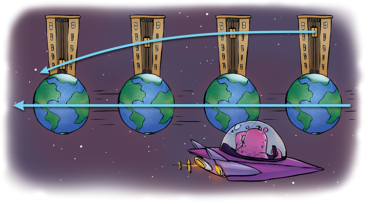
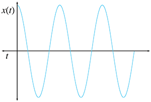
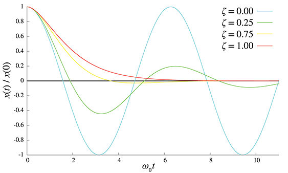
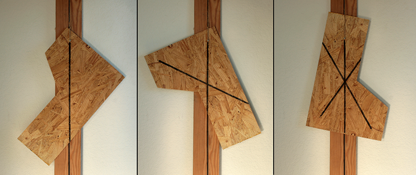
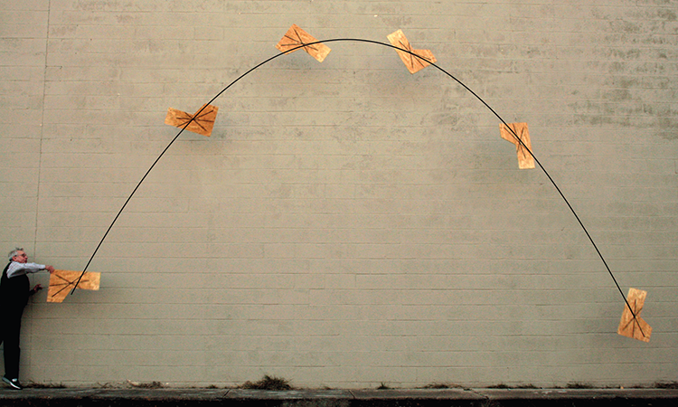
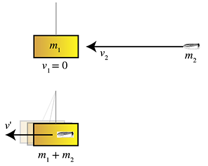
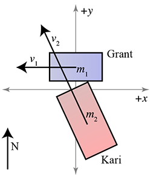
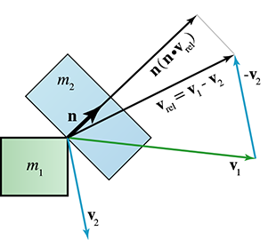
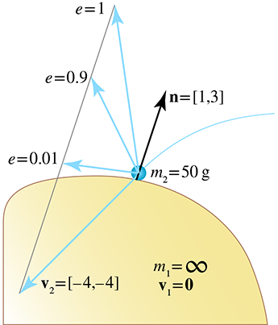
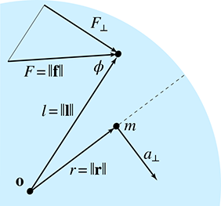

[<< Mechanics 1: Linear Kinematics and Calculus](kinematics_calculus.html)

[Contents](./)

[Curves in 3D >>](curves.html)

Chapter 12 

Mechanics 2: Linear and Rotational Dynamics

The Force is what gives a Jedi his power.  
It's an energy field created by all living things.  
It surrounds us and penetrates us.  
It binds the galaxy together.

— Obi-Wan Kenobi in  
_Star Wars Episode IV: A New Hope_ (1977)

[Chapter 11](kinematics_calculus.html) was about linear kinematics—how to describe the motion of object, without concerning ourselves with the “cause” of the motion, its orientation, or how we might go about simulating that object on a computer. The main goals of this chapter are to address those three topics.

*   [Section 12.1](#newtons_laws) identifies and quantifies the “cause” of motion, _force_, and presents three physical laws formalized more than 400 years ago by Isaac Newton in his masterwork the _Principia_.
*   [Section 12.2](#some_important_force_laws) discusses a few particularly important and simple types of forces.
*   [Section 12.3](#momentum) introduces _momentum_ and presents the important relationship between force and momentum.
*   [Section 12.4](#impulses_and_collisions) is about collisions and _impulses_, which are large forces that act for short durations.
*   [Section 12.5](#rotational_dynamics) considers the rotation of objects and the angular analogs of the linear concepts introduced up to this point.
*   [Section 12.6](#computer_simulation) turns to matters of implementation, looking at some basic problems that a digital simulation needs to address. It gives an overview of how contemporary real-time rigid body simulations solve them.

# 12.1Newton's Three Laws

Sir Isaac Newton established three simple laws that provide a framework, commonly known as _Newtonian mechanics_, for understanding such diverse physical systems as an apple falling from a tree, the motion of the planets, and the physical interactions that happen in a video game. Newtonian mechanics is also called _classical mechanics_, and that name should alert you to the fact that the laws we are about to study are _wrong_, in the sense that they do not agree with the result of experiments conducted at very high speed (which require relativistic mechanics) or at very small scale (which require quantum mechanics).[1](#footnote_1) For everyday phenomena (and for the phenomena we need to simulate in a video game), the discrepancy between the results predicted by Newtonian mechanics and the correct results (as correctly predicted by quantum-relativistic mechanics) is generally less than can be detected with the most accurate instruments. The differences in the predictions become significant only at speeds very close to the speed of light and at scales approaching the size of an atom; otherwise, all the theories are in great agreement with each other and with experimental results. It was precisely because Newtonian mechanics has such a long and decorated history of accurate predictions that it was so shocking to find out that the laws were in need of correction. It should be clear that these laws, having been sufficient to describe the motions of the heavenly bodies to a great deal of accuracy, will also be quite sufficient for our purposes here.

## 12.1.1Newton's First Two Laws: Force and Mass

[Chapter 11](kinematics_calculus.html) noted that _mass_ measures the degree to which an object resists being accelerated. This resistance is called _inertia_, and the physical quantity needed to overcome it and create an acceleration is called _force._ In other words, all of those “causes of motion” that we so scrupulously avoided mentioning in the previous chapter actually go by the collective name _force_.

The idea that objects resist acceleration is summarized by Newton's first law.

Newton's First Law

Every body persists in its state of being at rest or of moving uniformly straight forward, except insofar as it is compelled to change its state by force impressed.

This seems like quite a simple statement, even in the anachronistic translation of Newton's original Latin. But consider how audacious it was for Newton to assert this, when it so clearly is at odds with the commonsense observations we all have from our daily lives! A more “commonsense” way to think about force is to assume that force is needed not only to start an object in motion, but also to maintain its motion. (This is the rule under so-called _Aristotelian dynamics_.) After all, once we stop applying the force, eventually the object will stop moving, right? According to Newton, once an object is set in motion, it does _not_ require any force to continue this motion. In fact, Newton claims that the force is required to _stop_ the object, and absent this stopping force, the object will continue on indefinitely.

Of course, the reason Newton's first law seems counterintuitive is that in our everyday experience, when we set objects in motion, they are always brought to a stop by the ubiquitous force of friction. But we can argue that Newton's law is correct, even though objects always come to a stop through friction, with a simple thought experiment. Imagine we apply a certain amount of force and set an object in motion across a surface. The object will travel a certain distance and eventually come to a stop. Did it stop due the lack of continued pushing force, or due to some force that acted to slow it down? If we perform the same experiment on different surfaces, performing the initial push in the same manner in each case, we find that the object travels farther on a smoother surface, and less distance on a rougher surface. You probably aren't surprised at these ”commonsense” results, but notice how they actually contradict the notion that a force is required to keep the object in motion and validate Newton's laws.

Newton clarified the precise relationship among mass, acceleration, and net force in his second law.

Newton's Second Law

The acceleration of a body is proportional to (and in the same direction as) the net external force acting on the body, and inversely proportional to the mass of the body:

(12.1) f \=m a .

This simple equation is the most important one in this chapter. You should certainly memorize it. It basically says that whenever a particle with mass m is seen accelerating at a rate a , you can be sure that there is a net force f acting on the particle. Likewise, whenever there is a net force, the object will accelerate, because net force and acceleration always go together. _There are no exceptions to this rule._ The acceleration of an object is always proportional to the net force acting on it at that moment.

Now this does not mean that when there are _any_ forces on an object, it will necessarily accelerate. Nor does it mean that if an object is not accelerating, then there are no forces acting on it. The f in f \=m a is the _net_ force. Consider the tremendous forces exerted on the beams at the bottom of a skyscraper. Clearly there is a force that wants to accelerate the beam downward. However, since the beams do not in fact accelerate downward, we know by Newton's second law that this downward force must be exactly opposed by some other force acting in the opposite direction.

What sort of quantity is force? First of all, force has magnitude and direction, and so it is a vector quantity, just like acceleration (although at times it is easier to study force in a one-dimensional setting, just like we did with acceleration). And force must have the same dimensions (1D, 2D, or 3D, depending on the “world” in which we are working) as the acceleration a for [Equation (12.1)](#force_mass_acceleration) to make sense, because m is a scalar quantity.

Let's use dimensional analysis to determine the physical units that we should use to measure force. Mass is one of our fundamental quantities, denoted M , and from the previous chapter we know that acceleration has units L / T2 . Therefore (dropping the bold to indicate vector quantities), force must have units

Dimensional analysis of force

f\=ma\=(M)(L / T2).

When measuring with the SI units—mass in kilograms, length in meters, and time in seconds—force has the units of “kilogram meter per second squared.” This is quite a mouthful, so it goes by a special name, the _Newton_, denoted N:

The Newton is an SI unit of force

1  N \=1  kg m s 2.

If you're having trouble grasping just what a “kilogram meter per second squared” is, just remember that a Newton is the amount of force required to accelerate a mass of 1 kg at a rate of 1 m/ s 2 .

There's a common misunderstanding that we'd like to cut off as early as possible. Force creates an acceleration on a body, and it acts _over time_. For example, the question, “How much force does it take to get a 100 lb object to go 100 mi/hr?” does not make sense. Force doesn't produce velocity directly, it causes the velocity to change over time. This can be especially confusing when you consider collisions, such as a ball bouncing on the floor or being struck by a bat. Although the velocity appears to have changed instantaneously, what is really happening is that a very large force is acting for a very short (but finite) duration. We study collisions in more detail in [Section 12.3](#momentum). Typically in digital simulations impulsive forces are handled differently from more persistent forces that act over several simulation steps, so for now, don't think of a force as an impact; instead, think of it as more of a gradual push or pull that could be provided by, for example, a spring, the wind, or gravity.

We said that [Equation (12.1)](#force_mass_acceleration) is the traditional way to express the relationship among force, mass, and acceleration. However, written in that way, with force on the left-hand side, you might get the idea that the common situation is for us to know the mass and acceleration, and use Newton's laws to compute the force. In fact, especially in digital simulations, the more common scenario is that we have calculated the forces acting on a body, and we wish to predict the body's response to those forces. In other words, we'll usually use Newton's second law in the form

We usually use this form of Newton's second law

(12.2) a \= f / m.

Most physics textbooks teach the important conceptual tool known as a _free-body diagram_. Newton's second law, especially as expressed in [Equation (12.2)](#a_equals_f_over_m), is at the heart of this exercise. The basic procedure is as follows, starting with a representation of the object.

1.  Draw and label all the forces acting on it.
2.  Sum up those forces (using vector addition) to compute the net force.
3.  Use Newton's second law ([Equation (12.2)](#a_equals_f_over_m)) to compute the acceleration of the object.
4.  Integrate the acceleration to determine the motion of the object. When solving problems analytically, this means solving differential equations. We don't use any differential equations in this book because there are only a few simple cases that we will look at analytically. Numerical methods of integration must be used. Later, we examine Euler integration, which is the most simple method imaginable, but also the one used by most real-time rigid body simulators.

The above procedure is a very important tool that we use several times in [Section 12.2](#some_important_force_laws); it's also essentially how most digital physics simulations work inside a computer. Of course, the simplicity with which we've described this 4-step process hides many troublesome difficulties. The forces in [Equation (12.2)](#a_equals_f_over_m) may vary continuously over time; be dependent on time, position, and velocity; exhibit nonlinearities or discontinuities; and in general be difficult to compute exactly or express and integrate in closed form. [Section 12.6](#computer_simulation) deals with physics simulations, but for now the key point that we want to emphasize is that Newton's second law is the fundamental driving equation.

## 12.1.2Inertial Reference Frames

If we take the special case where f \= 0 , then according to Newton's second law, a \= 0 . This is a restatement of his first law. So we see that if Newton had been just a _bit_ more clever, he could have said the same thing in only two laws instead of three. Of course, Newton not only broke through the barrier of “common sense” to create elegant formulas that explain the workings of every physical system in the entire universe, he also simultaneously invented a complete branch of the mathematics needed to fully explore these ideas—calculus. So perhaps he was a clever guy after all. We assume he had a good reason for keeping his first law; we interpret it as a statement about _reference frames_.

The vectors a and f are specified in some reference frame, and if we choose a bad reference frame, the equation does not hold. Reference frames in which the basic mechanical laws hold (especially f \=m a ) are known as _inertial_ reference frames. Coordinate spaces for which this law does not hold unless we invent fictional forces are called _noninertial_ frames.

Figure 12.1 A robot in a falling elevator is in a non-inertial frame. He must invent a fictitious upward force to counteract gravity to explain why his herring sandwich doesn't fall.

For example, imagine a robot eating a herring sandwich in an elevator. Someone cuts the elevator cables, and the elevator, robot, and sandwich begin to fall. Now, this robot has been programmed with the knowledge that it likes to eat herring sandwiches,[2](#footnote_2) but without any general sense of self-preservation, so it does not panic. It looks at the herring sandwich floating in mid-air instead of falling to the elevator floor, as it would reasonably expect. The robot, having also been programmed with an incomplete understanding of Newton's laws, thinks to itself, “My goodness, this is quite unusual! I know gravity must be pulling this sandwich downwards and I know f \=m a , and since the sandwich is not accelerating downwards, the net force acting on it must be zero. Therefore, there must be some _upward_ force acting on this sandwich. Quite fascinating! What might be the source of this force? Now, if I calculate…” _CRASH!_

Figure 12.2 An alien watching the elevator fall as Earth moves past will not see anything to contradict Newton's three laws, assuming the time period is short enough so that Earth's rotation and curved path are not significant factors.

A viewer on the ground would not see any need to invent a fictitious force to explain the sandwich's behavior. Using a reference frame with the origin fixed at the bottom of the building, the viewer sees the sandwich as accelerating downward, and has no reason to think anything is amiss.[3](#footnote_3) The person driving by in a car also doesn't see any problems. In the reference frame of the car, the sandwich appears to travel in a parabolic motion. But the relation f \=m a seems to hold, and so the driver observes that Newton's laws are valid in her reference frame. Likewise for the advanced alien civilization watching from their cloaked spaceship as Earth whizzes past (see [Figure 12.2](#elevator_fall_alien_inertial_frame)). From their[4](#footnote_4) perspective, everything seems to be obeying Newton's laws. To the alien, Earth is moving with a constant linear velocity and the elevator's trajectory is parabolic, just as we would predict using the projectile equations developed in [Section 11.6](kinematics_calculus.html#constant_acceleration). (Actually, we are ignoring some finer points, such as Earth's rotation, the curved path it takes as it orbits the sun, and the do-si-do it does with the moon. These deviations from constant linear velocity are the exceptions that prove the rule: they are the reason why a reference frame fixed to Earth's surface is not quite an inertial frame. Experiments such as Foucault's pendulum can detect the difference, even though it is slight.)

In summary, if a reference frame is accelerating or rotating, the motion of objects described using that reference frame will not be consistent with mechanical laws. An inertial reference frame must be stationary or moving at a constant linear velocity.

## 12.1.3Newton's Third Law

Newton's third law is often misunderstood in spite of being the one most often quoted. It has a certain zen-like justice to it.[5](#footnote_5)

Newton's Third Law

To every action there is always an equal and opposite reaction. Or, the forces of two bodies on each other are always equal and are directed in opposite directions.

This law basically says that there is no such thing as a single unilateral force. If object A pushes or pulls on object B , then object B always pushes or pulls back on object A with a force of the same magnitude but opposite direction. If gravity is pulling me towards Earth, it's also pulling Earth towards me! A force is always part of an _interaction_ between two bodies.

In diagrams, we often draw a force as an arrow, since it is a vector. But really, these diagrams would be more accurate if both ends of the arrow had arrowheads. When we leave off the other side of the arrow, it's because it is acting on an object in which we have no interest. When you see a single-sided arrow that represents a force in a diagram, you can always fill in the other half in your mind.

One source of misunderstanding of Newton's third law is the word “reaction.” The purpose of this word is to describe the forces as being in opposition to one another. It is not meant to imply a causal link between them; neither force is a “cause” or “effect.” The two opposing forces act simultaneously and, so far as the laws of physics are concerned, have equal status.

But aside from this mistaken inference of cause and effect, the third law is just plain counterintuitive. Let's say a guy named Moe pushes a box forward on the ground. The box weighs twice as much as Moe, and he has placed it on a cart that rolls with very little friction. According to Newton's third law, the box pushes back on Moe. But then why does the box accelerate and Moe doesn't? It doesn't look like there are “equal and opposite actions” happening here.

Conundrums such as these are always resolved by considering _all_ the forces acting on both bodies. In the example just discussed, Moe is not floating in midair, or else he _would_ have been accelerated backwards just as Newton's third law predicts he would. (Consider what would happen if Moe and the box were on ice.) No, Moe is standing on the ground. Through the force of friction, Moe pushes against the Earth and the Earth pushes back on Moe. In fact, if we assume that Moe makes some forward progress instead of just being stuck there grunting, then the force of the Earth pushing against him must exceed the force of the box pushing back against him, and he accelerates _forward_. This is illustrated in [Figure 12.3](#newtons_third_law_moe_box_push).

Figure 12.3The four forces involved in Moe pushing the box

An inquisitive reader might wonder about the previous scenario, “Why doesn't the Earth then accelerate?” The short answer is, “It does!” A medium-length answer is, “It does, in the short run.” For the full length answer, we have to wait until [Section 12.3](#momentum), which tells us a little bit about _momentum_.

Of course, these theoretical questions are certainly interesting to ponder, but what practical application is there for Newton's third law? The most important application, for our purposes, is the justification to simplify a rigid body and treat it as a single particle. For example, earlier we considered the forces acting on a large beam in a skyscraper. What if the beam is not a single solid piece, but instead it is really two beams that have been bolted together? Then really what is happening is that forces push down on the top part of the beam, which pushes down on the bottom part of the beam, which pushes down on the Earth. Likewise, the Earth is pushing back up on the bottom part of the beam, which pushes up on the top part of the beam.

But why stop there? Isn't any object actually composed of not just two or three pieces, but trillions of molecules? How can we possibly calculate all these complicated quantum-electrical forces? This is where Newton's third law comes in. We are justified in the treatment of this spliced beam as a single rigid body, and we can ignore all the internal forces, _provided that the body stays rigid_, which means that all pairs of points within the object maintain a fixed distance from each other. In this situation, the parts are not accelerating relative to each other, and this means that the internal forces must be exactly balanced. In other words, all the internal forces cancel each other out and thus make no contribution to the net force, which is why we can ignore them. Of course, to the extent that the pieces _do_ accelerate relative to each other, any calculations we make ignoring the internal forces will be inaccurate. If the bending or compression of the object is very slight, then our calculations will not be perfect, but they will be very close; if the object breaks apart, then our calculations will be meaningless.

We can generalize arguments such as this even further to the case where the parts _are_ moving relative to each other. Of course, an object with moving internal parts is the opposite of a rigid body; however, we'll see that in many respects we are still able treat these complicated systems as “particles.” [Section 12.3](#momentum) discusses this idea and how it allows us to resolve the conundrum of Moe and his box.

# 12.2Some Simple Force Laws

Many different types of forces are at work in our universe.[6](#footnote_6) In a real-time simulation, we often ignore certain forces, make approximations to them, and even invent fictional[7](#footnote_7) forces to achieve a desired effect (such as forcing a trajectory to obey an animator's constraints, or helping the AI or the player hit the target). Although our guiding principle is always f \=m a , the methods used to define f can vary greatly.

This section discusses three important forces that exist in the real world and are often used in physics simulations. Gravity, friction, and springs are the subjects of [Section 12.2.1](#force_gravity), [Section 12.2.2](#force_friction), and [Section 12.2.3](#force_spring), respectively. Of course, a computer simulation may need to consider many more real-world forces, such as buoyancy, drag, or lift. The goal of this book is to give an overview of the most important topics and not to be exhaustive; however, sources that cover these types of forces are listed in the suggested reading in [Section 12.7](#suggested_reading).

One other extremely important force that appears in physics simulations is the _contact force_, also known as a _normal force_. This is the force that prevents objects from penetrating each other. When a box is resting on a table, the force the table exerts on the box, counteracting the force of gravity and preventing the box from accelerating downwards, is called a _contact force_. Contact forces in a physics engine are inherently tied up with the engine's method for resolving collisions and are usually handled in a way that forms a compromise between the stability of the simulation and physical reality. As such, the details for how contact forces are computed can vary from one physics engine to another; indeed, resolving collisions is a very active area of research.

## 12.2.1Gravitational Force

In _Principia_, Newton stated all sorts of laws in addition to the three for which he is the most famous. One such law, which he discovered through analysis of the motions of the planets, is the _law of universal gravitation_, which states that all objects in the universe feel an attractive force to each other. This force is proportionate to the product of their masses and inversely proportionate to the square of the distance between the objects and can be calculated by [Equation (12.3)](#universal_gravitation).

Law of Universal Gravitation

(12.3)f\=G m1m2 d2.

In this equation, f is the magnitude of the force, m1 and m2 are the masses of the two objects, and d is the distance between their centers of mass. (We'll have more to say about exactly what the center of mass is in [Section 12.3.2](#center_of_mass).) G is a physical constant of the universe, approximately equal to 6.673×10 −11   N   m 2  kg −2 .

The law of universal gravitational attraction is very helpful if you want to understand planetary motion or the tides, or just need a cheesy pick-up line.[8](#footnote_8) However, most simulations are confined to a fairly small region close to Earth's surface. When we make the typical assumption that one Cartesian axis points “down,” we are ignoring the curvature of Earth and also locking in the direction of the force of gravity to a constant. It's also common to ignore the slight decrease in the strength of gravity that occurs at higher altitudes, and assume a constant value for d . Thus, if we let m1 stand for Earth's mass, then the only variable in [Equation (12.3)](#universal_gravitation) is m2 , the mass of the object being simulated. In most video games, the force of gravity is computed using [Equation (12.4)](#gravity_calc_constant_direction).

Video Game Gravity

(12.4) f \=m g .

In [Equation (12.4)](#gravity_calc_constant_direction), m is the mass of the object and g is a constant vector pointing in the downward direction. Notice that the force of gravity is proportional to the mass, but Newton's second law says that the acceleration due to any force is _inversely_ proportional to mass. Therefore, g specifies the acceleration due to gravity for all objects in free fall. (Notice the similarity between [Equation (12.4)](#gravity_calc_constant_direction) and Newton's second law, f \=m a .)

[Chapter 11](kinematics_calculus.html) told you what the magnitude of g is in the real world, but let's see if we can derive it from the universal law of gravitation. Earth's mass is approximately m1\=5.98×10 24   kg , and its mean radius is 6,371 km:

Calculating the force of gravity near Earth's surface from the law of universal gravitation

f\=G m1m2 d2\= (6.673×10 −11 N   m 2 kg 2 ) (5.98×10 24   kg )m2 (6.371×106  m )2 ≈(9.83  N )m2 kg ≈ (9.83  m s 2) m2.

But wait, this value is larger than the value of 9.81 quoted earlier! The reason for the difference is that, while Earth's gravity provides a centripetal force, its rotation creates an apparent _centrifugal_ force, which partly counteracts gravity. We calculated the magnitude of the acceleration required to keep objects from spinning out into space in [Section 11.8](kinematics_calculus.html#uniform_circular_motion). At the equator, Earth's rotation requires that gravity provide a centripetal acceleration of 0.03369  m   s −2 . Thus a small part of the force of gravity that makes objects feel heavy is being counteracted by the spinning of Earth, which makes them feel lighter.

Subtracting this apparent centrifugal force from the force of gravity gives us 9.83−0.03369≈9.796 , but now the value is too small, not the 9.81 we were looking for. The reason is that gravity exhibits variations in magnitude over Earth's surface. The biggest source of this variation is the centripetal acceleration we have just calculated; it varies with latitude. We computed its magnitude assuming r was Earth's radius; the resulting value for gravity of 9.796 is actually the correct strength of gravity at the equator. As the latitude increases and we move towards the poles, the radius r of the circular path (which has constant latitude) decreases. At the poles, the radius shrinks to zero, and objects rotate but do not move in a circular path. Thus there is no apparent centrifugal force at the poles, and the force of gravity is equal to the 9.83 value we computed above. The value 9.81 is known as the “standard value,” and is the average force of gravity at sea level at a latitude of about 45°.

Now that we've discussed at some length the strength of gravity in the real world, let's talk about how this number is often completely irrelevant in video games. In certain genres, such as racing or flight simulators, realism is important. However, in most other video games, the _first law of video game physics_ applies. (Hey, Newton made up some laws, so why can't we?)

First Law of Video Game Physics

Reality is overrated.

For example, first-person shooters are notorious for poor jumping mechanics. The most important reason is probably the fundamental fact that you cannot see your feet, yet some first-person games have for some reason added jumping puzzles. But even many third-person shooters that adopt an over-the-shoulder camera also have jumping mechanics that just don't feel right. Why? In most first-person shooters, when you jump, you are given an initial burst of upward velocity, and then your position is simulated just like every other airborne object in the world, using gravity, which causes your motion to be parabolic. Compare this to the jump mechanic in most third-person action games. Most of these games do _not_ simulate jumps using a constant acceleration. Instead, your character will spring up almost instantaneously after you hit the button, and reach a maximum height very quickly. In many games, the character will _hover_ at that maximum height for a duration, and then slam back down on the ground as quickly as it rose up, perhaps leaving a crater behind. This is clearly not physically accurate, but then again, neither is being able to jump two or three times your own height, steer in midair, or double jump. When it comes to jumping in video games, reality is not just overrated, it's completely ignored. It just doesn't feel right.

If simulating a jump mechanic using gravity makes for a bad jump mechanic, simulating a jump mechanic using a value of 9.8  m / s 2 is even worse. The basic problem is that most players expect a jump to take a certain amount of time but also expect to be capable of jumping to unrealistic heights. When real-world gravity is used to attain these heights, the player is in the air too long, and it feels “floaty.” Many arcade racing games also increase gravity to get the car back on the ground more quickly. Whether it be racing games or character games, the player wants to be in full control again as quickly as possible, and waiting for real-world gravity to get them back down usually takes too long. And then there are other racing games that use a value of gravity that is _less_ than the real world value, to facilitate unrealistic jumps at realistic vehicle speeds.

There are also reasons to fiddle with gravity for non-player-character objects as well. Sometimes real-world gravity can create an “objects made of styrofoam” feeling for simulated objects in general,[9](#footnote_9) so gravity is increased to get an object to tip over and come to rest more quickly. In other situations, an artificially low value of gravity can make a large object seem even more massive (especially when accompanied by the right sound effects), because acceleration on Earth is constant and is one of a few cues humans instinctively use to establish an absolute scale for objects in the distance.[10](#footnote_10)

Hopefully, while reading the preceding design discussion you absorbed a general message rather than focusing on our specific opinions. What “feels right” is a subjective matter; furthermore—and this is the key point—it is based more on player expectation than physical reality. In the end, what matters most in a video game is not what's going on in the CPU or even on the screen, but what is going on in the player's mind. And the human mind is highly susceptible to suggestion. When creating video games, always remember that the quest for realism should never be an end unto itself, but rather a successful video game will harness realism only where it serves the ultimate goal, which is entertainment. In fact, realism is quite often _opposed_ to this goal. Video game makers (especially programmers!) often get these priorities confused and end up creating an impressive technical demo that isn't any fun.

## 12.2.2Frictional Forces

If we take an object such as a bowl of petunias and slide it along a surface, we know that it will eventually come to a stop. We also know that if we place this bowl on a surface that isn't quite level, it won't necessarily slide downhill unless the angle of inclination exceeds a certain threshold. These two phenomena are slightly different aspects of the force of _friction_. We are accustomed to thinking of friction as an onerous enemy of productivity, the evil cause of wear on machines and more frequent trips to the gas station. But keep in mind that without friction, we wouldn't be able to walk across a room or pick up a child (or a bowl of petunias). Without friction, our cars might have better fuel efficiency, but the transmission wouldn't work and the tires would spin in place instead of propelling the car forward.

Here we consider the two modes of the standard dry friction model, which is sometimes called _Coulomb friction_. Although several thinkers contributed to our understanding of friction, Charles-Augustin de Coulomb (1736–1806) is the guy who got his name to stick. When an object is at rest on top of another object, a certain amount of force is required to get it unstuck and set it in motion. If any less force is applied to the object, the force of friction will push back with a counteracting force up to some maximum amount. This type of friction is known as _static friction_, and it prevents bowls of petunias sitting on slightly inclined tables from sliding off. Once static friction is overcome and the object is moving, friction continues to push against the relative motion of the two surfaces, but the magnitude of this force, known as _kinetic friction_, is less than that of static friction. Kinetic friction is what causes a bowl of petunias to eventually come to a stop after we set it in motion.

Friction is the result of complicated interactions at the microscopic level, and so it is somewhat surprising that its macroscopic behavior can be described by relatively simple equations. Let's consider static friction first. Like any force, static friction is a vector. The direction of static friction is always in the direction that opposes any forces that would otherwise cause objects to move relative to each other. This might seems a bit like cheating (“How does the friction always know the correct direction to push?”), but remember that the force is actually the aggregate result of many electrical forces acting at the microscopic level. The forces are the result of molecular bonds that have formed between the objects as they came in contact, and these bonds need a force to pull them apart.

A good approximation for the maximum magnitude of static friction is computed with [Equation (12.5)](#static_friction).

Static Friction

(12.5)fs\=μsn.

The dimensionless constant μs is known as the _coefficient of static friction_, and n is the magnitude of the normal force. Let's talk about each of these in more detail.

From our perspective, μs is certainly the easier of the two to deal with: just look it up in a table! [Table 12.1](#coefficients_table) shows just such a table. Note that we are jumping ahead a bit and showing coefficients for both static and kinetic friction. Ignore the kinetic friction column for now.

Material 1

Material 2

μs (Static)

μk (Kinetic)

Aluminum

Steel

0.61

0.47

Copper

Steel

0.53

0.36

Leather

Metal

0.4

0.2

Rubber

Asphalt (dry)

0.9

0.5–0.8

Rubber

Asphalt (wet)

0.25–0.75

Rubber

Concrete (dry)

1.0

0.6–0.85

Rubber

Concrete (wet)

0.30

0.45–0.75

Steel

Steel

0.80

Steel

Teflon

0.04

Teflon

Teflon

0.04

Wood

Concrete

0.62

Wood

Clean metal

0.2–0.6

Wood

Ice

0.05

Wood

Wood

0.25–0.5

Wood (waxed)

Dry snow

0.04

Table 12.1Static and kinetic coefficients of friction

Of course, somebody actually has to fill out these tables! The methods for obtaining these data are interesting and rather elegant but they are not our primary concern here. What is very important for us is that the coefficients of static and kinetic friction depend on the properties of _both_ interacting surfaces. In other words, [Table 12.1](#coefficients_table) is indexed not by a single surface type, but by a _pair_ of interacting surfaces. So, for example, although using this table we can find the coefficient of static friction for rubber against asphalt, we cannot use this information to say anything about, for example, rubber against ice, or wood against asphalt. The coefficient of static friction for each pair of surfaces has to be measured experimentally because of the complexity of the microscopic interactions.

Also, note that [Equation (12.5)](#static_friction) tells us the _maximum_ strength of the static friction force. The actual force exerted at any instant will meet the magnitude of any forces acting on the objects that tend to induce lateral relative motion, up to this maximum. Once this maximum is exceeded, the static friction ceases to operate, and kinetic friction takes over.

The other factor in [Equation (12.5)](#static_friction) is the magnitude of the _normal force_, which is the force acting perpendicular to the surfaces that prevent them from penetrating each other. One common situation occurs when an object (such as a bowl of petunias) is resting on top of another object (such as a table). The normal force in this case is simply the force required to counteract gravity. To be more precise, it is the force required to counteract the component of gravity that acts perpendicular to the surfaces and wants to smash them together. If the table is at an incline, then we can separate gravity into a normal component and a lateral component, as shown in [Figure 12.4](#friction_normal_force). (Inside a computer, we'd probably describe the orientation of the table with a normal vector, and use the dot product to separate gravity into the relative and normal components, as we described in [Section 2.11.2](vectors.html#dot_product_geometry).) Since the bowl and the table do not accelerate relative to each other, we know that the normal force of the table pushing against the bowl must be exactly equal to the normal component of the force of gravity pulling the bowl towards the table.

Figure 12.4 Free-body diagrams of a bowl of petunias on a table at various angles of inclination.

[Figure 12.4](#friction_normal_force) shows several free-body diagrams of identical bowls of petunias resting on tables at various angles of inclination. Notice that in each figure, the force of gravity acting on the bowl, labeled g , is the same. The normal and lateral components of gravity have been broken out in blue. The actual force of static friction is the black vector labeled f s . On the left, the maximum amount of friction available is labeled “max f s ,” in the middle and right-hand images the maximum amount of friction is being applied.

In the first scenario, there is more friction available than necessary to stop the sliding. However, as the angle of inclination increases, the normal component of gravity decreases, which reduces the amount of friction available. Meanwhile, as the perpendicular component of gravity is decreasing, the lateral component is increasing, which makes the bowl want to slide. The force of static friction must counter this lateral component if the bowl is to remain in equilibrium. The center image shows the critical angle at which the lateral force of gravity is exactly equal to the to the maximum amount of friction. On the right, we imagine that we have tilted the table while holding the bowl in place, and then let go of the bowl. The maximum available friction is being applied, but it's less than was available in the center picture due to the decrease in the normal force and isn't enough to overcome the increased lateral component of gravity. Just after this picture was taken, friction switched from static mode into kinetic mode, the bowl slid off the table and shattered, and a cartoon cleaning robot scurried in through a little door in the wall to clean up themess.

Calculating kinetic friction is essentially identical to static friction. The only difference is that we replace the subscript s with a k .

Kinetic Friction

(12.6)fk\=μkn.

The direction of the force of kinetic friction is always opposed to the relative motion of the surfaces. (Remember, according to Newton's third law, there are actually _two_ forces, one pushing against the bowl, and the other against the table, and they are in opposite directions.) As we said earlier, the coefficient of kinetic friction is usually _less_ than the coefficient of static friction. Thus, if we increase the angle of the table ever so slowly so that static friction is _just_ overcome, the petunias will begin to accelerate, based on this difference between kinetic and static friction. Coulomb's primary contribution to the theory, sometimes called _Coulomb's law of friction_, was that the force of kinetic friction does _not_ depend on the relative velocities of the surfaces, so, unlike static friction, there is no distinction between the effective force and the maximum force.

Notice that the amount of area that the two objects are in contact does _not_ appear in Equations [(12.5)](#static_friction) or [(12.6)](#kinetic_friction). For example, let's say we repot the petunias in a taller bowl with a smaller footprint but the same weight. We have reduced the surface area where the bowl and table are in contact, but all of the forces depicted in the free-body diagrams in [Figure 12.4](#friction_normal_force) remain the same. Doing this would _not_ change the angle at which the bowl would begin to slide! Although it might seem like a larger surface area would give the objects more to “grab” with, this is offset by the decrease in pressure, since the same total normal force is now distributed over a smaller contact area. Now, a very tall bowl may begin to _tip over_ before it begins to slide. But this is a matter of rotation, the increase in the tendency to rotate being caused by an increase in the lever arm resulting in a greater torque. We cover these issues in [Section 12.5](#rotational_dynamics).

## 12.2.3Spring Forces

There's one more class of force that is important enough to discuss in its own section: the forces exerted by a spring disturbed from its equilibrium position. Why do we discuss this admittedly peculiar class of force? Have springs suddenly become prominent features in video games and their accurate simulation an important gameplay feature? Actually, yes. Even if you don't see very many _literal_ springs in a video game, there are likely very many “virtual springs” at work. Springs exhibit a general behavior that is _very_ useful for enforcing constraints, preventing objects from penetrating, and the like.

This section presents the classic equations of motion for damped and undamped oscillation. It covers undamped oscillation first, and then damped. It's often the case in a video game that programmers use a virtual spring (often in the form of a spring-damper system) when really what they are using is a _control system_. There are certain advantages to be had when the physical nature of the problem is dropped and we think of it purely in mathematical terms. (Indeed, many times the problem was never really physical to begin with, and was only recast in physical terms so that the spring-damper apparatus could be applied.)

Like the friction law, the force law for springs is a surprisingly accurate approximation to the macroscopic behavior that is the result of complicated microscopic interactions. Consider a spring with one end fixed and the other end free to move in one dimension. When the spring is at equilibrium with no external forces on it, it has a natural length, called the _rest length_. If we stretch the spring, then it will pull back to try to regain its rest length. Likewise, if we compress the spring, it will push back. But how do we know the strength of the force in each case? That's what the force law tells us.

The force law for springs is known as _Hooke's law_, and it basically says that the magnitude of the restorative force is proportional to the difference from the current length and the rest length (provided the force does not exceed a value called the _elastic limit_, which varies with the material used to construct the spring). If we let l be the current length of the spring and l rest denote the rest length, then the magnitude of the restoring force f r is calculated by [Equation (12.7)](#hookes_law_lengths).

Hooke's Law for Spring Forces

(12.7)f r \=k(l rest −l).

The constant k is known as the _spring constant_ and essentially describes how “stiff” the spring is. The constant is not dimensionless. In order for [Equation (12.7)](#hookes_law_lengths) to make sense, we must have

\[ML / T2\]\=k\[L\],\[ML / T2\] / \[L\]\=k,\[M / T2\]\=k,

or you can just think of k as having units of “unit force per unit length.”

The really interesting thing about springs is how they behave over time. To see this, let's restate Hooke's law in a way that focuses on the kinematics of a particle that is being acted on by restorative forces. Specifically, we're interested in functions for the position, velocity, and acceleration of a particle.

Things get easier if we adopt a reference frame where the position x\=0 designates the “rest” position, where there are no restorative forces. Furthermore, since we are interested in the acceleration of the particle rather than the forces acting on it, we will introduce a constant K\=k / m , and since K contains both the spring constant k and the mass of the particle m , it measures the spring's ability to accelerate the specific particle of interest to us. With those notational changes, we can rewrite [Equation (12.7)](#hookes_law_lengths) as

Acceleration due to Hooke's law

(12.8)a(t)\=−Kx(t).

You should convince yourself that this is equivalent to [Equation (12.7)](#hookes_law_lengths) before continuing.

[Equation (12.8)](#hookes_law_acceleration) makes a statement about the relationship between the position function and the acceleration function; but what we really want is the function x(t) itself. Equations like this are called _differential equations_; they describe the relationship between some unknown function (in this case, x(t) ) and one or more of its derivatives (remember that acceleration is the second derivative of position). To “solve” a differential equation is to find the unknown function x(t) that satisfies the equation. We have been able to just barely scratch the surface of basic differential and integral calculus in this book, so we're not going to be able to cover the techniques of solving differential equations. Luckily, you don't need to know differential equations in order to verify that a proposed function x(t) is a solution—that requires only the ability to differentiate the function x(t) . As it turns out, this will be sufficient in the few cases in which we bump up against differential equations in this book.

We can make a pretty good guess at the form of x(t) by looking at a graph. We are not engaging in circular logic here; we don't need to know x(t) in order to get a graph, all we need is a spring with some sort of marking device attached to it.[11](#footnote_11) Such a graph is shown in [Figure 12.5](#spring_sinusoidal).

Figure 12.5 The graph of the motion of a spring. Hey, that looks familiar…

This function ought to look familiar to you: it's the graph of the cosine function. Let's see what happens if we just try x(t)\=cos⁡(t) as our position function. Differentiating twice to get the velocity and acceleration functions (remember, we learned about the derivative of the sine and cosine functions in [Section 11.4.6](kinematics_calculus.html#derivatives_special_functions_taylor_series)), we get

Close, but not quite right

x(t)\=cos⁡(t), x˙ (t)\=−sin⁡(t), x¨ (t)\=−cos⁡(t),

which is very close, but we're missing the factor of K .

To understand where K should appear in x(t) , consider what happens to the graph of x(t) when we change the value of K . In other words, we repeat our physical experiment and vary the stiffness of the spring or the mass of the marking device attached to the end of the spring. The result is that larger values of K (stiffer springs or less massive marking devices) result in a graph that is horizontally “compressed”: the frequency of oscillation is increased. Likewise, smaller values of K cause the spring to oscillate more slowly, and the graph is expanded. Furthermore, we observe that the frequency is proportional to the _square root_ of K —when we increase K by a factor of four, the frequency doubles. This gives us a hint as to where K should appear, since all we are doing is scaling the time axis.

A solution, but is it the only one?

x(t)\=cos⁡(Kt), x˙ (t)\=−Ksin⁡(Kt), x¨ (t)\=−Kcos⁡(Kt).

One verifies that this is a solution to the differential equation by plugging it into [Equation (12.8)](#hookes_law_acceleration). Remembering that a(t)\= x¨ (t) , we have

a(t)\=−Kx(t),−Kcos⁡(Kt)\=−K(cos⁡(Kt)).

The quantity K is the _angular frequency_ and comes up often enough that we find it helpful to introduce the notation

Angular frequency

ω\=K\=k / m,

and we can write the solution as

(12.9)x(t)\=cos⁡(ωt);

hence the reason for the name “angular frequency” becomes apparent.

So we have found the kinematics equation for the spring. Or, perhaps we should say that we have found _a_ solution to the differential equation. There are some degrees of freedom inherent in the motion of the spring that are not accounted for in [Equation (12.9)](#spring_diff_eq_solution_naive). First, we are not accounting for the maximum displacement, known as the _amplitude_ of the oscillations and denoted A . Our equation always has an amplitude of 1. Second, we are assuming that x(0)\=A , meaning the spring was initially stretched to the maximum displacment A and released with zero initial velocity. However, in general, we could have pulled it to some displacement x0≠A and then given it a shove so it has some initial velocity v0 .

It would appear that we have three more variables which need to be somehow accounted for in our equation if it is going to be completely general. As it turns out, the three variables we have just discussed—the amplitude, initial position, and initial velocity—are interrelated. If we pick any two, the value for the third is locked in. We'll keep A as is, but we'll replace x0 and v0 with the _phase offset_ θ0 , which describes where in the cycle the spring is at t\=0 . Adjustments to the phase offset have the simple effect of shifting the graph horizontally on the time axis. Adding these two variables, we arrive at the general solution, the equations of _simple harmonic oscillation_.

Simple Harmonic Motion

(12.10)x(t)\=Acos⁡(ωt+θ0), x˙ (t)\=−Aωsin⁡(ωt+θ0), x¨ (t)\=−Aω2cos⁡(ωt+θ0).

Now let's make some observations. First, remember that the sine and cosine functions are just shifted versions of each other: sin⁡(t+π / 2)\=cos⁡(t) . Thus we could have written x(t) using sine instead of cosine, the choice being mostly a matter of preference and an adjustment in the phase by π / 2 . The term “sinusoidal” can be used to refer to the shape of the sine and cosine functions, and we use it when either function will do.

Second, consider the frequency of oscillation. The sine and cosine functions have a period of 2π ; thus the oscillator will complete one cycle in the time it takes for ωt to increase by 2π . The angular frequency ω is measured in radians per unit time, but we can also measure the frequency F , which is in cycles per unit time, as

Frequency of simple harmonic motion

F\= ω 2π \= K 2π \= 1 2π km .

Notice that the frequency of oscillation depends only on ratio of the spring stiffness to the mass. In particular, it _does not depend_ on the initial displacement x0 : if we stretch the spring farther before letting it go, the amplitude increases, but the frequency will not change.

In many situations, the frequency is the important number we wish to control. This is especially the case for “virtual springs,” which are really control systems in disguise. In these situations, we don't need to bother with spring constants or masses, and we can write the equation of motion directly in terms of frequency, as

Simple harmonic motion in terms of frequency

x(t)\=Acos⁡(2πFt+θ0).

So far, we have been studying a physically nonexistent situation in which the restorative force is the only force present, and the spring will oscillate forever. In reality, there are usually at least two more interesting forces. The first of these forces is an external force, sometimes called the _driving force_, that acts as the “input” to the system and causes the motion to begin in the first place. The other force is the friction that any real spring experiences, which eventually causes the motion to cease. The general term used to describe any effect that tends to reduce the amplitude of an oscillatory system is _damping_, and we call oscillation where the amplitude decays over time _damped oscillation_. Damping forces are particularly important for our purposes, so let's discuss them in more detail.

The most common model for the damping force is a simple one that acts proportional to velocity but in the opposite direction, similar to the friction law. (Unlike the friction laws from the previous section, we don't have any of the business concerning the normal force.) The force is simply

Damping force

f d \=−c x˙ ,

where f d indicates the instantaneous magnitude and direction of the damping force, x˙ is the instantaneous velocity, and c is a constant that describes the viscosity, roughness, etc.

The damping force has an extremely simple form, but just as with the restorative force, things get interesting when we study the motion over time. Qualitatively, we can make some basic predictions about how damped oscillation of a spring would differ from undamped oscillation of the same spring. The more obvious prediction is that we would expect the amplitude of oscillation to decay over time, meaning the maximum displacement at the crest of each cycle is a bit less than the previous one. Like the force of friction, damping tends to remove energy from the system. The second observation is only slightly less obvious: since damping in general slows the velocity of the mass on the end of the spring, we would expect the frequency of oscillation to be reduced compared to undamped oscillation. Those two intuitive predictions turn out to be correct, although, of course, to be more specific we will need to analyze the math.

Combining the restorative and damping forces, the net force can be written as

f net \=f r +f d \=−kx−c x˙ .

To derive the equation of motion, we will need accelerations, not forces. Applying Newton's second law and dividing both sides by the mass, we have

(12.11) x¨ \= f net m \=− km x− cm x˙ ,

Next we rewrite this in terms of two new quantities. The first quantity, ω0 , is the _undamped angular frequency_ and is not really new. It is identical to the ω\=k / m introduced earlier; we are adding the zero subscript just to emphasize that it is the frequency that would occur without the damping rather than the actual frequency. (Remember, our prediction is that the actual frequency will be slower in some way.)

The second quantity is called the _damping ratio_, not to be confused with the damping coefficient c . The damping ratio is traditionally denoted by ζ , the Greek letter zeta, which looks weird and takes some practice to write by hand. The damping ratio is related to the damping coefficient, mass, and undamped angular frequency by the formula

Damping ratio

ζ\= c 2mk \= c 2mω0 .

In just a moment, when we explain the qualitative meaning of ζ , the utility in using this arbitrary formula will become apparent.

Substituting the undamped frequency ω0 and damping ratio ζ into [Equation (12.11)](#damped_oscillation_acceleration_Kc), we have

Differential equation for damped harmonic oscillation

(12.12) x¨ \=−ω02x−2ζω0 x˙ .

Readers with training in differential equations should recognize [Equation (12.12)](#damped_harmonic_oscillation_ode) as a second-order linear homogenous differential equation with constant coefficients, which is one of the very nicest differential equations we could hope for, meaning we can actually solve it with pencil and paper. Readers without this training shouldn't worry, because it won't be needed to understand the answer, to which we now fast forward, skipping the derivation. There are three distinct cases: underdamping, critical damping, and overdamping.

When 0≤ζ<1 , we say that the system is _underdamped_. In this case, as we have been predicting, the motion will continue to oscillate indefinitely with an amplitude that decays exponentially over time. The equation that describes this motion is

Kinematic equation for underdamped system

(12.13)x(t)\= (k1cos⁡(ωdt)+k2sin⁡(ωdt)) e −ζω0t ,

where ωd is the actual frequency of the damped oscillation and is related to the undamped frequency ω0 by

Damped angular frequency

(12.14)ωd\=ω01−ζ2.

The constants k1 and k2 are determined by the initial position and velocity:

k1\=x(0),k2\= ζω0x(0)+ x˙ (0) ωd.

Using ζ\=0 produces undamped oscillation, and [Equation (12.13)](#underdamped_harmonic_oscillation_kinematic) is equivalent to [Equation (12.10)](#undamped_oscillation_phase_offset).

Your common sense tells you that as we increase the damping ratio, the frequency of oscillation decreases; consulting [Equation (12.14)](#damped_oscillation_frequency), we see that at ζ\=1 the frequency completely vanishes. At this threshold, known as _critical damping_, the behavior of the system changes qualitatively. The system no longer oscillates, but instead decays exponentially. The kinematic equation in this situation is

Equation of motion at critical damping

(12.15)x(t)\= (k1+k2t) e −ω0t ,

where k1 and k2 are again determined by the initial conditions:

k1\=x(0),k2\=ω0x(0)+ x˙ (0).

Critical damping is just the right amount such that the system decays as quickly as possible without oscillation. If the damping is decreased, the system is underdamped, as previously described, and will oscillate. If the damping is increased, the system is _overdamped_; it will not oscillate, and the rate of decay will be slower than the rate at critical damping. [Figure 12.6](#critical_damping) shows how the damping value affects the behavior of a system.

Figure 12.6Undamped, underdamped, and critically damped systems.

Now that we've reviewed the classic equations that may be found in any physics textbook or on [wikipedia.org](https://wikipedia.org), let's say a few words about how spring-damper systems are used in video games as _control systems_. In

general, a control system[12](#footnote_12) takes as input a function of time that represents some target value. For example, our camera code might compute a desired camera position based on the player's position each frame; some AI code might determine an exact targeting angle for an enemy; we may have a desired player character velocity based on the instantaneous amount of control stick deflection; or we might have a desired screen-space position for some highlight effect, based on the currently selected choice in a menu. In any case, the current value of the input signal is known as the _set point_ in control system terminology. The set point is essentially the rest position of the spring, and the input signal is like somebody taking the other end of the spring and yanking it around. (So it's similar to a driving force, only usually what we have is a function describing a _position_ rather than a force or acceleration.)

The job of any control system is to take this input signal and produce an output signal. To go back to our earlier examples, the output signal might be the actual camera position to use for each frame, or the actual animated targeting angle the enemy will use to aim the weapon, the actual player character velocity, or the actual screen-space position of the highlight. For many control systems, the actual position and set point are not used; rather, only the _error_ is needed. Of course, an obvious question is, if we know the “desired” value, why don't we just use that directly? Because it's too jerky. In the same way that the shocks and springs on a car (a classic example of a spring-damper system) don't just pass along the elevation of the road directly to the car, a control system in a video game is often designed to “smooth out the bumps” caused by sudden state changes that might make the camera snap to a new position or the player jerk into motion. The camera or screen-space highlight are nonphysical examples in which the quantity of “mass” is not really appropriate and is dropped. But the differential equations are still the same, and they have the same solution. Stripped of the spring metaphor, we are left with what is known as a _PD controller_. The P stands for proportional, and this is the spring part of the controller, since it acts proportional to the current error. The damper is the D part, which stands for derivative, because the action of the damper at any given instant is proportional to the derivative (the velocity). PD controllers (and their more robust cousin, the _PID controller_, where the I stands for integral and is used to remove steady-state error) are broadly applicable tools; they have been standard engineering tools for decades (centuries?) and are well understood. Nevertheless, they are one of the most frequently reinvented wheels in video gameprogramming.

In practice, the simulation code is a very simple Euler integration of [Equation (12.11)](#damped_oscillation_acceleration_Kc). As shown in [Section 12.6.3](#euler_integration), this is a fancy way of describing code that looks like [Listing 12.1](#spring_damper).

struct SpringDamper {
    float value;    // current value
    float setPoint; // "desired" value
    float velocity; // current \`\`velocity'' (derivative of value)
    float c;        // damping coefficient
    float k;        // spring constant

    // Update the current value and velocity, stepping forward
    // in time by the given time step
    void update(float dt) {

        // Compute acceleration
        float error = value - setPoint;
        float accel = -error\*k - c\*velocity;

        // Euler integration
        velocity += accel\*dt;
        value += velocity\*dt;
    }
};

Different cars have suspensions that are tuned differently; sports cars are “tighter” and the cars retirees like to drive are smoother. In the same way, we tune our control systems to get the response we like. Notice that the simulation uses the k and c from [Equation (12.11)](#damped_oscillation_acceleration_Kc). However, most people don't find those to be the most intuitive dials to have for tweaking. Instead, the damping ratio and frequency of oscillation are used for the designer interface, while k and c are computed as derived quantities. To tune the frequency, we might adjust either the damped or undamped version, using either angular frequency or simply Hertz; the units and absolute value are often not important because the value that feels good will be determined experimentally anyway. For many systems in video games, oscillation is undesirable, so it's common to assume a critically damped system and fix ζ\=1 , leaving just the “frequency” (we put it in quotes since the system doesn't oscillate) as the only tunable value. A higher frequency is the sports car (more responsive, but jerkier), and a lower frequency is smoother, but can feel “laggy.”

Notice that the kinematic equations [(12.13)](#underdamped_harmonic_oscillation_kinematic) and [(12.15)](#critical_damped_kinematic) are not needed directly by the simulation, nor do we need to explicitly distinguish between underdamped, critically damped, or overdamped.

Before we leave this discussion, we must mention that the second-order systems we have described here are certainly not the only type of control system, nor even the simplest, but they do behave nicely under a very broad set of circumstances and are easy to implement and tune. Another commonly used control system is a simple first order lag, x˙ \=kx , under which the error decays exponentially. This is similar to a critically damped second-order system, but with a bit jerkier response to a sudden change in the set point. Another important and common technique is to “chase” the set point at a fixed velocity. A _filter_ is another broad class of control system, in which the output is computed by taking some linear combination of set points or values on previous frames.

# 12.3Momentum

Let's say that Moe's box from [Section 12.1.3](#newtons_third_law) has a mass m , and at a certain instant we observe it moving with a velocity v . Coming in late to the story, we cannot tell what magnitude of forces were used to achieve that motion, or how long the forces were applied, or what the history of the box's velocity was. For example, it could have been that the box was accelerated as a result of a constant net force f being applied over a duration Δt . But we have no way of knowing the values of f and Δt . Was a large force used for a small duration, or a small force for a longer duration? In fact, we have no reason to assume that the force was constant at all! Moe could have given the box a good shove and set it in motion, and then gave it another shove to speed it up.

While we don't know the exact history of Moe's pushes, we do know what the “total” was, in the sense about to be described. Assume that Moe did make one push with a constant force f applied for a duration Δt . Then according to Newton's second law, the acceleration was a \= f / m . Assuming the initial velocity was zero, we know that

v \= a Δt.

Substituting a \= f / m and rearranging, we get

Two ways to think of momentum

v \=( f / m)Δt,(12.16)m v \= f Δt.

The left- and right-hand sides of [Equation (12.16)](#momentum_total_two_ways) illustrate two different ways of thinking about the important concept of _momentum_. Momentum is the correct quantity to track in order to quantify the “total amount of pushing.”

Let's do dimensional analysis on [Equation (12.16)](#momentum_total_two_ways), first just to verify that it makes physical sense—it isn't intuitively obvious that these two products would bear the same physical meaning—and also to see what the units of momentum should be:

m v \= f Δt,M(L / T)\=(ML / T2)T,ML / T\=ML / T.

Note that momentum is a vector quantity, having both magnitude and direction.

To understand what momentum is, let's look at the two sides of [Equation (12.16)](#momentum_total_two_ways). First consider the left side, which interprets momentum as a product of mass and velocity. In fact, somewhere in almost every physics textbook you can find [Equation (12.17)](#p_equals_mv).

Momentum as Product of Mass and Velocity

(12.17) P \=m v .

The variable P is the traditional variable used to represent momentum. (Despite the capital letter, P is a vector quantity. We use capital P to avoid confusion with the notation p , which we sometimes use to refer to the position of a particle.)

[Equation (12.17)](#p_equals_mv) makes it clear that the momentum of an object is an _instantaneous_ property of an object. By saying this, we mean that we can define its value knowing only its instantaneous state, without worrying about how it got into that state. Furthermore, if you think of momentum as the “total amount of pushing” required to stop a moving object, then it certainly is intuitively appealing that it should be the product of mass and velocity. If the object is small and moving slowly (a pencil rolling on a desktop), only a small total force will suffice. If it's fast (a bullet) or heavy (a car that somebody left parked on an incline without the emergency brake set), a larger amount will be needed. If it's fast _and_ heavy (an airplane coming in for a landing), then you'd better get out of the way. The equation P \=m v quantifies the idea of “hard to stop.”

Although the memorable equation P \=m v from the left-hand side of [Equation (12.16)](#momentum_total_two_ways) is perhaps the more common way of explaining momentum, the right-hand side actually provides the most insight. The relation P \= f Δt shows that momentum, as the product of force and time, is what results when force acts over time. This is what was meant by the sloppy phrase “total amount of pushing.” We don't mean that the magnitude of the force pushing itself is changing or accumulating, but rather that the continued application of a net force always results in a buildup of momentum (or a reduction of momentum, when the directions of the force and momentum are opposed).

In fact, if we generalize the equation P \= f Δt , we can discover an even deeper relationship between force and momentum. What if, instead of pushing the box with a constant force, Moe pushed it with a force that varied over time? Then we can express the acceleration at any given time t as

(12.18) a (t)\= f (t) / m,

which is just Newton's second law to which we've added the notation “ (t) ” to be more explicit that a and f vary with time. We learned in [Chapter 11](kinematics_calculus.html) that if we integrate acceleration over time, we get the velocity as a function of time:

Velocity is the time integral of acceleration, remember?

(12.19) v (t)\=∫ a (t) dt.

Substituting [Equation (12.18)](#at_eq_ft_over_m) into [Equation (12.19)](#velocity_is_integral_of_acceleration), assuming that the mass does not vary over time, we have

v (t)\=∫ f (t) / m dt,m v (t)\=∫ f (t) dt.

Finally, if we let P (t) be the momentum of a body as a function of time, then by substituting P (t)\=m v (t) , we arrive at the important relation

Momentum as force accumulated over time

(12.20) P (t)\=∫ f (t) dt.

Since integration is a “summing up” process, [Equation (12.20)](#momentum_integral_of_force_wrt_time) confirms our interpretation of momentum as the result of continued application of force over time. (Note: in the preceding integrals we omitted the constant of integration, essentially assuming the initial velocity was zero.)

Remember that integration and differentiation are inverse operations. By taking the derivative of both sides with respect to t , we state the flip side of the relationship between momentum and force.

Force as the Derivative of Momentum

(12.21)d dt   P (t)\= f (t).

The net external force on a system is equal to the rate of change of momentum of the system.

[Equation (12.21)](#force_derivative_of_momentum) is not just an interesting observation about force and momentum, it's a completely valid way to _define_ force. In fact, although the modern presentation of Newton's laws is in terms of forces and masses, when Newton himself first expressed the laws, he wrote in terms of momentum. He used the word “motion,” but from his writings we understand that he used that word in a very particular sense, and he really was talking about momentum. (The word momentum hadn't been attached to that concept yet. Remember, he was the guy laying down all the ground rules.) Newton's second law was originally expressed in a form that more closely resembles [Equation (12.21)](#force_derivative_of_momentum) than the f \=m a form you will more commonlysee.

## 12.3.1Conservation of Momentum

Let's return to our investigation into what happens when Moe pushes against the Earth to get his box moving. Newton's law tells us that the Earth, not having anything else to push back on, receives a net force, and thus an acceleration (and a torque, which we discuss later). Yes, you cause the Earth to accelerate when you push boxes as well as when you take each and every step! Of course, the Earth's mass is so large compared to Moe's force that this acceleration is small. Not only that, but Moe's force pushing the box to the east might be canceled out by Joe's force in North Dakota pushing his box to the west at the same time. An issue even more important than these two facts involves the “accounting laws” of physics: “there is no such thing as free momentum.” Moe doesn't need Joe to balance out his force; as it turns out, he can't help but do it all byhimself!

Observe that once Moe sets the box in motion, he will need to eventually stop it. According to Newton's first law, the only way to stop a moving box is through a force, and according to the third law, this can happen only if there is some other object involved to receive the opposite force. Perhaps the box bumps into a tree and comes to a stop. (We consider the tree to be part of the Earth. Remember that Newton's third law justifies our treatment of connected objects as a single object, provided that they remain rigidly connected.) To stop the box, the Earth must push against it with a force that is in the opposite direction that Moe pushed to start it moving. However, we know that the “total amount” of pushing must be the same, meaning the Earth must push back with a strong enough force, or for a long enough duration (perhaps Moe's box rolls into a patch of tall grass) to bring the momentum of the box down to zero. So you see that whatever acceleration the Earth received as a result of getting Moe's box in motion must always be exactly canceled by the force required to bring the box to a stop.

But perhaps Moe's box does not come to a stop by pushing directly against the Earth. Let's say it bumps up against Joe's box. Voila! We have stopped Moe's box, and no force has been applied to the Earth. But now, by Newton's third law, _Joe's box_ must begin accelerating, and we are back to where we started with a moving box that will continue moving unless it receives a force to bring it to a stop. Eventually, the only way we can stop this chain reaction started by Moe's push against his box is for something, eventually, to push against the Earth.

We can generalize this idea even further. We are justified in treating the entire Earth, and all of its moving parts, as a single particle with all of its mass centered at some location known as the _center of mass_. (We talk more about this special point in [Section 12.3.2](#center_of_mass).) The pushing against the Earth of people like Moe results in transfers of momentum between the objects in the system. Each part will move around within this very complicated system relative to the other parts and relative to the center of mass of the system. However, the total amount of momentum of the entire system is always a constant, unless there are external forces acting on the system. This is known as the _law of conservation of momentum_.

The Law of Conservation of Momentum

The momentum of a system is constant unless external forces act on that system.

The conservation of momentum is precisely what [Equation (12.21)](#force_derivative_of_momentum)is saying. It's certainly an experimentally verified fact, but it also follows naturally as a result of Newton's laws. [Section 12.4](#impulses_and_collisions) discusses how to use this important law to simulate the collision of objects. However, before we get to that, we need to take a closer look at the center ofmass.

## 12.3.2The Center of Mass

Our discussion of momentum has led us to consider the center of mass of an object. Let's say a few more words concerning this important concept. For everyday purposes, the center of mass is equivalent to the _center of gravity_, which is essentially the point around which the object is perfectly balanced. If we balance an object on the tip of a very thin rod or hang it from a wire, then the rod or wire will be in a line that contains the center of mass.

Before we discuss how to compute the center of mass mathematically, let's see how we can measure it experimentally. Imagine that we have some object with an odd shape, or of an irregular density. We can determine its center of gravity by hanging the object from any arbitrary point on the surface of the object. This defines a vertical line upon which the center of gravity must lie. By repeating the experiment with a different point on the object and finding the intersection of those two lines, we can locate the center of gravity.

The authors performed this experiment on a piece of particle board, as shown in [Figure 12.7](#cog_weird_shape_exeriment). First, the board was cut into a purposefully asymmetric shape. Next, we chose three arbitrary locations from which to hang the board, and when the board had finished swinging around, we drew a heavy line on it, coincident with the string by which the board was suspended. Sure enough, physics worked, and the third line passed right through the intersection of the first two lines, at the board's center ofmass.

Figure 12.7Experimentally measuring the center of mass of a odd-shaped piece of particle board

To compute the center of mass mathematically, we imagine the object being divided up into a very large number of small “mass elements.” If there are n such elements, and we denote the mass and position of the i th element as mi and r i , respectively, then the center of mass r c is simplify the weighted average of the positions of all the mass elements.

Calculating the Center of Mass

(12.22) r c\=1M∑inmi ri .

In [Equation (12.22)](#center_of_mass), M is the total mass of the object

M\=∑inmi.

For our purposes, the most important property of the center of mass is that if the object rotates, it will rotate about its center of mass. This assumes, of course, that the object is freely rotating and there isn't a constraint compelling it to rotate about some other point.

As an example, consider a sledge hammer. Clearly, the center of mass of the sledge hammer is close to the heavy end of the sledge, not in the middle of the handle. Assume we throw the hammer across the room. As it tumbles through space, any arbitrary point on the hammer will trace out a complicated spiraling shape. The center of mass, however, moves in a parabola, in perfect agreement with the kinematics equations we learned in [Chapter 11](kinematics_calculus.html).

The authors couldn't resist the opportunity to chuck big objects around, so we verified this hypothesis experimentally, and you can, too.[13](#footnote_13) We started with the odd-shaped piece of particle board, whose center of mass had been experimentally located and clearly marked. Next, the fun part:

we threw it in the air and took a series of pictures of its trajectory with a camera mounted on a tripod. Finally, we merged these frames together into a single image, and used least-squares to fit a parabola through the points marking the center of mass. The result of the experiment is [Figure 12.8](#cog_weird_shape_experiment_toss_parabola).

Figure 12.8 The center of mass is the special point that obeys the simple kinematic equations from [Chapter 11](kinematics_calculus.html). Any other point traces out a spiraling path as the object rotates.

One small note: When fitting the parabola, we did not include the first frame in the data set. As you can see, on the first frame the board is still in the assistant's hand, and thus has not yet begun its (parabolic) free fall trajectory.

Because an object will rotate about its center of mass when allowed to rotate freely, in a physics simulation is it highly advantageous to select the origin of your object to be at its center of mass. Of course, you may have good reasons to put the origin of the object elsewhere. For example, you may have a graphical representation of an object with the origin placed somewhere that made sense to the artist who made that model. In general, if you place the origin somewhere other than the center of mass, then you will likely have to deal with two “positions” of the object: one position within the physics system that describes the world coordinates of the center of mass, and another, perhaps in the rendering system, for the origin of your

graphical model. The code that translates between these two conventions is likely to be found either in the interface with the physics engine (for example, the code that updates the position of the objects after the physics simulation has run), or the code that sets up the reference frame for the object during rendering.

The center of mass is fixed for a rigid body such as a sledge hammer; this assumption has been implicit in the whole discussion; otherwise, it wouldn't make sense to advise setting the origin at the center of mass. However, for a general system with moving parts, such as Earth, the center of mass is a dynamic property, not a constant. _The center of mass shifts around within the object_ as the parts are reconfigured.

For example, imagine if all of the people in the world decided to visit the North Pole at the same time. Assuming we would all fit and there were enough earmuffs to go around, the Earth's center of mass would shift towards the North Pole. This new center of mass, however, would trace out the exact same trajectory as the old one would have. In other words, while the trajectory of the Earth's geometric center would be slightly “southward” from where it would have been if we all stayed at home, the trajectory traced out by the center of mass is the same in either case.

Or, let's say that instead of visiting the North Pole, we all decided to go to the Galapagos Islands, which is very near the equator. Would Earth's rotation suddenly get all “wobbly” like an out-of-balance ceiling fan? No! Instead, the center of mass would shift towards the Galapagos Islands, and the Earth would rotate about this new center of mass. So although the rotation, when viewed from above, might appear asymmetrical, since the rotation would not be about the center of the spherical Earth (assuming the Earth were perfectly spherical), the rotation would be smooth. An unbalanced ceiling fan is wobbly because it is not free to choose its axis of rotation, and so it must be balanced in order to align the center of mass with the fixed axis of rotation. Earth, however, is not connected to anything, and it is free to rotate about its center of mass, wherever that center of mass may be.

Of course, all the people on Earth put together have less mass than our moon, so our discussion has been misleading. The point that traces an ellipse as we orbit the sun isn't the Earth's center of mass at all! It is the center of mass of the _entire Earth-moon system_. This point isn't really close to Earth's geometric center, although it is beneath the surface, but only because Earth is so much more massive than the moon. As the moon orbits the Earth, the center of mass of the system shifts around within Earth. It is this imaginary point that orbits the sun, not the center of mass of Earthitself.

# 12.4Impulsive Forces and Collisions

In video games, things are always ramming into each other, so it seems appropriate for us to spend some time talking about _collisions_. As we've mentioned, in the real world, momentum does not change instantaneously; rather, a large force acts over a very small period of time. However, despite reality (remember the first law of video game physics), it is frequently the case that the interval during which these forces act is below the resolution of our physics time step, and for practical purposes we can consider the change in momentum to have happened instantaneously. The most important and common scenario is when the object is involved in a collision. Since the mass of most objects is constant, an instantaneous change in momentum usually boils down to an instantaneous change in velocity.

Consider two objects traveling towards each other in one dimension, with masses m1 and m2 and velocities v1 and v2 , as illustrated in [Figure 12.9](#momentum_collision_elastic).

Figure 12.9A collision

Using the momentum relation p\=mv , we can calculate the momentum of the two objects (denoted p1 and p2 ) and the system as a whole (denoted as simply p ) before and after the collision. We assume that the masses remain constant and put primes on the symbols that refer to the values after the collision:

p1\=m1v1,p2\=m2v2,p\=p1+p2\=m1v1+m2v2,p1′\=m1v1′,p2′\=m2v2′,p′\=p1′+p2′\=m1v1′+m2v2′.

The change in momentum of each object, according to the law of conservation of momentum, is actually the result of a force acting over time. However, we think of the collision here as producing an instantaneous change in momentum of the two objects. A force that is treated in this way is known as an _impulsive force_, or more simply, an _impulse_. Since an impulse is an immediate change in momentum, it has the same units as momentum: ML / T . Note that an impulse is a very different beast from a regular force, which has units ML / T2 . It is very common programmer mistake to use impulses and forces incorrectly, so be sure to watch your units.

When two objects collide, many things can happen, even if we assume they remain intact. A likely scenario is for them to bounce off of each other, changing the signs of both v1 and v2 . Or they may stick together. The former is known as an _elastic_ collision and the latter an _inelastic_ collision. (Actually, only a “perfect bounce” is considered truly elastic. The terms “perfectly inelastic” and “perfectly elastic” are used to refer to the two extremes, while an intermediate collision is described as simply “inelastic.” [Section 12.4.2](#collision_response) defines these terms a bit more precisely by using the coefficient of restitution, but to fully understand the distinction requires an understanding of kinetic energy. As we mentioned at the beginning of [Chapter 11](kinematics_calculus.html), energy is certainly an important concept in physics, but it actually doesn't play a central role in the Newton-Euler dynamics used by most real-time simulations, and it isn't discussed much in this book.) The velocity (and momentum) of each object is likely to change, but the law of conservation of momentum says that the total momentum of the _system_ of both objects must remain constant. That is, p\=p′ .

In general, we cannot predict the individual velocities v1 and v2 using just the law of conservation of momentum, since the conservation of momentum law gives us one equation ( p\=p′ ) and there are two unknowns. Before we consider what other bit of information we need, let's look at some simpler cases of collisions and conservation of momentum. Assume for the moment that the collision is perfectly inelastic, that is, the objects stick together upon impact. This gives us the other equation we needed to solve the system of equations: v1′\=v2′ .

## 12.4.1Perfectly Inelastic Collisions

A classic example of an inelastic collision is a gun firing a bullet into a block. Assume that, as illustrated in [Figure 12.10](#momentum_collision_inelastic_bullet_block), a block of wood weighing 2.00 kg is at rest, hanging from a wire whose mass is neglected. We fire a gun at the block, and the bullet, which has a mass of 10 g, strikes the block with a speed of 350 m/s. The bullet remains stuck in the block. What is the horizontal speed of the block immediately after the impact?

Figure 12.10 A bullet fired into a block suspended by a wire (in other words, a typical episode of _MythBusters_)

First, we compute the initial momentum of the system, which is all contained in the bullet:

p\=m1v1+m2v2\=(2.00  kg )(0)+(10.0  g )(350  m / s )\=3.50  kg m / s .

Now we look for the resulting common velocity, which we'll denote simply as v′ , using the law of conservation of momentum, p\=p′ , and the knowledge that this is an inelastic collision, v′\=v1′\=v2′ :

p′\=m1v1′+m2v2′,3.50  kg m / s \=(2.00  kg )v′+(10.0  g )v′,3.50  kg m / s \=(2.00  kg +10.0  g )v′,(3.50  kg m / s ) / (2.01  kg )\=v′,1.74  m / s \=v′.

Let's look at one more example of an inelastic collision, this time in 2D. Consider a driver who runs a red light and crashes into a car crossing the intersection. Let's say that Grant is the safe driver, and at the time of the collision, Grant and his fuel-efficient hybrid have a combined mass of 1,500 kg and are traveling west at 35 km/hr. Kari,[14](#footnote_14) who is not paying attention, sees Grant's car too late, and swerves to the left. She and her car have a combined mass of 2,500 kg. At impact, she is traveling at 65 km/hr, heading 25° west of north, as shown in [Figure 12.11](#momentum_collision_inelastic_car_crash). Assume that we can treat the collision as inelastic. What is the velocity of the crash just after the collision?[15](#footnote_15)

Figure 12.11A car crash

To solve this problem, let's set up a 2D coordinate space where +x is east and +y is north. We compute the total momentum before the crash as

P \=m1 v 1+m2 v 2\=(1,500  kg )(35  km / hr ) \[ −1 0 \] +(2,500  kg )(65  km / hr ) \[ cos⁡115 o sin⁡115 o \] \=(52,500  kg km / hr ) \[ −1 0 \] +(162,500  kg km / hr ) \[ −0.423 0.906 \] \= ( \[ −52,500 0 \] + \[ −68,700 147,000 \] )   kg km / hr \= \[ −121,200 147,000 \]   kg km / hr .

The resulting velocity of the glob of two cars is simply the momentum we have just computed divided by the total combined mass:

v ′\= P ′ / (m1+m2)\= ( \[ −121,200 147,000 \]   kg km / hr ) / (1,500  kg +2,500  kg )\= ( \[ −121,200 147,000 \]   kg km / hr ) / (4,000  kg )\= \[ −30.3 36.8 \]   km / hr .

## 12.4.2General Collision Response

Simple inelastic collisions can be solved by using the principle of conservation of momentum, but how do we compute the velocities in the general case? Before we can fully answer that question, we need to consider the context in which it is asked. Dealing with collisions is typically a two-step process. First, we must detect that a collision has occurred, meaning the objects are already penetrating, or that a collision is about to occur in this time step. The second step is to take measures to resolve or prevent the collision. The former task is known as _collision detection_, and the latter as _collision response_. Our purpose at this time is to discuss collisions in theoretical terms (we touch on a few practical issues related to how physics simulations really work in [Section 12.6](#computer_simulation)), so for now let us merely attempt a general explanation of how the momentum of rigid bodies changes in response to collision. We assume that we already know that two objects have collided, and we wish to predict their behavior after thecollision.

To do this, either in the abstract in a physics problem, or in collision response code in a digital simulation, we typically need to know not just that two objects have collided, but also _where_ they collided, and how the two objects were oriented relative to each other at the point of contact. For example, in the car crash between Grant and Kari, we need to know that Grant's car was hit near the left door, and Kari's in her right front fender. Of course, a collision doesn't necessarily happen at a single point. Often an edge of one object may touch a surface of another, or perhaps entire surfaces are in contact. At the time of this writing, most real-time collision detection systems do not return collisions in such a descriptive manner, nor are collision response systems really capable of making use of that extra information. The closest we get is for the detection system to locate several points of contact (or penetration) and then to process that list in some way (for example, by finding their convex hull or looking for an average surface normal). In any case, the best way to do this quickly is very much at the forefront of research, and as such doesn't belong in an introductory book like this. Here we just consider the principles involved in a _single_ point of contact. More advanced techniques build upon these principles.

[Figure 12.12](#collision_detection_example_results) shows some example collision results that might be returned from a collision detection system. Note that each collision result (black arrow) has a point of contact (at the tail of the arrow), and a surface normal, usually assumed to be a unit vector. An arbitrary convention is chosen for which way the normal will point; in [Figure 12.12](#collision_detection_example_results) it points away from the “first” object. Furthermore, the two objects may be arbitrarily assigned the roles of “first” and “second” objects, perhaps by the luck of the draw that the objects happened to be in some space-partitioning structure. These assignments can even vary frame-by-frame, so the response calculation must be symmetric. What is not depicted in the diagram is that a penetration depth is often returned if the objects are already penetrating.

Figure 12.12 Examples of the types of results returned by collision detection.

And always, we should bear in mind the first law of video game physics. Not all collisions in video games must be between “real” objects, meaning those objects that are represented in the physics system. For example, consider a game with a kick mechanic. It may be helpful to treat a kick as a “collision” with an object, even if the character's foot is not in the physics system or if this collision was determined by simple proximity tests or raycasting that were designed based on gameplay goals and not reality. (The player character may have been too far away or too close for the kick to really have hit the target; but that is irrelevant.) It might be highly useful for the response to this action to be handled in a manner similar to ordinary collisions. For example, a sound and particle effect plays, the object receives a reduction in hit points, and its visual appearance changes, etc. In this case, in order to use the same collision response code for both ordinary collisions and “virtual” collisions such as player kicks (even if it is just to get the cosmetic effects right), you may need to synthesize values ordinarily provided by the collision detection system for your “virtual” collisions, such as the mass and velocity of the foot, and the point of contact and surface normal.

One final caveat is that we are concerned only with linear momentum for now; our objects do not rotate. This means that the explanation we give in this section will be incomplete. However, it will be helpful to cover the general principles here in a context free of the extra complexity that comes with rotation.

Now to the heart of the matter. Assuming we have somehow detected a collision and obtained a position and normal, how do we determine the resulting velocities for the collision response? Here we show the usual method, following an article by Chris Hecker [\[7\]](#reference_7). We start by reviewing our guiding principles.

Our first guiding principle is that, although we know that in reality a very large force acts for a short period of time, the period of time is so short relative to our time step that we will consider the collision response to occur instantaneously. That is, we will not be calculating a force, but rather an _impulse_, which will result in an instantaneous change in momentum of the objects.

The second guiding principle is given to us by Newton's third law: whatever (impulsive) force is applied to one object, the opposite force must be applied to the other object. The conservation of momentum law essentially says the same thing: if we change the momentum of one object, we must make the opposite change in momentum to the other object so that the total momentum of the system after the collision is the same as the total momentum before the collision.

Thus, to resolve a collision between two objects, the game plan is to compute an impulse with the proper magnitude and apply that impulse to _both_ objects, but in opposite directions. An impulse is a vector quantity, and so we need to know its magnitude and direction. The direction is given to us already: it is the surface normal provided by the collision detection system. The details of selecting a surface normal is a matter of collision detection, not response, and will not be discussed here. But notice that if the objects move parallel to this normal, they are either making the problem worse (penetrating further) or better (moving apart and resolving the penetration). In contrast, if we assume the penetration distance is relatively small and the surfaces are locally flat and perpendicular to the normal near the point of contact, then any motion _perpendicular_ to the surface normal does not cause the penetration distance to change. So the surface normal is really the only direction that matters.

In summary, our task is to determine the proper magnitude of an impulse that will be directed along the surface normal and will resolve (or prevent) the penetration. To merely prevent a penetration that has not yet occurred, we need only remove any relative velocity acting parallel to the surface normal. This portion of the relative velocity is the velocity that, if applied to move the objects forward in time, would result in penetration. Any relative velocity acting perpendicular to the normal is OK and does not need to be counteracted, according to our assumption that the surfaces are locally flat near the point of contact. As illustrated in [Figure 12.13](#collision_detection_relative_velocity), the velocity of m1 relative to m2 is computed as v rel \= v 1− v 2 , and the length of this projection onto the normal is given by n ⋅ v rel .

Figure 12.13 Computing the amount of relative velocity acting parallel to the surface normal

Canceling the relative velocity will prevent penetration, but it's not always the correct response. When objects collide, they don't just come to a stop next to each other—they bounce off each other. So we're missing an ingredient that describes the difference in the collision responses of a dropped beanbag and a dropped SuperBall. A simple and popular collision law (though not the only one) that can be used to discriminate between these cases is _Newton's collision law_. This law introduces the _coefficient of restitution_, denoted e , which is a fractional number that relates the magnitude of the relative velocity along the surface normal after the collision with the same value measured just before the collision. When e\=0 , the post-collision velocity along the normal is zero, and we have a perfectly inelastic collision. Using e\=1 produces a perfectly elastic collision, where the relative velocity along the normal has the same magnitude (but opposite sign) as before the collision. Dropping a beanbag onto carpet is a close example of an inelastic collision, whereas dropping a SuperBall is a highly elastic collision. Using the formulas from [Section 11.6](kinematics_calculus.html#constant_acceleration), we can also show that, if an object is dropped and allowed to bounce multiple times, the coefficient of restitution gives the ratio of apex heights at successive bounces.

Let's denote the magnitude of the collision response impulse as k . The first mass, m1 , will receive the (vector) impulse −k n , while m2 undergoes the opposite change in momentum of k n . The signs are based on our arbitrary choice of the direction of the surface normal. Now that we know what we want, calculating the proper k to cancel the relative velocity is a straightforward algebraic exercise. As before, we denote the post-collision values with primes. An impulse is an instantaneous change of momentum, so the post-collision momentum of the first object is P 1′\= P 1−k n . Dividing by the mass and remembering P \=m v , we express the post-collision velocities as

Post-collision velocities

v 1′\= v 1−k n / m1, v 2′\= v 2+k n / m2.

The post-collision relative velocity is simply their difference, v rel ′\= v 1′− v 2′ . We solve for k by expressing the resulting relative velocity along the normal as the desired multiple of the relative velocity along the normal before impact.

Solving for k , the magnitude of the impulse

v rel ′⋅ n \=−e v rel ⋅ n ,( v 1′− v 2′)⋅ n \=−e v rel ⋅ n ,\[( v 1−k n / m1)−( v 2+k n / m2)\]⋅ n \=−e v rel ⋅ n ,\[( v 1− v 2)−(k n / m1+k n / m2)\]⋅ n \=−e v rel ⋅ n ,\[ v rel −k(1 / m1+1 / m2) n \]⋅ n \=−e v rel ⋅ n , v rel ⋅ n −k(1 / m1+1 / m2) n ⋅ n \=−e v rel ⋅ n ,k(1 / m1+1 / m2) n ⋅ n \=(e+1) v rel ⋅ n ,(12.23)k\= (e+1) v rel ⋅ n (1 / m1+1 / m2) n ⋅ n .

[Equation (12.23)](#collision_impulse_linear) can be simplified slightly in the common case that n is known to have unit length. If n is not a unit vector, then the change to k as a result of the length of n is balanced by the calculation of the (vector) impulse k n . Thus k is the true magnitude of the impulse only when n is a unit vector.

Let's work through a few examples of [Equation (12.23)](#collision_impulse_linear). First, let's see how the coefficient of restitution can be used to describe the difference between dropping a beanbag and a SuperBall. We'll be dropping these objects onto a concrete floor, which is an enlightening example because it shows how immovable objects can be easily handled in most physics engines by acting as if they have infinite mass. As it turns out, the _inverse mass_ is the quantity we usually work with in calculations involving such special objects (as illustrated in [Equation (12.23)](#collision_impulse_linear)). Furthermore, the inverse mass (and its analog, the inverse inertia tensor, to be discussed later) are derived quantities that are needed so frequently that they are often precomputed. This means that physics code can often work with immovable[16](#footnote_16) objects without treating them as a special case, simply by setting the inverse mass equal to zero. When one of the inverse masses is zero, we could actually deal directly with velocities and bypass [Equation (12.23)](#collision_impulse_linear), since k will be proportional to the mass but the velocity change as a result of applying k is inversely proportional to the mass. Later, we solve a general case example where no such simplifications are possible.

Let's say we have one SuperBall and one beanbag, each weighing 50 grams. To avoid making the solution to our example completely obvious without [Equation (12.23)](#collision_impulse_linear), we will arrange for the point of impact to occur on an inclined surface, so that n is not a trivial cardinal axis. Since we are not bound to use a unit vector, let's say that n \=\[1,3\] . In our imagination, we throw both objects in exactly the same way, such that the impact velocity in both cases is v 2\=\[−4,−4\] . This is illustrated in [Figure 12.14](#collision_impulse_calculation_balls).

Figure 12.14 Bouncing a beanbag or SuperBall off of an inclined surface

To determine the resulting velocity, we first solve for k , the scale factor for the impulse. To do this, we must choose a coefficient of restitution. For the SuperBall collision, we'll use e\=0.9 , which is near the advertised value. Solving for k (remember that v rel \= v 1− v 2 ) we get

Calculating the impulse multiplier k for the SuperBall

k\= (e+1) v rel ⋅ n (1 / m1+1 / m2) n ⋅ n \= (0.9+1) \[ 4  m / s 4  m / s \] ⋅ \[ 1 3 \] (0+1 / (50  g )) \[ 1 3 \] ⋅ \[ 1 3 \] \= 1.9(16  m / s ) 10 / (50  g ) \=152  g   m / s .

To compute the post-collision velocity, we add an impulse of k n to the momentum of the SuperBall. Since momentum is mass times velocity, the change in velocity is equal to this impulse divided by m2 , the mass of the SuperBall:

Calculating the post-impulse velocity for the SuperBall

v 2′\= v 2+ k n m2 \= \[ −4  m / s −4  m / s \] + (152  g   m / s ) \[ 1 3 \] 50  g \= \[ −4  m / s −4  m / s \] + \[ 3.04  m / s 9.12  m / s \] \= \[ −0.96  m / s   5.12  m / s \] .

Before we show this velocity graphically, let's look at the beanbag. We treat the beanbag collision as almost completely inelastic and use e\=0.01 . Other than the change to e , the procedure is the same as for the SuperBall:

Calculating the impulse multiplier k and post-impulse velocity for the beanbag

k\= (e+1) v rel ⋅ n (1 / m1+1 / m2) n ⋅ n \= 1.01(16  m / s ) 10 / (50  g ) \=80.8  g   m / s , v 2′\= v 2+ k n m2 \= \[ −4  m / s −4  m / s \] + (80.8  g   m / s ) \[ 1 3 \] 50  g \= \[ −2.38  m / s   0.85  m / s \] .

Notice that the reduced coefficient of restitution caused the beanbag to receive a smaller impulse scale, and the resulting bounce velocity was also lower. This difference is shown graphically in [Figure 12.15](#collision_impulse_calculation_balls_results_comparison). For comparison, we've also included a perfectly inelastic collision ( e\=1 ). The perfectly inelastic collision ( e\=0 ) is very close to the beanbag result and is not depicted.

Figure 12.15 Post-impact velocities for different values of e , the coefficient of restitution

It is obvious from the beanbag trajectory in [Figure 12.15](#collision_impulse_calculation_balls_results_comparison) that an important aspect of collisions is not captured by the model: friction. The velocity perpendicular to the normal is the same before and after the collision. We would expect an object like a beanbag to scrub off a great deal of horizontal velocity as a result of the collision—in fact, it might come to a stop completely. The correct thing to do is to add in a perpendicular component to the impulse. However, correct handling of friction is, in general, a tricky business, and it remains at the forefront of real-time simulation research. Many current methods for calculating the horizontal impulse (especially for sliding contact) fall under the category of “completely fudged.”

In the previous example, we only had one “live” object and the other object was inert. This is a special case, and the equations could be simplified. (As we mentioned earlier, the mass of the projectile cancels itself out and is not needed.) In [Exercise 9](#grant_kari_elastic_collision), we ask you to consider what would happen if Grant and Kari's collision were not perfectly inelastic; the full power of this law is needed in this case. We show how to handle collisions where the objects are free to rotate in [Section 12.5.4](#collision_response_with_rotations).

We have been assuming thus far that the objects are in contact, but are not yet penetrating. This might not be the case, depending on the overall strategy used to resolve collisions. One technique is to attempt to reverse the simulation in time back to the point of contact. This can be difficult to do efficiently because there are frequently many, many collisions that happen at different times within a single time step. Furthermore, defining “exactly in contact” is difficult when using floating point math. Another strategy is to simply allow penetration, and apply the impulse to objects that are already penetrating. In this case, the impulse must do more than remove the relative velocity to prevent (further) penetration. The resulting relative velocity must be sufficiently large to separate the objects by the end of the time step, after it has been integrated into the position. In other words, the positions of the objects will be advanced at a rate according to the calculated velocities; after this update, the penetration needs to be resolved. Or at least it needs to be _mostly_ resolved. There are some advantages to allowing some small penetration. All of these issues are a bit outside the realm of established principles and fall more under the heading of current research,[17](#footnote_17) and they will not be discussed here.

## 12.4.3The Dirac Delta

Before we leave linear dynamics and talk about rotational dynamics, let's mention briefly one bit of mathematical notation you might see, especially in the context of impulses. As we've said, many natural phenomena (such as momentum) do not change instantaneously in theory, but for practical purposes we treat them as changing instantaneously. Furthermore, it is often the case where a body of mathematical tools exists to handle continuous functions (or, equivalently, “signals”), and we wish to apply those tools to signals with discontinuities. There is a handy mathematical kludge that can be used to encode a discontinuity in a function such that it can be integrated. It is known as the _Dirac delta_, and is usually denoted with the lowercase letter delta, for example δ(a) .

The symbol δ(t) is a special sort of function, which is a spike, or impulse. Its value is zero everywhere except at t\=0 , where it is infinite. But the actual values of the Dirac delta are not to be taken too literally—what is more important is that its integral (the “area” of this infinite spike) is equal to 1. The best way to think about the Dirac delta is as a box centered at 0 with width w and height 1 / w . (Other shapes may be chosen, but the important point is that the shape must have unit area.) The Dirac delta is defined as the limit of such a function, as the width approaches zero, and the height approaches infinity, all the while maintaining the unit area. We like the advice of Bracewell [\[2\]](#reference_2), which is to avoid using the term “function” when referring to special, uh, functions such as the Dirac delta, and instead use the word “symbol.” This is because whenever we see the Dirac delta symbol, the _entire surrounding expression_ should be interpreted as a limit. We are considering the limit as the width approaches zero of some shape with unit area centered at the origin.

Armed with the Dirac delta, we can differentiate functions with discontinuities. For example, let's say the velocity of a baseball being struck by a bat at time t\=2 is approximated by the discontinuous function

v(t)\= {−130  ft / s t<2,130  ft / s t≥2.

We can differentiate this expression by using the Dirac delta as

v′(t)\=260δ(t−2),

which can be read as “an impulse of magnitude 260 at 2.” Remember that the δ symbol is not an ordinary function, and so we interpret the above as “the limit of a total change in velocity of 260 ft/s that takes place over an interval of duration Δt surrounding the time t\=2 , as Δt approaches zero.”

The Dirac delta comes up in a variety of contexts where tools from continuous math are applied to discontinuous signals. For example, in graphics, the screen-space image is a signal with inherent discontinuities, and we need to sample this signal and reconstruct it. The user's input via the controller is another signal that exhibits discontinuities. The Dirac delta and other related symbols (such as the ramp function and Heaviside's step function) are helpful in discussing and manipulating such signals.

# 12.5Rotational Dynamics

We are now ready to extend the ideas we have learned about particles to rigid bodies. Particles have position, but until now we have not concerned ourselves with orientation. Likewise, particles have mass, but until now we have not thought about the size or shape of a particle and how that mass was distributed. The key linear quantities and laws each have rotational analogs, and there is a certain beautiful correspondence between them. This correspondence is certainly pedagogically convenient and will be leveraged in our discussion. As we did for linear dynamics, we first define the basic kinematics quantities and consider those issues related to describing the rotation without worrying about the causes of the rotation. We then examine the rotational analogs to mass, force, and momentum, although we will discuss these topics in a different order.

You might notice that this section is surprisingly brief, both compared to our discussion of linear matters, and also similar presentations of other sources. There are two reasons for this. First, we spent considerable time in the previous chapter building up intuition about derivatives and linear dynamics, and these ideas need not be repeated here—though there will be some important differences concerning integration of angular displacement. Second, there are certain prerequisites that are usually bundled in this discussion in traditional physics books; in this book, it has been more appropriate to place these prerequisites elsewhere. You should make sure you have read and understood these prerequisites before reading the rest of this section. In particular, we use the cross product, which we covered in [Section 2.12](vectors.html#cross_product), and basic methods for describing rotation in three dimensions, which were the subject of [Chapter 8](orient.html).

## 12.5.1Rotational Kinematics

[Chapter 11](kinematics_calculus.html) was about linear kinematics: we considered a function p (t) that described the position of a particle as a function of time. We also considered its first and second derivatives, the velocity and acceleration functions, which we denoted v (t)\= p˙ (t) and a (t)\= p¨ (t) , respectively. The rotational analog of position is, of course, orientation. Several methods can be used to describe the orientation of a body. A considerable number of pages were spent explaining and comparing these methods in [Chapter 8](orient.html), and in this chapter we assume you are familiar with the basics. In a rigid body simulator, it's common to keep on hand redundant copies of the orientation in alternate formats. Typically, both a quaternion and rotation matrix are maintained. We will adopt a similar policy here with our notation. We let R (t) be the object-to-upright rotation matrix at time t ; it is the orientation of the body expressed in matrix form. We also use q (t) to refer to that same rotation as a quaternion. Although both functions express the same value, they are different “data types.”

The analog of linear velocity and acceleration are called _angular velocity_ and _angular acceleration_. We denote them as ω ω (t) and α α (t) , respectively, and both of these quantities are 3D vectors, or infinitesimal exponential maps (see [Section 8.4](orient.html#axis_angle_exponential_map)) if you will. We were able to define linear velocity as the time derivative of position, but things are a bit more complicated with orientation. In general, ω ω (t) is not the derivative of the orientation in any format (even exponential map). We have more to say on this when we look at what the derivatives of angular values really arein [Section 12.6.4](#integration_rotation).

So our first order of business is to understand how to express and measure angular velocity. This is tricky, not just because rotation in 3D is more complicated than position, but also because there are two slightly different types of angular velocity. The first is known as _spin_ angular velocity, and the second is _orbital_ angular velocity. Spin angular velocity describes the rate of change of orientation of an object and is not affected by translation of the object. Orbital angular velocity is actually not concerned with orientation at all; instead, it measures the rate at which the _position_ of an object traces out an orbit around some other point. We already introduced orbital angular velocity in [Section 11.8.2](kinematics_calculus.html#uniform_circular_motion_3d), so if you skipped that section, now would be a good time to review it.

To see the relationship between spin angular velocity and orbital angular velocity, let's look at an example. Consider an object that is rotating about its center of mass c , which is fixed in space. To describe this rotation, we must specify two things. First, we describe the direction of the rotation; we choose to do this by naming n ^ , a unit vector parallel to the axis of rotation whose sign (in combination with the left hand rule) establishes a direction of positive rotation. Note that n ^ tells us only the direction of the axis; the position comes from our assumption that the axis passes through the center of mass c . The other element necessary to describe the rotation is, of course, the rate of rotation, which we measure in radians per unit time and denote by the scalar ω . Now, we can define the spin angular velocity of the rigid body by the angular velocity vector ω ω (note the boldface), which is simply the multiplication of the rotation rate with the axis:

ω ω \=ω n ^ .

These ideas should be familiar to you, if you read [Section 8.4](orient.html#axis_angle_exponential_map), which talked about exponential maps, and [Section 11.8.2](kinematics_calculus.html#uniform_circular_motion_3d), which discussed uniform circular velocity of a particle and defined orbital velocity. If so, then you can probably already see the connection between spin angular velocity and orbital angular velocity.

Spin and Orbital Angular Velocity

The spin angular velocity of a rigid body is equal to the orbital angular velocity of every point on the rigid body.

When talking about orbital angular velocity, we must be clear about what point o we are measuring the angular velocity relative to. We do _not_ measure the orbital angular velocity relative to the center of mass c ! We measure the orbital angular velocity relative to the point that is actually being orbited, and only those points on the “equator” of the object are actually orbiting around c . Given any other arbitrary point, it will orbit a point o that lies on the axis of rotation, as shown in [Figure 12.16](#angular_velocity_spin_orbital_3d).

Figure 12.16 The spin angular velocity of the robot is the same as the orbital velocity of every point on the robot, provided that we choose o carefully.

Now, the astute reader may have noticed some circularity in the definitions just given. We said that the spin angular velocity of the rigid body is equal to the orbital angular velocity of each and every point, provided that the orbital velocity is measured relative to the closest point on the axis of rotation. But how did we know the axis of rotation in the first place? The question is typically moot because, both in analytical kinematics equations and in a digital simulation in a computer, the angular velocity vector ω ω is simply one of the fundamental state variables that we track, so we do not need to infer it from the point velocities. Still, it is worth pointing out that this axis is uniquely determined (up to the reversal of signs). Remember that the axis of rotation is perpendicular to the velocity an orbiting particle. (We must measure the velocity of the particle relative to the center of mass of the rigid object, if the center of mass is moving.) There is only one direction that is simultaneously perpendicular to all the velocities of all the particles, and this direction is the axis of rotation.

We started with “a simple example” of an object rotating about an axis that passes through its center of mass, but, as it turns out, this is the general case, at least if we consider instantaneous velocity. The only simplification we made is to fix the center of mass, but, in general, an object can translate as well as rotate. It is somewhat surprising to realize, when you imagine an object tumbling through space, that it will always rotate about an axis passing through the center of mass (though the axis can be arbitrarily oriented). When an object receives a force that induces rotation (known as a _torque_, to be discussed shortly), the induced rotation will always occur about the center of mass. In fact, to rotate an object about an axis that does _not_ pass through the center of mass requires continual application of some sort of constraint force. In the absence of any external torque (say, the constraint force is removed), the object will rotate about an axis passing through its center of mass, and the angular velocity will be constant—the axis of rotation will not change direction, and the rate of rotation will not change. We are getting a bit ahead of ourselves talking about torques, but we wanted to make it clear that this situation of angular velocity is, in fact, the only situation we need to understand.

Of course, if torques are acting on the object, then the axis and rate of rotation will change over time. This leads us to consider _angular acceleration_, which is a vector quantity that we denote α α . Angular velocity was not simply the derivative of orientation, as one might naïvely expect by analogy with the linear counterparts. However, the analogy _does_ work for angular acceleration, which is the vector time derivative of angular velocity:

α α (t)\= ω ω ˙ (t).

The analogy to the linear equation a (t)\= v˙ (t) is clear.

## 12.5.22D Rotational Dynamics

Now that we've defined the simple kinematics quantities involved—which was primarily an exercise in notation and reusing the ideas developed elsewhere—let's consider the dynamics of rotation. We first simplify the situation to the case of rotation in the plane (or alternatively, we can think about this as fixing the axis of rotation). In this situation, the angular velocity and acceleration are scalar rather than vector quantities, since there is only one degree of freedom. After we develop some basic ideas in two dimensions in this section, we extend these ideas into three dimensions in [Section 12.5.3](#rotational_dynamics_3d).

Imagine a point with mass m that is attached to a rigid disk whose mass is neglected. The center of the disk is fixed at a pivot, and this constrains the mass to a circular path. Let r be the vector from the pivot to the mass. Thus the orbital radius of the mass is r\= ∥ r ∥ . We draw a line on the disk outward from its center, and we assume that we can affix the mass to the disk at any distance r along this line. Note that the radius of the disk itself (being massless) is not relevant, so try to shut off your intuition that a really big disk would be hard to rotate. The only source of resistance to the rotation—the only source of inertia—is the point mass. We are neglecting the inertia of the disk.

Consider what happens when a force f is applied directly at m . According to Newton's second law, the mass wants to accelerate in the direction of f . However, any portion of f parallel to r will be repelled by a contact force from the disk and will have no effect on the mass. In contrast, the portion of f perpendicular to r , tangential to the orbit of the mass, will cause the point mass to accelerate. Let F denote the magnitude of f , and F⊥ denote the amount of f that is perpendicular r . This is depicted in [Figure 12.17](#rotational_dynamics_disk_force_on_m).

Figure 12.17 A disk is constrained to rotate about o . A mass m is attached to the disk at a radius r , and a force f is applied on the mass.

With a bit of trig, we can compute F⊥ from ϕ , which is the angle between f and r :

F⊥ / F\=sin⁡(π−ϕ),(π−ϕ  is the interior angle )F⊥ / F\=sin⁡πcos⁡ϕ−cos⁡πsin⁡ϕ,(using \\refeqlongch{cartesianspace\_sin\_diff\_identity})F⊥ / F\=(0)cos⁡ϕ−(−1)sin⁡ϕ,F⊥\=Fsin⁡ϕ.

By applying Newton's second law, we can compute the magnitude of the tangential acceleration as

a⊥\=F⊥ / m.

(Don't confuse tangential acceleration, which causes a change in the rate of rotation, with centripetal acceleration, which is created by contact force with the disk and maintains the orbital path.)

By definition, the linear tangential acceleration a \= p ¨ is simultaneously an angular acceleration α\= θ¨ about the pivot, and they are related by

α\=a⊥ / r.

To understand where this comes from, remember from [Section 11.8.1](kinematics_calculus.html#uniform_circular_motion_2d) the relationship between linear speed and angular velocity: v⊥\=s\=rω .

Figure 12.18 Applying a force at an arbitrary point on the disk with lever arm l .

Now imagine that we keep the mass fixed at r , but instead of applying our force directly onto the mass, we push against a peg that sticks up out of the disk at some other location, at a distance l\= ∥ l ∥ . The vector l goes from the fulcrum o to the point where the force is applied and is known as the _lever arm_. This is shown in [Figure 12.18](#rotational_dynamics_disk_force_lever_arm).

Allow us to clarify a point which is potentially confusing. Earlier, in [Figure 12.17](#rotational_dynamics_disk_force_on_m), the vectors r and l were the same, since we were applying the force directly onto the (one and only) point mass. But in general, mass is distributed around the disk, so there are many m 's and r 's. The portion of the applied force that is effective at rotating the disk is perpendicular to the _lever arm_, not the radius vector r , as you might infer from [Figure 12.17](#rotational_dynamics_disk_force_on_m).

Let's consider how changes to the lever arm affect the resulting accelerations. First, we note that if we apply the force anywhere on the circle with the same radius as the mass, meaning l\=r , then the whole apparatus gains angular momentum, just as if we had pushed against the mass directly. In other words, the only thing that matters about l is the distance from the fulcrum l\= ∥ l ∥ and the angle ϕ between the lever arm and the applied force. Rotating both the lever arm and the applied force does not change the resulting angular acceleration.

If the peg is closer to the fulcrum than the mass ( l<r ), then we must push _harder_ in order to produce the same acceleration of the mass. If l\>r , a smaller force will accomplish the job. Thus, increasing the lever arm l has a proportionate effect on the tangential acceleration a⊥ of the mass. This is the basic principle of mechanical advantage of a lever, which Archimedes discovered. But what effect does changing l have on α , the _angular_ acceleration of the apparatus? It, too, is directly proportional: if we push on the disk at a point twice as far out, the angular acceleration is twice as much. This is clear from the relation α\=a⊥ / r . If this seems too obvious to bother pointing out, then keep reading.

Let's summarize what we've found out. When a force is applied to an object, it has a tendency to rotate that object. This “cause” of angular acceleration is known as _torque_, which we denote by using the Greek letter tau:[18](#footnote_18) τ τ . Although the linear acceleration of a body as a result of an applied force does not depend on where the force is applied, the amount of torque that results from an applied force depends on how effectively the force is applied. The effectiveness of the force to create rotational acceleration—the magnitude of the torque—depends on several factors:

*   It is proportional to the magnitude of the applied force f .
*   It is proportional to the length of the lever arm l , which is the vector from the fulcrum to the point of application of the force.
*   Only the portion of the force perpendicular to the lever arm counts. Equivalently, the torque is proportional to sin⁡ϕ , where ϕ is the angle between f and l .

In two dimensions, we can state this succinctly by

Torque in two dimensions

(12.24)τ\=Flsin⁡ϕ.

The dimensions of torque _are not the same as force_. Torque has units of “force times length.” The SI unit for torque is the Newton meter. (This is dimensionally equivalent to the joule, but torque and energy are distinct concepts, and the joule is not really the proper unit to use fortorque.)

In might not be intuitively obvious that torque increases with the length of the lever arm. For example, your intuition might be inclined to tell you that it would be more difficult to push at an increased radius because you have to push faster just to keep up. If so, your intuition is wrong, but don't feel bad. Our experience with force is often via an everyday type of physical push like we might make with our hands against some object. But this is not necessarily a good example because the push must move faster and faster as the object accelerates in order to maintain contact. But the speed of some source of force has nothing to do with the magnitude of the force itself. So try replacing the physical push with either a gust of wind or a quick “thump” (an impulse). You can conduct this experiment on a door. If you blow on the door or whack it close to the hinge (shorter lever arm), your action won't cause the door to rotate as easily if you do the same thing nearer to side with the handle (longer lever arm). That's exactly why we put door handles on the side opposite the hinge: to make it easier to open the door!

The relationship between torque and force is an important one to understand. Any force applied to a body can produce both a linear acceleration _and_ a torque. Of course, it is the _net_ force and torque that determine the acceleration(s) of the body. Two key examples in [Figure 12.19](#rotational_dynamics_force_no_torque_and_couple) illustrate this point. On the left, a force is acting along a line that passes through the center of mass, resulting in _no torque_. In this case, sin⁡ϕ\=0 since the line of action of the force is parallel to the lever arm. The right side of [Figure 12.19](#rotational_dynamics_force_no_torque_and_couple) shows a different extreme case: two forces with equal magnitudes but opposite directions are acting on opposite lever arms. A pair of forces coordinated like this are known as a _couple_, and they result in a net torque, but _zero_ net linear force. When you turn a bolt with a wrench, what you are really doing is supplying two or more contact forces. The direction and lever arms of these contact forces are coordinated in a circular pattern to produce torque, but (nearly) zero net linear force.

Figure 12.19 On the left, the line of action passes through the center of mass, resulting in linear acceleration but no torque. On the right, a couple produces a torque but no linear acceleration.

In a digital simulation, torques can come from multiple sources. One common source is an applied (linear) force at some lever arm, with collisions being the most common source of torques of all. An impulsive force applied to an object can result in an _angular impulse_ (also known as _impulsive torque_). Similar to a linear impulse, an angular impulse is an instantaneous change in angular momentum, and we can think of this as the result of a large torque acting for a small duration. We might also instruct the physics engine to automatically apply torques (perhaps limited to some maximum magnitude) on an object in order to enforce some angular constraint. Angular springs and motors are examples of this. Finally, we might have a reason to add a torque at will to any object without there being any corresponding linear force.

Back to our thought experiment with the mass attached to the rotating disk. What if we fix the lever arm l , and instead vary r , the radial distance between the mass and the pivot? The same principle of the lever is at work, but in reverse. The force (and therefore the tangential acceleration a⊥ ) experienced by the mass will be _inversely_ proportional to r . Said another way, the effective inertia of the mass—its resistance to linear acceleration—is proportional to r . But what about the ability of the apparatus to resist angular acceleration? How does its _moment of inertia_ change as we vary r ? The moment of inertia is _not_ proportional to r , it is proportional to r2 ! To see why, consider that if we increase l and r by the same factor, then the tangential acceleration a⊥ experienced by the mass is unchanged. However, at this increased radius, the same tangential acceleration now corresponds to a reduced angular acceleration, due to the relation α\=a⊥ / r .

In summary, the moment of inertia of an object, which must be measured relative to some particular pivot (in this case, it's the fixed pivot point, but for a rigid body we usually measure it relative to its center of mass), quantifies the degree to which the object will resist angular acceleration about that pivot. The moment of inertia J of a point mass is proportional to its mass and proportional to the _square_ of the distance from the mass to the pivot.

Moment of Inertia of a Point Mass in the Plane

J\=mr2.

Now imagine that the disk in our thought experiment has multiple masses placed on it. Each of these masses contributes to the disk's resistance to rotation, and their contribution is the same, regardless of where any force is applied. To compute the moment of inertia of an arbitrary rigid body, we break up the object into “mass elements” such that for each element we know the mass mi and radial distance to the center of mass ri . We then sum up the moments of inertia of each individual mass element:

Moment of inertia of a rigid body

(12.25)J\=∑iJi\=∑imiri2.

Let's work through a few instructive examples.

Figure 12.20 Distribution of mass can affect the moment of inertia. Each of the examples above has the same total mass.

Consider the four disks in [Figure 12.20](#moment_of_inertia_examples). Since each disk has three masses, we start by expanding the sum in [Equation (12.25)](#moment_of_inertia_sum_mass_elements) to J\=m1 r1 2+m2 r2 2+m3 r3 2 :

1.  (a) J\=2⋅32+2⋅22+2⋅12\=18+8+2\=28 ;
2.  (b) J\=2⋅32+2⋅32+2⋅32\=18+18+18\=54 ;
3.  (c) J\=3⋅32+2⋅22+1⋅12\=27+8+1\=36 ;
4.  (d) J\=1⋅32+2⋅22+3⋅12\=9+8+3\=20 .

Aside from the rote practice this example provides, it highlights a crucial fact: the _distribution_ of mass within the object can have a profound effect on the moment of inertia. Notice the widely differing moments of inertia, despite the fact that each of these disks has a total mass of 6. Compare this to linear inertia, where shifting the mass around will _not_ make the object any easier or harder to accelerate. The only thing that matters for linear acceleration is the total mass. Furthermore, in three dimensions, although linear mass can still be quantified with a scalar, the moment of inertia cannot be described by a single number, due to its dependence on the distribution of mass.

When we take the limit as the number of mass elements reaches infinity, [Equation (12.25)](#moment_of_inertia_sum_mass_elements) turns into an integral. Luckily, formulas for the moments of inertia for many common shapes, such as spheres, cylinders, rings, and so forth, can be found on the Internet.

Newton's second law, F\=ma , has a straightforward rotational equivalent.

Rotational Equivalent of Newton's Second Law

(12.26)τ\=Jα.

For rotation in a plane, all of the variables in [Equation (12.26)](#newtons_second_law_rotation_plane) are scalars. In three dimensions, however, τ and α become vector quantities, and J becomes a matrix. [Section 12.5.3](#rotational_dynamics_3d) discusses this.

We've considered torque, the rotational analog to linear force. Now let's turn our attention to momentum. Remember that linear momentum is the “quantity of motion” contained in an object. Its analog, _angular momentum_, has a similar interpretation. Intuitively, angular momentum describes how hard it will be to stop the rotation of the object. If the angular momentum is large, then the magnitude of the applied torque, or the duration for which it is applied, or both, must be large.

In our discussion of linear momentum, we encountered two ways of thinking about momentum. The first was to interpret momentum in an “instantaneous respect” as the product of mass and velocity by using P\=mv . The rotational equivalent is shown in [Equation (12.27)](#angular_momentum_spin_2d).

Spin Angular Momentum

Angular momentum ( L ) is the product of the moment of inertia J and angular velocity ( ω ):

(12.27)L\=Jω.

Alternatively, we can compute the angular momentum for an individual point mass directly from its linear momentum by

Relationship between linear and angular momentum

(12.28)L\=rPsin⁡ϕ,

where P is the linear momentum. The purpose of the sin⁡ϕ term is the same as in the computation of torque: it isolates the tangential motion. If the trajectory is known to be orbital, this term can be omitted since it will always be unity. Notice that since [Equation (12.28)](#angular_momentum_orbital_2d) contains a factor r , it really is only for orbital angular momentum. [Equation (12.27)](#angular_momentum_spin_2d) can also be used for orbital angular momentum, provided that J and ω are both measured relative to the same pivot, but [Equation (12.27)](#angular_momentum_spin_2d) is probably more appropriate for spin angular momentum of a rigid body, where J measures the moment of inertia of the entire body. In any case, the spin angular momentum of a rigid body can be computed by breaking the object into mass elements and taking the sum of the orbital angular momenta of these elements. Here are several ways in which the sum could be accomplished:

Spin angular momentum of a rigid body

L\=ωJ\=ω (∑iJi) \=∑iJiω\=∑i( ri 2mi)ω\=∑irimi(riω)\=∑irimivi\=∑iriPi\=∑iLi.

Here the subscripted variables refer to values for a particular particle. Note that we dropped the sin⁡ϕ term under the assumption that each particle is in an orbital trajectory.

The second interpretation of linear momentum that we discussed is that of momentum as the time integral of force. When we apply force over time, linear momentum is accumulated. A similar relationship exists between angular momentum and torque. As torque is applied over time, it builds up angular momentum; equivalently, torque is equal to the rate of change (derivative) of angular momentum. As with linear momentum, this can be interpreted as a conservation law.

Torque and the Conservation of Angular Momentum

L\=∫τ dt,τ\= dL dt .

In the absence of external torque, angular momentum is conserved.

## 12.5.33D Rotational Dynamics

Now let's extend the basic principles developed in [Section 12.5.2](#rotational_dynamics_2d) into three dimensions. First, let's review the 3D rotational kinematics quantities. The single angle θ is replaced by a rotation tensor of some kind, with a rotation matrix R or a quaternion q being the most common methods of describing orientation in general rigid body simulations. The angular velocity ω and acceleration α become vector quantities and get bolded as ω ω and α α , respectively.

To extend the dynamics principles into three dimensions, we start with torque. Not surprisingly, torque becomes a vector quantity denoted τ τ , and the direction of this vector indicates the axis about which the torque is tending to induce rotation. (Later we consider what happens if the object is already rotating about a different axis.) The formula for computing the torque for an applied force f and lever arm l is actually simpler in 3D than the corresponding 2D formula!

Torque in Three Dimensions

(12.29) τ τ \= l × f .

Compare [Equation (12.29)](#torque_3d) to τ\=Flsin⁡ϕ ([Equation (12.24)](#torque_from_force_2d)), and notice that the cross product has the magnitude and sin⁡ϕ terms built in.

Angular momentum likewise becomes a vector L , with a similar formula for its relation to the linear quantity:

Orbital angular momentum of a particle in three dimensions with radial vector r

L \= r × P .

Compare this to [Equation (12.28)](#angular_momentum_orbital_2d).

A reader who is paying attention might note that [Equation (12.28)](#angular_momentum_orbital_2d) is only one of two equations we gave for angular momentum in the plane—the one we deemed to be more appropriate for orbital angular velocity of a particle—and wonder about the other formula, [Equation (12.27)](#angular_momentum_spin_2d), which was more appropriate for spin angular velocity. That formula was L\=Jω , and to get its three-dimensional equivalent, we must understand how to extend J , the moment of inertia, into three dimensions. Luckily, the link between the two momentum equations is an excellent way to get this understanding. Let's start by expanding L \= r × P , with the goal of ending up with something that looks like L\=Jω :

L \= r × P \= r ×(m v )\=(m r )× v \=(m r )×(ω× r )\=m \[ rx ry rz \] × \[ ωyrz−ωzry ωzrx−ωxrz ωxry−ωyrx \] \=m \[ ry(ωxry−ωyrx)−rz(ωzrx−ωxrz) rz(ωyrz−ωzry)−rx(ωxry−ωyrx) rx(ωzrx−ωxrz)−ry(ωyrz−ωzry) \] \=m \[ ryωxry−ryωyrx−rzωzrx+rzωxrz rzωyrz−rzωzry−rxωxry+rxωyrx rxωzrx−rxωxrz−ryωyrz+ryωzry \] \=m \[ (ry2+rz2)ωx−ryrxωy−rzrxωz −rxryωx+(rz2+rx2)ωy−rzryωz −rxrzωx−ryrzωy+(rx2+ry2)ωz \] \= (m \[ry2+rz2−ryrx−rzrx−rxryrz2+rx2−rzry−rxrz−ryrzrx2+ry2\] ) \[ ωx ωy ωz \] .

The key point is in the last line, which bears a striking resemblance to L\=Jω . In fact, the quantity in parenthesis is the three-dimensional moment of inertia.

Inertia Tensor

The inertia tensor of a mass m with radial vector r is

(12.30) J \=m \[ry2+rz2−ryrx−rzrx−rxryrz2+rx2−rzry−rxrz−ryrzrx2+ry2\] .

Notice that this quantity is a _matrix_, not a vector. In recognition of this, in three dimensions we sometimes refer to the moment of inertia as the _inertia tensor_. This mathematical artifact is a result of the physical fact that an object's resistance to rotational acceleration is anisotropic: it can be easier to rotate an object about one axis compared to another. For example, compare the torque required to spin a piece of rebar around like a helicopter versus rolling it about its lengthwise axis.

Notice that J is a symmetric matrix. One trivial (but thankful) consequence of this is that we can be sloppy with row and column vectors, while ordinarily we must be very careful in order to avoid transposed results.[19](#footnote_19) Before we look at some other properties of J , let's finish extending the basic formulas in three dimensions with perhaps the most important one.

In the plane, the rotational equivalent of Newton's second law, F\=ma , is τ\=Jα . Extending this into three dimensions is straightforward.

3D Rotational Analog of Newton's Second Law

τ τ \= α α J .

As we've said before, in computer simulations it's often the case that the force and mass are known, and we compute the acceleration using a\=F / m . A similar situation exists for rotational dynamics, where division by m is replaced with multiplication by J −1 :

α α \= τ τ J −1 .

As it turns out, the inverse inertia tensor is needed more frequently in digital simulations than is J , and it is usually precomputed and stored.

[Equation (12.30)](#inertia_tensor_particle) tells us how to compute the inertia tensor for a point mass, but what about more complicated shapes? In a manner similar to how we computed the center of mass, we can imagine breaking up a compound object into a large number of mass elements and taking the sum of their individual moments of inertia. Taking the limit as the volume of the largest element approaches zero, this sum becomes a multidimensional integral. Such integrals are typically difficult or impossible to solve analytically, except for abstract primitives such as boxes, disks, cylinders, spheres, cones, and the like. Fortunately, such primitives arise commonly in practice and can make adequate approximations. Even more fortunate for us is the fact that the hard work of solving the integral has already been done for a large variety of primitives. For such primitives, the best method for obtaining the moment of inertia is to look up the formula in a table. (At the time of this writing, such a table can be found on [wikipedia.org](https://wikipedia.org) under “List of moment of inertia tensors.”)

More complicated objects are typically approximated by breaking down the object into primitives with known formulas, calculating their moments of inertia individually, and then summing together the results. There is just one complication. The formulas for these primitives assume the origin of the coordinate space is at some auspicious location, such as at the center of the sphere. But imagine we are computing the moment of inertia of a human body and approximating the head by a sphere. Odds are low that we chose to place the origin in the center of the head. Luckily the _parallel axis theorem_ tells us how the moment of inertia changes if we translate a mass.

Assume that J cm is the inertia tensor of some object with mass m , measured relative to its center of mass. The inertia tensor J ′ of the mass measured relative to some arbitrary pivot that has a displacement \[x,y,z\] from this center of mass is given by [Equation (12.31)](#parallel_axis_theorem).

Parallel Axis Theorem

(12.31) J ′\= J cm +m \[y2+z2−xy−xz−xyx2+z2−yz−xz−yzx2+y2\] .

## 12.5.4Collision Response with Rotations

Now let us complete the collision response calculation we started in [Section 12.4.2](#collision_response). At that time we did not consider rotational effects, but now we know better. We continue, following Hecker [\[8\]](#reference_8).

Remember the basic strategy:

1.  Compute the relative velocities at the point of contact.
2.  Project the relative velocities onto the surface normal. This is the velocity that must be counteracted in order to prevent (further) penetration.
3.  Compute k , the magnitude of an impulse, such that when we apply the impulse to both objects (in opposite directions) parallel to the surface normal, the post-collision velocities, measured along the surface normal, have the desired magnitude according to some collision law. This discussion will be based upon Newton's collision law and the coefficient of restitution e .
4.  Apply the impulse k n to one object and −k n to the other.

Dealing with objects that can rotate adds a few complications. First, we earlier referred to “the” velocity of an object. But when an object is rotating, the different points on the object have different linear velocities. The velocity we need is not the velocity of the object's center of mass, but rather the velocity _at the point of contact_. So we must extend our velocity calculation to account for the angular velocity. Likewise, our prediction of the post-impulse velocities at the points of impact must also take into consideration rotational effects. Application of an impulse at the point of contact will create an angular impulse, which will change the rate of rotation. In general, when objects are free to rotate, a smaller impulse will suffice to resolve the collision, since the impulse has two ways by which to reduce the point velocities. The change in angular velocity will cause the points of contact to move away from each other faster than their centers of mass do. Indeed, the centers of mass may still be moving towards each other after the collision.

In [Section 12.4.2](#collision_response), we started with the equation

v rel ′⋅ n \=−e v rel ⋅ n

and then expanded the math and solved for k , the magnitude of the impulse. (It's hidden in the left hand side.) The same strategy works here, only we need to derive new expressions for the point velocities before and after the impulse that take into consideration the rotational effects. First, let's check the notation. We use r i to denote the position of the point of impact on object i relative to its center of mass, ω ω i for the angular velocity of the object, mi for the mass, and J i for the inertia tensor. For linear velocity, we need to introduce some new notation to distinguish between the linear velocities at the point of contact, which we denote as u i , and the linear velocities of the center of mass, denoted v i . As before, primes on the quantities refer to their values after the collision.

With this notation, we compute the point velocity of each object by adding the velocity due to the motion of the center of mass, plus that portion caused by the rotation, according to [Equation (11.31)](kinematics_calculus.html#point_velocity_from_angular_velocity_3d):

Computing the point velocities

u 1\= v 1+ ω ω 1× r 1, u 2\= v 2+ ω ω 2× r 2.

The velocities after the collision depend on the change in linear velocity of the center of mass, and also the change in angular velocity. These are computed by

Post-impulse linear and angular velocities of the bodies

v 1′\= v 1−k n / m1, v 2′\= v 2+k n / m2, ω ω 1′\= ω ω 1−( r 1×k n ) J 1 −1 , ω ω 2′\= ω ω 2+( r 2×k n ) J 2 −1 ,

where the sign conventions are determined by our arbitrary choice to have the collision normal n point from the first object to the second. Combining the equations above, we get the post-impulse point velocities:

u 1′\= v 1′+ ω ω 1′× r 1\= v 1−k n / m1+( ω ω 1−( r 1×k n ) J 1 −1 )× r 1\= v 1−k n / m1+ ω ω 1× r 1−k(( r 1× n ) J 1 −1 )× r 1\=( v 1+ ω ω 1× r 1)−k n / m1−k(( r 1× n ) J 1 −1 )× r 1\= u 1−k n / m1−k(( r 1× n ) J 1 −1 )× r 1, u 2′\= u 2+k n / m2+k(( r 2× n ) J 2 −1 )× r 2.

Post-impulse velocities at the point of contact

Defining u rel \= u 1− u 2 as the relative point velocity, we are now ready to grind through the algebra:

−e u rel ⋅ n \= u rel ′⋅ n ,−e u rel ⋅ n \=( u 1′− u 2′)⋅ n ,−e u rel ⋅ n \=\[ ( u 1−k n / m1−k(( r 1× n ) J 1 −1 )× r 1)−( u 2+k n / m2+k(( r 2× n ) J 2 −1 )× r 2) \]⋅ n ,−e u rel ⋅ n \=\[ ( u 1− u 2)−k n / m1−k n / m2−k(( r 1× n ) J 1 −1 )× r 1)−k(( r 2× n ) J 2 −1 )× r 2) \]⋅ n ,−e u rel ⋅ n \= u rel ⋅ n −k\[ (1 / m1+1 / m2) n +(( r 1× n ) J 1 −1 )× r 1)+(( r 2× n ) J 2 −1 )× r 2) \]⋅ n ,−(e + 1) u rel ⋅ n \=−k\[ (1 / m1+1 / m2) n +(( r 1 × n ) J 1 −1 )× r 1)+(( r 2 × n ) J 2 −1 )× r 2) \]⋅ n .

With one more step, we have the formula we're seeking.

Collision Response with Rotation

The magnitude of the collision impulse can be calculated from the relative point velocity, masses, moments of inertia, surface normal, and coefficient of restitution, by

k\= (e + 1) u rel ⋅ n \[(1 / m1+1 / m2) n +(( r 1 × n ) J 1 −1 )× r 1)+(( r 2 × n ) J 2 −1 )× r 2)\]⋅ n .

[Equation (12.32)](#collision_response_with_rotation) assumes that all vectors are measured in the same coordinate space and that the inverse inertia tensors operate on vectors in that same space. However, the inverse inertia tensor is a constant only in _body space_, and the same matrix in world space may not be updated continually as the object rotates. Our convention is to describe the orientation of the object by using R , a rotation matrix that transforms row vectors on the left from body space to upright space. Under these assumptions, in [Equation (12.32)](#collision_response_with_rotation) we would replace J −1 with R T J −1 R .

# 12.6Real-Time Rigid Body Simulators

This section presents an overview of real-time rigid body simulators such as PhysX, Havok, Bullet Physics, and the Open Dynamics Engine. Few game programmers will work directly on the physics engine, and certainly far fewer will write one from scratch. Most of us just need to know how to _use_ the thing. Luckily, in this regard the physics engines previously listed have much in common. However, a physics engine is like many other programming tools: even if you don't intend to write one, you can use it more effectively if you have a basic understanding of how things work under the hood.

We regret that we won't be able to go into great detail, for a few reasons. First, any attempt to describe “how a physics engine works” is complicated by the fact that currently there is still great diversity and rapid innovation in the field. Second, the math quickly becomes more advanced than is appropriate for this introductory book. Frankly, your authors simply do not have enough expertise to succinctly summarize the state of the art from top to bottom. However, from a user's perspective, there are many similarities between physics engines that can be covered in an introductory manner, so we start with an overview of a typical physics engine interface. There are also a few choice mathematics that are discussed near the end of this chapter.

## 12.6.1Physics Engine State Variables

An old computer science adage attributed to Fred Brooks says, “Show me your flow charts and conceal your tables, and I shall continue to be mystified. Show me your tables, and I won't usually need your flowcharts; they'll be obvious.” Despite the image of a banner printed on Z-fold paper using _The Print Shop_ that is evoked by the arcane terminology, the essence of the message is still true today: to write or understand software, a good place to start is a description of the _data_ that are being operated on. From the perspective of the user of a physics engine, there are three main types of data objects within a rigid body simulator: the dynamics bodies, collision geometry data, and constraints. Let's examine each of these in turn.

Dynamics body state. Perhaps the most fundamental type of data object within a real-time rigid-body simulator is the dynamics body. You can think of the dynamics body as the “soul” of a rigid body: it tells it where to go, but it has no outward appearance, so you can see it only indirectly via the effects it has. The collision geometry (to be discussed later) is what gives a rigid body its “earthly form,” meaning its shape. The part of a rigid body that we see is usually some sort of graphical model, which doesn't have anything to do with the physics engine and is not discussed here.

At this point, it's probably important to discuss the relationship between a dynamics body and an “object” in the nontechnical (and nonprogramming) sense of the word. A simple rigid object, such as the ubiquitous video game crates Old Man Murray was so fond of reporting sighting, can be simulated by using a single dynamics body. A more complicated object with moving parts, such as a car or human body, is not a rigid body and thus cannot be simulated with a single dynamics body. Instead, the object must be broken down into rigid parts, and then the dynamics bodies corresponding to those parts connected via _joint constraints_, to be discussed later. Of course, the graphical representation for such a compound object like this need not be “rigid,” but within the physics simulation, each dynamics body is a rigid body.

Another way that a dynamics body is like a soul is that it's easier to just list its properties rather that attempt a precise definition. So let's enumerate the variables that comprise a dynamics body. We classify these variables by their life cycle, meaning when those variables are initialized and how often their values change. Certain properties are (mostly) constant, some change continuously over the life of the object, and some are working variables, coming into existence (or reset) at the start of a simulation time step and being thrown away at the end of the time step.

The first class of properties are those that are initialized when the body is instantiated by the application, and typically (but not necessarily) remain constant during the simulation.

*   The mass and inertia tensor are certainly critical properties of a rigid body, and often these do not change over the course of the simulation, although there is no inherent reason why they cannot be changed by the application over time, for example, to simulate a car burning fuel. As stated earlier, it's frequently the _inverse_ mass and tensor that are actually needed by a simulation, so these are often kept on hand as additional derived quantities so that they do not need to be recomputed every time they are needed. Also, the inertia tensor, being a rotation, is a constant only if it operates on vectors expressed relative to the body axes of the rigid body. Relative to the world axes, the inertia tensor varies continuously as the body rotates.
*   Sometimes the physics engine can store an offset of the center of mass of the object (which, like the inertia tensor, is constant only in the body space of the object). We noted earlier that for reasons of numeric stability and simplicity, internally a physics engine might prefer to assume the origin of the body space is its center of mass, and this center of mass offset is taken into consideration in the client interface routines.
*   Each body is associated with one or more collision geometry objects, the union of which defines the shape of the rigid body, as discussed below.

The second class of variables that define the state of the dynamics body are those that evolve over time, and contain some “history” in them and _must_ be carried forward from one frame to the next. If we need to save the complete state of the simulation and resume it later (for example, in a save game), these variables cannot be derived from any other source and must be serialized:

*   position,
*   orientation,
*   linear velocity,
*   angular velocity.

This list reflects a choice to make velocities the primary state variables, in which case the momentums are easily derived quantities. An alternate strategy is to use the momentum as the primary state variable and velocity as the derived quantity. The former approach has an advantage in dealing with kinematically controlled objects, whose inertia (and therefore momentum) is considered infinite. The latter can more elegantly deal with the situation in which the mass changes over time, since conservation of momentum is automatically enforced.

Finally, each dynamics body has certain properties that are stored in working variables. These quantities change over time but do not inherently have “history” integrated into them. These sorts of variables are often reset at some point within the simulation step. If we wanted to save the state of the simulation and resume it later, it is usually _not_ necessary[20](#footnote_20) to include these variables in the state description:

*   force and torque accumulators,
*   linear and angular impulse accumulators,
*   list of current contact constraints.

We use the word “accumulators” here to reflect what often happens in practice. These values are often reset to zero at some point within the frame, and then different sources of external forces are polled, and the net result stored in these variables.

[Listing 12.2](#dynamics_body) is a structure that summarizes the essentials of a dynamics body state and hints at how it might be implemented in C++. These variable names are used in the pseudocode later in this chapter. You should compare this to the corresponding class in a real physics engine implementation to see what additional data that engine chose to keep on hand, or what different choices were made.

struct DynamicsBody {

    //
    // Primary quantities
    //

    // Position of center of mass
    Vector3 pos;

    // Orientation in quaternion format
    Quaternion rotQuat;

    // Mass
    float mass;

    // Moment of inertia, expressed in body space.
    Matrix3x3 jBody;

    // Velocities
    Vector3 linVel;
    Vector3 angVel;

    //
    // Derived quantities
    //

    // Orientation, in matrix form
    Matrix3x3 rotMat;

    // Inverse mass and inertia tensor
    float oneOverMass;
    Matrix3x3 invJBody;

    //
    // Temporary / working variables
    //

    // Force accumulators.  Cleared to zero each time step
    Vector3 force;
    Vector3 torque;
    Vector3 linImpulse;
    Vector3 angImpulse;

    //
    // Collision and constraint lists
    //
    vector userConstraints;
    vector collisionShapes;
};

Collision Geometry. If the dynamics body is the soul of a rigid object, the collision geometry is its earthly manifestation. The collision geometry is used to define the shape of dynamics bodies, and also of other “soulless” or static objects. Typically, a physics engine will support a number of different primitives. In order of complexity, these are

*   basic abstract primitives such as spheres, boxes, planes, cylinders, cones, and the like;
*   convex polyhedra;
*   arbitrary collision mesh, sometimes called a “triangle soup.”

The simpler shapes have advantages in both speed and stability, which is why it's often best to build up a concave or complicated shape from multiple primitives. These primitives are allowed to penetrate each other; only their union matters, since two geometry objects attached to the same dynamics body will not collide with each other. Indeed, it's important for the physics engine to provide flexibility in deciding which pairs of geometry objects collide; for example, on a character, the thigh part might not collide with the connected torso and shin parts, but it might collide against every other part in the body. Or, under the auspices of the first law of video game physics, we might create a barrier that enemies can pass through but the player character cannot.

A collision geometry object either will be associated with a _single_ dynamics body, to which it has a fixed relative position and orientation, or will not be associated with any dynamics body and is part of the static “world.”

Constraints. The third and final main type of object within a rigid body simulator is a _constraint_. Constraints are used to enforce relationships between pairs of rigid bodies, or between a rigid body and the world. Applications can create two types of _user constraints_: joints and motors. A third type of constraint is the _contact constraint_, which is involved in collision response.

User constraints are the “regular” kind of constraints that are specified by the application in order to maintain some desired relationship. The more common and easily understood type of constraint maintains a spatial relationship between two parts and is known as a _joint_. Some examples of the types of joints that come built-in to most physics engines are the following.

*   A ball-and-socket joint constrains two objects such that a shared point maintains a fixed position relative to each set of body axes. Alternatively, you can think of one object having a ball at a fixed location in its body space, and the other as having a socket in its body space, and the constraint attempts to force those points to be coincident.
*   A hinge joint is a ball-and-socket joint with an additional constraint that two axes, one connected to the ball and the other to the socket, must be collinear. Thus the two objects can rotate about the shared axis like a hinge. Additionally, limits may be set on the hinge rotation angle.
*   A slider joint or prismatic joint operates on two axes that are fixed relative to the body space of the two objects, constraining them to be collinear. The objects may only slide back and forth along this axis, or perhaps twist along it. Limits may be applied to the range of the translation.
*   A universal joint is similar to a ball and socket joint, but allows for limits to be specified on the angles of rotation. The angular limits are Euler angles (think heading and pitch), resulting in a rectangular range of motion. Limits on the twisting (“bank”) can also be enforced.
*   A conical joint is similar to a universal joint, but the rotation limits are conical rather than rectangular.

As an example, in a human skeleton, each “bone” may be simulated as a separate rigid body, with constraints used to attach each bone to its parent. Hinge joints might be used at the knees, with limits set up to prevent the

knee from bending backwards. Conical joints or perhaps universal joints might be used for the hips and shoulders.

Whereas a joint constraint is concerned with the position and orientation of the bodies, a _motor_ is a type of constraint that attempts to enforce a requested relative velocity between two bodies. For example, by using the proper kind of motor, an application can instruct the physics engine: “Body A should maintain an angular speed ω , relative to the axis n ^ , which is fixed in the reference frame of body B.”

Most physics engines have a variety of constraints, and even mechanisms for adding your own types of constraints. Furthermore, constraints need not be absolute, but the physics engine can be given instructions to limit the force that may be applied to enforce the constraint. Most physics engines provide a mechanism by which a constraint may be queried for the amount of force that was applied in the attempt to satisfy the constraint. This query can be quite useful, for example, to play a sound if a motor is straining, or perhaps destroy a joint if some threshold is exceeded. Joints and their limits can also be “soft.” For example, in the Open Dynamics Engine, values known as the error reduction parameter (ERP) and constraint force mixing (CFM) parameter can be tuned to cause the joint to behave like a spring-damper system.

Although application constraints don't necessarily have any “memory” and can be created and destroyed at will by the application—for example to detach a wheel from a car or an arm from a body—they typically persist across time steps. _Contact constraints_, in contrast, are instantiated by the physics engine and are always destroyed within the same physics time step. (Conceptually, at least. They may survive internally for performance or stability reasons.) They are used to enforce nonpenetration between the collision geometry of two bodies (or of a body and some static geometry). These constraints are the primary output of the collision detection system and the mechanism by which collision response is performed.

Although contact constraints are created by the physics engine during collision detection, that doesn't mean the application cannot be involved in the process. Physics engines provide numerous hooks to customize the creation of these contact points and notify the application when contact constraints are applied to a dynamics body. These hooks are a powerful means for fine-grained customization of how particular pairs of objects interact, and collision notifications are essential for implementing feedback such as sound and particle effects or a reduction in hit points.

This section presented the three main “tables” of data in a physics engine. The next section covers the “flowcharts”—and we hope that you and Fred Brooks don't think they are too “obvious.”

## 12.6.2HighLevel Overview

The APIs presented by modern physics engines, through which you can manipulate the “tables” from the previous section, show significant similarity. However, their inner workings are more diverse. This is the point at which we must really begin using generalities and waving our hands. This section starts by presenting some high-level pseudocode of how a physics engine fits into the game loop. Afterwards, we briefly discuss a few general strategies for what happens inside of the heart of the physics engine.

We begin with the game loop itself, which is summarized by [Listing 12.3](#physics_sim_game_loop).

void gameLoop() {
    getReady();
    while (!gameOver) {
        simPrePhysics();
        physicsEngine->update();
        simPostPhysics();
        render();
    }
}

Let's describe the physics-related work that goes on in each of the “functions” in this listing. First, in getReady(), along with the usual loading of textures and models, we also create objects within the physics system of the three main types discussed in [Section 12.6.1](#physics_engine_state_variables). The world will likely have a large amount of collision geometry. Each simple simulated object might have one dynamics body and one or a few collision shapes. A complex articulated model might require several dynamics bodies, linked together with joint constraints, and collision geometry for each body. For the player character, we might set up a carefully tuned constraint used to pull the character towards a desired position each frame.

Inside the game loop, we have broken the simulation into three steps. First, there is a glob of activities we do before calling the physics engine, which we have lumped together under simPrePhysics(). Here we prepare the inputs to physics processing. We might process kinematically controlled objects and notify the physics system of their new positions and velocities. We would read the player input; determine where those controls indicate the player should be; and update the constraints, forces, or torques used by the physics engine to attempt to move the player character into position. In a network game, we might poll the network for objects for which the local host is not the authority, and update a constraint that tells the physics engine, “Try to get the object to go here.” Also, the physics objects do not all need to be created once in getReady() and live forever. We can certainly add and remove objects from the physics universe at any time.

Next, we invoke the physics engine to do its thing. Although most of this code is in the physics engine itself, it will communicate back with the game code for several purposes, either just for notification, or perhaps to provide customization opportunities to the application. We review a few different approaches that are used by physics engines later in this section.

When the physics engine is complete, some miscellaneous steps need to happen that we have grouped together under the function simPostPhysics(). Perhaps the most important step is to update our game objects with the new positions and orientations that have been determined by the physics engine. We might do this by looping through all the objects and polling the physics engine for the updated position. Or we might receive notification in the form of a callback. The updated object positions are not the only output of the physics update. We might also be interested in the forces that were required to maintain constraints, or the list of collisions that occurred. Depending on the game design, and how the camera is simulated, we often update the camera after the physics has completed, so that it moves in response to the player movement.

Finally, of course, at some point we need to draw the scene, as indicated by the presence of the function render().

In our pseudocode, physicsEngine->update() represents the heart of the physics engine. As we've mentioned, no two physics engines work exactly the same, but there are some common themes. Here we briefly outline a few strategies, summarizing the more in-depth survey of Erleben et al. [\[5\]](#reference_5).

Penalty Methods. Penalty methods resolve collisions with a spring-likemechanism. The collision detection provides a list of penetrating collision shapes. For each pair, we locate the dynamics bodies that own these shapes and apply a repulsive force to each, where the magnitude of this force is proportionate to the penetration depth. In other words, the penalty method does not attempt to resolve collisions on the same time step that they are detected; rather, over time the force will cause the objects to separate. Of course, we must tune our “springs” carefully; for stacked objects, the spring force will balance with gravity when the objects are in equilibrium, so in general the penalty method does not attempt to completely eliminate penetration, but rather just to limit it to an acceptable level. [Listing 12.4](#physics_sim_penalty_method) shows a simplified version of how this could be done.

void PhysicsEngine::update() {

    // Gather up external forces acting on the dynamics bodies
    // (i.e. gravity, springs, etc)
    computeForces();

    // Locate penetrating collision geometry, and their owner bodies
    struct Collision {
        DynamicsBody \*body1, \*body2; // the bodies involved
        Vector3 p; // location of collision
        Vector3 n; // contact normal
        float penetrationDepth;
    };
    vector collisions = collisionDetection();

    // Treat each collision as a spring
    for (each collision) {

        // Calculate a force based on the penetration depth
        Vector3 f = calculateForce(collisions\[i\]);

        // Add this force to the two bodies
        collisions\[i\].body1->addForceAtPoint(collisions\[i\].p, f);
        collisions\[i\].body2->addForceAtPoint(collisions\[i\].p, -f);
    }

    // Integrate the forces (accelerations) into velocity, and
    // velocities into position, to move the simulation forward
    integrateForces();
}

Sequential impulse simulations. These methods were popularized by Mirtich [\[10\]](#reference_10). Both resting and colliding contact are modeled as (possibly very high frequency) collisions. When a collision is detected between two objects A and B, a collision law (such as the simple Newton collision model shown in [Section 12.5.4](#collision_response_with_rotations)) is used to calculate an impulse that will prevent penetration. However, this might result in a different collision, either elsewhere between A and B, or perhaps between B and C, so the process must be repeated until all of the relative velocities at the contacts are resting or separating. [Listing 12.5](#physics_sim_sequential_impulse) illustrates the basic idea.

void PhysicsEngine::update() {

    // Gather up external forces acting on the dynamics bodies
    // (i.e. gravity, springs, etc)
    computeForces();

    // Integrate force (acceleration) into velocities, but don't yet
    // update positions
    updateVelocities();

    // Locate colliding bodies
    struct Collision {
        DynamicsBody \*body1, \*body2; // the bodies involved
        Vector3 p; // location of collision
        Vector3 n; // contact normal
        float penetrationDepth;
    };
    vector collisions = collisionDetection();

    // Keep applying impulses until all
    // relative contact velocity is resolved
    for (;;) {

        // Find a collision where the relative point velocities at
        // the point of contact are such that the bodies are moving
        // towards each other along the normal.  (Colliding contact,
        // rather than resting or separating contact)
        Collision \*c = nextUnresolvedCollision(collisions);
        if (c == NULL) break;

        // Calculate an impulse  using a collision law
        Vector3 impulse = calculateCollisionImpulse(c);

        // Apply the impulse to the two bodies.  (This produces an
        // immediate change in the linear and angular velocities)
        c->body1->addImpulseAtPoint(c->p, impulse);
        c->body2->addImpulseAtPoint(c->p, -impulse);

        // Keep looping until all collision velocities are resting
        // or separating
    }

    // Now step the positions forward based on the velocities
    integrateVelocities();
}

The first difficulty is that the order that the contacts are processed (which are often an arbitrary artifact of collision detection) can cause different simulation results. A second is that the simulation can get caught in an infinite loop, so care must be taken to ensure termination.

Velocity-based simulations. These techniques currently represent the state of the art in real-time simulations. Preventing penetration and resolving collisions is viewed as a constraint to be satisfied. As mentioned earlier, these constraints are treated in a standardized way with user constraints such as joints and motors. For each constraint, the simulation examines the ratio of the rate of change of satisfaction of the constraint versus changes in linear and angular velocity. Using this information (a matrix of partial derivatives is known as a _Jacobian_ matrix), the simulator solves for the velocities that satisfy the constraints. This is illustrated in [Listing 12.6](#physics_sim_velocity_based).

void PhysicsEngine::update() {

    // Gather up external forces acting on the dynamics bodies
    // (excluding those from the constraints)
    computeForces();

    // Tentatively apply forces, to compute proposed
    // (unconstrained) positions and velocities
    integrateForcesTentatively();

    // Build up list of constraints.  These come from two
    // sources: collision detection (contact constraints) and
    // the user constraints.
    vector constraintRows;
    collisionDetection(constraintRows);
    processApplicationConstraints(constraintRows);

    // Solve for velocities which satisfy the constraints
    solveConstraints(constraintRows);

    // Now really update the positions, based on the computed
    // velocities that satisfied the constraints
    integrateVelocities();
}

The resulting matrix problem is not a standard system of linear equations; rather, it is a system of inequalities. For example, if a collision law predicts that two objects should bounce away with a certain velocity, that velocity is interpreted as a _minimum_ velocity. If some other constraint (say one object is being pulled away by a spring) causes the objects to bounce away faster than predicted by the collision law, this is not considered a violation of the contact constraint. This type of system can be put into a standard form, known as the _linear complimentary problem_ (LCP).

Various implementations of velocity-based methods borrow ideas from penalty and sequential impulse simulations, so it can sometimes be difficult to classify a simulation as strictly one or the other. The incremental matrix solvers that are used to solve the linear complimentary problem make small adjustments to the velocity of the bodies; these adjustments can be physically interpreted as a series of impulses. Thus, there are some similarities between a velocity-based solver and a sequential impulse solver. The distinction is that in a sequential impulse solver, the collision law is applied multiple times. In a velocity-based simulation, the collision law is applied once in order to determine the ideal relative velocity, and then this velocity is treated as a goal or constraint. Some velocity-based solvers, notably the Open Dynamics Engine, allow constraints to be treated as “soft,” using techniques similar to penalty-based methods.

## 12.6.3Euler Integration

Every physics engine needs to be able to “step forward” in time. We assume that we know the position and velocity values (both linear and angular) at some time t , and we want to determine their values at some future time t+Δt . The outcome will depend on the net forces experienced by the object, and, of course, the initial velocity at time t . The forces themselves may vary depending on the position or the velocity of the body. For example, a body connected to a fixed point by a spring experiences forces that vary based on the position of the body, and a body moving through a fluid such as air experiences a drag force that has some (potentially nonlinear) relationship with the relative velocity of the body and the fluid. Furthermore, the forces can be the result of _interactions_ between bodies (e.g., four bodies connected by springs forming a tetrahedron, with one corner submerged in water). In short, the problem is not trivial.

The mathematical term for this is _numerical integration_. There are two main parts to our discussion. This section ignores rotation and discusses the basic concepts of integration in terms of linear acceleration and velocity. [Section 12.6.4](#integration_rotation) considers how to integrate angular acceleration and velocity.

Recall that integration is the process of determining a function from its derivative. In our case, we are working with three different functions of time: position, velocity, and acceleration. A reader who was not asleep will remember that velocity is the derivative of position and acceleration is the derivative of velocity. We are dealing with _numerical_ integration because we are not symbolically solving the differential equations. Instead, the derivative function that we know (the acceleration, determined using Newton's second law from the force) is being sampled only at a discrete number of time values. To appreciate the difficulties, we begin with a naïve approach and see where it fails.

Let h denote our step size in seconds ( 1 / h is the simulation frequency, so, for example, if we were running at 60 Hz, h would be 1 / 60 ). The simplest method of integration is to assume that the derivative is constant during the step. Assume that the current time step is the k th time step. Then the position for the next time step, k+1 , is determined by

Euler integration of velocity into position

p k+1 \= p k+h v k.

This strategy is known as _Euler integration_. Although numerical integration may be an “advanced” subject often taught after calculus, Euler integration is easier for most people to understand than true (analytic) integration. It is common practice to use Euler integration to introduce analytic integration, which is exactly what we did in [Figure 11.10](kinematics_calculus.html#constant_acceleration_rectangles) to determine the movement of a rabbit, although we didn't call the technique by its name. The key point that was brought out was that simple Euler integration ignores changes in the derivative during the time step, and this is the source of error. As we saw, the most obvious way to reduce the error in the answer is to decrease the step size h . In some cases, we can decrease it to the limit through symbolic manipulations and arrive at a perfect answer (i.e., we use analytic integration). But sometimes we have a complicated function and all we can do is evaluate (“sample”) the function.

Consider three different simulations currently of interest in video games: hair, cloth, and fluid. In each case, we break up the thing being simulated into pieces (“discretize” the problem), and then simulate each piece using a simplified set of force laws. A basic strategy for cloth is to model the cloth as a set of vertices, where each vertex is connected to nearby vertices by “springs” and is affected by drag. The forces experienced by a given vertex in this simulation depend on both the position and velocity of the vertex and its neighbors. Although it is not difficult to calculate the active forces at any given instant, the result cannot be directly integrated because of the dependence on position and velocity. This is what makes it a problem of differential equations rather than simple integration. These differential equations are usually not vulnerable to the frontal assault of analytic solution; we must use numerical integration.

Suppose we express the velocity of a single cloth vertex as a function of time, approximated as a polynomial (by using its Taylor series expansion; see [Section 11.4.6](kinematics_calculus.html#derivatives_special_functions_taylor_series)). Assume we know the value at time tk and are interested in only a small interval surrounding tk . Then we could write our approximation in the form

(12.33) v (tk+h)\= v (tk)+h c 1+h2 c 2+h3 c 3+⋯.

Euler integration is known as a _first-order_ method of numerical integration because it matches only up to the first-degree term in this expression, h c 1 , which in this case is simply the acceleration h a (tk) . It is true that h is on the order of 1/60 and in general the higher-order terms decrease rapidly, but we don't know anything about the magnitude of the c 's, so the more terms we can match, the better accuracy can be obtained.[21](#footnote_21) If the acceleration is constant, then Euler integration would calculate the velocity exactly, but if the forces depended on the position or velocity, then the higher order terms in the expansion, which are ignored by Euler integration, would be nonzero.

In order to improve our results, we will need to use a higher-order method of numerical integration that is able to match more of the terms in [Equation (12.33)](#intergration_taylor_expansion). One common and important technique is Runge-Kutta, and the idea is to take one or more trial steps and sample the forces at different locations. Then the samples from the trial steps are combined in a smart way. The field of numerical integration is a mature one with a large amount of literature and many different well-studied techniques. It would be appropriate to discuss several of these methods in an introductory book that focused only on physics simulation, but we regret that it is just beyond what we can squeeze into a few chapters in this broad introductory book. However, we want to stress two important lessons concerning numerical integration.

The first message has already been delivered: we simply want you to appreciate the shortcomings in Euler integration and be aware that other methods exist that offer different trade-offs among accuracy, stability, and performance. Some integrators are better suited for different purposes. Almost any integrator will work better than Euler integration for the simulations people are currently interested in solving in real-time: cloth, hair, fluid, and soft body simulation, combining dynamic physics and pre-generated animation for articulated (especially humanoid) characters, and others. Anyone interested in these more advanced simulations will find an understanding of integration methods to be a prerequisite. The sources listed in the suggested reading in [Section 12.7](#suggested_reading) are a goodstart.

The second message is that although the higher-order methods are better choices for the “high class” simulations we have named, for simulation of rigid bodies, the trivial Euler integration is still often used. Why? In a word: constraints. In some simulations, the force is a continuous function of time or position, and has a nice Taylor series expansion that is well met by the higher-order integration methods. Simulations based on spring-like connections or those that deal with collisions in a soft, penalty-method-like fashion behave like this. For such simulations, using a higher-order integrator (which increases the number of “inner loop” trial steps and samples per time step) offers a better reduction in error for a given amount of CPU time, compared to reducing h (which takes more “outer loop” iterations). However, the constraints in rigid-body simulations are often discontinuous and inherently require an LCP-based approach. When these discontinuous functions are approximated by Hooke's law, the spring constant must be very large, and this leads to instability. In fact, the resulting differential equations are referred to as “stiff” equations, which are known to require implicit rather than explicit integration. Unfortunately, velocity-based constraint solvers—as we mentioned, these are currently a popular type of simulation—operate by adjusting the velocities to satisfy the constraints, and essentially they need to be able to “see into the future” to know how changes to the proposed adjusted velocity will affect the integrated position and thus the satisfaction of the constraint. More sophisticated methods of integration make this fortune-telling more complicated. (The implicit integration methods used to solve stiff equations essentially operate by “seeing into the future.”) In short, due to the current methods of resolving contact and joint constraints, decreasing the stepsize h offers a more attractive use of CPU time than higher-order integrators, at least according to the votes cast by designs of the more popular real-time rigid-body simulators in use in video games right now. Perhaps put more bluntly: stability is currently valued more than accuracy in real-timesimulation.

Having brought up numerous complications and then promptly set them aside, we are now ready to present the basic equations for Euler integration of position, velocity, and acceleration.

Euler Integration of Acceleration and Velocity

a k \= f k / m(Newton's second law), v k+1 \= v k +h a k (integrate acceleration), p k+1 \= p k +h v k+1 (integrate velocity).

These are key operations, so let's see how they might get implemented in C++. The code in [Listing 12.7](#euler_integration) is a bit easier to read than the equations, since the order of operations makes the subscripting unnecessary.

struct Particle {
    Vector3 pos;    // world position of center of mass
    Vector3 linVel; // velocity
    Vector3 force;  // current forces
    float   mass;   // mass of object

    // Take a simple Euler step forward in time by the time step dt
    void eulerIntegrate(float dt) {
        Vector3 acceleration = force / mass;

        linVel += acceleration \* dt;
        pos += linVel \* dt;
    }
}

## 12.6.4Integration of Rotation

Now let's say a few words about integration of 3D rotational data. What is the equivalent of p k+1 \= p k+h v k for rotation? First, let's present some well-known results from mechanics concerning the relationship between angular velocity and the derivative of orientation values.

Consider an arbitrary point r fixed on a body that is rotating about its center of mass at an instantaneous angular velocity ω ω . We assume the coordinate space used to describe r has its origin at the body's center of mass, but the axes do not rotate with the body. (In this book, we say that we are expressing the coordinates of the point in “upright space.” These coordinates are also sometimes called “center of mass coordinates.”) [Section 11.8.2](kinematics_calculus.html#uniform_circular_motion_3d) showed how to compute the velocity of this vector: v \= ω ω × r . This can be written equivalently as

(12.34) r˙ \= ω ω × r .

[Section 11.8](kinematics_calculus.html#uniform_circular_motion) stated that is it a basic feature of uniform circular motion that the velocity varies continuously due to centripetal acceleration. Since the velocity is not constant, as we've just seen, a simple Euler-step is not accurate: r (t+h)≠ r (t)+h r˙ . However, if we zoom in close enough, a small segment of the circular path starts to look very much like a straight line, and the Euler step isn't that bad. In other words, with a small enough h , or a slow enough angular velocity ω ω , the approximation might be acceptable: r (t+h)≈ r (t)+h r˙ .

Everything we've said so far works for any vector r , so let's apply these ideas to the body axes themselves. Remember that the rotation matrix R describes the orientation of the object and rotates row vectors on the left from body space to upright space. The rows of R are formed by the body axes expressed in upright space. What we want to do is apply [Equation (12.34)](#linear_velocity_from_angular_velocity_r) to each body axis (i.e., take the cross product of ω ω with each row). Luckily, we can write the cross product operation as a matrix multiplication (see [Exercise 4.8](matrixintro.html#cross_product_as_matrix_multiplication)) as

r˙ \= ω ω × r \= r \[0ωz−ωy−ωz0ωxωy−ωx0\] .

Now, the derivative of the rotation matrix can be expressed as the matrix product

Derivative of orientation matrix R for an object with angular velocity ω ω

R˙ \= R \[0ωz−ωy−ωz0ωxωy−ωx0\] .

What does this mean? Just as with a single vector r and its derivative r˙ , each element in R˙ gives the derivative of the corresponding element in R . In reality, any particular element of the matrix function R (t) will oscillate within the range \[−1,1\] . But as before, for small values of h (and small angular velocities ω ω !), a small section of this curved, oscillatory pattern looks like a straight line, and the simple Euler step R k+1 ≈ R k+h R˙ k might be acceptable. However, with rotation matrices, a new wrinkle is present: the resulting matrix is unlikely to be orthonormal. In essence, we are taking Euler steps on each component in isolation, ignoring their interdependence. The solution is to re-orthogonalize the matrix (see [Section 6.3.3](matrixmore.html#orthonogal_matrices_orthogonalizing)) after each step.

If the orientation of the body is specified by using a quaternion rather than a rotation matrix, the same basic technique can still be used: find the (component-wise) derivative of the orientation, take a simple Euler step on each component independently, and then correct the orientation. With quaternions, the derivative is given by

Derivative of orientation quaternion q for an object with angular velocity ω ω

q˙ \= 12 ω ω q ,

where the 3D angular velocity vector ω ω has been extended into quaternion space with w\=0 . (Eberly [\[3\]](#reference_3) derives this result; we will not prove it here.) Note that we do not expect q˙ to be a rotation (unit) quaternion. Neither do we expect the result of Euler integration, q k+1 ≈ q k+h q˙ k to have unit length, and thus it must be normalized.

The technique of integration of orientation just described is a standard one. When using this technique, there are two sources of error. The first is caused by the Euler integration itself, in which we ignore angular acceleration (and higher derivatives) and proceed as if the angular velocity were constant. This error existed with linear data as well as angular; but when integrating linear quantities it was the only source of error. The second source of error is due to the use of component-wise derivatives, which does not take into consideration the interdependence of the components of the rotation matrix or quaternion. This type of error is unique to angular data, since the components of positional data _are_ independent (at least when Cartesian coordinates are used). Fortunately, this source of error can be eliminated.

Assume for the moment that the object whose orientation is described by the rotation matrix R or quaternion q is rotating with constant angular velocity ω ω . In this common case, no accuracy is lost by ignoring angular acceleration, but there is a loss in accuracy, which increases with larger h ω ω . The solution is straightforward: determine the finite rotation that would occur in this time step, and then apply the appropriate angular displacement. We already have the tools at our disposal. We convert the rotation h ω ω from exponential map form into axis-angle form (see [Section 8.4](orient.html#axis_angle_exponential_map)). This angular displacement can then be converted to a rotation matrix (see [Section 5.1.3](matrixtransforms.html#rotation_3d_arbitrary_axis)) or quaternion (see [Section 8.5.2](orient.html#quaternion_geometry)), and concatenated with the current rotation. Essentially, what we have done is to choose a better coordinate system in which to perform the Euler integration.

Since it is slightly more expensive to perform the second method, a valid question is: Is it worth it? In the common situation of constant angular velocity, the second method is exact for any step size h , ignoring errors due to floating-point roundoff. In this case, if the angular velocity is high, or the accuracy required is high (e.g., the hands of a clock), then switching to this alternative method will probably be a win. However, the error introduced by Euler integration can interfere with the error introduced by the component-wise derivative method either constructively or destructively, so there is no guarantee that reducing one source of error will actually improve the accuracy of the final result in all cases. This is why the method of integrating angular displacement is an option in some physics engines.

# 12.7Suggested Reading

Our discussion has been necessarily compact, and we cringe at the derision actual physics experts must feel towards our presentation. Clearly, a student with a serious interest in computer simulation will need a more thorough background in physics than was provided here. The basics of mechanics are usually covered in the first semester of a traditional physics course, for which there are numerous textbooks of high quality. In preparing this book, we used Resnick and Halliday's venerable textbook [\[12\]](#reference_12), which has a distinct advantage of being incredibly inexpensive, and also a textbook by Knight [\[9\]](#reference_9). No one should ever learn this material without in-class demonstrations; a student engaged in self-study (or stuck with a lame physics teacher) need not miss out, as many demonstrations can be found online. We recommend Professor Walter Lewin's lectures, available from MIT OpenCourseWare at [ocw.mit.edu](https://ocw.mit.edu).

Three books are recommended for their discussion of physics simulation tailored to the needs of video games. Bourg's _Physics for Game Developers_ [\[1\]](#reference_1) is an introductory text, with good coverage of the basics and a unique presentation of numerous force laws applied towards different types of vehicle simulations. _Physics-Based Animation_ [\[5\]](#reference_5) contains a wealth of information for both rigid-body and continuous simulations, including a survey of several different approaches to multibody simulation; this text is your best bet for filling in the gaps left by the vague hand-waving we've had to do here. Eberly's _Game Physics_ [\[3\]](#reference_3) considers physics engines for games in a slightly more academic and mathematically oriented manner. It contains good discussions on techniques of numerical integration and a unique section concerning the potential (currently unrealized) advantages of Lagrangian dynamics. For Bourg's book, the calculus covered in this book is sufficient, but exposure to differential equations is recommended before tackling the two more advanced books.

Another excellent way to learn about a real-time physics simulation is to study the code of one. Two well-designed and documented open source physics engines that have been used in commercial video games were influential in the writing of this book and are worth mentioning. Russell Smith's _Open Dynamics Engine_ [\[14\]](#reference_14), available online at [http://ode.org/](http://ode.org/), is slightly older and is not under active development, but has been influential in the industry and is a useful resource. A newer collaboration by various industry experts called _Bullet Physics_ ([http://bulletphysics.org/](http://bulletphysics.org/)) is actively maintained and has been used in many games and even some Dreamworks movies. The engine and the website are both useful resources.

Collision detection is a large portion of any physics engine, both in terms of lines of code and CPU time consumed. Unfortunately, it's difficult to say “a little” about collision detection, and we haven't had the space to do it justice in this book. Ericson's _Real-Time Collision Detection_ [\[4\]](#reference_4) is our top recommendation, but van den Bergen's text [\[16\]](#reference_16) is also useful. A significant amount of material on collision detection material can be found in Eberly's books on physics engines [\[3\]](#reference_3) and geometric tools for games [\[13\]](#reference_13).

Many of the mathematical problems that arise in computer simulation fall under the broad category of _scientific computing_. (Older names for this same basic subject area are “applied mathematics” and “numerical analysis.”) _Numerical Recipes in C_ [\[11\]](#reference_11) is a classic work for engineers, with clear explanations and a large toolkit of source code. Several good textbooks exist on the subject; we can recommend _Scientific Computing_ by Heath [\[6\]](#reference_6). Strang's textbook [\[15\]](#reference_15) has the compelling feature that an entire course of accompanying lectures are available free from MIT OpenCourseWare at [ocw.mit.edu](https://ocw.mit.edu).

Chris Hecker has a collection of resources for real-time physics at[http://chrishecker.com/Physics\_References](http://chrishecker.com/Physics_References).

# Exercises

1.  In a cartoon universe, a sailboat can be propelled by placing a fan in the sailboat and pointing it at the sail. Explain why this doesn't work in the real world, by using Newton's laws.
2.  A boy and a girl are playing tug of war. The girl begins to win. Name all of the important forces involved, and describe which force imbalance is causing the girl to begin winning.
3.  True or false: Lighter objects fall faster than heavier ones because the force of gravity is a constant near Earth's surface.
4.  The International Space Station orbits Earth at approximately 340 km above Earth's surface at a speed of approximately 27,740 km/hr. (The orbit is actually elliptical, but ignore that for now.) What is the acceleration caused by Earth's gravity in this “zero gravity” environment? Also, if the Earth's gravity still has a significant effect, why are astronauts in the space station “weightless”? (Note: see also [Exercise 11.12](kinematics_calculus.html#space_station_centripetal_acceleration).)
5.  A concrete block is placed on a wooden ramp. According to [Table 12.1](#coefficients_table), what is the critical angle of inclination of the ramp at which the block will begin to slide? If we conducted the experiment on the moon, would the critical angle increase, decrease, or stay the same?
6.  1.  (a)A weight with mass m is hung from a spring with a stiffness of k , causing the spring to increase in length by a distance x0 . What is the formula that relates m , x0 , and k ?
    2.  (b)A 5.00 kg object is suspended from a spring, causing the spring to increase in length by 10.0 cm. What is the spring constant k ? (Make sure to include the proper units.)
    3.  (c)A different object is hung from the same spring, this time causing the spring to lengthen by 17.0 cm. What is the mass of this other object?
    4.  (d)Later, in a different environment, a 1.00 kg weight is hung from this same spring, this time causing an increase in length of 8.0 cm. What can you say about this environment that is different from the original environment? What are some possible explanations for these differences?
7.  A horizontal spring with stiffness 1.00×102  N / m is fixed at one end, and a 5.00 kg mass is connected on the other end, such that the mass slides back and forth on a frictionless surface. The spring is extended from its rest position by a distance of 14.7 cm.
    1.  (a)What is the frequency of the oscillation?
    2.  (b)What is the amplitude of the oscillation?
    3.  (c)What is the speed of the mass as it crosses the rest position?
8.  A man weighing 75.0 kg is standing at one end of a train car. The car weighs 1.00×103  kg, is 20.0 m long, and is from the future, where they have invented a special type of wheel that rolls over the tracks with zero friction. Use a coordinate space where the forward direction is +x . The man walks from the back end of the car to the front end at a rate of 1.25 m/s.
    
    1.  (a)What are velocities of the man and the car, relative to Earth, during the man's walk?
    2.  (b)When the man reaches the end of the car, how far have the man and the car moved, in world coordinates?
    3.  (c)What if, rather than walking at a constant velocity, the man builds up as much speed as he can and then comes to an abrupt stop at the end of the car. What would change about the motion of the car? What about the final positions?
    
    The experiment is repeated (the man walks with a constant velocity), only this time the car and man have an initial velocity of +5.00 m/s.
    1.  (d)What are velocities of the man and the car, relative to Earth, during the man's walk?
    2.  (e)At the moment the man reaches the end of the car, how far have the man and the car been displaced relative to Earth?
9.  Consider the car crash between Grant and Kari in [Section 12.4.1](#inelastic_collision). Calculate the magnitude of the collision impulse, only this time instead of assuming a perfectly inelastic collision, use a coefficient of restitution of e\=0.1 . (Assume a contact normal of 20 o west of south.) What are the resulting velocities of the two cars?
10.  How does the monkey in [Figure 12.21](#exercise_monkey_tightrope_torque) stay balanced on the tightrope? How does the bend in the bar help?
    
    
    
    Figure 12.21How does this monkey stay balanced?
    
11.  Two cylinders have the same shape and mass. One is hollow, and the other is solid with uniform density. Which do you expect would be harder to roll?
12.  The mass distribution of a truck is approximated by using three boxes for the body and four cylinders for the wheels, as shown in [Figure 12.22](#pickup_truck_moment_of_inertia).  
    
    
    
    Figure 12.22 Using primitives to approximate the distribution of mass in a truck
    
      
      
    
    Description
    
    Mass (kg)
    
    Center of mass (cm)
    
    Dimensions (cm, x×y×z )
    
    Body front
    
    1000
    
    (0,100,225)
    
    200×80×150
    
    Body middle
    
    600
    
    (0,125,75)
    
    200×130×150
    
    Body rear
    
    400
    
    (0,100,−120)
    
    200×80×240
    
    Front left wheel
    
    50
    
    (−100,35,230)
    
    20×70×70
    
    Front right wheel
    
    50
    
    (100,35,230)
    
    20×70×70
    
    Rear left wheel
    
    50
    
    (−100,35,−150)
    
    20×70×70
    
    Rear right wheel
    
    50
    
    (100,35,−150)
    
    20×70×70
    
    Table 12.2Primitives used to approximate the mass of a truck
    
      
    The position, mass, and dimensions of these primitives are given by [Table 12.2](#pickup_truck_moment_of_inertia_values).  
    1.  (a)What are the coordinates of the center of mass of the truck?
    2.  (b)Calculate the inertia tensor for each primitive, relative to its center of mass. Assume all the primitives have uniform density. (You will need to find the appropriate formulas online.) Hint: convert the measurements to meters first.
    3.  (c)Use the parallel axis theorem to compute the inertia tensor of the truck relative to its center of mass.

We love force and we care very little how it is exhibited.

— Ralph Waldo Emerson (1808–1882)

References

\[1\] David M. Bourg.   _Physics for Game Developers_.   Sebastapol, CA: O'Reilly Media, 2002.

\[2\] Ronald N. Bracewell.   _The Fourier Transform and Its Applications_, Second edition.   New York: McGraw-Hill, 1978.

\[3\] David H. Eberly.   _Game Physics_.   San Francisco: Morgan Kaufmann Publishers, 2004.

\[4\] Christer Ericson.   _Real-Time Collision Detection_.   San Francisco: Morgan Kaufmann Publishers, 2005.

\[5\] Kenny Erleben, Jon Sporring, Knud Henricksen, and Henrik Dohlmann.   _Physics-Based Animation_.   Boston: Charles River Media, 2005.

\[6\] Michael T. Heath.   _Scientific Computing: An Introductory Survey_, Second edition.   New York: McGraw-Hill, 2002.   [http://www.cse.illinois.edu/heath/scicomp/](http://www.cse.illinois.edu/heath/scicomp/).

\[7\] Chris Hecker.   “Physics, Part 3: Collision Response.”   _Game Developer Magazine_, pp. 11–18.   [http://chrishecker.com/Rigid\_Body\_Dynamics#Physics\_Articles](http://chrishecker.com/Rigid_Body_Dynamics#Physics_Articles).

\[8\] Chris Hecker.   “Physics, Part 4: The Third Dimension.”   _Game Developer Magazine_, pp. 15–26.   [http://chrishecker.com/Rigid\_Body\_Dynamics#Physics\_Articles](http://chrishecker.com/Rigid_Body_Dynamics#Physics_Articles).

\[9\] Randall D. Knight.   _Physics for Scientists and Engineers_.   Reading, MA: Addison-Wesley, 2004.   [http://wps.aw.com/aw\_knight\_physics\_1/](http://wps.aw.com/aw_knight_physics_1/).

\[10\] Brian Vincent Mirtich.   “Impulse-based Dynamic Simulation of Rigid Body Systems.”   Ph.D. thesis, University of California at Berkeley, 1996.

\[11\] William H. Press, Saul A. Teukolsky, William T. Vetterling, and Brian P. Flannery.   _Numerical Recipes in C_, Second edition.   Cambridge, UK: Cambridge University Press, 1992.   [http://www.nr.com/](http://www.nr.com/).

\[12\] Robert Resnick and David Halliday.   _Physics_, Third edition.   New York: John Wiley and Sons, 1977.

\[13\] Philip J. Schneider and David H. Eberly.   _Geometric Tools for Computer Graphics_.   San Francisco: Morgan Kaufmann Publishers, 2003.

\[14\] Russell Smith.   “Open Dynamics Engine User Guide.”   [http://www.ode.org/ode-latest-userguide.html](http://www.ode.org/ode-latest-userguide.html).

\[15\] Gilbert Strang.   _Computational Science and Engineering_.   Cambridge, UK: Wellesley-Cambridge, 2007.

\[16\] Gino van den Bergen.   _Collision Detection in Interactive 3D Environments_.   San Francisco: Morgan Kaufmann Publishers, 2004.

1.  Some of these experiments took place in the imaginations of physicists.
2.  You will, of course, recall the herring-sandwich-loving robot from [Section 3.3](multiplespaces.html#transformations). This robot is a newer model with improved programming that allows him to pick up the sandwich without a scoop—a major innovation in the herring-sandwich-eating robot business.
3.  Aside from a falling elevator that is about to crash to the ground.
4.  His/her/its…since aliens are just as likely to have three genders as two, the limitations of the English language are not up to the demands of interstellar political correctness. If there are any aliens reading this book, please note that we _tried_, and therefore do not atomize our planet. We are quite fond of it.
5.  One could easily imagine Yoda saying “To every action, always an equal and opposite reaction, there is.”
6.  Actually, this is not true. At the time of this writing, physicists believe that there are four fundamental forces. Almost all forces caused by matter bumping up against other matter are essentially _electrical_ because it is electrical forces that keep atoms separated from one another. However, the situations in which matter pushes away from other matter are so diverse that at the macroscopic level it is useful to have many different force laws to describe the behavior.
7.  As opposed to frictional.
8.  Hint: make sure and work in the phrase “heavenly body” while you're at it.
9.  This is often caused by excessive damping in the physics system used to help mask instability.
10.  Fletch: I like to call this technique “_Lord of the Rings_ gravity.” It reminds me of the giant staircases that get destroyed during the escape from the Mines of Moria.
11.  Professor Walter Lewin does this classroom demonstration in his physics class at MIT. All of the lectures can be downloaded free through MIT OpenCourseWare at [http://ocw.mit.edu](http://ocw.mit.edu).
12.  This is not the broadest possible definition of “control system,” but it is the most common one.
13.  If you do decide to do this, take this advice: (1) Please be safe. Seriously, we assume no liability for people being dumb. (Speaking of dumb, one author had to replace his father's lawn mower wheel, which was found to have a perfectly parabolic trajectory, but alas unable to withstand the landing impact.) (2) We took still pictures at about 4 Hz, but using a nicer camera capable of taking more frames per second, or perhaps extracting frames from video might work better. (3) Please send us your pictures at [gamemath.com](https://gamemath.com)!
14.  We choose to make Kari the bad driver not because of gender bias or because she's a redhead, but on the assumption that there are fewer Karis than Grants out there to offend.
15.  Another _MythBusters_ moment.
16.  Actually, an object don't necessarily have to be stationary to be “special” like this. Consider a platform that moves along a spline path created by a level designer, or some other hand-animated object that is not allowed to deviate from its prescribed trajectory. These so-called _kinematically controlled_ objects do move around in the world and must be known to the physics engine if other (nonkinematically controlled!) objects need to interact with them, but such objects do not respond to forces, and their position is not updated by the physics engine. Although the mass of these objects is treated as infinite, proper collision response requires knowledge of the (kinematically determined) velocity.
17.  As Werner von Braun, who really was a rocket scientist, said, “Research is what I'm doing when I don't know what I'm doing.”
18.  It rhymes with “cow”
19.  Remember, our convention in this book is to use row vectors, since the majority of matrices encountered in 3D interactive applications are transformation matrices, and the left-to-right reading order is a useful advantage. In the derivation above, we used column vectors for pedagogical and aesthetic purposes (the inertia tensor is not a transform matrix), but shame on us for being inconsistent. From here on out, we'll stick with our convention and put the vectors on the left.
20.  The precise details depend on the method of numerical integration. Some methods of integration utilize historical values in order to approximate higher derivatives.
21.  Usually. Press et al. \\cite\_need\_fixup{numerical-recipes} make a point of stressing that higher order does not always guarantee higher accuracy.