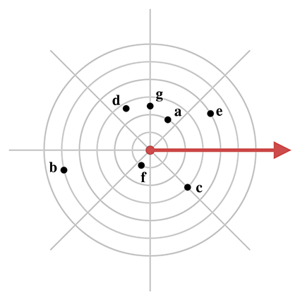
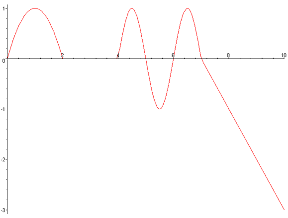
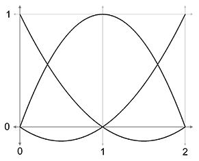
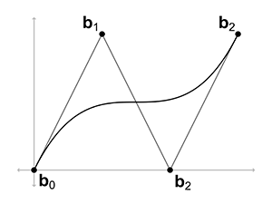

[<< Geometric Tests](geomtests.html)

[Contents](./)

Chapter B 

Answers to the Exercises

I believe that every human has a finite number of heart-beats.  
I don't intend to waste any of mine running around doing exercises.

— Buzz Aldrin (1930–)

# B.1Chapter 1

1.  a \=(−2.5,3) b \=(1,2) c \=(2.5,2)  
    \[4pt\] d \=(−1,1) e \=(0,0) f \=(2,−0.5)  
    \[4pt\] g \=(−0.5,−1.5) h \=(0,−2) i \=(−3,−2)
2.  a \=(1,2,4) b \=(−3,−3,−5) c \=(−3,6,2.5) d \=(3,0,−1) e \=(0,0,0) f \=(0,0,3) g \=(−3.5,4,0) h \=(5,−5,−1.5) i \=(4,1,5)
3.  See the table below.  
    
    **Left-handed**
    
    **Right-handed**
    
    **East**
    
    **Up**
    
    **North**
    
    **East**
    
    **Up**
    
    **North**
    
    **East**
    
    **Up**
    
    **North**
    
    **East**
    
    **Up**
    
    **North**
    
    +x
    
    +y
    
    +z
    
    −x
    
    −y
    
    +z
    
    −x
    
    −y
    
    −z
    
    +x
    
    +y
    
    −z
    
    +x
    
    −y
    
    −z
    
    −x
    
    +y
    
    −z
    
    −x
    
    +y
    
    +z
    
    +x
    
    −y
    
    +z
    
    +x
    
    +z
    
    −y
    
    −x
    
    −z
    
    −y
    
    −x
    
    −z
    
    +y
    
    +x
    
    +z
    
    +y
    
    +x
    
    −z
    
    +y
    
    −x
    
    +z
    
    +y
    
    −x
    
    +z
    
    −y
    
    +x
    
    −z
    
    −y
    
    +y
    
    +z
    
    +x
    
    −y
    
    −z
    
    +x
    
    −y
    
    −z
    
    −x
    
    +y
    
    +z
    
    −x
    
    +y
    
    −z
    
    −x
    
    −y
    
    +z
    
    −x
    
    −y
    
    +z
    
    +x
    
    +y
    
    −z
    
    +x
    
    +y
    
    +x
    
    −z
    
    −y
    
    −x
    
    −z
    
    −y
    
    −x
    
    +z
    
    +y
    
    +x
    
    +z
    
    +y
    
    −x
    
    +z
    
    −y
    
    +x
    
    +z
    
    −y
    
    +x
    
    −z
    
    +y
    
    −x
    
    −z
    
    +z
    
    +x
    
    +y
    
    −z
    
    −x
    
    +y
    
    −z
    
    −x
    
    −y
    
    +z
    
    +x
    
    −y
    
    +z
    
    −x
    
    −y
    
    −z
    
    +x
    
    −y
    
    −z
    
    +x
    
    +y
    
    +z
    
    −x
    
    +y
    
    +z
    
    +y
    
    −x
    
    −z
    
    −y
    
    −x
    
    −z
    
    −y
    
    +x
    
    +z
    
    +y
    
    +x
    
    +z
    
    −y
    
    +x
    
    −z
    
    +y
    
    +x
    
    −z
    
    +y
    
    −x
    
    +z
    
    −y
    
    −x
    
4.  (a) Right-handed.     (b) Swap y and z .     (c) Swap y and z .
5.  1.  (a)Right-handed.
    2.  (b) x us ←y aero ,     y us ←−z aero ,     z us ←x aero
    3.  (c) x aero ←z us ,     y aero ←x us ,     z aero ←−y us
6.  (a) CW     (b) CCW     (c) CCW     (d) CW
7.  (a) 15     (b) 30     (c) 3840     (d) 2016840     (e) 5050
8.  (a) π / 6
    
    (b) −π / 4
    
    (c) π / 3
    
    (d) π / 2
    
    (e) −π
    
    (f) 5π / 4
    
    (g) −3π / 2
    
    (h) 2.923
    
    (i) 9.198
    
    (j) −6π
    
9.  (a) −30 o
    
    (b) 120 o
    
    (c) 270 o
    
    (d) −240 o
    
    (e) 360 o
    
    (f) 1 o
    
    (g) 10 o
    
    (h) −900 o
    
    (i) 1800 o
    
    (j) 36 o
    
10.  The scarecrow should have said:
    
    The sum of the squares of the legs of a right triangle is equal to the square of the remaining side.
    
    since the Pythagorean theorem is c2\=a2+b2 , where a and b are the legs of the right triangle and c is the hypotenuse.
11.  1.  (a) (sin⁡(α) / csc⁡(α))+(cos⁡(α) / sec⁡(α))\=sin2⁡(α)+cos2⁡(α)\=1
    2.  (b) (sec2⁡(θ)−1) / sec2⁡(θ)\=1−(1 / sec2⁡(θ))\=1−cos2⁡(θ)\=sin2⁡(θ)
    3.  (c) 1+cot2⁡(t)\=1+(cos2⁡(t) / sin2⁡(t))\=(sin2⁡(t) / sin2⁡(t))+(cos2⁡(t) / sin2⁡(t))\=(sin2⁡(t)+cos2⁡(t)) / sin2⁡(t)\=1 / sin2⁡(t)\=csc2⁡(t)
    4.  (d) cos⁡(ϕ)(tan⁡(ϕ)+cot⁡(ϕ))\=sin⁡(ϕ)+(cos2⁡(ϕ) / sin⁡(ϕ))\=(sin2⁡(ϕ)+cos2⁡(ϕ)) / sin⁡(ϕ)\=1 / sin⁡(ϕ)\=csc⁡(ϕ)

# B.2Chapter 2

1.  1.  a is a 2D row vector. b is a 3D column vector. c is a 4D column vector.
    2.  b y + c w + a x + b z \=0+6+(−3)+5\=8
2.  1.  _“How much do you weigh?”_ Your weight is a scalar quantity. But the force of gravity, which pulls you downwards, is a vector, and so if you said that weight was a vector for that reason, you are also correct. (“My weight is 150 lbs of force in the _downward_ direction.”)
    2.  _“Do you have any idea how fast you were going?”_ The officer is probably referring to the _speed_ of your vehicle, which is a scalar quantity.
    3.  _“It's two blocks north of here.”_ Vector quantity.
    4.  _“We're cruising from Los Angeles to New York at 600 mph, at an altitude of 33,000 ft.”_ The speed “600 mph” is a scalar quantity. Since New York is east of Los Angeles, you could reasonably infer an eastward direction, so “600 mph eastward” is a velocity, which is a vector quantity. Likewise, “33,000 ft” is a scalar quantity, although if you're a stickler, you might say that a direction of “up” is implied, in which case “33,000 ft up” is a vector quantity.
3.  a \=\[0,2\] b \=\[0,−2\] c \=\[0.5,2\]  
    \[4pt\] d \=\[0.5,2\] e \=\[0.5,−3\] f \=\[−2,0\]  
    \[4pt\] g \=\[−2,1\] h \=\[2.5,2\] i \=\[6,1\]
4.  1.  _The size of a vector in a diagram doesn't matter; we just need to draw it in the right place._ **False.** This is reversed; for vectors, size matters (meaning the length of the vector), position doesn't.
    2.  _The displacement expressed by a vector can be visualized as a sequence of axially aligned displacements._ **True.**
    3.  _These axially aligned displacements from the previous question must occur in order._ **False.** We can apply them in any order and get the same end result.
    4.  _The vector \[x,y\] gives the displacement from the point (x,y) to the origin._ **False.** This is reversed; the vector \[x,y\] gives the displacement from the origin to the point (x,y) .
5.  1.  − \[ 3 7 \] \= \[ −3 −7 \]
    2.  ∥ \[ −12 5 \] ∥ \=(−12)2+52\=169\=13
    3.  ∥ \[ 8 −3 1 / 2 \] ∥ \=82+(−3)2+(1 / 2)2\=64+9+(1 / 4)\=293 / 4≈8.56
    4.  3 \[ 4 −7 0 \] \= \[ (3)(4) (3)(−7) (3)(0) \] \= \[ 12 −21 0 \]
    5.  \[ 4 5 \] / 2\= \[ 2 5 / 2 \]
6.  1.  \[ 12 5 \] norm \= \[ 12 5 \] ∥ \[ 12 5 \] ∥ \= \[ 12 5 \] 13\= \[ 1213 513 \] ≈ \[ 0.923 0.385 \]
    2.  \[ 0 743.632 \] norm \= \[ 0 743.632 \] ∥ \[ 0 743.632 \] ∥ \= \[ 0 743.632 \] 02+743.6322\= \[ 0 743.632 \] 743.632\= \[ 0 1 \]
    3.  \[ 8 −3 1 / 2 \] norm \= \[ 8 −3 1 / 2 \] ∥ \[ 8 −3 1 / 2 \] ∥ ≈ \[ 8 −3 1 / 2 \] 8.56≈ \[ 0.935 −0.350 0.058 \]
    4.  \[ −12 3 −4 \] norm \= \[ −12 3 −4 \] ∥ \[ −12 3 −4 \] ∥ \= \[ −12 3 −4 \] (−12)2+32+(−4)2\= \[ −12 3 −4 \] 13\= \[ −12 13 313 −4 13 \]
    5.  \[ 1 1 1 1 \] norm \= \[ 1 1 1 1 \] ∥ \[ 1 1 1 1 \] ∥ \= \[ 1 1 1 1 \] 12+12+12+12\= \[ 1 1 1 1 \] 2\= \[ 0.5 0.5 0.5 0.5 \]
7.  1.  \[ 7 −2 −3 \] + \[ 6 6 −4 \] \= \[ 7+6 −2+6 −3+(−4) \] \= \[ 13 4 −7 \]
    2.  \[ 2 9 −1 \] + \[ −2 −9 1 \] \= \[ 2+(−2) 9+(−9) −1+1 \] \= \[ 0 0 0 \]
    3.  \[ 3 10 7 \] − \[ 8 −7 4 \] \= \[ 3−8 10−(−7) 7−4 \] \= \[ −5 17 3 \]
    4.  \[ 4 5 −11 \] − \[ −4 −5 11 \] \= \[ 4−(−4) 5−(−5) −11−11 \] \= \[ 8 10 −22 \]
    5.  3 \[ a b c \] −4 \[ 2 10 −6 \] \= \[ 3a 3b 3c \] − \[ 8 40 −24 \] \= \[ 3a−8 3b−40 3c+24 \]
8.  1.  distance ( \[ 10 6 \] , \[ −14 30 \] ) \=(10−(−14))2+(6−30)2\=242+(−24)2\=576+576\=1152≈33.94
    2.  distance ( \[ 0 0 \] , \[ −12 5 \] ) \=(0−(−12))2+(0−5)2\=122+(−5)2\=144+25\=169\=13
    3.  distance ( \[ 3 10 7 \] , \[ 8 −7 4 \] ) \=(3−8)2+(10−(−7))2+(7−4)2\=(−5)2+172+32\=25+289+9\=323≈17.97
    4.  distance ( \[ −2 −4 9 \] , \[ 6 −7 9.5 \] ) \=(6−(−2))2+(−7−(−4))2+(9.5−9)2\=82+(−3)2+(0.5)2\=64+9+0.25\=73.25≈8.56
    5.  distance ( \[ 4 −4 −4 4 \] , \[ −6 6 6 −6 \] ) \=(−6−4)2+(6−(−4))2+(6−(−4))2+(−6−4)2\=(−10)2+(10)2+(10)2+(−10)2\=100+100+100+100\=400\=20
9.  1.  \[ 2 6 \] ⋅ \[ −3 8 \] \=(2)(−3)+(6)(8)\=−6+48\=42
    2.  −7 \[ 1 2 \] ⋅ \[ 11 −4 \] \= \[ −7 −14 \] ⋅ \[ 11 −4 \] \=(−7)(11)+(−14)(−4)\=−21
    3.  10+ \[ −5 1 3 \] ⋅ \[ 4 −13 9 \] \=10+((−5)(4)+(1)(−13)+(3)(9))\=10+(−20+(−13)+27)\=10+(−6)\=4
    4.  3 \[ −2 0 4 \] ⋅ ( \[ 8 −2 3 / 2 \] + \[ 0 9 7 \] ) \= \[ −6 0 12 \] ⋅ \[ 8 7 17 / 2 \] \=(−6)(8)+(0)(7)+(12)(17 / 2)\=54
10.  v ∥\= n ^ v ⋅ n ^ ∥ n ^ ∥ 2\= n ^ v ⋅ n ^ 1\= n ^ ( v ⋅ n ^ ) \= \[ 2 / 2 2 / 2 0 \] ( \[ 4 3 −1 \] ⋅ \[ 2 / 2 2 / 2 0 \] ) \= \[ 2 / 2 2 / 2 0 \] (22+ 32 2+0) \= \[ 2 / 2 2 / 2 0 \] 72 2\= \[ 7 / 2 7 / 2 0 \]  
    v ⊥\= v − v ∥\= \[ 4 3 −1 \] − \[ 7 / 2 7 / 2 0 \] \= \[ 4−7 / 2 3−7 / 2 −1−0 \] \= \[ 1 / 2 −1 / 2 −1 \]
11.  Define a triangle using the vectors a , b , and a − b , and let θ be the angle between a and b . Then the squared length of the edge a − b is:
    
    ∥ a − b ∥ 2\= ( a − b ) ⋅ ( a − b ) \= a ⋅ a −2 a ⋅ b + b ⋅ b \= a ⋅ a + b ⋅ b −2 a ⋅ b \= ∥ a ∥ 2+ ∥ b ∥ 2−2 ∥ a ∥ ∥ b ∥ cos⁡ θ
    
    which is the law of cosines.
12.  First, let's obtain some information about the vector components.  
      
    From the figure, we have
    
    a x \= ∥ a ∥ cos⁡ θa , a y \= ∥ a ∥ sin⁡ θa , b x \= ∥ b ∥ cos⁡ θb , b y \= ∥ b ∥ sin⁡ θb .
    
    Now we can proceed with the algebraic definition of the dot product and the cosine difference identity:
    
    a ⋅ b \= a x b x + a y b y \= ∥ a ∥ cos⁡ θa ∥ b ∥ cos⁡ θb + ∥ a ∥ sin⁡ θa ∥ b ∥ sin⁡ θb \= ∥ a ∥ ∥ b ∥ (cos⁡ θa cos⁡ θb +sin⁡ θa sin⁡ θb ) \= ∥ a ∥ ∥ b ∥ cos⁡ (θb−θa) \= ∥ a ∥ ∥ b ∥ cos⁡ θ .
    
13.  1.  \[ 0 −1 0 \] × \[ 0 0 1 \] \= \[ (−1)(1)−(0)(0) (0)(0)−(0)(1) (0)(0)−(−1)(0) \] \= \[ −1−0 0−0 0−0 \] \= \[ −1 0 0 \]  
        \[ 0 0 1 \] × \[ 0 −1 0 \] \= \[ (0)(0)−(1)(−1) (1)(0)−(0)(0) (0)(−1)−(0)(0) \] \= \[ 0−(−1) 0−0 0−0 \] \= \[ 1 0 0 \]
    2.  \[ −2 4 1 \] × \[ 1 −2 −1 \] \= \[ (4)(−1)−(1)(−2) (1)(1)−(−2)(−1) (−2)(−2)−(4)(1) \] \= \[ −4−(−2) 1−2 4−4 \] \= \[ −2 −1 0 \]  
        \[ 1 −2 −1 \] × \[ −2 4 1 \] \= \[ (−2)(1)−(−1)(4) (−1)(−2)−(1)(1) (1)(4)−(−2)(−2) \] \= \[ −2−(−4) 2−1 4−4 \] \= \[ 2 1 0 \]
    3.  \[ 3 10 7 \] × \[ 8 −7 4 \] \= \[ (10)(4)−(7)(−7) (7)(8)−(3)(4) (3)(−7)−(10)(8) \] \= \[ 40−(−49) 56−12 −21−80 \] \= \[ 89 44 −101 \]  
        \[ 8 −7 4 \] × \[ 3 10 7 \] \= \[ (−7)(7)−(4)(10) (4)(3)−(8)(7) (8)(10)−(−7)(3) \] \= \[ −49−40 12−56 80−(−21) \] \= \[ −89 −44 101 \]
14.  Let a \= \[ a x a y a z \] and b \= \[ b x b y b z \] . Then a ⋅ b \= ∥ a ∥ ∥ b ∥ cos⁡ θ and a × b \=  
    \[ a y b z − a z b y a z b x − a x b z a x b y − a y b x \] . From ∥ a × b ∥ , we have:
    
    ∥ a × b ∥ \=( a y b z − a z b y )2+( a z b x − a x b z )2+( a x b y − a y b x )2\= a y 2 b z 2−2 a y a z b y b z + a z 2 b y 2+ a z 2 b x 2−2 a x a z b x b z + a x 2 b z 2+ a x 2 b y 2−2 a x a y b x b y + a y 2 b x 2.
    
    If we now consider ∥ a ∥ ∥ b ∥ sin⁡ θ , we find that:
    
    ∥ a ∥ ∥ b ∥ sin⁡ θ \= ∥ a ∥ ∥ b ∥ 1−cos2⁡θ\= a x 2+ a y 2+ a z 2  b x 2+ b y 2+ b z 2 1− ( a x b x + a y b y + a z b z a x 2+ a y 2+ a z 2 b x 2+ b y 2+ b z 2 ) 2
    
    \= ( a x 2+ a y 2+ a z 2) ( b x 2+ b y 2+ b z 2) (1− ( a x b x + a y b y + a z b z )2 ( a x 2+ a y 2+ a z 2) ( b x 2+ b y 2+ b z 2) ) \= ( a x 2+ a y 2+ a z 2) ( b x 2+ b y 2+ b z 2) −( a x b x + a y b y + a z b z )2\= a y 2 b z 2−2 a y a z b y b z + a z 2 b y 2+ a z 2 b x 2−2 a x a z b x b z + a x 2 b z 2+ a x 2 b y 2−2 a x a y b x b y + a y 2 b x 2.
    
    Starting from both ends, we have met in the middle, proving that  
    ∥ a × b ∥ \= ∥ a ∥ ∥ b ∥ sin⁡ θ .
15.  1.  (a)
        1.  (1) ∥ \[ 3 4 \] ∥ 1\= | 3 | + | 4 | \=7 ∥ \[ 3 4 \] ∥ 2\= | 3 | 2+ | 4 | 2\=5 ∥ \[ 3 4 \] ∥ 3\= | 3 | 3+ | 4 | 3 3\=913≈4.498 ∥ \[ 3 4 \] ∥ ∞\=max ( | 3 | , | 4 | ) \=4
        2.  (2) ∥ \[ 5 −12 \] ∥ 1\= | 5 | + | −12 | \=17 ∥ \[ 5 −12 \] ∥ 2\= | 5 | 2+ | −12 | 2\=13 ∥ \[ 5 −12 \] ∥ 3\= | 5 | 3+ | −12 | 3 3\=18533≈12.283 ∥ \[ 5 −12 \] ∥ ∞\=max ( | 5 | , | −12 | ) \=12
        3.  (3) ∥ \[ −2 10 −7 \] ∥ 1\= | −2 | + | 10 | + | −7 | \=19 ∥ \[ −2 10 −7 \] ∥ 2\= | −2 | 2+ | 10 | 2+ | −7 | 2\=153≈12.369 ∥ \[ −2 10 −7 \] ∥ 3\= | −2 | 3+ | 10 | 3+ | −7 | 3 3\=13513≈11.055 ∥ \[ −2 10 −7 \] ∥ ∞\=max ( | −2 | , | 10 | , | −7 | ) \=10
        4.  (4) ∥ \[ 6 1 −9 \] ∥ 1\= | 6 | + | 1 | + | −9 | \=16 ∥ \[ 6 1 −9 \] ∥ 2\= | 6 | 2+ | 1 | 2+ | −9 | 2\=118≈10.863 ∥ \[ 6 1 −9 \] ∥ 3\= | 6 | 3+ | 1 | 3+ | −9 | 3 3\=9463≈9.817 ∥ \[ 6 1 −9 \] ∥ ∞\=max ( | 6 | , | 1 | , | −9 | ) \=9
        5.  (5) ∥ \[ −2 −2 −2 −2 \] ∥ 1\= | −2 | + | −2 | + | −2 | + | −2 | \=8 ∥ \[ −2 −2 −2 −2 \] ∥ 2\= | −2 | 2+ | −2 | 2+ | −2 | 2+ | −2 | 2\=4 ∥ \[ −2 −2 −2 −2 \] ∥ 3\= | −2 | 3+ | −2 | 3+ | −2 | 3+ | −2 | 3 3\=323≈3.175 ∥ \[ −2 −2 −2 −2 \] ∥ ∞\=max ( | −2 | , | −2 | , | −2 | , | −2 | ) \=2
    2.  (b)
        
        1.  (1)The unit circle for the L1 norm is a square with sides of length 2 rotated by 45 ∘ .
        2.  (2)The unit circle for the L2 norm is the well-known unit circle we all know and love.
        3.  (3)The unit circle for the infinity norm is a square with sides of length 2 .
        
        Note that all three unit circles include the vectors \[1,0\] , \[0,1\] , \[−1,0\] , \[0,−1\] .
16.  The man buys a box or has a piece of luggage that is 2 feet long, 2 feet wide, and 2 feet tall. If the object is very thin, such as a sword, then he can put the object diagonally in the box or luggage. The longest such object he could carry on is 22+22+22≈3.46 feet.
17.  Let s \= a + b + c + d + e + f . From inspection of [Figure 2.11](vectors.html#triangle_rule_multiple_vectors) we see that
    
    s \= \[ −5 3 \] .
    
    We confirm this numerically using the above equation and the values of the other vectors, also obtained from inspection of [Figure 2.11](vectors.html#triangle_rule_multiple_vectors):
    
    s \= a + b + c + d + e + f \= \[ −1 3 \] + \[ 1 3 \] + \[ 3 −2 \] + \[ −1 −2 \] + \[ −6 4 \] + \[ −1 −3 \] \= \[ (−1)+1+3+(−1)+(−6)+(−1) 3+3+(−2)+(−2)+4+(−3) \] \= \[ −5 3 \]
    
18.  Left-handed.
19.  1.  Let c \= \[ c x c y \] and r \= \[ r x r y \] . Then
        
        p UpperLeft \= \[ c x − r x c y + r y \] , p UpperRight \= \[ c x + r x c y + r y \] , p LowerLeft \= \[ c x − r x c y − r y \] , p LowerRight \= \[ c x + r x c y − r y \] .
        
    2.  Let c \= \[ c x c y c z \] and r \= \[ r x r y r z \] . Then
        
        p FrontUpperLeft \= \[ c x − r x c y + r y c z + r z \] , p FrontUpperRight \= \[ c x + r x c y + r y c z + r z \] , p FrontLowerLeft \= \[ c x − r x c y − r y c z + r z \] , p FrontLowerRight \= \[ c x + r x c y − r y c z + r z \] ,
        
        p BackUpperLeft \= \[ c x − r x c y + r y c z − r z \] , p BackUpperRight \= \[ c x + r x c y + r y c z − r z \] , p BackLowerLeft \= \[ c x − r x c y − r y c z − r z \] , p BackLowerRight \= \[ c x + r x c y − r y c z − r z \] .
        
20.  1.  Use the sign of the dot product between v and x − p to determine whether the point x is in front of or behind the NPC. This follows from the geometric interpretation of the dot product,
        
        v ⋅( x − p )\= ∥ v ∥ ∥ x − p ∥ cos⁡θ,
        
        where θ is the angle between v and x − p .  
        Both ∥ v ∥ and ∥ x − p ∥ are always positive, leaving the sign of the dot product entirely up to the value of cos⁡θ . If cos⁡θ\>0 then θ is less than 90 ∘ and x is _in front of_ the NPC. Similarly, if cos⁡θ<0 then θ is greater than 90 ∘ and x is _behind_ the NPC.  
        The special case of v ⋅( x − p )\=0 means that x lies either directly to the left or right of the NPC. If this case does not need to be handled explicitly, it can arbitrarily be assigned to mean either in front of or behind.
    2.  1.  (1) x is in front of the NPC.
            
            \[ 5 −2 \] ⋅ ( \[ 0 0 \] − \[ −3 4 \] ) \= \[ 5 −2 \] ⋅ \[ 3 −4 \] \=(5)(3)+(−2)(−4)\=23
            
        2.  (2) x is in front of the NPC.
            
            \[ 5 −2 \] ⋅ ( \[ 1 6 \] − \[ −3 4 \] ) \= \[ 5 −2 \] ⋅ \[ 4 2 \] \=(5)(4)+(−2)(2)\=16
            
        3.  (3) x is behind the NPC.
            
            \[ 5 −2 \] ⋅ ( \[ −6 0 \] − \[ −3 4 \] ) \= \[ 5 −2 \] ⋅ \[ −3 −4 \] \=(5)(−3)+(−2)(−4)\=−7
            
        4.  (4) x is behind the NPC.
            
            \[ 5 −2 \] ⋅ ( \[ −4 7 \] − \[ −3 4 \] ) \= \[ 5 −2 \] ⋅ \[ −1 3 \] \=(5)(−1)+(−2)(3)\=−11
            
        5.  (5) x is in front of the NPC.
            
            \[ 5 −2 \] ⋅ ( \[ 5 5 \] − \[ −3 4 \] ) \= \[ 5 −2 \] ⋅ \[ 8 1 \] \=(5)(8)+(−2)(1)\=38
            
        6.  (6) x is in front of the NPC.
            
            \[ 5 −2 \] ⋅ ( \[ −3 0 \] − \[ −3 4 \] ) \= \[ 5 −2 \] ⋅ \[ 0 −4 \] \=(5)(0)+(−2)(−4)\=8
            
        7.  (7) x can be either in front of or behind the NPC, depending on how we've decided to handle this special case.
            
            \[ 5 −2 \] ⋅ ( \[ −6 −3.5 \] − \[ −3 4 \] ) \= \[ 5 −2 \] ⋅ \[ −3 −7.5 \] \=(5)(−3)+(−2)(−7.5)\=0
            
21.  1.  To determine whether the point x is visible to the NPC, compare cos⁡θ to cos⁡(ϕ / 2) . If cos⁡θ≥cos⁡(ϕ / 2) , then x is visible to the NPC.  
        The value of cos⁡(ϕ / 2) can be obtained from the FOV angle. To get cos⁡θ use the dot product
        
        cos⁡ θ \= v ⋅( x − p ) ∥ v ∥ ∥ x − p ∥ .
        
    2.  The NPC's FOV is 90 ∘ , so the value we are interested in is cos⁡(45 ∘ )≈0.707 .
        1.  (1) x is visible to the NPC.
            
            cos⁡θ\= \[ 5 −2 \] ⋅ ( \[ 0 0 \] − \[ −3 4 \] ) ∥ \[ 5 −2 \] ∥ ∥ \[ 0 0 \] − \[ −3 4 \] ∥ \=23 (29)((25) ≈0.854≥0.707
            
        2.  (2) x is not visible to the NPC.
            
            cos⁡θ\= \[ 5 −2 \] ⋅ ( \[ 1 6 \] − \[ −3 4 \] ) ∥ \[ 5 −2 \] ∥ ∥ \[ 1 6 \] − \[ −3 4 \] ∥ \=16 (29)(20) ≈0.664<0.707
            
        3.  (3) x is not visible to the NPC.
            
            cos⁡θ\= \[ 5 −2 \] ⋅ ( \[ −6 0 \] − \[ −3 4 \] ) ∥ \[ 5 −2 \] ∥ ∥ \[ −6 0 \] − \[ −3 4 \] ∥ \= −7 (29)(25) ≈−0.260<0.707
            
        4.  (4) x is not visible to the NPC.
            
            cos⁡θ\= \[ 5 −2 \] ⋅ ( \[ −4 7 \] − \[ −3 4 \] ) ∥ \[ 5 −2 \] ∥ ∥ \[ −4 7 \] − \[ −3 4 \] ∥ \= −11 (29)(10) ≈−0.646<0.707
            
        5.  (5) x is visible to the NPC.
            
            cos⁡θ\= \[ 5 −2 \] ⋅ ( \[ 5 5 \] − \[ −3 4 \] ) ∥ \[ 5 −2 \] ∥ ∥ \[ 5 5 \] − \[ −3 4 \] ∥ \=38 (29)(65) ≈0.875≥0.707
            
        6.  (6) x is not visible to the NPC.
            
            cos⁡θ\= \[ 5 −2 \] ⋅ ( \[ −3 0 \] − \[ −3 4 \] ) ∥ \[ 5 −2 \] ∥ ∥ \[ −3 0 \] − \[ −3 4 \] ∥ \=8 (29)(16) ≈0.371<0.707
            
        7.  (7) x is not visible to the NPC.
            
            cos⁡θ\= \[ 5 −2 \] ⋅ ( \[ −6 −3.5 \] − \[ −3 4 \] ) ∥ \[ 5 −2 \] ∥ ∥ \[ −6 −3.5 \] − \[ −3 4 \] ∥ \=0 (29)(65.25) \=0<0.707
            
    3.  The NPC can see a distance of only 7 units, so only those points that are both within the FOV and within this distance will be visible.
        1.  (1) x is visible to the NPC.
            
            ∥ \[ 0 0 \] − \[ −3 4 \] ∥ \= ∥ \[ 3 −4 \] ∥ \=25\=5<7
            
        2.  (2) x is not visible to the NPC; it is outside the FOV.
        3.  (3) x is not visible to the NPC; it is outside the FOV.
        4.  (4) x is not visible to the NPC; it is outside the FOV.
        5.  (5) x is not visible to the NPC.
            
            ∥ \[ 5 5 \] − \[ −3 4 \] ∥ \= ∥ \[ 8 1 \] ∥ \=65≈8.062\>7
            
        6.  (6) x is not visible to the NPC; it is outside the FOV.
        7.  (7) x is not visible to the NPC; it is outside the FOV.
22.  1.  Let v ab \= b − a and v bc \= c − b . Since the three points lie in the xz \-plane, the two vectors also lie in the xz \-plane and we have
        
        v ab \= \[ x ab 0 z ab \] , v bc \= \[ x bc 0 z bc \] .
        
        Taking the cross product of the vectors in the order that the points are traversed gives.
        
        v ab × v bc \= \[ 0 x bc z ab − x ab z bc 0 \]
        
        The sign of x bc z ab − x ab z bc can then be used to determine the NPC's turning direction. Because we are working in a left-handed coordinate system, if the value is negative, the NPC is turning counterclockwise; if it's positive he's turning clockwise. The special case of 0 signifies that the NPC is either walking forward in a straight line or walks forward and then back along the same line.
    2.  1.  (1) v ab \=\[ −3 , 0 , 2 \] . v bc \=\[ −3 , 0 , −4 \] . x bc z ab − x ab z bc \=(−3)(2)−(−3)(−4)\=−18<0 . Thus, the NPC is turning counterclockwise.
        2.  (2) v ab \=\[ 7 , 0 , 5 \] . v bc \=\[ −1 , 0 , 3 \] . x bc z ab − x ab z bc \=(−1)(5)−(7)(3)\=−26<0 . Thus, the NPC is turning counterclockwise.
        3.  (3) v ab \=\[ 6 , 0 , −5 \] . v bc \=\[ −12 , 0 , −5 \] . x bc z ab − x ab z bc \=(−12)(−5)−(6)(−5)\=90\>0 . Thus, the NPC is turning clockwise.
        4.  (4) v ab \=\[ 3 , 0 , 1 \] . v bc \=\[ 3 , 0 , 2 \] . x bc z ab − x ab z bc \=(3)(1)−(3)(2)\=−3<0 . Thus, the NPC is turning counterclockwise.
23.  p ′\= p + (k−1) ( p ⋅ n ) n \= \[ 1 0 0 \] + (k−1) ( \[ 1 0 0 \] ⋅ \[ n x n y n z \] ) \[ n x n y n z \] \= \[ 1 0 0 \] + (k−1) ( n x ) \[ n x n y n z \] \= \[ 1 0 0 \] + \[ (k−1) n x 2 (k−1) n x n y (k−1) n x n z \] \= \[ 1+ (k−1) n x 2 (k−1) n x n y (k−1) n x n z \]
24.  p ′\=cos⁡θ ( p − ( p ⋅ n ) n ) +sin⁡θ ( n × p ) + ( p ⋅ n ) n \=cos⁡θ ( \[ 1 0 0 \] − ( \[ 1 0 0 \] ⋅ \[ n x n y n z \] ) \[ n x n y n z \] ) +sin⁡θ ( \[ n x n y n z \] × \[ 1 0 0 \] ) + ( \[ 1 0 0 \] ⋅ \[ n x n y n z \] ) \[ n x n y n z \] \=cos⁡θ ( \[ 1 0 0 \] − n x \[ n x n y n z \] ) +sin⁡θ \[ 0 n z − n y \] + n x \[ n x n y n z \] \=cos⁡θ \[ 1− n x 2 − n x n y − n x n z \] +sin⁡θ \[ 0 n z − n y \] + \[ n x 2 n x n y n x n z \] \= \[ cos⁡θ− n x 2cos⁡θ − n x n y cos⁡θ − n x n z cos⁡θ \] + \[ 0 n z sin⁡θ − n y sin⁡θ \] + \[ n x 2 n x n y n x n z \] \= \[ cos⁡θ− n x 2cos⁡θ+ n x 2 − n x n y cos⁡θ+ n z sin⁡θ+ n x n y − n x n z cos⁡θ− n y sin⁡θ+ n x n z \] \= \[ n x 2 (1−cos⁡θ) +cos⁡θ n x n y (1−cos⁡θ) + n z sin⁡θ n x n z (1−cos⁡θ) − n y sin⁡θ \]

# B.3Chapter 3

1.  1.  (a)Object space.
    2.  (b)We could compare my world-space x \-coordinate with the book's world-space x \-coordinate. Or, we just examine the sign of the upright-space x \-coordinate.
    3.  (c)World space.
    4.  (d)Object space. Or you might say that we could take a dot product with our facing direction vector—which is equivalent to extracting the object-space z \-coordinate.
2.  First translate the point by \[−12,0,6\] relative to the axes, and then rotate clockwise around the y \-axis 42°.
3.  1.  (a)Linearly dependent. The middle basis vector is the zero vector, which cannot belong to a linearly independent set because it can be expressed as a product of any other basis vector and 0.
    2.  (b)Linearly independent.
    3.  (c)Linearly dependent. For 3D vectors, the largest linearly independent set we could hope for is three vectors, but this set has four.
    4.  (d)Linearly dependent. The last vector is a multiple of the first.
    5.  (e)Linearly dependent. The last vector is the sum of the first two.
    6.  (f)Linearly independent.
4.  1.  (a)Orthogonal.
    2.  (b)Not orthogonal. All of the pairs of vectors have nonzero dot products.
    3.  (c)Orthogonal.
    4.  (d)Orthogonal.
    5.  (e)Not orthogonal. The first pair of vectors is perpendicular, but \[7,−1,5\]⋅\[−2,0,1\]\=−9 , and \[5,5,−6\]⋅\[−2,0,1\]\=−16 .
5.  1.  (a)No. The second and third basis vectors clearly do not have unit length.
    2.  (b)No. None of the basis vectors have unit length.
    3.  (c)Yes, they are orthonormal.
    4.  (d)No. The first and second basis vectors are not perpendicular.
    5.  (e)Yes, they are orthonormal.
    6.  (f)Yes, they are orthonormal.
    7.  (g)No. The second and third basis vectors do not have unit length.
6.  1.  (a)Upright: (−0.866,2.000,0.500) ; World: (0.134,12.000,3.500)
    2.  (b)Upright: (0.866,2.000,−0.500) ; World: (1.866,12.000,2.500)
    3.  (c)Upright: (0,0,0) ; World: (1,10,3)
    4.  (d)Upright: (1.116,5.000,−0.067) ; World: (2.116,15.000,2.933)
    5.  (e)Upright: (5.000,5.000,8.660) ; World: (6.000,15.000,11.660)
    6.  (f)Upright: (0.000,0.000,0.000) ; Object: (0.000,0.000,0.000)
    7.  (g)Upright: (−1.000,−10.000,−3.000) ; Object: (0.634,−10.000,−3.098)
    8.  (h)Upright: (1.732,0.000,−1.000) ; Object: (2.000,0.000,0.000)
    9.  (i)Upright: (1.000,1.000,1.000) ; Object: (0.366,1.000,1.366)
    10.  (j)Upright: (0.000,10.000,0.000) ; Object: (0.000,10.000,0.000)

# B.4Chapter 4

1.  See the table below.  
    
    Matrix
    
    Rows
    
    Columns
    
    Square
    
    Diagonal
    
    A
    
    4
    
    3
    
    No
    
    No
    
    B
    
    3
    
    3
    
    Yes
    
    Yes
    
    C
    
    2
    
    2
    
    Yes
    
    No
    
    D
    
    5
    
    2
    
    No
    
    No
    
    E
    
    1
    
    3
    
    No
    
    No
    
    F
    
    4
    
    1
    
    No
    
    No
    
    G
    
    1
    
    4
    
    No
    
    No
    
    H
    
    3
    
    1
    
    No
    
    No
    
2.  A T \= \[134−81206−3−1510−25\] T \= \[1312−31040−1−2−8655\]  
    B T \= \[kx000ky000kz\] T \= \[kx000ky000kz\]  
    C T \= \[158−73\] T \= \[15−783\] D T \= \[agbhcidjfk\] T \= \[abcdfghijk\] E T \= \[ 0 1 3 \] T \= \[ 0 1 3 \] F T \= \[ x y z w \] T \= \[ x y z w \] G T \= \[ 10 20 30 1 \] T \= \[ 10 20 30 1 \] H T \= \[ α β γ \] T \= \[ α β γ \]
3.  AB &4&3&3&3&4&3
    
    AH &4&3&3&1&4&1
    
    BB &3&3&3&3&3&3
    
    BH &3&3&3&1&3&1
    
    CC &2&2&2&2&2&2
    
    DC &5&2&2&2&5&2
    
    EB &1&3&3&3&1&3
    
    EH &1&3&3&1&1&1
    
    FE &4&1&1&3&4&3
    
    FG &4&1&1&4&4&4
    
    GA &1&4&4&3&1&3
    
    GF &1&4&4&1&1&1
    
    HE &3&1&1&3&3&3
    
    HG &3&1&1&4&3&4
    
4.  1.  (a) \[1−250\] \[−3741 / 3\] \= \[(1)(−3) + (−2)(4)(1)(7) + (−2)(1 / 3)(5)(−3) + (0)(4)(5)(7) + (0)(1 / 3)\] \= \[−3 + (−8)7 + (−2 / 3)−15 + 035 + 0\] \= \[−1119 / 3−1535\]
    2.  (b)Not possible; cannot multiply a 2 × 2 matrix by a 1 × 2 vector on the right.
    3.  (c) \[ 3 −1 4 \] \[−20357−61−42\]  
        \[6pt\] \= \[ (3)(−2) + (−1)(5) + (4)(1) (3)(0) + (−1)(7) + (4)(−4) (3)(3) + (−1)(−6) + (4)(2) \]  
        \[6pt\] \= \[ −6 + (−5) + 4 0 + (−7) + (−16) 9 + 6 + 8 \] \= \[ −7 −23 23 \]
    4.  (d) \[ x y z w \] \[1000010000100001\] \= \[ x y z w \]
    5.  (e)Not possible; cannot multiply a 1×4 vector by a 2×1 vector.
    6.  (f) \[1001\] \[m 11 m 12 m 21 m 22 \] \= \[m 11 m 12 m 21 m 22 \]
    7.  (g) \[ 3 3 \] \[6−7−45\] \= \[ (3)(6)+(3)(−4) (3)(−7)+(3)(5) \] \= \[ 18+(−12) −21+15 \] \= \[ 6 −6 \]
    8.  (h)Not possible; cannot multiply a 3×3 matrix by a 2×3 matrix on the right.
5.  1.  (a) \[ 5 −1 2 \] \[100010001\]  
        \[4pt\] \= \[ (5)(1) + (−1)(0) + (2)(0) (5)(0) + (−1)(1) + (2)(0) (5)(0) + (−1)(0) + (2)(1) \]  
        \[4pt\] \= \[ 5 −1 2 \]  
        \[4pt\] \[100010001\] \[ 5 −1 2 \] \= \[ (1)(5)+(0)(−1)+(0)(2) (0)(5)+(1)(−1)+(0)(2) (0)(5)+(0)(−1)+(1)(2) \] \= \[ 5 −1 2 \]
    2.  (b) \[ 5 −1 2 \] \[25−3171−2−14\]  
        \[6pt\] \= \[ (5)(2) + (−1)(1) + (2)(−2) (5)(5) + (−1)(7) + (2)(−1) (5)(−3) + (−1)(1) + (2)(4) \]  
        \[6pt\] \= \[ 10 + (−1) + (−4) 25 + (−7) + (−2) −15 + (−1) + 8 \] \= \[ 5 16 −8 \]  
        \[6pt\] \[25−3171−2−14\] \[ 5 −1 2 \] \= \[ (2)(5) + (5)(−1) + (−3)(2) (1)(5) + (7)(−1) + (1)(2) (−2)(5) + (−1)(−1) + (4)(2) \] \= \[ 10 + (−5) + (−6) 5 + (−7) + 2 −10 + 1 + 8 \] \= \[ −1 0 −1 \]
    3.  (c) \[ 5 −1 2 \] \[17270−32−3−1\] \= \[ (5)(1) + (−1)(7) + (2)(2) (5)(7) + (−1)(0) + (2)(−3) (5)(2) + (−1)(−3) + (2)(−1) \] \= \[ 5 + (−7) + 4 35 + 0 + (−6) 10 + 3 + (−2) \] \= \[ 2 29 11 \] \[17270−32−3−1\] \[ 5 −1 2 \] \= \[ (1)(5) + (7)(−1) + (2)(2) (7)(5) + (0)(−1) + (−3)(2) (2)(5) + (−3)(−1) + (−1)(2) \] \= \[ 5 + (−7) + 4 35 + 0 + (−6) 10 + 3 + (−2) \] \= \[ 2 29 11 \]
    4.  (d) \[ 5 −1 2 \] \[0−4340−1−310\] \= \[ (5)(0) + (−1)(4) + (2)(−3) (5)(−4) + (−1)(0) + (2)(1) (5)(3) + (−1)(−1) + (2)(0) \] \= \[ 0+(−4)+(−6) (−20)+0+2 15+1+0 \] \= \[ −10 −18 16 \] \[0−4340−1−310\] \[ 5 −1 2 \] \= \[ (0)(5) + (−4)(−1) + (3)(2) (4)(5) + (0)(−1) + (−1)(2) (−3)(5) + (1)(−1) + (0)(2) \] \= \[ 0 + 4 + 6 20 + 0 + (−2) −15 + (−1) + 0 \] \= \[ 10 18 −16 \]
6.  1.  (a) ( ( A T ) T ) T \= A T
    2.  (b) ( BA T ) T ( CD T ) \= ( ( A T ) T ( B ) T ) ( CD T ) \= ( AB T ) ( CD T ) \= AB T CD T
    3.  (c) ( ( D T C T ) ( AB ) T ) T \= ( ( ( AB ) T ) T ( D T C T ) T ) \= ( AB ) ( ( C T ) T ( D T ) T ) \= ( AB ) ( CD ) \= ABCD
    4.  (d) ( ( AB ) T ( CDE ) T ) T \= ( ( ( CDE ) T ) T ( ( AB ) T ) T ) \= ( CDE ) ( AB ) \= CDEAB
7.  For each of the matrices M , interpret the rows of M as basis vectors after transformation.
    1.  (a)The basis vectors \[ 1 , 0 \] and \[ 0 , 1 \] are transformed to \[ 0 , −1 \] and \[ 1 , 0 \] , respectively. Thus, M performs a 90 ∘ clockwise rotation.
    2.  (b)The basis vectors \[ 1 , 0 \] and \[ 0 , 1 \] are transformed to \[ 22 , 22 \] and \[ −22 , 22 \] , respectively. Thus, M performs a 45 ∘ counterclockwise rotation.
    3.  (c)The basis vectors \[ 1 , 0 \] and \[ 0 , 1 \] are transformed to \[ 2 , 0 \] and \[ 0 , 2 \] , respectively. Thus, M performs a _uniform_ scale, scaling both the x and y dimensions by 2.
    4.  (d)The basis vectors \[ 1 , 0 \] and \[ 0 , 1 \] are transformed to \[ 4 , 0 \] and \[ 0 , 7 \] , respectively. Thus, M performs a _nonuniform_ scale, scaling the x dimension by 4 and the y dimension by 7.
    5.  (e)The basis vectors \[ 1 , 0 \] and \[ 0 , 1 \] are transformed to \[ −1 , 0 \] and \[ 0 , 1 \] , respectively. Thus, M performs a reflection across the y axis, negating x values and leaving y values untouched.
    6.  (f)The basis vectors \[ 1 , 0 \] and \[ 0 , 1 \] are transformed to \[ 0 , −2 \] and \[ 2 , 0 \] , respectively. Thus, M is performing a combination of transformations: it is rotating clockwise by 90 ∘ and scaling both dimensions uniformly by 2. This can be confirmed by multiplying the appropriate matrices from parts (a) and (c), which perform these transformations individually:
        
        \[0−110\] \[2002\] \= \[0−220\] .
        
8.  M \= \[0− b z b y b z 0− b x − b y b x 0\] This matrix is skew symmetric, as desired, since M T \=− M .
9.  (a) 3         (b) 1         (c) 4         (d) 2
10.  The result vector element w i is the product of the i th row of M multiplied by the column vector v . To have w i \= v i − v i−1 , the i th row of M needs to capture the i th element of v , as well as the negative of the (i−1) th element, but exclude all others. This means that
    
    m ij \= {1 if  j\=i ,−1 if  j\=i−1 ,0otherwise.
    
    Thus,
    
    M \= \[1000000000−11000000000−11000000000−11000000000−11000000000−11000000000−11000000000−11000000000−11000000000−11\] .
    
11.  The result vector element w i is the product of the i th row of N multiplied by the column vector v . To have w i \=∑ j\=1 i v j , the i th row of N needs to capture all elements of v up to and including the i th element, but exclude all others. This means that
    
    n ij \= {1 if  j≤i ,0otherwise.
    
    Thus,
    
    N \= \[1000000000110000000011100000001111000000111110000011111100001111111000111111110011111111101111111111\] .
    
12.  1.  Note that the structure of M causes the i th row of M N to be equivalent to the difference between the i th and (i−1) th rows of N .
    2.  Note that the structure of N causes the i th row of N M to be equivalent to the sum of the first i rows of M .
    3.  M N \= N M \= I 10×10 \= \[1000000000010000000000100000000001000000000010000000000100000000001000000000010000000000100000000001\] .

# B.5Chapter 5

1.  Yes, _any_ matrix expresses a linear transformation. Furthermore, because all linear transformations are also affine transformations, the transform is also an affine transformation. (There just isn't any translation in the affine transform, or equivalently, the translation portion is zero.)
2.  \[1000cos⁡(−22 o )sin⁡(−22 o )0−sin⁡(−22 o )cos⁡(−22 o )\] \= \[1.0000.0000.0000.0000.927−0.3750.0000.3750.927\]
3.  \[cos⁡30 o 0−sin⁡30 o 010sin⁡30 o 0cos⁡30 o \] \= \[0.8660.000−0.5000.0001.0000.0000.5000.0000.866\]
4.  \[0.968−0.212−0.1310.2030.976−0.0840.1460.0540.988\]
5.  \[200020002\]
6.  \[1.285−0.5710.857−0.5712.145−1.7160.857−1.7163.573\]
7.  \[0.9290.143−0.2140.1430.7140.429−0.2140.4290.356\]
8.  \[0.857.286−0.4280.286.4280.858−0.428.858−0.286\]
9.  1.  (a)
        
        M obj→wld \= R y(30 o ) R x(−22 o )\= \[0.8660.000−0.5000.0001.0000.0000.5000.0000.866\] \[1.0000.0000.0000.0000.927−0.3750.0000.3750.927\] \= \[0.866−0.187−0.4640.0000.927−0.3750.5000.3240.803\]
        
    2.  (b)Here, we need to take the opposite rotations, in the opposite order.
        
        M wld→obj \= R x(22 o ) R y(−30 o )\= \[1.0000.0000.0000.0000.9270.3750.000−0.3750.927\] \[0.8660.0000.5000.0001.0000.000−0.5000.0000.866\] \= \[0.8660.0000.500−0.1870.9270.324−0.464−0.3750.803\]
        
        Or, you might have already known that the result would be the transpose of the answer from the previous problem. If so, good for you.
    3.  (c)Convert the z \-axis from object space to upright space:
        
        \[ 0 0 1 \] \[0.866−0.187−0.4640.0000.927−0.3750.5000.3240.803\] \= \[ 0.500 0.324 0.803 \] .
        
        Of course, this is just the same thing as extracting the last row of the matrix.

# B.6Chapter 6

1.  |3−214| \=3⋅4−(−2)⋅1\=14
2.  The determinant is
    
    |3−20140002| \=3(4⋅2−0⋅0)+(−2)(0⋅0−1⋅2)+0(1⋅0−4⋅0)\=28.
    
    We compute the cofactors
    
    C {11} \=+ | 4 0 0 2 | \=8,C {12} \=− | 1 0 0 2 | \=−2,C {13} \=+ | 1 4 0 0 | \=0,C {21} \=− | −2 0 0 2 | \=4,C {22} \=+ | 3 0 0 2 | \=6,C {23} \=− | 3 −2 0 0 | \=0,C {31} \=+ | −2 0 4 0 | \=0,C {32} \=− | 3 0 1 0 | \=0,C {33} \=+ | 3 −2 1 4 | \=14,
    
    and put them into the classical adjoint:
    
    adj  \[3−20140002\] \= \[C {11} C {21} C {31} C {12} C {22} C {32} C {13} C {23} C {33} \] \= \[840−2600014\] .
    
    Dividing by the determinant gives us the inverse:
    
    \[3−20140002\] −1 \=128 \[840−2600014\] \= \[2 / 71 / 70−1 / 143 / 140001 / 2\] .
    
3.  The matrix is orthogonal within the appropriate tolerance.
4.  Because the matrix is orthogonal, its inverse is simply its transpose:
    
    \[−0.1495−0.1986−0.9685−0.82560.56400.0117−0.5439−0.80150.2484\] −1 \= \[−0.1495−0.1986−0.9685−0.82560.56400.0117−0.5439−0.80150.2484\] T \= \[−0.1495−0.8256−0.5439−0.19860.5640−0.8015−0.96850.01170.2484\] .
    
5.  This matrix is a standard affine transform matrix with a right-most column of \[0,0,0,1\] T , as discussed in [Section 6.4.3](matrixmore.html#general_affine_transformations). Thus, it can be decomposed into a linear portion and a translation portion:
    
    M \= \[−0.1495−0.1986−0.96850−0.82560.56400.01170−0.5439−0.80150.248401.7928−5.31168.01511\] \= \[−0.1495−0.1986−0.96850−0.82560.56400.01170−0.5439−0.80150.248400001\] \[1000010000101.7928−5.31168.01511\] .
    
    Now taking the inverse is easy, especially when we realize that the linear portion is the same matrix as the previous exercise. The only real work is to multiply the translation row by the inverse of the linear portion:
    
    M −1 \= ( \[−0.1495−0.1986−0.96850−0.82560.56400.01170−0.5439−0.80150.248400001\] \[1000010000101.7928−5.31168.01511\] ) −1 \= \[1000010000101.7928−5.31168.01511\] −1 \[−0.1495−0.1986−0.96850−0.82560.56400.01170−0.5439−0.80150.248400001\] −1 \= \[100001000010−1.79285.3116−8.01511\] \[−0.1495−0.8256−0.54390−0.19860.5640−0.80150−0.96850.01170.248400001\] \= \[−0.1495−0.8256−0.54390−0.19860.5640−0.80150−0.96850.01170.248406.9764.382−5.2731\] .
    
6.  T (\[4,2,3\])\= \[1000010000104231\]
7.  First, calculate the rotation matrix:
    
    R x(20 o )\= \[10000cos⁡(20 o )sin⁡(20 o )00−sin⁡(20 o )cos⁡(20 o )00001\] \= \[1.0000.0000.0000.0000.0000.9400.3420.0000.000−0.3420.9400.0000.0000.0000.0001.000\] .
    
      
    Now concatenate this with the translation matrix from the previous exercise. We know this will simply copy the rotation portion into the upper 3×3 , and the translation into the bottom row.
    
    R x(20 o ) T (\[4,2,3\])\= \[1.0000.0000.0000.0000.0000.9400.3420.0000.000−0.3420.9400.0000.0000.0000.0001.000\] \[1.0000.0000.0000.0000.0001.0000.0000.0000.0000.0001.0000.0004.0002.0003.0001.000\] \= \[1.0000.0000.0000.0000.0000.9400.3420.0000.000−0.3420.9400.0004.0002.0003.0001.000\]
    
8.  This time we concatenate the matrices in the opposite order, and the translation portion gets rotated.
    
    T (\[4,2,3\]) R x(20 o )\= \[1.0000.0000.0000.0000.0001.0000.0000.0000.0000.0001.0000.0004.0002.0003.0001.000\] \[1.0000.0000.0000.0000.0000.9400.3420.0000.000−0.3420.9400.0000.0000.0000.0001.000\] \= \[1.0000.0000.0000.0000.0000.9400.3420.0000.000−0.3420.9400.0004.0000.8533.5031.000\]
    
9.  \[1001 / 5010000100000\]
10.  \[ 105 −243 89 1 \] \[1001 / 5010000100000\] \= \[ 105 −243 89 1055 \] ⇒ \[ 5 −81 7 8921 \]

# B.7Chapter 7

In some places in this section, we use the notation (x,y)c to indicate Cartesian coordinates, and (r,θ)p to indicate polar coordinates. If plain (a,b) coordinates are used, then the context will make it clear whether the coordinates are Cartesian or polar.

1.     
    
2.  1.  (4,207 o )≡(4,207 o −360 o )≡(4,−153 o )
    2.  (−5,−720 o )≡(−5,0 o )≡(5,180 o )
    3.  (0,45.2 o )≡(0,0 o )
    4.  (12.6,11π / 4  rad )≡ (12.6,11π / 4  rad −2π  rad ) ≡(12.6,3π / 4  rad )
3.  1.  (1,45 o )p≡(1cos⁡ 45 o ,1sin⁡ 45 o )c≈(1⋅0.707,1⋅0.707)c\=(0.707,0.707)c
    2.  (3,0 o )p≡(3cos⁡ 0 o ,3sin⁡ 0 o )c\=(3⋅1,3⋅0)c\=(3,0)c
    3.  (4,90 o )p≡(4cos⁡ 90 o ,4sin⁡ 90 o )c\=(4⋅0,4⋅1)c\=(0,4)c
    4.  (10,−30 o )p≡ (10cos⁡(−30 o ),10sin⁡(−30 o )) c≈(10⋅0.866,10⋅(−0.500))c\=(8.66,−5.00)c
    5.  (5.5,π  rad )p≡(5.5cos⁡(π  rad ),5.5sin⁡(π  rad ))c\=(5.5⋅( −1 ),5.5⋅( 0 ))c\=(−5.5,0)c
4.  1.  (4,207 o )p≡(4cos⁡ 207 o ,4sin⁡ 207 o )c≈(4⋅−.891,4⋅−.454)c≈(−3.56,−1.82)c
    2.  (−5,−720 o )p≡(−5cos⁡(−720 o ),−5sin⁡(−720 o ))c\=(−5⋅1,−5⋅0)c\=(−5,0)c
    3.  (0,45.2 o )p≡(0,0)c . No credit will be awarded if you actually bothered to calculate the sine and cosine of 45.2°.
    4.  (12.6,11π / 4  rad )p≡(12.6cos⁡(11π / 4  rad ),12.6sin⁡(11π / 4  rad ))c≈(12.6⋅−.707,12.6⋅707)c≈(−8.91,8.91)cNotice that it really isn't any different or more difficult to convert noncanonical polar coordinates to Cartesian.
5.  1.  (10,20)c :
        
        r\=102+202\=100+400\=500≈22.36θ\= atan2 (20,10)\=arctan⁡(20 / 10)≈63.43 o (10,20)c≅(22.36,63.43 o )p
        
    2.  (−12,−5)c :
        
        r\=(−12)2+(−5)2\=144+25\=169\=13θ\= atan2 (−5,−12)\=arctan⁡(5 / 12)−180 o ≈22.62 o −180 o ≈−157.38 o (−12,−5)c≅(13,−157.38 o )p
        
    3.  (0,4.5)c :
        
        r\=02+4.52\=4.5θ\= atan2 (0,4.5)\=90 o (4.5,0)c≡(4.5,90 o )p
        
    4.  (−3,4)c :
        
        r\=(−3)2+42\=9+16\=25\=5θ\= atan2 (4,−3)\=arctan⁡(4 / 3)+180 o ≈−53.13 o +180 o ≈126.87 o (−3,4)c≡(5,126.87 o )p
        
    5.  (0,0)c≡(0,0)p
    6.  (−5280,0)c
        
        r\=(−5280)2+02\=5280θ\= atan2 (0,−5280)\=180 o (−5280,0)c≡(5280,180 o )p
        
6.  1.  (a) x\=rcos⁡(θ)\=4cos⁡(120 o )\=4(−1 / 2)\=−2  
        y\=rsin⁡(θ)\=4sin⁡(120 o )\=4(3 / 2)\=23  
        so (x,y,z)\=(−2,23,5)
    2.  (b) x\=rcos⁡(θ)\=2cos⁡(45 o )\=2(2 / 2)\=2  
        y\=rsin⁡(θ)\=2sin⁡(45 o )\=2(2 / 2)\=2  
        so (x,y,z)\=(2,2,−1)
    3.  (c) x\=rcos⁡(θ)\=6cos⁡(−π / 6)\=6cos⁡(π / 6)\=6(3 / 2)\=33  
        y\=rsin⁡(θ)\=6sin⁡(−π / 6)\=−6sin⁡(π / 6)\=−6(−1 / 2)\=−3  
        so (x,y,z)\=(33,−3,−3)
    4.  (d) x\=rcos⁡(θ)\=3cos⁡(3π)\=3cos⁡(π)\=3(−1)\=−3  
        y\=rsin⁡(θ)\=3sin⁡(3π)\=3sin⁡(π)\=3(0)\=0  
        so (x,y,z)\=(−3,0,1)
7.  1.  (a) r\=12+12\=2  
        θ\=arctan⁡(1 / 1)\=45 o  
        so (r,θ,z)\=(2,45 o ,1)
    2.  (b) r\=02+(−5)2\=5  
        θ\=−90 o , since x\=0 and y<0  
        so (r,θ,z)\=(5,−90 o ,2)
    3.  (c) r\=(−3)2+42\=5  
        θ\=arctan⁡(4 / (−3))\=126.87 o  
        so (r,θ,z)\=(5,126.87 o ,−7)
    4.  (d) r\=02+02\=0  
        θ\=0 , since x\=0 and y\=0  
        so (r,θ,z)\=(0,0,−3)
8.  1.  (a) x\=rsin⁡(ϕ)cos⁡(θ)\=4sin⁡(3π / 4)cos⁡(π / 3)\=4(2 / 2)(1 / 2)\=2  
        y\=rsin⁡(ϕ)sin⁡(θ)\=4sin⁡(3π / 4)sin⁡(π / 3)\=4(2 / 2)(3 / 2)\=6  
        z\=rcos⁡(ϕ)\=4cos⁡(3π / 4)\=4(−2 / 2)\=−22  
        so (x,y,z)\=(2,6,−22)
    2.  (b) x\=rsin⁡(ϕ)cos⁡(θ)\=5sin⁡(π / 3)cos⁡(−5π / 6)\=5(3 / 2)(−3 / 2)\=−15 / 4  
        y\=rsin⁡(ϕ)sin⁡(θ)\=5sin⁡(π / 3)sin⁡(−5π / 6)\=5(3 / 2)(−1 / 2)\=−53 / 4  
        z\=rcos⁡(ϕ)\=5cos⁡(π / 3)\=5(1 / 2)\=5 / 2  
        so (x,y,z)\=(−15 / 4,−53 / 4,5 / 2)
    3.  (c) x\=rsin⁡(ϕ)cos⁡(θ)\=2sin⁡(π)cos⁡(−π / 6)\=2(0)(3 / 2)\=0  
        y\=rsin⁡(ϕ)sin⁡(θ)\=2sin⁡(π)sin⁡(−π / 6)\=2(0)(−1 / 2)\=0  
        z\=rcos⁡(ϕ)\=2cos⁡(π)\=2(−1)\=−2  
        so (x,y,z)\=(0,0,−2)
    4.  (d) x\=rsin⁡(ϕ)cos⁡(θ)\=8sin⁡(π / 6)cos⁡(9π / 4)\=8(1 / 2)(2 / 2)\=22  
        y\=rsin⁡(ϕ)sin⁡(θ)\=8sin⁡(π / 6)sin⁡(9π / 4)\=8(1 / 2)(2 / 2)\=22  
        z\=rcos⁡(ϕ)\=8cos⁡(π / 6)\=8(3 / 2)\=43  
        so (x,y,z)\=(22,22,43)
9.  1.  (a1) (4,π / 3,3π / 4)⟹(4,4π / 3,π / 4)⟹(4,−2π / 3,π / 4)
    2.  (a2) x\=rcos⁡psin⁡h\=4cos⁡(π / 4)sin⁡(−2π / 3)\=4(2 / 2)(−3 / 2)\=−6  
        y\=−rsin⁡p\=−4sin⁡(π / 4)\=−4(2 / 2)\=−22  
        z\=rcos⁡pcos⁡h\=4cos⁡(π / 4)cos⁡(−2π / 3)\=4(2 / 2)(−1 / 2)\=−2  
        so (x,y,z)\=(−6,−22,−2)
    3.  (b1) (5,−5π / 6,π / 3) is already in the canonical set.
    4.  (b2) x\=rcos⁡psin⁡h\=5cos⁡(π / 3)sin⁡(−5π / 6)\=5(1 / 2)(−1 / 2)\=−5 / 4  
        y\=−rsin⁡p\=−5sin⁡(π / 3)\=−5(3 / 2)\=−(53) / 2  
        z\=rcos⁡pcos⁡h\=5cos⁡(π / 3)cos⁡(−5π / 6)\=5(1 / 2)(−3 / 2)\=−(53) / 4  
        so (x,y,z)\=(−5 / 4,−(53) / 2,−(53) / 4)
    5.  (c1) (2,−π / 6,π)⟹(2,5π / 6,0)
    6.  (c2) x\=rcos⁡psin⁡h\=2cos⁡(0)sin⁡(5π / 6)\=(2)(1)(1 / 2)\=1  
        y\=−rsin⁡p\=−2sin⁡(0)\=(−2)(0)\=0  
        z\=rcos⁡pcos⁡h\=2cos⁡(0)cos⁡(5π / 6)\=(2)(1)(−3 / 2)\=−3  
        so (x,y,z)\=(1,0,−3)
    7.  (d1) (8,9π / 4,π / 6)⟹(8,π / 4,π / 6)
    8.  (d2) x\=rcos⁡psin⁡h\=8cos⁡(π / 6)sin⁡(π / 4)\=8(3 / 2)(2 / 2)\=26  
        y\=−rsin⁡p\=−8sin⁡(π / 6)\=−8(1 / 2)\=−4  
        z\=rcos⁡pcos⁡h\=8cos⁡(π / 6)cos⁡(π / 4)\=8(3 / 2)(2 / 2)\=26  
        so (x,y,z)\=(26,−4,26)
10.  1.  (a) r\=x2+y2+z2\=(2)2+(23)2+(−2)2\=2+12+2\=16\=4  
        h\=arctan⁡(x / z)\=arctan⁡(−2 / 2)\=arctan⁡(−1)\=135 o , given the location of (x,z)  
        p\=arcsin⁡(−y / r)\=arcsin⁡(−(23) / 4)\=arcsin⁡(−3 / 2)\=−60 o  
        so (r,h,p)\=(4,135 o ,−60 o )
    2.  (b)  
        r\=x2+y2+z2\=(23)2+62+(−4)2\=12+36+16\=64\=8  
        h\=arctan⁡(x / z)\=arctan⁡(−(23) / 4)\=arctan⁡(−3 / 2)\=139.11 o , given the location of (x,z)  
        p\=arcsin⁡(−y / r)\=arcsin⁡(−6 / 8)\=arcsin⁡(−3 / 4)\=−48.59 o  
        so (r,h,p)\=(8,139.11 o ,−48.59 o )
    3.  (c)  
        r\=x2+y2+z2\=(−1)2+(−1)2+(−1)2\=1+1+1\=3  
        h\=arctan⁡(x / z)\=arctan⁡((−1) / (−1))\=arctan⁡(1)\=−135 o , given the location of (x,z)  
        p\=arcsin⁡(−y / r)\=arcsin⁡(1 / 3)\=35.26 o  
        so (r,h,p)\=(3,−135 o ,35.26 o )
    4.  (d) r\=x2+y2+z2\=22+(−23)2+42\=4+12+16\=32\=42  
        h\=arctan⁡(x / z)\=arctan⁡(2 / 4)\=arctan⁡(1 / 2)\=26.57 o , given the location of (x,z)  
        p\=arcsin⁡(−y / r)\=arcsin⁡((23) / (42))\=arcsin⁡(3 / (22))\=37.76 o  
        so (r,h,p)\=(42,26.57 o ,37.76 o )
    5.  (e) r\=x2+y2+z2\=(−3)2+(−3)2+(22)2\=3+3+8\=14  
        h\=arctan⁡(x / z)\=arctan⁡(−3 / (22))\=−31.48 o , given the location of (x,z)  
        p\=arcsin⁡(−y / r)\=arcsin⁡(3 / 14)\=27.58 o  
        so (r,h,p)\=(14,−31.48 o ,27.58 o )
    6.  (f) r\=x2+y2+z2\=32+42+122\=9+16+144\=13  
        h\=arctan⁡(x / z)\=arctan⁡(3 / 12)\=arctan⁡(1 / 4)\=14.04 o  
        p\=arcsin⁡(−y / r)\=arcsin⁡(−4 / 13)\=−17.92 o  
        so (r,h,p)\=(13,14.04 o ,−17.92 o )
11.  1.  (a)A sphere with radius r0 .
    2.  (b)A vertical plane, obtained by rotating the plane x\=0 clockwise about the y axis by the angle h0 .
    3.  (c)A “right circular conical surface” (two vertical circular cones meeting tip-to-tip at the origin). The interior angle of the cone is 2p0 .
12.  She was at the north pole, so the bear was white.[1](#footnote_1)

# B.8Chapter 8

1.  (a) 5     (b) 3     (c) 6     (d) 1     (e) 2     (f) 4
2.  1.  (a)3\. Yes, they are canonical Euler angles.
    2.  (b)4\. Yes, they are canonical Euler angles.
    3.  (c)5\. No, this orientation is in Gimbal lock, and in the canonical set, bank should be zero.
    4.  (d)1\. Yes, they are canonical Euler angles.
    5.  (e)2\. Yes, they are canonical Euler angles.
    6.  (f)3\. No, the pitch angle is outside the legal range.
    7.  (g)5\. Yes, they are canonical Euler angles.
    8.  (h)2\. No, the pitch angle is outside the legal range.
    9.  (i)6\. Yes, they are canonical Euler angles.
3.  1.  (a) \[ cos⁡(30 o / 2) ( 1⋅sin⁡(30 o / 2) 0⋅sin⁡(30 o / 2) 0⋅sin⁡(30 o / 2) ) \] \= \[ 0.966 ( .259 0.000 0.000 ) \]
    2.  (b)_All_ rotation quaternions have a magnitude of 1!
    
    1.  (c) \[ 0.966 ( −.259 0.000 0.000 ) \]
    2.  (d)This corresponds to a _pitch_ of +30°.
4.  (a) 2     (b) 5     (c) 1     (d) 3     (e) 2     (f) 1     (g) 4     (h) 6     (i) 3
5.  (a) 5     (b) 2     (c) 6     (d) 1     (e) 3     (f) 5     (g) 4     (h) 2     (i) 3     
6.  (w1+x1i+y1j+z1k)(w2+x2i+y2j+z2k) \=w1w2+w1x2i+w1y2j+w1z2k+x1w2i+x1x2i2+x1y2ij+x1z2ik+y1w2j+y1x2ji+y1y2j2+y1z2jk+z1w2k+z1x2ki+z1y2kj+z1z2k2\=w1w2+w1x2i+w1y2j+w1z2k+x1w2i+x1x2(−1)+x1y2k+x1z2(−j)+y1w2j+y1x2(−k)+y1y2(−1)+y1z2i+z1w2k+z1x2j+z1y2(−i)+z1z2(−1)\=w1w2−x1x2−y1y2−z1z2+(w1x2+x1w2+y1z2−z1y2)i+(w1y2+y1w2+z1x2−x1z2)j+(w1z2+z1w2+x1y2−y1x2)k
7.  First, we extract the half-angle and axis of rotation:
    
    α\=θ / 2\=arccos⁡w\=arccos⁡0.965≈15.0 o , n ^ \= normalize ( \[ 0.149 −0.149 0.149 \] )≈ \[ 0.577 −0.577 0.577 \] .
    
    Now we form a new quaternion using the new half-angle, α′\=2α≈30.0 o :
    
    \[ cos⁡α′ ( nxsin⁡α′ nysin⁡α′ nzsin⁡α′ ) \] \= \[ 0.867 ( 0.577⋅0.500 −0.577⋅0.500 0.577⋅0.500 ) \] \= \[ 0.867 ( 0.288 −0.288 0.288 ) \] .
    
8.  1.  (a) a ⋅ b \= \[ 0.233 ( 0.060 −0.257 −0.935 ) \] ⋅ \[ −0.752 ( 0.286 0.374 0.459 ) \] \=(0.233)(−0.752)+(0.060)(0.286)+(−0.257)(0.374)+(−0.935)(0.459)\=−0.683
    2.  (b) a b \= \[ 0.333 ( 0.253 −0.015 0.906 ) \]
    3.  (c) d \= b a −1 \= \[ −0.752 ( 0.286 0.374 0.459 ) \] \[ 0.233 ( 0.060 −0.257 −0.935 ) \] ∗\= \[ −0.683 ( 0.343 −0.401 −0.500 ) \]
9.  ∥ q 1 q 2 ∥ \= ∥ \[ w1 ( x1 y1 z1 ) \] \[ w2 ( x2 y2 z2 ) \] ∥ \= ∥ \[ w1w2−x1x2−y1y2−z1z2 ( w1x2+x1w2+y1z2−z1y2 w1y2+y1w2+z1x2−x1z2 w1z2+z1w2+x1y2−y1x2 ) \] ∥ \=(w1w2−x1x2−y1y2−z1z2)2+(w1x2+x1w2+y1z2−z1y2)2+(w1y2+y1w2+z1x2−x1z2)2+(w1z2+z1w2+x1y2−y1x2)2  
    \[12pt\] After expanding these products and then canceling terms (a step that we have omitted because it is very messy), we then factor:
    
    ∥ q 1 q 2 ∥ \= w1 2 w2 2+ x1 2 x2 2+ y1 2 y2 2+ z1 2 z2 2+ w1 2 x2 2+ x1 2 w2 2+ y1 2 z2 2+ z1 2 y2 2+ w1 2 y2 2+ y1 2 w2 2+ z1 2 x2 2+ x1 2 z2 2+ w1 2 z2 2+ z1 2 w2 2+ x1 2 y2 2+ y1 2 x2 2\= w1 2( w2 2+ x2 2+ y2 2+ z2 2)+ x1 2( w2 2+ x2 2+ y2 2+ z2 2)+ y1 2( w2 2+ x2 2+ y2 2+ z2 2)+ z1 2( w2 2+ x2 2+ y2 2+ z2 2)\=( w1 2+ x1 2+ y1 2+ z1 2)( w2 2+ x2 2+ y2 2+ z2 2)\= ∥ q 1 ∥ 2 ∥ q 2 ∥ 2\= ∥ q 1 ∥ ∥ q 2 ∥
    

# B.9Chapter 9

1.  First, we convert the ray to implicit form by using [Equation (9.5)](geomprims.html#ray_parametric_to_implicit):
    
    a\= d y \=5,b\=− d x \=7,d\=x org d y −y org d x \=5⋅5−3⋅(−7)\=46.
    
    Then, we convert this to slope-intercept form according to [Equation (9.6)](geomprims.html#line_implicit_to_slope_intercept):
    
    m\=−a / b\=−5 / 7,y0\=d / b\=46 / 7.
    
    So the equation of the line is y\=−(5 / 7)x+46 / 7 .
2.  4x+7y\=427y\=−4x+42y\=−(4 / 7)x+6  
    The slope is −4 / 7 and the y \-intercept is 6.
3.  1.  (a) p min \=(−5,−7,−5) , p max \=(7,11,8)
    2.  (b) (x min ,y min ,z min )\=(−5,−7,−5)(x min ,y min ,z max )\=(−5,−7,8)(x min ,y max ,z min )\=(−5,11,−5)(x min ,y max ,z max )\=(−5,11,8)(x max ,y min ,z min )\=(7,−7,−5)(x max ,y min ,z max )\=(7,−7,8)(x max ,y max ,z min )\=(7,11,−5)(x max ,y max ,z max )\=(7,11,8)
    3.  (c) c \=( p min + p max ) / 2\=(1,2,1.5)  
        s \=( p max − p min )\=(12,18,13)
    4.  (d) v 1′\=(−2.828,12.728,−5.000) v 2′\=(−0.707,3.5355,8.000) v 3′\=(−4.243,0.000,1.000) v 4′\=(1.414,−8.485,0.000) v 5′\=(2.121,6.364,4.000)
    5.  (e) p min \=(−4.243,−8.485,−5) , p max \=(2.121,12.728,8)
    6.  (f)First, we determine which products to take by using the technique from [Listing 9.4](geomprims.html#transformed_aabb):
        
        x min ′\=m 11 ⋅x min x max ′\=m 11 ⋅x max (m 11 \>0)+m 21 ⋅y max +m 21 ⋅y min (m 21 <0)+0+0(m 31 \=0)y min ′\=m 12 ⋅x min y max ′\=m 12 ⋅x max (m 12 \>0)+m 22 ⋅y min +m 22 ⋅y max (m 22 \>0)+0+0(m 32 \=0)z min ′\=0z max ′\=0(m 13 \=0)+0+0(m 23 \=0)+z min +z max (m 33 \=1)
        
        Summing the appropriate products, we have
        
        x min ′\=m 11 ⋅x min +m 21 ⋅y max +0\=0.707⋅−5+(−0.707)⋅11+0\=−11.312,y min ′\=m 12 ⋅x min +m 22 ⋅y min +0\=0.707⋅−5+0.707⋅−7+0\=−8.484,z min ′\=z min \=−5,x max ′\=m 11 ⋅x max +m 21 ⋅y min +0\=0.707⋅7+(−0.707)⋅−7+0\=9.898,y max ′\=m 12 ⋅x max +m 22 ⋅y max +0\=0.707⋅7+0.707⋅11+0\=12.726,z max ′\=z max \=8.
        
        Notice how much larger this box is than the one of the transformed points!
4.  1.  (a)First, let's find the normal by using [Equation (9.12)](geomprims.html#plane_normal_from_three_points):
        
        e 3\= p 2− p 1\= \[ 3 −1 17 \] − \[ 6 10 −2 \] \= \[ −3 −11 19 \] , e 1\= p 3− p 2\= \[ −9 8 0 \] − \[ 3 −1 17 \] \= \[ −12 9 −17 \] , e 3× e 1\= \[ (−11)(−17)−(19)(9) (19)(−12)−(−3)(−17) (−3)(9)−(−11)(−12) \] \= \[ 187−171 −228−51 −27−132 \] \= \[ 16 −279 −159 \] .
        
        Let's normalize it:
        
        ∥ e 3× e 1 ∥ \=162+(−279)2+(−159)2\=103378≈321.5, n ^ \= e 3× e 1 ∥ e 3× e 1 ∥ ≈ \[ 16 −279 −159 \] 321.5≈ \[ .04976 −.8677 −.4945 \] .
        
        Just for kicks, we'll verify that we get the same result with [Equation (9.13)](geomprims.html#best_fit_plane_normal_from_points) from [Section 9.5.3](geomprims.html#plane_best_fit):
        
        n x \=(z1+z2)(y1−y2)+(z2+z3)(y2−y3)+(z3+z1)(y3−y1)\=((−2)+17)(10−(−1))+(17+0)((−1)−8)+(0+(−2))(8−10)\=16, n y \=(x1+x2)(z1−z2)+(x2+x3)(z2−z3)+(x3+x1)(z3−z1)\=(6+3)((−2)−17)+(3+(−9))(17−0)+((−9)+6)(0−(−2))\=−279, n z \=(y1+y2)(x1−x2)+(y2+y3)(x2−x3)+(y3+y1)(x3−x1)\=(10+(−1))(6−3)+((−1)+8)(3−(−9))+(8+10)((−9)−6)\=−159, n ^ \= \[ 16 −279 159 \] 162+(−279)2+1592 ≈ \[ 16 −279 159 \] 321.5 ≈ \[ .04976 −.8677 −0.4945 \] .
        
        Now that we have n ^ , we can compute d . We'll arbitrarily use p 1 :
        
        d\= n ⋅ p 1≈ \[ .04976 −.8677 −.4945 \] ⋅ \[ 6 10 −2 \] ≈(.04976)(6)+(−.8677)(10)+(−.4945)(−2)≈−7.389.
        
        The plane equation for this triangle is
        
        .04976x−.8677y−.4945z\=−7.389.
        
    2.  (b)To answer both questions, we compute the signed distance by [Equation (9.14)](geomprims.html#plane_distance_to_point) from [Section 9.5.4](geomprims.html#plane_distance_to_point):
        
        a\= q ⋅ n ^ −d≈ \[ 3 4 5 \] ⋅ \[ .04976 −.8677 −.4945 \] −(−7.389)≈(.04976)(3)+(−.8677)(4)+(−.4945)(5)+7.389≈1.595
        
        Since this value is positive, we conclude that the point is on the _front_ side of the plane.
    3.  (c)Let's first solve this problem by using the 2D projection method. The dominant axis of the normal is y , and so we'll discard the y coordinates of the vertices and project onto the xz plane. Applying notation from [Listing 9.6](geomprims.html#barycentric_computing_3d) (but using 1-based subscripts):
        
        u1\=z1−z3u2\=z2−z3u3\= p z −z1u4\= p z −z3\=−2−0\=17−0\=17.11−(−2)\=17.11−0\=−2\=17\=19.11\=17.11v1\=x1−x3v2\=x2−x3v3\= p x −x1v4\= p x −x3\=6−(−9)\=3−(−9)\=13.60−6\=13.60−(−9)\=15\=12\=7.60\=22.60
        
        denom \=v1u2−v2u1\=(15)(17)−(12)(−2)\=279(b1)( denom )\=v4u2−v2u4\=(22.60)(17)−(12)(17.11)\=178.9b1\=178.9 / 279\=0.641(b2)( denom )\=v1u3−v3u1\=(15)(19.11)−(7.60)(−2)\=301.85b2\=301.85 / 279\=1.082b3\=1−b1−b2\=1−0.641−1.082\=−0.723
        
    4.  (d) c Grav \= v 1+ v 2+ v 3 3\= \[ 6 10 −2 \] + \[ 3 −1 17 \] + \[ −9 8 0 \] 3\= \[ (6+3−9) (10−1+8) (−2+17+0) \] 3\= \[ 0 17 15 \] 3\= \[ 0 17 / 3 5 \] ≈ \[ 0 5.66 5 \]
    5.  (e)First, we calculate the side lengths.
        
        l 1 \= ∥ \[ −9 8 0 \] − \[ 3 −1 17 \] ∥ \= ∥ \[ −12 9 −17 \] ∥ ≈22.67l 2 \= ∥ \[ 6 10 −2 \] − \[ −9 8 0 \] ∥ \= ∥ \[ 15 2 −2 \] ∥ ≈15.26l 3 \= ∥ \[ 3 −1 17 \] − \[ 6 10 −2 \] ∥ \= ∥ \[ −3 −11 19 \] ∥ ≈22.16
        
        c In \= l 1 v 1 +l 2 v 2 +l 3 v 3 p\= 22.67 \[ 6 10 −2 \] +15.26 \[ 3 −1 17 \] +22.16 \[ −9 8 0 \] 22.67+16.22+22.16 \= \[ 136.02 226.70 −45.34 \] + \[ 45.78 −15.26 259.42 \] + \[ −199.44 177.28 0 \] 60.09\= \[ −17.64 388.72 214.08 \] 60.09\= \[ −0.294 6.47 3.56 \]
        
    6.  (f) e 1 \= \[ −9 8 0 \] − \[ 3 −1 17 \] \= \[ −12 9 −17 \]  
          
        e 2 \= \[ 6 10 −2 \] − \[ −9 8 0 \] \= \[ 15 2 −2 \]  
          
        e 3 \= \[ 3 −1 17 \] − \[ 6 10 −2 \] \= \[ −3 −11 19 \]  
          
        d 1 \=− e 2 ⋅ e 3 \=− \[ 15 2 −2 \] ⋅ \[ −3 −11 19 \] \=−((15⋅−3)+(2⋅−11)+(−2⋅19))\=105  
          
        d 2 \=− e 3 ⋅ e 1 \=− \[ −3 −11 19 \] ⋅ \[ −12 9 −17 \] \=−((−3⋅−12)+(−11⋅9)+(19⋅−17))\=386  
          
        d 3 \=− e 1 ⋅ e 2 \=− \[ −12 9 −17 \] ⋅ \[ 15 2 −2 \] \=−((−12⋅15)+(9⋅2)+(−17⋅−2))\=128  
          
        c 1 \=d 2 d 3 \=386⋅128\=49408  
          
        c 2 \=d 3 d 1 \=128⋅105\=13440  
          
        c 3 \=d 1 d 2 \=105⋅386\=40530  
          
        c\=c 1 +c 2 +c 3 \=49408+13440+40530\=103378  
          
        
        c Circ \= (c 2 +c 3 ) v 1 +(c 3 +c 1 ) v 2 +(c 1 +c 2 ) v 3 2c \= (13440+40530) \[ 6 10 −2 \] +(40530+49408) \[ 3 −1 17 \] +(49408+13440) \[ −9 8 0 \] 2(103378)
        
        \=53970206756 \[ 6 10 −2 \] +89938206756 \[ 3 −1 17 \] +62848206756 \[ −9 8 0 \] \=0.261 \[ 6 10 −2 \] +0.435 \[ 3 −1 17 \] +0.304 \[ −9 8 0 \] \= \[ 1.566 2.610 −0.522 \] + \[ 1.305 −0.435 7.395 \] + \[ −2.736 2.432 0 \] \= \[ 0.135 4.607 6.873 \]
        
5.  Using [Equation (9.13)](geomprims.html#best_fit_plane_normal_from_points):
    
    n x \=(12.70+(−9.22))(13.90−12.77)+(−9.22+12.67)(12.77−2.34)+(12.67+(−7.09))(2.34−10.64)+(−7.09+18.68)(10.64−3.16)+(18.68+12.70)(3.16−13.90)\=−256.73 n y \=(−29.74+11.53)(12.70−(−9.22))+(11.53+9.16)(−9.22−12.67)+(9.16+14.62)(12.67−(−7.09))+(14.62+(−3.31))(−7.09−18.68)+(−3.31+(−29.74))(18.68−12.70)\=−871.27 n z \=(13.90+12.77)(−29.74−11.53)+(12.77+2.34)(11.53−9.16)+(2.34+10.64)(9.16−14.62)+(10.64+3.16)(14.62−(−3.31))+(3.16+13.90)(−3.31−(−29.74))\=−437.40
    
    Normalizing this result, we have
    
    n ^ \=\[−0.255,−0.864,−0.434\].
    
    Now the best-fit d value is computed by
    
    d\= n ^ ⋅( p 1+ p 2+ p 3+ p 4+ p 5) / 5\=\[−0.255,−0.864,−0.434\]⋅\[2.26,42.81,27.74\] / 5\=−9.92.
    
6.  The seven-sided polygon is fanned into five triangles. One possible way to fan the polygon, based on the simple strategy given in [Section 9.7.3](geomprims.html#polygons_triangulation), is
    
    { v 1, v 2, v 3},{ v 1, v 3, v 4},{ v 1, v 4, v 5},{ v 1, v 5, v 6},{ v 1, v 6, v 7}.
    

# B.10Chapter 10

1.  This is a straightforward application of [Equation (10.2)](graphics.html#pixel_aspect).
    1.  (a) pixPhys x pixPhys y\= devPhys x devPhys y⋅ devRes y devRes x\=43⋅480640\=1
    2.  (b) pixPhys x pixPhys y\= devPhys x devPhys y⋅ devRes y devRes x\=169⋅480640\=43(width greater than height)
2.  1.  (a) winPhys x winPhys y\= winRes x winRes y⋅ pixPhys x pixPhys y\=320480⋅1\=23(width less than height)
    2.  (b)Using the left side of [Equation (10.3)](graphics.html#fov_and_zoom_relationship), we have
        
        zoom x\=1 tan⁡ ( fov x / 2) \=1 tan⁡ (60 o / 2) ≈1.732.
        
    3.  (c)Using [Equation (10.4)](graphics.html#zoom_aspect_ratio_relationship),
        
        zoom y zoom x\= winPhys x winPhys y, zoom y1.732\=23, zoom y\=1.155.
        
    4.  (d)Using the right side of [Equation (10.3)](graphics.html#fov_and_zoom_relationship), we have
        
        fov y\=2 arctan⁡ (1 / zoom y) \=2 arctan⁡ (1 / 1.155) \=81.77 o .
        
    5.  (e)The correct formula is given by [Equation (10.3.4)](graphics.html#clip_matrix_perspective_opengl_column_vectors).
        
        \[ zoom x0000 zoom y0000− f+n f−n −2nf f−n 00−10\] \= \[1.73200001.1550000− 256.0+1.0 256.0−1.0 −2(1.0)(256.0) 256.0−1.0 00−10\] \= \[1.73200001.1550000−1.00784−2.0078400−10\]
        
    6.  (f)This time we use [Equation (10.7)](graphics.html#clip_matrix_perspective_directx_row_vectors).
        
        \[ zoom x0000 zoom y0000f f−n 100 −nf f−n 0\] \= \[1.73200001.1550000256 256−1 100 −(1)(256) 256−1 0\] \= \[1.73200001.15500001.00392100−1.003920\]
        
3.  1.  (a) winPhys x winPhys y\= winRes x winRes y⋅ pixPhys x pixPhys y\=320480⋅43\=89
    2.  (b)Same as before, 1.732.
    3.  (c) zoom y zoom x\= winPhys x winPhys y  zoom y1.732\=89, zoom y\=1.540
    4.  (d) fov y\=2 arctan⁡ (1 / zoom y) \=2 arctan⁡ (1 / 1.540) \=66.00 o
4.  (a) 2     (b) 1     (c) 4     (d) 6     (e) 3     (f) 5
5.  (a) 7     (b) 3     (c) 1     (d) 10     (e) 4     (f) 2     (g) 9     (h) 6     (i) 8     (j) 5
6.  Here we encode each component by multiplying by 127, adding 128, and then rounding to an integer. If any answer is off by 1 pixel, that's probably OK. (It's best to make sure −1 gets encoded as zero.)  
    
    (a)
    
    R=0, G=128, B=128
    
    (b)
    
    R=162, G=60, B=230
    
    \[4pt\] (c)
    
    R=128, G=128, B=255
    
    (d)
    
    R=128, G=237, B=193
    
7.  **Tangent-space**
    
    **Model-space**
    
    **normal**
    
    **Binormal**
    
    **normal**
    
    \[4pt\] (a)
    
    \[0.000,1.000,0.000\]
    
    \[0.577,−0.577,0.577\]
    
    \[0.577,−0.577,0.577\]
    
    \[4pt\] (b)
    
    \[−0.172,0.211,0.953\]
    
    \[0.000,0.000,1.000\]
    
    \[−0.172,0.953,0.211\]
    
    \[4pt\] (c)
    
    \[0.000,0.703,0.703\]
    
    \[0.000,0.894,0.447\]
    
    \[0.703,0.628,0.314\]
    
    \[4pt\] (d)
    
    \[0.820,−0.547,0.133\]
    
    \[−0.064,−0.786,−0.615\]
    
    \[0.864,0.386,0.307\]
    

# B.11Chapter 11

1.  1 lb in 2 ≈1 lb in 2 × 4.448  N 1  lb × ( 1  in 0.0254  m ) 2≈6.89×103 N m 2
2.     
    
3.  1.  (a) x(1)−x(0) 1−0 \= 1−0 1 \=1
    2.  (b) x(2)−x(1) 2−1 \= 0−1 1 \=−1
    3.  (c) x(2)−x(0) 2−0 \= 0−0 2 \=0
    4.  (d) x(6.5)−x(5.5) 6.5−5.5 \= 1−(−1) 1 \=2
    5.  (e) x(9)−x(0) 9−0 \= (−2)−0 9 \=− 29
4.  v(t)\= {2−2t0<t<202<t<4πcos⁡(πt)4<t<7−17<t
5.  1.  (a) v(0.1)\=2−2(0.1)\=1.8
    2.  (b) v(1.0)\=2−2(1.0)\=0.0
    3.  (c) v(1.9)\=2−2(1.9)\=−1.8
    4.  (d) v(4.1)\=πcos⁡(4.1π)\=2.988
    5.  (e) v(5)\=πcos⁡(5π)\=−π
    6.  (f) v(6.5)\=πcos⁡(6.5π)\=0
    7.  (g) v(8)\=−1
    8.  (h) v(9)\=−1
6.  a(t)\= {−20<t<202<t<4−π2sin⁡(πt)4<t<707<t
7.  1.  (a) a(0.1)\=−2
    2.  (b) a(1.0)\=−2
    3.  (c) a(1.9)\=−2
    4.  (d) a(4.1)\=−π2sin⁡(4.1π)\=−3.050
    5.  (e) a(5)\=−π2sin⁡(5π)\=0
    6.  (f) a(6.5)\=−πsin⁡(6.5π)\=−9.870
    7.  (g) a(8)\=0
    8.  (h) a(9)\=0
8.  A negative discriminant indicates that the apex of the movement (the farthest displacement in the direction of the initial velocity) is not large enough to reach the desired displacement Δx . Thus, there is no value of t for which the sought-after displacement will be reached. If the discriminant is zero, then there is exactly one solution to [Equation (11.16)](kinematics_calculus.html#displacement_formula_constant_acceleration_solve_t), and the displacement is equal to the maximum displacement at the apex.  
    Note that if the acceleration and the displacement have the same sign, then the discriminant can never be positive, and there will always be two solutions except in the trivial case where all the values are zero.
9.  1.  (a) v 0\=150\[cos⁡40 o ,sin⁡40 o \]  ft / s ≈\[114.9,96.4\]  ft / s
    2.  (b) t\=−( v 0)y / ay\=−(96.4  ft / s ) / (−32.0  ft / s2 )\=3.01  s
    3.  (c) p (t)\= \[ 0  ft 10  ft \] + \[ 114.9  ft / s 96.4  ft / s \] t+12 \[ 0  ft / s 2 −32.0  ft / s 2 \] t2 p (3.01  s )\= \[ 0  ft 10  ft \] + \[ 114.9  ft / s 96.4  ft / s \] (3.01  s )+12 \[ 0  ft / s 2 −32.0  ft / s 2 \] (3.01  s )2\= \[ 0  ft 10  ft \] + \[ 345.8  ft 290.2  ft \] + \[ 0  ft −145.0  ft \] \= \[ 345.8  ft 155.2  ft \]
    4.  (d)It's twice the time to reach the apex, 2(3.01  s )\=6.02  s .
    5.  (e) x(t)\=(0  ft )+(114.9  ft / s )t+(1 / 2)(0  ft / s 2 )t2x(6.02  s )\=(114.9  ft / s )(6.02  s )\=691.7  ft
10.  Δ p \= v 0t+(1 / 2) a t2Δ p ⋅ a \=( v 0t+(1 / 2) a t2)⋅ a Δ p ⋅ a \=( v 0⋅ a )t+(1 / 2)( a ⋅ a )t20\=( a ⋅ a / 2)t2+( v 0⋅ a )t−Δ p ⋅ a t\= −( v 0⋅ a )±( v 0⋅ a )2−4( a ⋅ a / 2)(Δ p ⋅ a ) 2( a ⋅ a / 2) t\= −( v 0⋅ a )±( v 0⋅ a )2−2( a ⋅ a )(Δ p ⋅ a ) a ⋅ a
11.  Expanding the Taylor series for e ix :
    
    e ix \=1+ix+ (ix)2 2! + (ix)3 3! + (ix)4 4! + (ix)5 5! + (ix)6 6! + (ix)7 7! + (ix)8 8! +⋯
    
    Substituting the powers of i ( i2\=−1 , i3\=−i , i4\=1 , etc.):
    
    e ix \=1+ix−x2 2! − ix3 3! +x4 4! + ix5 5! −x6 6! − ix7 7! +x8 8! +⋯
    
    Now we separate the real and imaginary terms:
    
    e ix \= (1−x2 2! +x4 4! −x6 6! +x8 8! −⋯) +i (x−x3 3! +x5 5! −x7 7! +⋯)
    
    The sums can be recognized as the Taylor series expansion for cosine and sine; therefore,
    
    e ix \=cos⁡x+isin⁡x.
    
    This equation is known as _Euler's formula_. Substituting x\=π and moving everything to the left hand side gives us _Euler's identity_, a beautiful equation that links together five important mathematical constants:
    
    e iπ +1\=0.
    
12.  This one has a few tricks. First, we need to compute the actual radius of the orbit, taking into account Earth's (average) radius of 6,371 km, as
    
    r\=6,371  km +340  km \=6,711  km .
    
    Now the length of the circular orbit is just the circumference of a circle with this radius, which can be computed using elementary geometry:
    
    C\=2πr\=2π(6,711  km )\=4.217×104  km .
    
    Finally, we divide this distance by the average speed to get the orbital period:
    
    P\=C / s\=(4.217×104  km ) / (27,740  km / hr )\=1.520  hr \=91.21  min .
    
    The centripetal acceleration can be computed by [Equation (11.29)](kinematics_calculus.html#uniform_circular_motion_acceleration_sr):
    
    a\= s2r \= (27,740  km hr × 1  hr 3,600  s ) 2 6,711  km \= (7.706  km s ) 2 6,711  km \=0.008849  km s 2 \=8.849  m s 2 .
    

# B.12Chapter 12

1.  We must consider all the forces acting on the fan, the air, and the boat. As the fan rotates, a force exists between the fan and the air, which wants to push the air forward and the fan backwards. Since the fan does not accelerate backwards, we know that there must be some force opposing it, and this force comes from the force of friction provided by the boat. But then this means the boat is receiving a backwards force, and this backwards force counteracts any force eventually received by the wind hitting the sail.
2.  First, we identify four bodies: the girl, the boy, the rope, and Earth. Next, we identify the active tension and friction forces:
    
    T g,r Girl pulls on ropeT r,g Rope pulls on girlF g,e Girl pushes on EarthF e,g Earth pushes on girlT b,r Boy pulls on ropeT r,b Rope pulls on boyF b,e Boy pushes on EarthF e,b Earth pushes on boy
    
    By Newton's third law, we assume that each force on the left is equal in magnitude but opposite in direction to the corresponding force on the right. Next, since we assume that the stretching of the rope is negligible, the tension at one end must be equal to the tension at the other end, so all the T forces have equal magnitude. Since the children are both accelerating, there must be a net force on each of them causing their displacement. Earth is pushing the girl harder than the rope is pulling her, so she accelerates backwards. For the boy, the opposite is true, and the directions of the forces cause him to move forwards. So the reason that the children, as a system, accelerate relative to Earth is because the girl's pushing force is larger than the boy's pushing force, resulting in a net force on the children in the direction of the girl.
3.  False. The acceleration due to gravity is constant, but the force due to gravity increases proportionately with mass.
4.  This is a straightforward application of Newton's law of universal gravitation with the distance equal to the radius of Earth plus the orbit altitude.
    
    d\=6,371  km +340  km \=6,711  km .
    
    Plugging this value and the mass of Earth into [Equation (12.3)](dynamics.html#universal_gravitation), we have
    
    f\=G m1m2 d2\= (6.673×10 −11 N   m 2 kg 2 ) (5.98×10 24   kg )m2 (6.711×106  m )2 \=(8.86  N )m2 kg \= (8.86  m s 2) m2
    
    We observe a few things about this result. First, it most definitely is not zero; in fact, it is only about 10%less than the acceleration due to gravity at Earth's surface. Although the term “zero gravity” is often used to describe the environment of objects orbiting in space, we see that this term is a bit of a misnomer, since gravity is quite alive and well, even at 340 km above Earth's surface. In fact, it is gravity that supplies the necessary centripetal acceleration to maintain the orbit.  
    Second, we compare this answer to our results from [Exercise 11.12](kinematics_calculus.html#space_station_centripetal_acceleration), and we see that the numbers are the same. (Well, almost exactly the same. The discrepancy of 0.1%is a result of some slight simplifications to the problem and rounding.) This match leads us to answer the second part of the problem. The apparent weightlessness exists because the space station and all the objects in it are in free fall. Apparent weightlessness occurs in any free-fall situation, no matter what the force of gravity and even if the object isn't orbiting (for example, in a falling elevator or amusement park ride or in NASA's “vomit comet” aircraft).  
    The difference between a falling elevator and an object orbiting Earth is that the free fall in the space station continues _indefinitely_. The orbit speed and altitude are selected such that the acceleration due to gravity is exactly the same as the centripetal acceleration, and unlike a falling elevator, the space station never gets any closer to the ground. The space station keeps “falling over the horizon” and never hits bottom.
5.  At the critical angle, the force of static friction fs exactly balances the lateral component of the force of gravity, gallel . The maximum friction is equal to the magnitude n of the normal force times the coefficient of static friction μs . The normal force is equal to g⊥ , the component of gravity perpendicular to the surface, and from [Table 12.1](dynamics.html#coefficients_table), the coefficient of static friction between concrete and wood is 0.62. Thus, we have
    
    fs\=gallel,(μsn)\=gallel,(0.62g⊥)\=gallel.
    
    The normal and lateral components of gravity can be expressed in terms of the angle of inclination θ as
    
    g⊥\= ∥ g ∥ cos⁡θ,gallel\= ∥ g ∥ sin⁡θ,
    
    where ∥ g ∥ is the total magnitude of the force of gravity on the block. Plugging in these values and solving this for θ , we have
    
    0.62g⊥\=gallel,0.62 ∥ g ∥ cos⁡θ\= ∥ g ∥ sin⁡θ,0.62\= ∥ g ∥ sin⁡θ ∥ g ∥ cos⁡θ ,0.62\= sin⁡θ cos⁡θ ,0.62\=tan⁡θ,arctan⁡0.62\=θ,32 o ≈θ.
    
    Notice that neither the weight of the block nor the acceleration due to gravity was relevant in this experiment. Thus, if you were to conduct this experiment on the moon, you would get the same critical angle.
6.  1.  (a)Hooke's law tells us f\=kx0 . The force in this case is gravity, which is proportional to the mass and given by f\=mg . Thus, the relation is
        
        mg\=kx0.
        
    2.  (b)Substituting into the equation obtained in part (a), we have
        
        mg\=kx0,(5.00  kg )(9.8  m / s 2)\=k(10.0  cm ), 49  N 0.100  m \=k,4.9×102  N / m \=k.
        
    3.  (c) mg\=kx0m(9.8  m / s 2)\=(4.9×102  N / m )(17.0  cm )m\= (4.9×102  N / m )(0.170  m ) 9.8  m / s 2 \=8.5  kg
    4.  (d)Assuming the spring and environment had not changed, we would expect a 1 kg mass to cause an extension of 2 cm. Since the actual change in length was 8 cm, there are only two explanations.[2](#footnote_2) Either the spring constant has been reduced or the apparent force of gravity has increased (or both). Maybe the spring was worn out? The increase in gravity could be caused by conducting the experiment on a larger planet or in a noninertial reference frame that is accelerating upwards.
7.  1.  (a) F\= 1 2π km \= 1 2π 1.00×102 ( kg m / s 2) / m 5.00  kg \= 20.0  s −2 2π \=0.712  Hz
    2.  (b)The amplitude is simply the initial displacement, 14.7 cm.
    3.  (c)We know that the motion of the mass must be of the form Acos⁡(ωt+θ0) . We already determined the amplitude A\=14.7  cm , and we know the angular frequency ω\=2πF\=4.47  Hz .  
        When the mass crosses the rest position, cos⁡(ωt+θ0)\=0 . Therefore, at this time, sin⁡(ωt+θ0)\=±1 , and the velocity is
        
        v(t)\=−Aωsin⁡(ωt+θ0)\=±(14.7  cm )(4.47  s −1 )\=±65.7  cm / s
        
        Since speed is always positive, we can discard the “ ± ”.
8.  Since there are no external forces, the center of mass of the man + car system does not move, and the total momentum of this system must remain zero throughout. We'll let v m and v c refer to the velocity of the man and car, respectively, relative to Earth.
    1.  (a)The relative velocity of the man and car is expressed by
        
        v m −v c \=1.25  m / s ,v m \=v c +1.25  m / s ,
        
        and we also know that the combined momentum of the system must remain at zero,
        
        P m +P c \=m m v m +m c v c \=0.
        
        Plugging the first equation into the second, we have
        
        (75.0  kg )(v c +1.25  m / s )+(1.00×103  kg )v c \=0,(75.0  kg )v c +93.8  kg m / s +(1.00×103  kg )v c \=0,(1.08×103  kg )v c \=−93.8  kg m / s ,v c \=−0.0869  m / s .
        
        So we obtain the inertial velocity of the man as
        
        v m \=v c +1.25  m / s \=−0.0869  m / s +1.25  m / s \=1.16  m / s .
        
    2.  (b)First, we compute the duration of the journey by considering the man's motion in the coordinate space fixed to the car, as
        
        Δt\=Δx / v\=(20.0  m ) / (1.25  m / s )\=16.0  s .
        
        We then multiply the velocities of the car and man by this duration to obtain their displacements.
        
        Δx m \=v m Δt\=(1.16  m / s )(16.0  s )\=18.6  m Δx c \=v c Δt\=(−0.0869  m / s )(16.0  s )\=−1.39  m
        
        An alternate approach is to recognize that the center of mass of the system does not move, since there are no external forces, and treat the man and the car as point masses. Since the man walked the length of the car,
        
        Δx m \=Δx c +20.0  m .
        
        Now the movement of the man must be offset by the movement of the car, such that the center of gravity does not shift.
        
        Δx m m m +Δx c m c \=0
        
        One again, the system of equations is solved by plugging the first equation into the second.
        
        (Δx c +20.0  m )m m +Δx c m c \=0(Δx c +20.0  m )(75.0  kg )+Δx c (1.00×103  kg )\=0Δx c (75.0  kg )+(1.50×103  kg m )+Δx c (1.00×103  kg )\=0Δx c (1.08×103  kg )\=−1.50×103  kg m Δx c \=−1.39  m
        
    3.  (c)The car's velocity would also increase in proportion to the man's. At all times, the total momentum and total displacement of the center of mass would be zero. The ending configuration of the car and the man would be the same as before.
    4.  (d)Here all we must do is add +5.00 m/s to our earlier results.
        
        v c \=−0.0869  m / s +5.00  m / s \=4.91  m / s v m \=1.16  m / s +5.00  m / s \=6.16  m / s
        
    5.  (e) Δx m \=v m Δt\=(6.16  m / s )(16.0  s )\=98.6  m Δx c \=v c Δt\=(4.91  m / s )(16.0  s )\=78.6  m
9.  First, we must compute the contact normal n as
    
    n \= \[ cos−110 o sin−110 o \] ≈ \[ −0.342 −0.940 \] ,
    
    and the relative velocity v rel as
    
    v rel \= v 1− v 2\=(35  km / hr ) \[ −1 0 \] −(65  km / hr ) \[ cos⁡115 o sin⁡115 o \] ≈ \[ −7.505 −58.890 \]   km / hr .
    
    Now we plug these values, along with masses and coefficient of restitution, into [Equation (12.23)](dynamics.html#collision_impulse_linear), to determine k , the magnitude of the collision impulse. (Note that we also assume n is a unit vector, so n ⋅ n \=1 .)
    
    k\= (e+1) v rel ⋅ n (1 / m1+1 / m2) n ⋅ n \= (1+0.1) ( \[ −7.505 −58.890 \]   km / hr ) ⋅ \[ −0.342 −0.940 \] (1 / 1,500  kg +1 / 2,500  kg ) \= 63.716  km / hr 0.00107  kg −1 \=59,533  kg   km / hr
    
    The vector impulse received by Kari (who is m2 ) is
    
    k n \=(59,533  kg   km / hr ) \[ −0.342 −0.940 \] \= \[ −20,360 −55,961 \]   kg   km / hr .
    
    Finally, computing the velocities after the impact, we have
    
    v 1′\= P 1′m1 \= P 1−k n m1 \= ( \[ −52,500 0 \] − \[ −20,360 −55,961 \] )   kg   km / hr 1,500  kg \= \[ −21.43 37.31 \]   km / hr v 2′\= P 2′m2 \= P 2+k n m2 \= ( \[ −68,700 147,000 \] + \[ −20,360 −55,961 \] )   kg   km / hr 2,500  kg \= \[ −35.62 36.42 \]   km / hr
    
10.  Because the force of gravity is always directly downwards, the bend in the balance bar causes the lever arm of each side to change depending on the angle of the monkey. For example, if the monkey begins to lean to the left, this rotates the weight on the right end of the pole upwards. In this situation, the force of gravity acts more perpendicular to the bar on the right (the lever arm), and the torque is increased. At the same time, the mass on the opposite end rotates downwards, causing the bar to become more parallel with the force of gravity, thus decreasing the torque. In other words, the restorative torque is always greater than the torque that would tend to tip him over, and when he is upright, they are in equilibrium.
11.  The hollow cylinder will be harder to roll, because the moment of inertia will be larger. Imagine that the cylinders are made of a compressible substance. Now imagine taking an individual mass element from the center of the solid center and pushing it outwards. As the radius increases, the moment of inertia of this element will increase. This is essentially the difference between the two cylinders, the hollow one has a denser outer ring, with more of its mass pushed outwards.
12.  1.  (a)First we determine the total mass, which is 2200 kg. Then we take a weighted average of the mass centers according to [Equation (12.22)](dynamics.html#center_of_mass).
        
        r c\=1M∑inmi ri \= 12200 (1000⋅(0,100,225)+600⋅(0,125,75) +400⋅(0,100,−120)+50⋅(−100,35,230) +50⋅(100,35,230)+50⋅(−100,35,−150) +50⋅(100,35,−150)) \=(0,101,105)
        
    2.  (b)At the time of this writing, all the formulas are available on the Wikipedia article _List of moment of inertia tensors_.  
        **Body front:**
        
        J\= 1000  kg 12 \[(0.80  m )2+(1.50  m )2000(2.00  m )2+(1.50  m )2000(2.00  m )2+(0.80  m )2\] \= \[241000521000387\] ( kg   m 2)
        
        **Body middle:**
        
        J\= 600  kg 12 \[(1.30  m )2+(1.50  m )2000(2.00  m )2+(1.50  m )2000(2.00  m )2+(1.30  m )2\] \= \[197000313000285\] ( kg   m 2)
        
        **Body rear:**
        
        J\= 400  kg 12 \[(0.80  m )2+(2.40  m )2000(2.00  m )2+(2.40  m )2000(2.00  m )2+(0.80  m )2\] \= \[213000325000155\] ( kg   m 2)
        
        **Each wheel:**
        
        J\=(50  kg ) \[12(0.35  m )2000112(3(0.35  m )2+(0.20  m )2)000112(3(0.35  m )2+(0.20  m )2)\] \= \[3.060001.700001.70\] ( kg   m 2)
        
    3.  (c)We apply the parallel axis theorem ([Equation (12.31)](dynamics.html#parallel_axis_theorem)) to each part. We must first compute the position of each part relative to the center of mass of the truck, which we denote as r ′ .  
        **Body front:**
        
        r ′\=(0,1.00,2.25)−(0,1.01,1.05)\=(0,−0.01,1.20)J′\= \[241000521000387\] +1000 \[(−0.01)2+1.202−0⋅(−0.01)−0⋅1.20−0⋅(−0.01)02+1.202−(−0.01)⋅1.20−0⋅1.20−(−0.01)⋅1.2002+(−0.01)2\]  ( kg   m 2)\= \[1680000196012.0012.0387\]  ( kg   m 2)
        
        **Body middle:**
        
        r ′\=(0,125,75)−(0,1.01,1.05)\=(0,0.24,−0.30)J′\= \[197000313000285\] +600 \[0.242+(−0.30)2−0⋅0.24−0⋅(−0.30)−0⋅0.2402+(−0.30)2−0.24⋅(−0.30)−0⋅(−0.30)−0.24⋅(−0.30)02+0.242\]  ( kg   m 2)\= \[28600036743.2043.2320\]  (102  kg   m 2)
        
        **Body rear:**
        
        r ′\=(0,1.00,−1.20)−(0,1.01,1.05)\=(0,−0.01,−2.25)J′\= \[213000325000155\] +400 \[(−0.01)2+(−2.25)2−0⋅(−0.01)−0⋅(−2.25)−0⋅(−0.01)02+(−2.25)2−(−0.01)⋅(−2.25)−0⋅(−2.25)−(−0.01)⋅(−2.25)02+0.012\]  ( kg   m 2)\= \[22.400023.5−0.090−0.091.55\]  (102  kg   m 2)
        
        **Front left wheel:**
        
        r ′\=(−1.00,0.35,2.30)−(0,1.01,1.05)\=(−1.00,−0.66,1.25)J′\= \[3.060001.700001.70\] ( kg   m 2)+50 \[(−0.66)2+1.252−(−1.00)⋅(−0.66)−(−1.00)⋅1.25−(−1.00)⋅(−0.66)(−1.00)2+1.252−(−0.66)⋅1.25−(−1.00)⋅1.25−(−0.66)⋅1.25(−1.00)2+(−0.66)2\]  ( kg   m 2)\= \[103−33.062.5−33.013041.362.541.373.5\]  ( kg   m 2)
        
        **Front right wheel:**
        
        r ′\=(1.00,0.35,2.30)−(0,1.01,1.05)\=(1.00,−0.66,1.25)J′\= \[3.060001.700001.70\] ( kg   m 2)+50 \[(−0.66)2+1.252−(1.00)⋅(−0.66)−(1.00)⋅1.25−(1.00)⋅(−0.66)(1.00)2+1.252−(−0.66)⋅1.25−(1.00)⋅1.25−(−0.66)⋅1.25(1.00)2+(−0.66)2\]  ( kg   m 2)\= \[10333.0−62.533.013041.3−62.541.373.5\]  ( kg   m 2)
        
        **Rear left wheel:**
        
        r ′\=(−1.00,0.35,−1.50)−(0,1.01,1.05)\=(−1.00,−0.66,−2.55)J′\= \[3.060001.700001.70\] ( kg   m 2)+50 \[(−0.66)2+(−2.55)2−(−1.00)⋅(−0.66)−(−1.00)⋅(−2.55)−(−1.00)⋅(−0.66)(−1.00)2+(−2.55)2−(−0.66)⋅(−2.55)−(−1.00)⋅(−2.55)−(−0.66)⋅(−2.55)(−1.00)2+(−0.66)2\]  ( kg   m 2)\= \[350−33.0−128−33.0377−84.2−128−84.273.5\]  ( kg   m 2)
        
        **Rear right wheel:**
        
        r ′\=(1.00,0.35,−1.50)−(0,1.01,1.05)\=(1.00,−0.66,−2.55)J′\= \[3.060001.700001.70\] ( kg   m 2)+50 \[(−0.66)2+(−2.55)2−(1.00)⋅(−0.66)−(1.00)⋅(−2.55)−(1.00)⋅(−0.66)(1.00)2+(−2.55)2−(−0.66)⋅(−2.55)−(1.00)⋅(−2.55)−(−0.66)⋅(−2.55)(1.00)2+(−0.66)2\]  ( kg   m 2)\= \[35033.012833.0377−84.2128−84.273.5\]  ( kg   m 2)
        
        **Total:**
        
        \[51100005690−400−401150\]  ( kg   m 2)
        

# B.13Chapter 13

1.  ℓ1(t)\= ( t−t2 t1−t2 ) ( t−t3 t1−t3 ) \= ( t−1 0−1 ) ( t−2 0−2 ) \=(t−1)(t−2) / 2\=(t2−3t+2) / 2ℓ2(t)\= ( t−t1 t2−t1 ) ( t−t3 t2−t3 ) \= ( t−0 1−0 ) ( t−2 1−2 ) \=−t(t−2)\=−t2+2tℓ3(t)\= ( t−t1 t3−t1 ) ( t−t2 t3−t2 ) \= ( t−0 2−0 ) ( t−1 2−1 ) \=t(t−1) / 2\=(t2−t) / 2  
    
2.  We can solve this exercise several ways, but since this is a chapter on curves, we _wanted_ you to use the polynomial interpolation techniques from [Section 13.2](curves.html#polynomial_interpolation) to fit a parabola through the “control points” given in the problem. Those control points just _happen_ to share the knot sequence from the previous exercise, and we were hoping you would take advantage of that work. The math starts by multiplying each Lagrange basis polynomial by the corresponding control point.
    
    p (t)\= p 1ℓ1(t)+ p 2ℓ2(t)+ p 3ℓ3(t)\= \[ 0 0 \] (t2−3t+2) / 2+ \[ d / 2 h \] (−t2+2t)+ \[ d 0 \] (t2−t) / 2\= \[ d / 2 h \] (−t2+2t)+ \[ d 0 \] (t2−t) / 2\= \[ −d / 2 −h \] t2+ \[ d 2h \] t+ \[ d / 2 0 \] t2+ \[ −d / 2 0 \] t\= \[ 0 −h \] t2+ \[ d / 2 2h \] t
    
3.  1.  (a)Starting with t\=0.4 . The first round of interpolation:
        
        b 01\=0.60 b 00+0.40 b 10\=0.60⋅(3,5)+0.40⋅(6,1)\=(4.20,3.40) b 11\=0.60 b 10+0.40 b 20\=0.60⋅(6,1)+0.40⋅(0,3)\=(3.60,1.80) b 21\=0.60 b 20+0.40 b 30\=0.60⋅(0,3)+0.40⋅(5,5)\=(2.00,3.80)
        
        Round two:
        
        b 02\=0.60 b 01+0.40 b 11\=0.60⋅(4.20,3.40)+0.40⋅(3.60,1.80)\=(3.96,2.76) b 12\=0.60 b 11+0.40 b 21\=0.60⋅(3.60,1.80)+0.40⋅(2.00,3.80)\=(2.96,2.60)
        
        And the final round:
        
        b 03\=0.60 b 02+0.40 b 12\=0.60⋅(3.96,2.76)+0.40⋅(2.96,2.60)\=(3.56,2.70)
        
    2.  (b)Applying Equations [(13.32)](curves.html#bezier_to_hermite_first)–[(13.35)](curves.html#bezier_to_hermite_last):
        
        p 0\= b 0\=(3,5) v 0\=3( b 1− b 0)\=3\[(6,1)−(3,5)\]\=\[9,−12\] v 1\=3( b 3− b 2)\=3\[(5,5)−(0,3)\]\=\[15,6\] p 1\= b 3\=(5,5)
        
    3.  (c)Using [Equation (13.19)](curves.html#cubic_bezier_monomial_form):
        
        p (t)\= b 0+t(3 b 1−3 b 0)+t2(3 b 0−6 b 1+3 b 2)+t3(− b 0+3 b 1−3 b 2+ b 3)\= \[ 3 5 \] +t (3 \[ 6 1 \] −3 \[ 3 5 \] ) +t2 (3 \[ 3 5 \] −6 \[ 6 1 \] +3 \[ 0 3 \] ) +t3 (− \[ 3 5 \] +3 \[ 6 1 \] −3 \[ 0 3 \] + \[ 5 5 \] ) \= \[ 3 5 \] +t \[ 9 −12 \] +t2 \[ −27 18 \] +t3 \[ 20 −6 \]
        
    4.  (d) p (t)\= \[ 3 5 \] +0.40 \[ 9 −12 \] +0.402 \[ −27 18 \] +0.403 \[ 20 −6 \] \= \[ 3.00 5.00 \] + \[ 3.60 −4.80 \] + \[ −4.32 2.88 \] + \[ 1.28 −0.38 \] \= \[ 3.56 2.70 \]
    5.  (e)Using [Equation (13.5)](curves.html#velocity_cubic):
        
        v (t)\= c 1+2 c 2t+3 c 3t2\= \[ 9 −12 \] +2t \[ −27 18 \] +3t2 \[ 20 −6 \] \= \[ 9 −12 \] +t \[ −54 36 \] +t2 \[ 60 −18 \]
        
    6.  (f) v (0.40)\= \[ 9 −12 \] +0.40 \[ −54 36 \] +0.402 \[ 60 −18 \] \= \[ 9 −12 \] + \[ −21.6 14.4 \] + \[ 9.60 −2.88 \] \= \[ −3.00 −0.48 \] v (0.00)\= \[ 9 −12 \] +0.00 \[ −54 36 \] +0.002 \[ 60 −18 \] \= \[ 9.00 −12.00 \] v (1.00)\= \[ 9 −12 \] +1.00 \[ −54 36 \] +1.002 \[ 60 −18 \] \= \[ 15.00 6.00 \]
4.  1\=B02(t)+B12(t)+B22(t)\=(1−t)2+2(1−t)t+t2\=(1−2t+t2)+(2t−2t2)+t2\=1
5.  All four control points should be in the same place.
6.  It's obvious that b 0 is the starting point of the line, and b 3 is the ending point, but what to do with the interior points b 1 and b 2 is not quite as obvious. One way to solve it is to write out the equation of the ray in monomial form.
    
    p (t)\= p 0+( p 1− p 0)t
    
    Now, if we extract the monomial coefficients
    
    c 0\= p 0, c 1\= p 1− p 0, c 2\= 0 , c 3\= 0 ,
    
    we can use Equations [(13.20)](curves.html#monomial_to_bezier_first)–[(13.23)](curves.html#monomial_to_bezier_last) to convert to Bézier form:
    
    b 0 c 0 p 0 b 1 c 0+(1 / 3) c 1 p 0+(1 / 3)( p 1− p 0) b 2 c 0+(2 / 3) c 1+(1 / 3) c 2 p 0+(2 / 3)( p 1− p 0) b 3 c 0+ c 1+ c 2+ c 3\= p 0+( p 1− p 0) p 1
    
    Note that b 0 and b 3 are mapped to the endpoints, as expected. To achieve a constant velocity, we divide the ray into thirds and place the two intermediate points at the division between these thirds.  
    This makes sense when you think about what a constant velocity curve looks like in Hermite form. The difference vector p 1− p 0 must be traversed over the unit time interval, so the desired velocity vectors v 0 and v 1 are both equal to this difference vector. Recalling the relationship between the Bézier control points and the Hermite vectors (Equations [(13.32)](curves.html#bezier_to_hermite_first)–[(13.35)](curves.html#bezier_to_hermite_last)) leads us to the same conclusion obtained above.  
    It also makes sense when you think about the Bernstein basis. Remember that each basis function Bin(t) has one local maximum at t\=i / n where the corresponding control point b i exerts the most influence over the curve.
7.  We hope you were able to get this one just by thinking about it. We know that the starting and ending velocities of the curve are zero, and so in Hermite form the vectors v 0 and v 1 are zero. Since the interior Bézier control points are offset from the endpoints by one-third of the velocity, that means the second control point must be the same as the first, and the third control point should be the same as the last:
    
    b 1\= b 0+(1 / 3) v 0\= b 0+(1 / 3) 0 \= b 0, b 2\= b 3−(1 / 3) v 1\= b 3−(1 / 3) 0 \= b 3.
    
8.  To solve this one, let's convert to Hermite form and examine the starting and ending velocities:
    
    v 0\=3( b 1− b 0)\=3( b 3− b 0), v 1\=3( b 3− b 2)\=3( b 3− b 0).
    
    We know from [Exercise 6](curves.html#bezier_linear_curve) that if the interior points are distributed equally, dividing the interval into thirds, then the resulting curve has a constant velocity. But now, the interior control points are farther away from their neighboring endpoint than one-third of the total interval; the distance is equal to the total interval length. So the starting and ending velocities are three times as fast. This means we are starting off “too fast” and will have to slow down in the middle somewhere, and then accelerate back up to the high velocity at the end. How slow do we have to go? Let's plot the curve to see.  
      
    Here the control points are spaced evenly on the x \-axis, and so it moves at constant horizontal velocity. The y \-coordinates are distributed according to the description for this exercise, and as you can see, the initial vertical velocity is large, it slows down to a minimum at t\=1 / 2 , and then accelerates to a high final velocity. Judging from the diagram, the slope is horizontal at the midpoint t\=1 / 2 , which means that the vertical velocity is zero.
9.  We can solve this algebraically. First, we need to convert our answer from [Exercise 2](curves.html#projectile_herring_sandwich) into a curve in monomial form with a normalized parameter. Remember that the curve is traced out as t varies from 0 to 2, but all of our curves have been using an argument that varies from 0 to 1. So we'll set s\=t / 2 and come up with a new curve in terms of s :
    
    p (t)\= \[ 0 −h \] t2+ \[ d / 2 2h \] t, p (s)\= \[ 0 −h \] (2s)2+ \[ d / 2 2h \] (2s),\= \[ 0 −4h \] s2+ \[ d 4h \] s.
    
    Writing out the monomial coefficients, we get
    
    c 0\= 0 , c 1\= \[ d 4h \] , c 2\= \[ 0 −4h \] , c 3\= 0 .
    
    Now we can convert to Bézier form by using Equations [(13.20)](curves.html#monomial_to_bezier_first)–[(13.23)](curves.html#monomial_to_bezier_last):
    
    b 0\= c 0\= 0 , b 1\= c 0+(1 / 3) c 1\=(1 / 3) \[ d 4h \] \= \[ d / 3 4h / 3 \] , b 2\= c 0+(2 / 3) c 1+(1 / 3) c 2\=(2 / 3) \[ d 4h \] +(1 / 3) \[ 0 −4h \] \= \[ 2d / 3 8h / 3 \] + \[ 0 −4h / 3 \] \= \[ 2d / 3 4h / 3 \] , b 3\= c 0+ c 1+ c 2+ c 3\= \[ d 4h \] + \[ 0 −4h \] \= \[ d 0 \] .
    
10.  Our first task is to convert the curve from functional the form y\=f(x) into parametric form (x(t),y(t)) . We will assume that x is a linear function of t , so we solve x(t)\=mt+b given x(0)\=−0.9683 and x(1)\=4.2253 . This gives us x(t)\=5.1936t−0.9683 . The x \-coordinates of the Bézier control points are easily determined using the results of [Exercise 6](curves.html#bezier_linear_curve). We chose x to be a linear function of t because we assumed it had constant horizontal velocity, so the x \-coordinates of the control points are spaced evenly at t\=1 / 3 and t\=2 / 3 . Summarizing all four control points, we have
    
    x0\=x(0)\=−0.968,x1\=x(1 / 3)\=5.1936(1 / 3)−0.9683\=0.763,x2\=x(2 / 3)\=5.1936(2 / 3)−0.9683\=2.494,x3\=x(1)\=4.225.
    
      
    The x \-coordinates were trivial in this problem; all the real work was in the y \-coordinates. Plugging x(t) into our functional form, we have
    
    y\=−0.364x2+1.145x+2.110\=−0.364(5.1936t−0.9683)2+1.145(5.1936t−0.9683)+2.110\=−9.818t2+9.608t+0.660,
    
    which is a perfectly valid 1D cubic curve in monomial form. We convert this to Bézier form by using Equations [(13.20)](curves.html#monomial_to_bezier_first)–[(13.23)](curves.html#monomial_to_bezier_last):
    
    y0\=c0\=0.660,y1\=c0+(1 / 3)c1\=0.660+(1 / 3)(9.608)\=3.863,y2\=c0+(2 / 3)c1+(1 / 3)c2\=0.660+(2 / 3)(9.608)+(1 / 3)(−9.818)\=3.793,y3\=c0+c1+c2+c3\=0.660+9.608+(−9.818)+0\=0.450.
    
    Notice that the two middle y \-coordinates are nearly equal, since the starting and ending points we have chosen make our parabola slightly asymmetric.  
    Putting all this together, our four Bézier control points are
    
    b 0\=(−0.968,0.660), b 1\=(0.763,3.863), b 2\=(2.494,3.793), b 3\=(4.225,0.450).
    
11.  1.  (a)For the first control point, we do regular de Casteljau using 0.2 for each round.
        
        b 01\=0.80 b 00+0.20 b 10\=0.80⋅(3,5)+0.20⋅(6,1)\=(3.60,4.20) b 11\=0.80 b 10+0.20 b 20\=0.80⋅(6,1)+0.20⋅(0,3)\=(4.80,1.40) b 21\=0.80 b 20+0.20 b 30\=0.80⋅(0,3)+0.20⋅(5,5)\=(1.00,3.40) b 02\=0.80 b 01+0.20 b 11\=0.80⋅(3.60,4.20)+0.20⋅(4.80,1.40)\=(3.84,3.64) b 12\=0.80 b 11+0.20 b 21\=0.80⋅(4.80,1.40)+0.20⋅(1.00,3.40)\=(4.04,1.80) b 0′\=0.80 b 02+0.20 b 12\=0.80⋅(3.84,3.64)+0.20⋅(4.04,1.80)\=(3.88,3.27)
        
        For the second control point, we do the last round using the fraction 0.5.
        
        b 02\=(3.84,3.64) b 12\=(4.04,1.80) b 1′\=0.50 b 02+0.50 b 12\=0.50⋅(3.84,3.64)+0.50⋅(4.04,1.80)\=(3.94,2.72)
        
        For the third control point, we do the last two rounds using the fraction 0.5.
        
        b 01\=(3.60,4.20) b 11\=(4.80,1.40) b 21\=(1.00,3.40) b 02\=0.50 b 01+0.50 b 11\=0.50⋅(3.60,4.20)+0.50⋅(4.80,1.40)\=(4.20,2.80) b 12\=0.50 b 11+0.50 b 21\=0.50⋅(4.80,1.40)+0.50⋅(1.00,3.40)\=(2.90,2.40) b 2′\=0.50 b 02+0.50 b 12\=0.50⋅(4.20,2.80)+0.50⋅(2.90,2.40)\=(3.55,2.60)
        
        For the final control point, we do all the rounds using 0.5 as the fraction.
        
        b 01\=0.50 b 00+0.50 b 10\=0.50⋅(3,5)+0.50⋅(6,1)\=(4.50,3.00) b 11\=0.50 b 10+0.50 b 20\=0.50⋅(6,1)+0.50⋅(0,3)\=(3.00,2.00) b 21\=0.50 b 20+0.50 b 30\=0.50⋅(0,3)+0.50⋅(5,5)\=(2.50,4.00) b 02\=0.50 b 01+0.50 b 11\=0.50⋅(4.50,3.00)+0.50⋅(3.00,2.00)\=(3.75,2.50) b 12\=0.50 b 11+0.50 b 21\=0.50⋅(3.00,2.00)+0.50⋅(2.50,4.00)\=(2.75,3.00) b 3′\=0.50 b 02+0.50 b 12\=0.50⋅(3.75,2.50)+0.50⋅(2.75,3.00)\=(3.25,2.75)
        
    2.  (b) q 0\= b 0\=(3.0,5.0) q 1\= b 0 / 2+ b 1 / 2\=(3,5) / 2+(6,1) / 2\=(4.5,3.0) q 2\= b 0 / 4+ b 1 / 2+ b 2 / 4\=(3,5) / 4+(6,1) / 2+(0,3) / 4\=(3.75,2.5) q 3\= r 0\= b 0 / 8+3 b 1 / 8+3 b 2 / 8+ b 3 / 8\=(3,5) / 8+3⋅(6,1) / 8+3⋅(0,3) / 8+(5,5) / 8\=(3.25,2.75) r 1\= b 1 / 4+ b 2 / 2+ b 3 / 4\=(6,1) / 4+(0,3) / 2+(5,5) / 4\=(2.75,3.0) r 2\= b 2 / 2+ b 3 / 2\=(0,3) / 2+(5,5) / 2\=(2.5,4.0) r 3\= b 3\=(5.0,5.0)
    3.  (c)Using [Equation (13.38)](curves.html#degree_elevation_bezier) with n\=3 :
        
        b 0′\=04 b −1 + (1−04) b 0 \=0 \[ ? ? \] +1 \[ 3 5 \] \= \[ 3.00 5.00 \] b 1′\=14 b 0 + (1−14) b 1 \=14 \[ 3 5 \] +34 \[ 6 1 \] \= \[ 5.25 2.00 \]
        
        b 2′\=24 b 1 + (1−24) b 2 \=12 \[ 6 1 \] +12 \[ 0 3 \] \= \[ 3.00 2.00 \] b 3′\=34 b 2 + (1−34) b 3 \=34 \[ 0 3 \] +14 \[ 5 5 \] \= \[ 1.25 3.50 \] b 4′\=44 b 3 + (1−44) b 4 \=1 \[ 5 5 \] +0 \[ ? ? \] \= \[ 5.00 5.00 \]
        

# B.14Chapter 14

Forty-two.

For every complex problem  
there is an answer that is clear, simple, and  
wrong.

— H. L. Mencken

1.  It was _polar_ bear. Get it?! Polar!
2.  No credit is given for suggesting “physics stopped working.” However, if you answered “we are inside of a video game,” give yourself 20 points extra credit.